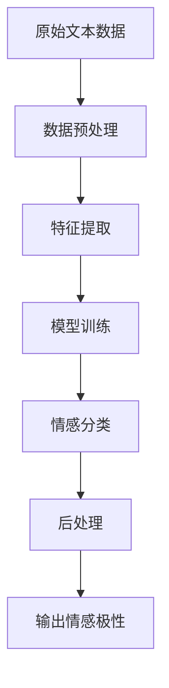

# 开发AI Agent的情感分析引擎

> 关键词：AI Agent、情感分析引擎、自然语言处理、机器学习、深度学习、文本分类、情感极性

> 摘要：本文围绕开发AI Agent的情感分析引擎展开，详细阐述了情感分析的核心概念、算法原理、数学模型等内容。通过Python代码示例展示了具体的实现步骤，结合项目实战讲解了开发环境搭建、代码实现与解读。同时探讨了情感分析引擎在多个实际场景中的应用，推荐了相关的学习资源、开发工具和论文著作。最后总结了情感分析引擎的未来发展趋势与挑战，并对常见问题进行了解答，为开发者提供了全面而深入的技术指导。

## 1. 背景介绍 
### 1.1 目的和范围
随着人工智能技术的飞速发展，AI Agent在各个领域得到了广泛应用。情感分析作为自然语言处理的重要分支，能够帮助AI Agent理解文本中的情感信息，从而更智能地与用户进行交互。本文章的目的在于详细介绍如何开发一个AI Agent的情感分析引擎，涵盖从核心概念到实际项目开发的全过程。范围包括情感分析的基本原理、常用算法、数学模型、代码实现以及实际应用场景等方面。

### 1.2 预期读者
本文预期读者主要包括对自然语言处理、人工智能开发感兴趣的程序员、软件工程师、数据科学家以及相关专业的学生。具备一定的编程基础（如Python）和机器学习知识将有助于更好地理解文章内容，但即使是初学者也可以通过本文逐步了解情感分析引擎的开发流程。

### 1.3 文档结构概述
本文将按照以下结构进行组织：首先介绍情感分析的核心概念与联系，包括其原理和架构；接着阐述核心算法原理并给出具体操作步骤，同时使用Python代码进行详细说明；然后讲解情感分析的数学模型和公式，并举例说明；之后通过项目实战展示代码的实际案例和详细解释；再探讨情感分析引擎的实际应用场景；推荐相关的学习资源、开发工具和论文著作；最后总结未来发展趋势与挑战，解答常见问题并提供扩展阅读和参考资料。

### 1.4 术语表
#### 1.4.1 核心术语定义
- **AI Agent**：人工智能代理，是一种能够感知环境、做出决策并采取行动以实现特定目标的软件实体。
- **情感分析**：又称意见挖掘，是指通过自然语言处理、文本挖掘等技术，识别和提取文本中表达的情感倾向，如积极、消极、中性等。
- **情感极性**：表示文本所表达的情感的正负属性，通常分为积极、消极和中性三种。
- **文本分类**：将文本划分到不同类别的任务，在情感分析中，就是将文本分为积极、消极或中性类别。

#### 1.4.2 相关概念解释
- **自然语言处理（NLP）**：是计算机科学与人工智能领域中的一个重要方向，它研究如何让计算机理解和处理人类语言，情感分析是NLP的一个具体应用。
- **机器学习**：是一门多领域交叉学科，涉及概率论、统计学、逼近论、凸分析、算法复杂度理论等多门学科。它专门研究计算机怎样模拟或实现人类的学习行为，以获取新的知识或技能，重新组织已有的知识结构使之不断改善自身的性能。在情感分析中，机器学习算法可以用于训练模型以进行情感分类。
- **深度学习**：是机器学习的一个分支领域，它是一种基于对数据进行表征学习的方法。深度学习通过构建具有很多层的神经网络模型，自动从大量数据中学习特征和模式，在情感分析中，深度学习模型如循环神经网络（RNN）、长短期记忆网络（LSTM）等取得了很好的效果。

#### 1.4.3 缩略词列表
- **NLP**：Natural Language Processing（自然语言处理）
- **ML**：Machine Learning（机器学习）
- **DL**：Deep Learning（深度学习）
- **RNN**：Recurrent Neural Network（循环神经网络）
- **LSTM**：Long Short-Term Memory（长短期记忆网络）
- **CNN**：Convolutional Neural Network（卷积神经网络）

## 2. 核心概念与联系 

### 核心概念原理
情感分析的核心目标是确定文本的情感极性，即判断文本是表达积极情感、消极情感还是中性情感。其基本原理是通过对文本进行特征提取和分析，然后使用分类算法将文本分类到相应的情感类别中。

在自然语言处理中，文本通常需要经过预处理步骤，如分词、去除停用词、词干提取等，以将文本转换为计算机能够处理的形式。然后，从预处理后的文本中提取特征，这些特征可以是词频、词性、句法结构等。最后，使用机器学习或深度学习算法对提取的特征进行训练和分类。

### 架构的文本示意图
情感分析引擎的架构可以分为以下几个主要部分：

1. **数据预处理模块**：负责对原始文本数据进行清洗、分词、去除停用词等操作，将文本转换为适合模型处理的格式。
2. **特征提取模块**：从预处理后的文本中提取特征，如词向量、TF-IDF值等。
3. **模型训练模块**：使用提取的特征和标注好的训练数据对分类模型进行训练。
4. **情感分类模块**：使用训练好的模型对新的文本进行情感分类，输出文本的情感极性。
5. **后处理模块**：对分类结果进行进一步的处理和优化，如合并相邻的相同情感文本、去除噪声等。

### Mermaid流程图


## 3. 核心算法原理 & 具体操作步骤 

### 朴素贝叶斯算法原理
朴素贝叶斯算法是一种基于贝叶斯定理和特征条件独立假设的分类算法。在情感分析中，它通过计算文本属于不同情感类别的概率来进行分类。

贝叶斯定理的公式为：

$$P(C|X)=\frac{P(X|C)P(C)}{P(X)}$$

其中，$P(C|X)$ 表示在给定特征 $X$ 的情况下，文本属于类别 $C$ 的概率；$P(X|C)$ 表示在类别 $C$ 下特征 $X$ 出现的概率；$P(C)$ 表示类别 $C$ 出现的先验概率；$P(X)$ 表示特征 $X$ 出现的概率。

在朴素贝叶斯算法中，假设特征之间是条件独立的，即：

$$P(X|C)=\prod_{i=1}^{n}P(x_i|C)$$

其中，$x_i$ 是特征 $X$ 的第 $i$ 个分量。

### 具体操作步骤
1. **数据准备**：收集标注好的文本数据，将其分为训练集和测试集。
2. **数据预处理**：对文本数据进行分词、去除停用词等操作。
3. **特征提取**：计算每个词在不同情感类别中的出现频率，使用TF-IDF等方法提取特征。
4. **模型训练**：使用训练集数据计算每个情感类别的先验概率和每个词在不同情感类别中的条件概率。
5. **情感分类**：对于新的文本，计算其属于不同情感类别的概率，选择概率最大的类别作为分类结果。

### Python源代码实现
```python
import numpy as np
from sklearn.feature_extraction.text import TfidfVectorizer
from sklearn.naive_bayes import MultinomialNB
from sklearn.model_selection import train_test_split
from sklearn.metrics import accuracy_score

# 示例数据
corpus = [
    "这部电影太棒了，我非常喜欢！",
    "这个产品质量太差了，我很失望。",
    "今天天气真好，心情也不错。",
    "这顿饭太难吃了，以后再也不来了。"
]
labels = [1, 0, 1, 0]  # 1表示积极，0表示消极

# 数据预处理和特征提取
vectorizer = TfidfVectorizer()
X = vectorizer.fit_transform(corpus)

# 划分训练集和测试集
X_train, X_test, y_train, y_test = train_test_split(X, labels, test_size=0.2, random_state=42)

# 模型训练
clf = MultinomialNB()
clf.fit(X_train, y_train)

# 模型预测
y_pred = clf.predict(X_test)

# 评估模型
accuracy = accuracy_score(y_test, y_pred)
print("模型准确率：", accuracy)
```

### 代码解释
1. **数据准备**：定义了一个示例文本数据集 `corpus` 和对应的情感标签 `labels`。
2. **数据预处理和特征提取**：使用 `TfidfVectorizer` 对文本数据进行处理，将文本转换为TF-IDF特征向量。
3. **划分训练集和测试集**：使用 `train_test_split` 函数将数据集划分为训练集和测试集。
4. **模型训练**：使用 `MultinomialNB` 模型对训练集数据进行训练。
5. **模型预测**：使用训练好的模型对测试集数据进行预测。
6. **评估模型**：使用 `accuracy_score` 函数计算模型的准确率。

## 4. 数学模型和公式 & 详细讲解 & 举例说明 

### 贝叶斯定理
贝叶斯定理是概率论中的一个重要定理，它描述了在已知某些条件下，某个事件发生的概率。其公式为：

$$P(C|X)=\frac{P(X|C)P(C)}{P(X)}$$

其中，$P(C|X)$ 称为后验概率，表示在给定特征 $X$ 的情况下，文本属于类别 $C$ 的概率；$P(X|C)$ 称为似然概率，表示在类别 $C$ 下特征 $X$ 出现的概率；$P(C)$ 称为先验概率，表示类别 $C$ 出现的概率；$P(X)$ 称为证据概率，表示特征 $X$ 出现的概率。

### 详细讲解
在情感分析中，我们的目标是根据文本的特征 $X$ 来判断文本属于哪个情感类别 $C$。贝叶斯定理提供了一种计算后验概率的方法，通过比较不同情感类别的后验概率，我们可以选择概率最大的类别作为文本的情感分类结果。

先验概率 $P(C)$ 可以通过训练数据中每个情感类别的样本数量来估计，即：

$$P(C)=\frac{N_C}{N}$$

其中，$N_C$ 是训练数据中属于类别 $C$ 的样本数量，$N$ 是训练数据的总样本数量。

似然概率 $P(X|C)$ 可以通过计算每个特征在类别 $C$ 下的出现频率来估计。在朴素贝叶斯算法中，由于假设特征之间是条件独立的，因此可以将 $P(X|C)$ 分解为每个特征的条件概率的乘积：

$$P(X|C)=\prod_{i=1}^{n}P(x_i|C)$$

其中，$x_i$ 是特征 $X$ 的第 $i$ 个分量。

证据概率 $P(X)$ 对于所有的情感类别都是相同的，因此在比较不同情感类别的后验概率时可以忽略不计。

### 举例说明
假设我们有一个文本分类问题，要判断一篇电影评论是积极的还是消极的。训练数据如下：

| 评论 | 情感类别 |
| --- | --- |
| 这部电影太棒了，剧情精彩，演员表演出色！ | 积极 |
| 这个电影太无聊了，剧情拖沓，演员演技差。 | 消极 |
| 电影的特效很棒，值得一看。 | 积极 |
| 电影的音效太差了，影响观看体验。 | 消极 |

我们要判断新的评论 “这部电影的剧情很精彩，特效也不错。” 的情感类别。

首先，计算先验概率：

$P(积极)=\frac{2}{4}=0.5$

$P(消极)=\frac{2}{4}=0.5$

然后，计算似然概率。假设我们使用词袋模型作为特征，文本中的每个词作为一个特征。对于新评论中的词 “剧情”、“精彩”、“特效”，分别计算它们在积极和消极类别下的条件概率：

$P(剧情|积极)=\frac{2}{6}$

$P(剧情|消极)=\frac{1}{6}$

$P(精彩|积极)=\frac{2}{6}$

$P(精彩|消极)=0$

$P(特效|积极)=\frac{1}{6}$

$P(特效|消极)=0$

由于假设特征之间是条件独立的，因此可以计算似然概率：

$P(X|积极)=P(剧情|积极)P(精彩|积极)P(特效|积极)=\frac{2}{6}\times\frac{2}{6}\times\frac{1}{6}=\frac{4}{216}$

$P(X|消极)=P(剧情|消极)P(精彩|消极)P(特效|消极)=\frac{1}{6}\times0\times0=0$

最后，计算后验概率：

$P(积极|X)=\frac{P(X|积极)P(积极)}{P(X)}=\frac{\frac{4}{216}\times0.5}{P(X)}$

$P(消极|X)=\frac{P(X|消极)P(消极)}{P(X)}=\frac{0\times0.5}{P(X)}=0$

由于 $P(积极|X)>P(消极|X)$，因此判断新评论的情感类别为积极。

## 5. 项目实战：代码实际案例和详细解释说明 

### 5.1  开发环境搭建
#### 安装Python
首先，确保你已经安装了Python 3.x 版本。可以从Python官方网站（https://www.python.org/downloads/）下载并安装适合你操作系统的Python版本。

#### 安装必要的库
使用以下命令安装所需的Python库：

```bash
pip install numpy scikit-learn pandas jieba
```

- `numpy`：用于数值计算。
- `scikit-learn`：提供了各种机器学习算法和工具。
- `pandas`：用于数据处理和分析。
- `jieba`：用于中文分词。

### 5.2  源代码详细实现和代码解读
```python
import pandas as pd
import jieba
from sklearn.feature_extraction.text import TfidfVectorizer
from sklearn.model_selection import train_test_split
from sklearn.naive_bayes import MultinomialNB
from sklearn.metrics import accuracy_score

# 读取数据
data = pd.read_csv('sentiment_data.csv')

# 数据预处理
def preprocess_text(text):
    # 分词
    words = jieba.lcut(text)
    # 去除停用词
    stopwords = set([line.strip() for line in open('stopwords.txt', 'r', encoding='utf-8').readlines()])
    filtered_words = [word for word in words if word not in stopwords]
    return ' '.join(filtered_words)

data['processed_text'] = data['text'].apply(preprocess_text)

# 特征提取
vectorizer = TfidfVectorizer()
X = vectorizer.fit_transform(data['processed_text'])
y = data['label']

# 划分训练集和测试集
X_train, X_test, y_train, y_test = train_test_split(X, y, test_size=0.2, random_state=42)

# 模型训练
clf = MultinomialNB()
clf.fit(X_train, y_train)

# 模型预测
y_pred = clf.predict(X_test)

# 评估模型
accuracy = accuracy_score(y_test, y_pred)
print("模型准确率：", accuracy)
```

### 代码解读与分析
1. **读取数据**：使用 `pandas` 库的 `read_csv` 函数读取包含文本数据和情感标签的CSV文件。
2. **数据预处理**：定义了一个 `preprocess_text` 函数，用于对文本进行分词和去除停用词操作。使用 `jieba` 库进行中文分词，从停用词文件中读取停用词并去除文本中的停用词。
3. **特征提取**：使用 `TfidfVectorizer` 对预处理后的文本进行特征提取，将文本转换为TF-IDF特征向量。
4. **划分训练集和测试集**：使用 `train_test_split` 函数将数据集划分为训练集和测试集，测试集占总数据的20%。
5. **模型训练**：使用 `MultinomialNB` 模型对训练集数据进行训练。
6. **模型预测**：使用训练好的模型对测试集数据进行预测。
7. **评估模型**：使用 `accuracy_score` 函数计算模型的准确率。

## 6. 实际应用场景 
### 社交媒体分析
在社交媒体平台上，用户会发布大量的文本信息，如微博、评论等。通过情感分析引擎，可以实时监测用户对某个话题、产品或事件的情感态度，帮助企业了解市场动态和用户需求，及时调整营销策略。

### 客户服务
在客户服务领域，情感分析引擎可以对客户的反馈和投诉进行分析，快速判断客户的情绪状态。如果客户表达了消极情绪，客服人员可以及时采取措施进行安抚和解决问题，提高客户满意度。

### 市场调研
在市场调研中，情感分析引擎可以对调查问卷、用户评价等文本数据进行分析，了解消费者对产品或服务的满意度和意见。这有助于企业发现产品的优势和不足，为产品改进和市场推广提供依据。

### 舆情监测
政府和企业可以使用情感分析引擎对新闻报道、论坛帖子等进行监测，了解公众对某个事件或政策的看法和态度。及时发现负面舆情并采取措施进行应对，维护社会稳定和企业形象。

### 金融领域
在金融领域，情感分析引擎可以对财经新闻、社交媒体上的金融相关信息进行分析，了解市场情绪和投资者的信心。这有助于金融机构做出更准确的投资决策和风险管理。

## 7. 工具和资源推荐
### 7.1 学习资源推荐
#### 7.1.1 书籍推荐
- 《Python自然语言处理实战：核心技术与算法》：全面介绍了Python在自然语言处理中的应用，包括文本预处理、特征提取、分类算法等内容，适合初学者入门。
- 《深度学习》：由Ian Goodfellow、Yoshua Bengio和Aaron Courville三位深度学习领域的权威专家撰写，系统地介绍了深度学习的基本原理和方法，是深度学习领域的经典教材。
- 《统计学习方法（第2版）》：李航博士的著作，详细介绍了各种机器学习算法的原理和实现，对于理解情感分析中的分类算法有很大帮助。

#### 7.1.2 在线课程
- Coursera上的“Natural Language Processing Specialization”：由斯坦福大学的教授授课，涵盖了自然语言处理的各个方面，包括情感分析、机器翻译等。
- edX上的“Introduction to Artificial Intelligence”：介绍了人工智能的基本概念和方法，包括机器学习、深度学习等内容，对于理解情感分析的技术背景有很大帮助。
- 网易云课堂上的“Python自然语言处理入门与实战”：结合实际案例，详细介绍了Python在自然语言处理中的应用，适合初学者学习。

#### 7.1.3 技术博客和网站
- 博客园：有很多开发者分享自然语言处理和情感分析的技术文章和实践经验。
- 开源中国：提供了丰富的开源项目和技术资料，对于学习情感分析的代码实现有很大帮助。
- Kaggle：是一个数据科学竞赛平台，上面有很多关于情感分析的数据集和竞赛项目，可以通过参与竞赛来提高自己的技术水平。

### 7.2 开发工具框架推荐
#### 7.2.1 IDE和编辑器
- PyCharm：是一款专业的Python集成开发环境，提供了代码编辑、调试、版本控制等功能，适合大规模项目的开发。
- Jupyter Notebook：是一个交互式的开发环境，支持Python代码的实时运行和可视化展示，适合数据探索和模型实验。
- Visual Studio Code：是一款轻量级的代码编辑器，支持多种编程语言和插件扩展，适合快速开发和调试。

#### 7.2.2 调试和性能分析工具
- Py-Spy：是一个Python性能分析工具，可以实时监测Python程序的CPU使用率和函数调用情况，帮助开发者找出性能瓶颈。
- TensorBoard：是TensorFlow提供的一个可视化工具，可以用于可视化深度学习模型的训练过程和性能指标，如损失函数、准确率等。
- Memory Profiler：是一个Python内存分析工具，可以帮助开发者找出内存泄漏和高内存使用的问题。

#### 7.2.3 相关框架和库
- Scikit-learn：是一个开源的机器学习库，提供了各种机器学习算法和工具，如分类、回归、聚类等，对于情感分析中的分类任务非常有用。
- TensorFlow：是一个开源的深度学习框架，由Google开发，提供了高效的深度学习模型训练和部署工具，支持多种深度学习模型，如卷积神经网络、循环神经网络等。
- PyTorch：是一个开源的深度学习框架，由Facebook开发，具有简洁易用的API和动态图机制，适合快速开发和实验深度学习模型。

### 7.3 相关论文著作推荐
#### 7.3.1 经典论文
- "Sentiment Analysis and Subjectivity"：由Bing Liu撰写，是情感分析领域的经典综述论文，系统地介绍了情感分析的基本概念、方法和应用。
- "Convolutional Neural Networks for Sentence Classification"：提出了使用卷积神经网络进行文本分类的方法，在情感分析任务中取得了很好的效果。
- "Long Short-Term Memory"：介绍了长短期记忆网络（LSTM）的原理和应用，LSTM在处理序列数据（如文本）方面具有很好的性能，在情感分析中也得到了广泛应用。

#### 7.3.2 最新研究成果
- ACL（Association for Computational Linguistics）会议：是自然语言处理领域的顶级会议，每年都会发表很多关于情感分析的最新研究成果。
- EMNLP（Conference on Empirical Methods in Natural Language Processing）会议：也是自然语言处理领域的重要会议，专注于实证方法在自然语言处理中的应用，包括情感分析、机器翻译等。
- arXiv：是一个预印本平台，上面有很多关于情感分析的最新研究论文，可以及时了解该领域的研究动态。

#### 7.3.3 应用案例分析
- 阿里巴巴的情感分析应用：阿里巴巴在电商平台上使用情感分析技术对商品评论进行分析，了解用户对商品的满意度和意见，为商家提供决策支持。
- 腾讯的舆情监测系统：腾讯使用情感分析技术对社交媒体上的舆情信息进行监测和分析，及时发现负面舆情并采取措施进行应对。
- 百度的智能客服：百度在智能客服系统中使用情感分析技术对用户的问题进行分类和情感判断，提供更个性化的服务。

## 8. 总结：未来发展趋势与挑战
### 未来发展趋势
#### 多模态情感分析
随着多媒体技术的发展，文本、图像、音频等多种模态的数据越来越丰富。未来的情感分析引擎将不仅仅局限于文本分析，还会结合图像、音频等多种模态的数据进行综合分析，提高情感分析的准确性和全面性。

#### 实时情感分析
在一些应用场景中，如社交媒体监测、客户服务等，需要实时获取文本的情感信息。未来的情感分析引擎将具备更高的实时性，能够快速处理大量的文本数据并及时输出情感分析结果。

#### 个性化情感分析
不同的用户对同一文本可能会有不同的情感反应，未来的情感分析引擎将考虑用户的个性化因素，如年龄、性别、文化背景等，提供更个性化的情感分析服务。

#### 跨语言情感分析
随着全球化的发展，跨语言的文本数据越来越多。未来的情感分析引擎将具备跨语言分析的能力，能够处理多种语言的文本数据，为不同语言的用户提供服务。

### 挑战
#### 数据质量和标注问题
情感分析的效果很大程度上依赖于训练数据的质量和标注的准确性。然而，获取高质量的标注数据是一项非常困难的任务，需要大量的人力和时间成本。此外，不同的标注人员可能会对同一文本有不同的情感判断，导致标注结果的不一致性。

#### 语义理解问题
自然语言具有丰富的语义和语境信息，文本的情感表达往往受到上下文的影响。目前的情感分析技术在处理复杂的语义和语境信息方面还存在一定的局限性，难以准确理解文本的真实情感。

#### 领域适应性问题
不同的领域（如医疗、金融、教育等）具有不同的语言特点和情感表达方式。现有的情感分析模型在一个领域训练后，在另一个领域的性能可能会下降。因此，如何提高情感分析模型的领域适应性是一个亟待解决的问题。

#### 隐私和安全问题
在情感分析过程中，需要处理大量的用户文本数据，这些数据可能包含用户的隐私信息。因此，如何保护用户的隐私和数据安全是一个重要的挑战。

## 9. 附录：常见问题与解答
### 问题1：如何选择合适的情感分析算法？
解答：选择合适的情感分析算法需要考虑多个因素，如数据规模、数据类型、计算资源等。如果数据规模较小，可以选择传统的机器学习算法，如朴素贝叶斯、支持向量机等；如果数据规模较大，可以选择深度学习算法，如卷积神经网络、循环神经网络等。此外，还需要根据数据的特点和任务的要求进行选择，如处理文本序列数据可以选择循环神经网络，处理图像数据可以选择卷积神经网络。

### 问题2：如何提高情感分析模型的准确率？
解答：提高情感分析模型的准确率可以从以下几个方面入手：
1. **数据预处理**：对文本数据进行清洗、分词、去除停用词等操作，提高数据的质量。
2. **特征提取**：选择合适的特征提取方法，如TF-IDF、词向量等，提取更有代表性的特征。
3. **模型选择和调优**：选择合适的情感分析模型，并对模型的参数进行调优，如调整学习率、正则化参数等。
4. **增加训练数据**：增加训练数据的规模和多样性，可以提高模型的泛化能力。
5. **集成学习**：使用集成学习方法，如Bagging、Boosting等，将多个模型的结果进行融合，提高模型的准确率。

### 问题3：如何处理中文文本的情感分析？
解答：处理中文文本的情感分析需要考虑中文的语言特点，如分词、词性标注等。可以使用中文分词工具，如jieba、THULAC等对中文文本进行分词处理；使用词性标注工具，如HanLP、LTP等对分词后的文本进行词性标注。此外，还可以使用中文预训练模型，如BERT、ERNIE等，提高情感分析的效果。

### 问题4：情感分析引擎可以应用于哪些行业？
解答：情感分析引擎可以应用于多个行业，如社交媒体、客户服务、市场调研、舆情监测、金融等。在社交媒体行业，可以使用情感分析引擎监测用户对某个话题、产品或事件的情感态度；在客户服务行业，可以使用情感分析引擎对客户的反馈和投诉进行分析，提高客户满意度；在市场调研行业，可以使用情感分析引擎对调查问卷、用户评价等文本数据进行分析，了解消费者的需求和意见；在舆情监测行业，可以使用情感分析引擎对新闻报道、论坛帖子等进行监测，及时发现负面舆情并采取措施进行应对；在金融行业，可以使用情感分析引擎对财经新闻、社交媒体上的金融相关信息进行分析，了解市场情绪和投资者的信心。

## 10. 扩展阅读 & 参考资料
### 扩展阅读
- 《自然语言处理入门》：介绍了自然语言处理的基本概念和方法，包括分词、词性标注、命名实体识别等内容，适合进一步深入学习自然语言处理技术。
- 《深度学习实战》：结合实际案例，详细介绍了深度学习的应用和实践，包括图像识别、语音识别、自然语言处理等领域。
- 《人工智能简史》：回顾了人工智能的发展历程，介绍了人工智能的主要学派和研究方向，对于了解人工智能的发展背景和趋势有很大帮助。

### 参考资料
- [Scikit-learn官方文档](https://scikit-learn.org/stable/)
- [TensorFlow官方文档](https://www.tensorflow.org/api_docs)
- [PyTorch官方文档](https://pytorch.org/docs/stable/index.html)
- [jieba官方文档](https://github.com/fxsjy/jieba)

作者：AI天才研究院/AI Genius Institute & 禅与计算机程序设计艺术 /Zen And The Art of Computer Programming