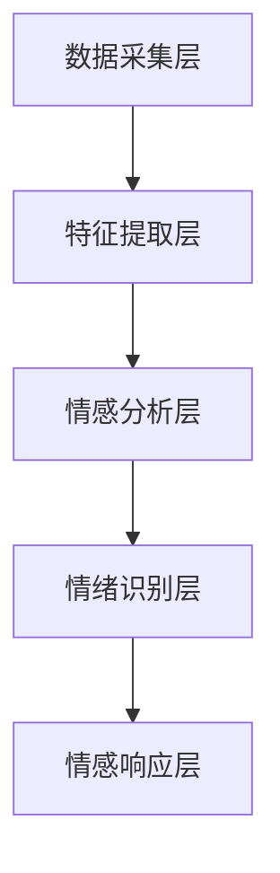

# 开发AI Agent的情感计算模块

> 关键词：AI Agent、情感计算模块、自然语言处理、机器学习、深度学习、情感分析、情绪识别

> 摘要：本文围绕开发AI Agent的情感计算模块展开，深入探讨该模块的核心概念、算法原理、数学模型以及具体实现步骤。通过详细的项目实战案例，展示如何搭建开发环境、实现源代码并进行解读分析。同时，介绍了情感计算模块的实际应用场景，推荐了相关的学习资源、开发工具框架和论文著作。最后，总结了情感计算模块未来的发展趋势与挑战，并提供常见问题解答及扩展阅读参考资料，旨在为开发者全面了解和开发AI Agent的情感计算模块提供专业且系统的指导。

## 1. 背景介绍 
### 1.1 目的和范围
随着人工智能技术的飞速发展，AI Agent在各个领域的应用日益广泛。为了使AI Agent能够更好地与人类进行交互，理解人类的情感和意图变得至关重要。情感计算模块作为AI Agent的重要组成部分，旨在让AI Agent能够感知、分析和响应人类的情感。本文章的范围涵盖了情感计算模块的核心概念、算法原理、数学模型、项目实战以及实际应用场景等方面，为开发者提供全面的技术指导，帮助他们开发出高效、准确的情感计算模块。

### 1.2 预期读者
本文预期读者包括人工智能领域的开发者、研究人员、软件工程师、对情感计算感兴趣的技术爱好者以及相关专业的学生。无论您是初学者还是有一定经验的专业人士，都能从本文中获取有价值的信息和技术知识。

### 1.3 文档结构概述
本文将按照以下结构进行组织：首先介绍情感计算模块的背景信息，包括目的、预期读者和文档结构概述；接着阐述核心概念与联系，通过文本示意图和Mermaid流程图展示其原理和架构；然后详细讲解核心算法原理及具体操作步骤，结合Python源代码进行说明；随后介绍数学模型和公式，并举例说明；通过项目实战展示代码实际案例和详细解释；接着介绍情感计算模块的实际应用场景；推荐相关的工具和资源；总结未来发展趋势与挑战；提供常见问题与解答；最后列出扩展阅读和参考资料。

### 1.4 术语表
#### 1.4.1 核心术语定义
- **AI Agent**：人工智能代理，是一种能够感知环境、做出决策并采取行动的智能实体。
- **情感计算**：研究如何让计算机感知、理解和表达人类情感的领域。
- **情感分析**：对文本、语音等数据进行处理，以确定其中所包含的情感倾向，如积极、消极或中性。
- **情绪识别**：识别出具体的情绪类型，如快乐、悲伤、愤怒等。

#### 1.4.2 相关概念解释
- **自然语言处理（NLP）**：是情感计算模块中常用的技术，用于处理和分析人类语言，包括文本分类、词性标注、命名实体识别等任务。
- **机器学习**：通过训练模型从数据中学习模式和规律，用于情感分析和情绪识别等任务。
- **深度学习**：是机器学习的一个分支，利用深度神经网络模型处理复杂的数据，在情感计算领域取得了很好的效果。

#### 1.4.3 缩略词列表
- **NLP**：Natural Language Processing（自然语言处理）
- **ML**：Machine Learning（机器学习）
- **DL**：Deep Learning（深度学习）
- **CNN**：Convolutional Neural Network（卷积神经网络）
- **RNN**：Recurrent Neural Network（循环神经网络）
- **LSTM**：Long Short-Term Memory（长短期记忆网络）

## 2. 核心概念与联系 
情感计算模块的核心目标是让AI Agent能够理解和处理人类的情感信息。其主要涉及以下几个核心概念：

### 情感感知
情感感知是情感计算模块的第一步，它通过各种传感器或数据源获取人类的情感相关信息，如文本、语音、面部表情、生理信号等。例如，在文本情感分析中，通过对用户输入的文本进行处理，提取其中的情感特征。

### 情感分析
情感分析是对感知到的情感信息进行处理和分析，以确定情感的倾向和强度。常见的情感倾向包括积极、消极和中性，情感强度则表示情感的强烈程度。例如，在文本情感分析中，可以使用机器学习或深度学习模型对文本进行分类，判断其情感倾向。

### 情绪识别
情绪识别是在情感分析的基础上，进一步识别出具体的情绪类型，如快乐、悲伤、愤怒、恐惧等。情绪识别可以帮助AI Agent更准确地理解人类的情感状态，从而做出更合适的响应。

### 情感响应
情感响应是指AI Agent根据感知到的情感信息和分析结果，做出相应的行为或表达。例如，当检测到用户处于积极情绪时，AI Agent可以给予积极的反馈和鼓励；当检测到用户处于消极情绪时，AI Agent可以给予安慰和支持。

下面是情感计算模块的原理和架构的文本示意图：

情感计算模块主要由数据采集层、特征提取层、情感分析层、情绪识别层和情感响应层组成。数据采集层负责收集各种情感相关的数据，如文本、语音等；特征提取层对采集到的数据进行处理，提取其中的情感特征；情感分析层使用机器学习或深度学习模型对特征进行分析，确定情感倾向；情绪识别层进一步识别出具体的情绪类型；情感响应层根据分析结果做出相应的行为或表达。

Mermaid流程图如下：


## 3. 核心算法原理 & 具体操作步骤 
### 基于机器学习的文本情感分析算法
在文本情感分析中，常用的机器学习算法包括朴素贝叶斯、支持向量机等。下面以朴素贝叶斯算法为例，详细讲解其原理和具体操作步骤。

#### 算法原理
朴素贝叶斯算法是基于贝叶斯定理和特征条件独立假设的分类算法。对于给定的训练数据集，朴素贝叶斯算法首先学习输入输出的联合概率分布，然后基于此模型，对给定的输入 $x$，利用贝叶斯定理求出后验概率最大的输出 $y$。

贝叶斯定理的公式为：
$P(Y|X)=\frac{P(X|Y)P(Y)}{P(X)}$

其中，$P(Y|X)$ 表示在特征 $X$ 出现的条件下类别 $Y$ 出现的概率，$P(X|Y)$ 表示在类别 $Y$ 出现的条件下特征 $X$ 出现的概率，$P(Y)$ 表示类别 $Y$ 出现的先验概率，$P(X)$ 表示特征 $X$ 出现的概率。

在朴素贝叶斯算法中，假设特征之间相互独立，即：
$P(X|Y)=\prod_{i=1}^{n}P(x_i|Y)$

其中，$x_i$ 表示第 $i$ 个特征。

#### 具体操作步骤
1. **数据预处理**：对文本数据进行清洗、分词、去除停用词等操作，将文本转换为适合机器学习模型处理的格式。
2. **特征提取**：从预处理后的文本中提取特征，常用的特征提取方法包括词袋模型、TF-IDF等。
3. **模型训练**：使用训练数据集对朴素贝叶斯模型进行训练，学习输入输出的联合概率分布。
4. **模型预测**：使用训练好的模型对测试数据集进行预测，得到文本的情感倾向。

#### Python源代码实现
```python
import numpy as np
from sklearn.feature_extraction.text import CountVectorizer
from sklearn.naive_bayes import MultinomialNB
from sklearn.model_selection import train_test_split
from sklearn.metrics import accuracy_score

# 示例数据
corpus = [
    "这部电影太棒了，我非常喜欢",
    "这个产品质量太差了，很不满意",
    "今天的天气真好，心情也很好",
    "这顿饭太难吃了，以后不会再来了"
]
labels = [1, 0, 1, 0]  # 1表示积极，0表示消极

# 数据预处理和特征提取
vectorizer = CountVectorizer()
X = vectorizer.fit_transform(corpus)

# 划分训练集和测试集
X_train, X_test, y_train, y_test = train_test_split(X, labels, test_size=0.2, random_state=42)

# 模型训练
clf = MultinomialNB()
clf.fit(X_train, y_train)

# 模型预测
y_pred = clf.predict(X_test)

# 模型评估
accuracy = accuracy_score(y_test, y_pred)
print("模型准确率：", accuracy)
```

### 基于深度学习的文本情感分析算法
深度学习在文本情感分析中也取得了很好的效果，常用的深度学习模型包括卷积神经网络（CNN）、循环神经网络（RNN）及其变体长短期记忆网络（LSTM）等。下面以LSTM为例，详细讲解其原理和具体操作步骤。

#### 算法原理
LSTM是一种特殊的RNN，它能够解决传统RNN中的梯度消失问题，从而更好地处理序列数据。LSTM通过门控机制来控制信息的流动，包括输入门、遗忘门和输出门。

输入门决定了当前输入信息有多少可以进入细胞状态；遗忘门决定了细胞状态中的哪些信息需要被遗忘；输出门决定了细胞状态中的哪些信息可以输出。

#### 具体操作步骤
1. **数据预处理**：对文本数据进行清洗、分词、去除停用词等操作，将文本转换为适合深度学习模型处理的格式，如词向量。
2. **模型构建**：构建LSTM模型，包括输入层、LSTM层、全连接层等。
3. **模型训练**：使用训练数据集对LSTM模型进行训练，学习文本的情感特征。
4. **模型预测**：使用训练好的模型对测试数据集进行预测，得到文本的情感倾向。

#### Python源代码实现
```python
import numpy as np
from tensorflow.keras.preprocessing.text import Tokenizer
from tensorflow.keras.preprocessing.sequence import pad_sequences
from tensorflow.keras.models import Sequential
from tensorflow.keras.layers import Embedding, LSTM, Dense
from sklearn.model_selection import train_test_split

# 示例数据
corpus = [
    "这部电影太棒了，我非常喜欢",
    "这个产品质量太差了，很不满意",
    "今天的天气真好，心情也很好",
    "这顿饭太难吃了，以后不会再来了"
]
labels = [1, 0, 1, 0]  # 1表示积极，0表示消极

# 数据预处理
tokenizer = Tokenizer()
tokenizer.fit_on_texts(corpus)
sequences = tokenizer.texts_to_sequences(corpus)
max_length = max([len(seq) for seq in sequences])
X = pad_sequences(sequences, maxlen=max_length)

# 划分训练集和测试集
X_train, X_test, y_train, y_test = train_test_split(X, labels, test_size=0.2, random_state=42)

# 模型构建
model = Sequential()
model.add(Embedding(input_dim=len(tokenizer.word_index) + 1, output_dim=100, input_length=max_length))
model.add(LSTM(100))
model.add(Dense(1, activation='sigmoid'))

# 模型编译
model.compile(optimizer='adam', loss='binary_crossentropy', metrics=['accuracy'])

# 模型训练
model.fit(X_train, np.array(y_train), epochs=10, batch_size=1)

# 模型预测
y_pred = model.predict(X_test)
y_pred = np.round(y_pred).flatten()

# 模型评估
accuracy = np.mean(y_pred == np.array(y_test))
print("模型准确率：", accuracy)
```

## 4. 数学模型和公式 & 详细讲解 & 举例说明 
### 朴素贝叶斯算法的数学模型和公式
#### 数学模型
朴素贝叶斯算法的数学模型基于贝叶斯定理和特征条件独立假设。对于一个文本分类问题，假设有 $K$ 个类别 $C_1,C_2,\cdots,C_K$，文本的特征向量为 $X=(x_1,x_2,\cdots,x_n)$，其中 $x_i$ 表示第 $i$ 个特征。

根据贝叶斯定理，文本属于类别 $C_k$ 的后验概率为：
$P(C_k|X)=\frac{P(X|C_k)P(C_k)}{P(X)}$

由于对于所有的类别 $C_k$，$P(X)$ 是相同的，因此在分类时可以只比较 $P(X|C_k)P(C_k)$ 的大小。

#### 公式详细讲解
- **先验概率 $P(C_k)$**：表示类别 $C_k$ 在训练数据集中出现的概率，可以通过以下公式计算：
$P(C_k)=\frac{N_{C_k}}{N}$

其中，$N_{C_k}$ 表示属于类别 $C_k$ 的样本数量，$N$ 表示训练数据集的总样本数量。

- **条件概率 $P(X|C_k)$**：表示在类别 $C_k$ 出现的条件下特征 $X$ 出现的概率。由于朴素贝叶斯算法假设特征之间相互独立，因此：
$P(X|C_k)=\prod_{i=1}^{n}P(x_i|C_k)$

其中，$P(x_i|C_k)$ 表示在类别 $C_k$ 出现的条件下特征 $x_i$ 出现的概率，可以通过以下公式计算：
$P(x_i|C_k)=\frac{N_{x_i,C_k}+\alpha}{N_{C_k}+\alpha V}$

其中，$N_{x_i,C_k}$ 表示属于类别 $C_k$ 且包含特征 $x_i$ 的样本数量，$N_{C_k}$ 表示属于类别 $C_k$ 的样本数量，$V$ 表示特征的总数，$\alpha$ 是平滑参数，通常取 1。

#### 举例说明
假设有一个文本分类问题，训练数据集包含以下 4 个样本：
| 文本 | 类别 |
| --- | --- |
| 这部电影太棒了，我非常喜欢 | 积极 |
| 这个产品质量太差了，很不满意 | 消极 |
| 今天的天气真好，心情也很好 | 积极 |
| 这顿饭太难吃了，以后不会再来了 | 消极 |

首先，计算先验概率：
$P(积极)=\frac{2}{4}=0.5$
$P(消极)=\frac{2}{4}=0.5$

然后，计算条件概率。假设我们要计算“电影”这个特征在“积极”类别下的条件概率，$N_{电影,积极}=1$，$N_{积极}=2$，$V$ 为所有特征的总数，假设为 10，$\alpha=1$，则：
$P(电影|积极)=\frac{1 + 1}{2 + 1\times10}=\frac{2}{12}=\frac{1}{6}$

同理，可以计算其他特征在不同类别下的条件概率。最后，对于一个新的文本，根据上述公式计算其属于不同类别的后验概率，选择后验概率最大的类别作为预测结果。

### LSTM模型的数学模型和公式
#### 数学模型
LSTM模型通过门控机制来控制信息的流动，包括输入门、遗忘门和输出门。LSTM单元的结构如下：

- **遗忘门**：决定了细胞状态中的哪些信息需要被遗忘。
$f_t=\sigma(W_f[h_{t-1},x_t]+b_f)$

其中，$f_t$ 表示遗忘门的输出，$\sigma$ 是 sigmoid 函数，$W_f$ 是遗忘门的权重矩阵，$h_{t-1}$ 是上一个时间步的隐藏状态，$x_t$ 是当前时间步的输入，$b_f$ 是遗忘门的偏置。

- **输入门**：决定了当前输入信息有多少可以进入细胞状态。
$i_t=\sigma(W_i[h_{t-1},x_t]+b_i)$
$\tilde{C}_t=\tanh(W_C[h_{t-1},x_t]+b_C)$

其中，$i_t$ 表示输入门的输出，$\tilde{C}_t$ 表示候选细胞状态，$W_i$ 和 $W_C$ 分别是输入门和候选细胞状态的权重矩阵，$b_i$ 和 $b_C$ 分别是输入门和候选细胞状态的偏置。

- **细胞状态更新**：根据遗忘门和输入门的输出，更新细胞状态。
$C_t=f_t\odot C_{t-1}+i_t\odot\tilde{C}_t$

其中，$C_t$ 表示当前时间步的细胞状态，$\odot$ 表示逐元素相乘。

- **输出门**：决定了细胞状态中的哪些信息可以输出。
$o_t=\sigma(W_o[h_{t-1},x_t]+b_o)$
$h_t=o_t\odot\tanh(C_t)$

其中，$o_t$ 表示输出门的输出，$h_t$ 表示当前时间步的隐藏状态，$W_o$ 是输出门的权重矩阵，$b_o$ 是输出门的偏置。

#### 公式详细讲解
- **sigmoid 函数**：$\sigma(x)=\frac{1}{1 + e^{-x}}$，其作用是将输入值映射到 $(0,1)$ 区间，用于控制信息的流动。
- **tanh 函数**：$\tanh(x)=\frac{e^x - e^{-x}}{e^x + e^{-x}}$，其作用是将输入值映射到 $(-1,1)$ 区间，用于对信息进行非线性变换。

#### 举例说明
假设我们有一个时间步的输入 $x_t