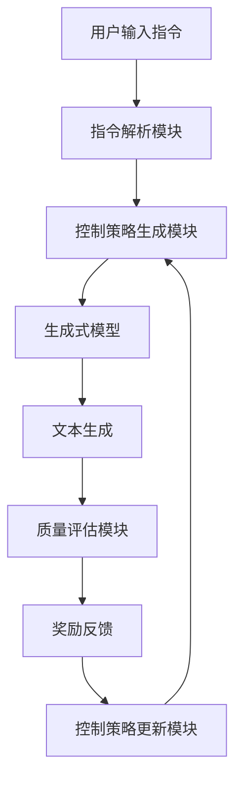

# 开发AI Agent的文本生成控制能力

> 关键词：AI Agent、文本生成控制、核心算法、数学模型、项目实战

> 摘要：本文聚焦于开发AI Agent的文本生成控制能力，旨在全面深入地探讨这一领域的相关知识。首先介绍背景信息，包括目的范围、预期读者等内容。接着阐述核心概念与联系，通过文本示意图和Mermaid流程图直观呈现。详细讲解核心算法原理，结合Python代码进行说明，同时介绍相关数学模型和公式并举例。通过项目实战展示代码实际案例和详细解释。分析实际应用场景，推荐相关工具和资源，最后总结未来发展趋势与挑战，还设有常见问题解答和扩展阅读参考资料，为开发者和研究者提供全面且有深度的技术指导。

## 1. 背景介绍 
### 1.1 目的和范围
随着人工智能技术的飞速发展，AI Agent在各个领域的应用日益广泛，其中文本生成是其重要的应用场景之一。开发AI Agent的文本生成控制能力的目的在于让AI Agent能够根据用户的特定需求，生成高质量、符合要求的文本内容。这不仅可以提高文本生成的效率和准确性，还能拓展AI Agent在新闻写作、智能客服、内容创作等多个领域的应用。

本文章的范围涵盖了从核心概念的理解到实际项目的开发，包括核心算法原理的讲解、数学模型的分析、实际应用场景的探讨以及相关工具和资源的推荐等方面，为读者提供一个全面的关于开发AI Agent文本生成控制能力的知识体系。

### 1.2 预期读者
本文预期读者主要包括以下几类人群：
- 人工智能开发者：希望深入了解AI Agent文本生成控制能力的开发技术，提升自己在该领域的开发水平。
- 研究者：对AI Agent的文本生成机制和控制策略感兴趣，致力于相关学术研究。
- 企业技术人员：负责企业内部AI Agent系统的开发和维护，需要掌握文本生成控制能力以满足业务需求。
- 对人工智能有一定了解的爱好者：希望进一步学习AI Agent文本生成控制的相关知识，拓宽自己的技术视野。

### 1.3 文档结构概述
本文将按照以下结构进行阐述：
- 核心概念与联系：介绍AI Agent文本生成控制能力的核心概念，通过文本示意图和Mermaid流程图展示其原理和架构。
- 核心算法原理 & 具体操作步骤：详细讲解核心算法原理，使用Python代码进行具体实现和步骤说明。
- 数学模型和公式 & 详细讲解 & 举例说明：介绍相关数学模型和公式，并通过具体例子进行详细讲解。
- 项目实战：通过实际项目案例，展示开发环境搭建、源代码实现和代码解读等过程。
- 实际应用场景：分析AI Agent文本生成控制能力在不同领域的实际应用场景。
- 工具和资源推荐：推荐相关的学习资源、开发工具框架和论文著作。
- 总结：总结未来发展趋势与挑战。
- 附录：解答常见问题。
- 扩展阅读 & 参考资料：提供进一步学习的扩展阅读内容和参考资料。

### 1.4 术语表
#### 1.4.1 核心术语定义
- **AI Agent**：人工智能代理，是一种能够感知环境、自主决策并采取行动以实现特定目标的智能实体。
- **文本生成控制能力**：指AI Agent能够根据用户的指令和约束条件，生成符合要求的文本内容的能力。
- **生成式模型**：一种能够根据输入生成新的输出的模型，常用于文本生成任务。
- **强化学习**：一种机器学习方法，通过智能体与环境进行交互，根据环境反馈的奖励信号来学习最优策略。

#### 1.4.2 相关概念解释
- **注意力机制**：在自然语言处理中，注意力机制可以帮助模型聚焦于输入序列中的重要部分，从而提高模型的性能。
- **Transformer架构**：一种基于注意力机制的深度学习架构，在自然语言处理任务中取得了显著的成果。
- **语言模型**：一种用于预测文本序列中下一个词的概率分布的模型，是文本生成的基础。

#### 1.4.3 缩略词列表
- **NLP**：Natural Language Processing，自然语言处理
- **RL**：Reinforcement Learning，强化学习
- **GPT**：Generative Pretrained Transformer，生成式预训练变压器

## 2. 核心概念与联系 

### 核心概念原理
AI Agent的文本生成控制能力主要基于生成式模型和强化学习。生成式模型用于生成文本，而强化学习则用于对生成的文本进行控制和优化。

生成式模型通常采用语言模型，如GPT系列模型。这些模型通过大量的文本数据进行预训练，学习到语言的模式和规律，从而能够根据输入生成连贯的文本。然而，生成式模型生成的文本往往缺乏针对性和可控性，因此需要引入强化学习来进行控制。

强化学习通过智能体与环境进行交互，根据环境反馈的奖励信号来学习最优策略。在文本生成控制中，智能体就是AI Agent，环境是文本生成的任务要求和约束条件，奖励信号则根据生成文本的质量和符合要求的程度来确定。通过不断地与环境交互和学习，AI Agent可以逐渐掌握如何生成符合要求的文本。

### 架构的文本示意图
以下是一个简单的AI Agent文本生成控制能力的架构示意图：

用户输入指令 -> 指令解析模块 -> 控制策略生成模块 -> 生成式模型 -> 文本生成 -> 质量评估模块 -> 奖励反馈 -> 控制策略更新模块

用户输入指令后，指令解析模块对指令进行解析，提取关键信息。控制策略生成模块根据解析后的指令生成相应的控制策略，指导生成式模型进行文本生成。生成式模型根据控制策略生成文本，质量评估模块对生成的文本进行质量评估，根据评估结果给出奖励反馈。控制策略更新模块根据奖励反馈更新控制策略，以便在下一次生成中生成更符合要求的文本。

### Mermaid流程图


## 3. 核心算法原理 & 具体操作步骤 

### 核心算法原理
在开发AI Agent的文本生成控制能力中，核心算法主要涉及生成式模型和强化学习。这里以基于Transformer架构的生成式模型和基于策略梯度的强化学习算法为例进行讲解。

#### 生成式模型（Transformer）
Transformer架构是一种基于注意力机制的深度学习架构，由编码器和解码器组成。编码器将输入序列转换为一系列的特征表示，解码器根据这些特征表示生成输出序列。

在文本生成任务中，解码器的输入是之前生成的文本序列，输出是下一个词的概率分布。通过不断地选择概率最大的词，就可以逐步生成完整的文本。

#### 强化学习（策略梯度）
策略梯度算法是一种基于策略的强化学习算法，通过优化策略网络来最大化累积奖励。在文本生成控制中，策略网络根据当前的状态（如用户指令、之前生成的文本等）输出一个动作（即生成下一个词的概率分布）。

智能体根据策略网络输出的动作与环境进行交互，得到奖励反馈。策略网络根据奖励反馈更新参数，使得在相同状态下选择的动作能够获得更高的奖励。

### 具体操作步骤
以下是使用Python代码实现AI Agent文本生成控制能力的具体步骤：

```python
import torch
import torch.nn as nn
import torch.optim as optim
from transformers import GPT2LMHeadModel, GPT2Tokenizer

# 1. 加载预训练的生成式模型和分词器
tokenizer = GPT2Tokenizer.from_pretrained('gpt2')
model = GPT2LMHeadModel.from_pretrained('gpt2')

# 2. 定义策略网络
class PolicyNetwork(nn.Module):
    def __init__(self, input_size, output_size):
        super(PolicyNetwork, self).__init__()
        self.fc = nn.Linear(input_size, output_size)

    def forward(self, x):
        return torch.softmax(self.fc(x), dim=-1)

# 3. 初始化策略网络和优化器
input_size = model.config.hidden_size
output_size = tokenizer.vocab_size
policy_network = PolicyNetwork(input_size, output_size)
optimizer = optim.Adam(policy_network.parameters(), lr=0.001)

# 4. 定义奖励函数
def reward_function(generated_text, target_text):
    # 简单示例：计算生成文本与目标文本的相似度
    from difflib import SequenceMatcher
    similarity = SequenceMatcher(None, generated_text, target_text).ratio()
    return similarity

# 5. 训练过程
num_episodes = 100
for episode in range(num_episodes):
    # 初始化状态
    input_text = "Once upon a time"
    input_ids = tokenizer.encode(input_text, return_tensors='pt')
    target_text = "Once upon a time there was a little girl"

    # 生成文本
    generated_text = input_text
    for _ in range(20):
        with torch.no_grad():
            outputs = model(input_ids)
            last_hidden_state = outputs.last_hidden_state[:, -1, :]
        action_probs = policy_network(last_hidden_state)
        action = torch.multinomial(action_probs, num_samples=1).item()
        next_token = tokenizer.decode([action])
        generated_text += next_token
        input_ids = torch.cat([input_ids, torch.tensor([[action]])], dim=-1)

    # 计算奖励
    reward = reward_function(generated_text, target_text)

    # 更新策略网络
    optimizer.zero_grad()
    log_probs = torch.log(action_probs)
    loss = -log_probs[0, action] * reward
    loss.backward()
    optimizer.step()

    print(f"Episode {episode}: Reward = {reward}, Generated Text = {generated_text}")
```

### 代码解释
1. **加载预训练的生成式模型和分词器**：使用`transformers`库加载预训练的GPT-2模型和对应的分词器。
2. **定义策略网络**：策略网络是一个简单的全连接神经网络，输入是生成式模型的最后一个隐藏状态，输出是下一个词的概率分布。
3. **初始化策略网络和优化器**：使用Adam优化器对策略网络的参数进行优化。
4. **定义奖励函数**：奖励函数用于评估生成文本的质量，这里简单地使用生成文本与目标文本的相似度作为奖励。
5. **训练过程**：在每个训练周期中，首先初始化输入文本，然后使用生成式模型和策略网络逐步生成文本。计算生成文本的奖励，并根据奖励更新策略网络的参数。

## 4. 数学模型和公式 & 详细讲解 & 举例说明 

### 生成式模型（Transformer）的数学模型和公式
#### 注意力机制
Transformer中的注意力机制通过计算查询（Query）、键（Key）和值（Value）之间的相似度来确定输入序列中每个位置的重要性。具体公式如下：

$$Attention(Q, K, V) = softmax(\frac{QK^T}{\sqrt{d_k}})V$$

其中，$Q$ 是查询矩阵，$K$ 是键矩阵，$V$ 是值矩阵，$d_k$ 是键的维度。

#### 多头注意力机制
多头注意力机制通过将注意力机制并行应用多次，然后将结果拼接起来，以捕捉不同方面的信息。具体公式如下：

$$MultiHead(Q, K, V) = Concat(head_1, head_2, \cdots, head_h)W^O$$

其中，$head_i = Attention(QW_i^Q, KW_i^K, VW_i^V)$，$W_i^Q$、$W_i^K$、$W_i^V$ 和 $W^O$ 是可学习的参数矩阵，$h$ 是头的数量。

#### 解码器的输出
解码器的输出是下一个词的概率分布，通过对最后一个隐藏状态进行线性变换和softmax操作得到。具体公式如下：

$$P(y_{t+1}|y_1, y_2, \cdots, y_t) = softmax(W_{out}h_t + b_{out})$$

其中，$y_{t+1}$ 是下一个词，$y_1, y_2, \cdots, y_t$ 是之前生成的词，$W_{out}$ 和 $b_{out}$ 是可学习的参数矩阵和偏置向量，$h_t$ 是解码器的最后一个隐藏状态。

### 强化学习（策略梯度）的数学模型和公式
#### 策略网络
策略网络 $\pi_{\theta}(a|s)$ 表示在状态 $s$ 下选择动作 $a$ 的概率，其中 $\theta$ 是策略网络的参数。

#### 累积奖励
累积奖励 $R_t$ 表示从时间步 $t$ 开始到最终状态的所有奖励之和，通常使用折扣因子 $\gamma$ 来考虑未来奖励的重要性。具体公式如下：

$$R_t = \sum_{k=0}^{\infty} \gamma^k r_{t+k}$$

其中，$r_{t+k}$ 是时间步 $t+k$ 的奖励。

#### 策略梯度定理
策略梯度定理表明，策略网络的参数更新方向可以通过最大化累积奖励的期望来确定。具体公式如下：

$$\nabla_{\theta} J(\theta) = \mathbb{E}_{\tau \sim \pi_{\theta}}[\sum_{t=0}^{T} \nabla_{\theta} \log \pi_{\theta}(a_t|s_t) R_t]$$

其中，$J(\theta)$ 是策略网络的目标函数，$\tau$ 是一个轨迹，$s_t$ 和 $a_t$ 分别是时间步 $t$ 的状态和动作，$T$ 是轨迹的长度。

### 举例说明
假设我们要生成一个描述动物的文本，目标文本是“a cute little cat”。初始输入文本是“a”。

在生成过程中，生成式模型根据输入文本生成一个隐藏状态，策略网络根据这个隐藏状态输出下一个词的概率分布。假设策略网络输出的概率分布为：$P(“cute”) = 0.8$，$P(“big”) = 0.2$。

我们根据这个概率分布选择下一个词，假设选择了“cute”。生成式模型根据新的输入“a cute”生成新的隐藏状态，策略网络再次输出下一个词的概率分布，以此类推，直到生成完整的文本。

在计算奖励时，我们比较生成的文本和目标文本的相似度。如果生成的文本是“a cute little cat”，则相似度为1，奖励为1；如果生成的文本是“a big dog”，则相似度较低，奖励也较低。

根据奖励反馈，策略网络更新参数，使得在相同状态下选择更有可能生成符合目标文本的词的概率增加。

## 5. 项目实战：代码实际案例和详细解释说明 

### 5.1  开发环境搭建
#### 安装Python
首先，确保你已经安装了Python 3.6或更高版本。你可以从Python官方网站（https://www.python.org/downloads/）下载并安装Python。

#### 安装必要的库
使用`pip`安装以下必要的库：
```sh
pip install torch transformers
```

### 5.2  源代码详细实现和代码解读
```python
import torch
import torch.nn as nn
import torch.optim as optim
from transformers import GPT2LMHeadModel, GPT2Tokenizer

# 加载预训练的生成式模型和分词器
tokenizer = GPT2Tokenizer.from_pretrained('gpt2')
model = GPT2LMHeadModel.from_pretrained('gpt2')

# 定义策略网络
class PolicyNetwork(nn.Module):
    def __init__(self, input_size, output_size):
        super(PolicyNetwork, self).__init__()
        self.fc = nn.Linear(input_size, output_size)

    def forward(self, x):
        return torch.softmax(self.fc(x), dim=-1)

# 初始化策略网络和优化器
input_size = model.config.hidden_size
output_size = tokenizer.vocab_size
policy_network = PolicyNetwork(input_size, output_size)
optimizer = optim.Adam(policy_network.parameters(), lr=0.001)

# 定义奖励函数
def reward_function(generated_text, target_text):
    from difflib import SequenceMatcher
    similarity = SequenceMatcher(None, generated_text, target_text).ratio()
    return similarity

# 训练过程
num_episodes = 100
for episode in range(num_episodes):
    # 初始化状态
    input_text = "Once upon a time"
    input_ids = tokenizer.encode(input_text, return_tensors='pt')
    target_text = "Once upon a time there was a little girl"

    # 生成文本
    generated_text = input_text
    for _ in range(20):
        with torch.no_grad():
            outputs = model(input_ids)
            last_hidden_state = outputs.last_hidden_state[:, -1, :]
        action_probs = policy_network(last_hidden_state)
        action = torch.multinomial(action_probs, num_samples=1).item()
        next_token = tokenizer.decode([action])
        generated_text += next_token
        input_ids = torch.cat([input_ids, torch.tensor([[action]])], dim=-1)

    # 计算奖励
    reward = reward_function(generated_text, target_text)

    # 更新策略网络
    optimizer.zero_grad()
    log_probs = torch.log(action_probs)
    loss = -log_probs[0, action] * reward
    loss.backward()
    optimizer.step()

    print(f"Episode {episode}: Reward = {reward}, Generated Text = {generated_text}")
```

### 代码解读与分析
#### 加载预训练的生成式模型和分词器
```python
tokenizer = GPT2Tokenizer.from_pretrained('gpt2')
model = GPT2LMHeadModel.from_pretrained('gpt2')
```
使用`transformers`库加载预训练的GPT-2模型和对应的分词器。

#### 定义策略网络
```python
class PolicyNetwork(nn.Module):
    def __init__(self, input_size, output_size):
        super(PolicyNetwork, self).__init__()
        self.fc = nn.Linear(input_size, output_size)

    def forward(self, x):
        return torch.softmax(self.fc(x), dim=-1)
```
策略网络是一个简单的全连接神经网络，输入是生成式模型的最后一个隐藏状态，输出是下一个词的概率分布。

#### 初始化策略网络和优化器
```python
input_size = model.config.hidden_size
output_size = tokenizer.vocab_size
policy_network = PolicyNetwork(input_size, output_size)
optimizer = optim.Adam(policy_network.parameters(), lr=0.001)
```
使用Adam优化器对策略网络的参数进行优化。

#### 定义奖励函数
```python
def reward_function(generated_text, target_text):
    from difflib import SequenceMatcher
    similarity = SequenceMatcher(None, generated_text, target_text).ratio()
    return similarity
```
奖励函数用于评估生成文本的质量，这里简单地使用生成文本与目标文本的相似度作为奖励。

#### 训练过程
```python
num_episodes = 100
for episode in range(num_episodes):
    # 初始化状态
    input_text = "Once upon a time"
    input_ids = tokenizer.encode(input_text, return_tensors='pt')
    target_text = "Once upon a time there was a little girl"

    # 生成文本
    generated_text = input_text
    for _ in range(20):
        with torch.no_grad():
            outputs = model(input_ids)
            last_hidden_state = outputs.last_hidden_state[:, -1, :]
        action_probs = policy_network(last_hidden_state)
        action = torch.multinomial(action_probs, num_samples=1).item()
        next_token = tokenizer.decode([action])
        generated_text += next_token
        input_ids = torch.cat([input_ids, torch.tensor([[action]])], dim=-1)

    # 计算奖励
    reward = reward_function(generated_text, target_text)

    # 更新策略网络
    optimizer.zero_grad()
    log_probs = torch.log(action_probs)
    loss = -log_probs[0, action] * reward
    loss.backward()
    optimizer.step()

    print(f"Episode {episode}: Reward = {reward}, Generated Text = {generated_text}")
```
在每个训练周期中，首先初始化输入文本，然后使用生成式模型和策略网络逐步生成文本。计算生成文本的奖励，并根据奖励更新策略网络的参数。

## 6. 实际应用场景 
### 新闻写作
AI Agent的文本生成控制能力可以用于新闻写作。记者可以输入一些关键信息，如事件的时间、地点、人物等，AI Agent根据这些信息生成新闻稿件。通过文本生成控制能力，可以确保生成的新闻稿件符合新闻写作的规范和要求，如语言表达准确、逻辑清晰、内容客观等。

### 智能客服
在智能客服领域，AI Agent可以根据用户的问题生成相应的回答。通过文本生成控制能力，可以使回答更加准确、详细、友好，提高用户满意度。例如，在电商客服中，AI Agent可以根据用户的咨询，生成关于商品信息、售后服务等方面的回答。

### 内容创作
AI Agent可以辅助作家进行内容创作，如小说、诗歌、剧本等。作家可以输入一些创作思路和要求，AI Agent根据这些信息生成相应的文本内容。通过文本生成控制能力，可以使生成的内容更加符合作家的创作风格和意图。

### 机器翻译
在机器翻译中，AI Agent可以根据源语言文本生成目标语言文本。通过文本生成控制能力，可以提高翻译的准确性和流畅性，使翻译结果更加符合目标语言的表达习惯。

## 7. 工具和资源推荐
### 7.1 学习资源推荐
#### 7.1.1 书籍推荐
- 《深度学习》（Deep Learning）：由Ian Goodfellow、Yoshua Bengio和Aaron Courville所著，是深度学习领域的经典教材，涵盖了神经网络、卷积神经网络、循环神经网络等内容。
- 《自然语言处理入门》（Natural Language Processing with Python）：由Steven Bird、Ewan Klein和Edward Loper所著，介绍了自然语言处理的基本概念和方法，使用Python进行实践。
- 《强化学习：原理与Python实现》（Reinforcement Learning: An Introduction）：由Richard S. Sutton和Andrew G. Barto所著，是强化学习领域的经典教材，详细介绍了强化学习的基本原理和算法。

#### 7.1.2 在线课程
- Coursera上的“深度学习专项课程”（Deep Learning Specialization）：由Andrew Ng教授授课，包括神经网络和深度学习、改善深层神经网络、结构化机器学习项目等课程。
- edX上的“自然语言处理基础”（Foundations of Natural Language Processing）：介绍了自然语言处理的基本概念和方法，包括词法分析、句法分析、语义分析等。
- Udemy上的“强化学习实战”（Reinforcement Learning in Python）：通过实际项目介绍强化学习的应用和实现。

#### 7.1.3 技术博客和网站
- arXiv：一个开放获取的预印本数据库，提供了大量关于人工智能、机器学习、自然语言处理等领域的最新研究成果。
- Medium：一个技术博客平台，有很多人工智能领域的专家和开发者分享他们的经验和见解。
- Towards Data Science：专注于数据科学和人工智能领域的技术博客，提供了很多实用的教程和案例。

### 7.2 开发工具框架推荐
#### 7.2.1 IDE和编辑器
- PyCharm：一款专业的Python集成开发环境，提供了代码编辑、调试、版本控制等功能。
- Jupyter Notebook：一个交互式的开发环境，适合进行数据探索、模型训练和结果展示。
- Visual Studio Code：一款轻量级的代码编辑器，支持多种编程语言和插件扩展。

#### 7.2.2 调试和性能分析工具
- PyTorch Profiler：PyTorch提供的性能分析工具，可以帮助开发者分析模型的运行时间、内存使用等情况。
- TensorBoard：TensorFlow提供的可视化工具，可以用于监控模型的训练过程、查看模型的结构等。
- cProfile：Python内置的性能分析工具，可以帮助开发者找出代码中的性能瓶颈。

#### 7.2.3 相关框架和库
- PyTorch：一个开源的深度学习框架，提供了丰富的神经网络层和优化算法，支持GPU加速。
- TensorFlow：另一个开源的深度学习框架，具有高度的灵活性和可扩展性，广泛应用于工业界和学术界。
- Transformers：Hugging Face开发的一个自然语言处理库，提供了大量预训练的模型和工具，方便开发者进行文本生成、分类、翻译等任务。

### 7.3 相关论文著作推荐
#### 7.3.1 经典论文
- “Attention Is All You Need”：提出了Transformer架构，是自然语言处理领域的重要突破。
- “Generative Adversarial Nets”：提出了生成对抗网络（GAN），为生成式模型的发展奠定了基础。
- “Policy Gradient Methods for Reinforcement Learning with Function Approximation”：介绍了策略梯度算法，是强化学习领域的经典论文。

#### 7.3.2 最新研究成果
- 在arXiv上搜索“AI Agent text generation control”可以找到很多关于AI Agent文本生成控制能力的最新研究成果。
- 参加相关的学术会议，如NeurIPS、ICML、ACL等，可以了解到该领域的最新研究动态。

#### 7.3.3 应用案例分析
- 一些科技公司的博客和技术报告中会分享他们在AI Agent文本生成控制能力方面的应用案例，如Google、Microsoft、OpenAI等。
- 相关的行业报告和研究机构的分析文章也可以提供一些应用案例和实践经验。

## 8. 总结：未来发展趋势与挑战
### 未来发展趋势
- **多模态融合**：未来的AI Agent文本生成控制能力将不仅仅局限于文本，还将融合图像、音频、视频等多种模态信息，实现更加丰富和多样化的文本生成。
- **个性化生成**：根据用户的个性化需求和偏好，生成更加符合用户特点的文本内容，提高用户体验。
- **与人类协作**：AI Agent将与人类更加紧密地协作，人类可以通过自然语言与AI Agent进行交互，共同完成文本生成任务。
- **跨领域应用**：AI Agent的文本生成控制能力将在更多的领域得到应用，如医疗、金融、教育等，为各行业带来新的发展机遇。

### 挑战
- **数据质量和多样性**：高质量和多样化的数据是训练AI Agent的关键，但目前数据的获取和标注仍然面临着一些困难。
- **模型可解释性**：深度学习模型通常是黑盒模型，难以解释其决策过程和生成结果，这在一些对安全性和可靠性要求较高的领域是一个重要的挑战。
- **伦理和法律问题**：AI Agent生成的文本可能会涉及到伦理和法律问题，如虚假信息传播、版权问题等，需要建立相应的规范和法律制度来进行约束。
- **计算资源需求**：训练和运行大规模的AI Agent模型需要大量的计算资源，这对硬件设备和能源消耗提出了较高的要求。

## 9. 附录：常见问题与解答
### 问题1：如何选择合适的生成式模型？
解答：选择合适的生成式模型需要考虑多个因素，如任务需求、数据规模、计算资源等。如果任务对文本生成的质量要求较高，且有足够的计算资源，可以选择一些大型的预训练模型，如GPT-3、BERT等；如果任务对计算资源有限制，可以选择一些轻量级的模型，如T5、XLNet等。

### 问题2：如何设计有效的奖励函数？
解答：设计有效的奖励函数需要根据具体的任务和目标来确定。奖励函数应该能够准确地反映生成文本的质量和符合要求的程度。常见的奖励函数包括文本相似度、语法正确性、语义连贯性等。在设计奖励函数时，还可以考虑引入人类反馈，以提高奖励函数的准确性。

### 问题3：如何提高模型的训练效率？
解答：提高模型的训练效率可以从以下几个方面入手：
- 选择合适的优化算法和学习率。
- 使用批量归一化（Batch Normalization）等技术加速模型收敛。
- 利用GPU等硬件设备进行加速。
- 采用分布式训练等技术提高训练并行度。

### 问题4：如何处理生成文本中的重复和无意义内容？
解答：处理生成文本中的重复和无意义内容可以采用以下方法：
- 引入惩罚机制，如对重复的词或短语进行惩罚。
- 增加约束条件，如规定生成文本的长度、主题等。
- 使用后处理技术，如对生成文本进行筛选和修正。

## 10. 扩展阅读 & 参考资料
### 扩展阅读
- 《人工智能：现代方法》（Artificial Intelligence: A Modern Approach）：全面介绍了人工智能的各个领域，包括搜索算法、知识表示、机器学习等。
- 《深度学习实战》（Deep Learning in Practice）：通过实际项目介绍深度学习的应用和实现，涵盖了图像识别、自然语言处理、语音识别等领域。
- 《自然语言处理实战》（Natural Language Processing in Practice）：介绍了自然语言处理的实际应用和案例，包括文本分类、情感分析、机器翻译等。

### 参考资料
- Hugging Face官方文档：https://huggingface.co/docs
- PyTorch官方文档：https://pytorch.org/docs/stable/index.html
- TensorFlow官方文档：https://www.tensorflow.org/api_docs

作者：AI天才研究院/AI Genius Institute & 禅与计算机程序设计艺术 /Zen And The Art of Computer Programming