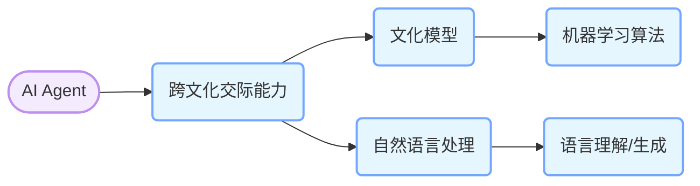

# 开发AI Agent的跨文化交际能力

> 关键词：AI Agent、跨文化交际能力、文化模型、自然语言处理、机器学习

> 摘要：本文聚焦于开发AI Agent的跨文化交际能力。首先介绍了相关背景，包括目的、预期读者、文档结构和术语表。接着阐述了核心概念与联系，通过文本示意图和Mermaid流程图展示架构。详细讲解了核心算法原理和具体操作步骤，使用Python代码进行说明。给出了数学模型和公式，并举例解释。通过项目实战展示代码实现和解读。探讨了实际应用场景，推荐了学习资源、开发工具框架和相关论文著作。最后总结了未来发展趋势与挑战，提供了常见问题解答和扩展阅读参考资料，旨在帮助开发者全面了解和掌握开发AI Agent跨文化交际能力的方法和技术。

## 1. 背景介绍 
### 1.1 目的和范围
随着全球化的加速，跨文化交流变得日益频繁。AI Agent作为一种智能交互工具，在跨文化交际场景中的应用越来越广泛。开发AI Agent的跨文化交际能力的目的在于使AI Agent能够理解不同文化背景下的语言、习俗、价值观等，从而更有效地与来自不同文化的用户进行交流。本文章的范围涵盖了从核心概念的介绍、算法原理的讲解、数学模型的分析，到项目实战和实际应用场景的探讨，旨在为开发者提供全面的指导。

### 1.2 预期读者
本文的预期读者包括人工智能开发者、软件工程师、自然语言处理研究者、对跨文化交际和AI技术感兴趣的学者以及相关领域的从业人员。无论您是初学者还是有一定经验的专业人士，都能从本文中获得有价值的信息。

### 1.3 文档结构概述
本文共分为十个部分。第一部分为背景介绍，包括目的、预期读者、文档结构概述和术语表。第二部分阐述核心概念与联系，展示相关架构。第三部分讲解核心算法原理和具体操作步骤，并用Python代码详细说明。第四部分给出数学模型和公式，并举例解释。第五部分进行项目实战，包括开发环境搭建、源代码实现和代码解读。第六部分探讨实际应用场景。第七部分推荐学习资源、开发工具框架和相关论文著作。第八部分总结未来发展趋势与挑战。第九部分为附录，提供常见问题解答。第十部分为扩展阅读和参考资料。

### 1.4 术语表
#### 1.4.1 核心术语定义
- **AI Agent**：即人工智能代理，是一种能够感知环境、进行推理并采取行动以实现特定目标的智能实体。
- **跨文化交际能力**：指在不同文化背景下，理解、适应并有效进行交流的能力。
- **文化模型**：用于描述特定文化的特征、价值观、习俗等信息的模型。

#### 1.4.2 相关概念解释
- **自然语言处理（NLP）**：是人工智能的一个子领域，主要研究如何让计算机理解和处理人类语言。
- **机器学习（ML）**：是一门多领域交叉学科，涉及概率论、统计学、逼近论、凸分析、算法复杂度理论等多门学科。它专门研究计算机怎样模拟或实现人类的学习行为，以获取新的知识或技能，重新组织已有的知识结构使之不断改善自身的性能。

#### 1.4.3 缩略词列表
- **NLP**：Natural Language Processing
- **ML**：Machine Learning

## 2. 核心概念与联系 

### 核心概念原理
开发AI Agent的跨文化交际能力涉及多个核心概念，其中最重要的是文化模型、自然语言处理和机器学习。

文化模型是对不同文化的抽象表示，它包含了文化的各个方面，如价值观、信仰、习俗、语言习惯等。通过构建文化模型，AI Agent可以了解不同文化之间的差异，从而在交流中做出合适的回应。

自然语言处理是实现AI Agent与用户进行交流的基础。它包括语言理解、语言生成等任务。在跨文化交际中，自然语言处理需要考虑不同文化背景下的语言差异，如词汇、语法、语用等。

机器学习则是用于训练AI Agent的跨文化交际能力。通过大量的跨文化交流数据，机器学习算法可以学习到不同文化之间的模式和规律，从而提高AI Agent的跨文化交际能力。

### 架构的文本示意图
```plaintext
                        +----------------+
                        |   AI Agent     |
                        +----------------+
                        | 跨文化交际能力 |
                        +----------------+
                            /         \
                           /           \
                          /             \
           +-----------------+     +-----------------+
           |   文化模型      |     | 自然语言处理    |
           +-----------------+     +-----------------+
                 |                      |
                 |                      |
                 |                      |
           +-----------------+     +-----------------+
           | 机器学习算法    |     | 语言理解/生成  |
           +-----------------+     +-----------------+
```

### Mermaid流程图


## 3. 核心算法原理 & 具体操作步骤 

### 核心算法原理
在开发AI Agent的跨文化交际能力时，主要使用的算法包括机器学习中的分类算法、深度学习中的神经网络算法等。

以分类算法为例，我们可以将不同文化背景下的交流数据分为不同的类别，如问候类、请求类、拒绝类等。然后使用分类算法对新的交流数据进行分类，从而让AI Agent根据不同的类别做出合适的回应。

### 具体操作步骤
1. **数据收集**：收集不同文化背景下的交流数据，包括文本、语音等。
2. **数据预处理**：对收集到的数据进行清洗、标注等处理，以便后续的机器学习算法使用。
3. **模型训练**：使用预处理后的数据对机器学习模型进行训练。
4. **模型评估**：使用测试数据对训练好的模型进行评估，检查模型的性能。
5. **模型部署**：将评估合格的模型部署到AI Agent中，使其具备跨文化交际能力。

### Python源代码详细阐述
以下是一个简单的Python代码示例，使用Scikit-learn库中的朴素贝叶斯分类器对不同文化背景下的交流数据进行分类：

```python
from sklearn.feature_extraction.text import TfidfVectorizer
from sklearn.naive_bayes import MultinomialNB
from sklearn.pipeline import Pipeline
from sklearn.model_selection import train_test_split
from sklearn.metrics import accuracy_score

# 示例数据
data = [
    ("你好", "问候类"),
    ("早上好", "问候类"),
    ("请帮我拿一下那个东西", "请求类"),
    ("不好意思，我不能帮你", "拒绝类")
]

# 分离文本和标签
texts = [x[0] for x in data]
labels = [x[1] for x in data]

# 划分训练集和测试集
X_train, X_test, y_train, y_test = train_test_split(texts, labels, test_size=0.2, random_state=42)

# 创建分类器管道
pipeline = Pipeline([
    ('tfidf', TfidfVectorizer()),
    ('clf', MultinomialNB())
])

# 训练模型
pipeline.fit(X_train, y_train)

# 预测
y_pred = pipeline.predict(X_test)

# 评估模型
accuracy = accuracy_score(y_test, y_pred)
print(f"模型准确率: {accuracy}")
```

在上述代码中，我们首先定义了一个包含不同文化背景下交流数据的列表`data`。然后使用`train_test_split`函数将数据划分为训练集和测试集。接着创建了一个包含`TfidfVectorizer`和`MultinomialNB`的管道`pipeline`，并使用训练集对其进行训练。最后使用测试集对模型进行评估，输出模型的准确率。

## 4. 数学模型和公式 & 详细讲解 & 举例说明 

### 数学模型和公式
在机器学习中，朴素贝叶斯分类器是一种常用的分类算法，其基于贝叶斯定理。贝叶斯定理的公式为：

$$P(A|B) = \frac{P(B|A)P(A)}{P(B)}$$

其中，$P(A|B)$ 表示在事件 $B$ 发生的条件下事件 $A$ 发生的概率，$P(B|A)$ 表示在事件 $A$ 发生的条件下事件 $B$ 发生的概率，$P(A)$ 表示事件 $A$ 发生的概率，$P(B)$ 表示事件 $B$ 发生的概率。

在朴素贝叶斯分类器中，我们假设特征之间是相互独立的，即对于一个样本 $x = (x_1, x_2,..., x_n)$，其属于类别 $y$ 的概率可以表示为：

$$P(y|x) = \frac{P(x|y)P(y)}{P(x)}$$

由于 $P(x)$ 对于所有类别都是相同的，因此我们只需要比较 $P(x|y)P(y)$ 的大小来确定样本所属的类别。

### 详细讲解
在上述公式中，$P(y)$ 称为先验概率，表示类别 $y$ 在训练数据中出现的概率。$P(x|y)$ 称为似然概率，表示在类别 $y$ 下样本 $x$ 出现的概率。

在实际应用中，我们通常使用对数似然来避免数值下溢的问题。即：

$$\log P(y|x) \propto \log P(y) + \sum_{i=1}^{n} \log P(x_i|y)$$

### 举例说明
假设我们有一个文本分类问题，要将文本分为“体育”和“科技”两类。训练数据中，“体育”类别的文本占比为 $0.6$，“科技”类别的文本占比为 $0.4$。对于一个新的文本“新款手机发布”，我们要判断它属于哪一类。

首先，我们计算先验概率：

$P(体育) = 0.6$

$P(科技) = 0.4$

然后，我们计算似然概率。假设在“体育”类别中，出现“新款手机”的概率为 $0.1$，在“科技”类别中，出现“新款手机”的概率为 $0.8$。

则：

$\log P(体育|新款手机发布) \propto \log 0.6 + \log 0.1 \approx -1.79$

$\log P(科技|新款手机发布) \propto \log 0.4 + \log 0.8 \approx -0.92$

由于 $\log P(科技|新款手机发布) > \log P(体育|新款手机发布)$，因此我们判断“新款手机发布”属于“科技”类别。

## 5. 项目实战：代码实际案例和详细解释说明 

### 5.1  开发环境搭建
在进行项目实战之前，我们需要搭建开发环境。以下是具体步骤：

1. **安装Python**：建议安装Python 3.7及以上版本。可以从Python官方网站（https://www.python.org/downloads/）下载安装包进行安装。
2. **安装必要的库**：使用`pip`命令安装Scikit-learn、NLTK等必要的库。

```bash
pip install scikit-learn nltk
```

3. **下载NLTK数据**：在Python交互式环境中运行以下代码下载NLTK数据。

```python
import nltk
nltk.download('punkt')
nltk.download('stopwords')
```

### 5.2  源代码详细实现和代码解读
以下是一个完整的Python代码示例，用于开发一个简单的具有跨文化交际能力的AI Agent：

```python
import nltk
from nltk.corpus import stopwords
from nltk.tokenize import word_tokenize
from sklearn.feature_extraction.text import TfidfVectorizer
from sklearn.naive_bayes import MultinomialNB
from sklearn.pipeline import Pipeline
from sklearn.model_selection import train_test_split
from sklearn.metrics import accuracy_score

# 示例数据
data = [
    ("你好", "问候类"),
    ("早上好", "问候类"),
    ("请帮我拿一下那个东西", "请求类"),
    ("不好意思，我不能帮你", "拒绝类"),
    ("Hello", "问候类"),
    ("Good morning", "问候类"),
    ("Please help me get that thing", "请求类"),
    ("Sorry, I can't help you", "拒绝类")
]

# 分离文本和标签
texts = [x[0] for x in data]
labels = [x[1] for x in data]

# 数据预处理
def preprocess_text(text):
    tokens = word_tokenize(text.lower())
    stop_words = set(stopwords.words('english') + stopwords.words('chinese'))
    filtered_tokens = [token for token in tokens if token.isalnum() and token not in stop_words]
    return " ".join(filtered_tokens)

preprocessed_texts = [preprocess_text(text) for text in texts]

# 划分训练集和测试集
X_train, X_test, y_train, y_test = train_test_split(preprocessed_texts, labels, test_size=0.2, random_state=42)

# 创建分类器管道
pipeline = Pipeline([
    ('tfidf', TfidfVectorizer()),
    ('clf', MultinomialNB())
])

# 训练模型
pipeline.fit(X_train, y_train)

# 预测
y_pred = pipeline.predict(X_test)

# 评估模型
accuracy = accuracy_score(y_test, y_pred)
print(f"模型准确率: {accuracy}")

# 与AI Agent交互
while True:
    user_input = input("请输入你的话语（输入 '退出' 结束交互）: ")
    if user_input == "退出":
        break
    preprocessed_input = preprocess_text(user_input)
    prediction = pipeline.predict([preprocessed_input])
    print(f"AI Agent判断这句话属于: {prediction[0]}")
```

### 代码解读与分析
1. **数据预处理**：定义了`preprocess_text`函数，用于对文本进行预处理。包括将文本转换为小写、分词、去除停用词等操作。
2. **划分训练集和测试集**：使用`train_test_split`函数将预处理后的数据划分为训练集和测试集。
3. **创建分类器管道**：创建了一个包含`TfidfVectorizer`和`MultinomialNB`的管道`pipeline`。`TfidfVectorizer`用于将文本转换为向量，`MultinomialNB`用于进行分类。
4. **训练模型**：使用训练集对管道进行训练。
5. **评估模型**：使用测试集对模型进行评估，输出模型的准确率。
6. **与AI Agent交互**：通过一个循环，让用户输入话语，AI Agent对输入的话语进行分类并输出结果。当用户输入“退出”时，结束交互。

## 6. 实际应用场景 
开发具有跨文化交际能力的AI Agent在多个领域都有广泛的应用场景：

### 客服领域
在跨国企业的客服系统中，AI Agent可以理解不同文化背景的客户的问题，并提供合适的解决方案。例如，对于来自不同国家的客户，AI Agent可以根据其文化习惯使用恰当的语言和表达方式进行交流，提高客户满意度。

### 教育领域
在在线教育平台中，AI Agent可以作为学习伙伴，与来自不同文化背景的学生进行交流。它可以理解学生的问题，提供个性化的学习建议，同时帮助学生了解不同文化的知识和观念。

### 旅游领域
在旅游APP中，AI Agent可以为游客提供跨文化的旅游信息和建议。例如，帮助游客了解当地的文化习俗、宗教信仰、美食特色等，让游客更好地融入当地文化。

### 社交领域
在社交平台中，AI Agent可以辅助用户进行跨文化交流。它可以帮助用户理解不同文化背景的朋友的话语和行为，避免因文化差异而产生的误解和冲突。

## 7. 工具和资源推荐
### 7.1 学习资源推荐
#### 7.1.1 书籍推荐
- 《自然语言处理入门》：这本书系统地介绍了自然语言处理的基本概念、算法和技术，适合初学者入门。
- 《机器学习》（周志华著）：全面介绍了机器学习的各种算法和模型，是机器学习领域的经典教材。
- 《跨文化交际学概论》：详细阐述了跨文化交际的理论和实践，有助于深入理解跨文化交际的本质。

#### 7.1.2 在线课程
- Coursera上的“Natural Language Processing Specialization”：由顶尖大学的教授授课，涵盖了自然语言处理的多个方面。
- edX上的“Machine Learning Fundamentals”：系统地介绍了机器学习的基础知识和算法。
- 网易云课堂上的“跨文化交际与沟通技巧”：讲解了跨文化交际的技巧和方法。

#### 7.1.3 技术博客和网站
- Medium：上面有很多关于人工智能、自然语言处理和跨文化交际的技术文章和经验分享。
- arXiv：提供了大量的学术论文，包括人工智能和跨文化研究方面的最新成果。
- 机器之心：专注于人工智能领域的资讯和技术解读。

### 7.2 开发工具框架推荐
#### 7.2.1 IDE和编辑器
- PyCharm：是一款专门为Python开发设计的集成开发环境，具有强大的代码编辑、调试和项目管理功能。
- Visual Studio Code：是一款轻量级的代码编辑器，支持多种编程语言，并且有丰富的插件可以扩展功能。

#### 7.2.2 调试和性能分析工具
- Py-Spy：可以对Python程序进行性能分析，找出性能瓶颈。
- PDB：Python自带的调试工具，可以帮助开发者调试代码。

#### 7.2.3 相关框架和库
- Scikit-learn：是一个简单易用的机器学习库，提供了多种机器学习算法和工具。
- NLTK：是一个自然语言处理工具包，包含了丰富的语料库和工具，用于文本处理和分析。
- TensorFlow：是一个开源的深度学习框架，广泛应用于人工智能领域。

### 7.3 相关论文著作推荐
#### 7.3.1 经典论文
- "A Mathematical Theory of Communication"（Claude E. Shannon）：奠定了信息论的基础，对自然语言处理和机器学习有重要影响。
- "Pattern Recognition and Machine Learning"（Christopher M. Bishop）：是机器学习领域的经典著作，详细介绍了各种机器学习算法和模型。

#### 7.3.2 最新研究成果
- 在ACM、IEEE等学术会议和期刊上发表的关于人工智能、自然语言处理和跨文化交际的最新研究论文。

#### 7.3.3 应用案例分析
- 一些知名企业（如谷歌、微软等）发布的关于AI Agent在跨文化交际领域的应用案例分析报告。

## 8. 总结：未来发展趋势与挑战
### 未来发展趋势
- **多模态融合**：未来的AI Agent将不仅仅局限于文本交流，还会融合语音、图像、视频等多种模态，提供更加丰富和自然的跨文化交际体验。
- **个性化定制**：根据用户的文化背景、兴趣爱好等因素，为用户提供个性化的跨文化交际服务。
- **强化学习应用**：通过强化学习算法，让AI Agent在与用户的交互中不断学习和优化，提高跨文化交际能力。

### 挑战
- **文化数据的获取和标注**：获取丰富、准确的跨文化交流数据是开发AI Agent跨文化交际能力的基础，但文化数据的获取和标注存在一定的难度。
- **文化差异的理解和处理**：不同文化之间的差异非常复杂，包括语言、价值观、习俗等多个方面，如何让AI Agent准确理解和处理这些差异是一个挑战。
- **伦理和法律问题**：在跨文化交际中，AI Agent的行为和决策可能会涉及到伦理和法律问题，如隐私保护、文化尊重等，需要制定相应的规范和准则。

## 9. 附录：常见问题与解答
### 问题1：如何收集跨文化交流数据？
答：可以通过以下几种方式收集跨文化交流数据：
- 网络爬虫：从社交媒体、论坛、新闻网站等获取不同文化背景下的交流数据。
- 合作研究：与不同国家和地区的研究机构、企业合作，获取他们的交流数据。
- 用户反馈：通过AI Agent与用户的交互，收集用户的反馈数据。

### 问题2：如何处理不同语言之间的差异？
答：可以使用自然语言处理技术来处理不同语言之间的差异，如分词、词性标注、句法分析等。同时，还可以使用机器翻译技术将不同语言的文本转换为统一的语言进行处理。

### 问题3：如何评估AI Agent的跨文化交际能力？
答：可以从以下几个方面评估AI Agent的跨文化交际能力：
- 准确率：评估AI Agent对交流数据进行分类的准确率。
- 合适性：评估AI Agent的回应是否符合不同文化背景下的交流习惯和价值观。
- 用户满意度：通过用户的反馈来评估AI Agent的跨文化交际能力。

## 10. 扩展阅读 & 参考资料
### 扩展阅读
- 《人工智能：现代方法》：全面介绍了人工智能的各个领域，包括自然语言处理、机器学习等。
- 《文化与组织：心理软件的力量》：深入探讨了文化对组织和个人行为的影响。

### 参考资料
- 相关学术论文和研究报告
- 开源项目的文档和代码
- 行业专家的博客和文章

作者：AI天才研究院/AI Genius Institute & 禅与计算机程序设计艺术 /Zen And The Art of Computer Programming