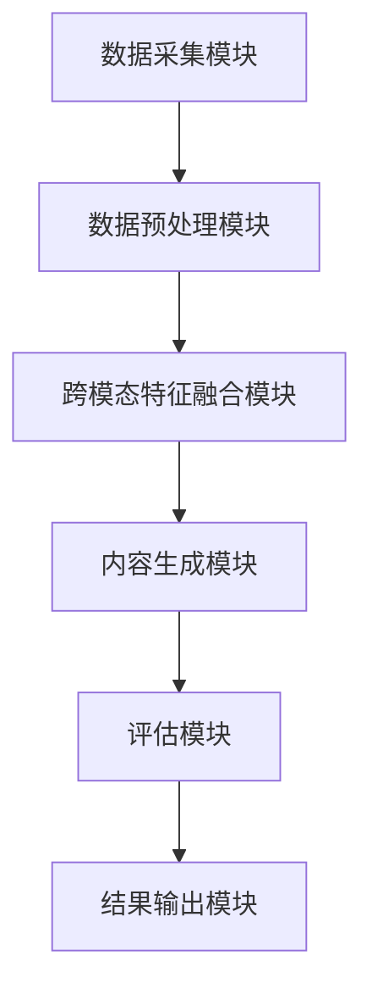

# 开发AI Agent的跨模态内容生成与评估系统

> 关键词：AI Agent、跨模态、内容生成、评估系统、多模态融合

> 摘要：本文围绕开发AI Agent的跨模态内容生成与评估系统展开深入探讨。首先介绍了该系统开发的背景、目的和范围，明确预期读者和文档结构。接着阐述跨模态相关的核心概念及其联系，详细讲解核心算法原理并给出Python代码示例，还介绍了相关数学模型和公式。通过项目实战，展示了开发环境搭建、源代码实现与解读。分析了该系统的实际应用场景，推荐了相关的学习资源、开发工具框架和论文著作。最后总结了系统未来发展趋势与挑战，提供常见问题解答和扩展阅读参考资料，旨在为开发AI Agent的跨模态内容生成与评估系统提供全面且深入的技术指导。

## 1. 背景介绍 
### 1.1 目的和范围
在当今数字化时代，单一模态的内容已经难以满足人们日益增长的信息需求。跨模态内容能够融合多种不同类型的数据，如文本、图像、音频等，为用户提供更加丰富、全面的信息体验。开发AI Agent的跨模态内容生成与评估系统的目的在于利用人工智能技术，实现高效、准确的跨模态内容生成，并建立科学合理的评估体系，确保生成内容的质量和可用性。

本系统的范围涵盖了从数据采集、预处理，到跨模态内容生成，再到生成内容评估的整个流程。包括支持多种模态数据的输入，如文本描述、图像特征等，能够生成多样化的跨模态内容，如文本-图像组合、音频-视频组合等，并通过一系列评估指标对生成内容进行质量评估。

### 1.2 预期读者
本文的预期读者包括人工智能领域的研究人员、开发者、软件架构师，以及对跨模态技术和AI Agent应用感兴趣的相关专业人士。对于希望深入了解跨模态内容生成与评估系统开发的初学者，也可以从本文中获取基础知识和实践指导。

### 1.3 文档结构概述
本文将按照以下结构展开：首先介绍系统开发的背景信息，包括目的、范围、预期读者等。接着阐述跨模态相关的核心概念及其联系，通过文本示意图和Mermaid流程图进行直观展示。然后详细讲解核心算法原理，并给出Python代码示例，同时介绍相关的数学模型和公式。通过项目实战，展示系统开发的具体步骤，包括开发环境搭建、源代码实现与解读。分析系统的实际应用场景，推荐相关的学习资源、开发工具框架和论文著作。最后总结系统未来发展趋势与挑战，提供常见问题解答和扩展阅读参考资料。

### 1.4 术语表
#### 1.4.1 核心术语定义
- **AI Agent（人工智能代理）**：能够感知环境、进行决策并采取行动以实现特定目标的人工智能实体。
- **跨模态（Cross-modal）**：涉及多种不同类型的数据模态，如文本、图像、音频、视频等，通过融合这些模态的数据来实现更丰富的信息处理和应用。
- **内容生成（Content Generation）**：利用人工智能技术自动生成各种类型的内容，如文本、图像、音频等。
- **评估系统（Evaluation System）**：用于对生成的内容进行质量评估的系统，通过一系列评估指标来衡量内容的优劣。

#### 1.4.2 相关概念解释
- **多模态融合（Multimodal Fusion）**：将来自不同模态的数据进行整合和处理，以提取更全面、准确的信息。多模态融合可以在不同层次上进行，如特征级融合、决策级融合等。
- **语义对齐（Semantic Alignment）**：在跨模态处理中，确保不同模态的数据在语义上保持一致的过程。例如，在文本和图像的跨模态处理中，需要找到文本描述和图像内容之间的语义对应关系。

#### 1.4.3 缩略词列表
- **CNN（Convolutional Neural Network）**：卷积神经网络
- **RNN（Recurrent Neural Network）**：循环神经网络
- **LSTM（Long Short-Term Memory）**：长短期记忆网络
- **GAN（Generative Adversarial Network）**：生成对抗网络

## 2. 核心概念与联系 
### 核心概念原理
跨模态内容生成与评估系统主要涉及以下几个核心概念：

#### 数据模态
数据模态是指不同类型的数据表示形式，常见的数据模态包括文本、图像、音频、视频等。每种数据模态都有其独特的特征和表示方式。例如，文本数据通常由一系列字符或单词组成，可以用词向量表示；图像数据由像素值组成，可以用卷积神经网络提取特征；音频数据由声波信号组成，可以用音频特征提取算法进行处理。

#### 跨模态特征提取
跨模态特征提取是将不同模态的数据转换为统一的特征表示的过程。通过跨模态特征提取，可以找到不同模态数据之间的内在联系，为后续的内容生成和评估提供基础。常见的跨模态特征提取方法包括基于深度学习的方法，如卷积神经网络（CNN）、循环神经网络（RNN）及其变体（如LSTM）等。

#### 内容生成模型
内容生成模型用于根据输入的跨模态特征生成相应的内容。常见的内容生成模型包括生成对抗网络（GAN）、变分自编码器（VAE）等。这些模型可以学习数据的分布，并根据输入的特征生成具有相似分布的内容。

#### 评估指标
评估指标用于衡量生成内容的质量。在跨模态内容生成中，评估指标需要考虑不同模态之间的一致性和相关性。常见的评估指标包括语义相似度、视觉质量、音频质量等。

### 架构的文本示意图
```plaintext
+-------------------+
|  数据采集模块     |
|  (多种模态数据)   |
+-------------------+
           |
           v
+-------------------+
|  数据预处理模块   |
|  (特征提取、归一化)|
+-------------------+
           |
           v
+-------------------+
|  跨模态特征融合模块|
|  (多模态特征整合)  |
+-------------------+
           |
           v
+-------------------+
|  内容生成模块     |
|  (基于生成模型)   |
+-------------------+
           |
           v
+-------------------+
|  评估模块         |
|  (多种评估指标)   |
+-------------------+
           |
           v
+-------------------+
|  结果输出模块     |
|  (生成内容及评估结果)|
+-------------------+
```

### Mermaid流程图


## 3. 核心算法原理 & 具体操作步骤 
### 核心算法原理
在跨模态内容生成与评估系统中，核心算法主要包括跨模态特征提取、内容生成和评估算法。以下是对这些算法的详细介绍：

#### 跨模态特征提取
跨模态特征提取的目的是将不同模态的数据转换为统一的特征表示。以文本和图像为例，可以使用预训练的卷积神经网络（如ResNet）提取图像的特征，使用词嵌入模型（如Word2Vec）将文本转换为词向量，然后将词向量输入到循环神经网络（如LSTM）中提取文本的特征。最后，将图像特征和文本特征进行拼接或融合，得到跨模态特征。

#### 内容生成
内容生成可以使用生成对抗网络（GAN）来实现。GAN由生成器和判别器组成，生成器的任务是根据输入的跨模态特征生成相应的内容，判别器的任务是判断生成的内容是真实的还是虚假的。通过不断地训练生成器和判别器，使生成器能够生成越来越逼真的内容。

#### 评估算法
评估算法用于衡量生成内容的质量。可以使用多种评估指标，如语义相似度、视觉质量、音频质量等。语义相似度可以使用词向量的余弦相似度来计算，视觉质量可以使用图像质量评估指标（如PSNR、SSIM）来衡量，音频质量可以使用音频质量评估指标（如PESQ）来评估。

### 具体操作步骤
以下是实现跨模态内容生成与评估系统的具体操作步骤：

1. **数据采集**：收集多种模态的数据，如文本、图像、音频等。
2. **数据预处理**：对采集到的数据进行预处理，包括特征提取、归一化等操作。
3. **跨模态特征融合**：将不同模态的特征进行融合，得到跨模态特征。
4. **内容生成**：使用生成对抗网络（GAN）根据跨模态特征生成相应的内容。
5. **评估**：使用评估指标对生成的内容进行质量评估。
6. **结果输出**：输出生成的内容和评估结果。

### Python源代码示例
```python
import torch
import torch.nn as nn
import torch.optim as optim
from torchvision.models import resnet18
import numpy as np

# 定义图像特征提取模型
class ImageFeatureExtractor(nn.Module):
    def __init__(self):
        super(ImageFeatureExtractor, self).__init__()
        self.resnet = resnet18(pretrained=True)
        self.resnet.fc = nn.Identity()  # 去掉最后一层全连接层

    def forward(self, x):
        return self.resnet(x)

# 定义文本特征提取模型
class TextFeatureExtractor(nn.Module):
    def __init__(self, vocab_size, embedding_dim, hidden_dim):
        super(TextFeatureExtractor, self).__init__()
        self.embedding = nn.Embedding(vocab_size, embedding_dim)
        self.lstm = nn.LSTM(embedding_dim, hidden_dim, batch_first=True)

    def forward(self, x):
        embedded = self.embedding(x)
        _, (h_n, _) = self.lstm(embedded)
        return h_n.squeeze(0)

# 定义生成器
class Generator(nn.Module):
    def __init__(self, input_dim, output_dim):
        super(Generator, self).__init__()
        self.fc1 = nn.Linear(input_dim, 256)
        self.fc2 = nn.Linear(256, 512)
        self.fc3 = nn.Linear(512, output_dim)
        self.relu = nn.ReLU()
        self.tanh = nn.Tanh()

    def forward(self, x):
        x = self.relu(self.fc1(x))
        x = self.relu(self.fc2(x))
        x = self.tanh(self.fc3(x))
        return x

# 定义判别器
class Discriminator(nn.Module):
    def __init__(self, input_dim):
        super(Discriminator, self).__init__()
        self.fc1 = nn.Linear(input_dim, 256)
        self.fc2 = nn.Linear(256, 128)
        self.fc3 = nn.Linear(128, 1)
        self.relu = nn.ReLU()
        self.sigmoid = nn.Sigmoid()

    def forward(self, x):
        x = self.relu(self.fc1(x))
        x = self.relu(self.fc2(x))
        x = self.sigmoid(self.fc3(x))
        return x

# 初始化模型
image_extractor = ImageFeatureExtractor()
text_extractor = TextFeatureExtractor(vocab_size=10000, embedding_dim=100, hidden_dim=256)
generator = Generator(input_dim=256 + 512, output_dim=1024)
discriminator = Discriminator(input_dim=1024)

# 定义损失函数和优化器
criterion = nn.BCELoss()
g_optimizer = optim.Adam(generator.parameters(), lr=0.0002)
d_optimizer = optim.Adam(discriminator.parameters(), lr=0.0002)

# 训练过程
num_epochs = 100
for epoch in range(num_epochs):
    # 模拟输入数据
    images = torch.randn(32, 3, 224, 224)
    texts = torch.randint(0, 10000, (32, 10))

    # 提取特征
    image_features = image_extractor(images)
    text_features = text_extractor(texts)
    cross_modal_features = torch.cat((image_features, text_features), dim=1)

    # 训练判别器
    d_optimizer.zero_grad()
    real_labels = torch.ones(32, 1)
    fake_labels = torch.zeros(32, 1)

    real_outputs = discriminator(cross_modal_features)
    d_real_loss = criterion(real_outputs, real_labels)

    fake_samples = generator(cross_modal_features)
    fake_outputs = discriminator(fake_samples.detach())
    d_fake_loss = criterion(fake_outputs, fake_labels)

    d_loss = d_real_loss + d_fake_loss
    d_loss.backward()
    d_optimizer.step()

    # 训练生成器
    g_optimizer.zero_grad()
    fake_outputs = discriminator(fake_samples)
    g_loss = criterion(fake_outputs, real_labels)
    g_loss.backward()
    g_optimizer.step()

    if (epoch + 1) % 10 == 0:
        print(f'Epoch [{epoch + 1}/{num_epochs}], D_loss: {d_loss.item():.4f}, G_loss: {g_loss.item():.4f}')
```

## 4. 数学模型和公式 & 详细讲解 & 举例说明 
### 跨模态特征融合
在跨模态特征融合中，常见的方法是将不同模态的特征进行拼接或加权求和。假设我们有两种模态的特征 $X_1 \in \mathbb{R}^{n_1}$ 和 $X_2 \in \mathbb{R}^{n_2}$，拼接后的特征 $X \in \mathbb{R}^{n_1 + n_2}$ 可以表示为：

$$X = [X_1; X_2]$$

加权求和的特征 $X$ 可以表示为：

$$X = \alpha X_1 + (1 - \alpha) X_2$$

其中 $\alpha \in [0, 1]$ 是权重系数。

### 生成对抗网络（GAN）
生成对抗网络（GAN）由生成器 $G$ 和判别器 $D$ 组成。生成器的目标是生成逼真的样本，判别器的目标是区分真实样本和生成样本。GAN 的训练过程可以通过最小化以下损失函数来实现：

$$\min_G \max_D V(D, G) = \mathbb{E}_{x \sim p_{data}(x)}[\log D(x)] + \mathbb{E}_{z \sim p_z(z)}[\log(1 - D(G(z)))]$$

其中 $p_{data}(x)$ 是真实数据的分布，$p_z(z)$ 是噪声的分布。

### 语义相似度计算
语义相似度可以使用词向量的余弦相似度来计算。假设我们有两个词向量 $\mathbf{u}$ 和 $\mathbf{v}$，它们的余弦相似度 $sim(\mathbf{u}, \mathbf{v})$ 可以表示为：

$$sim(\mathbf{u}, \mathbf{v}) = \frac{\mathbf{u} \cdot \mathbf{v}}{\|\mathbf{u}\| \|\mathbf{v}\|}$$

### 举例说明
假设我们有一个文本描述“a beautiful cat”和对应的图像。首先，使用词嵌入模型将文本转换为词向量，然后使用 LSTM 提取文本的特征 $X_{text}$。使用预训练的卷积神经网络提取图像的特征 $X_{image}$。将 $X_{text}$ 和 $X_{image}$ 进行拼接，得到跨模态特征 $X$。

接下来，将 $X$ 输入到生成器 $G$ 中，生成一个新的图像。将生成的图像和真实图像输入到判别器 $D$ 中，计算判别器的损失。同时，根据判别器的反馈，更新生成器的参数，使生成的图像越来越逼真。

最后，使用余弦相似度计算生成的文本描述和原始文本描述之间的语义相似度，评估生成内容的质量。

## 5. 项目实战：代码实际案例和详细解释说明 
### 5.1  开发环境搭建
#### 安装Python和相关库
首先，确保你已经安装了 Python 3.x 版本。然后，使用以下命令安装所需的库：

```bash
pip install torch torchvision numpy
```

#### 数据集准备
选择合适的跨模态数据集，如 COCO 数据集（包含图像和文本描述）。将数据集下载并解压到指定的目录。

### 5.2  源代码详细实现和代码解读
以下是完整的项目实战代码：

```python
import torch
import torch.nn as nn
import torch.optim as optim
from torchvision.models import resnet18
import numpy as np
from torch.utils.data import Dataset, DataLoader
from PIL import Image
import os

# 定义数据集类
class CrossModalDataset(Dataset):
    def __init__(self, image_dir, text_file):
        self.image_dir = image_dir
        self.texts = []
        self.image_files = []
        with open(text_file, 'r') as f:
            for line in f:
                image_file, text = line.strip().split('\t')
                self.image_files.append(os.path.join(image_dir, image_file))
                self.texts.append(text)

    def __len__(self):
        return len(self.image_files)

    def __getitem__(self, idx):
        image = Image.open(self.image_files[idx]).convert('RGB')
        image = image.resize((224, 224))
        image = np.array(image).transpose(2, 0, 1) / 255.0
        image = torch.tensor(image, dtype=torch.float32)
        text = self.texts[idx]
        # 这里简单处理，实际中需要将文本转换为词向量
        text = torch.randint(0, 10000, (10,), dtype=torch.long)
        return image, text

# 定义图像特征提取模型
class ImageFeatureExtractor(nn.Module):
    def __init__(self):
        super(ImageFeatureExtractor, self).__init__()
        self.resnet = resnet18(pretrained=True)
        self.resnet.fc = nn.Identity()  # 去掉最后一层全连接层

    def forward(self, x):
        return self.resnet(x)

# 定义文本特征提取模型
class TextFeatureExtractor(nn.Module):
    def __init__(self, vocab_size, embedding_dim, hidden_dim):
        super(TextFeatureExtractor, self).__init__()
        self.embedding = nn.Embedding(vocab_size, embedding_dim)
        self.lstm = nn.LSTM(embedding_dim, hidden_dim, batch_first=True)

    def forward(self, x):
        embedded = self.embedding(x)
        _, (h_n, _) = self.lstm(embedded)
        return h_n.squeeze(0)

# 定义生成器
class Generator(nn.Module):
    def __init__(self, input_dim, output_dim):
        super(Generator, self).__init__()
        self.fc1 = nn.Linear(input_dim, 256)
        self.fc2 = nn.Linear(256, 512)
        self.fc3 = nn.Linear(512, output_dim)
        self.relu = nn.ReLU()
        self.tanh = nn.Tanh()

    def forward(self, x):
        x = self.relu(self.fc1(x))
        x = self.relu(self.fc2(x))
        x = self.tanh(self.fc3(x))
        return x

# 定义判别器
class Discriminator(nn.Module):
    def __init__(self, input_dim):
        super(Discriminator, self).__init__()
        self.fc1 = nn.Linear(input_dim, 256)
        self.fc2 = nn.Linear(256, 128)
        self.fc3 = nn.Linear(128, 1)
        self.relu = nn.ReLU()
        self.sigmoid = nn.Sigmoid()

    def forward(self, x):
        x = self.relu(self.fc1(x))
        x = self.relu(self.fc2(x))
        x = self.sigmoid(self.fc3(x))
        return x

# 初始化模型
image_extractor = ImageFeatureExtractor()
text_extractor = TextFeatureExtractor(vocab_size=10000, embedding_dim=100, hidden_dim=256)
generator = Generator(input_dim=256 + 512, output_dim=1024)
discriminator = Discriminator(input_dim=1024)

# 定义损失函数和优化器
criterion = nn.BCELoss()
g_optimizer = optim.Adam(generator.parameters(), lr=0.0002)
d_optimizer = optim.Adam(discriminator.parameters(), lr=0.0002)

# 加载数据集
dataset = CrossModalDataset(image_dir='path/to/images', text_file='path/to/texts.txt')
dataloader = DataLoader(dataset, batch_size=32, shuffle=True)

# 训练过程
num_epochs = 100
for epoch in range(num_epochs):
    for images, texts in dataloader:
        # 提取特征
        image_features = image_extractor(images)
        text_features = text_extractor(texts)
        cross_modal_features = torch.cat((image_features, text_features), dim=1)

        # 训练判别器
        d_optimizer.zero_grad()
        real_labels = torch.ones(images.size(0), 1)
        fake_labels = torch.zeros(images.size(0), 1)

        real_outputs = discriminator(cross_modal_features)
        d_real_loss = criterion(real_outputs, real_labels)

        fake_samples = generator(cross_modal_features)
        fake_outputs = discriminator(fake_samples.detach())
        d_fake_loss = criterion(fake_outputs, fake_labels)

        d_loss = d_real_loss + d_fake_loss
        d_loss.backward()
        d_optimizer.step()

        # 训练生成器
        g_optimizer.zero_grad()
        fake_outputs = discriminator(fake_samples)
        g_loss = criterion(fake_outputs, real_labels)
        g_loss.backward()
        g_optimizer.step()

    if (epoch + 1) % 10 == 0:
        print(f'Epoch [{epoch + 1}/{num_epochs}], D_loss: {d_loss.item():.4f}, G_loss: {g_loss.item():.4f}')
```

### 5.3  代码解读与分析
- **数据集类 `CrossModalDataset`**：用于加载跨模态数据集，包括图像和文本。在 `__getitem__` 方法中，将图像进行预处理并转换为张量，同时将文本简单处理为随机整数序列（实际中需要将文本转换为词向量）。
- **图像特征提取模型 `ImageFeatureExtractor`**：使用预训练的 ResNet18 模型提取图像的特征，去掉最后一层全连接层。
- **文本特征提取模型 `TextFeatureExtractor`**：使用词嵌入层和 LSTM 提取文本的特征。
- **生成器 `Generator`**：将跨模态特征作为输入，通过全连接层生成新的特征。
- **判别器 `Discriminator`**：判断输入的特征是真实的还是虚假的。
- **训练过程**：在每个 epoch 中，遍历数据集，提取跨模态特征，训练判别器和生成器，更新模型的参数。

## 6. 实际应用场景 
### 智能客服
在智能客服系统中，跨模态内容生成与评估系统可以根据用户的文本提问和相关的图像信息，生成更加准确、详细的回答。例如，用户在咨询电子产品的使用方法时，除了文字说明，还可以生成相关的操作图片或视频，帮助用户更好地理解。同时，通过评估系统可以确保生成的回答和图像、视频的质量，提高用户满意度。

### 广告创意生成
在广告创意生成领域，跨模态内容生成与评估系统可以根据产品的文本描述和相关的图像素材，生成吸引人的广告内容。例如，结合产品的特点和优势，生成具有视觉冲击力的广告图片和生动的广告文案。评估系统可以对生成的广告内容进行评估，确保广告的效果和质量。

### 教育领域
在教育领域，跨模态内容生成与评估系统可以根据教学内容和学生的学习情况，生成多样化的学习资源。例如，根据教材中的文本内容，生成相关的图像、动画或视频，帮助学生更好地理解知识点。同时，评估系统可以对生成的学习资源进行评估，确保其符合教学要求和学生的学习需求。

### 虚拟现实和增强现实
在虚拟现实（VR）和增强现实（AR）领域，跨模态内容生成与评估系统可以根据用户的环境信息和交互行为，生成逼真的虚拟场景和交互内容。例如，在 VR 游戏中，根据玩家的动作和语音指令，生成相应的图像、声音和触觉反馈。评估系统可以对生成的虚拟场景和交互内容进行评估，确保其真实感和沉浸感。

## 7. 工具和资源推荐
### 7.1 学习资源推荐
#### 7.1.1 书籍推荐
- 《深度学习》（Deep Learning）：由 Ian Goodfellow、Yoshua Bengio 和 Aaron Courville 编写，是深度学习领域的经典教材，涵盖了深度学习的基本概念、算法和应用。
- 《Python深度学习》（Deep Learning with Python）：由 Francois Chollet 编写，介绍了如何使用 Python 和 Keras 库进行深度学习开发，适合初学者入门。
- 《计算机视觉：算法与应用》（Computer Vision: Algorithms and Applications）：由 Richard Szeliski 编写，全面介绍了计算机视觉的基本概念、算法和应用，对于跨模态中的图像模态处理有很大帮助。

#### 7.1.2 在线课程
- Coursera 上的“深度学习专项课程”（Deep Learning Specialization）：由 Andrew Ng 教授授课，系统地介绍了深度学习的各个方面，包括神经网络、卷积神经网络、循环神经网络等。
- edX 上的“人工智能基础”（Introduction to Artificial Intelligence）：由麻省理工学院（MIT）的教师授课，介绍了人工智能的基本概念、算法和应用。
- Udemy 上的“计算机视觉大师课程”（The Complete Computer Vision Masterclass）：介绍了计算机视觉的基本概念、算法和应用，包括图像分类、目标检测、图像生成等。

#### 7.1.3 技术博客和网站
- Medium 上的 Towards Data Science：汇集了众多数据科学和人工智能领域的优秀文章，涵盖了深度学习、机器学习、计算机视觉等多个方面。
- arXiv.org：是一个免费的学术预印本服务器，提供了大量的最新研究论文，包括人工智能、机器学习、计算机视觉等领域的研究成果。
- AI开源社区：提供了丰富的人工智能开源项目和技术文章，对于学习和实践人工智能技术有很大帮助。

### 7.2 开发工具框架推荐
#### 7.2.1 IDE和编辑器
- PyCharm：是一款专门为 Python 开发设计的集成开发环境（IDE），提供了丰富的功能，如代码编辑、调试、代码分析等，适合 Python 开发者使用。
- Jupyter Notebook：是一个交互式的开发环境，支持多种编程语言，如 Python、R 等。可以方便地进行代码编写、运行和可视化，适合数据科学和机器学习的开发和实验。
- Visual Studio Code：是一款轻量级的代码编辑器，支持多种编程语言和插件扩展。可以通过安装相关的插件来实现 Python 开发、代码调试、版本控制等功能。

#### 7.2.2 调试和性能分析工具
- PyTorch Profiler：是 PyTorch 提供的性能分析工具，可以帮助开发者分析模型的性能瓶颈，优化模型的训练和推理过程。
- TensorBoard：是 TensorFlow 提供的可视化工具，可以帮助开发者可视化模型的训练过程、损失曲线、准确率等指标，方便进行模型调优。
- cProfile：是 Python 标准库中的性能分析工具，可以帮助开发者分析 Python 代码的性能瓶颈，找出运行时间较长的函数和代码段。

#### 7.2.3 相关框架和库
- PyTorch：是一个开源的深度学习框架，提供了丰富的神经网络层和优化算法，支持 GPU 加速，适合深度学习模型的开发和训练。
- TensorFlow：是一个开源的深度学习框架，由 Google 开发和维护。提供了丰富的工具和库，支持分布式训练和部署，适合大规模深度学习模型的开发和应用。
- OpenCV：是一个开源的计算机视觉库，提供了丰富的图像处理和计算机视觉算法，如图像滤波、特征提取、目标检测等，适合跨模态中的图像模态处理。

### 7.3 相关论文著作推荐
#### 7.3.1 经典论文
- “Generative Adversarial Networks”：由 Ian Goodfellow 等人发表，首次提出了生成对抗网络（GAN）的概念，为生成模型的发展奠定了基础。
- “ImageNet Classification with Deep Convolutional Neural Networks”：由 Alex Krizhevsky 等人发表，介绍了 AlexNet 模型，在 ImageNet 图像分类竞赛中取得了优异的成绩，推动了卷积神经网络在计算机视觉领域的发展。
- “Long Short-Term Memory”：由 Sepp Hochreiter 和 Jürgen Schmidhuber 发表，介绍了长短期记忆网络（LSTM）的概念，解决了传统循环神经网络中的梯度消失和梯度爆炸问题。

#### 7.3.2 最新研究成果
- 关注 arXiv.org 上的最新研究论文，特别是关于跨模态学习、生成模型、多模态融合等方面的研究成果。
- 参加国际学术会议，如 NeurIPS、ICML、CVPR 等，了解最新的研究动态和技术趋势。

#### 7.3.3 应用案例分析
- 参考相关的学术论文和技术报告，了解跨模态内容生成与评估系统在不同领域的应用案例和实践经验。
- 关注开源项目和实际产品中的应用案例，学习他人的开发经验和技巧。

## 8. 总结：未来发展趋势与挑战
### 未来发展趋势
#### 多模态融合的深度和广度不断拓展
未来，跨模态内容生成与评估系统将不仅仅局限于文本、图像、音频等常见模态的融合，还将拓展到更多的模态，如触觉、嗅觉等，实现更加全面、深入的多模态融合。例如，在虚拟现实和增强现实领域，结合触觉反馈和嗅觉模拟，为用户提供更加真实、沉浸式的体验。

#### 与其他技术的融合
跨模态内容生成与评估系统将与其他技术，如区块链、物联网、5G 等深度融合。例如，结合区块链技术，可以实现跨模态内容的版权保护和溯源；结合物联网技术，可以获取更多的环境信息和用户行为数据，为跨模态内容生成提供更加丰富的输入；结合 5G 技术，可以实现跨模态内容的实时传输和交互。

#### 个性化和智能化
未来的跨模态内容生成与评估系统将更加注重个性化和智能化。根据用户的兴趣、偏好和行为习惯，生成个性化的跨模态内容。同时，系统将具备更强的自我学习和自适应能力，能够不断优化生成和评估算法，提高系统的性能和效果。

### 挑战
#### 数据获取和标注
跨模态数据的获取和标注是一个挑战。不同模态的数据来源不同，数据格式和特点也不同，需要进行统一的处理和标注。同时，跨模态数据的标注需要专业的知识和技能，标注成本较高。

#### 计算资源和效率
跨模态内容生成与评估系统通常需要处理大量的数据和复杂的模型，对计算资源的需求较高。如何在有限的计算资源下提高系统的效率，是一个需要解决的问题。

#### 语义理解和对齐
在跨模态处理中，语义理解和对齐是一个关键问题。不同模态的数据在语义上可能存在差异，如何找到它们之间的语义对应关系，是实现跨模态内容生成和评估的基础。

## 9. 附录：常见问题与解答
### 问题1：跨模态特征融合的方法有哪些？
答：常见的跨模态特征融合方法包括拼接、加权求和、注意力机制等。拼接是将不同模态的特征直接连接在一起；加权求和是根据不同模态的重要性对特征进行加权求和；注意力机制可以自适应地分配不同模态特征的权重，提高融合效果。

### 问题2：如何选择合适的评估指标？
答：选择评估指标需要根据具体的应用场景和任务需求来确定。在跨模态内容生成中，需要考虑不同模态之间的一致性和相关性。常见的评估指标包括语义相似度、视觉质量、音频质量等。可以根据具体情况选择合适的评估指标，或者综合使用多个评估指标来全面评估生成内容的质量。

### 问题3：生成对抗网络（GAN）训练不稳定怎么办？
答：GAN 训练不稳定是一个常见的问题。可以采取以下措施来缓解：调整学习率、使用批量归一化（Batch Normalization）、使用梯度裁剪（Gradient Clipping）、改进判别器和生成器的架构等。此外，还可以尝试使用一些改进的 GAN 模型，如 WGAN、LSGAN 等。

### 问题4：如何处理跨模态数据中的噪声和缺失值？
答：对于噪声数据，可以使用滤波、去噪等方法进行处理。对于缺失值，可以采用插值、填充等方法进行处理。具体的处理方法需要根据数据的特点和应用场景来选择。

## 10. 扩展阅读 & 参考资料
### 扩展阅读
- 《人工智能：一种现代的方法》（Artificial Intelligence: A Modern Approach）：全面介绍了人工智能的基本概念、算法和应用，是人工智能领域的经典教材。
- 《自然语言处理入门》（Natural Language Processing in Action）：介绍了自然语言处理的基本概念、算法和应用，对于跨模态中的文本模态处理有很大帮助。
- 《计算机图形学原理与实践》（Computer Graphics: Principles and Practice）：介绍了计算机图形学的基本概念、算法和应用，对于跨模态中的图像和视频模态处理有很大帮助。

### 参考资料
- Goodfellow, I. J., Bengio, Y., & Courville, A. (2016). Deep Learning. MIT Press.
- Chollet, F. (2017). Deep Learning with Python. Manning Publications.
- Szeliski, R. (2010). Computer Vision: Algorithms and Applications. Springer.
- Goodfellow, I. J., et al. (2014). Generative Adversarial Networks. arXiv preprint arXiv:1406.2661.
- Krizhevsky, A., Sutskever, I., & Hinton, G. E. (2012). ImageNet Classification with Deep Convolutional Neural Networks. In Advances in neural information processing systems.
- Hochreiter, S., & Schmidhuber, J. (1997). Long Short-Term Memory. Neural computation, 9(8), 1735-1780.

作者：AI天才研究院/AI Genius Institute & 禅与计算机程序设计艺术 /Zen And The Art of Computer Programming