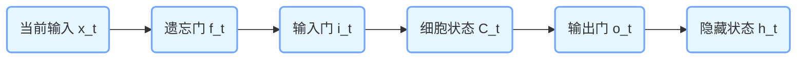

# 开发AI Agent的长短期记忆管理：平衡效率与信息保留

> 关键词：AI Agent、长短期记忆管理、效率、信息保留、记忆算法

> 摘要：本文围绕开发AI Agent的长短期记忆管理展开，深入探讨如何在效率与信息保留之间取得平衡。首先介绍了相关背景知识，包括目的、预期读者、文档结构等。接着阐述了长短期记忆管理的核心概念与联系，通过文本示意图和Mermaid流程图进行直观展示。详细讲解了核心算法原理及具体操作步骤，并给出Python源代码示例。分析了相关的数学模型和公式，辅以实际举例。通过项目实战，展示了代码实际案例及详细解释。探讨了长短期记忆管理在实际中的应用场景，推荐了相关的工具和资源。最后总结了未来发展趋势与挑战，提供了常见问题解答及扩展阅读参考资料，旨在为开发者在AI Agent长短期记忆管理方面提供全面且深入的指导。

## 1. 背景介绍 
### 1.1 目的和范围
在当今人工智能飞速发展的时代，AI Agent已经广泛应用于各个领域，如智能客服、自动驾驶、游戏等。而长短期记忆管理对于AI Agent的性能起着至关重要的作用。本文章的目的在于深入探讨如何开发AI Agent的长短期记忆管理系统，重点关注如何在保证记忆处理效率的同时，有效地保留关键信息。范围涵盖了长短期记忆管理的核心概念、算法原理、数学模型、项目实战、应用场景以及相关工具和资源等方面。

### 1.2 预期读者
本文预期读者主要包括人工智能领域的开发者、研究人员、软件架构师以及对AI Agent长短期记忆管理感兴趣的技术爱好者。对于那些希望深入了解AI Agent内部机制，特别是长短期记忆管理的读者，本文将提供有价值的知识和实践指导。

### 1.3 文档结构概述
本文将按照以下结构进行组织：首先介绍背景知识，让读者了解文章的目的、适用人群和整体结构。接着阐述长短期记忆管理的核心概念与联系，通过直观的方式展示其原理和架构。然后详细讲解核心算法原理及具体操作步骤，结合Python代码进行说明。分析相关的数学模型和公式，并举例说明其应用。通过项目实战，展示如何在实际中实现长短期记忆管理。探讨其在不同场景下的实际应用。推荐相关的学习资源、开发工具和论文著作。最后总结未来发展趋势与挑战，提供常见问题解答和扩展阅读参考资料。

### 1.4 术语表
#### 1.4.1 核心术语定义
- **AI Agent**：人工智能代理，是一种能够感知环境、进行决策并采取行动以实现特定目标的智能实体。
- **长短期记忆（LSTM）**：一种特殊的循环神经网络（RNN）结构，能够有效地处理序列数据中的长期依赖关系，在记忆信息方面具有优势。
- **记忆管理**：对AI Agent的记忆进行组织、存储、更新和检索的过程，以确保记忆的有效性和高效性。
- **信息保留**：指在记忆管理过程中，确保重要信息不被丢失或遗忘，以便在需要时能够准确地提取和使用。
- **效率**：在记忆管理中，效率主要体现在记忆处理的速度、资源利用率等方面，即在有限的时间和资源条件下完成记忆操作。

#### 1.4.2 相关概念解释
- **循环神经网络（RNN）**：是一类用于处理序列数据的神经网络，它通过在网络中引入循环结构，能够对序列中的历史信息进行记忆。但传统RNN存在梯度消失或梯度爆炸的问题，导致难以处理长序列数据。
- **遗忘门**：在LSTM中，遗忘门是一个重要的组件，它决定了上一时刻的哪些信息需要被遗忘，从而控制记忆的更新。
- **输入门**：负责决定当前输入的哪些信息需要被加入到记忆中。
- **输出门**：控制当前时刻的记忆状态有多少信息需要输出到下一层或用于决策。

#### 1.4.3 缩略词列表
- **AI**：Artificial Intelligence，人工智能
- **RNN**：Recurrent Neural Network，循环神经网络
- **LSTM**：Long Short-Term Memory，长短期记忆网络
- **GRU**：Gated Recurrent Unit，门控循环单元

## 2. 核心概念与联系 

### 核心概念原理
AI Agent的长短期记忆管理旨在解决如何让AI Agent在处理复杂任务时，既能高效地处理新信息，又能保留重要的历史信息。长短期记忆网络（LSTM）是实现这一目标的重要技术之一。

LSTM的核心思想是通过三个门控机制（遗忘门、输入门和输出门）来控制信息的流动和记忆的更新。遗忘门决定了上一时刻的哪些信息需要被遗忘，输入门决定了当前输入的哪些信息需要被加入到记忆中，输出门控制当前时刻的记忆状态有多少信息需要输出到下一层或用于决策。

### 架构的文本示意图
```plaintext
            +----------------+
            |  当前输入 (x_t)  |
            +----------------+
                   |
                   v
            +----------------+
            |    遗忘门 (f_t)    |
            +----------------+
                   |
                   v
            +----------------+
            |    输入门 (i_t)    |
            +----------------+
                   |
                   v
            +----------------+
            |   细胞状态 (C_t)   |
            +----------------+
                   |
                   v
            +----------------+
            |    输出门 (o_t)    |
            +----------------+
                   |
                   v
            +----------------+
            |  隐藏状态 (h_t)  |
            +----------------+
```

### Mermaid流程图


## 3. 核心算法原理 & 具体操作步骤 

### 核心算法原理
LSTM的核心算法基于三个门控机制和细胞状态的更新。以下是LSTM的具体计算公式：

- 遗忘门：
  $$
  f_t = \sigma(W_f \cdot [h_{t-1}, x_t] + b_f)
  $$

- 输入门：
  $$
  i_t = \sigma(W_i \cdot [h_{t-1}, x_t] + b_i)
  $$

- 候选细胞状态：
  $$
  \tilde{C}_t = \tanh(W_C \cdot [h_{t-1}, x_t] + b_C)
  $$

- 细胞状态更新：
  $$
  C_t = f_t \odot C_{t-1} + i_t \odot \tilde{C}_t
  $$

- 输出门：
  $$
  o_t = \sigma(W_o \cdot [h_{t-1}, x_t] + b_o)
  $$

- 隐藏状态：
  $$
  h_t = o_t \odot \tanh(C_t)
  $$

其中，$\sigma$ 是 sigmoid 函数，$\tanh$ 是双曲正切函数，$W$ 是权重矩阵，$b$ 是偏置向量，$\odot$ 表示逐元素相乘。

### 具体操作步骤
1. **初始化参数**：初始化权重矩阵 $W_f$、$W_i$、$W_C$、$W_o$ 和偏置向量 $b_f$、$b_i$、$b_C$、$b_o$，以及初始细胞状态 $C_0$ 和初始隐藏状态 $h_0$。
2. **输入处理**：对于每个时间步 $t$，将当前输入 $x_t$ 与上一时刻的隐藏状态 $h_{t-1}$ 拼接在一起。
3. **计算门控值**：根据上述公式计算遗忘门 $f_t$、输入门 $i_t$、候选细胞状态 $\tilde{C}_t$、细胞状态 $C_t$、输出门 $o_t$ 和隐藏状态 $h_t$。
4. **更新状态**：将当前时刻的细胞状态 $C_t$ 和隐藏状态 $h_t$ 作为下一个时间步的输入。
5. **重复步骤2 - 4**：直到处理完所有的输入序列。

### Python源代码实现
```python
import numpy as np

def sigmoid(x):
    return 1 / (1 + np.exp(-x))

def tanh(x):
    return np.tanh(x)

class LSTM:
    def __init__(self, input_size, hidden_size):
        self.input_size = input_size
        self.hidden_size = hidden_size
        
        # 初始化权重矩阵和偏置向量
        self.W_f = np.random.randn(hidden_size, input_size + hidden_size)
        self.b_f = np.zeros((hidden_size, 1))
        
        self.W_i = np.random.randn(hidden_size, input_size + hidden_size)
        self.b_i = np.zeros((hidden_size, 1))
        
        self.W_C = np.random.randn(hidden_size, input_size + hidden_size)
        self.b_C = np.zeros((hidden_size, 1))
        
        self.W_o = np.random.randn(hidden_size, input_size + hidden_size)
        self.b_o = np.zeros((hidden_size, 1))
        
    def forward(self, inputs):
        h_t = np.zeros((self.hidden_size, 1))
        C_t = np.zeros((self.hidden_size, 1))
        outputs = []
        
        for x_t in inputs:
            x_t = x_t.reshape(-1, 1)
            combined = np.vstack((h_t, x_t))
            
            # 计算遗忘门
            f_t = sigmoid(np.dot(self.W_f, combined) + self.b_f)
            
            # 计算输入门
            i_t = sigmoid(np.dot(self.W_i, combined) + self.b_i)
            
            # 计算候选细胞状态
            C_tilde = tanh(np.dot(self.W_C, combined) + self.b_C)
            
            # 更新细胞状态
            C_t = f_t * C_t + i_t * C_tilde
            
            # 计算输出门
            o_t = sigmoid(np.dot(self.W_o, combined) + self.b_o)
            
            # 计算隐藏状态
            h_t = o_t * tanh(C_t)
            
            outputs.append(h_t.flatten())
        
        return outputs

# 示例使用
input_size = 3
hidden_size = 4
lstm = LSTM(input_size, hidden_size)

# 生成输入序列
inputs = [np.random.randn(input_size) for _ in range(5)]

# 前向传播
outputs = lstm.forward(inputs)
print(outputs)
```

## 4. 数学模型和公式 & 详细讲解 & 举例说明 

### 数学模型和公式
在LSTM中，核心的数学模型和公式主要包括门控机制和细胞状态的更新。以下是对这些公式的详细讲解：

#### 遗忘门
$$
f_t = \sigma(W_f \cdot [h_{t-1}, x_t] + b_f)
$$
遗忘门的作用是决定上一时刻的细胞状态 $C_{t-1}$ 中有多少信息需要被遗忘。$W_f$ 是遗忘门的权重矩阵，$b_f$ 是偏置向量，$[h_{t-1}, x_t]$ 表示将上一时刻的隐藏状态 $h_{t-1}$ 和当前输入 $x_t$ 拼接在一起。$\sigma$ 是 sigmoid 函数，其输出范围在 $[0, 1]$ 之间，$f_t$ 中的每个元素表示对应信息需要被遗忘的程度，0 表示完全遗忘，1 表示完全保留。

#### 输入门
$$
i_t = \sigma(W_i \cdot [h_{t-1}, x_t] + b_i)
$$
输入门用于决定当前输入 $x_t$ 中有多少信息需要被加入到细胞状态中。$W_i$ 是输入门的权重矩阵，$b_i$ 是偏置向量。同样，$\sigma$ 函数的输出范围在 $[0, 1]$ 之间，$i_t$ 中的每个元素表示对应信息需要被加入的程度。

#### 候选细胞状态
$$
\tilde{C}_t = \tanh(W_C \cdot [h_{t-1}, x_t] + b_C)
$$
候选细胞状态 $\tilde{C}_t$ 是当前输入 $x_t$ 和上一时刻隐藏状态 $h_{t-1}$ 经过线性变换和 $\tanh$ 函数处理后得到的结果。$\tanh$ 函数的输出范围在 $[-1, 1]$ 之间，用于生成可能要加入到细胞状态中的新信息。

#### 细胞状态更新
$$
C_t = f_t \odot C_{t-1} + i_t \odot \tilde{C}_t
$$
细胞状态 $C_t$ 的更新是通过遗忘门和输入门共同控制的。$f_t \odot C_{t-1}$ 表示对上一时刻的细胞状态进行遗忘操作，$i_t \odot \tilde{C}_t$ 表示将候选细胞状态中的部分信息加入到细胞状态中。

#### 输出门
$$
o_t = \sigma(W_o \cdot [h_{t-1}, x_t] + b_o)
$$
输出门决定了当前时刻的细胞状态 $C_t$ 中有多少信息需要输出到隐藏状态 $h_t$ 中。$W_o$ 是输出门的权重矩阵，$b_o$ 是偏置向量。

#### 隐藏状态
$$
h_t = o_t \odot \tanh(C_t)
$$
隐藏状态 $h_t$ 是输出门和经过 $\tanh$ 函数处理后的细胞状态的逐元素相乘结果，用于传递到下一个时间步或作为最终输出。

### 举例说明
假设我们有一个简单的序列数据，每个时间步的输入 $x_t$ 是一个长度为 2 的向量，隐藏状态 $h_t$ 和细胞状态 $C_t$ 的长度为 3。

```python
import numpy as np

# 初始化参数
input_size = 2
hidden_size = 3

W_f = np.random.randn(hidden_size, input_size + hidden_size)
b_f = np.zeros((hidden_size, 1))

W_i = np.random.randn(hidden_size, input_size + hidden_size)
b_i = np.zeros((hidden_size, 1))

W_C = np.random.randn(hidden_size, input_size + hidden_size)
b_C = np.zeros((hidden_size, 1))

W_o = np.random.randn(hidden_size, input_size + hidden_size)
b_o = np.zeros((hidden_size, 1))

# 初始隐藏状态和细胞状态
h_0 = np.zeros((hidden_size, 1))
C_0 = np.zeros((hidden_size, 1))

# 第一个时间步的输入
x_1 = np.random.randn(input_size).reshape(-1, 1)

# 拼接输入和隐藏状态
combined = np.vstack((h_0, x_1))

# 计算遗忘门
f_1 = 1 / (1 + np.exp(-(np.dot(W_f, combined) + b_f)))

# 计算输入门
i_1 = 1 / (1 + np.exp(-(np.dot(W_i, combined) + b_i)))

# 计算候选细胞状态
C_tilde_1 = np.tanh(np.dot(W_C, combined) + b_C)

# 更新细胞状态
C_1 = f_1 * C_0 + i_1 * C_tilde_1

# 计算输出门
o_1 = 1 / (1 + np.exp(-(np.dot(W_o, combined) + b_o)))

# 计算隐藏状态
h_1 = o_1 * np.tanh(C_1)

print("遗忘门 f_1:", f_1)
print("输入门 i_1:", i_1)
print("候选细胞状态 C_tilde_1:", C_tilde_1)
print("细胞状态 C_1:", C_1)
print("输出门 o_1:", o_1)
print("隐藏状态 h_1:", h_1)
```

在这个例子中，我们展示了如何根据第一个时间步的输入 $x_1$ 计算遗忘门、输入门、候选细胞状态、细胞状态、输出门和隐藏状态。通过这些计算，LSTM能够有效地处理序列数据中的长期依赖关系，同时平衡信息的保留和更新。

## 5. 项目实战：代码实际案例和详细解释说明 

### 5.1  开发环境搭建
为了实现AI Agent的长短期记忆管理项目，我们需要搭建相应的开发环境。以下是具体步骤：

#### 安装Python
首先，确保你已经安装了Python。推荐使用Python 3.7及以上版本。你可以从Python官方网站（https://www.python.org/downloads/）下载并安装适合你操作系统的Python版本。

#### 安装必要的库
我们需要安装一些常用的Python库，如NumPy、PyTorch等。可以使用以下命令进行安装：
```bash
pip install numpy torch
```

### 5.2  源代码详细实现和代码解读
以下是一个使用PyTorch实现的简单AI Agent长短期记忆管理项目示例，用于处理文本序列分类任务：

```python
import torch
import torch.nn as nn
import torch.optim as optim
from torch.utils.data import Dataset, DataLoader

# 定义数据集类
class TextDataset(Dataset):
    def __init__(self, data, labels):
        self.data = data
        self.labels = labels
    
    def __len__(self):
        return len(self.data)
    
    def __getitem__(self, idx):
        return torch.tensor(self.data[idx]), torch.tensor(self.labels[idx])

# 定义LSTM模型
class LSTMModel(nn.Module):
    def __init__(self, input_size, hidden_size, num_layers, num_classes):
        super(LSTMModel, self).__init__()
        self.hidden_size = hidden_size
        self.num_layers = num_layers
        self.lstm = nn.LSTM(input_size, hidden_size, num_layers, batch_first=True)
        self.fc = nn.Linear(hidden_size, num_classes)
    
    def forward(self, x):
        # 初始化隐藏状态和细胞状态
        h0 = torch.zeros(self.num_layers, x.size(0), self.hidden_size).to(x.device)
        c0 = torch.zeros(self.num_layers, x.size(0), self.hidden_size).to(x.device)
        
        # 前向传播LSTM
        out, _ = self.lstm(x, (h0, c0))
        
        # 取最后一个时间步的输出
        out = out[:, -1, :]
        
        # 全连接层
        out = self.fc(out)
        return out

# 生成示例数据
data = [[1, 2, 3], [4, 5, 6], [7, 8, 9]]
labels = [0, 1, 0]

# 创建数据集和数据加载器
dataset = TextDataset(data, labels)
dataloader = DataLoader(dataset, batch_size=2, shuffle=True)

# 初始化模型、损失函数和优化器
input_size = 3
hidden_size = 4
num_layers = 1
num_classes = 2
model = LSTMModel(input_size, hidden_size, num_layers, num_classes)
criterion = nn.CrossEntropyLoss()
optimizer = optim.Adam(model.parameters(), lr=0.001)

# 训练模型
num_epochs = 10
for epoch in range(num_epochs):
    for inputs, labels in dataloader:
        # 前向传播
        outputs = model(inputs.float())
        loss = criterion(outputs, labels)
        
        # 反向传播和优化
        optimizer.zero_grad()
        loss.backward()
        optimizer.step()
    
    print(f'Epoch [{epoch+1}/{num_epochs}], Loss: {loss.item():.4f}')
```

### 5.3  代码解读与分析
#### 数据集类 `TextDataset`
这个类继承自 `torch.utils.data.Dataset`，用于封装数据和标签。`__len__` 方法返回数据集的长度，`__getitem__` 方法根据索引返回对应的输入数据和标签。

#### LSTM模型类 `LSTMModel`
这个类继承自 `nn.Module`，定义了一个简单的LSTM模型。在 `__init__` 方法中，初始化了LSTM层和全连接层。`forward` 方法实现了模型的前向传播过程，包括初始化隐藏状态和细胞状态、LSTM层的前向传播、取最后一个时间步的输出和全连接层的计算。

#### 数据加载和训练过程
首先，我们生成了一些示例数据和标签，并创建了数据集和数据加载器。然后，初始化了模型、损失函数和优化器。在训练过程中，使用 `for` 循环遍历每个epoch，对于每个epoch，再遍历数据加载器中的每个批次。在每个批次中，进行前向传播、计算损失、反向传播和优化操作。最后，打印每个epoch的损失值。

通过这个项目实战，我们展示了如何使用PyTorch实现一个简单的AI Agent长短期记忆管理系统，用于文本序列分类任务。在实际应用中，可以根据具体需求对模型进行调整和扩展。

## 6. 实际应用场景 
AI Agent的长短期记忆管理在许多实际场景中都有广泛的应用，以下是一些常见的应用场景：

### 自然语言处理
- **机器翻译**：在机器翻译任务中，AI Agent需要处理输入句子的长期依赖关系，以便准确地翻译出目标语言。长短期记忆管理可以帮助AI Agent记住句子中的上下文信息，提高翻译的准确性。
- **文本生成**：如故事生成、诗歌创作等，AI Agent需要根据前面生成的文本内容来生成后续的文本。长短期记忆管理可以保留之前生成的文本信息，使生成的文本更加连贯和合理。
- **情感分析**：在分析文本的情感倾向时，AI Agent需要考虑文本中的上下文信息。长短期记忆管理可以帮助AI Agent捕捉到文本中的情感变化，提高情感分析的准确性。

### 语音识别
在语音识别任务中，AI Agent需要处理连续的语音信号。长短期记忆管理可以帮助AI Agent记住之前的语音特征，从而更好地识别语音中的单词和句子。例如，在处理长句子或带有口音的语音时，长短期记忆管理可以提高识别的准确率。

### 自动驾驶
在自动驾驶系统中，AI Agent需要不断地感知周围的环境信息，如道路状况、交通标志、其他车辆的位置等。长短期记忆管理可以帮助AI Agent记住之前的环境信息，从而做出更准确的决策。例如，在遇到复杂的交通场景时，AI Agent可以根据之前的记忆信息来预测其他车辆的行驶轨迹，避免发生碰撞。

### 游戏
在游戏中，AI Agent需要根据游戏的历史状态来做出决策。长短期记忆管理可以帮助AI Agent记住之前的游戏状态，从而更好地应对不同的游戏情况。例如，在策略游戏中，AI Agent可以根据之前的玩家行动和游戏局势来制定自己的策略。

## 7. 工具和资源推荐
### 7.1 学习资源推荐
#### 7.1.1 书籍推荐
- 《深度学习》（Deep Learning）：由Ian Goodfellow、Yoshua Bengio和Aaron Courville所著，是深度学习领域的经典教材，涵盖了深度学习的基本概念、算法和应用，包括长短期记忆网络等内容。
- 《Python深度学习》（Deep Learning with Python）：由Francois Chollet所著，结合Python和Keras框架，详细介绍了深度学习的实践方法，对于初学者来说是一本很好的入门书籍。
- 《神经网络与深度学习》：由邱锡鹏所著，系统地介绍了神经网络和深度学习的基本原理、算法和应用，内容丰富，适合深入学习。

#### 7.1.2 在线课程
- Coursera上的“深度学习专项课程”（Deep Learning Specialization）：由Andrew Ng教授授课，包括五门课程，全面介绍了深度学习的各个方面，包括长短期记忆网络等循环神经网络。
- edX上的“强化学习基础”（Fundamentals of Reinforcement Learning）：介绍了强化学习的基本概念和算法，对于理解AI Agent的决策过程有很大帮助。
- 哔哩哔哩（Bilibili）上有许多关于深度学习和人工智能的教程视频，例如李宏毅老师的机器学习课程，讲解生动有趣，适合初学者学习。

#### 7.1.3 技术博客和网站
- Medium：是一个技术博客平台，有许多关于人工智能和深度学习的优质文章，涵盖了最新的研究成果和实践经验。
- Towards Data Science：专注于数据科学和机器学习领域，提供了大量的技术文章和教程，对于学习长短期记忆管理等技术有很大帮助。
- arXiv：是一个预印本平台，收录了许多最新的学术论文，包括人工智能和深度学习领域的研究成果。

### 7.2 开发工具框架推荐
#### 7.2.1 IDE和编辑器
- PyCharm：是一款专门为Python开发设计的集成开发环境（IDE），具有强大的代码编辑、调试和自动补全功能，适合开发AI Agent长短期记忆管理项目。
- Jupyter Notebook：是一个交互式的开发环境，支持Python等多种编程语言，适合进行数据分析、模型训练和实验验证。
- Visual Studio Code：是一款轻量级的代码编辑器，支持多种编程语言和插件扩展，对于快速开发和调试代码非常方便。

#### 7.2.2 调试和性能分析工具
- TensorBoard：是TensorFlow提供的一个可视化工具，可以用于可视化模型的训练过程、损失曲线、梯度变化等信息，帮助开发者调试和优化模型。
- PyTorch Profiler：是PyTorch提供的一个性能分析工具，可以用于分析模型的运行时间、内存使用情况等，帮助开发者找出性能瓶颈。
- cProfile：是Python标准库中的一个性能分析工具，可以用于分析Python代码的运行时间和函数调用情况。

#### 7.2.3 相关框架和库
- PyTorch：是一个开源的深度学习框架，提供了丰富的神经网络层和优化算法，支持GPU加速，适合开发AI Agent长短期记忆管理项目。
- TensorFlow：是另一个广泛使用的深度学习框架，具有强大的分布式训练和部署能力，提供了高级的API和工具，方便开发者进行模型开发和训练。
- Keras：是一个高级神经网络API，可以运行在TensorFlow、Theano等后端之上，提供了简单易用的接口，适合快速搭建和训练模型。

### 7.3 相关论文著作推荐
#### 7.3.1 经典论文
- "Long Short-Term Memory"：由Sepp Hochreiter和Jürgen Schmidhuber于1997年发表，首次提出了长短期记忆网络（LSTM）的概念，是LSTM领域的经典论文。
- "Gated Recurrent Unit"：由Kyunghyun Cho等人于2014年发表，提出了门控循环单元（GRU），是另一种常用的循环神经网络结构。
- "Sequence to Sequence Learning with Neural Networks"：由Ilya Sutskever等人于2014年发表，提出了基于序列到序列（Seq2Seq）模型的机器翻译方法，为自然语言处理领域的发展奠定了基础。

#### 7.3.2 最新研究成果
可以通过arXiv、ACM Digital Library、IEEE Xplore等学术数据库搜索最新的关于AI Agent长短期记忆管理的研究论文。关注顶级学术会议，如NeurIPS、ICML、ACL等，这些会议上会发表许多最新的研究成果。

#### 7.3.3 应用案例分析
- 《人工智能：现代方法》（Artificial Intelligence: A Modern Approach）：书中包含了许多人工智能的应用案例分析，包括AI Agent在不同领域的应用，对于理解长短期记忆管理的实际应用有很大帮助。
- 各大科技公司的技术博客，如Google AI Blog、Facebook AI Research等，会分享一些他们在AI Agent长短期记忆管理方面的应用案例和实践经验。

## 8. 总结：未来发展趋势与挑战
### 未来发展趋势
- **融合多种记忆机制**：未来的AI Agent可能会融合长短期记忆与其他记忆机制，如工作记忆、情景记忆等，以实现更复杂的认知和决策能力。例如，结合工作记忆可以更好地处理当前任务的临时信息，结合情景记忆可以使AI Agent更好地理解和应对特定场景。
- **与强化学习深度结合**：强化学习在AI Agent的决策过程中起着重要作用，将长短期记忆管理与强化学习深度结合，可以使AI Agent在动态环境中更好地学习和适应。例如，通过长短期记忆网络存储历史状态和奖励信息，帮助强化学习算法更有效地探索和利用环境。
- **跨领域应用拓展**：随着AI技术的不断发展，AI Agent的长短期记忆管理将在更多领域得到应用，如医疗保健、金融、教育等。例如，在医疗保健领域，AI Agent可以利用长短期记忆管理技术分析患者的历史病历和治疗记录，为医生提供更准确的诊断和治疗建议。

### 挑战
- **计算资源需求**：长短期记忆网络通常需要大量的计算资源和内存来训练和运行，特别是在处理大规模数据和复杂任务时。如何在有限的计算资源下提高长短期记忆管理的效率是一个挑战。
- **可解释性问题**：长短期记忆网络是一种黑盒模型，其决策过程和记忆机制往往难以解释。在一些对可解释性要求较高的领域，如医疗和金融，如何提高长短期记忆管理的可解释性是一个亟待解决的问题。
- **数据隐私和安全**：AI Agent在处理长短期记忆时需要存储大量的历史数据，这些数据可能包含用户的敏感信息。如何保障数据的隐私和安全，防止数据泄露和滥用，是一个重要的挑战。

## 9. 附录：常见问题与解答
### 1. 长短期记忆网络（LSTM）和门控循环单元（GRU）有什么区别？
LSTM和GRU都是循环神经网络的变体，用于处理序列数据中的长期依赖关系。它们的主要区别在于门控机制的设计。LSTM有三个门控（遗忘门、输入门和输出门），而GRU只有两个门控（重置门和更新门）。GRU的结构相对简单，计算效率更高，但在某些任务上LSTM可能表现更好。

### 2. 如何选择合适的隐藏层大小和层数？
隐藏层大小和层数的选择通常需要通过实验来确定。一般来说，隐藏层大小越大，模型的表达能力越强，但计算复杂度也会增加。层数越多，模型可以学习到更复杂的特征，但也容易出现过拟合问题。可以通过交叉验证等方法，尝试不同的隐藏层大小和层数，选择在验证集上表现最好的组合。

### 3. 长短期记忆网络容易出现过拟合问题吗？如何解决？
长短期记忆网络在训练数据较少或模型复杂度较高时容易出现过拟合问题。可以采取以下方法来解决：
- **增加训练数据**：收集更多的数据来训练模型，提高模型的泛化能力。
- **正则化**：使用L1或L2正则化方法，对模型的权重进行约束，防止模型过拟合。
- **Dropout**：在模型的某些层中随机丢弃一些神经元，减少神经元之间的共适应，提高模型的泛化能力。
- **提前停止**：在训练过程中，监控验证集的性能，当验证集的性能不再提升时，停止训练，避免模型过拟合。

### 4. 如何优化长短期记忆网络的训练速度？
可以采取以下方法来优化长短期记忆网络的训练速度：
- **使用GPU加速**：将模型和数据转移到GPU上进行训练，可以显著提高训练速度。
- **调整批量大小**：适当增大批量大小可以减少训练的迭代次数，提高训练速度。但批量大小过大可能会导致内存不足。
- **优化学习率**：选择合适的学习率可以加快模型的收敛速度。可以使用学习率调度器，在训练过程中动态调整学习率。
- **使用高效的优化算法**：如Adam、Adagrad等优化算法，这些算法可以自适应地调整学习率，提高训练效率。

## 10. 扩展阅读 & 参考资料
- Hochreiter, S., & Schmidhuber, J. (1997). Long short-term memory. Neural computation, 9(8), 1735-1780.
- Cho, K., Van Merriënboer, B., Bahdanau, D., & Bengio, Y. (2014). On the properties of neural machine translation: Encoder-decoder approaches. arXiv preprint arXiv:1409.1259.
- Sutskever, I., Vinyals, O., & Le, Q. V. (2014). Sequence to sequence learning with neural networks. In Advances in neural information processing systems (pp. 3104-3112).
- Goodfellow, I., Bengio, Y., & Courville, A. (2016). Deep learning. MIT press.
- Chollet, F. (2017). Deep learning with Python. Manning Publications.

作者：AI天才研究院/AI Genius Institute & 禅与计算机程序设计艺术 /Zen And The Art of Computer Programming