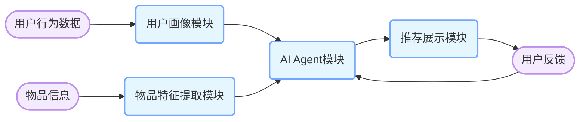

# 开发AI Agent驱动的个性化推荐系统

> 关键词：AI Agent、个性化推荐系统、机器学习、深度学习、推荐算法、用户画像、数据挖掘

> 摘要：本文旨在深入探讨如何开发AI Agent驱动的个性化推荐系统。首先介绍了该系统开发的背景，包括目的、预期读者、文档结构和相关术语。接着阐述了核心概念与联系，展示了系统的原理和架构。详细讲解了核心算法原理，并用Python代码进行了示例。通过数学模型和公式进一步剖析了推荐机制。在项目实战部分，从开发环境搭建到源代码实现及解读，进行了全面的介绍。分析了实际应用场景，推荐了相关的学习资源、开发工具框架和论文著作。最后总结了未来发展趋势与挑战，提供了常见问题解答和扩展阅读参考资料，为开发者提供了一个完整的开发指南。

## 1. 背景介绍 
### 1.1 目的和范围
在当今信息爆炸的时代，用户面临着海量的信息，如何从这些信息中快速找到自己感兴趣的内容成为了一个难题。个性化推荐系统应运而生，它能够根据用户的历史行为、兴趣偏好等信息，为用户提供个性化的推荐内容，提高用户的信息获取效率和满意度。而AI Agent的引入，使得推荐系统更加智能化和自适应，能够更好地理解用户的需求和意图。

本文的范围涵盖了开发AI Agent驱动的个性化推荐系统的各个方面，包括核心概念、算法原理、数学模型、项目实战、应用场景、工具资源等，旨在为开发者提供一个全面的开发指南。

### 1.2 预期读者
本文的预期读者包括软件开发工程师、数据科学家、人工智能研究者、对个性化推荐系统感兴趣的技术爱好者等。无论是初学者还是有一定经验的开发者，都能从本文中获取有价值的信息。

### 1.3 文档结构概述
本文将按照以下结构进行组织：
1. **背景介绍**：介绍开发AI Agent驱动的个性化推荐系统的目的、预期读者、文档结构和相关术语。
2. **核心概念与联系**：阐述AI Agent、个性化推荐系统等核心概念，展示系统的原理和架构。
3. **核心算法原理 & 具体操作步骤**：详细讲解推荐算法的原理，并用Python代码进行示例。
4. **数学模型和公式 & 详细讲解 & 举例说明**：通过数学模型和公式进一步剖析推荐机制。
5. **项目实战：代码实际案例和详细解释说明**：从开发环境搭建到源代码实现及解读，进行全面的介绍。
6. **实际应用场景**：分析AI Agent驱动的个性化推荐系统在不同领域的应用场景。
7. **工具和资源推荐**：推荐相关的学习资源、开发工具框架和论文著作。
8. **总结：未来发展趋势与挑战**：总结系统的未来发展趋势和面临的挑战。
9. **附录：常见问题与解答**：提供常见问题的解答。
10. **扩展阅读 & 参考资料**：提供相关的扩展阅读和参考资料。

### 1.4 术语表
#### 1.4.1 核心术语定义
- **AI Agent**：人工智能代理，是一种能够感知环境、自主决策并采取行动的智能实体。在个性化推荐系统中，AI Agent可以根据用户的行为和反馈，不断调整推荐策略。
- **个性化推荐系统**：根据用户的历史行为、兴趣偏好等信息，为用户提供个性化的推荐内容的系统。
- **用户画像**：对用户的特征、行为、兴趣等信息进行建模和描述，以便更好地理解用户的需求和意图。
- **推荐算法**：用于计算用户与物品之间的相似度，从而生成推荐列表的算法。

#### 1.4.2 相关概念解释
- **协同过滤**：一种基于用户行为的推荐算法，通过寻找与目标用户兴趣相似的其他用户，来推荐这些用户喜欢的物品。
- **深度学习**：一种机器学习技术，通过构建多层神经网络来学习数据的特征和模式，在推荐系统中可以用于提取用户和物品的特征。
- **强化学习**：一种通过智能体与环境进行交互，不断尝试不同的行为并获得奖励反馈，从而学习最优行为策略的机器学习方法，在推荐系统中可以用于优化推荐策略。

#### 1.4.3 缩略词列表
- **CF**：协同过滤（Collaborative Filtering）
- **DNN**：深度神经网络（Deep Neural Network）
- **RL**：强化学习（Reinforcement Learning）

## 2. 核心概念与联系 
### 核心概念原理
AI Agent驱动的个性化推荐系统主要由以下几个核心部分组成：
1. **用户画像模块**：收集用户的历史行为数据，如浏览记录、购买记录、评分等，通过数据分析和挖掘技术，构建用户画像，描述用户的特征、兴趣和偏好。
2. **物品特征提取模块**：对推荐物品进行特征提取，如物品的类别、属性、标签等，以便更好地理解物品的特点。
3. **AI Agent模块**：作为系统的智能决策中心，AI Agent根据用户画像和物品特征，运用推荐算法计算用户与物品之间的相似度，生成推荐列表。同时，AI Agent还可以根据用户的反馈信息，不断调整推荐策略，提高推荐的准确性和满意度。
4. **推荐展示模块**：将生成的推荐列表展示给用户，用户可以根据自己的需求进行选择和交互。

### 架构的文本示意图
```plaintext
+----------------------+
|      用户界面       |
+----------------------+
         |
         v
+----------------------+
|    推荐展示模块      |
+----------------------+
         |
         v
+----------------------+
|      AI Agent模块    |
+----------------------+
         |
         v
+----------------------+
| 用户画像模块  | 物品特征提取模块 |
+----------------------+
         |
         v
+----------------------+
|      数据存储模块    |
+----------------------+
```

### Mermaid流程图


## 3. 核心算法原理 & 具体操作步骤 
### 协同过滤算法原理
协同过滤是一种基于用户行为的推荐算法，主要分为基于用户的协同过滤（User-based CF）和基于物品的协同过滤（Item-based CF）。

#### 基于用户的协同过滤
基于用户的协同过滤算法的核心思想是寻找与目标用户兴趣相似的其他用户，然后根据这些相似用户的历史行为来推荐物品。具体步骤如下：
1. **计算用户相似度**：常用的相似度计算方法有余弦相似度、皮尔逊相关系数等。以余弦相似度为例，假设用户 $u$ 和用户 $v$ 的评分向量分别为 $\mathbf{r}_u$ 和 $\mathbf{r}_v$，则它们之间的余弦相似度为：
$$
\cos(\mathbf{r}_u, \mathbf{r}_v) = \frac{\mathbf{r}_u \cdot \mathbf{r}_v}{\|\mathbf{r}_u\| \|\mathbf{r}_v\|}
$$
2. **寻找相似用户**：根据计算得到的相似度，选择与目标用户相似度较高的 $K$ 个用户作为邻居。
3. **生成推荐列表**：根据邻居用户的评分情况，预测目标用户对未评分物品的评分，选择评分较高的物品作为推荐列表。

#### Python代码实现
```python
import numpy as np

def cosine_similarity(user1, user2):
    """
    计算两个用户之间的余弦相似度
    """
    dot_product = np.dot(user1, user2)
    norm_user1 = np.linalg.norm(user1)
    norm_user2 = np.linalg.norm(user2)
    if norm_user1 == 0 or norm_user2 == 0:
        return 0
    return dot_product / (norm_user1 * norm_user2)

def user_based_cf(ratings, target_user, K):
    """
    基于用户的协同过滤算法
    """
    num_users, num_items = ratings.shape
    similarities = []
    for i in range(num_users):
        if i!= target_user:
            similarity = cosine_similarity(ratings[target_user], ratings[i])
            similarities.append((i, similarity))
    # 按相似度排序
    similarities.sort(key=lambda x: x[1], reverse=True)
    # 选择前K个相似用户
    top_k_users = [user for user, _ in similarities[:K]]
    # 预测目标用户对未评分物品的评分
    predictions = []
    for item in range(num_items):
        if ratings[target_user][item] == 0:
            weighted_sum = 0
            similarity_sum = 0
            for user in top_k_users:
                if ratings[user][item]!= 0:
                    weighted_sum += similarities[user][1] * ratings[user][item]
                    similarity_sum += similarities[user][1]
            if similarity_sum!= 0:
                prediction = weighted_sum / similarity_sum
                predictions.append((item, prediction))
    # 按预测评分排序
    predictions.sort(key=lambda x: x[1], reverse=True)
    # 生成推荐列表
    recommended_items = [item for item, _ in predictions]
    return recommended_items

# 示例数据
ratings = np.array([
    [5, 3, 0, 1],
    [4, 0, 0, 1],
    [1, 1, 0, 5],
    [1, 0, 0, 4],
    [0, 1, 5, 4]
])
target_user = 0
K = 2
recommended_items = user_based_cf(ratings, target_user, K)
print("推荐物品列表:", recommended_items)
```

### 基于物品的协同过滤
基于物品的协同过滤算法的核心思想是寻找与目标物品相似的其他物品，然后根据用户对这些相似物品的评分来推荐目标物品。具体步骤如下：
1. **计算物品相似度**：同样可以使用余弦相似度等方法计算物品之间的相似度。
2. **寻找相似物品**：根据计算得到的相似度，选择与目标物品相似度较高的 $K$ 个物品作为邻居。
3. **生成推荐列表**：根据用户对邻居物品的评分情况，预测用户对目标物品的评分，选择评分较高的物品作为推荐列表。

#### Python代码实现
```python
def item_based_cf(ratings, target_user, K):
    """
    基于物品的协同过滤算法
    """
    num_users, num_items = ratings.shape
    item_similarities = np.zeros((num_items, num_items))
    # 计算物品相似度
    for i in range(num_items):
        for j in range(num_items):
            if i!= j:
                item_similarities[i][j] = cosine_similarity(ratings[:, i], ratings[:, j])
    # 预测目标用户对未评分物品的评分
    predictions = []
    for item in range(num_items):
        if ratings[target_user][item] == 0:
            weighted_sum = 0
            similarity_sum = 0
            top_k_items = np.argsort(item_similarities[item])[-K:][::-1]
            for neighbor_item in top_k_items:
                if ratings[target_user][neighbor_item]!= 0:
                    weighted_sum += item_similarities[item][neighbor_item] * ratings[target_user][neighbor_item]
                    similarity_sum += item_similarities[item][neighbor_item]
            if similarity_sum!= 0:
                prediction = weighted_sum / similarity_sum
                predictions.append((item, prediction))
    # 按预测评分排序
    predictions.sort(key=lambda x: x[1], reverse=True)
    # 生成推荐列表
    recommended_items = [item for item, _ in predictions]
    return recommended_items

# 示例数据
ratings = np.array([
    [5, 3, 0, 1],
    [4, 0, 0, 1],
    [1, 1, 0, 5],
    [1, 0, 0, 4],
    [0, 1, 5, 4]
])
target_user = 0
K = 2
recommended_items = item_based_cf(ratings, target_user, K)
print("推荐物品列表:", recommended_items)
```

## 4. 数学模型和公式 & 详细讲解 & 举例说明 
### 协同过滤算法的数学模型
#### 基于用户的协同过滤
设用户集合为 $U = \{u_1, u_2, \cdots, u_m\}$，物品集合为 $I = \{i_1, i_2, \cdots, i_n\}$，用户 $u$ 对物品 $i$ 的评分记为 $r_{ui}$。对于目标用户 $u$，要预测其对未评分物品 $i$ 的评分 $\hat{r}_{ui}$，可以使用以下公式：
$$
\hat{r}_{ui} = \bar{r}_u + \frac{\sum_{v \in N(u)} w_{uv} (r_{vi} - \bar{r}_v)}{\sum_{v \in N(u)} |w_{uv}|}
$$
其中，$\bar{r}_u$ 是用户 $u$ 的平均评分，$N(u)$ 是与用户 $u$ 相似的邻居用户集合，$w_{uv}$ 是用户 $u$ 和用户 $v$ 之间的相似度，$r_{vi}$ 是用户 $v$ 对物品 $i$ 的评分，$\bar{r}_v$ 是用户 $v$ 的平均评分。

#### 举例说明
假设用户评分矩阵如下：
| 用户 | 物品1 | 物品2 | 物品3 | 物品4 |
|------|------|------|------|------|
| 用户1 | 5 | 3 | 0 | 1 |
| 用户2 | 4 | 0 | 0 | 1 |
| 用户3 | 1 | 1 | 0 | 5 |
| 用户4 | 1 | 0 | 0 | 4 |
| 用户5 | 0 | 1 | 5 | 4 |

以用户1为例，要预测其对物品3的评分。首先计算用户1的平均评分 $\bar{r}_1 = \frac{5 + 3 + 1}{3} = 3$。然后选择与用户1相似度较高的两个用户作为邻居，假设为用户2和用户3。计算用户1和用户2的相似度 $w_{12}$，用户1和用户3的相似度 $w_{13}$。用户2的平均评分 $\bar{r}_2 = \frac{4 + 1}{2} = 2.5$，用户3的平均评分 $\bar{r}_3 = \frac{1 + 1 + 5}{3} = \frac{7}{3}$。

由于用户2和用户3对物品3的评分都为0，所以预测评分 $\hat{r}_{13} = \bar{r}_1 = 3$。

#### 基于物品的协同过滤
对于目标物品 $i$，要预测用户 $u$ 对其的评分 $\hat{r}_{ui}$，可以使用以下公式：
$$
\hat{r}_{ui} = \frac{\sum_{j \in N(i)} w_{ij} r_{uj}}{\sum_{j \in N(i)} |w_{ij}|}
$$
其中，$N(i)$ 是与物品 $i$ 相似的邻居物品集合，$w_{ij}$ 是物品 $i$ 和物品 $j$ 之间的相似度，$r_{uj}$ 是用户 $u$ 对物品 $j$ 的评分。

#### 举例说明
同样以上述用户评分矩阵为例，要预测用户1对物品3的评分。首先计算物品3与其他物品的相似度，选择与物品3相似度较高的两个物品作为邻居，假设为物品2和物品4。计算物品3和物品2的相似度 $w_{32}$，物品3和物品4的相似度 $w_{34}$。

用户1对物品2的评分 $r_{12} = 3$，用户1对物品4的评分 $r_{14} = 1$。则预测评分 $\hat{r}_{13} = \frac{w_{32} \times 3 + w_{34} \times 1}{|w_{32}| + |w_{34}|}$。

## 5. 项目实战：代码实际案例和详细解释说明 
### 5.1  开发环境搭建
#### 操作系统
推荐使用Linux或macOS系统，因为它们对Python开发环境的支持较好。如果使用Windows系统，也可以安装Python和相关开发工具。

#### Python版本
建议使用Python 3.7及以上版本，可以从Python官方网站（https://www.python.org/downloads/）下载安装。

#### 依赖库安装
在开发AI Agent驱动的个性化推荐系统时，需要使用一些Python依赖库，如NumPy、Pandas、Scikit-learn等。可以使用以下命令进行安装：
```bash
pip install numpy pandas scikit-learn
```

### 5.2  源代码详细实现和代码解读
#### 数据加载和预处理
```python
import pandas as pd

def load_data(file_path):
    """
    加载数据
    """
    data = pd.read_csv(file_path)
    return data

def preprocess_data(data):
    """
    数据预处理
    """
    # 去除缺失值
    data = data.dropna()
    # 转换数据格式
    data['user_id'] = data['user_id'].astype(int)
    data['item_id'] = data['item_id'].astype(int)
    data['rating'] = data['rating'].astype(float)
    return data

# 示例数据文件路径
file_path = 'data.csv'
data = load_data(file_path)
data = preprocess_data(data)
```
**代码解读**：
- `load_data` 函数用于加载CSV格式的数据文件，并返回一个Pandas DataFrame对象。
- `preprocess_data` 函数用于对数据进行预处理，包括去除缺失值和转换数据格式。

#### 构建用户评分矩阵
```python
import numpy as np

def build_rating_matrix(data):
    """
    构建用户评分矩阵
    """
    num_users = data['user_id'].nunique()
    num_items = data['item_id'].nunique()
    rating_matrix = np.zeros((num_users, num_items))
    for index, row in data.iterrows():
        user_id = row['user_id']
        item_id = row['item_id']
        rating = row['rating']
        rating_matrix[user_id][item_id] = rating
    return rating_matrix

rating_matrix = build_rating_matrix(data)
```
**代码解读**：
- `build_rating_matrix` 函数用于构建用户评分矩阵，通过遍历数据中的每一行，将用户对物品的评分填充到矩阵中。

#### 基于用户的协同过滤推荐
```python
def user_based_cf_recommendation(rating_matrix, target_user, K):
    """
    基于用户的协同过滤推荐
    """
    num_users, num_items = rating_matrix.shape
    similarities = []
    for i in range(num_users):
        if i!= target_user:
            similarity = cosine_similarity(rating_matrix[target_user], rating_matrix[i])
            similarities.append((i, similarity))
    # 按相似度排序
    similarities.sort(key=lambda x: x[1], reverse=True)
    # 选择前K个相似用户
    top_k_users = [user for user, _ in similarities[:K]]
    # 预测目标用户对未评分物品的评分
    predictions = []
    for item in range(num_items):
        if rating_matrix[target_user][item] == 0:
            weighted_sum = 0
            similarity_sum = 0
            for user in top_k_users:
                if rating_matrix[user][item]!= 0:
                    weighted_sum += similarities[user][1] * rating_matrix[user][item]
                    similarity_sum += similarities[user][1]
            if similarity_sum!= 0:
                prediction = weighted_sum / similarity_sum
                predictions.append((item, prediction))
    # 按预测评分排序
    predictions.sort(key=lambda x: x[1], reverse=True)
    # 生成推荐列表
    recommended_items = [item for item, _ in predictions]
    return recommended_items

target_user = 0
K = 2
recommended_items = user_based_cf_recommendation(rating_matrix, target_user, K)
print("基于用户的协同过滤推荐物品列表:", recommended_items)
```
**代码解读**：
- `user_based_cf_recommendation` 函数实现了基于用户的协同过滤推荐算法，包括计算用户相似度、选择相似用户、预测评分和生成推荐列表。

### 5.3  代码解读与分析
#### 数据加载和预处理
数据加载和预处理是推荐系统开发的重要步骤，它直接影响到后续算法的性能和效果。在数据加载过程中，需要注意数据文件的格式和编码，确保数据能够正确加载。在数据预处理过程中，需要去除缺失值、重复值等异常数据，转换数据格式，以便后续处理。

#### 构建用户评分矩阵
用户评分矩阵是协同过滤算法的核心数据结构，它将用户和物品之间的评分关系以矩阵的形式表示。在构建评分矩阵时，需要注意矩阵的大小和稀疏性，避免内存溢出和计算效率低下的问题。

#### 基于用户的协同过滤推荐
基于用户的协同过滤推荐算法通过计算用户之间的相似度，寻找与目标用户兴趣相似的邻居用户，然后根据邻居用户的评分情况预测目标用户对未评分物品的评分。该算法的优点是简单易懂，实现方便，但缺点是计算复杂度较高，尤其是在用户数量和物品数量较大的情况下。

## 6. 实际应用场景 
### 电商平台
在电商平台中，AI Agent驱动的个性化推荐系统可以根据用户的浏览历史、购买记录、收藏夹等信息，为用户推荐个性化的商品。例如，当用户浏览了一款手机后，系统可以推荐相关的手机配件、手机壳等商品，提高用户的购买转化率和购物体验。

### 社交媒体
在社交媒体平台中，推荐系统可以根据用户的关注列表、点赞、评论等行为，为用户推荐感兴趣的内容，如文章、视频、用户等。例如，当用户关注了一些科技领域的博主后，系统可以推荐相关的科技文章和视频，增加用户的使用时长和粘性。

### 音乐和视频平台
在音乐和视频平台中，推荐系统可以根据用户的播放历史、收藏列表等信息，为用户推荐个性化的音乐和视频。例如，当用户喜欢听某一类型的音乐时，系统可以推荐同类型的其他音乐作品，满足用户的个性化需求。

### 新闻资讯平台
在新闻资讯平台中，推荐系统可以根据用户的阅读历史、兴趣标签等信息，为用户推荐个性化的新闻文章。例如，当用户关注了体育新闻时，系统可以推荐最新的体育赛事报道和分析，提高用户的信息获取效率。

## 7. 工具和资源推荐
### 7.1 学习资源推荐
#### 7.1.1 书籍推荐
- 《推荐系统实践》：作者项亮，全面介绍了推荐系统的基本原理、算法和实践经验，是学习推荐系统的经典书籍。
- 《深度学习》：作者Ian Goodfellow、Yoshua Bengio和Aaron Courville，深入讲解了深度学习的基本概念、算法和应用，对于理解推荐系统中的深度学习技术有很大帮助。
- 《Python数据分析实战》：作者Amanda Casari，介绍了使用Python进行数据分析的方法和技巧，对于推荐系统的数据处理和分析有很大帮助。

#### 7.1.2 在线课程
- Coursera上的“Machine Learning”课程：由斯坦福大学教授Andrew Ng主讲，是学习机器学习的经典课程，涵盖了推荐系统的相关内容。
- edX上的“Deep Learning Specialization”课程：由深度学习领域的知名学者开设，深入讲解了深度学习的理论和实践，对于推荐系统中的深度学习技术有很大帮助。
- 中国大学MOOC上的“推荐系统原理与实践”课程：由国内高校教师主讲，结合实际案例介绍了推荐系统的原理和实现方法。

#### 7.1.3 技术博客和网站
- 博客园：提供了大量的技术文章和博客，包括推荐系统的相关内容。
- 知乎：有很多关于推荐系统的讨论和分享，可以从中获取最新的技术动态和实践经验。
- Kaggle：是一个数据科学竞赛平台，上面有很多关于推荐系统的竞赛和数据集，可以通过参加竞赛来提高自己的实践能力。

### 7.2 开发工具框架推荐
#### 7.2.1 IDE和编辑器
- PyCharm：是一款专门为Python开发设计的集成开发环境，提供了丰富的功能和插件，方便开发和调试。
- Jupyter Notebook：是一个交互式的开发环境，适合进行数据分析和模型实验，可以实时查看代码运行结果。
- Visual Studio Code：是一款轻量级的代码编辑器，支持多种编程语言和插件，对于Python开发也有很好的支持。

#### 7.2.2 调试和性能分析工具
- PDB：是Python自带的调试工具，可以在代码中设置断点，逐步执行代码，方便调试和排查问题。
- cProfile：是Python的性能分析工具，可以分析代码的运行时间和函数调用情况，找出性能瓶颈。
- TensorBoard：是TensorFlow的可视化工具，可以用于可视化深度学习模型的训练过程和性能指标。

#### 7.2.3 相关框架和库
- Scikit-learn：是一个常用的机器学习库，提供了丰富的机器学习算法和工具，包括协同过滤算法等。
- TensorFlow：是一个开源的深度学习框架，广泛应用于推荐系统中的深度学习模型开发。
- PyTorch：是另一个流行的深度学习框架，具有简洁易用的特点，适合快速开发和实验。

### 7.3 相关论文著作推荐
#### 7.3.1 经典论文
- “Item-Based Collaborative Filtering Recommendation Algorithms”：提出了基于物品的协同过滤算法，是推荐系统领域的经典论文。
- “Matrix Factorization Techniques for Recommender Systems”：介绍了矩阵分解技术在推荐系统中的应用，是推荐系统领域的重要论文。
- “Deep Neural Networks for YouTube Recommendations”：介绍了YouTube使用深度学习技术实现个性化推荐的方法，具有很高的参考价值。

#### 7.3.2 最新研究成果
- 可以关注顶级学术会议如KDD、SIGIR、RecSys等的最新研究成果，了解推荐系统领域的最新技术和趋势。
- 可以查阅相关的学术期刊如ACM Transactions on Information Systems、Journal of Artificial Intelligence Research等的最新论文，获取深入的研究成果。

#### 7.3.3 应用案例分析
- 可以参考一些知名公司如亚马逊、Netflix、Google等的推荐系统应用案例，了解他们在实际应用中的经验和技术。
- 可以分析一些开源的推荐系统项目，如LibRec、Surprise等，学习他们的设计思路和实现方法。

## 8. 总结：未来发展趋势与挑战
### 未来发展趋势
#### 融合多种技术
未来的个性化推荐系统将融合多种技术，如深度学习、强化学习、知识图谱等，以提高推荐的准确性和个性化程度。例如，将知识图谱引入推荐系统，可以更好地理解用户的需求和物品的语义信息，从而提供更精准的推荐。

#### 多模态推荐
随着多媒体技术的发展，用户的交互方式越来越多样化，未来的推荐系统将支持多模态推荐，包括文本、图像、音频、视频等多种模态的信息。例如，在电商平台中，除了根据用户的文本搜索和购买记录进行推荐外，还可以根据用户上传的图片推荐相似的商品。

#### 隐私保护和可解释性
随着用户对隐私保护的关注度不断提高，未来的推荐系统需要更加注重用户隐私保护。同时，为了让用户更好地理解推荐结果，推荐系统需要具备可解释性，能够向用户解释为什么推荐这些内容。

### 挑战
#### 数据质量和多样性
推荐系统的性能很大程度上依赖于数据的质量和多样性。然而，在实际应用中，数据往往存在噪声、缺失值等问题，同时数据的多样性也可能不足，这会影响推荐的准确性和个性化程度。

#### 计算资源和效率
随着数据量的不断增加和推荐算法的复杂度不断提高，推荐系统需要消耗大量的计算资源和时间。如何在有限的计算资源下提高推荐系统的效率，是一个亟待解决的问题。

#### 冷启动问题
冷启动问题是推荐系统面临的一个重要挑战，包括用户冷启动和物品冷启动。当新用户加入系统或新物品上架时，由于缺乏历史数据，很难为他们提供准确的推荐。

## 9. 附录：常见问题与解答
### 问题1：协同过滤算法的优缺点是什么？
**解答**：
- **优点**：
    - 简单易懂，实现方便。
    - 不需要对用户和物品进行复杂的建模，只需要基于用户的历史行为数据进行计算。
    - 可以发现用户的潜在兴趣，提供个性化的推荐。
- **缺点**：
    - 计算复杂度较高，尤其是在用户数量和物品数量较大的情况下。
    - 数据稀疏性问题严重，可能导致相似度计算不准确。
    - 对于新用户和新物品，缺乏历史数据，很难进行推荐。

### 问题2：如何解决冷启动问题？
**解答**：
- **用户冷启动**：
    - 收集用户的注册信息，如年龄、性别、兴趣爱好等，根据这些信息进行初始推荐。
    - 让用户在注册时选择感兴趣的物品或标签，根据用户的选择进行推荐。
    - 利用用户的社交网络信息，推荐其朋友喜欢的物品。
- **物品冷启动**：
    - 利用物品的内容信息，如文本描述、图片等，进行物品的分类和聚类，推荐相似的物品。
    - 邀请一些活跃用户对新物品进行评价和打分，根据这些评价进行推荐。
    - 结合其他推荐算法，如基于内容的推荐算法，为新物品提供推荐。

### 问题3：如何评估推荐系统的性能？
**解答**：
常用的评估指标包括：
- **准确率（Precision）**：推荐列表中用户感兴趣的物品占推荐列表总数的比例。
- **召回率（Recall）**：推荐列表中用户感兴趣的物品占用户实际感兴趣物品总数的比例。
- **F1值**：准确率和召回率的调和平均值，用于综合评估推荐系统的性能。
- **均方误差（MSE）**：预测评分与实际评分之间的均方误差，用于评估评分预测的准确性。
- **归一化折损累积增益（NDCG）**：考虑了推荐列表的顺序，用于评估推荐列表的排序质量。

## 10. 扩展阅读 & 参考资料
### 扩展阅读
- 《人工智能：现代方法》：全面介绍了人工智能的基本概念、算法和应用，对于理解AI Agent和推荐系统的原理有很大帮助。
- 《大数据时代：生活、工作与思维的大变革》：探讨了大数据对社会和生活的影响，对于理解推荐系统的数据驱动本质有很大帮助。
- 《算法之美：指导工作与生活的算法》：介绍了一些经典的算法思想和应用，对于理解推荐系统中的算法原理有很大帮助。

### 参考资料
- 《推荐系统实践》书籍相关代码和资料：https://github.com/lijin-THU/notes-python/tree/master/recommendation-system
- Scikit-learn官方文档：https://scikit-learn.org/stable/
- TensorFlow官方文档：https://www.tensorflow.org/
- PyTorch官方文档：https://pytorch.org/

作者：AI天才研究院/AI Genius Institute & 禅与计算机程序设计艺术 /Zen And The Art of Computer Programming