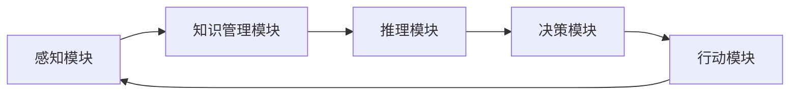

# 开发具有创造性问题解决能力的AI Agent

> 关键词：AI Agent、创造性问题解决、算法原理、数学模型、项目实战

> 摘要：本文聚焦于开发具有创造性问题解决能力的AI Agent。首先介绍了相关背景，包括目的、预期读者、文档结构和术语表。接着阐述了核心概念与联系，给出了原理和架构的文本示意图及Mermaid流程图。详细讲解了核心算法原理和具体操作步骤，并结合Python源代码进行说明。深入探讨了数学模型和公式，通过举例帮助理解。通过项目实战展示了代码的实际案例和详细解释。分析了实际应用场景，推荐了相关的工具和资源。最后总结了未来发展趋势与挑战，提供了常见问题解答和扩展阅读参考资料，旨在为开发者提供全面且深入的指导，助力开发出具备创造性问题解决能力的AI Agent。

## 1. 背景介绍 
### 1.1 目的和范围
在当今科技飞速发展的时代，传统的AI系统在处理一些复杂、需要创新思维的问题时显得力不从心。开发具有创造性问题解决能力的AI Agent的目的在于让AI能够像人类一样，以新颖、独特的方式应对各种未知的问题。本文章的范围涵盖了从理论概念到实际开发的整个过程，包括核心概念的解释、算法原理的分析、数学模型的构建、项目实战的指导以及应用场景的探讨等。

### 1.2 预期读者
本文预期读者主要包括对人工智能领域有一定了解的开发者、研究人员，以及对创造性问题解决和AI Agent开发感兴趣的技术爱好者。无论是想要深入学习AI技术的初学者，还是希望在该领域取得突破的专业人士，都能从本文中获得有价值的信息。

### 1.3 文档结构概述
本文首先会对相关的核心概念进行介绍，让读者了解具有创造性问题解决能力的AI Agent是什么，以及其背后的原理和架构。接着详细讲解核心算法原理和具体操作步骤，通过Python代码进行示例。然后引入数学模型和公式，帮助读者从理论层面理解AI Agent的工作机制。通过项目实战部分，展示如何将理论知识应用到实际开发中。之后分析该技术的实际应用场景，为读者提供更多的思路。还会推荐一些学习资源、开发工具和相关论文著作，方便读者进一步深入学习。最后总结未来发展趋势与挑战，解答常见问题，并提供扩展阅读和参考资料。

### 1.4 术语表
#### 1.4.1 核心术语定义
- **AI Agent**：人工智能代理，是一种能够感知环境、自主决策并采取行动以实现特定目标的软件实体。
- **创造性问题解决**：指以新颖、独特的方式找到解决问题的方法，突破传统思维的限制。
- **启发式搜索**：一种在搜索过程中利用启发信息来引导搜索方向，提高搜索效率的方法。

#### 1.4.2 相关概念解释
- **强化学习**：一种机器学习方法，通过智能体与环境进行交互，根据环境反馈的奖励信号来学习最优策略。
- **遗传算法**：模拟生物进化过程的优化算法，通过选择、交叉和变异等操作来不断进化种群，以找到最优解。

#### 1.4.3 缩略词列表
- **RL**：Reinforcement Learning（强化学习）
- **GA**：Genetic Algorithm（遗传算法）

## 2. 核心概念与联系 
### 核心概念原理
具有创造性问题解决能力的AI Agent的核心在于能够突破传统的问题解决模式，以创新的方式应对各种问题。其原理基于多个方面的技术融合，包括机器学习、自然语言处理、知识表示与推理等。

机器学习为AI Agent提供了学习能力，使其能够从大量的数据中学习到问题的模式和规律。例如，通过监督学习，AI Agent可以学习到已知问题的解决方案；通过强化学习，AI Agent可以在与环境的交互中不断优化自己的行为策略。

自然语言处理技术让AI Agent能够理解和生成人类语言，这对于与人类进行交互和获取信息至关重要。例如，在问答系统中，AI Agent需要理解用户的问题，并以自然语言的形式给出答案。

知识表示与推理技术则为AI Agent提供了知识管理和逻辑推理的能力。AI Agent可以将所学的知识以一定的形式表示出来，并根据这些知识进行推理，从而得出新的结论。

### 架构的文本示意图
具有创造性问题解决能力的AI Agent的架构可以分为以下几个主要部分：

1. **感知模块**：负责从环境中获取信息，例如通过传感器收集数据，或者从文本、图像等数据中提取特征。
2. **知识管理模块**：存储和管理AI Agent所学的知识，包括事实性知识、规则性知识等。
3. **推理模块**：根据感知模块获取的信息和知识管理模块中的知识进行推理，得出问题的解决方案。
4. **决策模块**：在多个可能的解决方案中选择最优的方案。
5. **行动模块**：根据决策模块的结果采取相应的行动，与环境进行交互。

### Mermaid流程图


## 3. 核心算法原理 & 具体操作步骤 
### 核心算法原理
#### 强化学习算法
强化学习是一种通过智能体与环境进行交互来学习最优策略的算法。在强化学习中，智能体在每个时间步根据当前的状态选择一个动作，环境会根据智能体的动作给出一个奖励信号和下一个状态。智能体的目标是最大化长期累积奖励。

常见的强化学习算法包括Q学习（Q-Learning）和深度Q网络（Deep Q-Network，DQN）。以Q学习为例，其核心思想是通过一个Q表来记录每个状态-动作对的价值。Q表中的每个元素$Q(s,a)$表示在状态$s$下采取动作$a$的价值。智能体在每个时间步根据Q表选择价值最大的动作，然后根据环境反馈的奖励更新Q表。

#### 遗传算法
遗传算法是一种模拟生物进化过程的优化算法。其基本思想是通过选择、交叉和变异等操作来不断进化种群，以找到最优解。在遗传算法中，每个个体表示一个可能的解决方案，种群是一组个体的集合。通过计算每个个体的适应度值，选择适应度值高的个体进行交叉和变异操作，生成新的个体，不断迭代直到找到最优解。

### 具体操作步骤
#### 强化学习算法的操作步骤
1. 初始化Q表，将所有状态-动作对的价值初始化为0。
2. 选择一个初始状态$s$。
3. 在当前状态$s$下，根据Q表选择一个动作$a$。可以采用贪心策略，即选择价值最大的动作；也可以采用$\epsilon$-贪心策略，以一定的概率$\epsilon$随机选择一个动作，以增加探索性。
4. 执行动作$a$，环境反馈一个奖励$r$和下一个状态$s'$。
5. 根据Q学习的更新公式更新Q表：
   $$Q(s,a) = Q(s,a) + \alpha [r + \gamma \max_{a'} Q(s',a') - Q(s,a)]$$
   其中，$\alpha$是学习率，控制每次更新的步长；$\gamma$是折扣因子，用于权衡当前奖励和未来奖励的重要性。
6. 将状态$s$更新为$s'$，重复步骤3-5，直到达到终止条件。

#### 遗传算法的操作步骤
1. 初始化种群，随机生成一组个体。
2. 计算每个个体的适应度值。
3. 根据适应度值选择一部分个体作为父代。
4. 对父代个体进行交叉操作，生成子代个体。
5. 对子代个体进行变异操作，引入新的基因。
6. 将父代和子代个体合并，形成新的种群。
7. 重复步骤2-6，直到达到终止条件，例如达到最大迭代次数或找到满足要求的解。

### Python源代码实现
#### 强化学习（Q学习）示例代码
```python
import numpy as np

# 定义环境
states = 5
actions = 2
Q = np.zeros((states, actions))

# 超参数
alpha = 0.1
gamma = 0.9
epsilon = 0.1
episodes = 100

# 环境反馈函数
def get_reward(state, action):
    # 简单示例，根据状态和动作返回奖励
    if state == 2 and action == 1:
        return 1
    return 0

# Q学习算法
for episode in range(episodes):
    state = 0
    done = False
    while not done:
        if np.random.uniform(0, 1) < epsilon:
            action = np.random.choice(actions)
        else:
            action = np.argmax(Q[state, :])
        
        reward = get_reward(state, action)
        next_state = (state + 1) % states
        
        Q[state, action] = Q[state, action] + alpha * (reward + gamma * np.max(Q[next_state, :]) - Q[state, action])
        
        state = next_state
        
        if state == 4:
            done = True

print("Final Q table:")
print(Q)
```

#### 遗传算法示例代码
```python
import numpy as np

# 定义问题
def fitness_function(x):
    return -np.sum((x - 1) ** 2)

# 遗传算法参数
population_size = 20
chromosome_length = 5
generations = 50
mutation_rate = 0.01

# 初始化种群
population = np.random.randint(0, 2, (population_size, chromosome_length))

# 遗传算法主循环
for generation in range(generations):
    # 计算适应度值
    fitness_values = np.array([fitness_function(individual) for individual in population])
    
    # 选择操作
    total_fitness = np.sum(fitness_values)
    selection_probabilities = fitness_values / total_fitness
    selected_indices = np.random.choice(population_size, population_size, p=selection_probabilities)
    selected_population = population[selected_indices]
    
    # 交叉操作
    new_population = []
    for i in range(0, population_size, 2):
        parent1 = selected_population[i]
        parent2 = selected_population[i + 1]
        crossover_point = np.random.randint(1, chromosome_length)
        child1 = np.concatenate((parent1[:crossover_point], parent2[crossover_point:]))
        child2 = np.concatenate((parent2[:crossover_point], parent1[crossover_point:]))
        new_population.extend([child1, child2])
    
    new_population = np.array(new_population)
    
    # 变异操作
    for i in range(population_size):
        for j in range(chromosome_length):
            if np.random.uniform(0, 1) < mutation_rate:
                new_population[i, j] = 1 - new_population[i, j]
    
    population = new_population

# 找到最优解
best_index = np.argmax([fitness_function(individual) for individual in population])
best_solution = population[best_index]
print("Best solution:", best_solution)
print("Best fitness:", fitness_function(best_solution))
```

## 4. 数学模型和公式 & 详细讲解 & 举例说明 
### 强化学习的数学模型和公式
#### 马尔可夫决策过程（MDP）
强化学习的基础数学模型是马尔可夫决策过程（Markov Decision Process，MDP）。MDP可以用一个五元组$(S, A, P, R, \gamma)$来表示，其中：
- $S$是状态空间，表示智能体可能处于的所有状态的集合。
- $A$是动作空间，表示智能体可以采取的所有动作的集合。
- $P$是状态转移概率函数，$P(s'|s,a)$表示在状态$s$下采取动作$a$后转移到状态$s'$的概率。
- $R$是奖励函数，$R(s,a)$表示在状态$s$下采取动作$a$后获得的即时奖励。
- $\gamma$是折扣因子，用于权衡当前奖励和未来奖励的重要性，取值范围为$[0, 1]$。

#### 价值函数
在强化学习中，有两个重要的价值函数：状态价值函数$V(s)$和动作价值函数$Q(s,a)$。

状态价值函数$V(s)$表示从状态$s$开始，遵循某一策略$\pi$所能获得的长期累积奖励的期望值：
$$V^{\pi}(s) = \mathbb{E}_{\pi} \left[ \sum_{t=0}^{\infty} \gamma^t R_{t+1} \big| S_0 = s \right]$$

动作价值函数$Q(s,a)$表示在状态$s$下采取动作$a$，然后遵循某一策略$\pi$所能获得的长期累积奖励的期望值：
$$Q^{\pi}(s,a) = \mathbb{E}_{\pi} \left[ \sum_{t=0}^{\infty} \gamma^t R_{t+1} \big| S_0 = s, A_0 = a \right]$$

#### Q学习更新公式
Q学习的更新公式为：
$$Q(s,a) = Q(s,a) + \alpha [r + \gamma \max_{a'} Q(s',a') - Q(s,a)]$$
其中，$\alpha$是学习率，控制每次更新的步长；$r$是即时奖励；$\gamma$是折扣因子；$s'$是下一个状态。

### 举例说明
假设我们有一个简单的网格世界环境，智能体可以在网格中上下左右移动。每个网格表示一个状态，智能体的动作包括向上、向下、向左、向右。当智能体到达目标网格时，获得奖励1，否则获得奖励0。

我们可以使用Q学习算法来训练智能体找到到达目标网格的最优路径。初始化Q表，然后让智能体在环境中不断探索和学习。每次智能体采取一个动作，根据环境反馈的奖励更新Q表。经过多次迭代，Q表会逐渐收敛到最优值，智能体也能找到最优路径。

### 遗传算法的数学模型和公式
#### 适应度函数
遗传算法中的适应度函数用于评估每个个体的优劣程度。适应度函数的设计需要根据具体的问题来确定，其目标是将问题的解映射到一个数值上，数值越大表示解越优。

例如，对于一个函数优化问题，我们可以将函数值作为适应度值。假设我们要最大化函数$f(x) = - \sum_{i=1}^{n} (x_i - 1)^2$，则适应度函数可以定义为：
$$fitness(x) = - \sum_{i=1}^{n} (x_i - 1)^2$$

#### 选择操作
选择操作是根据个体的适应度值来选择父代个体。常见的选择方法是轮盘赌选择法，其选择概率计算公式为：
$$p_i = \frac{fitness(i)}{\sum_{j=1}^{N} fitness(j)}$$
其中，$p_i$是个体$i$被选择的概率，$N$是种群大小。

#### 交叉操作
交叉操作是将父代个体的基因进行交换，生成子代个体。常见的交叉方法是单点交叉，即在染色体上随机选择一个交叉点，将父代个体的基因在交叉点处进行交换。

#### 变异操作
变异操作是对个体的基因进行随机改变，引入新的基因。变异概率通常设置为一个较小的值，例如0.01。变异操作的公式可以表示为：
$$x_{ij}' = \begin{cases}
1 - x_{ij}, & \text{if } \text{random}(0, 1) < p_m \\
x_{ij}, & \text{otherwise}
\end{cases}$$
其中，$x_{ij}$是个体$i$的第$j$个基因，$p_m$是变异概率。

### 举例说明
假设我们要使用遗传算法来求解函数$f(x) = - \sum_{i=1}^{5} (x_i - 1)^2$的最大值。我们可以将每个个体表示为一个长度为5的二进制字符串，每个二进制位表示一个基因。初始化种群，然后计算每个个体的适应度值。根据适应度值选择父代个体，进行交叉和变异操作，生成新的种群。经过多次迭代，种群会逐渐进化，最终找到最优解。

## 5. 项目实战：代码实际案例和详细解释说明 
### 5.1  开发环境搭建
#### 安装Python
首先需要安装Python，建议安装Python 3.7及以上版本。可以从Python官方网站（https://www.python.org/downloads/）下载安装包，按照安装向导进行安装。

#### 安装必要的库
在开发具有创造性问题解决能力的AI Agent时，需要安装一些必要的库，例如NumPy、Matplotlib等。可以使用pip命令进行安装：
```sh
pip install numpy matplotlib
```

### 5.2  源代码详细实现和代码解读
#### 项目需求
我们要开发一个简单的AI Agent，用于解决迷宫问题。迷宫是一个二维网格，AI Agent需要从起点找到终点的路径。

#### 代码实现
```python
import numpy as np
import matplotlib.pyplot as plt

# 定义迷宫
maze = np.array([
    [0, 1, 0, 0, 0],
    [0, 1, 0, 1, 0],
    [0, 0, 0, 0, 0],
    [0, 1, 1, 1, 0],
    [0, 0, 0, 1, 0]
])

start = (0, 0)
end = (4, 4)

# 定义动作
actions = [(0, 1), (0, -1), (1, 0), (-1, 0)]  # 右，左，下，上

# 初始化Q表
Q = np.zeros((maze.shape[0], maze.shape[1], len(actions)))

# 超参数
alpha = 0.1
gamma = 0.9
epsilon = 0.1
episodes = 1000

# 训练AI Agent
for episode in range(episodes):
    state = start
    done = False
    while not done:
        if np.random.uniform(0, 1) < epsilon:
            action_index = np.random.choice(len(actions))
        else:
            action_index = np.argmax(Q[state[0], state[1], :])
        
        action = actions[action_index]
        next_state = (state[0] + action[0], state[1] + action[1])
        
        # 检查是否越界或碰到墙壁
        if next_state[0] < 0 or next_state[0] >= maze.shape[0] or next_state[1] < 0 or next_state[1] >= maze.shape[1] or maze[next_state[0], next_state[1]] == 1:
            next_state = state
            reward = -1
        elif next_state == end:
            reward = 100
            done = True
        else:
            reward = -0.1
        
        Q[state[0], state[1], action_index] = Q[state[0], state[1], action_index] + alpha * (reward + gamma * np.max(Q[next_state[0], next_state[1], :]) - Q[state[0], state[1], action_index])
        
        state = next_state

# 测试AI Agent
state = start
path = [state]
done = False
while not done:
    action_index = np.argmax(Q[state[0], state[1], :])
    action = actions[action_index]
    next_state = (state[0] + action[0], state[1] + action[1])
    
    if next_state[0] < 0 or next_state[0] >= maze.shape[0] or next_state[1] < 0 or next_state[1] >= maze.shape[1] or maze[next_state[0], next_state[1]] == 1:
        next_state = state
    elif next_state == end:
        path.append(next_state)
        done = True
    else:
        path.append(next_state)
    
    state = next_state

# 可视化结果
plt.imshow(maze, cmap='gray')
path_x = [p[1] for p in path]
path_y = [p[0] for p in path]
plt.plot(path_x, path_y, 'r-')
plt.show()
```

#### 代码解读
1. **迷宫定义**：使用二维数组`maze`表示迷宫，其中0表示通路，1表示墙壁。
2. **动作定义**：定义了四个动作，分别是向右、向左、向下、向上。
3. **Q表初始化**：初始化一个三维数组`Q`，用于存储每个状态-动作对的价值。
4. **训练过程**：使用Q学习算法进行训练，智能体在迷宫中不断探索和学习，根据环境反馈的奖励更新Q表。
5. **测试过程**：训练完成后，使用训练好的Q表让智能体从起点找到终点的路径。
6. **可视化结果**：使用Matplotlib库将迷宫和智能体的路径可视化。

### 5.3  代码解读与分析
#### 优点
- **简单易懂**：代码结构清晰，使用Q学习算法实现了一个简单的AI Agent，易于理解和学习。
- **可扩展性**：可以通过修改迷宫的定义和动作的数量，扩展到更复杂的问题。

#### 缺点
- **效率问题**：在处理大规模迷宫时，Q学习算法的效率可能会较低，因为需要存储和更新大量的Q值。
- **缺乏创造性**：Q学习算法是一种基于经验的学习方法，可能无法产生具有创造性的解决方案。

## 6. 实际应用场景 
### 游戏开发
在游戏开发中，具有创造性问题解决能力的AI Agent可以作为游戏中的智能对手，提高游戏的趣味性和挑战性。例如，在策略游戏中，AI Agent可以根据玩家的策略和游戏局势，制定出新颖的战术；在角色扮演游戏中，AI Agent可以作为NPC，与玩家进行自然的交互，提供多样化的任务和剧情。

### 智能客服
智能客服系统可以使用AI Agent来解决用户的问题。具有创造性问题解决能力的AI Agent可以更好地理解用户的意图，提供更加个性化、创新的解决方案。例如，当用户提出一个复杂的问题时，AI Agent可以通过推理和联想，给出多种可能的解决方案，并根据用户的反馈进行调整。

### 医疗诊断
在医疗诊断领域，AI Agent可以辅助医生进行疾病诊断。通过学习大量的医学知识和病例数据，AI Agent可以对患者的症状进行分析和推理，提出可能的诊断结果和治疗建议。具有创造性问题解决能力的AI Agent可以在面对罕见病或复杂病症时，提出新颖的诊断思路和治疗方案。

### 工业自动化
在工业自动化中，AI Agent可以用于优化生产流程、提高生产效率。例如，AI Agent可以根据生产线上的实时数据，动态调整生产参数，解决生产过程中出现的问题。具有创造性问题解决能力的AI Agent可以在遇到突发情况时，提出创新性的解决方案，减少生产损失。

## 7. 工具和资源推荐
### 7.1 学习资源推荐
#### 7.1.1 书籍推荐
- 《人工智能：一种现代的方法》（Artificial Intelligence: A Modern Approach）：这是一本经典的人工智能教材，涵盖了人工智能的各个方面，包括搜索算法、机器学习、自然语言处理等。
- 《强化学习：原理与Python实现》（Reinforcement Learning: An Introduction）：由强化学习领域的两位先驱Richard S. Sutton和Andrew G. Barto所著，是强化学习领域的权威书籍。

#### 7.1.2 在线课程
- Coursera上的“人工智能基础”（Fundamentals of Artificial Intelligence）课程：由哥伦比亚大学的教授授课，系统地介绍了人工智能的基本概念和算法。
- edX上的“强化学习”（Reinforcement Learning）课程：由加州大学伯克利分校的教授授课，深入讲解了强化学习的理论和实践。

#### 7.1.3 技术博客和网站
- Medium上的AI相关博客：有很多人工智能领域的专家和开发者在Medium上分享他们的经验和见解。
- arXiv.org：一个预印本平台，提供了大量的人工智能领域的最新研究论文。

### 7.2 开发工具框架推荐
#### 7.2.1 IDE和编辑器
- PyCharm：一款专业的Python集成开发环境，提供了丰富的代码编辑、调试和测试功能。
- Jupyter Notebook：一个交互式的开发环境，适合进行数据探索和模型实验。

#### 7.2.2 调试和性能分析工具
- TensorBoard：一个用于可视化深度学习模型训练过程的工具，可以帮助开发者监控模型的性能和参数变化。
- cProfile：Python自带的性能分析工具，可以分析代码的运行时间和函数调用情况。

#### 7.2.3 相关框架和库
- TensorFlow：一个开源的深度学习框架，提供了丰富的深度学习模型和工具，支持分布式训练和部署。
- PyTorch：另一个流行的深度学习框架，具有动态图的优势，易于使用和调试。

### 7.3 相关论文著作推荐
#### 7.3.1 经典论文
- “Q-Learning”：由Chris Watkins和Peter Dayan发表的经典论文，首次提出了Q学习算法。
- “Playing Atari with Deep Reinforcement Learning”：由DeepMind团队发表的论文，介绍了使用深度Q网络（DQN）玩Atari游戏的方法。

#### 7.3.2 最新研究成果
- 关注NeurIPS、ICML、CVPR等顶级人工智能会议的最新论文，了解该领域的最新研究动态。

#### 7.3.3 应用案例分析
- 一些知名公司和研究机构会发布他们在人工智能领域的应用案例，例如Google、Microsoft、OpenAI等，可以从中学习到实际应用中的经验和技巧。

## 8. 总结：未来发展趋势与挑战
### 未来发展趋势
#### 多模态融合
未来的AI Agent将不仅仅依赖于单一的数据源，而是会融合多种模态的数据，如文本、图像、语音等。通过多模态融合，AI Agent可以获得更全面、准确的信息，从而提高创造性问题解决的能力。

#### 跨领域学习
AI Agent将具备跨领域学习的能力，能够从不同领域的知识中获取灵感，解决复杂的跨领域问题。例如，将医学知识和工程技术相结合，开发出更先进的医疗设备。

#### 与人类协作
AI Agent将与人类更加紧密地协作，形成人机协作的模式。人类可以提供创造性的思维和领域知识，AI Agent可以提供快速的计算和数据处理能力，共同解决各种问题。

### 挑战
#### 数据隐私和安全
随着AI Agent的广泛应用，数据隐私和安全问题变得越来越重要。AI Agent需要处理大量的敏感数据，如个人信息、医疗记录等，如何保护这些数据的隐私和安全是一个巨大的挑战。

#### 可解释性和透明度
目前的AI Agent大多是基于深度学习等黑盒模型，其决策过程难以解释和理解。在一些关键领域，如医疗诊断、金融风险评估等，需要AI Agent具有可解释性和透明度，以便人类能够信任和接受其决策结果。

#### 创造性评估
如何评估AI Agent的创造性是一个难题。目前还没有一个统一的标准和方法来衡量AI Agent的创造性，需要进一步研究和探索。

## 9. 附录：常见问题与解答
### 问题1：如何提高AI Agent的创造性问题解决能力？
答：可以从以下几个方面提高AI Agent的创造性问题解决能力：
- 丰富训练数据：使用多样化的训练数据，让AI Agent学习到更多的知识和模式。
- 采用多种算法融合：结合强化学习、遗传算法、深度学习等多种算法，发挥各自的优势。
- 引入知识图谱：将领域知识以知识图谱的形式表示，让AI Agent能够进行推理和联想。

### 问题2：AI Agent在实际应用中会遇到哪些困难？
答：AI Agent在实际应用中可能会遇到以下困难：
- 数据质量问题：实际应用中的数据可能存在噪声、缺失值等问题，影响AI Agent的学习和决策。
- 环境变化：实际环境是动态变化的，AI Agent需要具备适应环境变化的能力。
- 计算资源限制：一些复杂的AI算法需要大量的计算资源，在实际应用中可能会受到硬件条件的限制。

### 问题3：如何选择适合的算法来开发AI Agent？
答：选择适合的算法需要考虑以下几个因素：
- 问题类型：不同的问题类型适合不同的算法，例如，优化问题可以选择遗传算法，序列决策问题可以选择强化学习算法。
- 数据特点：如果数据量较大，可以选择深度学习算法；如果数据量较小，可以选择传统的机器学习算法。
- 计算资源：一些复杂的算法需要大量的计算资源，如果计算资源有限，需要选择相对简单的算法。

## 10. 扩展阅读 & 参考资料
### 扩展阅读
- 《思考，快与慢》（Thinking, Fast and Slow）：这本书介绍了人类的思维模式和决策过程，对于理解创造性问题解决的本质有很大的帮助。
- 《创新算法：TRIZ、系统创新和技术创造力》（The Innovation Algorithm: TRIZ, Systematic Innovation and Technical Creativity）：介绍了TRIZ理论，一种用于解决创造性问题的方法。

### 参考资料
- Sutton, R. S., & Barto, A. G. (2018). Reinforcement learning: An introduction. MIT press.
- Russell, S. J., & Norvig, P. (2016). Artificial intelligence: A modern approach. Pearson.

作者：AI天才研究院/AI Genius Institute & 禅与计算机程序设计艺术 /Zen And The Art of Computer Programming