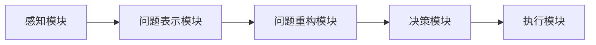

# 开发具有创造性问题重构能力的AI Agent

> 关键词：AI Agent、创造性问题重构、问题解决、机器学习、自然语言处理

> 摘要：本文围绕开发具有创造性问题重构能力的AI Agent展开。首先介绍了开发此类AI Agent的背景，包括目的、预期读者、文档结构和相关术语。接着阐述了核心概念与联系，给出了原理和架构的示意图与流程图。详细讲解了核心算法原理及具体操作步骤，并结合Python代码进行说明。通过数学模型和公式进一步深入剖析，辅以实际例子帮助理解。在项目实战部分，从开发环境搭建、源代码实现与解读等方面进行了详细阐述。探讨了其实际应用场景，推荐了学习资源、开发工具框架以及相关论文著作。最后总结了未来发展趋势与挑战，还提供了常见问题解答和扩展阅读参考资料，旨在为开发者提供全面的指导。

## 1. 背景介绍 
### 1.1 目的和范围
开发具有创造性问题重构能力的AI Agent的主要目的是让AI能够突破传统的问题解决模式，以创新的视角对问题进行重新定义和分析，从而更高效、更优质地解决复杂问题。在当今的科技发展中，许多实际问题并非以清晰、标准的形式呈现，而是具有模糊性、开放性和动态性。传统的AI系统在处理这类问题时往往力不从心，而具有创造性问题重构能力的AI Agent可以通过对问题进行重新组织和解读，挖掘出问题的潜在本质和多种解决方案。

本文章的范围涵盖了从AI Agent创造性问题重构能力的基本概念、算法原理、数学模型到实际开发和应用的全过程。不仅会介绍相关的理论知识，还会通过具体的代码示例和项目实战，帮助读者深入理解和掌握开发此类AI Agent的方法和技巧。

### 1.2 预期读者
本文预期读者包括AI领域的研究人员、开发者、软件工程师、数据科学家等专业人士。对于对人工智能技术感兴趣，希望深入了解如何开发具有创新性问题解决能力的AI系统的爱好者也具有一定的参考价值。同时，对于从事复杂问题解决、决策支持等领域的专业人员，了解此类AI Agent的开发和应用可以为他们的工作提供新的思路和方法。

### 1.3 文档结构概述
本文将按照以下结构进行组织：首先介绍背景知识，包括目的、预期读者和文档结构等内容；接着阐述核心概念与联系，包括创造性问题重构的原理和AI Agent的架构；然后详细讲解核心算法原理及具体操作步骤，并结合Python代码进行说明；通过数学模型和公式进一步深入分析问题重构的过程；在项目实战部分，从开发环境搭建到源代码实现与解读，全面展示如何开发具有创造性问题重构能力的AI Agent；探讨其实际应用场景；推荐相关的学习资源、开发工具框架和论文著作；最后总结未来发展趋势与挑战，提供常见问题解答和扩展阅读参考资料。

### 1.4 术语表
#### 1.4.1 核心术语定义
- **AI Agent**：是一种能够感知环境、做出决策并采取行动以实现特定目标的智能实体。它可以是软件程序、机器人等形式。
- **创造性问题重构**：指的是对给定的问题进行重新审视和组织，打破原有的思维定式，从不同的角度发现问题的本质和潜在的解决方案。
- **问题空间**：表示问题的所有可能状态和转换规则的集合。在问题解决过程中，AI Agent需要在这个空间中搜索解决方案。

#### 1.4.2 相关概念解释
- **机器学习**：是一门多领域交叉学科，涉及概率论、统计学、逼近论、凸分析、算法复杂度理论等多门学科。它专门研究计算机怎样模拟或实现人类的学习行为，以获取新的知识或技能，重新组织已有的知识结构使之不断改善自身的性能。在开发具有创造性问题重构能力的AI Agent中，机器学习算法可以用于从大量的数据中学习问题的特征和模式，为问题重构提供依据。
- **自然语言处理**：是计算机科学领域与人工智能领域中的一个重要方向。它研究能实现人与计算机之间用自然语言进行有效通信的各种理论和方法。在AI Agent的开发中，自然语言处理技术可以用于处理用户输入的自然语言问题，将其转化为计算机能够理解和处理的形式。

#### 1.4.3 缩略词列表
- **ML**：Machine Learning，机器学习
- **NLP**：Natural Language Processing，自然语言处理
- **RL**：Reinforcement Learning，强化学习

## 2. 核心概念与联系 

### 创造性问题重构原理
创造性问题重构的核心思想是打破传统的问题解决模式，从不同的视角对问题进行重新定义和分析。传统的问题解决方法往往基于已有的知识和经验，按照固定的模式进行推理和求解。而创造性问题重构则鼓励AI Agent跳出这种思维定式，通过对问题的要素进行重新组合、对问题的边界进行拓展或收缩等方式，发现问题的新的表达方式和解决方案。

例如，对于一个优化生产流程以提高效率的问题，传统的方法可能是分析现有的生产环节，寻找可以改进的地方。而创造性问题重构可能会从产品的设计、原材料的选择等方面入手，重新定义问题，如“如何通过改变产品设计来简化生产流程并提高效率”。

### AI Agent架构
一个具有创造性问题重构能力的AI Agent通常包括以下几个主要部分：

#### 感知模块
感知模块负责收集环境中的信息，包括用户输入的问题、相关的数据等。它可以通过各种传感器（如摄像头、麦克风等）或接口（如文本输入框）获取信息，并将其转化为AI Agent能够处理的格式。

#### 问题表示模块
问题表示模块将感知模块获取的信息进行处理和转换，将问题表示为一种适合AI Agent进行分析和推理的形式。这可能涉及到自然语言处理技术，如分词、词性标注、句法分析等，以理解问题的语义和结构。

#### 问题重构模块
问题重构模块是AI Agent的核心部分，它负责对问题进行创造性的重新定义和组织。该模块可以使用多种技术，如机器学习、启发式算法等，来生成不同的问题表示形式，并评估这些表示形式的优劣。

#### 决策模块
决策模块根据问题重构模块生成的不同问题表示形式，选择最合适的一种或几种进行求解。它可以使用搜索算法、优化算法等技术来寻找问题的解决方案。

#### 执行模块
执行模块将决策模块得到的解决方案转化为具体的行动，并在环境中执行。它可以与外部系统进行交互，如控制机器人的运动、发送指令到生产设备等。

### 文本示意图
```plaintext
           +----------------+
           |    感知模块    |
           +----------------+
                  |
                  v
           +----------------+
           |  问题表示模块  |
           +----------------+
                  |
                  v
           +----------------+
           |  问题重构模块  |
           +----------------+
                  |
                  v
           +----------------+
           |   决策模块     |
           +----------------+
                  |
                  v
           +----------------+
           |   执行模块     |
           +----------------+
```

### Mermaid流程图


## 3. 核心算法原理 & 具体操作步骤 

### 核心算法原理
在开发具有创造性问题重构能力的AI Agent中，常用的算法包括机器学习算法和启发式算法。以下以强化学习算法为例，介绍其核心原理。

强化学习是一种通过智能体与环境进行交互，根据环境反馈的奖励信号来学习最优行为策略的机器学习方法。在问题重构的场景中，AI Agent可以将不同的问题表示形式看作是不同的状态，将采取的重构操作看作是动作，环境反馈的奖励表示该问题表示形式对于解决问题的优劣程度。

AI Agent的目标是通过不断地与环境交互，学习到一个最优的策略，即在每个状态下选择能够获得最大累积奖励的动作。常用的强化学习算法有Q - learning、Deep Q - Network（DQN）等。

### 具体操作步骤
#### 步骤1：问题表示
将用户输入的问题进行处理，将其表示为一个状态向量。例如，如果问题是关于文本处理的，可以将文本进行分词、词嵌入等操作，得到一个向量表示。

```python
import numpy as np
import gensim.downloader as api

# 加载预训练的词向量模型
word_vectors = api.load('glove-wiki-gigaword-100')

def problem_representation(problem_text):
    words = problem_text.split()
    vectors = []
    for word in words:
        if word in word_vectors:
            vectors.append(word_vectors[word])
    if not vectors:
        return np.zeros(100)
    return np.mean(vectors, axis=0)

# 示例问题
problem = "如何提高产品的销量"
problem_vector = problem_representation(problem)
print(problem_vector)
```

#### 步骤2：问题重构动作定义
定义一系列的问题重构动作，例如改变问题的关键词、调整问题的语序等。每个动作可以用一个函数来表示。

```python
import random

def change_keyword(problem_text):
    words = problem_text.split()
    keyword_index = random.randint(0, len(words) - 1)
    new_word = random.choice(list(word_vectors.vocab.keys()))
    words[keyword_index] = new_word
    return " ".join(words)

# 示例
new_problem = change_keyword(problem)
print(new_problem)
```

#### 步骤3：环境反馈（奖励计算）
根据问题重构后的效果，计算相应的奖励。例如，可以使用一个简单的评估函数，根据问题重构后与已知成功案例的相似度来计算奖励。

```python
def reward_function(original_problem, new_problem):
    original_vector = problem_representation(original_problem)
    new_vector = problem_representation(new_problem)
    similarity = np.dot(original_vector, new_vector) / (np.linalg.norm(original_vector) * np.linalg.norm(new_vector))
    return similarity

# 示例
reward = reward_function(problem, new_problem)
print(reward)
```

#### 步骤4：强化学习训练
使用强化学习算法（如Q - learning）进行训练，让AI Agent学习到最优的问题重构策略。

```python
import random

# 初始化Q表
Q = {}

# 超参数
alpha = 0.1
gamma = 0.9
epsilon = 0.1
num_episodes = 100

for episode in range(num_episodes):
    current_problem = problem
    current_state = problem_representation(current_problem)
    if tuple(current_state) not in Q:
        Q[tuple(current_state)] = {}
    done = False
    while not done:
        if random.uniform(0, 1) < epsilon:
            action = change_keyword
        else:
            actions = [change_keyword]
            q_values = []
            for act in actions:
                new_problem = act(current_problem)
                new_state = problem_representation(new_problem)
                if tuple(new_state) not in Q:
                    Q[tuple(new_state)] = {}
                q_values.append(Q[tuple(current_state)].get(tuple(new_state), 0))
            best_action_index = np.argmax(q_values)
            action = actions[best_action_index]
        
        new_problem = action(current_problem)
        new_state = problem_representation(new_problem)
        reward = reward_function(current_problem, new_problem)
        
        if tuple(new_state) not in Q:
            Q[tuple(new_state)] = {}
        
        max_q_next = max(Q[tuple(new_state)].values(), default=0)
        Q[tuple(current_state)][tuple(new_state)] = (1 - alpha) * Q[tuple(current_state)].get(tuple(new_state), 0) + alpha * (reward + gamma * max_q_next)
        
        current_problem = new_problem
        current_state = new_state
        
        # 简单的终止条件
        if reward > 0.9:
            done = True


```

## 4. 数学模型和公式 & 详细讲解 & 举例说明 

### 强化学习的数学模型
强化学习可以用马尔可夫决策过程（Markov Decision Process，MDP）来建模。一个MDP可以用一个五元组 $(S, A, P, R, \gamma)$ 来表示，其中：

- $S$ 是状态空间，表示AI Agent可能处于的所有状态的集合。在问题重构的场景中，状态可以是问题的不同表示形式。
- $A$ 是动作空间，表示AI Agent可以采取的所有动作的集合。例如，改变关键词、调整语序等操作都可以看作是动作。
- $P(s'|s, a)$ 是状态转移概率，表示在状态 $s$ 下采取动作 $a$ 后转移到状态 $s'$ 的概率。在某些情况下，状态转移可能是确定性的，即 $P(s'|s, a) = 1$ 或 $0$。
- $R(s, a, s')$ 是奖励函数，表示在状态 $s$ 下采取动作 $a$ 转移到状态 $s'$ 时获得的奖励。奖励函数的设计对于AI Agent的学习效果至关重要，它应该能够反映问题重构的优劣程度。
- $\gamma \in [0, 1]$ 是折扣因子，用于权衡当前奖励和未来奖励的重要性。$\gamma$ 越接近1，表示AI Agent越看重未来的奖励。

### Q - learning算法公式
Q - learning是一种无模型的强化学习算法，它通过学习一个动作价值函数 $Q(s, a)$ 来找到最优策略。$Q(s, a)$ 表示在状态 $s$ 下采取动作 $a$ 后所能获得的最大累积折扣奖励。

Q - learning的更新公式为：

$$Q(s_t, a_t) \leftarrow (1 - \alpha)Q(s_t, a_t) + \alpha [R(s_t, a_t, s_{t+1}) + \gamma \max_{a} Q(s_{t+1}, a)]$$

其中：

- $s_t$ 是当前状态
- $a_t$ 是当前采取的动作
- $s_{t+1}$ 是下一个状态
- $R(s_t, a_t, s_{t+1})$ 是从状态 $s_t$ 采取动作 $a_t$ 转移到状态 $s_{t+1}$ 时获得的奖励
- $\alpha$ 是学习率，控制每次更新的步长
- $\gamma$ 是折扣因子

### 举例说明
假设AI Agent处于状态 $s_1$，采取动作 $a_1$ 后转移到状态 $s_2$，获得奖励 $R(s_1, a_1, s_2) = 5$。当前的 $Q(s_1, a_1) = 10$，$Q(s_2, a_2) = 8$，$Q(s_2, a_3) = 6$（$a_2$ 和 $a_3$ 是状态 $s_2$ 下的其他动作），学习率 $\alpha = 0.1$，折扣因子 $\gamma = 0.9$。

首先，计算 $\max_{a} Q(s_2, a)$，即 $s_2$ 状态下的最大Q值，这里 $\max_{a} Q(s_2, a) = 8$。

然后，根据Q - learning更新公式：

$$Q(s_1, a_1) \leftarrow (1 - 0.1) \times 10 + 0.1 \times (5 + 0.9 \times 8)$$

$$Q(s_1, a_1) \leftarrow 0.9 \times 10 + 0.1 \times (5 + 7.2)$$

$$Q(s_1, a_1) \leftarrow 9 + 0.1 \times 12.2$$

$$Q(s_1, a_1) \leftarrow 9 + 1.22 = 10.22$$

经过这次更新，$Q(s_1, a_1)$ 的值从10变为10.22。

## 5. 项目实战：代码实际案例和详细解释说明 

### 5.1  开发环境搭建
#### 安装Python
首先，确保你已经安装了Python 3.x版本。可以从Python官方网站（https://www.python.org/downloads/）下载并安装适合你操作系统的Python版本。

#### 安装必要的库
使用pip命令安装所需的库，包括`numpy`、`gensim`等。

```sh
pip install numpy gensim
```

### 5.2  源代码详细实现和代码解读
```python
import numpy as np
import gensim.downloader as api
import random

# 加载预训练的词向量模型
word_vectors = api.load('glove-wiki-gigaword-100')

def problem_representation(problem_text):
    """
    将问题文本转换为向量表示
    :param problem_text: 问题文本
    :return: 问题的向量表示
    """
    words = problem_text.split()
    vectors = []
    for word in words:
        if word in word_vectors:
            vectors.append(word_vectors[word])
    if not vectors:
        return np.zeros(100)
    return np.mean(vectors, axis=0)

def change_keyword(problem_text):
    """
    改变问题中的一个关键词
    :param problem_text: 问题文本
    :return: 重构后的问题文本
    """
    words = problem_text.split()
    keyword_index = random.randint(0, len(words) - 1)
    new_word = random.choice(list(word_vectors.vocab.keys()))
    words[keyword_index] = new_word
    return " ".join(words)

def reward_function(original_problem, new_problem):
    """
    计算问题重构后的奖励
    :param original_problem: 原始问题文本
    :param new_problem: 重构后的问题文本
    :return: 奖励值
    """
    original_vector = problem_representation(original_problem)
    new_vector = problem_representation(new_problem)
    similarity = np.dot(original_vector, new_vector) / (np.linalg.norm(original_vector) * np.linalg.norm(new_vector))
    return similarity

# 初始化Q表
Q = {}

# 超参数
alpha = 0.1
gamma = 0.9
epsilon = 0.1
num_episodes = 100

def q_learning(problem):
    """
    使用Q - learning算法进行问题重构训练
    :param problem: 原始问题文本
    """
    for episode in range(num_episodes):
        current_problem = problem
        current_state = problem_representation(current_problem)
        if tuple(current_state) not in Q:
            Q[tuple(current_state)] = {}
        done = False
        while not done:
            if random.uniform(0, 1) < epsilon:
                action = change_keyword
            else:
                actions = [change_keyword]
                q_values = []
                for act in actions:
                    new_problem = act(current_problem)
                    new_state = problem_representation(new_problem)
                    if tuple(new_state) not in Q:
                        Q[tuple(new_state)] = {}
                    q_values.append(Q[tuple(current_state)].get(tuple(new_state), 0))
                best_action_index = np.argmax(q_values)
                action = actions[best_action_index]
            
            new_problem = action(current_problem)
            new_state = problem_representation(new_problem)
            reward = reward_function(current_problem, new_problem)
            
            if tuple(new_state) not in Q:
                Q[tuple(new_state)] = {}
            
            max_q_next = max(Q[tuple(new_state)].values(), default=0)
            Q[tuple(current_state)][tuple(new_state)] = (1 - alpha) * Q[tuple(current_state)].get(tuple(new_state), 0) + alpha * (reward + gamma * max_q_next)
            
            current_problem = new_problem
            current_state = new_state
            
            # 简单的终止条件
            if reward > 0.9:
                done = True

# 示例问题
problem = "如何提高产品的销量"
q_learning(problem)
```

### 5.3  代码解读与分析
- **`problem_representation`函数**：该函数将问题文本转换为向量表示。首先将文本进行分词，然后将每个词转换为对应的词向量，最后取这些词向量的平均值作为问题的向量表示。
- **`change_keyword`函数**：该函数实现了一种简单的问题重构动作，即随机选择问题中的一个关键词，并用一个随机的词替换它。
- **`reward_function`函数**：该函数计算问题重构后的奖励。通过计算原始问题和重构后问题的向量表示之间的相似度来作为奖励值。
- **`q_learning`函数**：该函数实现了Q - learning算法的训练过程。在每个episode中，AI Agent根据当前状态选择动作，执行动作后得到新的状态和奖励，并更新Q表。当奖励值大于0.9时，认为达到了终止条件，结束当前episode。

## 6. 实际应用场景 
### 科研领域
在科研工作中，研究人员常常会遇到复杂的问题，需要从不同的角度进行思考和探索。具有创造性问题重构能力的AI Agent可以帮助研究人员对问题进行重新定义和分析，发现新的研究方向和解决方案。例如，在生物医学研究中，AI Agent可以对疾病的发病机制问题进行重构，提出新的假设和研究思路。

### 商业决策
在商业领域，企业面临着各种复杂的决策问题，如市场策略制定、产品研发等。AI Agent可以对这些问题进行创造性的重构，帮助企业发现潜在的市场机会和竞争优势。例如，通过对市场需求问题的重构，企业可以开发出更符合消费者需求的新产品。

### 工程设计
在工程设计中，如建筑设计、机械设计等，设计师需要不断地创新和优化设计方案。AI Agent可以对设计问题进行重新组织和分析，提供新的设计思路和解决方案。例如，在建筑设计中，AI Agent可以对建筑功能和空间布局问题进行重构，设计出更合理、更美观的建筑方案。

### 教育领域
在教育中，教师和学生也会遇到各种问题，如教学方法改进、学习困难解决等。AI Agent可以对这些问题进行创造性的重构，帮助教师设计更有效的教学方案，帮助学生找到更好的学习方法。例如，通过对学生学习兴趣问题的重构，教师可以采用更有趣的教学方式来提高学生的学习积极性。

## 7. 工具和资源推荐
### 7.1 学习资源推荐
#### 7.1.1 书籍推荐
- 《人工智能：一种现代的方法》：这是一本经典的人工智能教材，全面介绍了人工智能的各个领域，包括搜索算法、机器学习、自然语言处理等。对于理解AI Agent的基本原理和开发方法非常有帮助。
- 《强化学习：原理与Python实现》：详细介绍了强化学习的理论和算法，并通过Python代码进行了实现。对于学习如何使用强化学习算法开发具有创造性问题重构能力的AI Agent很有参考价值。
- 《自然语言处理入门》：适合初学者学习自然语言处理的基础知识和技术，包括分词、词性标注、句法分析等。在AI Agent的开发中，自然语言处理技术对于问题表示和理解非常重要。

#### 7.1.2 在线课程
- Coursera上的“人工智能基础”课程：由知名高校的教授授课，系统地介绍了人工智能的基本概念、算法和应用。
- edX上的“强化学习”课程：深入讲解了强化学习的理论和实践，包括马尔可夫决策过程、Q - learning、Deep Q - Network等内容。
- 吴恩达的“深度学习专项课程”：虽然主要侧重于深度学习，但其中的一些知识和技术对于开发AI Agent也有很大的帮助，如神经网络的训练和优化等。

#### 7.1.3 技术博客和网站
- Medium：上面有很多关于人工智能、机器学习的技术博客文章，涵盖了最新的研究成果和实践经验。
- Towards Data Science：专注于数据科学和人工智能领域，提供了丰富的技术文章和案例分析。
- AI社区：如AI研习社、机器之心等，聚集了大量的AI爱好者和专业人士，分享了很多有关AI Agent开发的经验和技巧。

### 7.2 开发工具框架推荐
#### 7.2.1 IDE和编辑器
- PyCharm：是一款专门为Python开发设计的集成开发环境，具有代码自动补全、调试、版本控制等功能，非常适合开发AI Agent。
- Jupyter Notebook：是一个交互式的开发环境，支持Python代码的编写、运行和可视化。对于快速验证算法和进行数据探索非常方便。
- Visual Studio Code：是一款轻量级的代码编辑器，支持多种编程语言和插件扩展。可以通过安装Python相关的插件来进行AI Agent的开发。

#### 7.2.2 调试和性能分析工具
- PDB：是Python自带的调试工具，可以帮助开发者定位代码中的错误和问题。
- cProfile：是Python的性能分析工具，可以分析代码的运行时间和函数调用情况，帮助开发者优化代码性能。
- TensorBoard：是TensorFlow的可视化工具，可以用于可视化训练过程中的各种指标，如损失函数、准确率等。

#### 7.2.3 相关框架和库
- TensorFlow：是一个开源的机器学习框架，提供了丰富的工具和接口，用于构建和训练深度学习模型。在开发具有创造性问题重构能力的AI Agent中，可以使用TensorFlow来实现强化学习算法和神经网络模型。
- PyTorch：是另一个流行的深度学习框架，具有动态图的优势，易于使用和调试。很多研究人员和开发者喜欢使用PyTorch来进行AI Agent的开发。
- Scikit - learn：是一个简单易用的机器学习库，提供了各种机器学习算法和工具，如分类、回归、聚类等。在AI Agent的开发中，可以使用Scikit - learn来进行数据预处理和特征提取。

### 7.3 相关论文著作推荐
#### 7.3.1 经典论文
- “Reinforcement Learning: An Introduction”：由Richard S. Sutton和Andrew G. Barto撰写，是强化学习领域的经典著作，系统地介绍了强化学习的理论和算法。
- “Playing Atari with Deep Reinforcement Learning”：提出了Deep Q - Network（DQN）算法，将深度学习和强化学习相结合，在Atari游戏中取得了很好的效果。
- “Attention Is All You Need”：提出了Transformer模型，在自然语言处理领域取得了巨大的成功，为AI Agent的自然语言处理能力提供了新的思路和方法。

#### 7.3.2 最新研究成果
- 可以关注顶级的AI学术会议，如NeurIPS（神经信息处理系统大会）、ICML（国际机器学习会议）、ACL（计算语言学协会年会）等，这些会议上会发布很多关于AI Agent和创造性问题解决的最新研究成果。
- 一些知名的学术期刊，如Journal of Artificial Intelligence Research（JAIR）、Artificial Intelligence等，也会发表高质量的相关研究论文。

#### 7.3.3 应用案例分析
- 可以在IEEE Xplore、ACM Digital Library等数据库中搜索关于AI Agent在不同领域应用的案例分析论文，了解实际应用中的问题和解决方案。

## 8. 总结：未来发展趋势与挑战
### 未来发展趋势
#### 与多学科融合
具有创造性问题重构能力的AI Agent将与更多的学科进行融合，如生物学、物理学、社会学等。通过借鉴其他学科的知识和方法，AI Agent可以更好地理解和解决复杂的跨学科问题。例如，在生物医学领域，结合生物学的知识，AI Agent可以对疾病的发病机制进行更深入的研究和分析。

#### 强化自主学习能力
未来的AI Agent将不断强化自主学习能力，能够在没有人类干预的情况下，自动从环境中获取信息，学习新的知识和技能，进行创造性的问题重构。例如，通过无监督学习和元学习技术，AI Agent可以自主发现问题的潜在模式和规律。

#### 实现人机协同
AI Agent将与人类实现更加紧密的协同合作。人类可以利用自己的领域知识和创造力为AI Agent提供指导和反馈，AI Agent则可以利用自己的计算能力和学习能力为人类提供更多的问题解决方案和决策支持。例如，在科研工作中，研究人员和AI Agent可以共同探索新的研究方向。

### 挑战
#### 创造性评估难题
如何准确地评估AI Agent的创造性问题重构能力是一个挑战。目前还没有一个统一的、有效的评估指标和方法。创造性是一个主观的概念，不同的人对创造性的理解和评价标准可能不同。因此，需要建立一套科学合理的评估体系，来衡量AI Agent的创造性表现。

#### 知识表示和推理的局限性
现有的知识表示和推理方法在处理复杂的、模糊的知识时存在一定的局限性。在创造性问题重构过程中，AI Agent需要对大量的知识进行理解、整合和推理。如何改进知识表示和推理方法，提高AI Agent的知识处理能力，是一个亟待解决的问题。

#### 伦理和法律问题
随着AI Agent的广泛应用，伦理和法律问题也日益凸显。例如，AI Agent的决策责任归属问题、数据隐私和安全问题等。需要建立相应的伦理准则和法律法规，来规范AI Agent的开发和使用。

## 9. 附录：常见问题与解答
### 问题1：开发具有创造性问题重构能力的AI Agent需要哪些基础知识？
解答：需要掌握人工智能、机器学习、自然语言处理等方面的基础知识。具体包括搜索算法、机器学习算法（如强化学习、深度学习）、自然语言处理技术（如分词、词性标注、句法分析）等。此外，还需要具备一定的数学基础，如线性代数、概率论、统计学等。

### 问题2：如何设计一个有效的奖励函数？
解答：设计有效的奖励函数需要考虑问题的具体目标和场景。奖励函数应该能够反映问题重构的优劣程度。例如，在问题重构的场景中，可以根据重构后的问题与已知成功案例的相似度、问题的创新性等因素来设计奖励函数。同时，奖励函数的设计应该避免过于复杂，以免影响AI Agent的学习效率。

### 问题3：Q - learning算法在实际应用中有哪些局限性？
解答：Q - learning算法在实际应用中存在一些局限性。例如，当状态空间和动作空间较大时，Q表的存储和更新会变得非常困难，导致算法的效率低下。此外，Q - learning算法对于连续状态和动作空间的处理能力有限，需要进行离散化处理。为了解决这些问题，可以使用深度强化学习算法，如Deep Q - Network（DQN）等。

### 问题4：如何提高AI Agent的创造性问题重构能力？
解答：可以从以下几个方面提高AI Agent的创造性问题重构能力：一是丰富AI Agent的知识储备，让它学习更多的领域知识和不同的问题解决方法；二是采用多样化的问题重构策略，如改变问题的视角、引入新的概念等；三是优化奖励函数，鼓励AI Agent进行更有创造性的问题重构；四是进行大量的训练和实践，让AI Agent在不断的尝试中提高自己的能力。

## 10. 扩展阅读 & 参考资料
- 《深度学习》（Ian Goodfellow、Yoshua Bengio和Aaron Courville著）
- “Mastering the Game of Go without Human Knowledge”（David Silver等人发表于Nature）
- 李开复的《AI·未来》
- 人工智能领域的开源项目，如OpenAI Gym等

作者：AI天才研究院/AI Genius Institute & 禅与计算机程序设计艺术 /Zen And The Art of Computer Programming