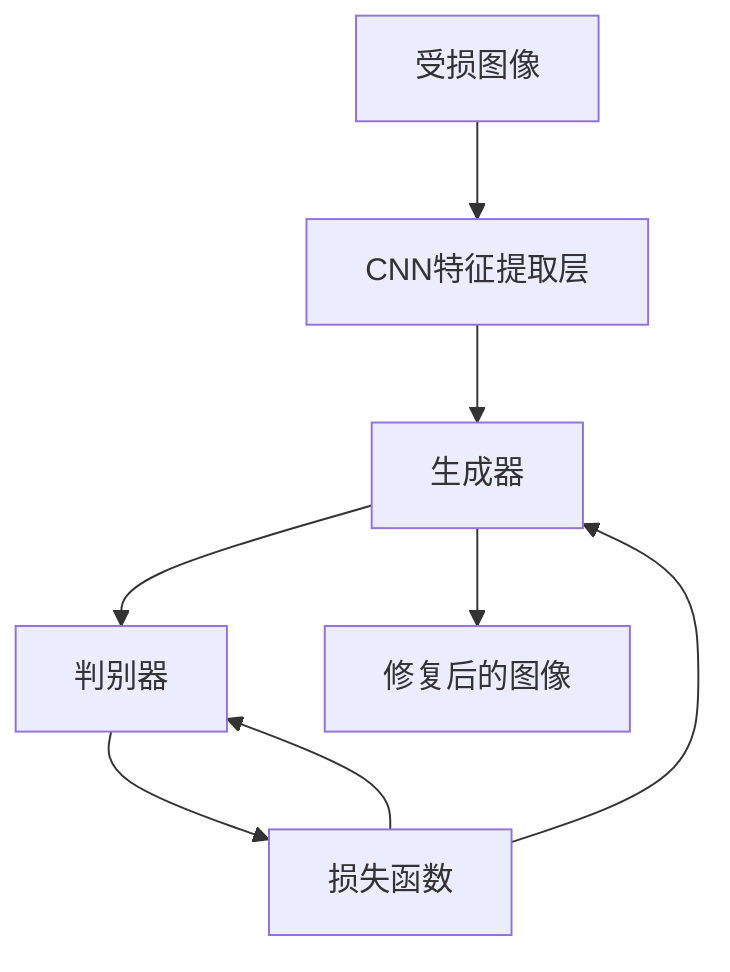

# 开发具有图像修复能力的AI Agent

> 关键词：AI Agent、图像修复、深度学习、卷积神经网络、生成对抗网络、计算机视觉、图像处理

> 摘要：本文围绕开发具有图像修复能力的AI Agent展开，全面深入地探讨了相关技术原理、算法实现、项目实战以及实际应用场景等内容。首先介绍了开发该AI Agent的背景信息，包括目的、预期读者等；接着阐述了核心概念与联系，构建了相应的原理和架构示意图；详细讲解了核心算法原理，并用Python代码进行了具体实现；给出了相关数学模型和公式，并举例说明；通过项目实战展示了代码的实际案例和详细解释；分析了实际应用场景；推荐了学习资源、开发工具框架以及相关论文著作；最后总结了未来发展趋势与挑战，还提供了常见问题与解答以及扩展阅读和参考资料，旨在为开发者提供全面且系统的技术指导。

## 1. 背景介绍 
### 1.1 目的和范围
图像修复是计算机视觉领域中的一个重要任务，它旨在恢复受损图像的原始内容。开发具有图像修复能力的AI Agent的目的在于实现自动化、高效且高质量的图像修复，减少人工修复的工作量和时间成本。其应用范围广泛，涵盖了文物保护、影视制作、数字图像编辑等多个领域。通过使用先进的深度学习技术，AI Agent能够学习图像的特征和结构，从而对各种类型的图像损伤进行智能修复。

### 1.2 预期读者
本文预期读者包括计算机科学、人工智能、计算机视觉等相关专业的学生和研究人员，对图像修复技术感兴趣的开发者，以及从事数字图像处理、影视制作、文物保护等行业的专业人士。这些读者具备一定的编程和机器学习基础，希望深入了解和掌握开发具有图像修复能力的AI Agent的技术和方法。

### 1.3 文档结构概述
本文首先介绍开发具有图像修复能力的AI Agent的背景信息，包括目的、预期读者等。接着阐述核心概念与联系，给出相关原理和架构示意图。然后详细讲解核心算法原理，并使用Python代码进行具体实现。之后介绍数学模型和公式，并举例说明。通过项目实战展示代码的实际案例和详细解释。分析实际应用场景，推荐学习资源、开发工具框架以及相关论文著作。最后总结未来发展趋势与挑战，提供常见问题与解答以及扩展阅读和参考资料。

### 1.4 术语表
#### 1.4.1 核心术语定义
- **AI Agent**：人工智能智能体，是一种能够感知环境、做出决策并采取行动的智能实体。在本文中，指具有图像修复能力的智能程序。
- **图像修复**：对受损图像进行恢复和重建，使其尽可能接近原始图像的过程。
- **深度学习**：一种基于人工神经网络的机器学习方法，通过多层神经网络学习数据的特征和模式。
- **卷积神经网络（CNN）**：一种专门用于处理具有网格结构数据（如图像）的深度学习模型，通过卷积层、池化层等结构提取图像特征。
- **生成对抗网络（GAN）**：由生成器和判别器组成的深度学习模型，通过两者的对抗训练来生成逼真的数据。

#### 1.4.2 相关概念解释
- **特征提取**：从图像中提取出具有代表性的特征，以便后续的分析和处理。
- **图像重建**：根据提取的特征和已知信息，重建出完整的图像。
- **损失函数**：用于衡量模型预测结果与真实结果之间的差异，指导模型的训练。

#### 1.4.3 缩略词列表
- **CNN**：Convolutional Neural Network（卷积神经网络）
- **GAN**：Generative Adversarial Network（生成对抗网络）
- **ReLU**：Rectified Linear Unit（修正线性单元）
- **MSE**：Mean Squared Error（均方误差）

## 2. 核心概念与联系 
### 核心概念原理
图像修复的核心原理是利用深度学习模型学习图像的特征和结构，从而对受损图像进行恢复和重建。卷积神经网络（CNN）是一种常用的深度学习模型，它通过卷积层、池化层等结构自动提取图像的特征。生成对抗网络（GAN）则是一种强大的生成模型，由生成器和判别器组成。生成器的任务是生成逼真的图像，判别器的任务是区分生成的图像和真实的图像。通过两者的对抗训练，生成器能够逐渐学习到真实图像的分布，从而生成高质量的图像。

在图像修复任务中，我们可以将受损图像作为输入，通过CNN提取图像的特征，然后使用生成器根据这些特征生成修复后的图像。判别器则用于判断生成的修复图像是否逼真，从而指导生成器的训练。

### 架构的文本示意图
```plaintext
输入：受损图像
|
V
CNN特征提取层：提取受损图像的特征
|
V
生成器：根据提取的特征生成修复后的图像
|
V
判别器：判断生成的修复图像是否逼真
|
V
损失函数：计算生成图像与真实图像之间的差异，指导生成器和判别器的训练
|
V
输出：修复后的图像
```

### Mermaid流程图


## 3. 核心算法原理 & 具体操作步骤 
### 核心算法原理
我们使用基于生成对抗网络（GAN）的图像修复算法，具体包括以下几个部分：
1. **CNN特征提取层**：使用卷积神经网络提取受损图像的特征。卷积层通过卷积核在图像上滑动，提取图像的局部特征。池化层则用于降低特征图的维度，减少计算量。
2. **生成器**：生成器是一个反卷积网络，它根据提取的特征生成修复后的图像。反卷积层可以将低维的特征图转换为高维的图像。
3. **判别器**：判别器是一个卷积网络，它用于判断生成的修复图像是否逼真。判别器的输出是一个概率值，表示输入图像是真实图像的概率。
4. **损失函数**：损失函数用于衡量生成图像与真实图像之间的差异，指导生成器和判别器的训练。我们使用均方误差（MSE）损失和对抗损失的组合作为损失函数。

### 具体操作步骤
1. **数据准备**：收集和整理图像数据集，将图像分为训练集和测试集。对图像进行预处理，如归一化、裁剪等。
2. **模型定义**：定义CNN特征提取层、生成器、判别器和损失函数。
3. **模型训练**：使用训练集对模型进行训练，通过迭代更新模型的参数，使损失函数最小化。
4. **模型评估**：使用测试集对训练好的模型进行评估，计算评估指标，如均方误差、峰值信噪比等。
5. **图像修复**：使用训练好的模型对受损图像进行修复。

### Python源代码实现
```python
import torch
import torch.nn as nn
import torch.optim as optim

# 定义CNN特征提取层
class FeatureExtractor(nn.Module):
    def __init__(self):
        super(FeatureExtractor, self).__init__()
        self.conv1 = nn.Conv2d(3, 64, kernel_size=3, padding=1)
        self.relu1 = nn.ReLU()
        self.conv2 = nn.Conv2d(64, 128, kernel_size=3, padding=1)
        self.relu2 = nn.ReLU()
        self.pool = nn.MaxPool2d(2, 2)

    def forward(self, x):
        x = self.relu1(self.conv1(x))
        x = self.pool(x)
        x = self.relu2(self.conv2(x))
        x = self.pool(x)
        return x

# 定义生成器
class Generator(nn.Module):
    def __init__(self):
        super(Generator, self).__init__()
        self.deconv1 = nn.ConvTranspose2d(128, 64, kernel_size=4, stride=2, padding=1)
        self.relu1 = nn.ReLU()
        self.deconv2 = nn.ConvTranspose2d(64, 3, kernel_size=4, stride=2, padding=1)
        self.tanh = nn.Tanh()

    def forward(self, x):
        x = self.relu1(self.deconv1(x))
        x = self.tanh(self.deconv2(x))
        return x

# 定义判别器
class Discriminator(nn.Module):
    def __init__(self):
        super(Discriminator, self).__init__()
        self.conv1 = nn.Conv2d(3, 64, kernel_size=3, padding=1)
        self.relu1 = nn.ReLU()
        self.conv2 = nn.Conv2d(64, 128, kernel_size=3, padding=1)
        self.relu2 = nn.ReLU()
        self.pool = nn.MaxPool2d(2, 2)
        self.fc1 = nn.Linear(128 * 8 * 8, 128)
        self.relu3 = nn.ReLU()
        self.fc2 = nn.Linear(128, 1)
        self.sigmoid = nn.Sigmoid()

    def forward(self, x):
        x = self.relu1(self.conv1(x))
        x = self.pool(x)
        x = self.relu2(self.conv2(x))
        x = self.pool(x)
        x = x.view(-1, 128 * 8 * 8)
        x = self.relu3(self.fc1(x))
        x = self.sigmoid(self.fc2(x))
        return x

# 定义损失函数
mse_loss = nn.MSELoss()
bce_loss = nn.BCELoss()

# 初始化模型
feature_extractor = FeatureExtractor()
generator = Generator()
discriminator = Discriminator()

# 定义优化器
optimizer_g = optim.Adam(generator.parameters(), lr=0.0002)
optimizer_d = optim.Adam(discriminator.parameters(), lr=0.0002)

# 训练模型
num_epochs = 100
for epoch in range(num_epochs):
    for real_images, damaged_images in dataloader:
        # 训练判别器
        optimizer_d.zero_grad()
        real_labels = torch.ones(real_images.size(0), 1)
        fake_labels = torch.zeros(real_images.size(0), 1)

        # 计算判别器对真实图像的损失
        real_output = discriminator(real_images)
        d_real_loss = bce_loss(real_output, real_labels)

        # 生成假图像
        features = feature_extractor(damaged_images)
        fake_images = generator(features)

        # 计算判别器对假图像的损失
        fake_output = discriminator(fake_images.detach())
        d_fake_loss = bce_loss(fake_output, fake_labels)

        # 总判别器损失
        d_loss = d_real_loss + d_fake_loss
        d_loss.backward()
        optimizer_d.step()

        # 训练生成器
        optimizer_g.zero_grad()
        features = feature_extractor(damaged_images)
        fake_images = generator(features)
        fake_output = discriminator(fake_images)

        # 生成器的对抗损失
        g_adv_loss = bce_loss(fake_output, real_labels)

        # 生成器的MSE损失
        g_mse_loss = mse_loss(fake_images, real_images)

        # 总生成器损失
        g_loss = g_adv_loss + g_mse_loss
        g_loss.backward()
        optimizer_g.step()

    print(f'Epoch {epoch+1}/{num_epochs}, D_loss: {d_loss.item()}, G_loss: {g_loss.item()}')
```

## 4. 数学模型和公式 & 详细讲解 & 举例说明 
### 数学模型和公式
#### 均方误差（MSE）损失
均方误差损失用于衡量生成图像与真实图像之间的像素级差异，公式如下：
$$
MSE = \frac{1}{n} \sum_{i=1}^{n} (y_i - \hat{y}_i)^2
$$
其中，$n$ 是图像中像素的总数，$y_i$ 是真实图像的第 $i$ 个像素值，$\hat{y}_i$ 是生成图像的第 $i$ 个像素值。

#### 对抗损失
对抗损失用于衡量生成图像的逼真程度，公式如下：
$$
L_{adv} = - \log(D(G(z)))
$$
其中，$D$ 是判别器，$G$ 是生成器，$z$ 是输入的噪声或特征。

#### 总损失函数
总损失函数是均方误差损失和对抗损失的组合，公式如下：
$$
L = \alpha L_{mse} + (1 - \alpha) L_{adv}
$$
其中，$\alpha$ 是一个超参数，用于平衡均方误差损失和对抗损失的权重。

### 详细讲解
均方误差损失主要关注图像的像素级差异，它能够促使生成器生成与真实图像在像素值上尽可能接近的图像。对抗损失则关注图像的逼真程度，通过判别器的反馈，生成器能够学习到真实图像的分布，从而生成更加逼真的图像。总损失函数将两者结合起来，既考虑了图像的像素级差异，又考虑了图像的逼真程度，能够提高图像修复的质量。

### 举例说明
假设我们有一个 $3\times3$ 的真实图像 $y$ 和一个生成图像 $\hat{y}$，它们的像素值如下：
$$
y = \begin{bmatrix}
1 & 2 & 3 \\
4 & 5 & 6 \\
7 & 8 & 9
\end{bmatrix}, \quad
\hat{y} = \begin{bmatrix}
1.1 & 2.1 & 3.1 \\
4.1 & 5.1 & 6.1 \\
7.1 & 8.1 & 9.1
\end{bmatrix}
$$
则均方误差损失为：
$$
MSE = \frac{1}{9} \sum_{i=1}^{9} (y_i - \hat{y}_i)^2 = \frac{1}{9} [(1 - 1.1)^2 + (2 - 2.1)^2 + \cdots + (9 - 9.1)^2] = 0.01
$$
假设判别器对生成图像的输出为 $D(G(z)) = 0.8$，则对抗损失为：
$$
L_{adv} = - \log(0.8) \approx 0.223
$$
假设 $\alpha = 0.5$，则总损失为：
$$
L = 0.5 \times 0.01 + (1 - 0.5) \times 0.223 = 0.1165
$$

## 5. 项目实战：代码实际案例和详细解释说明 
### 5.1  开发环境搭建
#### 安装Python
首先，确保你已经安装了Python 3.x版本。你可以从Python官方网站（https://www.python.org/downloads/） 下载并安装Python。

#### 安装深度学习框架
我们使用PyTorch作为深度学习框架。可以使用以下命令安装PyTorch：
```sh
pip install torch torchvision
```

#### 安装其他依赖库
还需要安装一些其他的依赖库，如NumPy、Matplotlib等。可以使用以下命令安装：
```sh
pip install numpy matplotlib
```

### 5.2  源代码详细实现和代码解读
```python
import torch
import torch.nn as nn
import torch.optim as optim
import numpy as np
import matplotlib.pyplot as plt
from torch.utils.data import DataLoader, Dataset

# 自定义数据集类
class ImageDataset(Dataset):
    def __init__(self, images, damaged_images):
        self.images = images
        self.damaged_images = damaged_images

    def __len__(self):
        return len(self.images)

    def __getitem__(self, idx):
        image = self.images[idx]
        damaged_image = self.damaged_images[idx]
        return torch.tensor(image, dtype=torch.float32).permute(2, 0, 1), torch.tensor(damaged_image, dtype=torch.float32).permute(2, 0, 1)

# 定义CNN特征提取层
class FeatureExtractor(nn.Module):
    def __init__(self):
        super(FeatureExtractor, self).__init__()
        self.conv1 = nn.Conv2d(3, 64, kernel_size=3, padding=1)
        self.relu1 = nn.ReLU()
        self.conv2 = nn.Conv2d(64, 128, kernel_size=3, padding=1)
        self.relu2 = nn.ReLU()
        self.pool = nn.MaxPool2d(2, 2)

    def forward(self, x):
        x = self.relu1(self.conv1(x))
        x = self.pool(x)
        x = self.relu2(self.conv2(x))
        x = self.pool(x)
        return x

# 定义生成器
class Generator(nn.Module):
    def __init__(self):
        super(Generator, self).__init__()
        self.deconv1 = nn.ConvTranspose2d(128, 64, kernel_size=4, stride=