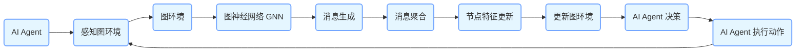

# 开发具有图神经网络能力的AI Agent

> 关键词：图神经网络、AI Agent、智能体开发、图数据处理、强化学习

> 摘要：本文聚焦于开发具有图神经网络能力的AI Agent。详细阐述了相关核心概念、算法原理、数学模型，通过项目实战展示了代码实现与分析，探讨了实际应用场景，推荐了学习资源、开发工具框架以及相关论文著作。最后对未来发展趋势与挑战进行总结，并提供常见问题解答和扩展阅读参考资料，旨在为开发者提供全面且深入的技术指导，助力构建高效、智能的图神经网络AI Agent。

## 1. 背景介绍 

### 1.1 目的和范围
在当今复杂的现实世界中，许多问题的数据呈现出图结构，如社交网络、生物分子结构、知识图谱等。传统的机器学习方法在处理这些图数据时面临诸多挑战，因为图数据具有不规则性和节点间复杂的关系。开发具有图神经网络能力的AI Agent的目的在于利用图神经网络强大的图数据处理能力，使AI Agent能够更好地理解和处理图结构信息，从而在各种图相关的任务中表现出更出色的性能，如节点分类、图分类、链接预测等。

本文的范围涵盖了从图神经网络和AI Agent的核心概念出发，深入探讨相关算法原理、数学模型，通过实际的代码案例展示如何开发这样的AI Agent，还会介绍其在不同领域的应用场景，以及提供学习和开发过程中所需的工具、资源和参考资料。

### 1.2 预期读者
本文预期读者包括对图神经网络、AI Agent开发感兴趣的研究人员、开发者和学生。对于正在学习深度学习、人工智能的学生，本文可以作为他们深入了解图数据处理和智能体开发的入门指南；对于从事相关领域研究的科研人员，本文提供了系统的知识体系和最新的研究方向；对于开发者而言，文中的代码案例和开发实践部分可以帮助他们快速上手开发具有图神经网络能力的AI Agent。

### 1.3 文档结构概述
本文将按照以下结构进行组织：首先介绍图神经网络和AI Agent的核心概念以及它们之间的联系，通过文本示意图和Mermaid流程图进行清晰展示；接着详细讲解核心算法原理，并使用Python源代码进行具体操作步骤的阐述；然后介绍相关的数学模型和公式，并举例说明其应用；通过项目实战部分，展示开发具有图神经网络能力的AI Agent的完整过程，包括开发环境搭建、源代码实现和代码解读；之后探讨该技术在不同领域的实际应用场景；再推荐学习资源、开发工具框架和相关论文著作；最后总结未来发展趋势与挑战，提供常见问题解答和扩展阅读参考资料。

### 1.4 术语表

#### 1.4.1 核心术语定义
- **图神经网络（Graph Neural Network，GNN）**：一类专门用于处理图结构数据的神经网络模型，它通过节点间的消息传递机制来学习节点和图的特征表示。
- **AI Agent（人工智能智能体）**：能够感知环境、做出决策并执行动作的智能实体，它可以根据环境的反馈不断调整自己的行为以实现特定的目标。
- **节点特征（Node Feature）**：图中每个节点所具有的属性信息，如在社交网络中，节点特征可以是用户的年龄、性别等。
- **边特征（Edge Feature）**：图中边所具有的属性信息，如在社交网络中，边特征可以是用户之间的关系强度。
- **消息传递机制（Message Passing Mechanism）**：图神经网络中用于在节点间传递信息的一种机制，通过该机制节点可以聚合邻居节点的信息来更新自己的特征表示。

#### 1.4.2 相关概念解释
- **图数据**：由节点和边组成的数据结构，节点表示实体，边表示实体之间的关系。图数据可以是有向图、无向图、加权图等。
- **强化学习**：一种机器学习范式，智能体通过与环境进行交互，根据环境反馈的奖励信号来学习最优的行为策略。在开发具有图神经网络能力的AI Agent中，强化学习可以用于训练智能体在图环境中做出最优决策。
- **嵌入表示（Embedding Representation）**：将节点或图映射到低维向量空间的表示方法，通过嵌入表示可以方便地进行后续的机器学习任务，如分类、聚类等。

#### 1.4.3 缩略词列表
- **GNN**：Graph Neural Network（图神经网络）
- **AI**：Artificial Intelligence（人工智能）
- **MLP**：Multi - Layer Perceptron（多层感知机）
- **RL**：Reinforcement Learning（强化学习）

## 2. 核心概念与联系 

### 核心概念原理
#### 图神经网络（GNN）
图神经网络的核心思想是通过节点间的消息传递来学习节点和图的特征表示。在图 $G=(V, E)$ 中，$V$ 表示节点集合，$E$ 表示边集合。每个节点 $v_i \in V$ 具有自己的特征向量 $x_i$，边 $(v_i, v_j) \in E$ 可以具有特征向量 $e_{ij}$。

消息传递机制通常包括三个步骤：
1. **消息生成**：节点 $v_i$ 根据自己的特征 $x_i$ 和邻居节点的特征 $x_j$ 生成消息 $m_{ij}$。
2. **消息聚合**：节点 $v_i$ 聚合来自所有邻居节点的消息 $\sum_{j \in N(i)} m_{ij}$，其中 $N(i)$ 表示节点 $v_i$ 的邻居节点集合。
3. **节点特征更新**：节点 $v_i$ 根据聚合后的消息更新自己的特征 $x_i' = U(x_i, \sum_{j \in N(i)} m_{ij})$，其中 $U$ 是更新函数。

#### AI Agent
AI Agent 是一个能够感知环境、做出决策并执行动作的智能实体。它通常由感知模块、决策模块和执行模块组成。感知模块用于获取环境的状态信息，决策模块根据感知到的状态信息和预设的目标选择合适的动作，执行模块将选择的动作作用于环境。在图环境中，AI Agent 的感知模块可以获取图的节点和边的特征信息，决策模块可以根据这些信息决定在图中进行的操作，如节点选择、边添加等。

### 架构的文本示意图
```plaintext
         +----------------+
         |    AI Agent    |
         +----------------+
         | 感知模块       |
         | 决策模块       |
         | 执行模块       |
         +----------------+
                 |
                 | 感知图环境
                 v
         +----------------+
         |    图环境      |
         +----------------+
         | 节点特征       |
         | 边特征         |
         | 图结构         |
         +----------------+
                 |
                 | 消息传递
                 v
         +----------------+
         | 图神经网络(GNN)|
         +----------------+
         | 消息生成       |
         | 消息聚合       |
         | 节点特征更新   |
         +----------------+
```

### Mermaid 流程图


该流程图展示了AI Agent与图环境以及图神经网络之间的交互过程。AI Agent 首先感知图环境的信息，图环境的信息通过图神经网络进行处理，图神经网络更新节点特征后反馈到图环境，AI Agent 根据更新后的图环境进行决策并执行动作，动作的执行又会改变图环境，形成一个闭环的交互过程。

## 3. 核心算法原理 & 具体操作步骤 

### 图神经网络算法原理
以最经典的图卷积网络（Graph Convolutional Network，GCN）为例，GCN 的核心思想是通过聚合邻居节点的特征来更新节点的特征。

#### 数学公式
对于图 $G=(V, E)$ 中的节点 $v_i$，其特征更新公式为：
$$
H^{(l + 1)} = \sigma(\tilde{D}^{-\frac{1}{2}} \tilde{A} \tilde{D}^{-\frac{1}{2}} H^{(l)} W^{(l)})
$$
其中：
- $H^{(l)}$ 是第 $l$ 层的节点特征矩阵，$H^{(l)} \in \mathbb{R}^{|V| \times d^{(l)}}$，$|V|$ 是节点数量，$d^{(l)}$ 是第 $l$ 层的特征维度。
- $\tilde{A} = A + I$，$A$ 是图的邻接矩阵，$I$ 是单位矩阵。
- $\tilde{D}$ 是 $\tilde{A}$ 的度矩阵，即 $\tilde{D}_{ii} = \sum_{j} \tilde{A}_{ij}$。
- $W^{(l)}$ 是第 $l$ 层的可学习权重矩阵，$W^{(l)} \in \mathbb{R}^{d^{(l)} \times d^{(l + 1)}}$。
- $\sigma$ 是激活函数，如 ReLU 函数。

#### Python 代码实现
```python
import torch
import torch.nn as nn
import torch.nn.functional as F

class GCNLayer(nn.Module):
    def __init__(self, in_features, out_features):
        super(GCNLayer, self).__init__()
        self.weight = nn.Parameter(torch.FloatTensor(in_features, out_features))
        self.reset_parameters()

    def reset_parameters(self):
        nn.init.xavier_uniform_(self.weight)

    def forward(self, x, adj):
        # 计算度矩阵的逆平方根
        d_hat = torch.diag(torch.pow(adj.sum(dim=1), -0.5))
        # 计算规范化的邻接矩阵
        adj_hat = torch.mm(torch.mm(d_hat, adj), d_hat)
        # 计算特征更新
        support = torch.mm(x, self.weight)
        output = torch.mm(adj_hat, support)
        return output

class GCN(nn.Module):
    def __init__(self, nfeat, nhid, nclass):
        super(GCN, self).__init__()
        self.gc1 = GCNLayer(nfeat, nhid)
        self.gc2 = GCNLayer(nhid, nclass)

    def forward(self, x, adj):
        x = F.relu(self.gc1(x, adj))
        x = self.gc2(x, adj)
        return F.log_softmax(x, dim=1)


# 示例使用
nfeat = 10  # 输入特征维度
nhid = 20   # 隐藏层特征维度
nclass = 2  # 输出类别数
gcn = GCN(nfeat, nhid, nclass)

# 随机生成节点特征和邻接矩阵
x = torch.randn(5, nfeat)  # 5 个节点
adj = torch.randint(0, 2, (5, 5))  # 邻接矩阵
adj = adj.float()
adj = adj + torch.eye(adj.size(0))  # 加上单位矩阵

output = gcn(x, adj)
print(output)
```

### AI Agent 决策算法原理
在具有图神经网络能力的AI Agent中，我们可以使用强化学习算法来进行决策。以深度 Q 网络（Deep Q - Network，DQN）为例，DQN 的目标是学习一个 Q 函数 $Q(s, a)$，表示在状态 $s$ 下执行动作 $a$ 的期望累积奖励。

#### 算法步骤
1. 初始化 Q 网络 $Q_{\theta}$ 和目标 Q 网络 $Q_{\theta'}$，其中 $\theta$ 和 $\theta'$ 是网络的参数。
2. 初始化经验回放缓冲区 $D$。
3. 对于每个 episode：
    - 初始化图环境状态 $s_0$。
    - 对于每个时间步 $t$：
        - 根据 $\epsilon$-贪心策略选择动作 $a_t$：
            - 以概率 $\epsilon$ 随机选择动作。
            - 以概率 $1 - \epsilon$ 选择 $Q_{\theta}(s_t, a)$ 最大的动作。
        - 执行动作 $a_t$，得到下一个状态 $s_{t + 1}$ 和奖励 $r_t$。
        - 将 $(s_t, a_t, r_t, s_{t + 1})$ 存储到经验回放缓冲区 $D$ 中。
        - 从经验回放缓冲区 $D$ 中随机采样一个小批量的样本 $(s_i, a_i, r_i, s_{i + 1})$。
        - 计算目标值 $y_i$：
            - 如果 $s_{i + 1}$ 是终止状态，则 $y_i = r_i$。
            - 否则，$y_i = r_i + \gamma \max_{a} Q_{\theta'}(s_{i + 1}, a)$，其中 $\gamma$ 是折扣因子。
        - 计算损失函数 $L = \frac{1}{N} \sum_{i = 1}^{N} (y_i - Q_{\theta}(s_i, a_i))^2$。
        - 使用梯度下降法更新 Q 网络的参数 $\theta$。
        - 每隔一定的时间步，将目标 Q 网络的参数 $\theta'$ 更新为 $\theta$。

#### Python 代码实现
```python
import torch
import torch.nn as nn
import torch.optim as optim
import random
import numpy as np

# 定义 Q 网络
class QNetwork(nn.Module):
    def __init__(self, state_dim, action_dim):
        super(QNetwork, self).__init__()
        self.fc1 = nn.Linear(state_dim, 64)
        self.fc2 = nn.Linear(64, 64)
        self.fc3 = nn.Linear(64, action_dim)

    def forward(self, x):
        x = torch.relu(self.fc1(x))
        x = torch.relu(self.fc2(x))
        return self.fc3(x)

# 定义 DQN 智能体
class DQNAgent:
    def __init__(self, state_dim, action_dim, gamma=0.99, epsilon=1.0, epsilon_decay=0.995, epsilon_min=0.01, lr=0.001, batch_size=32, memory_size=10000):
        self.state_dim = state_dim
        self.action_dim = action_dim
        self.gamma = gamma
        self.epsilon = epsilon
        self.epsilon_decay = epsilon_decay
        self.epsilon_min = epsilon_min
        self.lr = lr
        self.batch_size = batch_size
        self.memory = []
        self.memory_size = memory_size

        self.q_network = QNetwork(state_dim, action_dim)
        self.target_network = QNetwork(state_dim, action_dim)
        self.target_network.load_state_dict(self.q_network.state_dict())
        self.optimizer = optim.Adam(self.q_network.parameters(), lr=lr)

    def remember(self, state, action, reward, next_state, done):
        if len(self.memory) > self.memory_size:
            self.memory.pop(0)
        self.memory.append((state, action, reward, next_state, done))

    def act(self, state):
        if np.random.rand() <= self.epsilon:
            return random.randrange(self.action_dim)
        state = torch.FloatTensor(state).unsqueeze(0)
        q_values = self.q_network(state)
        action = torch.argmax(q_values, dim=1).item()
        return action

    def replay(self):
        if len(self.memory) < self.batch_size:
            return
        minibatch = random.sample(self.memory, self.batch_size)
        states, actions, rewards, next_states, dones = zip(*minibatch)

        states = torch.FloatTensor(states)
        actions = torch.LongTensor(actions)
        rewards = torch.FloatTensor(rewards)
        next_states = torch.FloatTensor(next_states)
        dones = torch.FloatTensor(dones)

        q_values = self.q_network(states)
        next_q_values = self.target_network(next_states)
        next_q_values_max = torch.max(next_q_values, dim=1)[0]

        targets = q_values.clone()
        for i in range(self.batch_size):
            if dones[i]:
                targets[i][actions[i]] = rewards[i]
            else:
                targets[i][actions[i]] = rewards[i] + self.gamma * next_q_values_max[i]

        loss = nn.MSELoss()(q_values.gather(1, actions.unsqueeze(1)), targets.gather(1, actions.unsqueeze(1)))
        self.optimizer.zero_grad()
        loss.backward()
        self.optimizer.step()

        if self.epsilon > self.epsilon_min:
            self.epsilon *= self.epsilon_decay

    def update_target_network(self):
        self.target_network.load_state_dict(self.q_network.state_dict())


# 示例使用
state_dim = 10
action_dim = 5
agent = DQNAgent(state_dim, action_dim)

state = np.random.rand(state_dim)
action = agent.act(state)
next_state = np.random.rand(state_dim)
reward = 1.0
done = False
agent.remember(state, action, reward, next_state, done)
agent.replay()
agent.update_target_network()
```

## 4. 数学模型和公式 & 详细讲解 & 举例说明 

### 图神经网络数学模型
#### 图卷积网络（GCN）
如前面所述，GCN 的节点特征更新公式为：
$$
H^{(l + 1)} = \sigma(\tilde{D}^{-\frac{1}{2}} \tilde{A} \tilde{D}^{-\frac{1}{2}} H^{(l)} W^{(l)})
$$

详细讲解：
- $\tilde{A} = A + I$：加上单位矩阵 $I$ 是为了让节点在消息传递过程中也能聚合自己的特征信息。
- $\tilde{D}^{-\frac{1}{2}} \tilde{A} \tilde{D}^{-\frac{1}{2}}$：这是对邻接矩阵进行规范化的操作，目的是为了避免节点度的影响。如果不进行规范化，度大的节点会在消息聚合过程中占据主导地位。
- $H^{(l)} W^{(l)}$：这是对节点特征进行线性变换，$W^{(l)}$ 是可学习的权重矩阵，通过训练可以学习到不同特征之间的重要性。
- $\sigma$：激活函数，如 ReLU 函数，引入非线性变换，增强模型的表达能力。

举例说明：
假设有一个简单的图，包含 3 个节点，节点特征维度为 2，邻接矩阵 $A$ 为：
$$
A = \begin{bmatrix}
0 & 1 & 1 \\
1 & 0 & 1 \\
1 & 1 & 0
\end{bmatrix}
$$
则 $\tilde{A} = A + I$ 为：
$$
\tilde{A} = \begin{bmatrix}
1 & 1 & 1 \\
1 & 1 & 1 \\
1 & 1 & 1
\end{bmatrix}
$$
$\tilde{D}$ 为：
$$
\tilde{D} = \begin{bmatrix}
3 & 0 & 0 \\
0 & 3 & 0 \\
0 & 0 & 3
\end{bmatrix}
$$
$\tilde{D}^{-\frac{1}{2}}$ 为：
$$
\tilde{D}^{-\frac{1}{2}} = \begin{bmatrix}
\frac{1}{\sqrt{3}} & 0 & 0 \\
0 & \frac{1}{\sqrt{3}} & 0 \\
0 & 0 & \frac{1}{\sqrt{3}}
\end{bmatrix}
$$
$\tilde{D}^{-\frac{1}{2}} \tilde{A} \tilde{D}^{-\frac{1}{2}}$ 为：
$$
\tilde{D}^{-\frac{1}{2}} \tilde{A} \tilde{D}^{-\frac{1}{2}} = \begin{bmatrix}
\frac{1}{3} & \frac{1}{3} & \frac{1}{3} \\
\frac{1}{3} & \frac{1}{3} & \frac{1}{3} \\
\frac{1}{3} & \frac{1}{3} & \frac{1}{3}
\end{bmatrix}
$$
假设第 $l$ 层的节点特征矩阵 $H^{(l)}$ 为：
$$
H^{(l)} = \begin{bmatrix}
1 & 2 \\
3 & 4 \\
5 & 6
\end{bmatrix}
$$
可学习权重矩阵 $W^{(l)}$ 为：
$$
W^{(l)} = \begin{bmatrix}
0.1 & 0.2 \\
0.3 & 0.4
\end{bmatrix}
$$
则 $H^{(l)} W^{(l)}$ 为：
$$
H^{(l)} W^{(l)} = \begin{bmatrix}
1\times0.1 + 2\times0.3 & 1\times0.2 + 2\times0.4 \\
3\times0.1 + 4\times0.3 & 3\times0.2 + 4\times0.4 \\
5\times0.1 + 6\times0.3 & 5\times0.2 + 6\times0.4
\end{bmatrix} = \begin{bmatrix}
0.7 & 1 \\
1.5 & 2.2 \\
2.3 & 3.4
\end{bmatrix}
$$
$\tilde{D}^{-\frac{1}{2}} \tilde{A} \tilde{D}^{-\frac{1}{2}} H^{(l)} W^{(l)}$ 为：
$$
\tilde{D}^{-\frac{1}{2}} \tilde{A} \tilde{D}^{-\frac{1}{2}} H^{(l)} W^{(l)} = \begin{bmatrix}
\frac{1}{3}(0.7 + 1.5 + 2.3) & \frac{1}{3}(1 + 2.2 + 3.4) \\
\frac{1}{3}(0.7 + 1.5 + 2.3) & \frac{1}{3}(1 + 2.2 + 3.4) \\
\frac{1}{3}(0.7 + 1.5 + 2.3) & \frac{1}{3}(1 + 2.2 + 3.4)
\end{bmatrix} = \begin{bmatrix}
1.5 & 2.2 \\
1.5 & 2.2 \\
1.5 & 2.2
\end{bmatrix}
$$
如果激活函数 $\sigma$ 为 ReLU 函数，则 $H^{(l + 1)} = \sigma(\tilde{D}^{-\frac{1}{2}} \tilde{A} \tilde{D}^{-\frac{1}{2}} H^{(l)} W^{(l)})$ 为：
$$
H^{(l + 1)} = \begin{bmatrix}
1.5 & 2.2 \\
1.5 & 2.2 \\
1.5 & 2.2
\end{bmatrix}
$$

### 强化学习数学模型
#### 深度 Q 网络（DQN）
DQN 的目标是学习一个 Q 函数 $Q(s, a)$，使得：
$$
Q^*(s, a) = \mathbb{E}_{s', r} [r + \gamma \max_{a'} Q^*(s', a') | s, a]
$$
其中 $Q^*(s, a)$ 是最优 Q 函数，$s$ 是当前状态，$a$ 是当前动作，$s'$ 是下一个状态，$r$ 是奖励，$\gamma$ 是折扣因子。

详细讲解：
- 最优 Q 函数 $Q^*(s, a)$ 表示在状态 $s$ 下执行动作 $a$ 所能获得的最大期望累积奖励。
- $\gamma$ 是折扣因子，用于平衡即时奖励和未来奖励的重要性。$\gamma$ 越接近 1，智能体越关注未来的奖励；$\gamma$ 越接近 0，智能体越关注即时奖励。
- $\max_{a'} Q^*(s', a')$ 表示在下一个状态 $s'$ 下选择最优动作所能获得的最大 Q 值。

举例说明：
假设智能体在一个简单的图环境中，状态 $s$ 是节点的特征向量，动作 $a$ 是选择相邻的节点。当前状态 $s$ 下执行动作 $a$ 得到奖励 $r = 1$，下一个状态 $s'$ 下，不同动作的 Q 值分别为 $Q(s', a_1) = 2$，$Q(s', a_2) = 3$，$Q(s', a_3) = 1$。如果折扣因子 $\gamma = 0.9$，则目标 Q 值为：
$$
y = r + \gamma \max_{a'} Q(s', a') = 1 + 0.9\times3 = 3.7
$$

## 5. 项目实战：代码实际案例和详细解释说明 

### 5.1  开发环境搭建
#### 安装 Python
首先确保你已经安装了 Python，建议使用 Python 3.7 及以上版本。可以从 Python 官方网站（https://www.python.org/downloads/） 下载并安装。

#### 安装必要的库
使用 `pip` 安装以下必要的库：
```bash
pip install torch
pip install torch_geometric
pip install numpy
```
- `torch`：PyTorch 深度学习框架，用于构建和训练神经网络。
- `torch_geometric`：专门用于处理图数据的 PyTorch 扩展库，提供了许多图神经网络的实现和工具。
- `numpy`：用于数值计算。

### 5.2  源代码详细实现和代码解读
#### 项目目标
我们的项目目标是开发一个具有图神经网络能力的AI Agent，用于解决图节点分类问题。具体来说，我们将使用图卷积网络（GCN）作为图神经网络，使用深度 Q 网络（DQN）作为AI Agent的决策算法。

#### 代码实现
```python
import torch
import torch.nn.functional as F
from torch_geometric.data import Data
from torch_geometric.nn import GCNConv
import numpy as np
import random

# 定义图卷积网络（GCN）
class GCN(torch.nn.Module):
    def __init__(self, in_channels, hidden_channels, out_channels):
        super(GCN, self).__init__()
        self.conv1 = GCNConv(in_channels, hidden_channels)
        self.conv2 = GCNConv(hidden_channels, out_channels)

    def forward(self, x, edge_index):
        x = self.conv1(x, edge_index)
        x = F.relu(x)
        x = F.dropout(x, training=self.training)
        x = self.conv2(x, edge_index)
        return F.log_softmax(x, dim=1)

# 定义 DQN 智能体
class DQNAgent:
    def __init__(self, state_dim, action_dim, gamma=0.99, epsilon=1.0, epsilon_decay=0.995, epsilon_min=0.01, lr=0.001, batch_size=32, memory_size=10000):
        self.state_dim = state_dim
        self.action_dim = action_dim
        self.gamma = gamma
        self.epsilon = epsilon
        self.epsilon_decay = epsilon_decay
        self.epsilon_min = epsilon_min
        self.lr = lr
        self.batch_size = batch_size
        self.memory = []
        self.memory_size = memory_size

        self.q_network = torch.nn.Sequential(
            torch.nn.Linear(state_dim, 64),
            torch.nn.ReLU(),
            torch.nn.Linear(64, 64),
            torch.nn.ReLU(),
            torch.nn.Linear(64, action_dim)
        )
        self.target_network = torch.nn.Sequential(
            torch.nn.Linear(state_dim, 64),
            torch.nn.ReLU(),
            torch.nn.Linear(64, 64),
            torch.nn.ReLU(),
            torch.nn.Linear(64, action_dim)
        )
        self.target_network.load_state_dict(self.q_network.state_dict())
        self.optimizer = torch.optim.Adam(self.q_network.parameters(), lr=lr)

    def remember(self, state, action, reward, next_state, done):
        if len(self.memory) > self.memory_size:
            self.memory.pop(0)
        self.memory.append((state, action, reward, next_state, done))

    def act(self, state):
        if np.random.rand() <= self.epsilon:
            return random.randrange(self.action_dim)
        state = torch.FloatTensor(state).unsqueeze(0)
        q_values = self.q_network(state)
        action = torch.argmax(q_values, dim=1).item()
        return action

    def replay(self):
        if len(self.memory) < self.batch_size:
            return
        minibatch = random.sample(self.memory, self.batch_size)
        states, actions, rewards, next_states, dones = zip(*minibatch)

        states = torch.FloatTensor(states)
        actions = torch.LongTensor(actions)
        rewards = torch.FloatTensor(rewards)
        next_states = torch.FloatTensor(next_states)
        dones = torch.FloatTensor(dones)

        q_values = self.q_network(states)
        next_q_values = self.target_network(next_states)
        next_q_values_max = torch.max(next_q_values, dim=1)[0]

        targets = q_values.clone()
        for i in range(self.batch_size):
            if dones[i]:
                targets[i][actions[i]] = rewards[i]
            else:
                targets[i][actions[i]] = rewards[i] + self.gamma * next_q_values_max[i]

        loss = torch.nn.MSELoss()(q_values.gather(1, actions.unsqueeze(1)), targets.gather(1, actions.unsqueeze(1)))
        self.optimizer.zero_grad()
        loss.backward()
        self.optimizer.step()

        if self.epsilon > self.epsilon_min:
            self.epsilon *= self.epsilon_decay

    def update_target_network(self):
        self.target_network.load_state_dict(self.q_network.state_dict())


# 生成示例图数据
num_nodes = 10
num_features = 5
num_classes = 2
edge_index = torch.tensor([[0, 1, 1, 2, 2, 3], [1, 0, 2, 1, 3, 2]], dtype=torch.long)
x = torch.randn(num_nodes, num_features)
y = torch.randint(0, num_classes, (num_nodes,))
data = Data(x=x, edge_index=edge_index, y=y)

# 初始化 GCN 模型
gcn = GCN(num_features, 16, num_classes)

# 初始化 DQN 智能体
state_dim = num_features
action_dim = num_classes
agent = DQNAgent(state_dim, action_dim)

# 训练过程
num_episodes = 100
for episode in range(num_episodes):
    for node_idx in range(num_nodes):
        state = data.x[node_idx].numpy()
        action = agent.act(state)
        predicted_label = torch.argmax(gcn(data.x, data.edge_index)[node_idx]).item()
        reward = 1 if action == predicted_label else -1
        next_state = data.x[(node_idx + 1) % num_nodes].numpy()
        done = (node_idx == num_nodes - 1)
        agent.remember(state, action, reward, next_state, done)
        agent.replay()
    agent.update_target_network()
    print(f"Episode {episode + 1} completed.")
```

#### 代码解读
1. **GCN 模型定义**：
    - `GCN` 类继承自 `torch.nn.Module`，定义了一个两层的图卷积网络。
    - `conv1` 和 `conv2` 是两个图卷积层，分别用于将输入特征映射到隐藏层和输出层。
    - `forward` 方法定义了前向传播过程，包括卷积、ReLU 激活和 Dropout 操作，最后使用 `log_softmax` 函数输出分类概率。

2. **DQN 智能体定义**：
    - `DQNAgent` 类包含了 DQN 算法的核心逻辑，包括经验回放、$\epsilon$-贪心策略、目标网络更新等。
    - `q_network` 是主 Q 网络，`target_network` 是目标 Q 网络，用于稳定训练过程。
    - `act` 方法根据 $\epsilon$-贪心策略选择动作。
    - `replay` 方法从经验回放缓冲区中采样并更新 Q 网络的参数。
    - `update_target_network` 方法用于更新目标 Q 网络的参数。

3. **数据生成和初始化**：
    - 使用 `torch_geometric.data.Data` 生成示例图数据，包括节点特征、边索引和节点标签。
    - 初始化 GCN 模型和 DQN 智能体。

4. **训练过程**：
    - 在每个 episode 中，遍历图中的每个节点。
    - 智能体根据当前节点的特征选择动作，并得到奖励。
    - 将经验存储到经验回放缓冲区中，并进行经验回放更新 Q 网络的参数。
    - 每个 episode 结束后，更新目标 Q 网络的参数。

### 5.3  代码解读与分析
#### 优点
- **模块化设计**：代码将 GCN 模型和 DQN 智能体分开定义，使得代码结构清晰，易于扩展和维护。
- **经验回放**：使用经验回放机制可以打破数据之间的相关性，提高训练的稳定性和效率。
- **目标网络**：使用目标网络可以减少训练过程中的波动，提高算法的收敛性。

#### 缺点
- **计算资源消耗**：训练过程中需要同时维护 GCN 模型和 DQN 智能体，计算资源消耗较大。
- **参数调优**：DQN 算法中有多个超参数需要调优，如 $\gamma$、$\epsilon$、学习率等，调优过程较为复杂。

#### 改进方向
- **使用更高效的图神经网络架构**：可以尝试使用更先进的图神经网络架构，如 GraphSAGE、GAT 等，提高模型的性能。
- **优化 DQN 算法**：可以使用一些改进的 DQN 算法，如 Double DQN、Dueling DQN 等，提高算法的稳定性和收敛速度。

## 6. 实际应用场景 
### 社交网络分析
在社交网络中，用户可以看作是图中的节点，用户之间的关系可以看作是边。具有图神经网络能力的AI Agent可以用于社交网络中的用户分类、好友推荐、信息传播预测等任务。例如，通过学习用户的特征和社交关系，AI Agent可以预测用户的兴趣爱好，从而为用户推荐合适的好友或内容。

### 生物信息学
在生物信息学中，蛋白质结构、基因调控网络等都可以表示为图结构。AI Agent可以用于蛋白质功能预测、药物发现等任务。例如，通过学习蛋白质分子的图结构和特征，AI Agent可以预测蛋白质的功能，为药物研发提供有价值的信息。

### 交通网络优化
交通网络可以看作是一个图，路口是节点，道路是边。AI Agent可以用于交通流量预测、路径规划等任务。例如，通过学习交通网络的拓扑结构和历史流量数据，AI Agent可以预测未来的交通流量，为驾驶员提供最优的路径规划。

### 知识图谱推理
知识图谱是一种以图的形式表示知识的数据库，节点表示实体，边表示实体之间的关系。AI Agent可以用于知识图谱中的实体分类、关系预测、知识补全和推理等任务。例如，通过学习知识图谱的图结构和实体特征，AI Agent可以预测实体之间的潜在关系，补全知识图谱中的缺失信息。

## 7. 工具和资源推荐
### 7.1 学习资源推荐
#### 7.1.1 书籍推荐
- 《图神经网络：基础、前沿与应用》：全面介绍了图神经网络的基本概念、算法原理和应用场景，适合初学者和有一定基础的读者。
- 《深度学习》：经典的深度学习教材，虽然不是专门针对图神经网络，但其中的神经网络基础、优化算法等内容对于理解图神经网络非常有帮助。
- 《强化学习：原理与Python实现》：详细介绍了强化学习的基本原理和算法，对于理解AI Agent的决策机制非常有帮助。

#### 7.1.2 在线课程
- Coursera 上的“Graph Neural Networks for Machine Learning”：由知名学者授课，系统介绍了图神经网络的理论和实践。
- edX 上的“Deep Reinforcement Learning”：深入讲解了强化学习的算法和应用，对于开发具有图神经网络能力的AI Agent有很大的帮助。
- 哔哩哔哩上的“图神经网络入门教程”：由国内的研究者制作，内容通俗易懂，适合初学者。

#### 7.1.3 技术博客和网站
- Medium 上的“Graph Neural Networks”专栏：汇集了许多图神经网络领域的最新研究成果和实践经验。
- 知乎上的“图神经网络”话题：有许多研究者和开发者分享自己的见解和经验。
- 开源中国的“图神经网络”板块：提供了一些图神经网络的开源项目和技术文章。

### 7.2 开发工具框架推荐
#### 7.2.1 IDE和编辑器
- PyCharm：功能强大的 Python 集成开发环境，提供了代码编辑、调试、版本控制等功能，适合开发大型的 Python 项目。
- Jupyter Notebook：交互式的开发环境，适合进行数据分析和模型实验，方便展示代码和结果。
- Visual Studio Code：轻量级的代码编辑器，支持多种编程语言和插件，适合快速开发和调试。

#### 7.2.2 调试和性能分析工具
- PyTorch Profiler：PyTorch 自带的性能分析工具，可以帮助开发者分析模型的运行时间、内存使用等情况。
- TensorBoard：用于可视化深度学习模型的训练过程和性能指标，方便开发者监控模型的训练状态。
- NVIDIA Nsight Systems：用于分析 GPU 性能的工具，可以帮助开发者优化模型在 GPU 上的运行效率。

#### 7.2.3 相关框架和库
- PyTorch Geometric：专门用于处理图数据的 PyTorch 扩展库，提供了许多图神经网络的实现和工具，如 GCN、GraphSAGE、GAT 等。
- DGL（Deep Graph Library）：另一个流行的图神经网络框架，支持多种深度学习后端，如 PyTorch、TensorFlow 等。
- Stable Baselines3：用于强化学习的开源库，提供了许多经典的强化学习算法的实现，如 DQN、PPO、A2C 等。

### 7.3 相关论文著作推荐
#### 7.3.1 经典论文
- “Semi-Supervised Classification with Graph Convolutional Networks”：提出了图卷积网络（GCN）的经典论文，为图神经网络的发展奠定了基础。
- “Deep Reinforcement Learning with Double Q-learning”：提出了 Double DQN 算法，有效解决了 DQN 算法中的高估问题。
- “Attention Is All You Need”：提出了 Transformer 架构，为自然语言处理和图神经网络等领域带来了新的思路。

#### 7.3.2 最新研究成果
- 每年的 NeurIPS、ICML、CVPR 等顶级学术会议上都会有许多关于图神经网络和强化学习的最新研究成果发表，可以关注这些会议的论文。
- arXiv 预印本平台上也有许多最新的研究论文，可以及时了解该领域的研究动态。

#### 7.3.3 应用案例分析
- 一些知名企业和研究机构会在其官方博客上分享图神经网络和AI Agent的应用案例，如 Google、Facebook、DeepMind 等，可以从中学习到实际应用中的经验和技巧。

## 8. 总结：未来发展趋势与挑战
### 未来发展趋势
#### 更强的表达能力
未来的图神经网络和AI Agent将具有更强的表达能力，能够处理更复杂的图结构和任务。例如，开发能够处理动态图、异构图的图神经网络模型，以及能够在多任务、多智能体环境中工作的AI Agent。

#### 与其他技术的融合
图神经网络和AI Agent将与其他技术，如计算机视觉、自然语言处理、区块链等进行更深入的融合。例如，在计算机视觉中使用图神经网络处理图像的语义信息，在自然语言处理中使用AI Agent进行对话生成和知识推理。

#### 实际应用的拓展
图神经网络和AI Agent的应用场景将不断拓展，涵盖更多的领域，如医疗保健、金融、教育等。例如，在医疗保健领域，使用图神经网络分析生物医学数据，辅助疾病诊断和治疗方案制定。

### 挑战
#### 计算资源需求
图神经网络和AI Agent的训练和推理过程通常需要大量的计算资源，尤其是在处理大规模图数据时。如何在有限的计算资源下提高模型的训练和推理效率是一个亟待解决的问题。

#### 可解释性
图神经网络和AI Agent的决策过程通常是黑盒的，缺乏可解释性。在一些关键领域，如医疗、金融等，模型的可解释性非常重要。如何提高图神经网络和AI Agent的可解释性是一个挑战。

#### 数据质量和隐私
图数据的质量和隐私是一个重要的问题。图数据通常包含大量的敏感信息，如用户的社交关系、生物特征等。如何在保证数据质量的前提下，保护数据的隐私是一个挑战。

## 9. 附录：常见问题与解答
### 1. 图神经网络和传统神经网络有什么区别？
传统神经网络通常处理的是规则的数据结构，如图像、文本等，而图神经网络专门用于处理图结构数据。图数据具有不规则性和节点间复杂的关系，图神经网络通过消息传递机制来学习节点和图的特征表示，能够更好地处理图数据的这些特点。

### 2. 如何选择合适的图神经网络架构？
选择合适的图神经网络架构需要考虑多个因素，如图的规模、节点和边的特征信息、任务的类型等。对于小规模图数据，可以选择简单的图神经网络架构，如 GCN；对于大规模图数据，可以选择更高效的架构，如 GraphSAGE。对于具有节点和边特征信息的图数据，可以选择能够处理特征信息的架构，如 GAT。

### 3. 强化学习中的超参数如何调优？
强化学习中的超参数调优是一个复杂的问题，通常可以使用以下方法：
- 网格搜索：对超参数的不同取值进行组合，然后在验证集上评估模型的性能，选择性能最好的超参数组合。
- 随机搜索：随机选择超参数的取值，然后在验证集上评估模型的性能，选择性能最好的超参数组合。
- 贝叶斯优化：使用贝叶斯方法对超参数的取值进行优化，根据之前的评估结果预测下一个超参数的取值，以提高搜索效率。

### 4. 如何处理图数据中的缺失值？
处理图数据中的缺失值可以采用以下方法：
- 删除缺失值：如果缺失值的比例较小，可以直接删除包含缺失值的节点或边。
- 填充缺失值：可以使用均值、中位数、众数等统计量填充缺失值，也可以使用机器学习模型预测缺失值。
- 特殊编码：将缺失值作为一种特殊的类别进行编码，让模型学习缺失值的特征。

## 10. 扩展阅读 & 参考资料
### 扩展阅读
- 《图机器学习》：深入介绍了图机器学习的理论和方法，包括图的表示学习、图神经网络、图算法等内容。
- 《人工智能：一种现代的