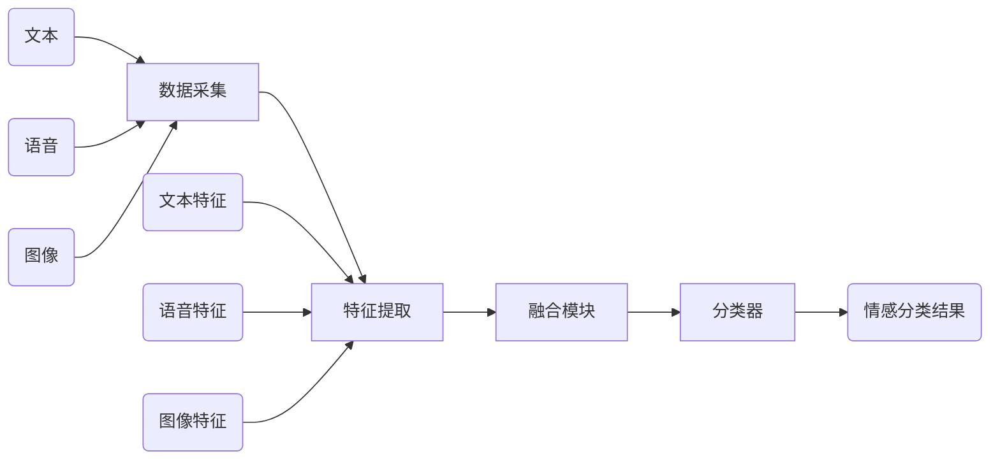

# 开发具有多模态情感识别能力的AI Agent

> 关键词：多模态情感识别、AI Agent、情感分析、深度学习、多传感器融合

> 摘要：本文围绕开发具有多模态情感识别能力的AI Agent展开。详细阐述了多模态情感识别的核心概念、算法原理、数学模型等内容。通过Python代码展示了具体的实现步骤，并给出了项目实战案例，包括开发环境搭建、源代码实现与解读。同时探讨了多模态情感识别在实际中的应用场景，推荐了相关的学习资源、开发工具和论文著作。最后总结了未来的发展趋势与挑战，并对常见问题进行了解答。旨在为开发者和研究者提供全面的指导，推动多模态情感识别技术在AI Agent中的应用。

## 1. 背景介绍 
### 1.1 目的和范围
随着人工智能技术的不断发展，开发更加智能、能够理解人类情感的AI Agent成为研究热点。具有多模态情感识别能力的AI Agent可以通过综合分析多种不同类型的数据，如文本、语音、图像等，更准确地识别人类的情感状态。本文章的目的在于详细介绍开发这样一个AI Agent的全过程，包括核心概念、算法原理、实际应用等方面。范围涵盖从理论知识的讲解到实际项目的开发，为读者提供一个全面的技术指南。

### 1.2 预期读者
本文预期读者包括人工智能领域的开发者、研究者，以及对多模态情感识别技术感兴趣的技术爱好者。对于正在从事相关项目开发的专业人员，文章可以提供深入的技术细节和实践经验；对于初学者，文章可以作为入门学习的资料，帮助他们了解多模态情感识别的基本概念和开发流程。

### 1.3 文档结构概述
本文将按照以下结构进行组织：首先介绍多模态情感识别的核心概念与联系，包括其原理和架构；接着详细讲解核心算法原理和具体操作步骤，并给出Python源代码示例；然后介绍相关的数学模型和公式，并通过举例进行说明；之后通过项目实战展示如何开发一个具有多模态情感识别能力的AI Agent，包括开发环境搭建、源代码实现和代码解读；再探讨多模态情感识别在实际中的应用场景；推荐相关的学习资源、开发工具和论文著作；最后总结未来的发展趋势与挑战，并对常见问题进行解答。

### 1.4 术语表
#### 1.4.1 核心术语定义
- **多模态情感识别**：指综合利用多种不同类型的数据（如文本、语音、图像等）来识别人类情感状态的技术。
- **AI Agent**：是一种能够感知环境、进行推理和决策，并采取行动以实现特定目标的人工智能实体。
- **情感分析**：对文本、语音等数据中所表达的情感倾向进行分析和判断的过程。
- **深度学习**：一种基于人工神经网络的机器学习方法，能够自动从大量数据中学习特征和模式。
- **多传感器融合**：将来自不同传感器的数据进行整合和处理，以获取更全面、准确的信息。

#### 1.4.2 相关概念解释
- **特征提取**：从原始数据中提取出能够代表数据特征的信息，以便后续的分析和处理。
- **分类器**：用于将数据分类到不同类别的模型，在情感识别中，分类器可以将情感状态分为积极、消极、中性等类别。
- **融合策略**：在多模态情感识别中，用于将不同模态的数据进行融合的方法，如早期融合、晚期融合等。

#### 1.4.3 缩略词列表
- **CNN**：Convolutional Neural Network，卷积神经网络
- **RNN**：Recurrent Neural Network，循环神经网络
- **LSTM**：Long Short-Term Memory，长短期记忆网络
- **GRU**：Gated Recurrent Unit，门控循环单元

## 2. 核心概念与联系 
### 核心概念原理
多模态情感识别的核心原理是综合利用多种不同模态的数据来识别人类的情感状态。不同模态的数据包含了不同的情感信息，例如文本中可能包含表达情感的词汇和语句，语音中的语调、语速等也能反映出情感，图像中的面部表情更是直接体现了情感。通过对这些不同模态的数据进行特征提取和分析，并将它们融合起来，可以更准确地识别人类的情感。

### 架构
多模态情感识别的架构通常包括以下几个部分：
1. **数据采集**：通过不同的传感器或数据源采集文本、语音、图像等多模态数据。
2. **特征提取**：对采集到的不同模态的数据进行特征提取，将原始数据转换为具有代表性的特征向量。
3. **融合模块**：将不同模态的特征向量进行融合，得到综合的特征表示。
4. **分类器**：使用融合后的特征向量进行情感分类，判断情感状态。

以下是一个多模态情感识别架构的文本示意图：

```plaintext
+-----------------+
|    数据采集     |
| （文本、语音、图像） |
+-----------------+
         |
         v
+-----------------+
|    特征提取     |
| （文本特征、语音特征、图像特征） |
+-----------------+
         |
         v
+-----------------+
|    融合模块     |
| （早期融合、晚期融合等） |
+-----------------+
         |
         v
+-----------------+
|    分类器       |
| （情感分类）     |
+-----------------+
```

### Mermaid流程图


## 3. 核心算法原理 & 具体操作步骤 
### 核心算法原理
在多模态情感识别中，常用的算法包括深度学习算法，如卷积神经网络（CNN）、循环神经网络（RNN）及其变体（LSTM、GRU）等。以下以CNN为例，介绍其在图像情感识别中的原理。

CNN是一种专门用于处理具有网格结构数据（如图像）的神经网络。它通过卷积层、池化层和全连接层来自动提取图像的特征。卷积层使用卷积核在图像上滑动，进行卷积操作，提取图像的局部特征。池化层用于降低特征图的维度，减少计算量。全连接层将提取的特征进行组合，输出最终的分类结果。

### 具体操作步骤
以下是一个使用Python和Keras库实现简单图像情感识别的示例代码：

```python
import numpy as np
from keras.models import Sequential
from keras.layers import Conv2D, MaxPooling2D, Flatten, Dense
from keras.datasets import mnist
from keras.utils import to_categorical

# 加载数据集
(X_train, y_train), (X_test, y_test) = mnist.load_data()

# 数据预处理
X_train = X_train.reshape(-1, 28, 28, 1).astype('float32') / 255
X_test = X_test.reshape(-1, 28, 28, 1).astype('float32') / 255
y_train = to_categorical(y_train)
y_test = to_categorical(y_test)

# 构建CNN模型
model = Sequential()
model.add(Conv2D(32, (3, 3), activation='relu', input_shape=(28, 28, 1)))
model.add(MaxPooling2D((2, 2)))
model.add(Conv2D(64, (3, 3), activation='relu'))
model.add(MaxPooling2D((2, 2)))
model.add(Flatten())
model.add(Dense(64, activation='relu'))
model.add(Dense(10, activation='softmax'))

# 编译模型
model.compile(optimizer='adam',
              loss='categorical_crossentropy',
              metrics=['accuracy'])

# 训练模型
model.fit(X_train, y_train, epochs=5, batch_size=64)

# 评估模型
test_loss, test_acc = model.evaluate(X_test, y_test)
print('Test accuracy:', test_acc)
```

### 代码解释
1. **数据加载**：使用`mnist.load_data()`加载MNIST手写数字数据集。
2. **数据预处理**：将图像数据的形状调整为适合CNN输入的形状，并将像素值归一化到0-1之间。同时，将标签进行one-hot编码。
3. **模型构建**：使用`Sequential`模型构建一个简单的CNN模型，包括卷积层、池化层、全连接层。
4. **模型编译**：使用`adam`优化器和`categorical_crossentropy`损失函数编译模型。
5. **模型训练**：使用训练数据对模型进行训练，设置训练轮数和批次大小。
6. **模型评估**：使用测试数据对模型进行评估，输出测试准确率。

## 4. 数学模型和公式 & 详细讲解 & 举例说明 
### 卷积操作
卷积操作是CNN中的核心操作，其数学公式如下：

$$
y_{i,j} = \sum_{m=0}^{M-1} \sum_{n=0}^{N-1} x_{i+m,j+n} \cdot w_{m,n} + b
$$

其中，$x$ 是输入图像，$w$ 是卷积核，$b$ 是偏置项，$y$ 是卷积后的输出。

### 详细讲解
卷积操作的本质是对输入图像进行局部特征提取。卷积核在输入图像上滑动，每次与输入图像的局部区域进行点积运算，然后将结果相加并加上偏置项，得到输出特征图的一个元素。通过不断滑动卷积核，可以得到整个输出特征图。

### 举例说明
假设输入图像 $x$ 是一个 $3\times3$ 的矩阵：

$$
x = \begin{bmatrix}
1 & 2 & 3 \\
4 & 5 & 6 \\
7 & 8 & 9
\end{bmatrix}
$$

卷积核 $w$ 是一个 $2\times2$ 的矩阵：

$$
w = \begin{bmatrix}
1 & 0 \\
0 & 1
\end{bmatrix}
$$

偏置项 $b = 0$。

首先，卷积核与输入图像的左上角 $2\times2$ 区域进行点积运算：

$$
\begin{bmatrix}
1 & 2 \\
4 & 5
\end{bmatrix} \cdot \begin{bmatrix}
1 & 0 \\
0 & 1
\end{bmatrix} = 1\times1 + 2\times0 + 4\times0 + 5\times1 = 6
$$

然后，卷积核向右滑动一个位置，与输入图像的右上角 $2\times2$ 区域进行点积运算：

$$
\begin{bmatrix}
2 & 3 \\
5 & 6
\end{bmatrix} \cdot \begin{bmatrix}
1 & 0 \\
0 & 1
\end{bmatrix} = 2\times1 + 3\times0 + 5\times0 + 6\times1 = 8
$$

以此类推，最终得到输出特征图：

$$
y = \begin{bmatrix}
6 & 8 \\
10 & 12
\end{bmatrix}
$$

### 池化操作
池化操作通常用于降低特征图的维度，常用的池化方法有最大池化和平均池化。以最大池化为例，其数学公式如下：

$$
y_{i,j} = \max_{m=0}^{M-1} \max_{n=0}^{N-1} x_{i\times s + m,j\times s + n}
$$

其中，$x$ 是输入特征图，$s$ 是池化步长，$y$ 是池化后的输出。

### 详细讲解
最大池化操作在每个池化窗口内选择最大值作为输出，从而保留了特征图中的重要信息，同时降低了特征图的维度。

### 举例说明
假设输入特征图 $x$ 是一个 $4\times4$ 的矩阵：

$$
x = \begin{bmatrix}
1 & 2 & 3 & 4 \\
5 & 6 & 7 & 8 \\
9 & 10 & 11 & 12 \\
13 & 14 & 15 & 16
\end{bmatrix}
$$

池化窗口大小为 $2\times2$，步长 $s = 2$。

首先，对左上角 $2\times2$ 区域进行最大池化：

$$
\max \begin{bmatrix}
1 & 2 \\
5 & 6
\end{bmatrix} = 6
$$

然后，对右上角 $2\times2$ 区域进行最大池化：

$$
\max \begin{bmatrix}
3 & 4 \\
7 & 8
\end{bmatrix} = 8
$$

以此类推，最终得到池化后的输出特征图：

$$
y = \begin{bmatrix}
6 & 8 \\
14 & 16
\end{bmatrix}
$$

## 5. 项目实战：代码实际案例和详细解释说明 
### 5.1  开发环境搭建
#### 操作系统
建议使用Linux系统，如Ubuntu 18.04或更高版本，也可以使用Windows 10或macOS。

#### Python环境
安装Python 3.7或更高版本，可以使用Anaconda来管理Python环境。以下是安装Anaconda的步骤：
1. 从Anaconda官网（https://www.anaconda.com/products/individual）下载适合自己操作系统的Anaconda安装包。
2. 运行安装包，按照提示进行安装。
3. 安装完成后，打开终端或命令提示符，输入以下命令创建一个新的Python环境：
```bash
conda create -n multimodal python=3.8
conda activate multimodal
```

#### 安装必要的库
在激活的Python环境中，使用以下命令安装必要的库：
```bash
pip install numpy pandas tensorflow keras scikit-learn opencv-python librosa
```

### 5.2  源代码详细实现和代码解读
以下是一个简单的多模态情感识别项目的源代码示例，综合了文本和语音模态：

```python
import numpy as np
import pandas as pd
from sklearn.model_selection import train_test_split
from sklearn.preprocessing import LabelEncoder
from tensorflow.keras.models import Model
from tensorflow.keras.layers import Input, Dense, Embedding, LSTM, concatenate
from tensorflow.keras.preprocessing.text import Tokenizer
from tensorflow.keras.preprocessing.sequence import pad_sequences
import librosa

# 数据加载和预处理
def load_text_data():
    data = pd.read_csv('text_data.csv')
    texts = data['text'].values
    labels = data['label'].values
    tokenizer = Tokenizer(num_words=10000)
    tokenizer.fit_on_texts(texts)
    sequences = tokenizer.texts_to_sequences(texts)
    max_length = 100
    padded_sequences = pad_sequences(sequences, maxlen=max_length)
    label_encoder = LabelEncoder()
    encoded_labels = label_encoder.fit_transform(labels)
    return padded_sequences, encoded_labels

def load_audio_data():
    audio_features = []
    labels = []
    data = pd.read_csv('audio_data.csv')
    for index, row in data.iterrows():
        audio_file = row['audio_file']
        label = row['label']
        y, sr = librosa.load(audio_file)
        mfccs = librosa.feature.mfcc(y=y, sr=sr, n_mfcc=13)
        mfccs = np.mean(mfccs, axis=1)
        audio_features.append(mfccs)
        labels.append(label)
    audio_features = np.array(audio_features)
    label_encoder = LabelEncoder()
    encoded_labels = label_encoder.fit_transform(labels)
    return audio_features, encoded_labels

# 构建模型
def build_model():
    # 文本输入
    text_input = Input(shape=(100,))
    embedding_layer = Embedding(input_dim=10000, output_dim=128)(text_input)
    lstm_layer = LSTM(128)(embedding_layer)

    # 音频输入
    audio_input = Input(shape=(13,))
    dense_audio = Dense(128, activation='relu')(audio_input)

    # 融合层
    merged = concatenate([lstm_layer, dense_audio])
    output = Dense(3, activation='softmax')(merged)

    model = Model(inputs=[text_input, audio_input], outputs=output)
    model.compile(optimizer='adam', loss='sparse_categorical_crossentropy', metrics=['accuracy'])
    return model

# 训练模型
def train_model():
    text_data, text_labels = load_text_data()
    audio_data, audio_labels = load_audio_data()
    assert np.all(text_labels == audio_labels)
    X_train_text, X_test_text, X_train_audio, X_test_audio, y_train, y_test = train_test_split(
        text_data, audio_data, text_labels, test_size=0.2, random_state=42
    )
    model = build_model()
    model.fit([X_train_text, X_train_audio], y_train, epochs=10, batch_size=32, validation_data=([X_test_text, X_test_audio], y_test))

if __name__ == "__main__":
    train_model()
```

### 5.3  代码解读与分析
#### 数据加载和预处理
- `load_text_data` 函数：从CSV文件中加载文本数据，使用`Tokenizer`将文本转换为序列，再使用`pad_sequences`对序列进行填充，使其长度一致。最后使用`LabelEncoder`对标签进行编码。
- `load_audio_data` 函数：从CSV文件中加载音频文件路径和标签，使用`librosa`库加载音频文件，并提取MFCC特征。将MFCC特征求均值，作为音频的特征表示。同样使用`LabelEncoder`对标签进行编码。

#### 模型构建
- `build_model` 函数：构建一个多模态模型，包括文本输入和音频输入。文本输入通过嵌入层和LSTM层进行处理，音频输入通过全连接层进行处理。最后将两个模态的特征进行融合，通过一个全连接层输出分类结果。

#### 模型训练
- `train_model` 函数：调用`load_text_data`和`load_audio_data`函数加载数据，使用`train_test_split`函数将数据分为训练集和测试集。构建模型并使用训练数据进行训练，同时在测试集上进行验证。

## 6. 实际应用场景 
### 智能客服
在智能客服系统中，具有多模态情感识别能力的AI Agent可以通过分析用户的文本、语音等信息，准确识别用户的情感状态。如果用户情绪激动或不满，AI Agent可以及时调整回应策略，提供更贴心的服务，提高用户满意度。

### 教育领域
在在线教育平台中，AI Agent可以通过分析学生的语音、面部表情等多模态信息，了解学生的学习状态和情感变化。例如，当学生表现出困惑或焦虑时，AI Agent可以及时给予指导和鼓励，提高学习效果。

### 心理健康监测
通过多模态情感识别技术，AI Agent可以实时监测人们的情感状态，如抑郁、焦虑等。在心理健康监测系统中，用户可以通过语音、文字等方式与AI Agent交流，AI Agent根据用户的情感状态提供相应的建议和干预措施。

### 市场营销
在市场营销中，AI Agent可以通过分析消费者的多模态数据，了解消费者的喜好和情感倾向。例如，通过分析消费者的社交媒体文本、视频评论等信息，为企业制定更精准的营销策略。

## 7. 工具和资源推荐
### 7.1 学习资源推荐
#### 7.1.1 书籍推荐
- 《深度学习》（Deep Learning）：由Ian Goodfellow、Yoshua Bengio和Aaron Courville所著，是深度学习领域的经典教材，全面介绍了深度学习的基本概念、算法和应用。
- 《Python深度学习》（Deep Learning with Python）：由Francois Chollet所著，作者是Keras库的开发者。本书通过实际案例详细介绍了如何使用Python和Keras进行深度学习开发。
- 《多模态机器学习：基础与应用》（Multimodal Machine Learning: A Survey and Taxonomy）：对多模态机器学习的理论和方法进行了系统的介绍，适合深入学习多模态情感识别的读者。

#### 7.1.2 在线课程
- Coursera上的“深度学习专项课程”（Deep Learning Specialization）：由Andrew Ng教授授课，包括深度学习的基础知识、卷积神经网络、循环神经网络等内容。
- edX上的“人工智能基础”（Introduction to Artificial Intelligence）：介绍了人工智能的基本概念、算法和应用，对理解多模态情感识别的背景知识有帮助。
- Udemy上的“多模态情感分析实战课程”（Multimodal Sentiment Analysis Practical Course）：专门针对多模态情感分析进行讲解，通过实际项目让学习者掌握相关技术。

#### 7.1.3 技术博客和网站
- Medium：上面有很多关于人工智能、深度学习的技术文章，包括多模态情感识别的最新研究成果和实践经验。
- arXiv：是一个预印本平台，提供了大量的学术论文，涵盖了多模态情感识别的各个方面。
- Kaggle：是一个数据科学竞赛平台，上面有很多关于情感分析的数据集和竞赛项目，可以通过参与竞赛提高自己的实践能力。

### 7.2 开发工具框架推荐
#### 7.2.1 IDE和编辑器
- PyCharm：是一款专门为Python开发设计的集成开发环境，具有代码自动补全、调试等功能，适合开发多模态情感识别项目。
- Jupyter Notebook：是一个交互式的开发环境，可以将代码、文本、图像等内容整合在一起，方便进行数据分析和模型调试。
- Visual Studio Code：是一款轻量级的代码编辑器，支持多种编程语言和插件，具有丰富的扩展功能，可以满足不同的开发需求。

#### 7.2.2 调试和性能分析工具
- TensorBoard：是TensorFlow提供的可视化工具，可以用于可视化模型的训练过程、损失函数曲线等，帮助开发者调试和优化模型。
- Py-Spy：是一个Python性能分析工具，可以实时监测Python程序的性能，找出性能瓶颈。
- NVIDIA Nsight：是NVIDIA提供的性能分析工具，适用于GPU加速的深度学习模型，可以帮助开发者优化GPU的使用效率。

#### 7.2.3 相关框架和库
- TensorFlow：是一个开源的深度学习框架，提供了丰富的API和工具，支持多种深度学习模型的开发和训练。
- Keras：是一个高级神经网络API，基于TensorFlow、Theano等后端，简单易用，适合快速搭建深度学习模型。
- PyTorch：是另一个流行的深度学习框架，具有动态图机制，方便进行模型的调试和开发。
- Scikit-learn：是一个Python机器学习库，提供了多种机器学习算法和工具，可用于数据预处理、模型评估等。

### 7.3 相关论文著作推荐
#### 7.3.1 经典论文
- “Multimodal Machine Learning: A Survey and Taxonomy”：对多模态机器学习的理论和方法进行了系统的总结和分类，是多模态情感识别领域的经典论文。
- “Convolutional Neural Networks for Sentence Classification”：介绍了使用卷积神经网络进行文本分类的方法，为文本情感分析提供了重要的思路。
- “Long Short-Term Memory”：提出了长短期记忆网络（LSTM），解决了循环神经网络中的梯度消失问题，在语音和文本处理中得到了广泛应用。

#### 7.3.2 最新研究成果
- 关注每年的人工智能顶级会议，如NeurIPS、ICML、CVPR等，这些会议上会有很多关于多模态情感识别的最新研究成果。
- 在学术数据库如IEEE Xplore、ACM Digital Library等上搜索相关的研究论文，了解最新的技术进展。

#### 7.3.3 应用案例分析
- 一些知名企业的技术博客会分享他们在多模态情感识别方面的应用案例，如Google AI Blog、Microsoft Research Blog等。
- 行业报告和白皮书也会介绍多模态情感识别在不同领域的应用情况和案例分析，可以从中学习到实际应用中的经验和方法。

## 8. 总结：未来发展趋势与挑战
### 未来发展趋势
- **更复杂的多模态融合**：未来的多模态情感识别将不仅仅局限于文本、语音和图像，还会融合更多的模态信息，如生理信号（心率、血压等），以更全面地识别人类的情感状态。
- **跨语言和跨文化的应用**：随着全球化的发展，多模态情感识别技术需要能够处理不同语言和文化背景下的情感信息，提高其在不同地区的适用性。
- **与其他技术的融合**：多模态情感识别将与虚拟现实、增强现实、物联网等技术相结合，创造出更加智能、个性化的应用场景。

### 挑战
- **数据获取和标注**：多模态数据的获取和标注是一个挑战，需要大量的人力和物力。同时，不同模态的数据质量和一致性也需要保证。
- **计算资源和效率**：处理多模态数据需要大量的计算资源，如何提高计算效率，降低计算成本是一个亟待解决的问题。
- **隐私和安全问题**：多模态数据包含了大量的个人信息，如何保护用户的隐私和数据安全是多模态情感识别技术面临的重要挑战。

## 9. 附录：常见问题与解答
### 问题1：多模态情感识别的准确率如何提高？
解答：可以从以下几个方面提高多模态情感识别的准确率：
- 增加数据量：使用更多的多模态数据进行训练，提高模型的泛化能力。
- 优化特征提取方法：选择更合适的特征提取方法，提取更有代表性的特征。
- 改进融合策略：采用更有效的融合策略，将不同模态的特征进行合理融合。
- 模型调优：对模型的参数进行调优，选择合适的模型结构和超参数。

### 问题2：多模态情感识别需要哪些硬件支持？
解答：多模态情感识别的硬件支持取决于具体的应用场景和数据类型。一般来说，需要以下硬件：
- 传感器：用于采集多模态数据，如摄像头（采集图像）、麦克风（采集语音）等。
- 计算机：具有足够的计算能力来处理和分析多模态数据，建议使用配备GPU的计算机以加速深度学习模型的训练和推理。
- 存储设备：用于存储大量的多模态数据。

### 问题3：多模态情感识别在实际应用中存在哪些局限性？
解答：多模态情感识别在实际应用中存在以下局限性：
- 环境干扰：环境噪声、光照等因素可能会影响图像和语音数据的质量，从而降低情感识别的准确率。
- 个体差异：不同人的情感表达方式存在差异，模型可能难以准确识别一些特殊个体的情感状态。
- 语义理解：多模态情感识别目前还难以完全理解复杂的语义信息，对于一些隐含的情感表达可能识别不准确。

## 10. 扩展阅读 & 参考资料
- Goodfellow, I., Bengio, Y., & Courville, A. (2016). Deep Learning. MIT Press.
- Chollet, F. (2017). Deep Learning with Python. Manning Publications.
- Baltrušaitis, T., Ahuja, C., & Morency, L.-P. (2018). Multimodal Machine Learning: A Survey and Taxonomy. IEEE Transactions on Pattern Analysis and Machine Intelligence, 41(2), 423-443.
- Kim, Y. (2014). Convolutional Neural Networks for Sentence Classification. arXiv preprint arXiv:1408.5882.
- Hochreiter, S., & Schmidhuber, J. (1997). Long Short-Term Memory. Neural Computation, 9(8), 1735-1780.

作者：AI天才研究院/AI Genius Institute & 禅与计算机程序设计艺术 /Zen And The Art of Computer Programming