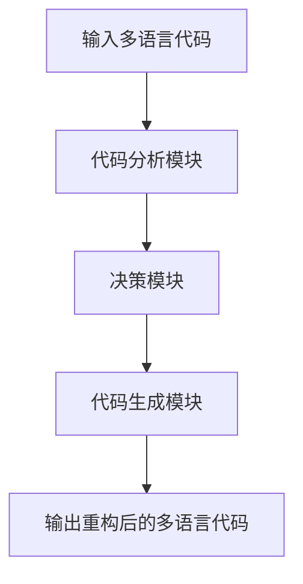

# 开发具有多语言代码重构能力的AI Agent

> 关键词：AI Agent、多语言代码重构、代码分析、代码转换、人工智能

> 摘要：本文旨在深入探讨开发具有多语言代码重构能力的AI Agent的相关技术和方法。随着软件开发的发展，代码重构在提高代码质量、可维护性和可扩展性方面变得至关重要。多语言代码重构更是面临着不同编程语言语法、语义和编程范式的挑战。通过构建这样的AI Agent，能够自动化地处理多种编程语言的代码重构任务，提高开发效率。文章将详细介绍核心概念、算法原理、数学模型、项目实战案例以及实际应用场景等内容，并对未来发展趋势与挑战进行总结。

## 1. 背景介绍 
### 1.1 目的和范围
随着软件系统的不断发展和演进，代码库往往会变得庞大且复杂，存在代码重复、结构混乱、可维护性差等问题。代码重构是解决这些问题的有效手段，它可以改善代码的内部结构，而不改变其外部行为。然而，现代软件开发中常常涉及多种编程语言，手动进行多语言代码重构不仅耗时费力，还容易引入错误。因此，开发具有多语言代码重构能力的AI Agent具有重要的现实意义。

本文章的范围涵盖了从AI Agent的核心概念到具体实现的各个方面，包括核心算法原理、数学模型、项目实战案例以及实际应用场景等。旨在为开发者提供一个全面的指导，帮助他们理解和开发具有多语言代码重构能力的AI Agent。

### 1.2 预期读者
本文的预期读者主要包括软件开发人员、软件架构师、人工智能研究者以及对代码重构和AI Agent感兴趣的技术爱好者。对于软件开发人员来说，了解如何开发这样的AI Agent可以提高他们的开发效率和代码质量；软件架构师可以从中获取关于代码重构策略和系统设计的灵感；人工智能研究者可以关注其中的算法和模型；而技术爱好者则可以通过阅读本文深入了解多语言代码重构和AI Agent的相关知识。

### 1.3 文档结构概述
本文将按照以下结构进行组织：
- 核心概念与联系：介绍AI Agent、多语言代码重构等核心概念，并阐述它们之间的联系。
- 核心算法原理 & 具体操作步骤：详细讲解实现多语言代码重构的核心算法，并给出具体的操作步骤，同时使用Python源代码进行阐述。
- 数学模型和公式 & 详细讲解 & 举例说明：建立相关的数学模型，给出相应的公式，并通过具体的例子进行说明。
- 项目实战：代码实际案例和详细解释说明：通过一个实际的项目案例，展示如何开发具有多语言代码重构能力的AI Agent，包括开发环境搭建、源代码实现和代码解读。
- 实际应用场景：介绍多语言代码重构AI Agent的实际应用场景。
- 工具和资源推荐：推荐相关的学习资源、开发工具框架和论文著作。
- 总结：未来发展趋势与挑战：对多语言代码重构AI Agent的未来发展趋势进行展望，并分析可能面临的挑战。
- 附录：常见问题与解答：解答读者可能遇到的常见问题。
- 扩展阅读 & 参考资料：提供相关的扩展阅读材料和参考资料。

### 1.4 术语表
#### 1.4.1 核心术语定义
- **AI Agent**：人工智能代理，是一种能够感知环境、进行决策并采取行动以实现特定目标的智能实体。在本文中，AI Agent用于执行多语言代码重构任务。
- **代码重构**：对软件代码进行修改，以改善其内部结构，而不改变其外部行为。代码重构的目的是提高代码的可维护性、可读性和可扩展性。
- **多语言代码重构**：针对使用多种编程语言编写的代码进行重构的过程。由于不同编程语言具有不同的语法、语义和编程范式，多语言代码重构面临着更大的挑战。

#### 1.4.2 相关概念解释
- **抽象语法树（AST）**：是源代码语法结构的一种抽象表示。它以树状结构表示代码的语法结构，每个节点代表一个语法元素。在代码重构中，AST可以用于分析代码的结构和语义。
- **代码相似度**：用于衡量两段代码之间的相似程度。在多语言代码重构中，代码相似度可以帮助识别重复代码，从而进行重构。

#### 1.4.3 缩略词列表
- **AST**：Abstract Syntax Tree（抽象语法树）
- **ML**：Machine Learning（机器学习）
- **NLP**：Natural Language Processing（自然语言处理）

## 2. 核心概念与联系 

### 核心概念原理
#### AI Agent
AI Agent是一种能够感知环境、进行决策并采取行动以实现特定目标的智能实体。在多语言代码重构的场景中，AI Agent的主要任务是分析输入的多语言代码，识别需要重构的部分，并生成重构后的代码。它可以通过感知代码的语法、语义和结构信息，利用机器学习和自然语言处理等技术进行决策，最终输出重构后的代码。

#### 多语言代码重构
多语言代码重构是针对使用多种编程语言编写的代码进行重构的过程。由于不同编程语言具有不同的语法、语义和编程范式，多语言代码重构需要考虑更多的因素。例如，在将一段Python代码重构为Java代码时，需要考虑Python的动态类型和Java的静态类型之间的差异。

### 架构的文本示意图
```plaintext
+---------------------+
|      AI Agent       |
| +-----------------+ |
| | 代码分析模块   | |
| +-----------------+ |
| +-----------------+ |
| | 决策模块       | |
| +-----------------+ |
| +-----------------+ |
| | 代码生成模块   | |
| +-----------------+ |
+---------------------+
        |
        | 输入：多语言代码
        |
        | 输出：重构后的多语言代码
```

### Mermaid流程图


## 3. 核心算法原理 & 具体操作步骤 

### 核心算法原理
#### 代码分析算法
代码分析是多语言代码重构的第一步，其主要目的是理解代码的结构和语义。常用的代码分析算法是基于抽象语法树（AST）的分析方法。AST是源代码语法结构的一种抽象表示，它以树状结构表示代码的语法结构，每个节点代表一个语法元素。通过遍历AST，可以获取代码的各种信息，如变量声明、函数调用、控制流等。

以下是一个使用Python的`ast`模块进行简单代码分析的示例：
```python
import ast

# 示例代码
code = "def add(a, b): return a + b"

# 解析代码生成AST
tree = ast.parse(code)

# 遍历AST
class FunctionCallVisitor(ast.NodeVisitor):
    def visit_FunctionDef(self, node):
        print(f"Function name: {node.name}")
        for arg in node.args.args:
            print(f"  Argument: {arg.arg}")
        self.generic_visit(node)

visitor = FunctionCallVisitor()
visitor.visit(tree)
```
在上述代码中，首先使用`ast.parse`函数将代码解析为AST，然后定义了一个自定义的`NodeVisitor`类`FunctionCallVisitor`，用于遍历AST并打印函数名和参数信息。

#### 决策算法
决策算法用于确定代码的哪些部分需要重构以及如何重构。常用的决策算法包括基于规则的方法和基于机器学习的方法。基于规则的方法是根据预先定义的规则来判断代码是否需要重构，例如，如果代码中存在重复的代码块，则可以将其提取为一个函数。基于机器学习的方法则是通过训练模型来学习代码的重构模式，例如，可以使用深度学习模型来预测代码的可维护性，并根据预测结果进行重构。

#### 代码生成算法
代码生成算法用于根据决策结果生成重构后的代码。在多语言代码重构中，代码生成需要考虑不同编程语言的语法和语义。可以使用模板引擎来生成代码，例如，根据预定义的模板和变量替换规则，将分析和决策的结果转换为具体的代码。

### 具体操作步骤
1. **代码输入**：将需要重构的多语言代码作为输入传递给AI Agent。
2. **代码分析**：使用基于AST的分析方法对输入的代码进行分析，提取代码的结构和语义信息。
3. **决策制定**：根据代码分析的结果，使用基于规则或机器学习的方法确定代码的哪些部分需要重构以及如何重构。
4. **代码生成**：根据决策结果，使用模板引擎生成重构后的代码。
5. **代码输出**：将重构后的代码输出。

## 4. 数学模型和公式 & 详细讲解 & 举例说明 

### 代码相似度模型
代码相似度是衡量两段代码之间相似程度的指标，在多语言代码重构中，代码相似度可以帮助识别重复代码，从而进行重构。常用的代码相似度模型包括基于文本的相似度模型和基于结构的相似度模型。

#### 基于文本的相似度模型
基于文本的相似度模型是通过比较代码的文本内容来计算相似度。常用的方法是使用编辑距离（Levenshtein距离）。编辑距离是指将一个字符串转换为另一个字符串所需的最少编辑操作次数（插入、删除、替换）。

设两个字符串 $s_1$ 和 $s_2$ 的长度分别为 $m$ 和 $n$，编辑距离 $d(i, j)$ 表示 $s_1$ 的前 $i$ 个字符和 $s_2$ 的前 $j$ 个字符之间的编辑距离，则有以下递推公式：
$$
d(i, j) = 
\begin{cases}
i & \text{if } j = 0 \\
j & \text{if } i = 0 \\
d(i - 1, j - 1) & \text{if } s_1[i - 1] = s_2[j - 1] \\
1 + \min(d(i - 1, j), d(i, j - 1), d(i - 1, j - 1)) & \text{otherwise}
\end{cases}
$$

以下是一个使用Python实现编辑距离计算的示例：
```python
def levenshtein_distance(s1, s2):
    m = len(s1)
    n = len(s2)
    dp = [[0] * (n + 1) for _ in range(m + 1)]

    for i in range(m + 1):
        for j in range(n + 1):
            if i == 0:
                dp[i][j] = j
            elif j == 0:
                dp[i][j] = i
            elif s1[i - 1] == s2[j - 1]:
                dp[i][j] = dp[i - 1][j - 1]
            else:
                dp[i][j] = 1 + min(dp[i - 1][j], dp[i][j - 1], dp[i - 1][j - 1])

    return dp[m][n]

s1 = "kitten"
s2 = "sitting"
distance = levenshtein_distance(s1, s2)
print(f"Levenshtein distance between '{s1}' and '{s2}': {distance}")
```

#### 基于结构的相似度模型
基于结构的相似度模型是通过比较代码的抽象语法树（AST）来计算相似度。可以使用树编辑距离来衡量两个AST之间的相似度。树编辑距离是指将一个树转换为另一个树所需的最少编辑操作次数（插入、删除、替换节点）。

### 代码可维护性模型
代码可维护性是衡量代码易于理解、修改和扩展的程度的指标。可以使用机器学习模型来预测代码的可维护性，例如，使用支持向量机（SVM）或神经网络。

设 $X$ 是代码的特征向量，$y$ 是代码的可维护性标签（例如，高可维护性或低可维护性），则可以使用以下的机器学习模型来进行训练：
$$
\hat{y} = f(X; \theta)
$$
其中，$f$ 是模型函数，$\theta$ 是模型参数。通过最小化损失函数 $L(y, \hat{y})$ 来训练模型，例如，使用交叉熵损失函数：
$$
L(y, \hat{y}) = - \sum_{i = 1}^{n} y_i \log(\hat{y}_i) + (1 - y_i) \log(1 - \hat{y}_i)
$$

## 5. 项目实战：代码实际案例和详细解释说明 

### 5.1  开发环境搭建
#### 编程语言和工具
- **Python**：作为主要的开发语言，用于实现AI Agent的各个模块。
- **pip**：Python的包管理工具，用于安装所需的库。

#### 安装依赖库
- **ast**：Python的内置模块，用于解析和分析代码的抽象语法树。
- **scikit-learn**：用于机器学习模型的训练和评估。
- **Jinja2**：用于代码生成的模板引擎。

可以使用以下命令安装这些库：
```sh
pip install scikit-learn Jinja2
```

### 5.2  源代码详细实现和代码解读
以下是一个简单的具有多语言代码重构能力的AI Agent的实现示例：
```python
import ast
from sklearn.svm import SVC
from jinja2 import Template

# 代码分析模块
def analyze_code(code):
    tree = ast.parse(code)
    # 这里可以进行更复杂的代码分析，例如提取函数名、变量名等
    functions = []
    for node in ast.walk(tree):
        if isinstance(node, ast.FunctionDef):
            functions.append(node.name)
    return functions

# 决策模块
def make_decision(functions):
    # 这里简单示例使用一个基于规则的决策，实际中可以使用机器学习模型
    if len(functions) > 1:
        return "Extract common code into a new function"
    else:
        return "No need for refactoring"

# 代码生成模块
def generate_code(decision):
    # 这里使用Jinja2模板引擎生成代码
    template = Template("{{ decision }}")
    return template.render(decision=decision)

# 主函数
def main():
    code = "def add(a, b): return a + b; def sub(a, b): return a - b"
    functions = analyze_code(code)
    decision = make_decision(functions)
    refactored_code = generate_code(decision)
    print(f"Original code: {code}")
    print(f"Decision: {decision}")
    print(f"Refactored code: {refactored_code}")

if __name__ == "__main__":
    main()
```
### 代码解读与分析
- **代码分析模块**：`analyze_code` 函数使用 `ast.parse` 函数将输入的代码解析为AST，然后遍历AST，提取所有的函数名。
- **决策模块**：`make_decision` 函数根据代码分析的结果，使用一个简单的规则来判断是否需要重构。如果代码中包含多个函数，则建议将公共代码提取为一个新的函数；否则，认为不需要重构。
- **代码生成模块**：`generate_code` 函数使用Jinja2模板引擎根据决策结果生成重构后的代码。
- **主函数**：`main` 函数将输入的代码传递给代码分析模块，根据分析结果调用决策模块，最后根据决策结果调用代码生成模块，输出重构后的代码。

## 6. 实际应用场景 
### 大型软件项目维护
在大型软件项目中，代码库通常包含多种编程语言的代码，随着项目的不断发展，代码会变得越来越复杂，难以维护。具有多语言代码重构能力的AI Agent可以帮助开发团队自动化地进行代码重构，提高代码的可维护性和可扩展性。

### 代码迁移和兼容性修复
当需要将代码从一种编程语言迁移到另一种编程语言，或者修复不同编程语言之间的兼容性问题时，AI Agent可以分析原代码的结构和语义，自动生成目标语言的代码，从而减少人工迁移和修复的工作量。

### 代码审查和优化
在代码审查过程中，AI Agent可以帮助审查人员快速发现代码中存在的问题，如重复代码、低效率的算法等，并提供重构建议，从而提高代码的质量。

## 7. 工具和资源推荐
### 7.1 学习资源推荐
#### 7.1.1 书籍推荐
- 《重构：改善既有代码的设计》：这本书是代码重构领域的经典著作，详细介绍了代码重构的原则、方法和技巧。
- 《Python机器学习》：全面介绍了Python在机器学习领域的应用，包括各种机器学习算法的原理和实现。

#### 7.1.2 在线课程
- Coursera上的“机器学习”课程：由斯坦福大学教授Andrew Ng讲授，是机器学习领域的经典课程。
- edX上的“Python for Data Science”课程：介绍了Python在数据科学领域的应用，包括数据处理、数据分析和机器学习等方面。

#### 7.1.3 技术博客和网站
- Medium：上面有很多关于代码重构、人工智能和软件开发的技术文章。
- Stack Overflow：是一个程序员社区，上面有很多关于代码问题的讨论和解决方案。

### 7.2 开发工具框架推荐
#### 7.2.1 IDE和编辑器
- PyCharm：是一款专门为Python开发设计的集成开发环境，具有强大的代码编辑、调试和重构功能。
- Visual Studio Code：是一款轻量级的代码编辑器，支持多种编程语言，并且有丰富的插件可以扩展其功能。

#### 7.2.2 调试和性能分析工具
- PDB：Python的内置调试器，可以帮助开发者调试Python代码。
- cProfile：Python的性能分析工具，可以帮助开发者分析代码的性能瓶颈。

#### 7.2.3 相关框架和库
- TensorFlow：是一个开源的机器学习框架，可用于构建和训练各种机器学习模型。
- PyTorch：也是一个开源的机器学习框架，具有动态图和易于使用的特点。

### 7.3 相关论文著作推荐
#### 7.3.1 经典论文
- “Refactoring to Patterns”：介绍了如何将代码重构为设计模式，提高代码的可维护性和可扩展性。
- “Automated Software Refactoring: A Roadmap”：探讨了自动化软件重构的发展趋势和挑战。

#### 7.3.2 最新研究成果
- 可以关注顶级计算机科学会议（如ICSE、FSE等）上发表的关于代码重构和人工智能的最新研究成果。

#### 7.3.3 应用案例分析
- 一些开源项目的文档和博客文章中会分享代码重构的应用案例，可以从中学习实际的重构经验。

## 8. 总结：未来发展趋势与挑战
### 未来发展趋势
- **智能化程度不断提高**：随着人工智能技术的不断发展，AI Agent的智能化程度将不断提高，能够更加准确地分析代码的结构和语义，做出更合理的重构决策。
- **支持更多编程语言**：未来的AI Agent将支持更多的编程语言，包括新兴的编程语言和领域特定语言，从而满足更广泛的软件开发需求。
- **与开发工具深度集成**：AI Agent将与各种开发工具（如IDE、版本控制系统等）深度集成，实现无缝的代码重构体验。

### 挑战
- **语义理解的准确性**：不同编程语言的语法和语义存在差异，准确理解代码的语义是多语言代码重构的关键挑战之一。
- **机器学习模型的训练和优化**：基于机器学习的决策算法需要大量的训练数据和复杂的模型优化，如何获取高质量的训练数据和优化模型是一个挑战。
- **代码安全性**：在代码重构过程中，需要确保重构后的代码不会引入新的安全漏洞，这需要在AI Agent的设计和实现中考虑代码安全性。

## 9. 附录：常见问题与解答
### 问题1：AI Agent能否完全替代人工进行代码重构？
答：目前来看，AI Agent还不能完全替代人工进行代码重构。虽然AI Agent可以自动化地完成一些简单的代码重构任务，但在处理复杂的业务逻辑和设计问题时，还需要人工的参与和判断。

### 问题2：如何确保AI Agent生成的重构代码的质量？
答：可以通过以下方法确保AI Agent生成的重构代码的质量：
- 使用严格的测试用例对重构后的代码进行测试，确保其功能的正确性。
- 对AI Agent进行持续的训练和优化，提高其决策的准确性和代码生成的质量。
- 人工审查AI Agent生成的重构代码，确保其符合代码规范和设计原则。

### 问题3：AI Agent是否支持所有的编程语言？
答：目前的AI Agent通常支持常见的编程语言，如Python、Java、C++等。但对于一些新兴的编程语言和领域特定语言，可能需要进行额外的开发和适配。

## 10. 扩展阅读 & 参考资料
- Fowler, M. (2018). Refactoring: Improving the Design of Existing Code. Addison-Wesley Professional.
- Géron, A. (2019). Hands-On Machine Learning with Scikit-Learn, Keras, and TensorFlow: Concepts, Tools, and Techniques to Build Intelligent Systems. O'Reilly Media.
- Coursera: Machine Learning by Andrew Ng. https://www.coursera.org/learn/machine-learning
- edX: Python for Data Science. https://www.edx.org/course/python-for-data-science

作者：AI天才研究院/AI Genius Institute & 禅与计算机程序设计艺术 /Zen And The Art of Computer Programming