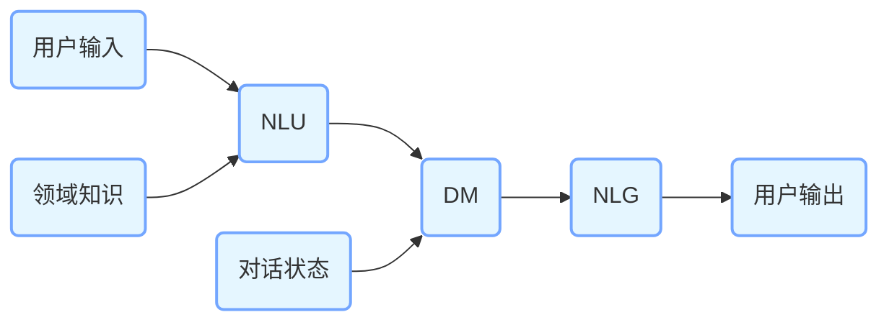

# 开发具有自然语言对话能力的AI Agent

> 关键词：AI Agent、自然语言对话、深度学习、语言模型、对话管理、自然语言处理、人工智能

> 摘要：本文围绕开发具有自然语言对话能力的AI Agent展开，详细阐述了相关的核心概念、算法原理、数学模型等内容。通过Python代码示例深入剖析了实现自然语言对话的具体操作步骤，同时给出项目实战案例，包括开发环境搭建、源代码实现与解读。探讨了AI Agent在多个领域的实际应用场景，推荐了学习资源、开发工具框架以及相关论文著作。最后总结了未来发展趋势与挑战，并提供常见问题解答和扩展阅读参考资料，旨在为开发者提供全面、深入的技术指导，助力开发出高效、智能的具有自然语言对话能力的AI Agent。

## 1. 背景介绍 
### 1.1 目的和范围
随着人工智能技术的飞速发展，自然语言处理领域取得了显著的进步。开发具有自然语言对话能力的AI Agent具有重要的现实意义和广泛的应用前景。其目的在于让计算机能够理解人类的自然语言，并以自然、流畅的方式与人类进行交互，为用户提供智能的服务和帮助。本文章的范围涵盖了从AI Agent的核心概念、算法原理到实际开发应用的全过程，包括相关的理论知识、技术实现细节以及实践案例分析。

### 1.2 预期读者
本文预期读者主要包括人工智能领域的开发者、研究人员，对自然语言处理和AI Agent技术感兴趣的程序员、软件架构师，以及希望了解该领域技术原理和应用的学生、爱好者等。

### 1.3 文档结构概述
本文首先介绍背景信息，包括目的、预期读者和文档结构。接着阐述核心概念与联系，展示相关的原理和架构示意图及流程图。然后详细讲解核心算法原理和具体操作步骤，结合Python代码进行说明。之后介绍数学模型和公式，并举例说明。通过项目实战部分展示代码实际案例及详细解释。探讨实际应用场景，推荐相关的工具和资源。最后总结未来发展趋势与挑战，提供常见问题解答和扩展阅读参考资料。

### 1.4 术语表
#### 1.4.1 核心术语定义
- **AI Agent**：即人工智能智能体，是一种能够感知环境、自主决策并采取行动以实现特定目标的智能实体。在自然语言对话场景中，它可以理解用户的语言输入并生成合适的响应。
- **自然语言对话**：指人类使用自然语言（如英语、汉语等）与计算机或其他智能设备进行的交流过程，涉及语言的理解、生成和对话的管理。
- **语言模型**：是一种用于计算语言序列概率的模型，能够预测下一个词或句子的可能性，是自然语言处理中的重要基础。
- **对话管理**：负责管理对话的流程和状态，包括跟踪对话历史、决定何时采取何种行动以及如何生成合适的回复。

#### 1.4.2 相关概念解释
- **自然语言处理（NLP）**：是人工智能的一个子领域，旨在让计算机能够处理、理解和生成人类语言。它涵盖了多个任务，如文本分类、情感分析、机器翻译等，在开发具有自然语言对话能力的AI Agent中起着关键作用。
- **深度学习**：是一种基于人工神经网络的机器学习方法，通过多层神经网络对数据进行学习和表示，在自然语言处理任务中取得了很好的效果，许多先进的语言模型都是基于深度学习技术构建的。

#### 1.4.3 缩略词列表
- **NLP**：Natural Language Processing（自然语言处理）
- **RNN**：Recurrent Neural Network（循环神经网络）
- **LSTM**：Long Short - Term Memory（长短期记忆网络）
- **GRU**：Gated Recurrent Unit（门控循环单元）
- **Transformer**：一种基于注意力机制的神经网络架构

## 2. 核心概念与联系 
### 核心概念原理
具有自然语言对话能力的AI Agent主要涉及以下几个核心概念及其原理：

#### 自然语言理解（NLU）
自然语言理解是AI Agent理解用户输入的自然语言文本的过程。它包括多个子任务，如词法分析、句法分析、语义分析等。词法分析负责将文本分割成单词或词元，句法分析确定句子的语法结构，语义分析则理解句子的含义。例如，对于句子“我想要订一张明天去北京的机票”，NLU系统需要识别出“订机票”这个意图，以及“明天”“北京”等关键信息。

#### 对话管理（DM）
对话管理负责管理整个对话的流程和状态。它根据NLU的输出和当前的对话状态，决定采取何种行动，如回答用户问题、请求更多信息或执行特定任务。对话管理需要维护一个对话状态表示，记录对话的历史和当前状态。例如，在用户询问机票信息后，对话管理系统可能会询问用户的出发地、目的地、出行时间等信息，以完成机票预订任务。

#### 自然语言生成（NLG）
自然语言生成是AI Agent根据对话管理的决策生成自然语言回复的过程。它需要根据任务和用户的需求，生成合适、自然、流畅的文本。NLG可以基于规则、模板或机器学习方法实现。例如，根据对话管理的决策，NLG系统可能会生成“好的，我将为您查询明天从[出发地]到北京的机票信息，请稍等”这样的回复。

### 架构的文本示意图
```plaintext
用户输入 ---> 自然语言理解（NLU） ---> 对话管理（DM） ---> 自然语言生成（NLG） ---> 用户输出
                    |                      |
                    |                      |
              领域知识               对话状态
```

### Mermaid流程图


## 3. 核心算法原理 & 具体操作步骤 
### 核心算法原理
#### 基于深度学习的语言模型
在自然语言处理中，深度学习语言模型是实现自然语言理解和生成的重要工具。常见的深度学习语言模型包括循环神经网络（RNN）及其变体长短期记忆网络（LSTM）、门控循环单元（GRU），以及Transformer架构。

##### RNN
RNN是一种能够处理序列数据的神经网络，它通过在时间步上共享参数来捕捉序列中的上下文信息。RNN的基本结构如下：

```python
import torch
import torch.nn as nn

class SimpleRNN(nn.Module):
    def __init__(self, input_size, hidden_size, output_size):
        super(SimpleRNN, self).__init__()
        self.rnn = nn.RNN(input_size, hidden_size, batch_first=True)
        self.fc = nn.Linear(hidden_size, output_size)

    def forward(self, x):
        out, _ = self.rnn(x)
        out = self.fc(out[:, -1, :])
        return out
```

##### LSTM
LSTM是为了解决RNN的梯度消失问题而提出的，它通过引入门控机制来控制信息的流动。LSTM的核心组件包括输入门、遗忘门和输出门。

```python
class SimpleLSTM(nn.Module):
    def __init__(self, input_size, hidden_size, output_size):
        super(SimpleLSTM, self).__init__()
        self.lstm = nn.LSTM(input_size, hidden_size, batch_first=True)
        self.fc = nn.Linear(hidden_size, output_size)

    def forward(self, x):
        out, _ = self.lstm(x)
        out = self.fc(out[:, -1, :])
        return out
```

##### Transformer
Transformer是一种基于注意力机制的神经网络架构，它摒弃了传统的循环结构，能够并行处理序列数据。Transformer的核心组件包括多头注意力机制和前馈神经网络。

```python
import torch
import torch.nn as nn
import torch.nn.functional as F

class ScaledDotProductAttention(nn.Module):
    def __init__(self, d_k):
        super(ScaledDotProductAttention, self).__init__()
        self.d_k = d_k

    def forward(self, q, k, v, mask=None):
        attn_scores = torch.matmul(q, k.transpose(-2, -1)) / torch.sqrt(torch.tensor(self.d_k, dtype=torch.float32))
        if mask is not None:
            attn_scores = attn_scores.masked_fill(mask == 0, -1e9)
        attn_probs = F.softmax(attn_scores, dim=-1)
        output = torch.matmul(attn_probs, v)
        return output

class MultiHeadAttention(nn.Module):
    def __init__(self, d_model, num_heads):
        super(MultiHeadAttention, self).__init__()
        self.d_model = d_model
        self.num_heads = num_heads
        self.d_k = d_model // num_heads

        self.W_q = nn.Linear(d_model, d_model)
        self.W_k = nn.Linear(d_model, d_model)
        self.W_v = nn.Linear(d_model, d_model)
        self.W_o = nn.Linear(d_model, d_model)

        self.attention = ScaledDotProductAttention(self.d_k)

    def forward(self, q, k, v, mask=None):
        batch_size = q.size(0)

        Q = self.W_q(q).view(batch_size, -1, self.num_heads, self.d_k).transpose(1, 2)
        K = self.W_k(k).view(batch_size, -1, self.num_heads, self.d_k).transpose(1, 2)
        V = self.W_v(v).view(batch_size, -1, self.num_heads, self.d_k).transpose(1, 2)

        if mask is not None:
            mask = mask.unsqueeze(1)

        attn_output = self.attention(Q, K, V, mask)
        attn_output = attn_output.transpose(1, 2).contiguous().view(batch_size, -1, self.d_model)
        output = self.W_o(attn_output)
        return output
```

### 具体操作步骤
#### 数据预处理
在训练语言模型之前，需要对数据进行预处理。这包括文本清洗、分词、构建词汇表、将文本转换为数字表示等步骤。

```python
import re
import torch
from torchtext.data.utils import get_tokenizer
from torchtext.vocab import build_vocab_from_iterator

# 文本清洗
def clean_text(text):
    text = re.sub(r'[^\w\s]', '', text)
    text = text.lower()
    return text

# 分词器
tokenizer = get_tokenizer('basic_english')

# 示例数据
data = ["I like to play football", "She is reading a book"]

# 清洗数据
cleaned_data = [clean_text(text) for text in data]

# 构建词汇表
def yield_tokens(data_iter):
    for text in data_iter:
        yield tokenizer(text)

vocab = build_vocab_from_iterator(yield_tokens(cleaned_data), specials=['<unk>'])
vocab.set_default_index(vocab['<unk>'])

# 将文本转换为数字表示
def text_pipeline(x):
    return [vocab[token] for token in tokenizer(clean_text(x))]

numericalized_data = [text_pipeline(text) for text in data]
```

#### 模型训练
使用预处理后的数据对语言模型进行训练。这里以简单的LSTM模型为例。

```python
import torch.optim as optim

# 定义模型参数
input_size = len(vocab)
hidden_size = 128
output_size = len(vocab)

# 初始化模型
model = SimpleLSTM(input_size, hidden_size, output_size)

# 定义损失函数和优化器
criterion = nn.CrossEntropyLoss()
optimizer = optim.Adam(model.parameters(), lr=0.001)

# 训练模型
num_epochs = 10
for epoch in range(num_epochs):
    total_loss = 0
    for numericalized_text in numericalized_data:
        input_tensor = torch.tensor(numericalized_text[:-1]).unsqueeze(0)
        target_tensor = torch.tensor(numericalized_text[1:])

        optimizer.zero_grad()
        output = model(input_tensor)
        loss = criterion(output, target_tensor)
        loss.backward()
        optimizer.step()
        total_loss += loss.item()
    print(f'Epoch {epoch + 1}/{num_epochs}, Loss: {total_loss / len(numericalized_data)}')
```

#### 模型推理
训练好模型后，可以使用它进行推理，生成自然语言回复。

```python
def generate_text(model, input_text, max_length=20):
    model.eval()
    input_tensor = torch.tensor(text_pipeline(input_text)).unsqueeze(0)
    output_text = input_text

    for _ in range(max_length):
        output = model(input_tensor)
        _, predicted = torch.max(output, 1)
        predicted_word = vocab.lookup_token(predicted.item())
        output_text += ' ' + predicted_word
        input_tensor = torch.cat((input_tensor, predicted.unsqueeze(0).unsqueeze(0)), dim=1)

    return output_text

input_text = "I like"
generated_text = generate_text(model, input_text)
print(generated_text)
```

## 4. 数学模型和公式 & 详细讲解 & 举例说明 
### 语言模型的数学基础
语言模型的目标是计算一个语言序列 $w_1, w_2, \cdots, w_T$ 的概率 $P(w_1, w_2, \cdots, w_T)$。根据链式法则，这个概率可以分解为：

$$P(w_1, w_2, \cdots, w_T) = \prod_{t=1}^{T} P(w_t | w_1, w_2, \cdots, w_{t-1})$$

### n - 元语法模型
n - 元语法模型是一种简单的语言模型，它假设一个词的概率只依赖于前面的 $n - 1$ 个词。即：

$$P(w_t | w_1, w_2, \cdots, w_{t-1}) \approx P(w_t | w_{t - n + 1}, \cdots, w_{t-1})$$

例如，对于二元语法模型（$n = 2$），有：

$$P(w_t | w_1, w_2, \cdots, w_{t-1}) \approx P(w_t | w_{t - 1})$$

二元语法模型的参数可以通过最大似然估计来计算：

$$P(w_t | w_{t - 1}) = \frac{C(w_{t - 1}, w_t)}{C(w_{t - 1})}$$

其中 $C(w_{t - 1}, w_t)$ 是词对 $(w_{t - 1}, w_t)$ 在训练数据中出现的次数，$C(w_{t - 1})$ 是词 $w_{t - 1}$ 在训练数据中出现的次数。

### 深度学习语言模型的损失函数
深度学习语言模型通常使用交叉熵损失函数来训练。对于一个给定的输入序列 $x$ 和目标序列 $y$，交叉熵损失函数定义为：

$$L = - \sum_{i=1}^{N} \log P(y_i | x)$$

其中 $N$ 是序列的长度，$P(y_i | x)$ 是模型预测 $y_i$ 的概率。

### 举例说明
假设有一个简单的训练数据集：["I like to play football", "She is reading a book"]。我们要计算二元语法模型中 $P(play | to)$ 的概率。

首先，统计 $C(to, play)$ 和 $C(to)$ 的值。在数据集中，$C(to, play) = 1$，$C(to) = 1$，则 $P(play | to) = \frac{1}{1} = 1$。

对于深度学习语言模型，假设模型预测的概率分布为 $P = [0.1, 0.2, 0.3, 0.4]$，目标标签为 $y = [0, 0, 0, 1]$，则交叉熵损失为：

$$L = - \log(0.4) \approx 0.916$$

## 5. 项目实战：代码实际案例和详细解释说明 
### 5.1  开发环境搭建
#### 安装Python
首先需要安装Python，建议使用Python 3.7及以上版本。可以从Python官方网站（https://www.python.org/downloads/） 下载并安装。

#### 安装深度学习框架
我们使用PyTorch作为深度学习框架。可以使用以下命令安装PyTorch：

```sh
pip install torch torchvision
```

#### 安装其他依赖库
还需要安装一些其他的依赖库，如`torchtext`、`numpy`等。可以使用以下命令安装：

```sh
pip install torchtext numpy
```

### 5.2  源代码详细实现和代码解读
#### 定义数据集类
```python
import torch
from torch.utils.data import Dataset

class TextDataset(Dataset):
    def __init__(self, data, vocab, seq_length):
        self.data = data
        self.vocab = vocab
        self.seq_length = seq_length

    def __len__(self):
        return len(self.data)

    def __getitem__(self, idx):
        text = self.data[idx]
        numericalized_text = [self.vocab[token]