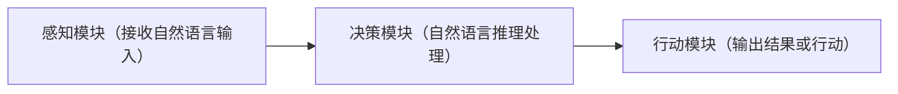

# 开发具有自然语言推理能力的AI Agent

> 关键词：自然语言推理、AI Agent、深度学习、自然语言处理、逻辑推理、知识图谱、强化学习

> 摘要：本文聚焦于开发具有自然语言推理能力的AI Agent。详细阐述了自然语言推理及AI Agent的核心概念与联系，介绍了实现自然语言推理的核心算法原理及具体操作步骤，给出了相关的数学模型和公式并举例说明。通过项目实战展示了代码实现和解读，探讨了其实际应用场景。同时推荐了学习资源、开发工具框架以及相关论文著作。最后总结了未来发展趋势与挑战，并对常见问题进行了解答，为开发具有自然语言推理能力的AI Agent提供了全面且深入的技术指导。

## 1. 背景介绍 
### 1.1 目的和范围
随着人工智能技术的飞速发展，自然语言处理领域取得了显著的进步。开发具有自然语言推理能力的AI Agent具有重要的现实意义。其目的在于让AI Agent能够理解人类的自然语言表述，并进行逻辑推理，从而更好地与人类进行交互，完成各种复杂的任务，如智能问答、文本理解、决策支持等。本文的范围涵盖了从核心概念的介绍，到算法原理的讲解，再到实际项目的开发，以及相关应用场景、工具资源等方面，全面深入地探讨开发具有自然语言推理能力的AI Agent的各个环节。

### 1.2 预期读者
本文预期读者包括人工智能领域的研究者、开发者、学生，以及对自然语言处理和AI Agent技术感兴趣的相关人员。对于希望深入了解自然语言推理技术并将其应用于实际开发的专业人士，本文提供了系统的技术指导和实践案例；对于初学者，本文从基础概念入手，逐步引导其了解该领域的核心知识和技术。

### 1.3 文档结构概述
本文将按照以下结构进行阐述：首先介绍自然语言推理和AI Agent的核心概念及它们之间的联系；接着详细讲解实现自然语言推理的核心算法原理和具体操作步骤，并给出相关的Python代码示例；然后介绍自然语言推理中的数学模型和公式，并举例说明；通过项目实战展示如何开发一个具有自然语言推理能力的AI Agent，包括开发环境搭建、源代码实现和代码解读；探讨该技术的实际应用场景；推荐相关的学习资源、开发工具框架和论文著作；最后总结未来发展趋势与挑战，解答常见问题，并提供扩展阅读和参考资料。

### 1.4 术语表
#### 1.4.1 核心术语定义
- **自然语言推理（Natural Language Inference, NLI）**：是指给定一对前提和假设文本，判断假设是否可以从前提中合理推断出来的任务。通常有三种结果：蕴含（假设可以从前提推出）、矛盾（假设与前提矛盾）、中性（假设与前提无关）。
- **AI Agent**：是一种能够感知环境、进行决策并采取行动以实现特定目标的人工智能实体。它可以接收自然语言输入，并利用自然语言推理能力来理解和处理这些输入。
- **知识图谱（Knowledge Graph）**：是一种以图的形式表示实体及其之间关系的知识库，可用于为AI Agent提供额外的背景知识，辅助自然语言推理。

#### 1.4.2 相关概念解释
- **深度学习（Deep Learning）**：是机器学习的一个分支领域，它通过构建多层神经网络模型，自动从大量数据中学习特征和模式，在自然语言推理中被广泛应用。
- **预训练模型（Pretrained Model）**：是在大规模数据集上进行无监督学习训练得到的模型，如BERT、GPT等。这些模型可以学习到通用的语言知识和特征，在自然语言推理任务中可以作为基础模型进行微调。

#### 1.4.3 缩略词列表
- **NLI**：Natural Language Inference（自然语言推理）
- **BERT**：Bidirectional Encoder Representations from Transformers（基于Transformer的双向编码器表示）
- **GPT**：Generative Pretrained Transformer（生成式预训练变换器）

## 2. 核心概念与联系 
### 自然语言推理原理
自然语言推理的核心目标是判断两个文本之间的逻辑关系。其原理基于对文本语义的理解和逻辑规则的应用。在自然语言中，语义是复杂多样的，同一个词语在不同的语境中可能有不同的含义。因此，要进行准确的自然语言推理，需要对文本进行深入的语义分析。

例如，对于前提“所有的猫都会抓老鼠”和假设“这只猫会抓老鼠”，我们可以通过语义理解和逻辑推理得出假设是可以从前提中蕴含的。在实际应用中，自然语言推理需要处理各种复杂的语言现象，如词汇歧义、语法结构变化等。

### AI Agent架构
AI Agent通常由感知模块、决策模块和行动模块组成。感知模块负责接收外部环境的信息，在自然语言推理场景中，主要是接收自然语言文本输入。决策模块根据感知到的信息进行分析和推理，利用自然语言推理技术判断文本之间的逻辑关系，并做出相应的决策。行动模块根据决策结果采取具体的行动，如输出回答、执行任务等。

以下是AI Agent架构的文本示意图：

```plaintext
+---------------------+
|      感知模块       |
| （接收自然语言输入） |
+---------------------+
         |
         v
+---------------------+
|      决策模块       |
| （自然语言推理处理） |
+---------------------+
         |
         v
+---------------------+
|      行动模块       |
| （输出结果或行动）  |
+---------------------+
```

### Mermaid流程图


### 自然语言推理与AI Agent的联系
自然语言推理是AI Agent实现智能交互的关键能力之一。通过自然语言推理，AI Agent能够理解用户输入的自然语言文本的含义和逻辑关系，从而做出准确的决策和响应。例如，在智能客服场景中，AI Agent可以利用自然语言推理技术理解用户的问题，并根据知识库和逻辑规则给出合理的回答。同时，AI Agent的决策和行动也可以为自然语言推理提供反馈，进一步优化推理模型。

## 3. 核心算法原理 & 具体操作步骤 
### 基于深度学习的自然语言推理算法
在深度学习中，基于Transformer架构的模型在自然语言推理任务中取得了很好的效果。下面以BERT模型为例，介绍其在自然语言推理中的应用原理和具体操作步骤。

#### 原理
BERT模型是一种双向编码器表示模型，它通过在大规模文本数据上进行无监督学习，学习到了丰富的语言知识和特征。在自然语言推理任务中，将前提和假设文本拼接在一起作为输入，经过BERT模型的编码后，得到文本的向量表示。然后通过一个全连接层将向量表示映射到分类空间，判断前提和假设之间的逻辑关系（蕴含、矛盾、中性）。

#### 具体操作步骤
1. **数据预处理**：将原始的文本数据进行清洗、分词等处理，转换为适合模型输入的格式。例如，使用BERT的分词器将文本分词，并添加特殊标记（如[CLS]、[SEP]）。
2. **模型加载**：加载预训练的BERT模型。可以使用Hugging Face的Transformers库来方便地加载和使用预训练模型。
3. **模型微调**：在自然语言推理数据集上对BERT模型进行微调。定义损失函数（如交叉熵损失）和优化器（如Adam优化器），通过反向传播更新模型参数。
4. **推理阶段**：将新的前提和假设文本输入到微调后的模型中，得到推理结果。

#### Python代码示例
```python
import torch
from transformers import BertTokenizer, BertForSequenceClassification

# 数据预处理
tokenizer = BertTokenizer.from_pretrained('bert-base-uncased')
premise = "All cats can catch mice."
hypothesis = "This cat can catch mice."
inputs = tokenizer(premise, hypothesis, return_tensors='pt')

# 模型加载
model = BertForSequenceClassification.from_pretrained('bert-base-uncased', num_labels=3)

# 推理阶段
with torch.no_grad():
    outputs = model(**inputs)
    logits = outputs.logits
    predicted_class_id = torch.argmax(logits, dim=-1).item()

# 结果映射
label_map = {0: '蕴含', 1: '矛盾', 2: '中性'}
result = label_map[predicted_class_id]
print(f"推理结果: {result}")
```

### 具体操作步骤总结
1. 数据准备：收集和整理自然语言推理数据集，进行数据预处理。
2. 模型选择：选择合适的预训练模型，如BERT、RoBERTa等。
3. 模型微调：在数据集上对预训练模型进行微调，调整模型参数以适应自然语言推理任务。
4. 模型评估：使用测试数据集对微调后的模型进行评估，计算准确率、召回率等指标。
5. 部署和应用：将训练好的模型部署到实际应用中，实现自然语言推理功能。

## 4. 数学模型和公式 & 详细讲解 & 举例说明 
### 交叉熵损失函数
在自然语言推理任务中，通常使用交叉熵损失函数来衡量模型预测结果与真实标签之间的差异。交叉熵损失函数的公式如下：

$$
H(p, q) = -\sum_{i=1}^{C} p_i \log(q_i)
$$

其中，$p$ 是真实标签的概率分布，$q$ 是模型预测的概率分布，$C$ 是类别数（在自然语言推理中，$C = 3$，分别对应蕴含、矛盾、中性）。

### 详细讲解
交叉熵损失函数的核心思想是，当模型预测的概率分布与真实标签的概率分布越接近时，损失值越小；反之，损失值越大。在训练过程中，通过最小化交叉熵损失函数，使模型的预测结果尽可能接近真实标签。

### 举例说明
假设在一个自然语言推理任务中，真实标签为蕴含（对应的概率分布 $p = [1, 0, 0]$），模型预测的概率分布为 $q = [0.8, 0.1, 0.1]$。则交叉熵损失为：

$$
H(p, q) = -(1 \times \log(0.8) + 0 \times \log(0.1) + 0 \times \log(0.1)) \approx 0.223
$$

### 模型输出与分类
在经过BERT模型编码和全连接层处理后，得到模型的输出 $z$，其维度为 $C$（类别数）。为了得到每个类别的概率分布 $q$，需要使用softmax函数进行归一化处理。softmax函数的公式如下：

$$
q_i = \frac{e^{z_i}}{\sum_{j=1}^{C} e^{z_j}}
$$

其中，$z_i$ 是模型输出的第 $i$ 个元素。

### 举例说明
假设模型输出 $z = [2, 1, 0]$，则通过softmax函数计算得到的概率分布为：

$$
q_1 = \frac{e^2}{e^2 + e^1 + e^0} \approx 0.67
$$
$$
q_2 = \frac{e^1}{e^2 + e^1 + e^0} \approx 0.24
$$
$$
q_3 = \frac{e^0}{e^2 + e^1 + e^0} \approx 0.09
$$

这样就得到了模型对每个类别的预测概率。

## 5. 项目实战：代码实际案例和详细解释说明 
### 5.1  开发环境搭建
#### 安装Python
首先，确保你已经安装了Python 3.6及以上版本。可以从Python官方网站（https://www.python.org/downloads/）下载并安装。

#### 安装必要的库
使用pip命令安装以下必要的库：
```bash
pip install torch transformers numpy pandas scikit-learn
```

- `torch`：PyTorch深度学习框架，用于构建和训练模型。
- `transformers`：Hugging Face的Transformers库，提供了预训练模型和相关工具。
- `numpy`：用于数值计算。
- `pandas`：用于数据处理和分析。
- `scikit-learn`：用于模型评估和指标计算。

### 5.2  源代码详细实现和代码解读
#### 数据加载和预处理
```python
import pandas as pd
from transformers import BertTokenizer

# 加载数据集
data = pd.read_csv('nli_dataset.csv')
premises = data['premise'].tolist()
hypotheses = data['hypothesis'].tolist()
labels = data['label'].tolist()

# 数据预处理
tokenizer = BertTokenizer.from_pretrained('bert-base-uncased')
input_ids = []
attention_masks = []

for premise, hypothesis in zip(premises, hypotheses):
    encoded_dict = tokenizer.encode_plus(
                        premise, hypothesis,
                        add_special_tokens = True,
                        max_length = 128,
                        pad_to_max_length = True,
                        return_attention_mask = True,
                        return_tensors = 'pt'
                   )
    
    input_ids.append(encoded_dict['input_ids'])
    attention_masks.append(encoded_dict['attention_mask'])

input_ids = torch.cat(input_ids, dim=0)
attention_masks = torch.cat(attention_masks, dim=0)
labels = torch.tensor(labels)
```
代码解读：
- 首先使用`pandas`库加载自然语言推理数据集，将前提、假设和标签分别存储在列表中。
- 然后使用BERT的分词器对文本进行分词和编码处理，添加特殊标记，进行填充和截断操作，得到输入ID和注意力掩码。
- 最后将输入ID、注意力掩码和标签转换为PyTorch张量。

#### 模型加载和微调
```python
from transformers import BertForSequenceClassification, AdamW

# 模型加载
model = BertForSequenceClassification.from_pretrained(
    'bert-base-uncased',
    num_labels = 3,
    output_attentions = False,
    output_hidden_states = False
)

# 优化器和损失函数
optimizer = AdamW(model.parameters(), lr=2e-5)
criterion = torch.nn.CrossEntropyLoss()

# 训练循环
epochs = 3
for epoch in range(epochs):
    model.train()
    total_loss = 0
    for i in range(len(input_ids)):
        input_id = input_ids[i].unsqueeze(0)
        attention_mask = attention_masks[i].unsqueeze(0)
        label = labels[i].unsqueeze(0)
        
        optimizer.zero_grad()
        outputs = model(input_id, 
                        token_type_ids=None, 
                        attention_mask=attention_mask, 
                        labels=label)
        loss = outputs.loss
        total_loss += loss.item()
        loss.backward()
        optimizer.step()
    
    avg_train_loss = total_loss / len(input_ids)
    print(f'Epoch {epoch + 1}: Average training loss = {avg_train_loss}')
```
代码解读：
- 加载预训练的BERT模型，并根据自然语言推理任务的类别数（3类）进行初始化。
- 定义AdamW优化器和交叉熵损失函数。
- 进行多个epoch的训练循环，在每个epoch中，将输入数据输入到模型中，计算损失，进行反向传播和参数更新。

#### 模型评估
```python
from sklearn.metrics import accuracy_score

# 模型评估
model.eval()
predictions = []
true_labels = []

with torch.no_grad():
    for i in range(len(input_ids)):
        input_id = input_ids[i].unsqueeze(0)
        attention_mask = attention_masks[i].unsqueeze(0)
        label = labels[i].unsqueeze(0)
        
        outputs = model(input_id, 
                        token_type_ids=None, 
                        attention_mask=attention_mask)
        logits = outputs.logits
        predicted_class_id = torch.argmax(logits, dim=-1).item()
        predictions.append(predicted_class_id)
        true_labels.append(label.item())

accuracy = accuracy_score(true_labels, predictions)
print(f'Accuracy: {accuracy}')
```
代码解读：
- 将模型设置为评估模式，遍历所有输入数据，进行推理得到预测结果。
- 使用`sklearn`库的`accuracy_score`函数计算模型的准确率。

### 5.3  代码解读与分析
- **数据预处理**：通过分词和编码操作，将文本数据转换为模型可以处理的输入格式。添加特殊标记和填充操作是为了确保输入数据的长度一致，方便批量处理。
- **模型微调**：在预训练模型的基础上，使用自然语言推理数据集进行微调，更新模型参数以适应特定的任务。AdamW优化器可以自适应地调整学习率，提高训练效果。
- **模型评估**：使用准确率作为评估指标，衡量模型在测试数据集上的性能。准确率越高，说明模型的推理能力越强。

## 6. 实际应用场景 
### 智能问答系统
在智能问答系统中，具有自然语言推理能力的AI Agent可以理解用户的问题，并从知识库中找到相关的信息进行推理和回答。例如，用户询问“苹果公司是否推出了5G手机”，AI Agent可以通过对相关文本信息的推理，判断苹果公司是否有5G手机的推出，并给出准确的回答。

### 文本理解与分析
在文本理解和分析任务中，AI Agent可以对文章、报告等文本进行自然语言推理，提取关键信息，判断文本中的逻辑关系。例如，在新闻报道分析中，判断事件之间的因果关系、前提和结论等。

### 决策支持系统
在决策支持系统中，AI Agent可以根据用户提供的条件和背景信息进行自然语言推理，为用户提供决策建议。例如，在投资决策中，AI Agent可以分析市场信息、公司财务报告等文本数据，推理出投资的风险和收益，为投资者提供决策参考。

### 智能客服
智能客服场景中，AI Agent可以理解用户的问题意图，通过自然语言推理判断用户问题的类型和逻辑关系，快速准确地提供解决方案。例如，当用户反馈产品故障问题时，AI Agent可以根据问题描述和产品知识进行推理，给出维修建议或解决方案。

## 7. 工具和资源推荐
### 7.1 学习资源推荐
#### 7.1.1 书籍推荐
- 《自然语言处理入门》：由何晗编写，这本书系统地介绍了自然语言处理的基础概念、算法和技术，适合初学者入门。
- 《深度学习》：由Ian Goodfellow、Yoshua Bengio和Aaron Courville编写，全面介绍了深度学习的理论和应用，对于理解自然语言推理中的深度学习模型有很大帮助。
- 《Python自然语言处理》：由Steven Bird、Ewan Klein和Edward Loper编写，通过Python代码示例详细介绍了自然语言处理的各种技术和工具。

#### 7.1.2 在线课程
- Coursera上的“Natural Language Processing Specialization”：由DeepLearning.AI提供，涵盖了自然语言处理的各个方面，包括自然语言推理、机器翻译等。
- edX上的“Introduction to Artificial Intelligence”：介绍了人工智能的基本概念和技术，其中包括自然语言处理和自然语言推理的相关内容。

#### 7.1.3 技术博客和网站
- Hugging Face Blog：提供了关于自然语言处理和预训练模型的最新研究成果和应用案例。
- Towards Data Science：有很多关于自然语言处理和人工智能的技术文章和教程。

### 7.2 开发工具框架推荐
#### 7.2.1 IDE和编辑器
- PyCharm：是一款专业的Python集成开发环境，提供了丰富的代码编辑、调试和项目管理功能。
- Jupyter Notebook：适合进行数据探索、模型实验和代码演示，支持Python代码的交互式运行。

#### 7.2.2 调试和性能分析工具
- TensorBoard：是TensorFlow的可视化工具，可以用于可视化模型训练过程中的损失曲线、准确率等指标。
- PyTorch Profiler：可以帮助分析PyTorch模型的性能瓶颈，找出耗时较长的操作。

#### 7.2.3 相关框架和库
- Transformers：Hugging Face的Transformers库，提供了大量的预训练模型和工具，方便进行自然语言处理任务的开发。
- AllenNLP：是一个用于自然语言处理的深度学习框架，提供了各种自然语言处理模型和工具。

### 7.3 相关论文著作推荐
#### 7.3.1 经典论文
- “BERT: Pre-training of Deep Bidirectional Transformers for Language Understanding”：介绍了BERT模型的原理和训练方法，是自然语言处理领域的经典论文。
- “Attention Is All You Need”：提出了Transformer架构，为自然语言处理和深度学习带来了革命性的变化。

#### 7.3.2 最新研究成果
- 可以关注ACL（Association for Computational Linguistics）、EMNLP（Conference on Empirical Methods in Natural Language Processing）等自然语言处理领域的顶级会议，获取最新的研究成果。

#### 7.3.3 应用案例分析
- 可以参考一些实际应用案例的论文，了解自然语言推理在不同领域的应用和实践经验。

## 8. 总结：未来发展趋势与挑战
### 未来发展趋势
- **多模态融合**：未来的AI Agent将不仅仅局限于处理自然语言文本，还将融合图像、音频等多模态信息，实现更加全面和深入的推理。例如，在智能安防场景中，结合视频监控图像和自然语言描述进行推理，提高安全防范能力。
- **知识增强推理**：通过引入知识图谱等外部知识，增强AI Agent的推理能力。知识图谱可以提供丰富的背景知识和实体关系，帮助AI Agent更好地理解和推理自然语言文本。
- **强化学习应用**：利用强化学习技术，让AI Agent在与环境的交互中不断学习和优化推理策略，提高推理的准确性和效率。例如，在智能游戏中，AI Agent可以通过强化学习不断提升自己的推理和决策能力。

### 挑战
- **语义理解难题**：自然语言的语义复杂多样，存在大量的歧义、隐喻等现象，给准确的语义理解和推理带来了很大的挑战。如何更好地处理这些语义问题，是未来需要解决的关键问题之一。
- **数据稀缺问题**：高质量的自然语言推理数据集相对稀缺，尤其是针对特定领域的数据集。缺乏足够的数据会影响模型的训练效果和泛化能力，需要探索有效的数据增强和迁移学习方法。
- **计算资源需求**：深度学习模型在自然语言推理中取得了很好的效果，但这些模型通常需要大量的计算资源进行训练和推理。如何降低计算成本，提高模型的效率，是实际应用中需要解决的问题。

## 9. 附录：常见问题与解答
### 问题1：如何选择合适的预训练模型？
解答：选择预训练模型需要考虑多个因素，如任务类型、数据集大小、计算资源等。对于自然语言推理任务，BERT、RoBERTa等模型通常表现较好。如果数据集较小，可以选择较小的预训练模型；如果计算资源有限，可以选择轻量级的模型。

### 问题2：如何处理数据集中的不均衡问题？
解答：可以采用以下方法处理数据集中的不均衡问题：
- 数据重采样：通过过采样少数类或欠采样多数类的方法，使各类别样本数量更加均衡。
- 调整损失函数：在损失函数中为少数类样本赋予更高的权重，增加模型对少数类样本的关注。

### 问题3：如何提高模型的推理速度？
解答：可以采用以下方法提高模型的推理速度：
- 模型压缩：通过剪枝、量化等方法对模型进行压缩，减少模型的参数数量，提高推理速度。
- 硬件加速：使用GPU、TPU等硬件设备进行加速，提高计算效率。

## 10. 扩展阅读 & 参考资料
- 《人工智能：现代方法》
- 《自然语言处理实战》
- Hugging Face官方文档：https://huggingface.co/docs/transformers/index
- AllenNLP官方文档：https://allennlp.org/

作者：AI天才研究院/AI Genius Institute & 禅与计算机程序设计艺术 /Zen And The Art of Computer Programming