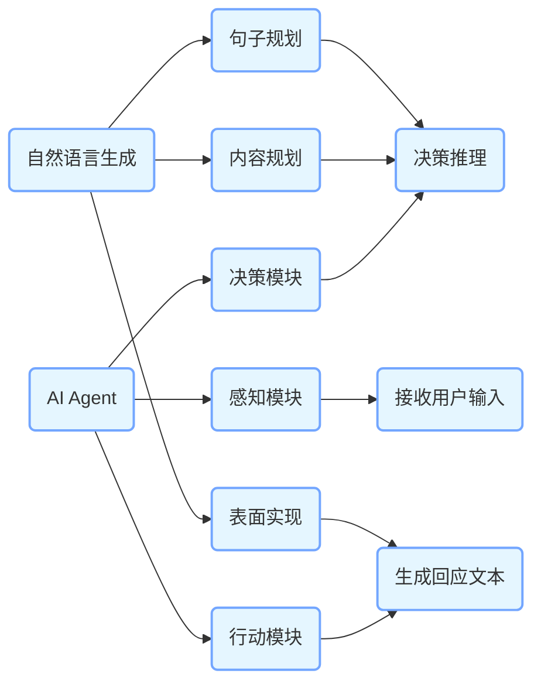

# 开发具有自然语言生成能力的AI Agent

> 关键词：自然语言生成、AI Agent、人工智能、语言模型、开发实践

> 摘要：本文围绕开发具有自然语言生成能力的AI Agent展开，详细阐述了其核心概念、算法原理、数学模型等内容。通过逐步分析推理，深入探讨了开发过程中的具体操作步骤，结合实际项目案例进行代码实现与解读。同时介绍了该技术的实际应用场景、相关工具和资源，最后对其未来发展趋势与挑战进行总结，并给出常见问题解答及参考资料，旨在为开发者提供全面且深入的技术指导。

## 1. 背景介绍 
### 1.1 目的和范围
开发具有自然语言生成能力的AI Agent旨在让计算机系统能够像人类一样理解和生成自然语言文本，以实现更自然、智能的人机交互。本文章的范围涵盖了从核心概念的理解到具体开发实践的全过程，包括算法原理、数学模型、代码实现等方面，同时探讨了该技术在不同领域的实际应用场景。

### 1.2 预期读者
本文预期读者为对人工智能、自然语言处理领域感兴趣的开发者、研究人员以及相关专业的学生。具备一定的编程基础（如Python）和机器学习知识将有助于更好地理解本文内容。

### 1.3 文档结构概述
本文将按照以下结构进行阐述：首先介绍核心概念与联系，包括自然语言生成和AI Agent的基本原理和架构；接着讲解核心算法原理及具体操作步骤，并结合Python代码进行详细说明；然后介绍相关的数学模型和公式，并举例说明；再通过项目实战展示代码的实际应用和详细解释；之后探讨实际应用场景；随后推荐相关的工具和资源；最后对未来发展趋势与挑战进行总结，并提供常见问题解答和参考资料。

### 1.4 术语表
#### 1.4.1 核心术语定义
- **自然语言生成（Natural Language Generation，NLG）**：是指将非语言形式的数据（如结构化数据、知识图谱等）转换为自然语言文本的过程。
- **AI Agent**：是一种能够感知环境、进行决策并采取行动以实现特定目标的智能实体。在自然语言处理领域，AI Agent能够理解用户输入的自然语言并生成合适的回应。
- **语言模型（Language Model）**：是一种对语言进行建模的概率模型，用于预测给定上下文下下一个词出现的概率。

#### 1.4.2 相关概念解释
- **上下文（Context）**：在自然语言处理中，上下文是指当前处理的文本周围的文本信息，它有助于更准确地理解和生成语言。
- **生成式对抗网络（Generative Adversarial Network，GAN）**：是一种深度学习模型，由生成器和判别器组成，可用于生成逼真的数据，在自然语言生成中也有应用。

#### 1.4.3 缩略词列表
- **NLG**：Natural Language Generation
- **AI**：Artificial Intelligence
- **GAN**：Generative Adversarial Network

## 2. 核心概念与联系 

### 自然语言生成原理
自然语言生成的基本原理是将输入的非语言信息（如数据、知识等）经过一系列处理转换为自然语言文本。其过程通常包括内容规划、句子规划和表面实现三个主要阶段。

- **内容规划**：确定要表达的主要内容和信息结构。例如，在生成一篇新闻报道时，需要决定报道的主题、重点事件等。
- **句子规划**：将内容规划阶段确定的信息组织成合适的句子结构。这涉及到词汇选择、语法规则的应用等。
- **表面实现**：将句子规划阶段生成的抽象句子结构转换为具体的自然语言文本，包括正确的单词拼写、标点符号的使用等。

### AI Agent架构
AI Agent通常由感知模块、决策模块和行动模块组成。

- **感知模块**：负责接收环境中的信息，在自然语言处理场景中，主要是接收用户输入的自然语言文本。
- **决策模块**：根据感知模块接收到的信息，结合自身的知识和目标，进行决策和推理，确定合适的回应策略。
- **行动模块**：根据决策模块的结果，生成并输出自然语言文本作为回应。

### 核心概念联系示意图


在这个架构中，自然语言生成是AI Agent行动模块的重要组成部分，为其提供生成自然语言文本的能力。感知模块接收用户输入后，决策模块利用自然语言生成的相关规划阶段来确定回应策略，最后行动模块通过表面实现将规划结果转换为实际的回应文本。

## 3. 核心算法原理 & 具体操作步骤 

### 基于Transformer的语言模型算法原理
Transformer是一种基于注意力机制的深度学习模型，在自然语言处理领域取得了巨大成功。其核心思想是通过多头注意力机制来捕捉输入序列中不同位置之间的依赖关系。

以下是Transformer模型的Python代码实现示例：

```python
import torch
import torch.nn as nn
import torch.nn.functional as F

# 多头注意力机制
class MultiHeadAttention(nn.Module):
    def __init__(self, d_model, num_heads):
        super(MultiHeadAttention, self).__init__()
        assert d_model % num_heads == 0, "d_model must be divisible by num_heads"

        self.d_model = d_model
        self.num_heads = num_heads
        self.d_k = d_model // num_heads

        self.W_q = nn.Linear(d_model, d_model)
        self.W_k = nn.Linear(d_model, d_model)
        self.W_v = nn.Linear(d_model, d_model)
        self.W_o = nn.Linear(d_model, d_model)

    def scaled_dot_product_attention(self, Q, K, V, mask=None):
        attn_scores = torch.matmul(Q, K.transpose(-2, -1)) / torch.sqrt(torch.tensor(self.d_k, dtype=torch.float32))
        if mask is not None:
            attn_scores = attn_scores.masked_fill(mask == 0, -1e9)
        attn_probs = F.softmax(attn_scores, dim=-1)
        output = torch.matmul(attn_probs, V)
        return output

    def split_heads(self, x):
        batch_size, seq_length, d_model = x.size()
        return x.view(batch_size, seq_length, self.num_heads, self.d_k).transpose(1, 2)

    def combine_heads(self, x):
        batch_size, num_heads, seq_length, d_k = x.size()
        return x.transpose(1, 2).contiguous().view(batch_size, seq_length, self.d_model)

    def forward(self, Q, K, V, mask=None):
        Q = self.split_heads(self.W_q(Q))
        K = self.split_heads(self.W_k(K))
        V = self.split_heads(self.W_v(V))

        attn_output = self.scaled_dot_product_attention(Q, K, V, mask)
        output = self.W_o(self.combine_heads(attn_output))
        return output

# 前馈神经网络
class PositionwiseFeedForward(nn.Module):
    def __init__(self, d_model, d_ff):
        super(PositionwiseFeedForward, self).__init__()
        self.fc1 = nn.Linear(d_model, d_ff)
        self.fc2 = nn.Linear(d_ff, d_model)
        self.relu = nn.ReLU()

    def forward(self, x):
        return self.fc2(self.relu(self.fc1(x)))

# Transformer编码器层
class EncoderLayer(nn.Module):
    def __init__(self, d_model, num_heads, d_ff, dropout):
        super(EncoderLayer, self).__init__()
        self.self_attn = MultiHeadAttention(d_model, num_heads)
        self.feed_forward = PositionwiseFeedForward(d_model, d_ff)
        self.norm1 = nn.LayerNorm(d_model)
        self.norm2 = nn.LayerNorm(d_model)
        self.dropout = nn.Dropout(dropout)

    def forward(self, x, mask):
        attn_output = self.self_attn(x, x, x, mask)
        x = self.norm1(x + self.dropout(attn_output))
        ff_output = self.feed_forward(x)
        x = self.norm2(x + self.dropout(ff_output))
        return x

# Transformer编码器
class Encoder(nn.Module):
    def __init__(self, num_layers, d_model, num_heads, d_ff, input_vocab_size, maximum_position_encoding, dropout):
        super(Encoder, self).__init__()
        self.d_model = d_model
        self.embedding = nn.Embedding(input_vocab_size, d_model)
        self.pos_encoding = self.positional_encoding(maximum_position_encoding, self.d_model)
        self.layers = nn.ModuleList([EncoderLayer(d_model, num_heads, d_ff, dropout) for _ in range(num_layers)])
        self.dropout = nn.Dropout(dropout)

    def positional_encoding(self, position, d_model):
        angle_rads = self.get_angles(torch.arange(position)[:, None],
                                     torch.arange(d_model)[None, :],
                                     d_model)
        # apply sin to even indices in the array; 2i
        angle_rads[:, 0::2] = torch.sin(angle_rads[:, 0::2])
        # apply cos to odd indices in the array; 2i+1
        angle_rads[:, 1::2] = torch.cos(angle_rads[:, 1::2])
        pos_encoding = angle_rads[None,...]
        return pos_encoding.to(torch.float32)

    def get_angles(self, pos, i, d_model):
        angle_rates = 1 / torch.pow(10000, (2 * (i // 2)) / torch.tensor(d_model, dtype=torch.float32))
        return pos * angle_rates

    def forward(self, x, mask):
        seq_length = x.size(1)
        x = self.embedding(x)
        x *= torch.sqrt(torch.tensor(self.d_model, dtype=torch.float32))
        x += self.pos_encoding[:, :seq_length, :]
        x = self.dropout(x)

        for layer in self.layers:
            x = layer(x, mask)

        return x
```

### 具体操作步骤
1. **数据预处理**：将原始文本数据进行分词、编码等处理，转换为模型可以接受的输入格式。
2. **模型构建**：使用上述的Transformer模型代码构建语言模型，设置合适的超参数，如`d_model`、`num_heads`、`num_layers`等。
3. **模型训练**：定义损失函数（如交叉熵损失）和优化器（如Adam优化器），使用训练数据对模型进行训练。
```python
import torch.optim as optim

# 定义超参数
d_model = 512
num_heads = 8
num_layers = 6
d_ff = 2048
input_vocab_size = 10000
maximum_position_encoding = 5000
dropout = 0.1
learning_rate = 0.0001
batch_size = 32
num_epochs = 10

# 构建模型
encoder = Encoder(num_layers, d_model, num_heads, d_ff, input_vocab_size, maximum_position_encoding, dropout)

# 定义损失函数和优化器
criterion = nn.CrossEntropyLoss()
optimizer = optim.Adam(encoder.parameters(), lr=learning_rate)

# 模拟训练数据
train_data = torch.randint(0, input_vocab_size, (batch_size, 10))
mask = torch.ones((batch_size, 1, 1, 10))

# 训练模型
for epoch in range(num_epochs):
    optimizer.zero_grad()
    output = encoder(train_data, mask)
    # 这里只是示例，实际需要根据具体任务定义标签
    labels = torch.randint(0, input_vocab_size, (batch_size, 10))
    loss = criterion(output.view(-1, input_vocab_size), labels.view(-1))
    loss.backward()
    optimizer.step()
    print(f'Epoch {epoch + 1}/{num_epochs}, Loss: {loss.item()}')
```
4. **模型评估**：使用验证数据对训练好的模型进行评估，计算准确率、困惑度等指标。
5. **自然语言生成**：使用训练好的模型进行自然语言生成，输入一个初始文本，模型根据输入生成后续的文本。

## 4. 数学模型和公式 & 详细讲解 & 举例说明 

### 多头注意力机制数学模型
多头注意力机制通过将输入的查询（Q）、键（K）和值（V）分别投影到多个低维子空间，然后在每个子空间中计算注意力分数，最后将结果拼接并投影回原始维度。

#### 缩放点积注意力公式
缩放点积注意力的计算过程可以用以下公式表示：

$$
\text{Attention}(Q, K, V) = \text{softmax}\left(\frac{QK^T}{\sqrt{d_k}}\right)V
$$

其中，$Q$ 是查询矩阵，$K$ 是键矩阵，$V$ 是值矩阵，$d_k$ 是键的维度。缩放因子 $\sqrt{d_k}$ 用于防止点积结果过大，避免梯度消失或爆炸问题。

#### 多头注意力公式
多头注意力是多个缩放点积注意力的组合，公式如下：

$$
\text{MultiHead}(Q, K, V) = \text{Concat}(\text{head}_1, \cdots, \text{head}_h)W^O
$$

其中，$\text{head}_i = \text{Attention}(QW_i^Q, KW_i^K, VW_i^V)$，$W_i^Q$、$W_i^K$、$W_i^V$ 是投影矩阵，$W^O$ 是输出投影矩阵，$h$ 是头的数量。

### 举例说明
假设我们有一个输入序列 $x = [x_1, x_2, x_3]$，每个 $x_i$ 是一个 $d$ 维的向量。我们将其作为查询、键和值的输入。

- 首先，我们将 $x$ 分别投影到 $h$ 个头的子空间中，得到 $QW_i^Q$、$KW_i^K$、$VW_i^V$。
- 然后，在每个头中计算缩放点积注意力，得到 $\text{head}_i$。
- 最后，将所有头的结果拼接起来，并通过 $W^O$ 投影回原始维度，得到多头注意力的输出。

### 前馈神经网络数学模型
前馈神经网络由两个线性层和一个激活函数组成，公式如下：

$$
\text{FFN}(x) = \text{max}(0, xW_1 + b_1)W_2 + b_2
$$

其中，$W_1$ 和 $W_2$ 是权重矩阵，$b_1$ 和 $b_2$ 是偏置向量，$\text{max}(0, \cdot)$ 是ReLU激活函数。

### 模型训练损失函数
在语言模型训练中，常用的损失函数是交叉熵损失，公式如下：

$$
L(y, \hat{y}) = -\sum_{i=1}^{N} y_i \log(\hat{y}_i)
$$

其中，$y$ 是真实标签，$\hat{y}$ 是模型预测的概率分布，$N$ 是词汇表的大小。

## 5. 项目实战：代码实际案例和详细解释说明 

### 5.1  开发环境搭建
1. **安装Python**：确保系统中安装了Python 3.6及以上版本。
2. **安装深度学习框架**：推荐使用PyTorch，可通过以下命令安装：
```sh
pip install torch torchvision
```
3. **安装其他依赖库**：如`numpy`、`tqdm`等，可使用以下命令安装：
```sh
pip install numpy tqdm
```

### 5.2  源代码详细实现和代码解读
以下是一个简单的基于Transformer的文本生成项目的完整代码示例：

```python
import torch
import torch.nn as nn
import torch.optim as optim
from tqdm import tqdm
import numpy as np

# 定义Transformer模型（前面已给出部分代码，这里简化调用）
from transformer import Encoder

# 数据预处理
def preprocess(text, vocab):
    tokens = text.split()
    ids = [vocab.get(token, vocab['<unk>']) for token in tokens]
    return torch.tensor(ids, dtype=torch.long).unsqueeze(0)

# 文本生成函数
def generate_text(model, input_text, vocab, max_length=50):
    input_ids = preprocess(input_text, vocab)
    output = input_ids
    for _ in range(max_length):
        mask = torch.ones((1, 1, 1, output.size(1)))
        logits = model(output, mask)
        next_token_id = torch.argmax(logits[:, -1, :], dim=-1, keepdim=True)
        output = torch.cat([output, next_token_id], dim=1)
    output_text = ' '.join([list(vocab.keys())[id] for id in output.squeeze().tolist()])
    return output_text

# 主函数
def main():
    # 定义超参数
    d_model = 256
    num_heads = 4
    num_layers = 3
    d_ff = 1024
    input_vocab_size = 1000
    maximum_position_encoding = 500
    dropout = 0.1
    learning_rate = 0.0001
    batch_size = 16
    num_epochs = 5

    # 构建模型
    model = Encoder(num_layers, d_model, num_heads, d_ff, input_vocab_size, maximum_position_encoding, dropout)

    # 定义损失函数和优化器
    criterion = nn.CrossEntropyLoss()
    optimizer = optim.Adam(model.parameters(), lr=learning_rate)

    # 模拟训练数据
    train_data = [torch.randint(0, input_vocab_size, (10,)) for _ in range(100)]
    train_labels = [torch.randint(0, input_vocab_size, (10,)) for _ in range(100)]

    # 训练模型
    for epoch in range(num_epochs):
        total_loss = 0
        for i in tqdm(range(0, len(train_data), batch_size)):
            batch_inputs = torch.stack(train_data[i:i+batch_size])
            batch_labels = torch.stack(train_labels[i:i+batch_size])
            mask = torch.ones((batch_size, 1, 1, batch_inputs.size(1)))

            optimizer.zero_grad()
            output = model(batch_inputs, mask)
            loss = criterion(output.view(-1, input_vocab_size), batch_labels.view(-1))
            loss.backward()
            optimizer.step()
            total_loss += loss.item()

        print(f'Epoch {epoch + 1}/{num_epochs}, Loss: {total_loss / len(train_data)}')

    # 构建词汇表
    vocab = {str(i): i for i in range(input_vocab_size)}
    vocab['<unk>'] = input_vocab_size

    # 生成文本
    input_text = '1 2 3'
    generated_text = generate_text(model, input_text, vocab)
    print(f'Generated Text: {generated_text}')

if __name__ == '__main__':
    main()
```

### 5.3  代码解读与分析
1. **数据预处理**：`preprocess`函数将输入文本分词并转换为对应的词汇表索引，方便模型处理。
2. **文本生成**：`generate_text`函数根据输入文本和训练好的模型，逐步生成后续文本。在每一步中，模型预测下一个词的概率分布，选择概率最大的词作为下一个词，直到达到最大长度。
3. **模型训练**：在`main`函数中，我们定义了超参数，构建了Transformer模型，定义了损失函数和优化器。使用模拟的训练数据对模型进行训练，每个epoch计算总损失并输出。
4. **生成文本测试**：训练完成后，我们构建了一个简单的词汇表，并使用`generate_text`函数生成文本，最后输出生成的文本。

## 6. 实际应用场景 
### 智能客服
具有自然语言生成能力的AI Agent可以作为智能客服，自动回答用户的问题。它能够理解用户的问题意图，根据知识库中的信息生成准确、自然的回答，提高客服效率和用户体验。

### 内容创作
在新闻报道、文案写作等领域，AI Agent可以根据给定的主题和相关数据生成高质量的文本内容。例如，自动生成体育赛事报道、财经新闻等，大大节省了人力和时间成本。

### 对话系统
用于聊天机器人、虚拟助手等对话系统中，AI Agent能够与用户进行自然流畅的对话，理解用户的需求并提供相应的服务和建议。

### 翻译服务
AI Agent可以将一种语言的文本转换为另一种语言的文本，通过自然语言生成技术生成通顺、准确的翻译结果。

## 7. 工具和资源推荐
### 7.1 学习资源推荐
#### 7.1.1 书籍推荐
- 《深度学习》（Deep Learning）：由Ian Goodfellow、Yoshua Bengio和Aaron Courville所著，是深度学习领域的经典教材，涵盖了神经网络、优化算法等基础知识。
- 《自然语言处理入门》：介绍了自然语言处理的基本概念、算法和应用，适合初学者入门。
- 《Python自然语言处理》（Natural Language Processing with Python）：通过Python代码示例详细介绍了自然语言处理的各种技术和工具。

#### 7.1.2 在线课程
- Coursera上的“深度学习专项课程”（Deep Learning Specialization）：由Andrew Ng教授授课，全面介绍了深度学习的理论和实践。
- edX上的“自然语言处理”（Natural Language Processing）课程：深入讲解了自然语言处理的各种算法和模型。
- 哔哩哔哩上有许多关于自然语言处理和人工智能的教程视频，适合自学。

#### 7.1.3 技术博客和网站
- arXiv：提供了大量的学术论文，涵盖了自然语言处理、人工智能等领域的最新研究成果。
- Medium：有许多技术博客文章，分享了自然语言处理的实践经验和技术心得。
- Hugging Face Blog：专注于自然语言处理和深度学习，提供了很多关于预训练模型、开源工具等方面的信息。

### 7.2 开发工具框架推荐
#### 7.2.1 IDE和编辑器
- PyCharm：是一款专业的Python集成开发环境，提供了代码编辑、调试、版本控制等功能，适合Python开发。
- Jupyter Notebook：是一个交互式的开发环境，方便进行代码编写、数据可视化和模型训练，非常适合机器学习和深度学习开发。
- Visual Studio Code：轻量级的代码编辑器，支持多种编程语言和插件扩展，可通过安装Python相关插件进行Python开发。

#### 7.2.2 调试和性能分析工具
- TensorBoard：是TensorFlow提供的可视化工具，可用于监控模型训练过程中的损失、准确率等指标，还能进行模型结构可视化。
- PyTorch Profiler：PyTorch提供的性能分析工具，可帮助开发者找出代码中的性能瓶颈。
- cProfile：Python内置的性能分析模块，可用于分析Python代码的运行时间和函数调用次数。

#### 7.2.3 相关框架和库
- PyTorch：是一个开源的深度学习框架，具有动态图特性，易于使用和调试，在自然语言处理领域广泛应用。
- TensorFlow：另一个流行的深度学习框架，提供了丰富的工具和模型库，支持分布式训练。
- Hugging Face Transformers：提供了许多预训练的语言模型，如BERT、GPT等，以及方便的模型加载和使用接口。

### 7.3 相关论文著作推荐
#### 7.3.1 经典论文
- “Attention Is All You Need”：介绍了Transformer模型，是自然语言处理领域的重要突破。
- “BERT: Pre-training of Deep Bidirectional Transformers for Language Understanding”：提出了BERT预训练模型，显著提升了自然语言处理任务的性能。
- “Generative Adversarial Nets”：首次提出了生成式对抗网络（GAN）的概念，在自然语言生成等领域有广泛应用。

#### 7.3.2 最新研究成果
- 关注arXiv上的最新论文，了解自然语言生成和AI Agent领域的最新研究进展，如新型的语言模型架构、训练方法等。
- 参加自然语言处理领域的顶级学术会议，如ACL（Association for Computational Linguistics）、EMNLP（Conference on Empirical Methods in Natural Language Processing）等，获取最新的研究成果和技术趋势。

#### 7.3.3 应用案例分析
- 阅读各大科技公司发布的技术博客文章，了解他们在实际项目中应用自然语言生成和AI Agent的经验和案例，如Google、Microsoft、OpenAI等公司的相关文章。
- 分析开源项目中的代码和文档，学习其他开发者在实际项目中的实现思路和技巧。

## 8. 总结：未来发展趋势与挑战
### 未来发展趋势
- **多模态融合**：将自然语言生成与图像、音频等多模态信息相结合，实现更加丰富和自然的交互。例如，生成包含图像描述的文本，或者根据语音输入生成文本回应。
- **个性化生成**：根据用户的个性化特征和历史交互记录，生成更符合用户需求和偏好的文本内容。例如，智能客服根据用户的购买历史和偏好提供个性化的推荐和建议。
- **强化学习与自然语言生成的结合**：通过强化学习的方法优化自然语言生成过程，使AI Agent能够在与环境的交互中不断学习和改进，提高生成文本的质量和效果。
- **大规模预训练模型的应用**：利用大规模的预训练模型，如GPT-3等，进行微调以适应特定的自然语言生成任务，减少训练成本和时间。

### 挑战
- **语义理解的局限性**：虽然当前的自然语言处理技术在很多任务上取得了不错的成绩，但在深层次的语义理解方面仍存在不足，难以准确理解一些复杂的语言表达和隐含意义。
- **数据质量和数量**：高质量的训练数据对于自然语言生成模型的性能至关重要，但获取大规模、高质量的数据往往比较困难，而且数据标注的成本也很高。
- **伦理和安全问题**：自然语言生成技术可能被用于生成虚假信息、恶意攻击等不良行为，需要建立相应的伦理和安全规范来约束其应用。
- **计算资源需求**：训练大规模的自然语言生成模型需要大量的计算资源和时间，这对于一些小型企业和研究机构来说是一个巨大的挑战。

## 9. 附录：常见问题与解答
### 问题1：如何选择合适的语言模型架构？
解答：选择合适的语言模型架构需要考虑多个因素，如任务类型、数据规模、计算资源等。如果任务是简单的文本分类或生成，一些轻量级的模型可能就足够了；如果任务复杂且数据规模较大，可以考虑使用Transformer等强大的模型架构。此外，还可以参考相关的研究论文和开源项目，了解不同模型在不同任务上的表现。

### 问题2：训练自然语言生成模型需要多少数据？
解答：训练自然语言生成模型所需的数据量取决于模型的复杂度和任务的难度。一般来说，数据量越大，模型的性能越好。对于小型任务，可能需要几千条数据；而对于大规模的预训练模型，可能需要数百万甚至数十亿条数据。同时，数据的质量也非常重要，应该尽量选择高质量、多样化的数据进行训练。

### 问题3：如何评估自然语言生成模型的性能？
解答：常用的评估指标包括困惑度（Perplexity）、准确率（Accuracy）、BLEU分数等。困惑度衡量模型对测试数据的预测能力，越低越好；准确率用于分类任务，衡量模型预测结果的正确性；BLEU分数用于评估机器翻译和文本生成的质量，越高越好。此外，还可以通过人工评估的方式，让人类评判生成文本的质量和合理性。

### 问题4：如何处理自然语言生成中的语义歧义问题？
解答：处理语义歧义问题可以采用以下方法：一是利用上下文信息，通过分析上下文来确定词语的具体含义；二是使用知识图谱等外部知识，为模型提供更多的语义信息；三是采用多模态信息，结合图像、音频等信息来消除歧义。

## 10. 扩展阅读 & 参考资料
- Goodfellow, I., Bengio, Y., & Courville, A. (2016). Deep Learning. MIT Press.
- Bird, S., Klein, E., & Loper, E. (2009). Natural Language Processing with Python. O'Reilly Media.
- Vaswani, A., Shazeer, N., Parmar, N., Uszkoreit, J., Jones, L., Gomez, A. N.,... & Polosukhin, I. (2017). Attention is all you need. In Advances in neural information processing systems (pp. 5998-6008).
- Devlin, J., Chang, M. W., Lee, K., & Toutanova, K. (2018). Bert: Pre-training of deep bidirectional transformers for language understanding. arXiv preprint arXiv:1810.04805.
- Goodfellow, I. J., Pouget-Abadie, J., Mirza, M., Xu, B., Warde-Farley, D., Ozair, S.,... & Bengio, Y. (2014). Generative adversarial nets. In Advances in neural information processing systems (pp. 2672-2680).

作者：AI天才研究院/AI Genius Institute & 禅与计算机程序设计艺术 /Zen And The Art of Computer Programming