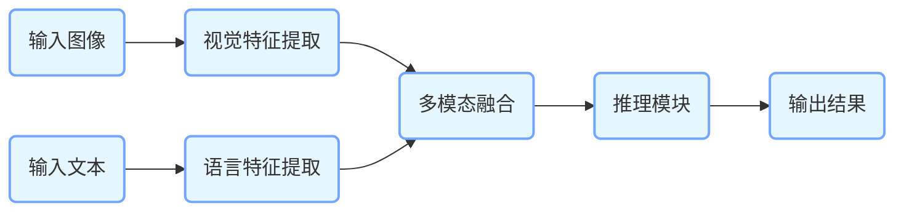

# 开发具有视觉 - 语言跨模态推理能力的 AI Agent

> 关键词：视觉 - 语言跨模态推理、AI Agent、多模态融合、深度学习、跨模态任务、推理算法、人工智能

> 摘要：本文围绕开发具有视觉 - 语言跨模态推理能力的 AI Agent 展开深入探讨。首先介绍了相关背景知识，包括目的、预期读者等内容。接着阐述了视觉 - 语言跨模态推理的核心概念与联系，剖析其原理与架构，并通过 Mermaid 流程图进行直观展示。详细讲解了核心算法原理及具体操作步骤，给出 Python 源代码示例。同时，对涉及的数学模型和公式进行深入分析与举例说明。通过项目实战，展示了开发环境搭建、源代码实现及解读。探讨了该技术的实际应用场景，推荐了学习资源、开发工具框架以及相关论文著作。最后总结了未来发展趋势与挑战，解答常见问题并提供扩展阅读和参考资料，旨在为开发具有视觉 - 语言跨模态推理能力的 AI Agent 提供全面而深入的技术指导。

## 1. 背景介绍 
### 1.1 目的和范围
在人工智能领域，单一模态的信息处理已经难以满足复杂的现实需求。视觉 - 语言跨模态推理能力的引入，使得 AI Agent 能够同时理解和处理视觉图像与自然语言信息，从而实现更智能、更自然的交互。开发具有这种能力的 AI Agent 的目的在于：
- **增强智能交互**：让 AI 能够更好地理解人类的意图，无论是通过图像还是语言描述，都能做出准确的回应，提升人机交互的质量。
- **解决复杂任务**：在诸如智能安防、医疗诊断、自动驾驶等领域，需要综合视觉和语言信息来完成复杂的决策和推理任务，具有跨模态推理能力的 AI Agent 能够更好地应对这些挑战。
- **推动人工智能发展**：跨模态推理是人工智能迈向通用智能的重要一步，开发这样的 AI Agent 有助于推动整个领域的发展。

本文章的范围主要涵盖开发具有视觉 - 语言跨模态推理能力的 AI Agent 的理论基础、算法原理、实现步骤、实际应用以及相关资源推荐等方面，旨在为开发者提供全面的技术指导。

### 1.2 预期读者
本文预期读者包括但不限于以下群体：
- **人工智能开发者**：希望通过学习和实践，掌握开发具有跨模态推理能力的 AI Agent 的技术，提升自己在人工智能领域的开发水平。
- **研究人员**：对视觉 - 语言跨模态推理领域感兴趣，希望深入了解相关理论和技术，开展进一步的研究工作。
- **学生**：正在学习人工智能、计算机科学等相关专业的学生，通过阅读本文，能够对跨模态推理技术有更深入的理解，拓宽自己的知识面。
- **技术爱好者**：对人工智能前沿技术充满热情，希望了解开发具有视觉 - 语言跨模态推理能力的 AI Agent 的原理和方法。

### 1.3 文档结构概述
本文的结构如下：
- **核心概念与联系**：介绍视觉 - 语言跨模态推理的核心概念、原理和架构，并通过 Mermaid 流程图进行直观展示。
- **核心算法原理 & 具体操作步骤**：详细讲解实现跨模态推理的核心算法原理，给出 Python 源代码示例，并说明具体的操作步骤。
- **数学模型和公式 & 详细讲解 & 举例说明**：对涉及的数学模型和公式进行深入分析，通过具体例子帮助读者理解。
- **项目实战：代码实际案例和详细解释说明**：展示开发具有跨模态推理能力的 AI Agent 的实际项目，包括开发环境搭建、源代码实现及解读。
- **实际应用场景**：探讨该技术在不同领域的实际应用场景。
- **工具和资源推荐**：推荐学习资源、开发工具框架以及相关论文著作，帮助读者进一步学习和研究。
- **总结：未来发展趋势与挑战**：总结该技术的未来发展趋势，分析面临的挑战。
- **附录：常见问题与解答**：解答读者在学习和开发过程中可能遇到的常见问题。
- **扩展阅读 & 参考资料**：提供相关的扩展阅读材料和参考资料，方便读者进一步深入学习。

### 1.4 术语表
#### 1.4.1 核心术语定义
- **视觉 - 语言跨模态推理**：指 AI Agent 能够同时理解和处理视觉图像信息和自然语言信息，并在两者之间进行推理和转换的能力。
- **AI Agent**：是一种能够感知环境、做出决策并采取行动的智能实体。
- **多模态融合**：将不同模态（如视觉、语言、音频等）的信息进行整合和处理的过程。
- **跨模态任务**：需要同时利用多种模态信息才能完成的任务，如图像描述生成、视觉问答等。

#### 1.4.2 相关概念解释
- **深度学习**：是一种基于人工神经网络的机器学习方法，通过多层神经网络对数据进行学习和特征提取，在跨模态推理中广泛应用。
- **注意力机制**：是一种在深度学习中用于突出重要信息的机制，能够帮助模型更好地关注不同模态信息中的关键部分。

#### 1.4.3 缩略词列表
- **CNN**：Convolutional Neural Network，卷积神经网络，用于处理视觉图像信息。
- **RNN**：Recurrent Neural Network，循环神经网络，常用于处理序列数据，如自然语言。
- **Transformer**：一种基于注意力机制的深度学习模型架构，在跨模态推理中表现出色。
- **VQA**：Visual Question Answering，视觉问答，是一种典型的跨模态任务。

## 2. 核心概念与联系 
### 核心概念原理
视觉 - 语言跨模态推理的核心在于将视觉信息和语言信息进行有效的融合和推理。具体来说，首先需要对视觉图像和自然语言进行特征提取，将其转换为计算机能够处理的向量表示。然后，通过多模态融合技术将这两种模态的特征进行整合，使得模型能够同时理解图像和语言之间的关系。最后，利用推理算法根据整合后的信息进行决策和回答问题。

### 架构的文本示意图
视觉 - 语言跨模态推理的架构主要包括以下几个部分：
- **视觉特征提取模块**：使用卷积神经网络（CNN）对图像进行特征提取，将图像转换为高维特征向量。
- **语言特征提取模块**：采用循环神经网络（RNN）或 Transformer 等模型对自然语言进行处理，提取语言的语义特征。
- **多模态融合模块**：将视觉特征和语言特征进行融合，常用的方法包括拼接、注意力机制等。
- **推理模块**：根据融合后的特征进行推理，完成具体的跨模态任务，如图像描述生成、视觉问答等。

### Mermaid 流程图


## 3. 核心算法原理 & 具体操作步骤 
### 核心算法原理
在视觉 - 语言跨模态推理中，常用的算法包括基于注意力机制的 Transformer 模型。Transformer 模型通过自注意力机制能够捕捉不同模态信息之间的依赖关系，从而实现有效的跨模态融合和推理。

以下是基于 Transformer 模型的跨模态推理的基本原理：
1. **输入编码**：将图像特征和语言特征分别进行编码，转换为适合 Transformer 模型处理的输入格式。
2. **自注意力机制**：在 Transformer 模型中，自注意力机制用于计算不同位置的特征之间的相关性，从而突出重要信息。
3. **多头注意力**：为了捕捉不同方面的信息，Transformer 模型采用多头注意力机制，通过多个注意力头并行计算，提高模型的表达能力。
4. **前馈神经网络**：在多头注意力之后，通过前馈神经网络对特征进行进一步的非线性变换。
5. **输出解码**：最后，将 Transformer 模型的输出进行解码，得到最终的推理结果。

### 具体操作步骤及 Python 源代码
以下是一个简单的基于 PyTorch 实现的跨模态推理示例：

```python
import torch
import torch.nn as nn
import torch.nn.functional as F

# 定义 Transformer 模型
class TransformerModel(nn.Module):
    def __init__(self, input_dim, hidden_dim, num_heads, num_layers):
        super(TransformerModel, self).__init__()
        self.transformer_encoder = nn.TransformerEncoder(
            nn.TransformerEncoderLayer(d_model=input_dim, nhead=num_heads),
            num_layers=num_layers
        )
        self.fc = nn.Linear(input_dim, hidden_dim)

    def forward(self, visual_features, language_features):
        # 拼接视觉和语言特征
        combined_features = torch.cat((visual_features, language_features), dim=1)
        # 通过 Transformer 编码器
        encoded_features = self.transformer_encoder(combined_features.unsqueeze(1)).squeeze(1)
        # 通过全连接层
        output = self.fc(encoded_features)
        return output

# 初始化模型
input_dim = 512  # 输入特征维度
hidden_dim = 128  # 隐藏层维度
num_heads = 8  # 注意力头数量
num_layers = 2  # Transformer 层数
model = TransformerModel(input_dim, hidden_dim, num_heads, num_layers)

# 模拟输入数据
batch_size = 16
visual_features = torch.randn(batch_size, input_dim)
language_features = torch.randn(batch_size, input_dim)

# 前向传播
output = model(visual_features, language_features)
print("Output shape:", output.shape)
```

### 代码解释
1. **TransformerModel 类**：定义了一个基于 Transformer 编码器的跨模态推理模型。
2. **__init__ 方法**：初始化 Transformer 编码器和全连接层。
3. **forward 方法**：将视觉和语言特征拼接后，通过 Transformer 编码器进行编码，最后通过全连接层得到输出。
4. **模拟输入数据**：生成随机的视觉和语言特征，模拟输入数据。
5. **前向传播**：调用模型的 forward 方法进行前向传播，得到输出结果。

## 4. 数学模型和公式 & 详细讲解 & 举例说明 
### 自注意力机制的数学模型和公式
自注意力机制是 Transformer 模型的核心，其数学模型和公式如下：

给定输入序列 $X = [x_1, x_2, \cdots, x_n]$，其中 $x_i$ 表示第 $i$ 个位置的特征向量。自注意力机制的计算步骤如下：
1. **计算查询（Query）、键（Key）和值（Value）**：
   - $Q = XW^Q$
   - $K = XW^K$
   - $V = XW^V$
   其中 $W^Q$、$W^K$ 和 $W^V$ 是可学习的权重矩阵。

2. **计算注意力分数**：
   - $Attention(Q, K, V) = \text{softmax}\left(\frac{QK^T}{\sqrt{d_k}}\right)V$
   其中 $d_k$ 是键向量的维度，$\text{softmax}$ 函数用于将注意力分数归一化到 $[0, 1]$ 之间。

### 详细讲解
自注意力机制的核心思想是通过计算查询向量和键向量之间的相似度，得到每个位置的注意力分数，然后根据注意力分数对值向量进行加权求和，从而突出重要信息。具体来说：
- **查询（Query）**：用于表示当前位置需要关注的信息。
- **键（Key）**：用于表示其他位置的信息。
- **值（Value）**：用于表示其他位置的实际内容。

通过计算查询和键之间的相似度，可以确定每个位置对当前位置的重要程度，从而实现对信息的选择性关注。

### 举例说明
假设输入序列 $X = \begin{bmatrix}1 & 2 \\ 3 & 4 \\ 5 & 6\end{bmatrix}$，$W^Q = \begin{bmatrix}0.1 & 0.2 \\ 0.3 & 0.4\end{bmatrix}$，$W^K = \begin{bmatrix}0.5 & 0.6 \\ 0.7 & 0.8\end{bmatrix}$，$W^V = \begin{bmatrix}0.9 & 1.0 \\ 1.1 & 1.2\end{bmatrix}$。

1. **计算查询、键和值**：
   - $Q = XW^Q = \begin{bmatrix}1\times0.1 + 2\times0.3 & 1\times0.2 + 2\times0.4 \\ 3\times0.1 + 4\times0.3 & 3\times0.2 + 4\times0.4 \\ 5\times0.1 + 6\times0.3 & 5\times0.2 + 6\times0.4\end{bmatrix} = \begin{bmatrix}0.7 & 1.0 \\ 1.5 & 2.2 \\ 2.3 & 3.4\end{bmatrix}$
   - $K = XW^K = \begin{bmatrix}1\times0.5 + 2\times0.7 & 1\times0.6 + 2\times0.8 \\ 3\times0.5 + 4\times0.7 & 3\times0.6 + 4\times0.8 \\ 5\times0.5 + 6\times0.7 & 5\times0.6 + 6\times0.8\end{bmatrix} = \begin{bmatrix}1.9 & 2.2 \\ 4.3 & 5.0 \\ 6.7 & 7.8\end{bmatrix}$
   - $V = XW^V = \begin{bmatrix}1\times0.9 + 2\times1.1 & 1\times1.0 + 2\times1.2 \\ 3\times0.9 + 4\times1.1 & 3\times1.0 + 4\times1.2 \\ 5\times0.9 + 6\times1.1 & 5\times1.0 + 6\times1.2\end{bmatrix} = \begin{bmatrix}3.1 & 3.4 \\ 7.1 & 7.8 \\ 11.1 & 12.2\end{bmatrix}$

2. **计算注意力分数**：
   - $QK^T = \begin{bmatrix}0.7 & 1.0 \\ 1.5 & 2.2 \\ 2.3 & 3.4\end{bmatrix}\begin{bmatrix}1.9 & 4.3 & 6.7 \\ 2.2 & 5.0 & 7.8\end{bmatrix} = \begin{bmatrix}0.7\times1.9 + 1.0\times2.2 & 0.7\times4.3 + 1.0\times5.0 & 0.7\times6.7 + 1.0\times7.8 \\ 1.5\times1.9 + 2.2\times2.2 & 1.5\times4.3 + 2.2\times5.0 & 1.5\times6.7 + 2.2\times7.8 \\ 2.3\times1.9 + 3.4\times2.2 & 2.3\times4.3 + 3.4\times5.0 & 2.3\times6.7 + 3.4\times7.8\end{bmatrix} = \begin{bmatrix}3.53 & 8.01 & 12.49 \\ 7.29 & 17.45 & 27.01 \\ 11.05 & 26.89 & 41.51\end{bmatrix}$
   - 假设 $d_k = 2$，则 $\frac{QK^T}{\sqrt{d_k}} = \begin{bmatrix}2.49 & 5.66 & 8.83 \\ 5.16 & 12.34 & 19.09 \\ 7.82 & 19.02 & 29.36\end{bmatrix}$
   - $\text{softmax}\left(\frac{QK^T}{\sqrt{d_k}}\right) = \begin{bmatrix}0.00 & 0.03 & 0.97 \\ 0.00 & 0.08 & 0.92 \\ 0.00 & 0.12 & 0.88\end{bmatrix}$
   - $Attention(Q, K, V) = \text{softmax}\left(\frac{QK^T}{\sqrt{d_k}}\right)V = \begin{bmatrix}0.00\times3.1 + 0.03\times7.1 + 0.97\times11.1 & 0.00\times3.4 + 0.03\times7.8 + 0.97\times12.2 \\ 0.00\times3.1 + 0.08\times7.1 + 0.92\times11.1 & 0.00\times3.4 + 0.08\times7.8 + 0.92\times12.2 \\ 0.00\times3.1 + 0.12\times7.1 + 0.88\times11.1 & 0.00\times3.4 + 0.12\times7.8 + 0.88\times12.2\end{bmatrix} = \begin{bmatrix}10.92 & 11.97 \\ 10.43 & 11.44 \\ 10.57 & 