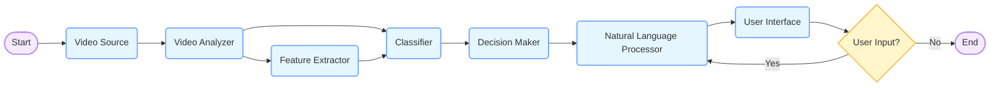

# 开发具有视频分析能力的AI Agent

> 关键词：AI Agent、视频分析、深度学习、计算机视觉、多模态融合、自然语言处理、智能决策

> 摘要：本文旨在详细阐述开发具有视频分析能力的AI Agent的相关技术和方法。首先介绍了开发该AI Agent的背景信息，包括目的、预期读者、文档结构和术语表。接着深入探讨了核心概念与联系，通过文本示意图和Mermaid流程图展示其架构原理。详细讲解了核心算法原理，并给出Python源代码示例。介绍了相关数学模型和公式，结合具体例子进行说明。通过项目实战部分，展示了开发环境搭建、源代码实现及代码解读。阐述了实际应用场景，推荐了学习资源、开发工具框架和相关论文著作。最后总结了未来发展趋势与挑战，提供了常见问题解答和扩展阅读参考资料，帮助读者全面了解和掌握开发具有视频分析能力的AI Agent的技术要点。

## 1. 背景介绍 
### 1.1 目的和范围
在当今数字化时代，视频数据呈现爆炸式增长，广泛应用于安防监控、智能交通、视频娱乐、医疗影像等众多领域。然而，海量的视频数据给人工处理带来了巨大挑战，因此开发具有视频分析能力的AI Agent具有重要的现实意义。本项目的目的是构建一个能够自动对视频内容进行分析、理解和决策的智能系统，实现诸如目标检测、行为识别、场景分类、视频摘要等功能。

本项目的范围涵盖了从视频数据的采集、预处理，到基于深度学习和计算机视觉技术的特征提取与分析，再到利用自然语言处理技术实现对分析结果的语义理解和交互，最终实现AI Agent的智能决策和响应。

### 1.2 预期读者
本文的预期读者包括但不限于以下几类人群：
- **人工智能开发者**：希望了解如何将视频分析技术融入到AI Agent开发中的专业人士。
- **计算机视觉研究人员**：对视频分析算法和应用感兴趣，想要探索多模态融合技术的研究者。
- **相关行业从业者**：如安防、交通、娱乐等行业中涉及视频数据处理和分析的工作人员，期望借助AI Agent提升工作效率和决策准确性。
- **学生和爱好者**：对人工智能和计算机视觉领域有浓厚兴趣，希望通过实际项目学习相关知识和技能的学生和爱好者。

### 1.3 文档结构概述
本文将按照以下结构进行组织：
- **核心概念与联系**：介绍AI Agent、视频分析等核心概念，以及它们之间的相互关系，通过文本示意图和Mermaid流程图展示其架构原理。
- **核心算法原理 & 具体操作步骤**：详细讲解实现视频分析的核心算法，包括目标检测、行为识别等算法，并给出Python源代码示例。
- **数学模型和公式 & 详细讲解 & 举例说明**：介绍相关的数学模型和公式，如卷积神经网络、循环神经网络等，并结合具体例子进行说明。
- **项目实战：代码实际案例和详细解释说明**：通过一个实际项目，展示开发具有视频分析能力的AI Agent的具体步骤，包括开发环境搭建、源代码实现和代码解读。
- **实际应用场景**：介绍该AI Agent在不同领域的实际应用场景。
- **工具和资源推荐**：推荐学习资源、开发工具框架和相关论文著作。
- **总结：未来发展趋势与挑战**：总结开发具有视频分析能力的AI Agent的未来发展趋势和面临的挑战。
- **附录：常见问题与解答**：提供常见问题的解答，帮助读者更好地理解和应用相关技术。
- **扩展阅读 & 参考资料**：提供扩展阅读材料和参考资料，方便读者进一步深入学习。

### 1.4 术语表
#### 1.4.1 核心术语定义
- **AI Agent**：人工智能代理，是一种能够感知环境、进行决策并采取行动以实现特定目标的智能实体。
- **视频分析**：对视频数据进行处理、分析和理解的过程，包括目标检测、行为识别、场景分类等任务。
- **深度学习**：一种基于人工神经网络的机器学习方法，通过构建多层神经网络模型，自动从数据中学习特征和模式。
- **计算机视觉**：研究如何使计算机“看”的科学，包括图像和视频的处理、分析和理解。
- **多模态融合**：将多种不同类型的数据（如图像、视频、音频、文本等）进行融合处理，以获得更全面、准确的信息。
- **自然语言处理**：研究如何使计算机理解和处理人类语言的技术，包括文本分类、情感分析、机器翻译等任务。

#### 1.4.2 相关概念解释
- **目标检测**：在图像或视频中识别出特定目标的位置和类别。
- **行为识别**：分析视频中人物或物体的行为动作，如跑步、走路、挥手等。
- **场景分类**：将视频中的场景划分为不同的类别，如室内、室外、街道、公园等。
- **视频摘要**：从视频中提取关键信息，生成视频的简短摘要，以便快速了解视频内容。

#### 1.4.3 缩略词列表
- **CNN**：Convolutional Neural Network，卷积神经网络
- **RNN**：Recurrent Neural Network，循环神经网络
- **LSTM**：Long Short-Term Memory，长短期记忆网络
- **GRU**：Gated Recurrent Unit，门控循环单元
- **YOLO**：You Only Look Once，一种实时目标检测算法
- **SSD**：Single Shot MultiBox Detector，一种单阶段目标检测算法
- **ResNet**：Residual Network，残差网络
- **VGG**：Visual Geometry Group，一种经典的卷积神经网络架构

## 2. 核心概念与联系 
### 核心概念原理
#### AI Agent
AI Agent是一个具有自主性、反应性、社会性和主动性的智能实体。它能够感知环境中的信息，根据自身的目标和知识进行决策，并采取相应的行动。在视频分析的场景中，AI Agent可以通过摄像头等设备获取视频数据，对视频内容进行分析和理解，然后根据分析结果做出决策，如发出警报、记录事件等。

#### 视频分析
视频分析是对视频数据进行处理、分析和理解的过程。它主要包括以下几个方面：
- **目标检测**：在视频帧中识别出特定目标的位置和类别，如行人、车辆、动物等。
- **行为识别**：分析视频中人物或物体的行为动作，判断其行为模式，如跑步、走路、打架等。
- **场景分类**：将视频中的场景划分为不同的类别，如室内、室外、街道、公园等。
- **视频摘要**：从视频中提取关键信息，生成视频的简短摘要，以便快速了解视频内容。

#### 多模态融合
多模态融合是将多种不同类型的数据（如图像、视频、音频、文本等）进行融合处理，以获得更全面、准确的信息。在视频分析中，多模态融合可以结合视频的视觉信息、音频信息和文本信息，提高分析的准确性和可靠性。例如，在安防监控场景中，可以结合视频中的人物行为和音频中的声音信息，更准确地判断是否发生了异常事件。

#### 自然语言处理
自然语言处理是研究如何使计算机理解和处理人类语言的技术。在视频分析中，自然语言处理可以用于对分析结果进行语义理解和交互。例如，用户可以通过自然语言查询视频中的特定信息，AI Agent可以将分析结果以自然语言的形式反馈给用户。

### 架构的文本示意图
```plaintext
+----------------------+
|      AI Agent        |
| +------------------+ |
| |   Video Analyzer | |
| |  +------------+  | |
| |  |  Feature   |  | |
| |  | Extractor  |  | |
| |  +------------+  | |
| |  +------------+  | |
| |  |  Classifier  |  | |
| |  +------------+  | |
| +------------------+ |
| +------------------+ |
| |  Decision Maker  | |
| +------------------+ |
| +------------------+ |
| | Natural Language | |
| |    Processor     | |
| +------------------+ |
+----------------------+
|       Environment      |
| +------------------+   |
| |    Video Source  |   |
| +------------------+   |
| +------------------+   |
| |   User Interface |   |
| +------------------+   |
+----------------------+
```

### Mermaid流程图


## 3. 核心算法原理 & 具体操作步骤 
### 目标检测算法原理 - YOLO
YOLO（You Only Look Once）是一种实时目标检测算法，它将目标检测问题转化为一个回归问题，通过一次前向传播即可完成目标的检测。YOLO算法的核心思想是将输入图像划分为多个网格，每个网格负责预测一定范围内的目标。每个网格会预测多个边界框（bounding box）以及每个边界框的置信度和类别概率。

以下是一个使用YOLOv5进行目标检测的Python代码示例：
```python
import torch

# 加载预训练的YOLOv5模型
model = torch.hub.load('ultralytics/yolov5', 'yolov5s', pretrained=True)

# 读取视频文件
video_path = 'path/to/your/video.mp4'
results = model(video_path)

# 显示检测结果
results.show()

# 保存检测结果
results.save()
```
### 代码解释
1. **加载预训练的YOLOv5模型**：使用`torch.hub.load`函数从`ultralytics/yolov5`仓库中加载预训练的YOLOv5s模型。
2. **读取视频文件**：指定视频文件的路径，将其作为输入传递给模型进行检测。
3. **显示检测结果**：使用`results.show()`方法显示检测结果。
4. **保存检测结果**：使用`results.save()`方法将检测结果保存到本地。

### 行为识别算法原理 - LSTM
LSTM（Long Short-Term Memory）是一种特殊的循环神经网络（RNN），它能够解决传统RNN中的梯度消失和梯度爆炸问题，适用于处理序列数据。在行为识别中，我们可以将视频帧序列作为输入，使用LSTM网络学习序列中的时间特征，从而判断视频中的行为动作。

以下是一个使用LSTM进行行为识别的Python代码示例：
```python
import torch
import torch.nn as nn

# 定义LSTM模型
class LSTMModel(nn.Module):
    def __init__(self, input_size, hidden_size, num_layers, num_classes):
        super(LSTMModel, self).__init__()
        self.hidden_size = hidden_size
        self.num_layers = num_layers
        self.lstm = nn.LSTM(input_size, hidden_size, num_layers, batch_first=True)
        self.fc = nn.Linear(hidden_size, num_classes)

    def forward(self, x):
        # 初始化隐藏状态和细胞状态
        h0 = torch.zeros(self.num_layers, x.size(0), self.hidden_size).to(x.device)
        c0 = torch.zeros(self.num_layers, x.size(0), self.hidden_size).to(x.device)

        # 前向传播LSTM
        out, _ = self.lstm(x, (h0, c0))

        # 取最后一个时间步的输出
        out = out[:, -1, :]

        # 全连接层
        out = self.fc(out)
        return out

# 定义超参数
input_size = 100
hidden_size = 128
num_layers = 2
num_classes = 5

# 创建模型实例
model = LSTMModel(input_size, hidden_size, num_layers, num_classes)

# 定义损失函数和优化器
criterion = nn.CrossEntropyLoss()
optimizer = torch.optim.Adam(model.parameters(), lr=0.001)

# 训练模型
for epoch in range(10):
    # 假设输入数据和标签
    inputs = torch.randn(32, 10, input_size)  # 批量大小为32，序列长度为10
    labels = torch.randint(0, num_classes, (32,))

    # 前向传播
    outputs = model(inputs)
    loss = criterion(outputs, labels)

    # 反向传播和优化
    optimizer.zero_grad()
    loss.backward()
    optimizer.step()

    print(f'Epoch {epoch+1}, Loss: {loss.item()}')
```
### 代码解释
1. **定义LSTM模型**：定义一个`LSTMModel`类，继承自`nn.Module`，包含一个LSTM层和一个全连接层。
2. **前向传播**：在`forward`方法中，初始化隐藏状态和细胞状态，将输入数据传递给LSTM层，取最后一个时间步的输出，再通过全连接层得到最终的输出。
3. **定义损失函数和优化器**：使用交叉熵损失函数`nn.CrossEntropyLoss`和Adam优化器`torch.optim.Adam`。
4. **训练模型**：在训练循环中，进行前向传播、计算损失、反向传播和优化。

## 4. 数学模型和公式 & 详细讲解 & 举例说明 
### 卷积神经网络（CNN）
#### 数学模型和公式
卷积神经网络（CNN）是一种专门用于处理具有网格结构数据（如图像、视频）的神经网络。CNN的核心操作是卷积运算，其数学公式如下：
$$
y_{i,j}^l = \sum_{m=0}^{M-1} \sum_{n=0}^{N-1} x_{i+m,j+n}^{l-1} \cdot w_{m,n}^l + b^l
$$
其中，$y_{i,j}^l$ 是第 $l$ 层卷积层在位置 $(i,j)$ 处的输出，$x_{i+m,j+n}^{l-1}$ 是第 $l-1$ 层在位置 $(i+m,j+n)$ 处的输入，$w_{m,n}^l$ 是第 $l$ 层的卷积核在位置 $(m,n)$ 处的权重，$b^l$ 是第 $l$ 层的偏置，$M$ 和 $N$ 是卷积核的大小。

#### 详细讲解
卷积运算通过在输入数据上滑动卷积核，对每个局部区域进行加权求和，从而提取输入数据的特征。卷积核可以看作是一个滤波器，不同的卷积核可以提取不同类型的特征，如边缘、纹理等。在卷积层之后，通常会添加激活函数（如ReLU）来引入非线性，增加模型的表达能力。

#### 举例说明
假设我们有一个输入图像的大小为 $32\times32\times3$（高度为32，宽度为32，通道数为3），使用一个大小为 $3\times3\times3$ 的卷积核进行卷积运算，步长为1，填充为0。那么卷积核在输入图像上滑动，每次对一个 $3\times3\times3$ 的局部区域进行加权求和，得到一个输出值。最终输出的特征图大小为 $(32 - 3 + 1)\times(32 - 3 + 1)\times1 = 30\times30\times1$。

### 循环神经网络（RNN）
#### 数学模型和公式
循环神经网络（RNN）是一种用于处理序列数据的神经网络，其核心思想是通过在不同时间步之间共享参数，来捕捉序列中的时间依赖关系。RNN的数学公式如下：
$$
h_t = \tanh(W_{hh}h_{t-1} + W_{xh}x_t + b_h)
$$
$$
y_t = W_{hy}h_t + b_y
$$
其中，$h_t$ 是第 $t$ 时间步的隐藏状态，$x_t$ 是第 $t$ 时间步的输入，$W_{hh}$ 是隐藏状态到隐藏状态的权重矩阵，$W_{xh}$ 是输入到隐藏状态的权重矩阵，$W_{hy}$ 是隐藏状态到输出的权重矩阵，$b_h$ 和 $b_y$ 分别是隐藏状态和输出的偏置。

#### 详细讲解
RNN通过将前一个时间步的隐藏状态作为当前时间步的输入，来传递序列中的信息。在每个时间步，RNN根据当前输入和前一个时间步的隐藏状态计算当前时间步的隐藏状态，然后根据当前隐藏状态计算输出。由于RNN在不同时间步之间共享参数，因此可以有效地处理不同长度的序列数据。

#### 举例说明
假设我们要处理一个单词序列，每个单词用一个100维的向量表示。我们可以使用一个RNN来对这个单词序列进行建模。在每个时间步，RNN接收一个单词向量作为输入，根据前一个时间步的隐藏状态和当前输入计算当前时间步的隐藏状态，然后根据当前隐藏状态计算输出。最终，我们可以根据输出进行分类或生成任务。

### 长短期记忆网络（LSTM）
#### 数学模型和公式
LSTM是一种特殊的RNN，它通过引入门控机制来解决传统RNN中的梯度消失和梯度爆炸问题。LSTM的数学公式如下：
$$
i_t = \sigma(W_{ii}x_t + W_{hi}h_{t-1} + b_i)
$$
$$
f_t = \sigma(W_{if}x_t + W_{hf}h_{t-1} + b_f)
$$
$$
o_t = \sigma(W_{io}x_t + W_{ho}h_{t-1} + b_o)
$$
$$
\tilde{C}_t = \tanh(W_{ic}x_t + W_{hc}h_{t-1} + b_c)
$$
$$
C_t = f_t \odot C_{t-1} + i_t \odot \tilde{C}_t
$$
$$
h_t = o_t \odot \tanh(C_t)
$$
其中，$i_t$ 是输入门，$f_t$ 是遗忘门，$o_t$ 是输出门，$\tilde{C}_t$ 是候选细胞状态，$C_t$ 是细胞状态，$h_t$ 是隐藏状态，$\sigma$ 是sigmoid函数，$\odot$ 是逐元素相乘。

#### 详细讲解
LSTM通过三个门控机制（输入门、遗忘门和输出门）来控制信息的流动。遗忘门决定了上一个时间步的细胞状态中有多少信息需要被遗忘；输入门决定了当前输入中有多少信息需要被添加到细胞状态中；输出门决定了当前细胞状态中有多少信息需要被输出到隐藏状态中。通过这种方式，LSTM可以有效地捕捉序列中的长期依赖关系。

#### 举例说明
假设我们要处理一个视频帧序列，每个视频帧用一个特征向量表示。我们可以使用一个LSTM来对这个视频帧序列进行建模。在每个时间步，LSTM根据当前视频帧的特征向量和前一个时间步的隐藏状态计算输入门、遗忘门和输出门，然后更新细胞状态和隐藏状态。最终，我们可以根据隐藏状态进行行为识别或视频预测任务。

## 5. 项目实战：代码实际案例和详细解释说明 
### 5.1  开发环境搭建
#### 操作系统
建议使用Ubuntu 18.04或更高版本的Linux系统，或者Windows 10操作系统。

#### Python环境
安装Python 3.7或更高版本。可以使用Anaconda来管理Python环境，以下是创建和激活虚拟环境的命令：
```bash
conda create -n video_analysis python=3.8
conda activate video_analysis
```

#### 依赖库安装
安装项目所需的依赖库，包括PyTorch、OpenCV、NumPy等：
```bash
pip install torch torchvision torchaudio
pip install opencv-python
pip install numpy
```

### 5.2  源代码详细实现和代码解读
以下是一个完整的具有视频分析能力的AI Agent的代码示例，包括目标检测和行为识别功能：
```python
import cv2
import torch
from torchvision.transforms import transforms
from PIL import Image
import numpy as np

# 加载预训练的YOLOv5模型
model = torch.hub.load('ultralytics/yolov5', 'yolov5s', pretrained=True)

# 定义LSTM模型
class LSTMModel(torch.nn.Module):
    def __init__(self, input_size, hidden_size, num_layers, num_classes):
        super(LSTMModel, self).__init__()
        self.hidden_size = hidden_size
        self.num_layers = num_layers
        self.lstm = torch.nn.LSTM(input_size, hidden_size, num_layers, batch_first=True)
        self.fc = torch.nn.Linear(hidden_size, num_classes)

    def forward(self, x):
        h0 = torch.zeros(self.num_layers, x.size(0), self.hidden_size).to(x.device)
        c0 = torch.zeros(self.num_layers, x.size(0), self.hidden_size).to(x.device)
        out, _ = self.lstm(x, (h0, c0))
        out = out[:, -1, :]
        out = self.fc(out)
        return out

# 初始化LSTM模型
input_size = 100
hidden_size = 128
num_layers = 2
num_classes = 5
lstm_model = LSTMModel(input_size, hidden_size, num_layers, num_classes)
lstm_model.load_state_dict(torch.load('lstm_model.pth'))
lstm_model.eval()

# 定义视频分析函数
def video_analysis(video_path):
    cap = cv2.VideoCapture(video_path)
    frame_count = 0
    frame_features = []
    while cap.isOpened():
        ret, frame = cap.read()
        if not ret:
            break

        # 目标检测
        results = model(frame)
        detections = results.pandas().xyxy[0]

        # 绘制检测框
        for _, detection in detections.iterrows():
            x1, y1, x2, y2 = int(detection['xmin']), int(detection['ymin']), int(detection['xmax']), int(detection['ymax'])
            label = detection['name']
            cv2.rectangle(frame, (x1, y1), (x2, y2), (0, 255, 0), 2)
            cv2.putText(frame, label, (x1, y1 - 10), cv2.FONT_HERSHEY_SIMPLEX, 0.9, (0, 255, 0), 2)

        # 提取帧特征
        transform = transforms.Compose([
            transforms.ToPILImage(),
            transforms.Resize((224, 224)),
            transforms.ToTensor(),
            transforms.Normalize(mean=[0.485, 0.456, 0.406], std=[0.229, 0.224, 0.225])
        ])
        frame = transform(frame).unsqueeze(0)
        with torch.no_grad():
            features = model(frame).features.flatten(start_dim=1)
            frame_features.append(features)

        frame_count += 1
        if frame_count % 10 == 0:
            # 行为识别
            frame_features_tensor = torch.cat(frame_features, dim=0).unsqueeze(0)
            with torch.no_grad():
                output = lstm_model(frame_features_tensor)
                _, predicted = torch.max(output.data, 1)
                action_label = ['action1', 'action2', 'action3', 'action4', 'action5'][predicted.item()]
                cv2.putText(frame, f'Action: {action_label}', (10, 30), cv2.FONT_HERSHEY_SIMPLEX, 0.9, (0, 0, 255), 2)
            frame_features = []

        cv2.imshow('Video Analysis', frame)
        if cv2.waitKey(1) & 0xFF == ord('q'):
            break

    cap.release()
    cv2.destroyAllWindows()

# 运行视频分析
video_path = 'path/to/your/video.mp4'
video_analysis(video_path)
```
### 5.3  代码解读与分析
#### 加载预训练模型
- **YOLOv5模型**：使用`torch.hub.load`函数加载预训练的YOLOv5s模型，用于目标检测。
- **LSTM模型**：定义一个LSTM模型，并加载预训练的权重，用于行为识别。

#### 视频分析函数
- **目标检测**：使用YOLOv5模型对视频帧进行目标检测，绘制检测框并显示检测结果。
- **特征提取**：对视频帧进行预处理，然后提取帧特征。
- **行为识别**：每10帧进行一次行为识别，将提取的帧特征输入到LSTM模型中，得到行为预测结果，并显示在视频帧上。

#### 主程序
调用`video_analysis`函数，传入视频文件的路径，开始进行视频分析。

## 6. 实际应用场景 
### 安防监控
在安防监控领域，具有视频分析能力的AI Agent可以实时监控视频画面，自动检测异常行为（如入侵、盗窃、打架等），并及时发出警报。同时，还可以对监控视频进行智能检索和分析，帮助安保人员快速找到关键视频片段。

### 智能交通
在智能交通领域，AI Agent可以对交通视频进行分析，实现车辆检测、交通流量统计、违章行为识别（如闯红灯、逆行等）等功能。通过对交通数据的实时分析和处理，可以优化交通信号控制，提高交通效率，减少交通事故。

### 视频娱乐
在视频娱乐领域，AI Agent可以对视频内容进行分析和理解，实现视频推荐、视频分类、视频剪辑等功能。例如，根据用户的观看历史和兴趣偏好，推荐相关的视频内容；对视频进行分类，方便用户查找和浏览；自动剪辑视频，生成精彩的视频片段。

### 医疗影像
在医疗影像领域，AI Agent可以对医学视频（如X光、CT、MRI等）进行分析，辅助医生进行疾病诊断。例如，检测肿瘤、识别病变部位、分析病情发展等。通过AI Agent的辅助诊断，可以提高诊断的准确性和效率，减少医生的工作量。

### 工业检测
在工业检测领域，AI Agent可以对工业生产过程中的视频进行分析，实现产品质量检测、设备故障诊断等功能。例如，检测产品表面的缺陷、判断设备的运行状态、预测设备的故障发生时间等。通过实时监测和分析，可以及时发现问题并采取措施，提高生产效率和产品质量。

## 7. 工具和资源推荐
### 7.1 学习资源推荐
#### 7.1.1 书籍推荐
- 《深度学习》（Deep Learning）：由Ian Goodfellow、Yoshua Bengio和Aaron Courville所著，是深度学习领域的经典教材，涵盖了深度学习的基本概念、算法和应用。
- 《Python深度学习》（Deep Learning with Python）：由Francois Chollet所著，以Python和Keras为工具，介绍了深度学习的实践方法和技巧。
- 《计算机视觉：算法与应用》（Computer Vision: Algorithms and Applications）：由Richard Szeliski所著，全面介绍了计算机视觉的基本算法和应用，包括图像滤波、特征提取、目标检测、图像分割等。

#### 7.1.2 在线课程
- Coursera上的“深度学习专项课程”（Deep Learning Specialization）：由Andrew Ng教授授课，包括深度学习基础、卷积神经网络、循环神经网络等内容。
- edX上的“计算机视觉基础”（Introduction to Computer Vision）：由香港科技大学的Yasuyuki Matsushita教授授课，介绍了计算机视觉的基本概念和算法。
- 哔哩哔哩上的“李宏毅机器学习”：由台湾大学的李宏毅教授授课，内容生动有趣，适合初学者入门。

#### 7.1.3 技术博客和网站
- Medium：一个技术博客平台，上面有很多关于人工智能、深度学习、计算机视觉等领域的优质文章。
- Towards Data Science：专注于数据科学和人工智能领域的博客网站，提供了很多实用的技术教程和案例分析。
- arXiv：一个预印本服务器，上面有很多最新的学术研究论文，可以及时了解领域内的最新动态。

### 7.2 开发工具框架推荐
#### 7.2.1 IDE和编辑器
- PyCharm：一款专业的Python集成开发环境，提供了代码编辑、调试、版本控制等功能，适合Python开发。
- Jupyter Notebook：一个交互式的开发环境，可以在浏览器中编写和运行代码，支持多种编程语言，非常适合数据分析和机器学习。
- Visual Studio Code：一款轻量级的代码编辑器，支持多种编程语言和插件扩展，具有强大的代码编辑和调试功能。

#### 7.2.2 调试和性能分析工具
- PyTorch Profiler：PyTorch提供的性能分析工具，可以帮助开发者分析模型的运行时间、内存使用情况等，优化模型性能。
- TensorBoard：TensorFlow提供的可视化工具，可以实时监控模型的训练过程，展示模型的结构、损失函数、准确率等指标。
- cProfile：Python标准库中的性能分析工具，可以分析Python程序的运行时间和函数调用情况，帮助开发者找出性能瓶颈。

#### 7.2.3 相关框架和库
- PyTorch：一个开源的深度学习框架，具有动态图、易于使用等特点，广泛应用于计算机视觉、自然语言处理等领域。
- TensorFlow：一个开源的深度学习框架，具有强大的分布式训练和部署能力，被很多企业和研究机构广泛使用。
- OpenCV：一个开源的计算机视觉库，提供了丰富的图像处理和计算机视觉算法，如图像滤波、特征提取、目标检测等。

### 7.3 相关论文著作推荐
#### 7.3.1 经典论文
- "You Only Look Once: Unified, Real-Time Object Detection"：YOLO算法的原始论文，提出了一种实时目标检测的新方法。
- "Long Short-Term Memory"：LSTM算法的原始论文，介绍了LSTM的基本原理和结构。
- "ImageNet Classification with Deep Convolutional Neural Networks"：AlexNet的原始论文，开创了深度学习在计算机视觉领域的应用。

#### 7.3.2 最新研究成果
- 关注顶级学术会议（如CVPR、ICCV、ECCV、NeurIPS等）上的最新研究成果，了解领域内的最新技术和趋势。
- 订阅相关的学术期刊（如IEEE Transactions on Pattern Analysis and Machine Intelligence、Journal of Artificial Intelligence Research等），获取最新的研究论文。

#### 7.3.3 应用案例分析
- 参考一些实际应用案例的论文和报告，了解如何将视频分析技术应用到不同的领域中，解决实际问题。例如，一些安防监控、智能交通、视频娱乐等领域的应用案例。

## 8. 总结：未来发展趋势与挑战
### 未来发展趋势
#### 多模态融合技术的发展
未来，具有视频分析能力的AI Agent将更加注重多模态融合技术的应用，将视频的视觉信息与音频、文本、传感器等多种模态的信息进行融合，以获得更全面、准确的信息，提高分析的准确性和可靠性。

#### 与边缘计算的结合
随着物联网和5G技术的发展，越来越多的设备产生大量的视频数据。为了减少数据传输延迟和带宽压力，AI Agent将与边缘计算技术相结合，在设备端进行视频分析和处理，实现实时决策和响应。

#### 智能化和自主化程度的提高
未来的AI Agent将具有更高的智能化和自主化程度，能够自动学习和适应不同的环境和任务，根据实时情况做出更加合理的决策。同时，AI Agent还将具备一定的交互能力，能够与人类进行自然语言交互，提供更加个性化的服务。

#### 应用领域的拓展
具有视频分析能力的AI Agent将在更多的领域得到应用，如智能家居、智能医疗、智能教育等。通过视频分析技术，可以实现对家居环境的智能控制、对医疗影像的辅助诊断、对教学过程的智能评估等功能，为人们的生活和工作带来更多的便利和创新。

### 挑战
#### 数据质量和标注问题
视频分析需要大量的高质量数据进行训练和验证，然而数据的收集、标注和管理是一个复杂而耗时的过程。同时，数据的质量和标注的准确性直接影响模型的性能和泛化能力，因此如何提高数据质量和标注效率是一个亟待解决的问题。

#### 算法复杂度和计算资源需求
深度学习算法在视频分析中取得了很好的效果，但这些算法通常具有较高的复杂度和计算资源需求。在实际应用中，如何在有限的计算资源下实现高效的视频分析是一个挑战。

#### 隐私和安全问题
视频数据包含大量的个人隐私信息，如何在视频分析过程中保护用户的隐私和数据安全是一个重要的问题。同时，AI Agent的决策和行为也可能对社会和个人产生影响，如何确保AI Agent的安全性和可靠性也是一个挑战。

#### 语义理解和知识推理问题
目前的视频分析技术主要集中在目标检测、行为识别等低层次的任务上，对于视频内容的语义理解和知识推理能力还比较有限。如何让AI Agent更好地理解视频中的语义信息，进行知识推理和决策，是未来需要解决的一个关键问题。

## 9. 附录：常见问题与解答
### 问题1：如何选择合适的目标检测算法？
答：选择合适的目标检测算法需要考虑多个因素，如检测精度、检测速度、应用场景等。如果对检测精度要求较高，且对检测速度要求不是特别严格，可以选择Faster R-CNN、Mask R-CNN等两阶段检测算法；如果对检测速度要求较高，如实时检测场景，可以选择YOLO、SSD等单阶段检测算法。

### 问题2：如何提高行为识别的准确率？
答：提高行为识别的准确率可以从以下几个方面入手：
- **数据增强**：通过对训练数据进行旋转、翻转、裁剪等操作，增加数据的多样性，提高模型的泛化能力。
- **模型选择和调优**：选择合适的模型架构，如LSTM、GRU等，并对模型的超参数进行调优，如学习率、批次大小等。
- **多模态融合**：结合视频的视觉信息、音频信息和文本信息，进行多模态融合，提高行为识别的准确率。

### 问题3：如何处理大规模的视频数据？
答：处理大规模的视频数据可以采用以下方法：
- **数据采样**：对视频数据进行采样，减少数据量，提高处理效率。
- **分布式计算**：使用分布式计算框架（如Spark、Hadoop等），将视频数据分布到多个节点上进行并行处理，提高处理速度。
- **边缘计算**：在设备端进行视频分析和处理，减少数据传输延迟和带宽压力。

### 问题4：如何确保AI Agent的安全性和可靠性？
答：确保AI Agent的安全性和可靠性可以从以下几个方面入手：
- **数据安全**：对视频数据进行加密处理，防止数据泄露和篡改。
- **模型安全**：对模型进行安全评估和验证，防止模型被攻击和滥用。
- **决策安全**：对AI Agent的决策过程进行监控和审计，确保决策的合理性和合法性。

## 10. 扩展阅读 & 参考资料
### 扩展阅读
- 《人工智能：现代方法》（Artificial Intelligence: A Modern Approach）：全面介绍了人工智能的基本概念、算法和应用，是人工智能领域的经典教材。
- 《深度学习实战》（Deep Learning in Practice）：通过实际案例介绍了深度学习的应用和实践方法，适合有一定基础的读者。
- 《计算机视觉实战》（Computer Vision in Practice）：介绍了计算机视觉的实际应用和开发技巧，包括目标检测、图像分割、人脸识别等。

### 参考资料
- Ultralytics YOLOv5官方文档：https://github.com/ultralytics/yolov5
- PyTorch官方文档：https://pytorch.org/docs/stable/index.html
- OpenCV官方文档：https://docs.opencv.org/4.x/

作者：AI天才研究院/AI Genius Institute & 禅与计算机程序设计艺术 /Zen And The Art of Computer Programming