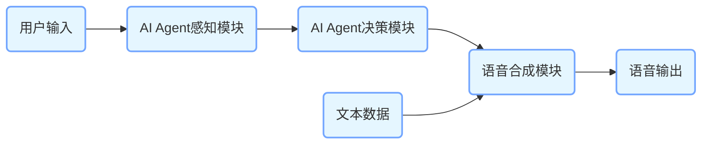

# 开发具有语音合成能力的AI Agent

> 关键词：AI Agent、语音合成、自然语言处理、人工智能、深度学习、TTS技术、智能交互

> 摘要：本文围绕开发具有语音合成能力的AI Agent展开，全面深入地介绍了相关技术。从背景出发，阐述了开发目的、适用读者等内容。详细讲解了核心概念与联系，包括语音合成和AI Agent的原理及架构。通过Python源代码深入剖析核心算法原理与具体操作步骤，用数学模型和公式辅助理解。以实际项目为例，展示开发环境搭建、源代码实现及解读。探讨了其实际应用场景，推荐了学习资源、开发工具框架和相关论文著作。最后总结未来发展趋势与挑战，并提供常见问题解答及参考资料，旨在为开发者提供全面的技术指导。

## 1. 背景介绍 
### 1.1 目的和范围
随着人工智能技术的飞速发展，AI Agent在各个领域的应用越来越广泛。具有语音合成能力的AI Agent能够实现更加自然、便捷的人机交互，为用户带来更好的体验。本文章的目的在于详细介绍开发具有语音合成能力的AI Agent的技术和方法，范围涵盖从基础概念到实际项目开发的全过程，包括核心算法原理、数学模型、实际应用场景等方面。

### 1.2 预期读者
本文预期读者包括对人工智能、自然语言处理、语音合成技术感兴趣的开发者、研究人员，以及希望深入了解相关技术原理和实现方法的技术爱好者。对于有一定编程基础，特别是熟悉Python语言的读者，理解起来会更加容易。

### 1.3 文档结构概述
本文首先介绍开发具有语音合成能力的AI Agent的背景信息，包括目的、预期读者和文档结构。接着阐述核心概念与联系，包括语音合成和AI Agent的原理及架构。然后深入讲解核心算法原理和具体操作步骤，并用数学模型和公式进行辅助说明。通过实际项目案例展示开发环境搭建、源代码实现和代码解读。之后探讨其实际应用场景，推荐相关的学习资源、开发工具框架和论文著作。最后总结未来发展趋势与挑战，提供常见问题解答和参考资料。

### 1.4 术语表
#### 1.4.1 核心术语定义
- **AI Agent（人工智能代理）**：能够感知环境、进行决策并采取行动以实现特定目标的智能实体。
- **语音合成（Text-to-Speech, TTS）**：将文本信息转换为自然流畅语音的技术。
- **自然语言处理（Natural Language Processing, NLP）**：研究如何让计算机理解和处理人类语言的技术领域。
- **深度学习（Deep Learning）**：一种基于人工神经网络的机器学习方法，能够自动从大量数据中学习特征和模式。

#### 1.4.2 相关概念解释
- **声学模型**：在语音合成中，声学模型用于将文本特征转换为语音的声学特征，如音素、音高、时长等。
- **韵律模型**：负责生成语音的韵律信息，包括语调、语速、停顿等，使合成语音更加自然。
- **端到端语音合成**：一种直接从文本输入生成语音波形的语音合成方法，无需中间的特征转换步骤。

#### 1.4.3 缩略词列表
- **TTS**：Text-to-Speech（语音合成）
- **NLP**：Natural Language Processing（自然语言处理）
- **RNN**：Recurrent Neural Network（循环神经网络）
- **LSTM**：Long Short-Term Memory（长短期记忆网络）
- **GRU**：Gated Recurrent Unit（门控循环单元）

## 2. 核心概念与联系 

### 语音合成原理
语音合成技术主要有两种方法：基于拼接的语音合成和基于参数的语音合成。基于拼接的语音合成是从预先录制的语音库中选取合适的语音片段进行拼接，生成最终的语音。基于参数的语音合成则是通过模型生成语音的声学参数，再由语音合成器将这些参数转换为语音波形。

### AI Agent原理
AI Agent通常由感知模块、决策模块和行动模块组成。感知模块负责获取环境信息，决策模块根据感知到的信息进行推理和决策，行动模块则根据决策结果采取相应的行动。在具有语音合成能力的AI Agent中，语音合成模块作为行动模块的一部分，将决策结果以语音的形式输出。

### 核心概念架构示意图

该示意图展示了具有语音合成能力的AI Agent的基本架构。用户输入信息首先被AI Agent的感知模块接收，然后传递给决策模块进行处理，决策模块根据输入信息做出决策，将决策结果以文本形式传递给语音合成模块，最后由语音合成模块将文本转换为语音输出。

## 3. 核心算法原理 & 具体操作步骤 

### 语音合成算法原理
目前，端到端的语音合成算法在语音合成领域取得了很大的成功。其中，Tacotron系列算法是比较经典的端到端语音合成算法。Tacotron算法主要由编码器、解码器和后处理网络组成。

编码器将输入的文本转换为一系列的特征向量，解码器根据这些特征向量生成语音的声学特征，后处理网络对解码器生成的声学特征进行进一步的处理，得到最终的语音波形。

### Python代码实现Tacotron算法示例
```python
import torch
import torch.nn as nn

# 定义编码器
class Encoder(nn.Module):
    def __init__(self, vocab_size, embedding_dim, hidden_dim):
        super(Encoder, self).__init__()
        self.embedding = nn.Embedding(vocab_size, embedding_dim)
        self.gru = nn.GRU(embedding_dim, hidden_dim, batch_first=True)

    def forward(self, input_seq):
        embedded = self.embedding(input_seq)
        output, hidden = self.gru(embedded)
        return output, hidden

# 定义解码器
class Decoder(nn.Module):
    def __init__(self, input_dim, hidden_dim, output_dim):
        super(Decoder, self).__init__()
        self.gru = nn.GRU(input_dim, hidden_dim, batch_first=True)
        self.fc = nn.Linear(hidden_dim, output_dim)

    def forward(self, input_seq, hidden):
        output, hidden = self.gru(input_seq, hidden)
        output = self.fc(output)
        return output, hidden

# 定义Tacotron模型
class Tacotron(nn.Module):
    def __init__(self, vocab_size, embedding_dim, encoder_hidden_dim, decoder_hidden_dim, output_dim):
        super(Tacotron, self).__init__()
        self.encoder = Encoder(vocab_size, embedding_dim, encoder_hidden_dim)
        self.decoder = Decoder(encoder_hidden_dim, decoder_hidden_dim, output_dim)

    def forward(self, input_seq):
        encoder_output, encoder_hidden = self.encoder(input_seq)
        decoder_output, _ = self.decoder(encoder_output, encoder_hidden)
        return decoder_output

# 示例使用
vocab_size = 100
embedding_dim = 128
encoder_hidden_dim = 256
decoder_hidden_dim = 256
output_dim = 80

model = Tacotron(vocab_size, embedding_dim, encoder_hidden_dim, decoder_hidden_dim, output_dim)
input_seq = torch.randint(0, vocab_size, (1, 10))
output = model(input_seq)
print(output.shape)
```
### 具体操作步骤
1. **数据准备**：收集大量的文本和对应的语音数据，并进行预处理，包括文本的分词、标注，语音的特征提取等。
2. **模型训练**：使用准备好的数据对Tacotron模型进行训练，调整模型的参数，使其能够准确地将文本转换为语音的声学特征。
3. **语音合成**：将训练好的模型用于实际的语音合成任务，输入文本，模型输出语音的声学特征，再通过语音合成器将声学特征转换为语音波形。

## 4. 数学模型和公式 & 详细讲解 & 举例说明 

### 声学模型的数学模型
声学模型的目标是将输入的文本特征 $X$ 转换为语音的声学特征 $Y$。可以用条件概率 $P(Y|X)$ 来表示声学模型，即给定文本特征 $X$ 时，生成声学特征 $Y$ 的概率。

在深度学习中，通常使用神经网络来学习这个条件概率。以Tacotron算法为例，编码器将输入的文本 $X$ 转换为特征向量 $H$，解码器根据 $H$ 生成声学特征 $Y$。可以表示为：
$$H = Encoder(X)$$
$$Y = Decoder(H)$$

### 韵律模型的数学模型
韵律模型主要负责生成语音的韵律信息，如语调、语速等。可以用一个概率模型 $P(R|X,Y)$ 来表示韵律模型，其中 $R$ 表示韵律信息，$X$ 表示文本特征，$Y$ 表示声学特征。

韵律模型通常基于统计机器学习或深度学习方法进行训练，通过学习大量的文本、声学特征和韵律信息之间的关系，来预测合适的韵律信息。

### 举例说明
假设输入的文本为“今天天气很好”，文本特征 $X$ 可以表示为一系列的词向量。编码器将 $X$ 转换为特征向量 $H$，解码器根据 $H$ 生成声学特征 $Y$，如音素序列、音高、时长等。韵律模型根据 $X$ 和 $Y$ 生成韵律信息 $R$，如语调的起伏、语速的快慢等。最后，将声学特征 $Y$ 和韵律信息 $R$ 结合起来，通过语音合成器生成最终的语音。

## 5. 项目实战：代码实际案例和详细解释说明 

### 5.1  开发环境搭建
1. **安装Python**：建议使用Python 3.6及以上版本。可以从Python官方网站下载安装包进行安装。
2. **安装深度学习框架**：本项目使用PyTorch作为深度学习框架，可以使用以下命令进行安装：
```bash
pip install torch torchvision
```
3. **安装语音处理库**：使用`librosa`和`soundfile`库进行语音处理，可以使用以下命令进行安装：
```bash
pip install librosa soundfile
```

### 5.2  源代码详细实现和代码解读
```python
import torch
import torch.nn as nn
import librosa
import soundfile as sf

# 定义编码器
class Encoder(nn.Module):
    def __init__(self, vocab_size, embedding_dim, hidden_dim):
        super(Encoder, self).__init__()
        self.embedding = nn.Embedding(vocab_size, embedding_dim)
        self.gru = nn.GRU(embedding_dim, hidden_dim, batch_first=True)

    def forward(self, input_seq):
        embedded = self.embedding(input_seq)
        output, hidden = self.gru(embedded)
        return output, hidden

# 定义解码器
class Decoder(nn.Module):
    def __init__(self, input_dim, hidden_dim, output_dim):
        super(Decoder, self).__init__()
        self.gru = nn.GRU(input_dim, hidden_dim, batch_first=True)
        self.fc = nn.Linear(hidden_dim, output_dim)

    def forward(self, input_seq, hidden):
        output, hidden = self.gru(input_seq, hidden)
        output = self.fc(output)
        return output, hidden

# 定义Tacotron模型
class Tacotron(nn.Module):
    def __init__(self, vocab_size, embedding_dim, encoder_hidden_dim, decoder_hidden_dim, output_dim):
        super(Tacotron, self).__init__()
        self.encoder = Encoder(vocab_size, embedding_dim, encoder_hidden_dim)
        self.decoder = Decoder(encoder_hidden_dim, decoder_hidden_dim, output_dim)

    def forward(self, input_seq):
        encoder_output, encoder_hidden = self.encoder(input_seq)
        decoder_output, _ = self.decoder(encoder_output, encoder_hidden)
        return decoder_output

# 定义语音合成函数
def synthesize(model, input_seq, sample_rate=22050):
    output = model(input_seq)
    # 将输出的声学特征转换为语音波形
    waveform = librosa.griffinlim(output.squeeze().detach().numpy().T)
    # 保存语音文件
    sf.write('output.wav', waveform, sample_rate)

# 示例使用
vocab_size = 100
embedding_dim = 128
encoder_hidden_dim = 256
decoder_hidden_dim = 256
output_dim = 80

model = Tacotron(vocab_size, embedding_dim, encoder_hidden_dim, decoder_hidden_dim, output_dim)
input_seq = torch.randint(0, vocab_size, (1, 10))
synthesize(model, input_seq)
```
### 5.3  代码解读与分析
1. **编码器**：`Encoder`类将输入的文本序列转换为特征向量。通过`nn.Embedding`层将文本序列中的每个词转换为词向量，然后通过`nn.GRU`层进行特征提取。
2. **解码器**：`Decoder`类根据编码器输出的特征向量生成语音的声学特征。同样使用`nn.GRU`层进行特征处理，最后通过`nn.Linear`层将特征向量转换为声学特征。
3. **Tacotron模型**：`Tacotron`类将编码器和解码器组合在一起，实现从文本到声学特征的转换。
4. **语音合成函数**：`synthesize`函数将模型输出的声学特征转换为语音波形，并保存为音频文件。使用`librosa.griffinlim`函数将声学特征转换为语音波形，使用`soundfile`库保存音频文件。

## 6. 实际应用场景 
### 智能客服
具有语音合成能力的AI Agent可以作为智能客服，通过语音与用户进行交互。用户可以通过语音提出问题，AI Agent通过语音合成技术将回答以语音的形式反馈给用户，提供更加自然、便捷的服务。

### 有声读物
将文本转换为语音的功能可以应用于有声读物领域。AI Agent可以将书籍、文章等文本内容转换为语音，用户可以通过听的方式获取信息，方便在不同场景下使用。

### 导航系统
在导航系统中，AI Agent可以通过语音合成技术将导航指令以语音的形式输出，用户无需查看屏幕即可获取导航信息，提高驾驶安全性。

### 教育领域
在教育领域，AI Agent可以作为智能辅导工具，通过语音合成技术将知识点讲解、题目解析等内容以语音的形式呈现给学生，帮助学生更好地理解和学习。

## 7. 工具和资源推荐
### 7.1 学习资源推荐
#### 7.1.1 书籍推荐
- 《深度学习》（Deep Learning）：由Ian Goodfellow、Yoshua Bengio和Aaron Courville撰写，是深度学习领域的经典教材，介绍了深度学习的基本原理和算法。
- 《自然语言处理入门》：由何晗撰写，适合初学者入门自然语言处理领域，介绍了自然语言处理的基本概念和常用技术。
- 《语音信号处理》：全面介绍了语音信号处理的基本理论和方法，包括语音合成、语音识别等方面的内容。

#### 7.1.2 在线课程
- Coursera上的“Deep Learning Specialization”：由Andrew Ng教授讲授，是深度学习领域的经典在线课程，涵盖了深度学习的各个方面。
- edX上的“Natural Language Processing with Deep Learning”：介绍了自然语言处理中深度学习的应用，包括语音合成、文本生成等内容。
- 中国大学MOOC上的“语音信号处理”：由国内高校教师讲授，系统地介绍了语音信号处理的理论和技术。

#### 7.1.3 技术博客和网站
- arXiv：一个预印本平台，提供了大量的学术论文，包括语音合成、人工智能等领域的最新研究成果。
- Medium：一个技术博客平台，有很多关于人工智能、语音合成的技术文章和经验分享。
- 机器之心：专注于人工智能领域的资讯和技术解读，提供了丰富的人工智能技术文章和行业动态。

### 7.2 开发工具框架推荐
#### 7.2.1 IDE和编辑器
- PyCharm：一款功能强大的Python集成开发环境，提供了代码编辑、调试、版本控制等功能，适合Python开发。
- Visual Studio Code：一款轻量级的代码编辑器，支持多种编程语言，有丰富的插件扩展功能，适合快速开发和调试。

#### 7.2.2 调试和性能分析工具
- TensorBoard：TensorFlow提供的可视化工具，可以用于查看模型的训练过程、性能指标等信息。
- PyTorch Profiler：PyTorch提供的性能分析工具，可以帮助开发者分析模型的性能瓶颈，优化代码。

#### 7.2.3 相关框架和库
- PyTorch：一个开源的深度学习框架，提供了丰富的神经网络模型和优化算法，适合语音合成模型的开发。
- TensorFlow：另一个广泛使用的深度学习框架，具有强大的分布式训练和部署能力。
- librosa：一个用于音频处理的Python库，提供了音频特征提取、音频合成等功能。

### 7.3 相关论文著作推荐
#### 7.3.1 经典论文
- “Tacotron: Towards End-to-End Speech Synthesis”：介绍了Tacotron算法的原理和实现，是端到端语音合成领域的经典论文。
- “WaveNet: A Generative Model for Raw Audio”：提出了