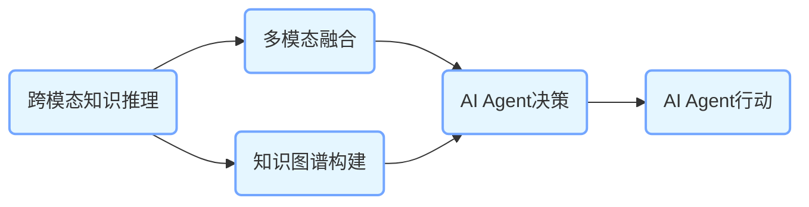

# 开发具有跨模态知识推理能力的AI Agent

> 关键词：跨模态知识推理、AI Agent、多模态融合、深度学习、知识图谱

> 摘要：本文聚焦于开发具有跨模态知识推理能力的AI Agent这一前沿课题。首先介绍了该研究的背景、目的、预期读者和文档结构，明确了相关术语。接着阐述了跨模态知识推理和AI Agent的核心概念及联系，给出了原理和架构的文本示意图与Mermaid流程图。详细讲解了核心算法原理，并通过Python代码示例进行说明，同时介绍了相关数学模型和公式。在项目实战部分，提供了开发环境搭建步骤、源代码实现及解读。探讨了该技术的实际应用场景，推荐了学习资源、开发工具框架和相关论文著作。最后总结了未来发展趋势与挑战，解答了常见问题并给出扩展阅读和参考资料，旨在为开发者和研究者提供全面的技术指导。

## 1. 背景介绍 
### 1.1 目的和范围
随着人工智能技术的不断发展，单一模态的信息处理已经难以满足复杂场景的需求。跨模态知识推理旨在整合多种模态（如图像、文本、音频等）的信息，使AI Agent能够更全面、深入地理解世界，并进行有效的推理和决策。本文章的目的是详细介绍开发具有跨模态知识推理能力的AI Agent的技术原理、实现步骤和应用场景，范围涵盖从基础概念到实际项目开发的各个方面。

### 1.2 预期读者
本文主要面向对人工智能、深度学习、多模态处理等领域感兴趣的研究者、开发者和学生。具备一定的编程基础和机器学习知识的读者将更容易理解文中的内容，但即使是初学者，通过仔细阅读也能对该领域有一个全面的认识。

### 1.3 文档结构概述
本文将按照以下结构进行组织：首先介绍核心概念与联系，包括跨模态知识推理和AI Agent的原理和架构；接着讲解核心算法原理和具体操作步骤，并给出Python代码示例；然后介绍相关的数学模型和公式，并举例说明；在项目实战部分，详细介绍开发环境搭建、源代码实现和代码解读；探讨实际应用场景；推荐学习资源、开发工具框架和相关论文著作；最后总结未来发展趋势与挑战，解答常见问题并给出扩展阅读和参考资料。

### 1.4 术语表
#### 1.4.1 核心术语定义
- **跨模态知识推理**：指综合多种不同模态（如图像、文本、音频等）的信息，进行知识的获取、整合和推理的过程。
- **AI Agent**：是一种能够感知环境、进行决策并采取行动的智能实体，可以是软件程序、机器人等。
- **多模态融合**：将不同模态的信息进行整合，以获得更全面、准确的信息表示。
- **知识图谱**：是一种以图的形式表示知识的方法，由节点和边组成，节点表示实体，边表示实体之间的关系。

#### 1.4.2 相关概念解释
- **深度学习**：是一种基于人工神经网络的机器学习方法，通过多层神经网络自动学习数据的特征和模式。
- **注意力机制**：是一种在处理序列数据时，能够自动关注重要部分的机制，可以提高模型的性能。
- **Transformer**：是一种基于注意力机制的深度学习模型，在自然语言处理和计算机视觉等领域取得了很好的效果。

#### 1.4.3 缩略词列表
- **CNN**：Convolutional Neural Network，卷积神经网络
- **RNN**：Recurrent Neural Network，循环神经网络
- **LSTM**：Long Short-Term Memory，长短期记忆网络
- **BERT**：Bidirectional Encoder Representations from Transformers，基于Transformer的双向编码器表示

## 2. 核心概念与联系 

### 跨模态知识推理原理
跨模态知识推理的核心在于将不同模态的信息进行有效的融合和转换，以实现对知识的推理。不同模态的信息具有不同的特征和表示方式，例如图像信息通常用像素值表示，文本信息用单词序列表示。为了实现跨模态推理，需要将这些不同的表示方式映射到一个共同的特征空间中，使得不同模态的信息可以进行比较和关联。

### AI Agent架构
AI Agent通常由感知模块、决策模块和行动模块组成。感知模块负责收集环境中的信息，包括不同模态的信息；决策模块根据感知到的信息进行推理和决策；行动模块根据决策结果采取相应的行动。在具有跨模态知识推理能力的AI Agent中，感知模块需要能够处理多种模态的信息，决策模块需要具备跨模态知识推理的能力。

### 文本示意图
```plaintext
          +-------------------+
          |  跨模态知识推理  |
          +-------------------+
                 |
                 v
+-------------------+    +-------------------+
|    多模态融合     |    |    知识图谱构建   |
+-------------------+    +-------------------+
                 |
                 v
+-------------------+
|    AI Agent决策   |
+-------------------+
                 |
                 v
+-------------------+
|    AI Agent行动   |
+-------------------+
```

### Mermaid流程图


## 3. 核心算法原理 & 具体操作步骤 

### 多模态特征提取
多模态特征提取是跨模态知识推理的第一步，其目的是从不同模态的信息中提取有用的特征。对于图像模态，可以使用卷积神经网络（CNN）进行特征提取；对于文本模态，可以使用Transformer模型进行特征提取。

以下是使用Python和PyTorch实现的图像和文本特征提取示例代码：
```python
import torch
import torchvision.models as models
from transformers import BertModel, BertTokenizer

# 图像特征提取
def extract_image_features(image):
    model = models.resnet18(pretrained=True)
    model.eval()
    features = model(image)
    return features

# 文本特征提取
def extract_text_features(text):
    tokenizer = BertTokenizer.from_pretrained('bert-base-uncased')
    model = BertModel.from_pretrained('bert-base-uncased')
    model.eval()
    inputs = tokenizer(text, return_tensors='pt')
    outputs = model(**inputs)
    features = outputs.last_hidden_state.mean(dim=1)
    return features

# 示例使用
image = torch.randn(1, 3, 224, 224)  # 示例图像
text = "This is a sample text."  # 示例文本
image_features = extract_image_features(image)
text_features = extract_text_features(text)
print("Image features shape:", image_features.shape)
print("Text features shape:", text_features.shape)
```

### 多模态融合
多模态融合的方法有很多种，常见的有早期融合、晚期融合和中间融合。早期融合是在特征提取之前将不同模态的信息进行融合；晚期融合是在特征提取之后将不同模态的特征进行融合；中间融合则是在特征提取的过程中进行融合。

以下是一个简单的晚期融合示例代码：
```python
def multimodal_fusion(image_features, text_features):
    fused_features = torch.cat((image_features, text_features), dim=1)
    return fused_features

fused_features = multimodal_fusion(image_features, text_features)
print("Fused features shape:", fused_features.shape)
```

### 跨模态知识推理
跨模态知识推理可以基于知识图谱进行，通过将多模态融合后的特征与知识图谱中的实体和关系进行匹配和推理。可以使用图神经网络（GNN）来处理知识图谱，并进行推理。

以下是一个简单的跨模态知识推理示例代码：
```python
import torch.nn as nn
import torch.nn.functional as F

class KnowledgeReasoning(nn.Module):
    def __init__(self, input_dim, output_dim):
        super(KnowledgeReasoning, self).__init__()
        self.fc = nn.Linear(input_dim, output_dim)

    def forward(self, fused_features):
        logits = self.fc(fused_features)
        probabilities = F.softmax(logits, dim=1)
        return probabilities

# 示例使用
input_dim = fused_features.shape[1]
output_dim = 10  # 示例输出维度
reasoning_model = KnowledgeReasoning(input_dim, output_dim)
output = reasoning_model(fused_features)
print("Output shape:", output.shape)
```

## 4. 数学模型和公式 & 详细讲解 & 举例说明 

### 多模态特征提取的数学模型
#### 图像特征提取
对于图像特征提取，卷积神经网络（CNN）是常用的模型。假设输入图像为 $X \in \mathbb{R}^{C \times H \times W}$，其中 $C$ 是通道数，$H$ 和 $W$ 分别是图像的高度和宽度。CNN通过一系列的卷积层、池化层和全连接层进行特征提取，最终得到图像特征 $F_{image} \in \mathbb{R}^{d_{image}}$，其中 $d_{image}$ 是图像特征的维度。

卷积层的数学公式为：
$$
y_{i,j}^l = \sum_{m=0}^{M-1} \sum_{n=0}^{N-1} x_{i+m,j+n}^{l-1} \cdot w_{m,n}^l + b^l
$$
其中，$y_{i,j}^l$ 是第 $l$ 层卷积层的输出特征图中第 $(i,j)$ 位置的值，$x_{i+m,j+n}^{l-1}$ 是第 $l-1$ 层输入特征图中第 $(i+m,j+n)$ 位置的值，$w_{m,n}^l$ 是卷积核的权重，$b^l$ 是偏置。

#### 文本特征提取
对于文本特征提取，Transformer模型是常用的模型。假设输入文本为 $T = [t_1, t_2, \cdots, t_n]$，其中 $t_i$ 是第 $i$ 个单词的嵌入向量。Transformer模型通过多头注意力机制和前馈神经网络进行特征提取，最终得到文本特征 $F_{text} \in \mathbb{R}^{d_{text}}$，其中 $d_{text}$ 是文本特征的维度。

多头注意力机制的数学公式为：
$$
\text{MultiHead}(Q, K, V) = \text{Concat}(\text{head}_1, \cdots, \text{head}_h)W^O
$$
其中，$\text{head}_i = \text{Attention}(QW_i^Q, KW_i^K, VW_i^V)$，$\text{Attention}(Q, K, V) = \text{softmax}(\frac{QK^T}{\sqrt{d_k}})V$，$Q$、$K$、$V$ 分别是查询、键和值矩阵，$W_i^Q$、$W_i^K$、$W_i^V$ 和 $W^O$ 是可学习的权重矩阵。

### 多模态融合的数学模型
晚期融合是将不同模态的特征进行拼接，数学公式为：
$$
F_{fused} = [F_{image}; F_{text}]
$$
其中，$F_{fused}$ 是融合后的特征，$[;]$ 表示向量拼接操作。

### 跨模态知识推理的数学模型
假设跨模态知识推理模型为一个全连接神经网络，输入为融合后的特征 $F_{fused}$，输出为推理结果 $P$。全连接层的数学公式为：
$$
P = \text{softmax}(W F_{fused} + b)
$$
其中，$W$ 是权重矩阵，$b$ 是偏置向量，$\text{softmax}$ 是激活函数，用于将输出转换为概率分布。

### 举例说明
假设输入图像的特征维度为 $d_{image} = 512$，输入文本的特征维度为 $d_{text} = 768$，则融合后的特征维度为 $d_{fused} = 512 + 768 = 1280$。假设跨模态知识推理模型的输出维度为 $d_{output} = 10$，则权重矩阵 $W$ 的维度为 $10 \times 1280$，偏置向量 $b$ 的维度为 $10$。

## 5. 项目实战：代码实际案例和详细解释说明 

### 5.1  开发环境搭建
#### 安装Python和相关库
首先，需要安装Python 3.x版本。可以从Python官方网站（https://www.python.org/downloads/）下载并安装。

然后，使用pip安装所需的库：
```bash
pip install torch torchvision transformers
```

#### 准备数据集
可以使用公开的多模态数据集，如MNIST（图像和文本标签）、COCO（图像和文本描述）等。下载并解压数据集到指定目录。

### 5.2  源代码详细实现和代码解读
以下是一个完整的开发具有跨模态知识推理能力的AI Agent的示例代码：
```python
import torch
import torch.nn as nn
import torch.optim as optim
from torchvision.datasets import MNIST
from torchvision.transforms import ToTensor
from torch.utils.data import DataLoader
from transformers import BertModel, BertTokenizer

# 图像特征提取
class ImageFeatureExtractor(nn.Module):
    def __init__(self):
        super(ImageFeatureExtractor, self).__init__()
        self.conv1 = nn.Conv2d(1, 16, kernel_size=3, padding=1)
        self.pool = nn.MaxPool2d(2, 2)
        self.conv2 = nn.Conv2d(16, 32, kernel_size=3, padding=1)
        self.fc1 = nn.Linear(32 * 7 * 7, 128)

    def forward(self, x):
        x = self.pool(torch.relu(self.conv1(x)))
        x = self.pool(torch.relu(self.conv2(x)))
        x = x.view(-1, 32 * 7 * 7)
        x = torch.relu(self.fc1(x))
        return x

# 文本特征提取
class TextFeatureExtractor(nn.Module):
    def __init__(self):
        super(TextFeatureExtractor, self).__init__()
        self.bert = BertModel.from_pretrained('bert-base-uncased')

    def forward(self, input_ids, attention_mask):
        outputs = self.bert(input_ids=input_ids, attention_mask=attention_mask)
        features = outputs.last_hidden_state.mean(dim=1)
        return features

# 多模态融合和知识推理
class MultimodalReasoning(nn.Module):
    def __init__(self, image_dim, text_dim, output_dim):
        super(MultimodalReasoning, self).__init__()
        self.fc1 = nn.Linear(image_dim + text_dim, 256)
        self.fc2 = nn.Linear(256, output_dim)

    def forward(self, image_features, text_features):
        fused_features = torch.cat((image_features, text_features), dim=1)
        x = torch.relu(self.fc1(fused_features))
        x = self.fc2(x)
        return x

# 训练函数
def train(model, image_extractor, text_extractor, dataloader, criterion, optimizer, device):
    model.train()
    total_loss = 0
    for images, texts, labels in dataloader:
        images = images.to(device)
        texts = [str(label.item()) for label in labels]
        tokenizer = BertTokenizer.from_pretrained('bert-base-uncased')
        inputs = tokenizer(texts, return_tensors='pt', padding=True, truncation=True)
        input_ids = inputs['input_ids'].to(device)
        attention_mask = inputs['attention_mask'].to(device)
        labels = labels.to(device)

        image_features = image_extractor(images)
        text_features = text_extractor(input_ids, attention_mask)
        outputs = model(image_features, text_features)
        loss = criterion(outputs, labels)

        optimizer.zero_grad()
        loss.backward()
        optimizer.step()

        total_loss += loss.item()

    return total_loss / len(dataloader)

# 主函数
def main():
    device = torch.device("cuda" if torch.cuda.is_available() else "cpu")

    # 加载数据集
    train_dataset = MNIST(root='./data', train=True, transform=ToTensor(), download=True)
    train_dataloader = DataLoader(train_dataset, batch_size=32, shuffle=True)

    # 初始化模型
    image_extractor = ImageFeatureExtractor().to(device)
    text_extractor = TextFeatureExtractor().to(device)
    model = MultimodalReasoning(image_dim=128, text_dim=768, output_dim=10).to(device)

    # 定义损失函数和优化器
    criterion = nn.CrossEntropyLoss()
    optimizer = optim.Adam(model.parameters(), lr=0.001)

    # 训练模型
    num_epochs = 10
    for epoch in range(num_epochs):
        loss = train(model, image_extractor, text_extractor, train_dataloader, criterion, optimizer, device)
        print(f'Epoch {epoch+1}/{num_epochs}, Loss: {loss:.4f}')

if __name__ == "__main__":
    main()
```

### 5.3  代码解读与分析
#### 图像特征提取
`ImageFeatureExtractor` 类使用卷积神经网络（CNN）对图像进行特征提取。通过两个卷积层和一个全连接层，将输入图像转换为128维的特征向量。

#### 文本特征提取
`TextFeatureExtractor` 类使用Bert模型对文本进行特征提取。将输入文本转换为Bert模型的输入格式，经过Bert模型处理后，取最后一层隐藏状态的均值作为文本特征。

#### 多模态融合和知识推理
`MultimodalReasoning` 类将图像特征和文本特征进行拼接，然后通过两个全连接层进行多模态融合和知识推理，最终输出10维的分类结果。

#### 训练函数
`train` 函数用于训练模型。在每个训练步骤中，分别提取图像特征和文本特征，将它们融合后输入到推理模型中，计算损失并进行反向传播更新模型参数。

#### 主函数
`main` 函数负责加载数据集、初始化模型、定义损失函数和优化器，并进行模型训练。

## 6. 实际应用场景 
### 智能客服
具有跨模态知识推理能力的AI Agent可以处理用户的文本、语音和图像等多种模态的输入，更准确地理解用户的意图，提供更智能的服务。例如，用户可以通过发送图片和文字描述来咨询商品信息，AI Agent可以根据图片和文本信息进行推理，给出准确的回答。

### 自动驾驶
在自动驾驶领域，AI Agent需要处理多种模态的传感器数据，如图像、雷达、激光雷达等。通过跨模态知识推理，AI Agent可以更全面地感知环境，做出更准确的决策，提高自动驾驶的安全性和可靠性。

### 医疗诊断
在医疗诊断中，AI Agent可以结合患者的病历、影像资料（如X光、CT等）和症状描述等多种模态的信息，进行疾病的诊断和预测。跨模态知识推理可以帮助医生更准确地判断病情，制定更合理的治疗方案。

### 智能家居
在智能家居系统中，AI Agent可以通过摄像头、麦克风等设备获取用户的图像、语音等信息，实现对家居设备的智能控制。例如，用户可以通过语音指令和手势控制灯光、空调等设备的开关和调节。

## 7. 工具和资源推荐
### 7.1 学习资源推荐
#### 7.1.1 书籍推荐
- 《深度学习》（Deep Learning）：由Ian Goodfellow、Yoshua Bengio和Aaron Courville撰写，是深度学习领域的经典教材，涵盖了深度学习的基本原理、算法和应用。
- 《人工智能：一种现代的方法》（Artificial Intelligence: A Modern Approach）：由Stuart Russell和Peter Norvig撰写，是人工智能领域的权威教材，介绍了人工智能的各个方面，包括知识表示、推理、机器学习等。
- 《多模态机器学习：基础与应用》（Multimodal Machine Learning: Foundations and Applications）：由Paul Pu Liang和Tatsuya Harada编辑，全面介绍了多模态机器学习的理论和方法。

#### 7.1.2 在线课程
- Coursera上的“深度学习专项课程”（Deep Learning Specialization）：由Andrew Ng教授授课，包括深度学习的基础知识、卷积神经网络、循环神经网络等内容。
- edX上的“人工智能导论”（Introduction to Artificial Intelligence）：由麻省理工学院（MIT）的Patrick Winston教授授课，介绍了人工智能的基本概念、算法和应用。
- 中国大学MOOC上的“机器学习”（Machine Learning）：由清华大学的周志华教授授课，讲解了机器学习的基本理论和方法。

#### 7.1.3 技术博客和网站
- Medium上的Towards Data Science：是一个专注于数据科学和机器学习的技术博客，提供了大量的教程、案例和研究成果。
- arXiv.org：是一个预印本服务器，提供了最新的学术论文，包括人工智能、机器学习、计算机视觉等领域的研究成果。
- GitHub：是一个代码托管平台，上面有很多开源的人工智能项目和代码库，可以学习和参考。

### 7.2 开发工具框架推荐
#### 7.2.1 IDE和编辑器
- PyCharm：是一款专门为Python开发设计的集成开发环境（IDE），提供了代码编辑、调试、版本控制等功能，适合开发大型的Python项目。
- Jupyter Notebook：是一个交互式的开发环境，可以在浏览器中编写和运行Python代码，支持Markdown文本和可视化，适合进行数据分析和模型实验。
- Visual Studio Code：是一款轻量级的代码编辑器，支持多种编程语言，具有丰富的插件和扩展功能，适合快速开发和调试代码。

#### 7.2.2 调试和性能分析工具
- PyTorch Profiler：是PyTorch提供的性能分析工具，可以帮助开发者分析模型的性能瓶颈，优化代码。
- TensorBoard：是TensorFlow提供的可视化工具，可以用于可视化模型的训练过程、损失曲线、准确率等指标，帮助开发者监控和调试模型。
- cProfile：是Python标准库中的性能分析工具，可以分析Python代码的运行时间和函数调用情况，找出性能瓶颈。

#### 7.2.3 相关框架和库
- PyTorch：是一个开源的深度学习框架，提供了丰富的神经网络层和优化算法，支持GPU加速，适合进行深度学习模型的开发和训练。
- TensorFlow：是另一个流行的深度学习框架，具有强大的分布式训练和部署能力，广泛应用于工业界和学术界。
- Transformers：是Hugging Face开发的一个自然语言处理库，提供了多种预训练的Transformer模型，如BERT、GPT等，方便开发者进行文本处理和语言模型的开发。

### 7.3 相关论文著作推荐
#### 7.3.1 经典论文
- “Attention Is All You Need”：提出了Transformer模型，是自然语言处理领域的重要突破。
- “ImageNet Classification with Deep Convolutional Neural Networks”：介绍了AlexNet模型，开启了深度学习在计算机视觉领域的应用热潮。
- “Long Short-Term Memory”：提出了长短期记忆网络（LSTM），解决了循环神经网络（RNN）中的梯度消失和梯度爆炸问题。

#### 7.3.2 最新研究成果
- “Multimodal Transformer for Unaligned Multimodal Language Sequences”：提出了一种用于处理未对齐多模态语言序列的多模态Transformer模型。
- “ViLBERT: Pretraining Task-Agnostic Visiolinguistic Representations for Vision-and-Language Tasks”：提出了ViLBERT模型，用于预训练视觉和语言的联合表示。
- “CLIP: Connecting Text and Images”：提出了CLIP模型，通过对比学习的方法将文本和图像映射到同一个特征空间中。

#### 7.3.3 应用案例分析
- “Medical Image and Text Fusion for Computer-Aided Diagnosis: A Survey”：对医学图像和文本融合在计算机辅助诊断中的应用进行了综述。
- “Autonomous Driving: A Survey of Technical Challenges, Solutions, and Future Directions”：对自动驾驶技术的挑战、解决方案和未来发展方向进行了分析。
- “Smart Home Systems: A Survey”：对智能家居系统的技术和应用进行了综述。

## 8. 总结：未来发展趋势与挑战
### 未来发展趋势
- **更强大的多模态融合方法**：未来的研究将致力于开发更高效、更准确的多模态融合方法，以充分利用不同模态信息之间的互补性。
- **跨模态知识图谱的构建**：构建大规模的跨模态知识图谱，将不同模态的信息进行整合和关联，为跨模态知识推理提供更丰富的知识支持。
- **端到端的跨模态学习**：实现端到端的跨模态学习，从原始的多模态数据直接学习到最终的决策结果，减少中间环节的误差。
- **跨模态知识推理在更多领域的应用**：将跨模态知识推理技术应用到更多的领域，如教育、娱乐、金融等，为这些领域带来新的发展机遇。

### 挑战
- **数据获取和标注的困难**：获取大规模的多模态数据并进行准确的标注是一项具有挑战性的任务，需要耗费大量的时间和人力。
- **计算资源的需求**：跨模态知识推理通常需要处理大量的数据和复杂的模型，对计算资源的需求较高，需要开发更高效的算法和优化技术。
- **语义鸿沟问题**：不同模态的信息之间存在语义鸿沟，如何有效地将它们进行映射和关联是一个亟待解决的问题。
- **模型的可解释性**：深度学习模型通常是黑盒模型，缺乏可解释性，在一些对安全性和可靠性要求较高的领域，如医疗和自动驾驶，模型的可解释性是一个重要的挑战。

## 9. 附录：常见问题与解答
### 问题1：跨模态知识推理和传统的单模态推理有什么区别？
跨模态知识推理综合了多种不同模态的信息进行推理，而传统的单模态推理只使用单一模态的信息。跨模态知识推理可以利用不同模态信息之间的互补性，获得更全面、准确的推理结果。

### 问题2：如何选择合适的多模态融合方法？
选择合适的多模态融合方法需要考虑数据的特点、任务的需求和模型的复杂度等因素。早期融合适用于数据维度较低、模态之间相关性较强的情况；晚期融合适用于数据维度较高、模态之间相关性较弱的情况；中间融合则可以在特征提取的过程中进行融合，结合了早期融合和晚期融合的优点。

### 问题3：跨模态知识推理模型的训练需要注意什么？
在训练跨模态知识推理模型时，需要注意以下几点：
- 数据的预处理：对不同模态的数据进行预处理，使其具有相同的格式和尺度。
- 模型的初始化：合理初始化模型的参数，避免梯度消失或梯度爆炸问题。
- 损失函数的选择：选择合适的损失函数，根据任务的需求进行调整。
- 训练的超参数调整：调整学习率、批次大小、训练轮数等超参数，以获得最佳的训练效果。

### 问题4：跨模态知识推理技术在实际应用中面临哪些挑战？
跨模态知识推理技术在实际应用中面临以下挑战：
- 数据的质量和一致性：不同模态的数据可能存在质量差异和不一致性，需要进行数据清洗和预处理。
- 计算资源的限制：跨模态知识推理需要处理大量的数据和复杂的模型，对计算资源的需求较高。
- 模型的可解释性：深度学习模型通常是黑盒模型，缺乏可解释性，在一些对安全性和可靠性要求较高的领域，需要提高模型的可解释性。
- 隐私和安全问题：多模态数据可能包含用户的敏感信息，需要采取相应的措施保护用户的隐私和安全。

## 10. 扩展阅读 & 参考资料
### 扩展阅读
- 《多模态机器学习：从基础到前沿》
- 《人工智能中的知识表示与推理》
- 《计算机视觉中的多模态融合技术》

### 参考资料
- Goodfellow, I., Bengio, Y., & Courville, A. (2016). Deep Learning. MIT Press.
- Russell, S. J., & Norvig, P. (2020). Artificial Intelligence: A Modern Approach. Pearson.
- Liang, P. P., & Harada, T. (Eds.). (2021). Multimodal Machine Learning: Foundations and Applications. Springer.

作者：AI天才研究院/AI Genius Institute & 禅与计算机程序设计艺术 /Zen And The Art of Computer Programming