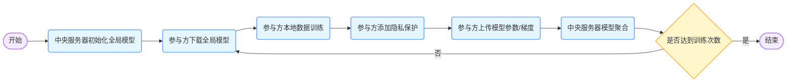

# 开发具有隐私保护联邦学习能力的AI Agent

> 关键词：隐私保护、联邦学习、AI Agent、数据安全、分布式学习

> 摘要：本文聚焦于开发具有隐私保护联邦学习能力的AI Agent这一前沿课题。首先介绍了开发此类AI Agent的背景信息，包括目的、预期读者等内容。接着详细阐述了隐私保护、联邦学习以及AI Agent的核心概念与联系，给出了相应的原理和架构示意图及流程图。深入讲解了核心算法原理，用Python代码进行了详细说明，并给出了相关的数学模型和公式。通过项目实战，提供了开发环境搭建、源代码实现与解读。分析了实际应用场景，推荐了学习、开发相关的工具和资源，最后总结了未来发展趋势与挑战，并对常见问题进行了解答。

## 1. 背景介绍 
### 1.1 目的和范围
在当今数字化时代，数据隐私和安全问题日益凸显。大量敏感数据分散在不同的机构和用户手中，传统的集中式数据处理方式不仅面临数据泄露的风险，还可能受到法律法规的限制。联邦学习作为一种新兴的分布式机器学习技术，允许在不共享原始数据的情况下进行模型训练，有效保护了数据隐私。而AI Agent是一种能够自主感知环境、做出决策并执行动作的智能实体。开发具有隐私保护联邦学习能力的AI Agent，旨在结合两者的优势，使AI Agent能够在保护数据隐私的前提下，利用多个数据源进行学习和进化，提高其智能水平和应用范围。

本文的范围涵盖了从核心概念的介绍、算法原理的分析、数学模型的推导，到项目实战的实现和实际应用场景的探讨，为开发者提供全面的指导，帮助他们掌握开发具有隐私保护联邦学习能力的AI Agent的技术和方法。

### 1.2 预期读者
本文预期读者主要包括以下几类人群：
- 人工智能开发者：希望了解如何将隐私保护和联邦学习技术融入到AI Agent的开发中，提升AI Agent的性能和安全性。
- 数据科学家：对分布式机器学习和数据隐私保护感兴趣，希望通过联邦学习的方式处理多源数据，挖掘数据的潜在价值。
- 研究人员：从事人工智能、机器学习、隐私保护等领域的研究工作，关注前沿技术的发展和应用，寻求新的研究方向和突破。
- 企业技术决策者：需要评估和引入新技术，以提升企业的竞争力和数据安全水平，对具有隐私保护联邦学习能力的AI Agent的应用前景和商业价值感兴趣。

### 1.3 文档结构概述
本文将按照以下结构进行组织：
- 核心概念与联系：介绍隐私保护、联邦学习和AI Agent的核心概念，以及它们之间的联系，通过文本示意图和Mermaid流程图进行直观展示。
- 核心算法原理 & 具体操作步骤：详细讲解实现隐私保护联邦学习的核心算法原理，并用Python源代码进行具体阐述。
- 数学模型和公式 & 详细讲解 & 举例说明：给出相关的数学模型和公式，进行详细的推导和解释，并通过具体的例子说明其应用。
- 项目实战：代码实际案例和详细解释说明：包括开发环境搭建、源代码的详细实现和代码解读，帮助读者将理论知识应用到实际项目中。
- 实际应用场景：分析具有隐私保护联邦学习能力的AI Agent在不同领域的实际应用场景。
- 工具和资源推荐：推荐学习、开发相关的工具和资源，包括书籍、在线课程、技术博客、开发工具、框架和库以及相关论文著作。
- 总结：未来发展趋势与挑战：总结开发具有隐私保护联邦学习能力的AI Agent的未来发展趋势和面临的挑战。
- 附录：常见问题与解答：对读者可能遇到的常见问题进行解答。
- 扩展阅读 & 参考资料：提供相关的扩展阅读材料和参考资料，方便读者进一步深入学习。

### 1.4 术语表
#### 1.4.1 核心术语定义
- **隐私保护（Privacy Protection）**：指采取一系列技术和措施，确保数据在收集、存储、处理和传输过程中不被泄露、滥用，保护数据所有者的隐私权益。
- **联邦学习（Federated Learning）**：一种分布式机器学习技术，允许在多个参与方之间进行模型训练，而无需共享原始数据。参与方在本地对自己的数据进行训练，然后将模型参数或梯度上传到中央服务器进行聚合，最终得到一个全局模型。
- **AI Agent（人工智能代理）**：是一种能够自主感知环境、根据环境信息做出决策并执行相应动作的智能实体。它可以是软件程序、机器人或其他形式的智能设备。
- **数据加密（Data Encryption）**：将原始数据转换为密文的过程，只有使用正确的密钥才能将密文还原为原始数据，从而保证数据在传输和存储过程中的安全性。
- **差分隐私（Differential Privacy）**：一种严格的隐私定义，通过在数据中添加噪声来保护个体数据的隐私，同时保证数据分析结果的准确性。

#### 1.4.2 相关概念解释
- **分布式系统（Distributed System）**：由多个独立的计算机节点组成的系统，这些节点通过网络进行通信和协作，共同完成一个或多个任务。联邦学习就是一种典型的分布式系统应用。
- **模型聚合（Model Aggregation）**：在联邦学习中，中央服务器将各个参与方上传的模型参数或梯度进行合并，得到一个全局模型的过程。常见的聚合方法包括平均法、加权平均法等。
- **本地训练（Local Training）**：参与方在自己的本地设备上使用自己的数据对模型进行训练的过程。本地训练可以减少数据传输量，提高训练效率，同时保护数据隐私。

#### 1.4.3 缩略词列表
- **FL（Federated Learning）**：联邦学习
- **DP（Differential Privacy）**：差分隐私
- **AI（Artificial Intelligence）**：人工智能
- **ML（Machine Learning）**：机器学习

## 2. 核心概念与联系 

### 核心概念原理

#### 隐私保护
隐私保护的核心原理是通过各种技术手段对数据进行处理，使得数据在使用过程中不泄露敏感信息。常见的隐私保护技术包括数据加密、匿名化、差分隐私等。数据加密是将数据转换为密文，只有授权的用户才能解密获取原始数据；匿名化是通过去除数据中的个人标识信息，使得数据无法直接关联到特定的个体；差分隐私则是在数据查询结果中添加噪声，以保证查询结果的统计特性不受单个个体数据的影响。

#### 联邦学习
联邦学习的原理是将模型训练过程分布到多个参与方的本地设备上，每个参与方使用自己的数据进行本地训练，然后将训练得到的模型参数或梯度上传到中央服务器。中央服务器对这些参数或梯度进行聚合，得到一个全局模型，并将全局模型下发给各个参与方。参与方使用全局模型更新自己的本地模型，然后继续进行下一轮的本地训练。这样，在不共享原始数据的情况下，各个参与方可以共同训练一个全局模型。

#### AI Agent
AI Agent的原理是基于感知、决策和执行的循环过程。AI Agent通过传感器感知环境信息，将感知到的信息输入到决策模块中，决策模块根据预先设定的规则或学习到的模型做出决策，然后将决策结果发送到执行模块，执行模块根据决策结果执行相应的动作。在执行动作的过程中，AI Agent会不断地感知环境的变化，调整自己的决策和动作，以适应环境的动态变化。

### 架构的文本示意图

```plaintext
+---------------------+
| 中央服务器          |
|                     |
| 模型聚合模块        |
| 全局模型存储模块    |
+---------------------+
          |
          | 模型参数/梯度传输
          |
+---------------------+   +---------------------+   +---------------------+
| 参与方1（AI Agent） |   | 参与方2（AI Agent） |   | 参与方3（AI Agent） |
|                     |   |                     |   |                     |
| 本地数据存储模块    |   | 本地数据存储模块    |   | 本地数据存储模块    |
| 本地模型训练模块    |   | 本地模型训练模块    |   | 本地模型训练模块    |
| 隐私保护模块        |   | 隐私保护模块        |   | 隐私保护模块        |
+---------------------+   +---------------------+   +---------------------+
```

### Mermaid流程图



## 3. 核心算法原理 & 具体操作步骤 

### 核心算法原理

#### 联邦平均算法（Federated Averaging, FedAvg）
联邦平均算法是联邦学习中最常用的算法之一，其核心思想是通过多次迭代，让各个参与方在本地进行模型训练，然后将本地模型的参数上传到中央服务器进行平均，得到全局模型的参数。具体步骤如下：
1. 中央服务器初始化全局模型的参数 $\theta_0$。
2. 对于每一轮迭代 $t = 1, 2, \cdots, T$：
    - 中央服务器将全局模型的参数 $\theta_{t - 1}$ 发送给各个参与方。
    - 每个参与方 $k$ 在本地使用自己的数据 $D_k$ 对模型进行 $E$ 轮的训练，得到本地模型的参数 $\theta_{k, t}$。
    - 各个参与方将本地模型的参数 $\theta_{k, t}$ 上传到中央服务器。
    - 中央服务器根据各个参与方的本地模型参数，计算全局模型的参数 $\theta_t$：
$$\theta_t = \sum_{k = 1}^{K} \frac{n_k}{n} \theta_{k, t}$$
其中，$K$ 是参与方的数量，$n_k$ 是参与方 $k$ 的数据量，$n = \sum_{k = 1}^{K} n_k$ 是所有参与方的数据总量。

### 具体操作步骤及Python源代码

```python
import numpy as np
from sklearn.linear_model import SGDClassifier

# 模拟参与方数据
def generate_local_data(num_samples, num_features):
    X = np.random.randn(num_samples, num_features)
    y = np.random.randint(0, 2, num_samples)
    return X, y

# 参与方本地训练
def local_train(X, y, global_model, num_epochs):
    local_model = SGDClassifier()
    local_model.coef_ = global_model.coef_
    local_model.intercept_ = global_model.intercept_
    for _ in range(num_epochs):
        local_model.partial_fit(X, y, classes=[0, 1])
    return local_model

# 中央服务器模型聚合
def model_aggregation(local_models, data_sizes):
    total_size = sum(data_sizes)
    global_coef = np.zeros_like(local_models[0].coef_)
    global_intercept = np.zeros_like(local_models[0].intercept_)
    for i, model in enumerate(local_models):
        weight = data_sizes[i] / total_size
        global_coef += weight * model.coef_
        global_intercept += weight * model.intercept_
    global_model = SGDClassifier()
    global_model.coef_ = global_coef
    global_model.intercept_ = global_intercept
    return global_model

# 联邦学习主函数
def federated_learning(num_parties, num_samples_per_party, num_features, num_epochs_per_party, num_rounds):
    # 初始化全局模型
    global_model = SGDClassifier()
    data_sizes = []
    local_models = []
    for _ in range(num_parties):
        X, y = generate_local_data(num_samples_per_party, num_features)
        data_sizes.append(len(y))
        local_model = local_train(X, y, global_model, num_epochs_per_party)
        local_models.append(local_model)
    for round in range(num_rounds):
        global_model = model_aggregation(local_models, data_sizes)
        local_models = []
        for _ in range(num_parties):
            X, y = generate_local_data(num_samples_per_party, num_features)
            local_model = local_train(X, y, global_model, num_epochs_per_party)
            local_models.append(local_model)
    return global_model

# 运行联邦学习
num_parties = 3
num_samples_per_party = 100
num_features = 10
num_epochs_per_party = 5
num_rounds = 10
final_model = federated_learning(num_parties, num_samples_per_party, num_features, num_epochs_per_party, num_rounds)
print("Final model coefficients:", final_model.coef_)
print("Final model intercept:", final_model.intercept_)
```

### 代码解释
1. `generate_local_data` 函数：用于生成模拟的本地数据，包括特征矩阵 $X$ 和标签向量 $y$。
2. `local_train` 函数：参与方在本地使用自己的数据对模型进行训练，通过 `partial_fit` 方法进行多轮训练。
3. `model_aggregation` 函数：中央服务器对各个参与方上传的本地模型参数进行聚合，根据数据量的比例计算全局模型的参数。
4. `federated_learning` 函数：联邦学习的主函数，包括初始化全局模型、进行多轮迭代训练和模型聚合。
5. 最后，调用 `federated_learning` 函数运行联邦学习，并输出最终模型的系数和截距。

## 4. 数学模型和公式 & 详细讲解 & 举例说明 

### 联邦平均算法的数学模型

#### 目标函数
在联邦学习中，我们的目标是最小化所有参与方的损失函数之和：
$$\min_{\theta} \sum_{k = 1}^{K} \frac{n_k}{n} L_k(\theta)$$
其中，$\theta$ 是模型的参数，$K$ 是参与方的数量，$n_k$ 是参与方 $k$ 的数据量，$n = \sum_{k = 1}^{K} n_k$ 是所有参与方的数据总量，$L_k(\theta)$ 是参与方 $k$ 的损失函数。

#### 梯度下降更新规则
在本地训练过程中，每个参与方使用梯度下降法更新本地模型的参数：
$$\theta_{k, t + 1} = \theta_{k, t} - \eta \nabla L_k(\theta_{k, t})$$
其中，$\theta_{k, t}$ 是参与方 $k$ 在第 $t$ 轮迭代时的模型参数，$\eta$ 是学习率，$\nabla L_k(\theta_{k, t})$ 是参与方 $k$ 在第 $t$ 轮迭代时的损失函数的梯度。

#### 模型聚合公式
中央服务器在每一轮迭代结束后，根据各个参与方的本地模型参数，计算全局模型的参数：
$$\theta_t = \sum_{k = 1}^{K} \frac{n_k}{n} \theta_{k, t}$$

### 详细讲解

#### 目标函数的意义
目标函数 $\sum_{k = 1}^{K} \frac{n_k}{n} L_k(\theta)$ 表示所有参与方的平均损失，通过最小化这个目标函数，我们可以得到一个在所有参与方的数据上都表现良好的全局模型。

#### 梯度下降更新规则的作用
梯度下降法是一种常用的优化算法，通过不断地沿着损失函数的负梯度方向更新模型的参数，使得损失函数逐渐减小。在本地训练过程中，每个参与方使用自己的数据计算损失函数的梯度，并根据梯度下降规则更新本地模型的参数。

#### 模型聚合公式的原理
模型聚合公式 $\theta_t = \sum_{k = 1}^{K} \frac{n_k}{n} \theta_{k, t}$ 是根据各个参与方的数据量进行加权平均的结果。数据量越大的参与方，其本地模型的参数对全局模型的影响越大。这样可以保证全局模型能够充分利用各个参与方的数据信息。

### 举例说明

假设有两个参与方，参与方 1 有 100 个样本，参与方 2 有 200 个样本。在某一轮迭代中，参与方 1 的本地模型参数为 $\theta_1 = [1, 2]$，参与方 2 的本地模型参数为 $\theta_2 = [3, 4]$。则全局模型的参数 $\theta$ 计算如下：
$$n_1 = 100, n_2 = 200, n = n_1 + n_2 = 300$$
$$\theta = \frac{n_1}{n} \theta_1 + \frac{n_2}{n} \theta_2 = \frac{100}{300} [1, 2] + \frac{200}{300} [3, 4] = [\frac{1}{3} + \frac{6}{3}, \frac{2}{3} + \frac{8}{3}] = [\frac{7}{3}, \frac{10}{3}]$$

## 5. 项目实战：代码实际案例和详细解释说明 

### 5.1  开发环境搭建

#### 操作系统
推荐使用 Linux 或 macOS 操作系统，因为这些操作系统对机器学习和深度学习的开发支持较好。如果使用 Windows 操作系统，也可以进行开发，但可能需要额外的配置。

#### 编程语言和环境
- **Python**：Python 是机器学习和深度学习领域最常用的编程语言，推荐使用 Python 3.7 及以上版本。
- **Anaconda**：Anaconda 是一个用于科学计算的 Python 发行版，包含了许多常用的科学计算库和工具。可以从 Anaconda 官方网站下载并安装 Anaconda。

#### 安装必要的库
在安装好 Anaconda 后，可以使用以下命令安装必要的库：
```sh
pip install numpy scikit-learn tensorflow
```
- `numpy`：用于数值计算和数组操作。
- `scikit-learn`：提供了许多常用的机器学习算法和工具。
- `tensorflow`：一个开源的深度学习框架，用于构建和训练深度学习模型。

### 5.2  源代码详细实现和代码解读

```python
import numpy as np
import tensorflow as tf
from tensorflow.keras.models import Sequential
from tensorflow.keras.layers import Dense

# 模拟参与方数据
def generate_local_data(num_samples, num_features):
    X = np.random.randn(num_samples, num_features)
    y = np.random.randint(0, 2, num_samples)
    return X, y

# 构建模型
def build_model(num_features):
    model = Sequential([
        Dense(10, activation='relu', input_shape=(num_features,)),
        Dense(1, activation='sigmoid')
    ])
    model.compile(optimizer='adam', loss='binary_crossentropy', metrics=['accuracy'])
    return model

# 参与方本地训练
def local_train(X, y, global_model, num_epochs):
    local_model = build_model(X.shape[1])
    local_model.set_weights(global_model.get_weights())
    local_model.fit(X, y, epochs=num_epochs, verbose=0)
    return local_model

# 中央服务器模型聚合
def model_aggregation(local_models, data_sizes):
    total_size = sum(data_sizes)
    global_weights = [np.zeros_like(w) for w in local_models[0].get_weights()]
    for i, model in enumerate(local_models):
        weight = data_sizes[i] / total_size
        for j in range(len(global_weights)):
            global_weights[j] += weight * model.get_weights()[j]
    global_model = build_model(local_models[0].input_shape[1])
    global_model.set_weights(global_weights)
    return global_model

# 联邦学习主函数
def federated_learning(num_parties, num_samples_per_party, num_features, num_epochs_per_party, num_rounds):
    # 初始化全局模型
    global_model = build_model(num_features)
    data_sizes = []
    local_models = []
    for _ in range(num_parties):
        X, y = generate_local_data(num_samples_per_party, num_features)
        data_sizes.append(len(y))
        local_model = local_train(X, y, global_model, num_epochs_per_party)
        local_models.append(local_model)
    for round in range(num_rounds):
        global_model = model_aggregation(local_models, data_sizes)
        local_models = []
        for _ in range(num_parties):
            X, y = generate_local_data(num_samples_per_party, num_features)
            local_model = local_train(X, y, global_model, num_epochs_per_party)
            local_models.append(local_model)
    return global_model

# 运行联邦学习
num_parties = 3
num_samples_per_party = 100
num_features = 10
num_epochs_per_party = 5
num_rounds = 10
final_model = federated_learning(num_parties, num_samples_per_party, num_features, num_epochs_per_party, num_rounds)
print("Final model evaluation:")
X_test, y_test = generate_local_data(100, num_features)
loss, accuracy = final_model.evaluate(X_test, y_test)
print(f"Loss: {loss}, Accuracy: {accuracy}")
```

### 代码解读

#### `generate_local_data` 函数
该函数用于生成模拟的本地数据，包括特征矩阵 $X$ 和标签向量 $y$。使用 `numpy` 库生成随机的特征矩阵和标签向量。

#### `build_model` 函数
该函数用于构建一个简单的神经网络模型，包含一个输入层、一个隐藏层和一个输出层。使用 `tensorflow.keras` 库构建模型，并使用 `adam` 优化器和 `binary_crossentropy` 损失函数进行编译。

#### `local_train` 函数
该函数用于参与方在本地使用自己的数据对模型进行训练。首先，根据全局模型的参数初始化本地模型的参数，然后使用本地数据对本地模型进行训练。

#### `model_aggregation` 函数
该函数用于中央服务器对各个参与方上传的本地模型参数进行聚合。根据各个参与方的数据量进行加权平均，得到全局模型的参数。

#### `federated_learning` 函数
该函数是联邦学习的主函数，包括初始化全局模型、进行多轮迭代训练和模型聚合。在每一轮迭代中，各个参与方在本地进行训练，然后将本地模型的参数上传到中央服务器进行聚合。

#### 主程序
最后，调用 `federated_learning` 函数运行联邦学习，并使用测试数据对最终模型进行评估，输出损失和准确率。

## 6. 实际应用场景 

### 医疗领域
在医疗领域，各个医院拥有大量的患者数据，但由于数据隐私和安全问题，这些数据不能直接共享。具有隐私保护联邦学习能力的AI Agent可以在不共享患者原始数据的情况下，联合多个医院的数据进行模型训练。例如，训练一个疾病诊断模型，通过联邦学习可以利用更多的患者数据提高模型的准确性和泛化能力，同时保护患者的隐私。

### 金融领域
金融机构拥有大量的客户交易数据，这些数据包含了客户的敏感信息。通过联邦学习，不同的金融机构可以在保护客户隐私的前提下，共同训练风险评估模型、反欺诈模型等。例如，多个银行可以联合训练一个反欺诈模型，利用各自的交易数据提高模型的识别能力，及时发现潜在的欺诈行为。

### 物联网领域
物联网设备产生了大量的数据，这些数据分布在不同的设备和用户手中。具有隐私保护联邦学习能力的AI Agent可以在物联网设备上进行本地训练，然后将模型参数上传到中央服务器进行聚合。例如，在智能家居系统中，多个智能设备可以联合训练一个环境感知模型，根据用户的习惯和环境信息自动调节设备的运行状态，提高用户的生活舒适度。

### 教育领域
教育机构拥有大量的学生学习数据，如学习成绩、学习行为等。通过联邦学习，不同的教育机构可以在保护学生隐私的前提下，共同训练学生学习预测模型、个性化教学模型等。例如，多个学校可以联合训练一个学生学习预测模型，根据学生的历史学习数据预测学生的未来学习成绩，为学生提供个性化的学习建议。

## 7. 工具和资源推荐
### 7.1 学习资源推荐
#### 7.1.1 书籍推荐
- 《联邦学习》：全面介绍了联邦学习的基本概念、算法原理、应用场景和未来发展趋势，是学习联邦学习的经典书籍。
- 《Python机器学习》：详细介绍了Python在机器学习领域的应用，包括数据处理、模型训练、评估和优化等方面的知识，适合初学者入门。
- 《深度学习》：由深度学习领域的三位顶尖专家撰写，系统地介绍了深度学习的基本原理、算法和应用，是深度学习领域的权威著作。

#### 7.1.2 在线课程
- Coursera上的“深度学习专项课程”：由吴恩达教授主讲，包括深度学习基础、卷积神经网络、循环神经网络等多个模块，内容丰富，讲解详细。
- edX上的“联邦学习”课程：由知名高校的教授授课，深入介绍了联邦学习的理论和实践，提供了丰富的案例和实验。
- 中国大学MOOC上的“人工智能基础”课程：适合初学者入门，介绍了人工智能的基本概念、算法和应用，为进一步学习联邦学习和AI Agent打下基础。

#### 7.1.3 技术博客和网站
- Medium：一个知名的技术博客平台，上面有很多关于联邦学习、人工智能和机器学习的优质文章，作者来自世界各地的技术专家和研究人员。
- arXiv：一个预印本服务器，提供了大量的学术论文，包括联邦学习、隐私保护和AI Agent等领域的最新研究成果。
- 开源中国：国内知名的开源技术社区，上面有很多关于人工智能和机器学习的技术文章和项目案例，适合国内开发者学习和交流。

### 7.2 开发工具框架推荐
#### 7.2.1 IDE和编辑器
- PyCharm：一款专门为Python开发设计的集成开发环境，提供了代码编辑、调试、版本控制等功能，支持多种Python库和框架，是Python开发者的首选工具。
- Jupyter Notebook：一个基于Web的交互式开发环境，支持Python、R等多种编程语言，适合进行数据分析、模型训练和可视化等工作。
- Visual Studio Code：一款轻量级的代码编辑器，支持多种编程语言和插件扩展，具有丰富的代码编辑和调试功能，深受开发者喜爱。

#### 7.2.2 调试和性能分析工具
- TensorBoard：TensorFlow提供的可视化工具，可以帮助开发者监控模型的训练过程、可视化模型的结构和参数、分析模型的性能等。
- Py-Spy：一个用于分析Python程序性能的工具，可以实时监测Python程序的CPU使用率、函数调用时间等信息，帮助开发者找出性能瓶颈。
- cProfile：Python标准库中的性能分析模块，可以统计Python程序中各个函数的调用次数、执行时间等信息，帮助开发者优化代码性能。

#### 7.2.3 相关框架和库
- TensorFlow Federated：Google开发的一个用于联邦学习的开源框架，提供了丰富的API和工具，支持多种联邦学习算法和模型，方便开发者进行联邦学习的开发和实验。
- PySyft：一个用于隐私保护机器学习的开源库，提供了差分隐私、同态加密等多种隐私保护技术的实现，支持在PyTorch和TensorFlow等深度学习框架上进行开发。
- OpenMined：一个开源社区，致力于推动隐私保护机器学习和联邦学习的发展，提供了一系列的工具和资源，包括教程、案例和代码库等。

### 7.3 相关论文著作推荐
#### 7.3.1 经典论文
- 《Communication-Efficient Learning of Deep Networks from Decentralized Data》：首次提出了联邦平均算法（FedAvg），为联邦学习的发展奠定了基础。
- 《Differential Privacy: A Survey of Results》：对差分隐私的基本概念、算法和应用进行了全面的综述，是差分隐私领域的经典论文。
- 《Artificial Intelligence: A Modern Approach》：人工智能领域的经典教材，系统地介绍了人工智能的基本概念、算法和应用，对AI Agent的研究和开发具有重要的指导意义。

#### 7.3.2 最新研究成果
- 《Advances in Federated Learning》：收集了联邦学习领域的最新研究成果，包括算法改进、隐私保护技术、应用场景拓展等方面的内容。
- 《Privacy-Preserving Machine Learning》：关注隐私保护机器学习的最新研究进展，介绍了多种隐私保护技术在机器学习中的应用。
- 《AI Agents in Complex Environments》：探讨了AI Agent在复杂环境中的学习和决策问题，提出了一些新的算法和模型。

#### 7.3.3 应用案例分析
- 《Federated Learning in Healthcare: Challenges and Opportunities》：分析了联邦学习在医疗领域的应用案例，讨论了面临的挑战和机遇。
- 《Financial Fraud Detection Using Federated Learning》：介绍了联邦学习在金融欺诈检测中的应用案例，展示了联邦学习在金融领域的应用价值。
- 《IoT Security with Federated Learning》：探讨了联邦学习在物联网安全中的应用案例，提出了一些新的安全解决方案。

## 8. 总结：未来发展趋势与挑战

### 未来发展趋势

#### 算法优化
未来，联邦学习算法将不断优化，提高训练效率和模型性能。例如，研究更高效的模型聚合算法，减少通信开销；开发自适应的学习率调整策略，提高模型的收敛速度。

#### 隐私保护技术升级
随着数据隐私保护需求的不断增加，隐私保护技术将不断升级。例如，研究更严格的差分隐私机制，提供更强的隐私保护；结合同态加密和多方安全计算等技术，实现更高级别的隐私保护。

#### 跨领域融合
具有隐私保护联邦学习能力的AI Agent将与其他领域的技术进行更深入的融合，如区块链、物联网、边缘计算等。例如，结合区块链技术实现数据的可信共享和管理；利用物联网设备进行分布式数据采集和本地训练；借助边缘计算技术提高模型的训练和推理效率。

#### 应用场景拓展
未来，具有隐私保护联邦学习能力的AI Agent将在更多的领域得到应用，如交通、能源、农业等。例如，在交通领域，联合多个交通部门的数据训练智能交通管理模型，提高交通效率；在能源领域，利用多个能源企业的数据优化能源分配和管理。

### 挑战

#### 通信开销
联邦学习需要在多个参与方之间进行频繁的通信，传输模型参数和梯度，这会带来较大的通信开销。如何减少通信开销，提高通信效率，是联邦学习面临的一个重要挑战。

#### 数据异构性
不同参与方的数据可能存在异构性，如数据分布不同、特征维度不同等。数据异构性会影响模型的训练效果和性能，如何处理数据异构性，提高模型的泛化能力，是联邦学习需要解决的问题。

#### 隐私保护与模型性能的平衡
在保证数据隐私的前提下，如何提高模型的性能，是一个需要平衡的问题。过于严格的隐私保护措施可能会降低模型的准确性和泛化能力，而过于宽松的隐私保护措施则可能会导致数据泄露。

#### 系统安全
联邦学习系统涉及多个参与方和大量的数据传输，系统安全是一个重要的问题。如何防止恶意攻击、数据篡改和模型中毒等安全问题，保障系统的稳定性和可靠性，是联邦学习面临的挑战之一。

## 9. 附录：常见问题与解答

### 1. 联邦学习和传统机器学习有什么区别？
传统机器学习通常需要将所有的数据集中到一个中心服务器进行训练，而联邦学习则允许在不共享原始数据的情况下，在多个参与方的本地设备上进行模型训练，然后将模型参数或梯度上传到中央服务器进行聚合。联邦学习可以有效保护数据隐私，减少数据传输量，但也面临通信开销大、数据异构性等问题。

### 2. 如何选择合适的隐私保护技术？
选择合适的隐私保护技术需要考虑多个因素，如数据的敏感程度、模型的性能要求、计算资源和通信带宽等。常见的隐私保护技术包括数据加密、匿名化、差分隐私等。如果数据非常敏感，可以选择使用同态加密等强隐私保护技术；如果对模型性能要求较高，可以选择使用差分隐私等相对较弱的隐私保护技术。

### 3. 联邦学习的训练时间会比传统机器学习长吗？
一般来说，联邦学习的训练时间会比传统机器学习长，因为联邦学习需要在多个参与方之间进行多次通信和模型聚合，这会增加训练的时间开销。但是，通过优化算法和通信协议，可以减少训练时间，提高训练效率。

### 4. 如何评估具有隐私保护联邦学习能力的AI Agent的性能？
可以从多个方面评估具有隐私保护联邦学习能力的AI Agent的性能，如模型的准确性、泛化能力、隐私保护程度、训练效率等。可以使用一些常用的评估指标，如准确率、召回率、F1值等，来评估模型的准确性；使用交叉验证等方法来评估模型的泛化能力；使用差分隐私预算等指标来评估隐私保护程度。

### 5. 联邦学习需要哪些硬件和软件环境？
联邦学习需要一定的硬件和软件环境支持。硬件方面，需要具备足够的计算资源和存储容量，以支持模型的训练和数据的存储。软件方面，需要安装Python等编程语言和相关的机器学习库，如TensorFlow、PyTorch等。此外，还需要使用一些通信协议和工具，如HTTP、MQTT等，来实现参与方之间的通信。

## 10. 扩展阅读 & 参考资料

### 扩展阅读
- 《隐私计算：原理、技术与应用》：深入介绍了隐私计算的基本原理、技术和应用，包括联邦学习、同态加密、多方安全计算等内容。
- 《人工智能中的不确定性》：探讨了人工智能中的不确定性问题，介绍了概率图模型、贝叶斯网络等方法，对理解和处理数据的不确定性具有重要意义。
- 《智能体系统：原理与应用》：详细介绍了AI Agent的基本概念、体系结构、学习和决策方法，以及在不同领域的应用案例。

### 参考资料
- [TensorFlow Federated官方文档](https://www.tensorflow.org/federated)
- [PySyft官方文档](https://github.com/OpenMined/PySyft)
- [Federated Learning GitHub仓库](https://github.com/google-research/federated)

作者：AI天才研究院/AI Genius Institute & 禅与计算机程序设计艺术 /Zen And The Art of Computer Programming