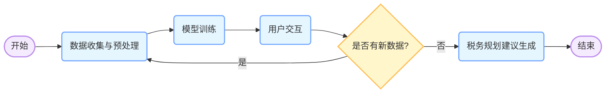

# 开发基于AI的智能税务规划助手

> 关键词：AI、智能税务规划助手、税务算法、机器学习、自然语言处理、项目实战、应用场景

> 摘要：本文旨在深入探讨开发基于AI的智能税务规划助手的相关技术和方法。首先介绍了开发该助手的背景，包括目的、预期读者、文档结构和术语表。接着阐述了核心概念与联系，展示了其架构原理和流程。详细讲解了核心算法原理，通过Python代码进行说明，并给出了数学模型和公式。在项目实战部分，介绍了开发环境搭建、源代码实现和代码解读。分析了该助手的实际应用场景，推荐了学习资源、开发工具框架和相关论文著作。最后总结了未来发展趋势与挑战，并提供了常见问题解答和扩展阅读参考资料。

## 1. 背景介绍 
### 1.1 目的和范围
随着税务法规的日益复杂和企业、个人对税务规划需求的增加，开发基于AI的智能税务规划助手具有重要的现实意义。本项目的目的是开发一个能够利用人工智能技术，为用户提供准确、高效税务规划建议的智能助手。其范围涵盖了个人所得税、企业所得税、增值税等主要税种的规划，支持多种税务场景的分析和优化。

### 1.2 预期读者
本文的预期读者包括税务专业人士、软件开发人员、企业财务管理人员以及对人工智能在税务领域应用感兴趣的研究者。税务专业人士可以通过了解该助手的功能和实现原理，更好地利用技术手段提升税务规划的效率和质量；软件开发人员可以借鉴本文的技术方案和代码实现，开发类似的智能应用；企业财务管理人员可以借助该助手进行合理的税务规划，降低税务成本；研究者可以在此基础上开展更深入的学术研究。

### 1.3 文档结构概述
本文将按照以下结构进行阐述：首先介绍开发智能税务规划助手的背景信息，包括目的、预期读者和文档结构；接着详细讲解核心概念与联系，包括其架构原理和流程；然后介绍核心算法原理和具体操作步骤，通过Python代码进行说明；随后给出数学模型和公式，并进行详细讲解和举例说明；在项目实战部分，介绍开发环境搭建、源代码实现和代码解读；分析该助手的实际应用场景；推荐学习资源、开发工具框架和相关论文著作；最后总结未来发展趋势与挑战，提供常见问题解答和扩展阅读参考资料。

### 1.4 术语表
#### 1.4.1 核心术语定义
- **智能税务规划助手**：利用人工智能技术，为用户提供税务规划建议和解决方案的软件系统。
- **机器学习**：让计算机通过数据学习模式和规律，从而实现预测和决策的技术。
- **自然语言处理**：使计算机能够理解和处理人类语言的技术。
- **税务规划**：在合法合规的前提下，通过对经营、投资、理财等活动的事先筹划和安排，尽可能降低税务成本的行为。

#### 1.4.2 相关概念解释
- **深度学习**：机器学习的一个分支，通过构建多层神经网络来学习数据的深层次特征。
- **数据挖掘**：从大量数据中发现有价值信息和知识的过程。
- **知识图谱**：一种语义网络，用于表示实体之间的关系和知识。

#### 1.4.3 缩略词列表
- **AI**：Artificial Intelligence，人工智能
- **ML**：Machine Learning，机器学习
- **NLP**：Natural Language Processing，自然语言处理
- **DNN**：Deep Neural Network，深度神经网络

## 2. 核心概念与联系 
### 核心概念原理
智能税务规划助手的核心原理是结合机器学习和自然语言处理技术，对税务法规、政策和历史数据进行分析和学习，从而为用户提供个性化的税务规划建议。具体来说，该助手通过以下几个步骤实现其功能：
1. **数据收集与预处理**：收集各种税务法规、政策文件、企业财务数据和个人收入数据等，并进行清洗、转换和标注等预处理操作，以便后续的机器学习模型能够更好地处理。
2. **模型训练**：使用预处理后的数据训练机器学习模型，如决策树、神经网络等，以学习税务规划的模式和规律。
3. **用户交互**：通过自然语言处理技术，实现用户与助手的交互，用户可以通过语音或文本输入问题，助手能够理解用户的意图并提供相应的答案和建议。
4. **税务规划建议生成**：根据用户提供的信息和机器学习模型的预测结果，生成个性化的税务规划建议，并向用户展示。

### 架构的文本示意图
智能税务规划助手的架构主要包括以下几个部分：
1. **数据层**：负责收集、存储和管理各种税务相关的数据，包括税务法规、政策文件、企业财务数据和个人收入数据等。
2. **模型层**：使用机器学习和自然语言处理技术，对数据层的数据进行分析和学习，训练各种模型，如税务预测模型、税务规划模型等。
3. **交互层**：提供用户与助手的交互界面，支持语音和文本输入，通过自然语言处理技术理解用户的意图，并将处理结果反馈给用户。
4. **应用层**：根据模型层的预测结果和用户的需求，生成个性化的税务规划建议，并提供相关的报表和分析工具。

### Mermaid 流程图


## 3. 核心算法原理 & 具体操作步骤 
### 核心算法原理
智能税务规划助手主要使用以下几种核心算法：
1. **决策树算法**：决策树是一种基于树结构进行决策的机器学习算法，它可以根据不同的特征和条件进行分类和预测。在税务规划中，决策树可以用于分析不同税务场景下的最优方案。
2. **神经网络算法**：神经网络是一种模仿人类神经系统的机器学习算法，它可以通过多层神经元的连接和计算，学习数据的深层次特征和模式。在税务规划中，神经网络可以用于预测税务风险和税务成本。
3. **自然语言处理算法**：自然语言处理算法包括词法分析、句法分析、语义理解等技术，它可以使计算机理解和处理人类语言。在智能税务规划助手中，自然语言处理算法可以用于实现用户与助手的交互，理解用户的问题并提供相应的答案。

### 具体操作步骤
#### 步骤 1：数据收集与预处理
```python
import pandas as pd
from sklearn.preprocessing import StandardScaler

# 读取税务数据
data = pd.read_csv('tax_data.csv')

# 数据清洗，去除缺失值
data = data.dropna()

# 特征选择，选择与税务规划相关的特征
features = ['income', 'expenses', 'deductions']
X = data[features]

# 数据标准化
scaler = StandardScaler()
X_scaled = scaler.fit_transform(X)
```
#### 步骤 2：模型训练
```python
from sklearn.tree import DecisionTreeClassifier
from sklearn.model_selection import train_test_split

# 划分训练集和测试集
y = data['tax_plan']
X_train, X_test, y_train, y_test = train_test_split(X_scaled, y, test_size=0.2, random_state=42)

# 训练决策树模型
model = DecisionTreeClassifier()
model.fit(X_train, y_train)
```
#### 步骤 3：用户交互
```python
import nltk
from nltk.tokenize import word_tokenize
from nltk.corpus import stopwords
import string

# 下载必要的nltk数据
nltk.download('punkt')
nltk.download('stopwords')

# 定义用户交互函数
def user_interaction():
    while True:
        user_input = input("请输入您的问题（输入'退出'结束对话）：")
        if user_input == '退出':
            break
        # 文本预处理
        tokens = word_tokenize(user_input.lower())
        stop_words = set(stopwords.words('english') + list(string.punctuation))
        filtered_tokens = [token for token in tokens if token not in stop_words]
        # 处理用户问题
        # 这里可以根据具体需求进行实现
        print("正在处理您的问题，请稍候...")

# 启动用户交互
user_interaction()
```
#### 步骤 4：税务规划建议生成
```python
# 定义税务规划建议生成函数
def generate_tax_plan(user_input):
    # 对用户输入进行预处理
    input_features = preprocess_user_input(user_input)
    # 使用训练好的模型进行预测
    tax_plan = model.predict([input_features])
    # 根据预测结果生成建议
    if tax_plan[0] == '方案A':
        return "建议您选择方案A，该方案可以有效降低您的税务成本。"
    else:
        return "建议您选择方案B，该方案更适合您的情况。"

# 示例调用
user_input = {'income': 100000, 'expenses': 20000, 'deductions': 5000}
suggestion = generate_tax_plan(user_input)
print(suggestion)
```

## 4. 数学模型和公式 & 详细讲解 & 举例说明 
### 决策树算法的数学模型和公式
决策树算法的核心是构建一棵决策树，通过对特征的划分和判断，将数据划分到不同的类别中。决策树的构建过程通常使用信息增益、基尼指数等指标来选择最优的划分特征。

#### 信息增益
信息增益是衡量划分前后信息不确定性减少程度的指标，其计算公式为：
$$IG(D, A) = H(D) - H(D|A)$$
其中，$IG(D, A)$ 表示特征 $A$ 对数据集 $D$ 的信息增益，$H(D)$ 表示数据集 $D$ 的信息熵，$H(D|A)$ 表示在特征 $A$ 条件下数据集 $D$ 的条件熵。

信息熵的计算公式为：
$$H(D) = -\sum_{i=1}^{n}p_i\log_2p_i$$
其中，$p_i$ 表示数据集 $D$ 中第 $i$ 类样本的比例。

条件熵的计算公式为：
$$H(D|A) = \sum_{j=1}^{m}\frac{|D_j|}{|D|}H(D_j)$$
其中，$D_j$ 表示数据集 $D$ 中特征 $A$ 取值为第 $j$ 个值的子集，$|D_j|$ 表示子集 $D_j$ 的样本数量，$|D|$ 表示数据集 $D$ 的样本数量。

#### 举例说明
假设有一个数据集 $D$ 包含 10 个样本，分为两类：正类和负类，其中正类样本有 6 个，负类样本有 4 个。现在有一个特征 $A$，其取值有两个：$A_1$ 和 $A_2$，在特征 $A$ 取值为 $A_1$ 的子集中，正类样本有 4 个，负类样本有 1 个；在特征 $A$ 取值为 $A_2$ 的子集中，正类样本有 2 个，负类样本有 3 个。

首先计算数据集 $D$ 的信息熵：
$$p_1 = \frac{6}{10} = 0.6, p_2 = \frac{4}{10} = 0.4$$
$$H(D) = -0.6\log_20.6 - 0.4\log_20.4 \approx 0.971$$

然后计算在特征 $A$ 条件下数据集 $D$ 的条件熵：
$$|D_1| = 5, |D_2| = 5$$
$$p_{11} = \frac{4}{5} = 0.8, p_{12} = \frac{1}{5} = 0.2$$
$$H(D_1) = -0.8\log_20.8 - 0.2\log_20.2 \approx 0.722$$
$$p_{21} = \frac{2}{5} = 0.4, p_{22} = \frac{3}{5} = 0.6$$
$$H(D_2) = -0.4\log_20.4 - 0.6\log_20.6 \approx 0.971$$
$$H(D|A) = \frac{5}{10} \times 0.722 + \frac{5}{10} \times 0.971 \approx 0.847$$

最后计算特征 $A$ 对数据集 $D$ 的信息增益：
$$IG(D, A) = H(D) - H(D|A) = 0.971 - 0.847 = 0.124$$

### 神经网络算法的数学模型和公式
神经网络算法的核心是构建一个多层神经网络，通过神经元之间的连接和计算，学习数据的深层次特征和模式。神经网络的训练过程通常使用反向传播算法来更新神经元的权重和偏置。

#### 神经元模型
神经元是神经网络的基本单元，其数学模型可以表示为：
$$y = f(\sum_{i=1}^{n}w_ix_i + b)$$
其中，$x_i$ 表示输入信号，$w_i$ 表示输入信号的权重，$b$ 表示偏置，$f$ 表示激活函数。

#### 激活函数
常见的激活函数有 sigmoid 函数、ReLU 函数等。

sigmoid 函数的计算公式为：
$$f(x) = \frac{1}{1 + e^{-x}}$$

ReLU 函数的计算公式为：
$$f(x) = \max(0, x)$$

#### 反向传播算法
反向传播算法是一种用于训练神经网络的迭代算法，其核心思想是通过计算损失函数对神经元权重和偏置的梯度，然后根据梯度下降法更新权重和偏置，以最小化损失函数。

损失函数通常使用均方误差（MSE）或交叉熵损失函数。

均方误差的计算公式为：
$$MSE = \frac{1}{n}\sum_{i=1}^{n}(y_i - \hat{y}_i)^2$$
其中，$y_i$ 表示真实值，$\hat{y}_i$ 表示预测值。

交叉熵损失函数的计算公式为：
$$CE = -\sum_{i=1}^{n}y_i\log(\hat{y}_i)$$

#### 举例说明
假设有一个简单的神经网络，包含一个输入层、一个隐藏层和一个输出层，输入层有 2 个神经元，隐藏层有 3 个神经元，输出层有 1 个神经元。输入信号为 $x = [x_1, x_2]$，隐藏层的权重矩阵为 $W_1$，偏置向量为 $b_1$，输出层的权重矩阵为 $W_2$，偏置向量为 $b_2$。

首先计算隐藏层的输出：
$$z_1 = W_1x + b_1$$
$$a_1 = f(z_1)$$
其中，$f$ 为激活函数，如 sigmoid 函数。

然后计算输出层的输出：
$$z_2 = W_2a_1 + b_2$$
$$\hat{y} = f(z_2)$$

假设真实值为 $y$，则可以计算损失函数，如均方误差：
$$MSE = \frac{1}{1}(y - \hat{y})^2$$

接下来使用反向传播算法更新权重和偏置，具体步骤如下：
1. 计算输出层的误差：
$$\delta_2 = (\hat{y} - y)f'(z_2)$$
其中，$f'(z_2)$ 为激活函数 $f$ 在 $z_2$ 处的导数。
2. 计算隐藏层的误差：
$$\delta_1 = W_2^T\delta_2f'(z_1)$$
3. 更新输出层的权重和偏置：
$$W_2 = W_2 - \alpha\delta_2a_1^T$$
$$b_2 = b_2 - \alpha\delta_2$$
4. 更新隐藏层的权重和偏置：
$$W_1 = W_1 - \alpha\delta_1x^T$$
$$b_1 = b_1 - \alpha\delta_1$$
其中，$\alpha$ 为学习率。

## 5. 项目实战：代码实际案例和详细解释说明 
### 5.1  开发环境搭建
#### 操作系统
建议使用 Linux 或 macOS 操作系统，因为这些操作系统对开发环境的支持更好。如果使用 Windows 操作系统，也可以通过安装 Anaconda 等工具来搭建开发环境。

#### Python 版本
建议使用 Python 3.7 及以上版本，因为新版本的 Python 提供了更多的功能和优化。

#### 安装必要的库
可以使用 pip 或 conda 来安装必要的库，以下是一些常用的库：
```bash
pip install pandas scikit-learn nltk tensorflow
```

### 5.2  源代码详细实现和代码解读
#### 数据收集与预处理模块
```python
import pandas as pd
from sklearn.preprocessing import StandardScaler

def data_preprocessing():
    # 读取税务数据
    data = pd.read_csv('tax_data.csv')
    
    # 数据清洗，去除缺失值
    data = data.dropna()
    
    # 特征选择，选择与税务规划相关的特征
    features = ['income', 'expenses', 'deductions']
    X = data[features]
    
    # 数据标准化
    scaler = StandardScaler()
    X_scaled = scaler.fit_transform(X)
    
    return X_scaled, data['tax_plan']

# 调用函数进行数据预处理
X_scaled, y = data_preprocessing()
```
代码解读：
- 首先使用 `pandas` 库读取税务数据文件 `tax_data.csv`。
- 然后使用 `dropna()` 方法去除数据中的缺失值。
- 选择与税务规划相关的特征，如 `income`、`expenses` 和 `deductions`。
- 使用 `StandardScaler` 对特征数据进行标准化处理，以提高模型的训练效果。
- 最后返回标准化后的特征数据和目标变量。

#### 模型训练模块
```python
from sklearn.tree import DecisionTreeClassifier
from sklearn.model_selection import train_test_split

def model_training(X, y):
    # 划分训练集和测试集
    X_train, X_test, y_train, y_test = train_test_split(X, y, test_size=0.2, random_state=42)
    
    # 训练决策树模型
    model = DecisionTreeClassifier()
    model.fit(X_train, y_train)
    
    return model

# 调用函数进行模型训练
model = model_training(X_scaled, y)
```
代码解读：
- 使用 `train_test_split` 函数将数据集划分为训练集和测试集，测试集占比为 20%。
- 创建一个 `DecisionTreeClassifier` 对象，并使用训练集数据对其进行训练。
- 最后返回训练好的模型。

#### 用户交互模块
```python
import nltk
from nltk.tokenize import word_tokenize
from nltk.corpus import stopwords
import string

# 下载必要的nltk数据
nltk.download('punkt')
nltk.download('stopwords')

def user_interaction(model):
    while True:
        user_input = input("请输入您的问题（输入'退出'结束对话）：")
        if user_input == '退出':
            break
        # 文本预处理
        tokens = word_tokenize(user_input.lower())
        stop_words = set(stopwords.words('english') + list(string.punctuation))
        filtered_tokens = [token for token in tokens if token not in stop_words]
        # 处理用户问题
        # 这里可以根据具体需求进行实现
        print("正在处理您的问题，请稍候...")

# 调用函数启动用户交互
user_interaction(model)
```
代码解读：
- 使用 `nltk` 库进行自然语言处理，包括分词和去除停用词。
- 通过一个无限循环，不断接收用户输入的问题，直到用户输入 `退出` 为止。
- 对用户输入的文本进行预处理，将其转换为小写并分词，然后去除停用词。
- 目前只是简单地打印出正在处理的提示信息，实际应用中可以根据具体需求进行实现。

#### 税务规划建议生成模块
```python
import numpy as np

def preprocess_user_input(user_input):
    # 假设用户输入是一个字典，包含 income、expenses 和 deductions
    features = [user_input['income'], user_input['expenses'], user_input['deductions']]
    return np.array(features)

def generate_tax_plan(user_input, model):
    # 对用户输入进行预处理
    input_features = preprocess_user_input(user_input)
    # 使用训练好的模型进行预测
    tax_plan = model.predict([input_features])
    # 根据预测结果生成建议
    if tax_plan[0] == '方案A':
        return "建议您选择方案A，该方案可以有效降低您的税务成本。"
    else:
        return "建议您选择方案B，该方案更适合您的情况。"

# 示例调用
user_input = {'income': 100000, 'expenses': 20000, 'deductions': 5000}
suggestion = generate_tax_plan(user_input, model)
print(suggestion)
```
代码解读：
- `preprocess_user_input` 函数将用户输入的字典转换为特征数组。
- `generate_tax_plan` 函数首先对用户输入进行预处理，然后使用训练好的模型进行预测，最后根据预测结果生成相应的税务规划建议。
- 示例调用中，创建了一个用户输入字典，并调用 `generate_tax_plan` 函数生成建议并打印输出。

### 5.3  代码解读与分析
通过以上代码的实现，我们可以看到智能税务规划助手的主要功能模块：数据预处理、模型训练、用户交互和税务规划建议生成。

- 数据预处理模块负责对税务数据进行清洗、特征选择和标准化处理，以提高模型的训练效果。
- 模型训练模块使用决策树算法对数据进行训练，得到一个可以用于预测税务规划方案的模型。
- 用户交互模块通过自然语言处理技术实现用户与助手的交互，接收用户的问题并进行初步处理。
- 税务规划建议生成模块根据用户输入和训练好的模型，生成个性化的税务规划建议。

整个系统的流程是：首先进行数据预处理，然后训练模型，接着通过用户交互接收用户输入，最后根据用户输入和模型生成税务规划建议。

## 6. 实际应用场景 
### 个人税务规划
对于个人来说，智能税务规划助手可以帮助他们根据自己的收入、支出、扣除项等信息，制定合理的税务规划方案。例如，助手可以根据个人的工资收入、投资收益、住房贷款等情况，建议个人选择合适的扣除项目，以降低个人所得税的缴纳金额。同时，助手还可以提醒个人按时申报纳税，避免逾期罚款。

### 企业税务规划
企业面临着更为复杂的税务环境，智能税务规划助手可以为企业提供全面的税务规划服务。助手可以分析企业的财务数据，包括营业收入、成本费用、资产负债等，结合税收法规和政策，为企业制定最优的税务方案。例如，助手可以建议企业合理安排成本费用的列支，选择合适的税收优惠政策，以降低企业所得税的负担。此外，助手还可以帮助企业进行税务风险评估，提前发现潜在的税务问题并提供解决方案。

### 税务咨询服务
税务专业机构可以利用智能税务规划助手为客户提供更高效、准确的税务咨询服务。助手可以快速回答客户的常见税务问题，如税收法规解读、税务申报流程等。对于复杂的税务问题，助手可以结合客户的具体情况，提供详细的分析和建议，帮助税务专业人员更好地为客户服务。

### 税务培训和教育
智能税务规划助手可以作为一种教学工具，用于税务培训和教育。它可以通过生动形象的方式向学员介绍税务法规和政策，帮助学员理解税务规划的原理和方法。同时，助手还可以提供案例分析和模拟操作，让学员在实践中提高税务规划的能力。

## 7. 工具和资源推荐
### 7.1 学习资源推荐
#### 7.1.1 书籍推荐
- 《Python机器学习实战》：本书介绍了使用Python进行机器学习的基本方法和技巧，包括数据预处理、模型选择、算法实现等内容，适合初学者入门。
- 《自然语言处理入门》：详细讲解了自然语言处理的基本概念、算法和技术，如词法分析、句法分析、语义理解等，对开发智能税务规划助手的用户交互模块有很大帮助。
- 《税务筹划》：全面介绍了税务筹划的理论和实践，包括税务筹划的基本原理、方法和案例分析，有助于深入理解税务规划的本质和方法。

#### 7.1.2 在线课程
- Coursera上的“机器学习”课程：由斯坦福大学教授Andrew Ng主讲，是一门经典的机器学习入门课程，涵盖了机器学习的基本概念、算法和应用。
- edX上的“自然语言处理基础”课程：介绍了自然语言处理的基本技术和方法，包括文本分类、情感分析、机器翻译等。
- 中国大学MOOC上的“税务筹划”课程：由国内知名高校的教授授课，系统讲解了税务筹划的理论和实践。

#### 7.1.3 技术博客和网站
- Medium：上面有很多关于机器学习、自然语言处理和税务技术的优秀博客文章，可以及时了解最新的技术动态和研究成果。
- 博客园：国内知名的技术博客网站，有很多开发者分享的关于Python、机器学习和税务开发的经验和案例。
- 国家税务总局官网：提供了最新的税收法规、政策解读和税务申报指南等信息，是了解税务知识的重要渠道。

### 7.2 开发工具框架推荐
#### 7.2.1 IDE和编辑器
- PyCharm：一款专业的Python集成开发环境，提供了丰富的代码编辑、调试、测试等功能，适合开发大型的Python项目。
- Jupyter Notebook：一种交互式的开发环境，可以将代码、文本、图表等内容整合在一起，方便进行数据分析和模型训练。
- Visual Studio Code：一款轻量级的代码编辑器，支持多种编程语言和插件扩展，具有良好的开发体验。

#### 7.2.2 调试和性能分析工具
- pdb：Python自带的调试工具，可以帮助开发者在代码中设置断点、单步执行、查看变量值等，方便调试代码。
- TensorBoard：TensorFlow提供的可视化工具，可以用于监控模型的训练过程、查看模型的性能指标等。
- cProfile：Python标准库中的性能分析工具，可以分析代码的运行时间和函数调用次数，帮助开发者找出性能瓶颈。

#### 7.2.3 相关框架和库
- Scikit-learn：一个简单易用的机器学习库，提供了丰富的机器学习算法和工具，如分类、回归、聚类等。
- TensorFlow：一个开源的深度学习框架，广泛应用于图像识别、自然语言处理等领域，具有高效的计算能力和灵活的模型构建能力。
- NLTK：一个自然语言处理工具包，提供了丰富的自然语言处理功能和数据集，如分词、词性标注、命名实体识别等。

### 7.3 相关论文著作推荐
#### 7.3.1 经典论文
- “A Decision Tree Approach for Tax Planning Optimization”：提出了一种基于决策树算法的税务规划优化方法，通过对税务数据的分析和建模，实现了税务规划的自动化和智能化。
- “Natural Language Processing for Tax Query Answering”：探讨了自然语言处理技术在税务查询回答中的应用，通过构建税务知识图谱和问答系统，提高了税务查询的效率和准确性。
- “Machine Learning in Tax Risk Assessment”：研究了机器学习算法在税务风险评估中的应用，通过对企业财务数据的分析和建模，实现了对税务风险的准确预测和评估。

#### 7.3.2 最新研究成果
- 近年来，随着人工智能技术的不断发展，越来越多的研究关注于将深度学习、强化学习等技术应用于税务规划和管理中。例如，一些研究提出了基于深度学习的税务预测模型，通过对大量税务数据的学习和分析，提高了税务预测的准确性和可靠性。
- 另一些研究则关注于税务知识图谱的构建和应用，通过将税务法规、政策和案例等知识进行整合和表示，实现了税务知识的智能查询和推理。

#### 7.3.3 应用案例分析
- 一些大型企业和税务机构已经开始应用智能税务规划助手来提高税务管理的效率和质量。例如，某跨国公司通过引入智能税务规划助手，实现了税务数据的自动化分析和税务方案的智能推荐，大大降低了税务成本和风险。
- 某税务咨询机构利用智能税务规划助手为客户提供个性化的税务咨询服务，通过对客户的财务数据和税务需求进行分析，为客户制定了最优的税务规划方案，得到了客户的高度认可。

## 8. 总结：未来发展趋势与挑战
### 未来发展趋势
#### 更强大的人工智能技术应用
随着人工智能技术的不断发展，智能税务规划助手将越来越多地应用深度学习、强化学习等先进技术。深度学习可以处理更复杂的税务数据和模式，提高税务规划的准确性和智能化水平；强化学习可以通过与环境的交互，不断优化税务规划方案，实现动态的税务管理。

#### 与其他系统的集成
智能税务规划助手将与企业的财务管理系统、税务申报系统等进行深度集成，实现数据的实时共享和交互。这样可以提高税务规划的效率和准确性，减少人工操作的错误和风险。同时，与其他系统的集成还可以为企业提供更全面的财务和税务管理解决方案。

#### 个性化服务的提升
未来的智能税务规划助手将更加注重个性化服务，根据用户的不同需求和情况，提供更加精准、定制化的税务规划建议。例如，对于不同行业、不同规模的企业，助手可以提供针对性的税务方案；对于个人用户，助手可以根据其收入来源、家庭状况等因素，制定个性化的税务规划。

#### 国际化应用
随着经济全球化的发展，企业和个人的跨国业务越来越多，税务规划也面临着更加复杂的国际税收环境。未来的智能税务规划助手将具备国际化应用的能力，能够处理不同国家和地区的税收法规和政策，为跨国企业和个人提供全球范围内的税务规划服务。

### 挑战
#### 数据安全和隐私保护
智能税务规划助手需要处理大量的敏感税务数据，如企业财务数据、个人收入信息等，数据安全和隐私保护是一个重要的挑战。开发者需要采取有效的技术手段和管理措施，确保数据的安全性和隐私性，防止数据泄露和滥用。

#### 税收法规的复杂性和变化性
税收法规具有复杂性和变化性，不同国家和地区的税收法规差异较大，而且税收法规也会随着时间的推移不断更新和调整。智能税务规划助手需要及时跟踪和更新税收法规，确保提供的税务规划建议符合最新的法规要求。这对助手的知识更新和维护能力提出了很高的要求。

#### 技术的可解释性和可信度
人工智能技术在税务规划中的应用需要具备可解释性和可信度。税务决策往往涉及到大量的资金和利益，用户需要了解助手给出的税务规划建议的依据和原理。因此，开发者需要研究和开发可解释的人工智能算法，提高技术的透明度和可信度，让用户能够放心使用。

#### 人机协作的挑战
智能税务规划助手虽然可以提供高效、准确的税务规划建议，但在一些复杂的税务问题上，仍然需要税务专业人员的参与和判断。如何实现人机协作，充分发挥人和机器的优势，是一个需要解决的挑战。开发者需要设计合理的人机交互界面和协作机制，让税务专业人员能够与助手进行有效的沟通和协作。

## 9. 附录：常见问题与解答
### 问题 1：智能税务规划助手的准确性如何保证？
答：智能税务规划助手的准确性主要通过以下几个方面来保证：
- 数据质量：收集和使用准确、完整的税务数据，并进行严格的数据清洗和预处理，以提高数据的质量。
- 模型训练：使用合适的机器学习算法和大量的历史数据进行模型训练，并进行交叉验证和评估，以优化模型的性能。
- 法规更新：及时跟踪和更新税收法规和政策，确保助手提供的建议符合最新的法规要求。
- 人工审核：对于一些重要的税务规划建议，由税务专业人员进行审核和验证，以确保建议的准确性和可靠性。

### 问题 2：智能税务规划助手是否可以替代税务专业人员？
答：智能税务规划助手不能完全替代税务专业人员。虽然助手可以提供高效、准确的税务规划建议，但在一些复杂的税务问题上，如税务争议解决、税收筹划的合法性判断等，仍然需要税务专业人员的专业知识和经验。税务专业人员可以结合助手的建议，进行综合分析和判断，为用户提供更加全面、专业的税务服务。

### 问题 3：使用智能税务规划助手需要具备哪些技术知识？
答：对于普通用户来说，使用智能税务规划助手不需要具备太多的技术知识。用户只需要通过简单的界面输入相关的税务信息，即可获得助手提供的税务规划建议。对于开发者来说，需要具备一定的机器学习、自然语言处理和编程知识，以便开发和维护智能税务规划助手。

### 问题 4：智能税务规划助手的数据安全如何保障？
答：智能税务规划助手的数据安全主要通过以下措施来保障：
- 数据加密：对存储和传输的税务数据进行加密处理，防止数据在传输和存储过程中被窃取或篡改。
- 访问控制：设置严格的访问权限，只有授权的人员才能访问和处理税务数据。
- 安全审计：对系统的操作和数据访问进行审计，及时发现和处理异常情况。
- 备份和恢复：定期对税务数据进行备份，以防止数据丢失，并在需要时能够及时恢复数据。

## 10. 扩展阅读 & 参考资料
### 扩展阅读
- 《人工智能：现代方法》：全面介绍了人工智能的基本概念、算法和应用，是人工智能领域的经典教材。
- 《大数据时代：生活、工作与思维的大变革》：探讨了大数据对社会和经济的影响，以及如何利用大数据进行决策和创新。
- 《未来简史：从智人到神人》：对未来社会的发展趋势进行了大胆的预测和思考，涉及到人工智能、生物技术等多个领域。

### 参考资料
- 国家税务总局官网：https://www.chinatax.gov.cn/
- Scikit-learn官方文档：https://scikit-learn.org/stable/
- TensorFlow官方文档：https://www.tensorflow.org/
- NLTK官方文档：https://www.nltk.org/

作者：AI天才研究院/AI Genius Institute & 禅与计算机程序设计艺术 /Zen And The Art of Computer Programming