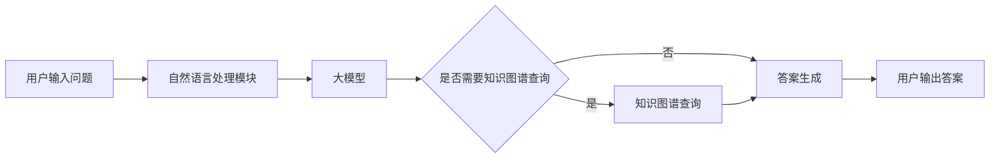

# 开发基于大模型的金融专业考试答疑系统

> 关键词：大模型、金融专业考试、答疑系统、自然语言处理、知识图谱

> 摘要：本文旨在深入探讨如何开发基于大模型的金融专业考试答疑系统。首先介绍了开发该系统的背景，包括目的、预期读者、文档结构和相关术语。接着阐述了核心概念及其联系，给出了系统的架构示意图和流程图。详细讲解了核心算法原理和具体操作步骤，并使用 Python 代码进行了说明。对系统涉及的数学模型和公式进行了推导和举例。通过项目实战展示了系统的开发环境搭建、源代码实现和代码解读。分析了系统的实际应用场景，推荐了相关的学习资源、开发工具框架和论文著作。最后总结了系统未来的发展趋势与挑战，解答了常见问题，并提供了扩展阅读和参考资料。

## 1. 背景介绍 
### 1.1 目的和范围
随着金融行业的不断发展，金融专业考试的难度和复杂度也在逐渐增加。考生在备考过程中常常会遇到各种问题，需要及时得到准确的解答。传统的答疑方式，如咨询老师、查阅书籍等，效率较低，且不能满足考生随时随地获取信息的需求。基于大模型的金融专业考试答疑系统旨在利用先进的自然语言处理技术和大模型的强大能力，为考生提供高效、准确的答疑服务。

本系统的范围主要涵盖金融专业考试的常见科目，如金融学、投资学、财务管理等。系统可以处理各种类型的问题，包括概念解释、计算问题、案例分析等。

### 1.2 预期读者
本文的预期读者包括对自然语言处理、大模型应用和金融科技感兴趣的技术人员，如程序员、软件架构师等；金融专业考试的考生和培训机构的教师，他们可以通过使用本系统提高备考效率和教学质量；以及对金融科技领域的创新应用有研究需求的学者和研究人员。

### 1.3 文档结构概述
本文将按照以下结构进行阐述：
- 核心概念与联系：介绍系统涉及的核心概念，如大模型、知识图谱等，并给出系统的架构示意图和流程图。
- 核心算法原理 & 具体操作步骤：详细讲解系统使用的核心算法，如问答匹配算法、知识推理算法等，并给出 Python 代码示例。
- 数学模型和公式 & 详细讲解 & 举例说明：推导系统涉及的数学模型和公式，如相似度计算、概率推理等，并通过具体例子进行说明。
- 项目实战：代码实际案例和详细解释说明：展示系统的开发环境搭建、源代码实现和代码解读。
- 实际应用场景：分析系统在金融专业考试备考、教学等方面的实际应用场景。
- 工具和资源推荐：推荐相关的学习资源、开发工具框架和论文著作。
- 总结：未来发展趋势与挑战：总结系统的发展趋势和面临的挑战。
- 附录：常见问题与解答：解答读者在开发和使用系统过程中可能遇到的常见问题。
- 扩展阅读 & 参考资料：提供相关的扩展阅读材料和参考资料。

### 1.4 术语表
#### 1.4.1 核心术语定义
- **大模型**：指具有大量参数和强大语言理解与生成能力的预训练语言模型，如 GPT - 3、BERT 等。
- **知识图谱**：一种以图的形式表示知识的结构化数据库，包含实体、关系和属性等信息。
- **自然语言处理（NLP）**：研究如何让计算机理解和处理人类语言的技术领域。
- **问答匹配**：将用户提出的问题与知识库中的问题进行匹配，找出最相关的答案。
- **知识推理**：根据知识库中的已有知识，推导出新的知识或结论。

#### 1.4.2 相关概念解释
- **预训练模型**：在大规模无监督数据上进行训练的模型，具有一定的语言理解和生成能力，可以通过微调应用于特定任务。
- **微调**：在预训练模型的基础上，使用特定任务的有监督数据进行进一步训练，以提高模型在该任务上的性能。
- **嵌入向量**：将文本转换为向量表示，使得文本可以在向量空间中进行计算和比较。

#### 1.4.3 缩略词列表
- **NLP**：Natural Language Processing（自然语言处理）
- **GPT**：Generative Pretrained Transformer（生成式预训练变换器）
- **BERT**：Bidirectional Encoder Representations from Transformers（基于变换器的双向编码器表示）

## 2. 核心概念与联系 

### 核心概念原理
#### 大模型
大模型是基于深度学习的预训练语言模型，通过在大规模文本数据上进行无监督学习，学习到语言的模式和语义信息。大模型通常采用 Transformer 架构，具有强大的并行计算能力和长序列处理能力。在本系统中，大模型可以用于问题理解、答案生成和知识推理等任务。

#### 知识图谱
知识图谱是一种结构化的知识表示方法，将实体、关系和属性以图的形式表示。在金融领域，知识图谱可以包含金融概念、市场数据、法律法规等信息。通过知识图谱，系统可以进行知识推理和查询，为用户提供更准确的答案。

#### 自然语言处理
自然语言处理是实现答疑系统的核心技术，包括文本预处理、分词、词性标注、命名实体识别、语义理解等任务。通过自然语言处理技术，系统可以将用户输入的自然语言问题转换为计算机可以处理的形式，并进行语义分析和推理。

### 架构的文本示意图
```plaintext
用户输入问题 -> 自然语言处理模块 -> 大模型 -> 知识图谱查询 -> 答案生成 -> 用户输出答案
```

### Mermaid 流程图


## 3. 核心算法原理 & 具体操作步骤 

### 问答匹配算法
问答匹配算法的目的是将用户提出的问题与知识库中的问题进行匹配，找出最相关的答案。常用的问答匹配算法有基于词袋模型的匹配算法和基于嵌入向量的匹配算法。

#### 基于词袋模型的匹配算法
词袋模型将文本表示为一个向量，向量的每个维度对应一个词，向量的值表示该词在文本中出现的频率。基于词袋模型的匹配算法通过计算两个向量的相似度来判断两个问题的相关性。

以下是使用 Python 实现基于词袋模型的问答匹配算法的代码示例：
```python
from sklearn.feature_extraction.text import CountVectorizer
from sklearn.metrics.pairwise import cosine_similarity

# 知识库中的问题
questions = ["什么是股票？", "股票的分类有哪些？", "如何进行股票投资？"]
# 用户输入的问题
user_question = "股票是什么？"

# 创建词袋模型
vectorizer = CountVectorizer()
# 将问题转换为向量
question_vectors = vectorizer.fit_transform(questions + [user_question])

# 计算用户问题与知识库中问题的相似度
similarities = cosine_similarity(question_vectors[-1], question_vectors[:-1])

# 找出最相关的问题的索引
most_similar_index = similarities.argmax()

# 输出最相关的问题
print("最相关的问题：", questions[most_similar_index])
```

#### 基于嵌入向量的匹配算法
嵌入向量是将文本转换为低维向量表示，使得文本可以在向量空间中进行计算和比较。基于嵌入向量的匹配算法通过计算两个向量的相似度来判断两个问题的相关性。

以下是使用 Python 和 SentenceTransformer 库实现基于嵌入向量的问答匹配算法的代码示例：
```python
from sentence_transformers import SentenceTransformer
import numpy as np

# 加载预训练的嵌入模型
model = SentenceTransformer('all-MiniLM-L6-v2')

# 知识库中的问题
questions = ["什么是股票？", "股票的分类有哪些？", "如何进行股票投资？"]
# 用户输入的问题
user_question = "股票是什么？"

# 将问题转换为嵌入向量
question_embeddings = model.encode(questions)
user_embedding = model.encode(user_question)

# 计算用户问题与知识库中问题的相似度
similarities = np.dot(user_embedding, question_embeddings.T)

# 找出最相关的问题的索引
most_similar_index = similarities.argmax()

# 输出最相关的问题
print("最相关的问题：", questions[most_similar_index])
```

### 知识推理算法
知识推理算法的目的是根据知识库中的已有知识，推导出新的知识或结论。在本系统中，知识推理算法可以用于解决一些需要逻辑推理的问题，如计算问题、案例分析等。

以下是一个简单的知识推理算法的示例，用于解决金融计算问题：
```python
# 知识库中的知识
knowledge_base = {
    "年利率": 0.05,
    "本金": 10000
}

# 用户输入的问题
user_question = "计算一年后的利息是多少？"

# 提取问题中的关键信息
if "利息" in user_question:
    # 计算利息
    interest = knowledge_base["本金"] * knowledge_base["年利率"]
    print("一年后的利息是：", interest)
```

## 4. 数学模型和公式 & 详细讲解 & 举例说明 

### 相似度计算
在问答匹配算法中，需要计算两个问题的相似度。常用的相似度计算方法有余弦相似度和欧几里得距离。

#### 余弦相似度
余弦相似度是通过计算两个向量的夹角余弦值来衡量它们的相似度。余弦相似度的取值范围是 $[-1, 1]$，值越接近 1 表示两个向量越相似。

余弦相似度的计算公式为：
$$
\cos(\theta) = \frac{\mathbf{A} \cdot \mathbf{B}}{\|\mathbf{A}\| \|\mathbf{B}\|}
$$
其中，$\mathbf{A}$ 和 $\mathbf{B}$ 是两个向量，$\cdot$ 表示向量的点积，$\|\mathbf{A}\|$ 和 $\|\mathbf{B}\|$ 分别表示向量 $\mathbf{A}$ 和 $\mathbf{B}$ 的模。

以下是一个使用 Python 计算余弦相似度的示例：
```python
import numpy as np

# 两个向量
A = np.array([1, 2, 3])
B = np.array([4, 5, 6])

# 计算点积
dot_product = np.dot(A, B)
# 计算向量的模
norm_A = np.linalg.norm(A)
norm_B = np.linalg.norm(B)

# 计算余弦相似度
cosine_similarity = dot_product / (norm_A * norm_B)

print("余弦相似度：", cosine_similarity)
```

#### 欧几里得距离
欧几里得距离是通过计算两个向量之间的直线距离来衡量它们的相似度。欧几里得距离的取值范围是 $[0, +\infty)$，值越小表示两个向量越相似。

欧几里得距离的计算公式为：
$$
d(\mathbf{A}, \mathbf{B}) = \sqrt{\sum_{i=1}^{n} (A_i - B_i)^2}
$$
其中，$\mathbf{A}$ 和 $\mathbf{B}$ 是两个向量，$A_i$ 和 $B_i$ 分别是向量 $\mathbf{A}$ 和 $\mathbf{B}$ 的第 $i$ 个元素，$n$ 是向量的维度。

以下是一个使用 Python 计算欧几里得距离的示例：
```python
import numpy as np

# 两个向量
A = np.array([1, 2, 3])
B = np.array([4, 5, 6])

# 计算欧几里得距离
euclidean_distance = np.linalg.norm(A - B)

print("欧几里得距离：", euclidean_distance)
```

### 概率推理
在知识推理算法中，有时需要进行概率推理。概率推理是根据已知的概率信息，推导出未知事件的概率。

例如，假设有两个事件 $A$ 和 $B$，已知 $P(A) = 0.6$，$P(B|A) = 0.8$，$P(B|\neg A) = 0.3$，求 $P(A|B)$。

根据贝叶斯定理，有：
$$
P(A|B) = \frac{P(B|A)P(A)}{P(B|A)P(A) + P(B|\neg A)P(\neg A)}
$$
其中，$P(\neg A) = 1 - P(A)$。

以下是一个使用 Python 计算 $P(A|B)$ 的示例：
```python
# 已知概率信息
P_A = 0.6
P_B_given_A = 0.8
P_B_given_not_A = 0.3

# 计算 P(¬A)
P_not_A = 1 - P_A

# 计算 P(B)
P_B = P_B_given_A * P_A + P_B_given_not_A * P_not_A

# 计算 P(A|B)
P_A_given_B = (P_B_given_A * P_A) / P_B

print("P(A|B)：", P_A_given_B)
```

## 5. 项目实战：代码实际案例和详细解释说明 

### 5.1  开发环境搭建
#### 安装 Python
首先需要安装 Python 环境，建议使用 Python 3.7 及以上版本。可以从 Python 官方网站（https://www.python.org/downloads/）下载并安装 Python。

#### 安装依赖库
在开发基于大模型的金融专业考试答疑系统时，需要安装一些依赖库，如 `transformers`、`sentence-transformers`、`sklearn` 等。可以使用以下命令进行安装：
```bash
pip install transformers sentence-transformers sklearn
```

### 5.2  源代码详细实现和代码解读
以下是一个简单的基于大模型的金融专业考试答疑系统的源代码示例：
```python
from transformers import AutoTokenizer, AutoModelForQuestionAnswering
import torch

# 加载预训练的模型和分词器
tokenizer = AutoTokenizer.from_pretrained("bert-large-uncased-whole-word-masking-finetuned-squad")
model = AutoModelForQuestionAnswering.from_pretrained("bert-large-uncased-whole-word-masking-finetuned-squad")

# 金融知识文本
context = "股票是股份公司发行的所有权凭证，是股份公司为筹集资金而发行给各个股东作为持股凭证并借以取得股息和红利的一种有价证券。股票可以分为普通股和优先股。普通股是最基本的股票类型，股东享有公司决策参与权、利润分配权、剩余资产分配权等。优先股则在利润分配和剩余资产分配方面享有优先权，但通常没有决策参与权。"

while True:
    # 获取用户输入的问题
    question = input("请输入你的问题（输入 '退出' 结束程序）：")
    if question == "退出":
        break
    
    # 对问题和文本进行编码
    inputs = tokenizer(question, context, return_tensors='pt')
    
    # 使用模型进行推理
    outputs = model(**inputs)
    answer_start_scores = outputs.start_logits
    answer_end_scores = outputs.end_logits
    
    # 找出答案的起始和结束位置
    answer_start = torch.argmax(answer_start_scores)
    answer_end = torch.argmax(answer_end_scores) + 1
    
    # 解码答案
    answer = tokenizer.convert_tokens_to_string(tokenizer.convert_ids_to_tokens(inputs['input_ids'][0][answer_start:answer_end]))
    
    # 输出答案
    print("答案：", answer)
```

### 代码解读与分析
- **加载预训练的模型和分词器**：使用 `transformers` 库加载预训练的 `bert-large-uncased-whole-word-masking-finetuned-squad` 模型和分词器。
- **定义金融知识文本**：定义一个包含金融知识的文本，作为问答系统的知识库。
- **获取用户输入的问题**：使用 `input()` 函数获取用户输入的问题，当用户输入 `退出` 时，程序结束。
- **对问题和文本进行编码**：使用分词器对问题和文本进行编码，将其转换为模型可以处理的输入格式。
- **使用模型进行推理**：将编码后的输入传递给模型，得到答案的起始和结束位置的得分。
- **找出答案的起始和结束位置**：使用 `torch.argmax()` 函数找出得分最高的起始和结束位置。
- **解码答案**：使用分词器将答案的起始和结束位置对应的 token 转换为字符串。
- **输出答案**：将解码后的答案输出给用户。

## 6. 实际应用场景 
### 金融专业考试备考
考生在备考金融专业考试时，可以使用该答疑系统随时获取问题的解答。系统可以提供准确、详细的答案，帮助考生加深对知识点的理解。例如，考生在学习股票相关知识时，遇到“股票的分类有哪些”的问题，系统可以立即给出答案，节省考生查阅资料的时间。

### 金融培训教学
金融培训机构的教师可以使用该答疑系统辅助教学。教师可以将系统作为一个教学工具，在课堂上为学生提供实时的答疑服务。同时，系统可以记录学生的问题和答案，教师可以根据这些数据了解学生的学习情况，调整教学策略。

### 金融知识普及
该答疑系统可以作为一个金融知识普及的平台，向公众提供金融知识的解答。公众可以通过系统了解金融市场、投资、理财等方面的知识，提高金融素养。例如，普通投资者可以通过系统了解股票投资的基本知识和风险，做出更明智的投资决策。

## 7. 工具和资源推荐
### 7.1 学习资源推荐
#### 7.1.1 书籍推荐
- 《自然语言处理入门》：这本书系统地介绍了自然语言处理的基本概念、算法和技术，适合初学者入门。
- 《深度学习》：这本书是深度学习领域的经典著作，详细介绍了深度学习的原理、模型和应用。
- 《金融市场与金融机构》：这本书全面介绍了金融市场和金融机构的基本知识，对于理解金融专业考试的内容有很大帮助。

#### 7.1.2 在线课程
- Coursera 上的“Natural Language Processing Specialization”：该课程由斯坦福大学的教授授课，系统地介绍了自然语言处理的各个方面。
- edX 上的“Deep Learning Specialization”：该课程由吴恩达教授授课，是深度学习领域的经典课程。
- 中国大学 MOOC 上的“金融市场学”：该课程由国内知名高校的教授授课，详细介绍了金融市场的基本知识和理论。

#### 7.1.3 技术博客和网站
- Hugging Face：这是一个专注于自然语言处理和深度学习的开源社区，提供了大量的预训练模型和工具。
- Towards Data Science：这是一个数据科学和机器学习领域的技术博客，发表了很多关于自然语言处理和大模型的文章。
- 金融界：这是一个专业的金融资讯网站，提供了丰富的金融市场数据和分析报告。

### 7.2 开发工具框架推荐
#### 7.2.1 IDE和编辑器
- PyCharm：这是一个专业的 Python 集成开发环境，提供了丰富的代码编辑、调试和分析功能。
- Visual Studio Code：这是一个轻量级的代码编辑器，支持多种编程语言，并且有丰富的插件可以扩展功能。

#### 7.2.2 调试和性能分析工具
- Py-Spy：这是一个用于分析 Python 程序性能的工具，可以帮助开发者找出程序中的性能瓶颈。
- TensorBoard：这是一个用于可视化深度学习模型训练过程的工具，可以帮助开发者监控模型的训练进度和性能。

#### 7.2.3 相关框架和库
- Transformers：这是一个用于自然语言处理的开源库，提供了大量的预训练模型和工具，方便开发者进行模型的加载和微调。
- Sentence-Transformers：这是一个用于文本嵌入的开源库，提供了多种预训练的嵌入模型，可以将文本转换为向量表示。
- Scikit-learn：这是一个用于机器学习的开源库，提供了多种机器学习算法和工具，如分类、回归、聚类等。

### 7.3 相关论文著作推荐
#### 7.3.1 经典论文
- “Attention Is All You Need”：这篇论文提出了 Transformer 架构，是自然语言处理领域的里程碑式论文。
- “BERT: Pre-training of Deep Bidirectional Transformers for Language Understanding”：这篇论文提出了 BERT 模型，是预训练语言模型领域的重要论文。

#### 7.3.2 最新研究成果
- 可以关注 ACL（Association for Computational Linguistics）、EMNLP（Conference on Empirical Methods in Natural Language Processing）等自然语言处理领域的顶级会议，了解最新的研究成果。

#### 7.3.3 应用案例分析
- 可以查阅一些金融科技领域的应用案例分析报告，了解基于大模型的金融应用的实际效果和经验教训。

## 8. 总结：未来发展趋势与挑战
### 未来发展趋势
- **模型性能不断提升**：随着大模型技术的不断发展，模型的性能将不断提升，问答系统的准确性和效率将得到进一步提高。
- **多模态融合**：未来的答疑系统可能会融合图像、语音等多模态信息，提供更加丰富和全面的答疑服务。
- **个性化服务**：根据用户的历史提问记录和学习习惯，为用户提供个性化的答疑服务，提高用户体验。
- **与金融业务深度融合**：答疑系统将与金融业务深度融合，如风险评估、投资建议等，为金融机构提供更加智能的决策支持。

### 挑战
- **数据质量和隐私问题**：大模型的训练需要大量的数据，数据的质量和隐私问题是需要解决的重要挑战。
- **模型可解释性**：大模型通常是黑盒模型，模型的决策过程难以解释，这在金融领域可能会带来一定的风险。
- **计算资源和成本**：大模型的训练和推理需要大量的计算资源，计算成本较高，如何降低计算成本是一个需要解决的问题。
- **知识更新和维护**：金融领域的知识更新较快，如何及时更新和维护知识库，保证答疑系统的准确性和时效性，是一个挑战。

## 9. 附录：常见问题与解答
### 问题 1：如何选择合适的大模型？
答：选择合适的大模型需要考虑多个因素，如模型的性能、适用场景、计算资源等。一般来说，可以根据具体的任务需求选择预训练的模型，如用于问答任务可以选择在问答数据集上微调过的模型。同时，还需要考虑模型的大小和计算资源的限制，选择适合自己的模型。

### 问题 2：如何提高问答系统的准确性？
答：可以从以下几个方面提高问答系统的准确性：
- 使用高质量的训练数据：训练数据的质量直接影响模型的性能，需要选择准确、全面的训练数据。
- 进行模型微调：在预训练模型的基础上，使用特定任务的有监督数据进行微调，可以提高模型在该任务上的性能。
- 引入知识图谱：知识图谱可以提供结构化的知识信息，帮助系统进行知识推理和查询，提高答案的准确性。
- 进行后处理：对模型输出的答案进行后处理，如过滤、排序等，可以提高答案的质量。

### 问题 3：如何处理用户输入的复杂问题？
答：对于用户输入的复杂问题，可以采用以下方法进行处理：
- 进行问题分解：将复杂问题分解为多个简单问题，分别进行解答。
- 引入知识推理：根据知识库中的已有知识，进行推理和推导，得到问题的答案。
- 结合多模型：使用多个模型进行联合推理，提高问题解答的准确性。

### 问题 4：如何保证系统的安全性和稳定性？
答：可以从以下几个方面保证系统的安全性和稳定性：
- 数据加密：对用户输入的问题和系统输出的答案进行加密处理，保证数据的安全性。
- 访问控制：设置不同的用户权限，对系统的访问进行控制，防止非法访问。
- 备份和恢复：定期对系统的数据和模型进行备份，以便在出现问题时能够及时恢复。
- 监控和预警：对系统的运行状态进行监控，及时发现和处理异常情况。

## 10. 扩展阅读 & 参考资料
### 扩展阅读
- 《人工智能时代的金融科技》：这本书介绍了人工智能技术在金融领域的应用和发展趋势。
- 《自然语言处理实战》：这本书通过实际案例介绍了自然语言处理的应用和开发方法。

### 参考资料
- Hugging Face 官方文档：https://huggingface.co/docs
- Sentence-Transformers 官方文档：https://www.sbert.net/
- Scikit-learn 官方文档：https://scikit-learn.org/stable/

作者：AI天才研究院/AI Genius Institute & 禅与计算机程序设计艺术 /Zen And The Art of Computer Programming