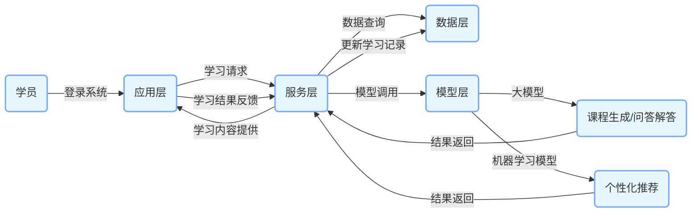

# 开发基于大模型的金融合规培训个性化学习系统

> 关键词：大模型、金融合规培训、个性化学习系统、人工智能、教育培训

> 摘要：本文聚焦于开发基于大模型的金融合规培训个性化学习系统。在金融行业，合规培训至关重要且需求日益增长。传统培训方式存在诸多不足，而大模型的出现为解决这些问题带来了新的契机。文章详细阐述了该系统的背景知识，包括目的、预期读者等；深入分析了核心概念与联系，如大模型与个性化学习的关联；介绍了核心算法原理并给出 Python 代码示例；探讨了相关数学模型和公式；通过项目实战展示了系统的开发过程，包括环境搭建、代码实现与解读；列举了系统的实际应用场景；推荐了学习、开发所需的工具和资源；最后对系统未来发展趋势与挑战进行总结，并提供常见问题解答以及扩展阅读和参考资料，旨在为开发此类系统提供全面且深入的指导。

## 1. 背景介绍 
### 1.1 目的和范围
在金融行业，合规是企业运营的基石。金融法规和政策不断变化，金融机构员工需要持续学习和更新合规知识。传统的金融合规培训方式往往采用统一的课程内容和教学方法，无法满足不同员工的个性化学习需求，导致培训效果参差不齐。本系统的目的是开发一个基于大模型的金融合规培训个性化学习系统，利用大模型强大的语言理解和生成能力，根据每个学员的知识水平、学习进度和学习偏好，提供个性化的学习内容和学习路径，提高培训的针对性和有效性，帮助金融机构员工更好地掌握合规知识，降低合规风险。

本系统的范围涵盖了金融合规培训的各个方面，包括但不限于法律法规、监管要求、业务流程、风险防控等。系统将支持多种学习形式，如在线课程学习、案例分析、模拟考试等，以满足不同学员的学习需求。

### 1.2 预期读者
本文的预期读者主要包括以下几类人群：
1. **金融行业从业者**：如银行、证券、保险等金融机构的员工，他们需要参加金融合规培训，本系统可以为他们提供更高效、个性化的学习体验。
2. **教育培训行业人员**：如培训师、课程开发者等，他们可以借鉴本系统的开发思路和技术实现，开发类似的个性化学习系统。
3. **人工智能和软件开发人员**：他们对大模型的应用和个性化学习系统的开发感兴趣，希望通过本文了解相关技术和实现方法。
4. **金融机构的管理人员**：他们负责制定和实施金融合规培训计划，本系统可以为他们提供一种新的培训解决方案，提高培训效果和管理效率。

### 1.3 文档结构概述
本文将按照以下结构进行组织：
1. **背景介绍**：介绍系统开发的目的、范围、预期读者和文档结构概述。
2. **核心概念与联系**：阐述大模型、金融合规培训和个性化学习的核心概念，以及它们之间的联系。
3. **核心算法原理 & 具体操作步骤**：介绍系统中使用的核心算法原理，并给出具体的操作步骤和 Python 代码示例。
4. **数学模型和公式 & 详细讲解 & 举例说明**：推导系统中涉及的数学模型和公式，并进行详细讲解和举例说明。
5. **项目实战：代码实际案例和详细解释说明**：通过一个实际的项目案例，展示系统的开发过程，包括开发环境搭建、源代码详细实现和代码解读。
6. **实际应用场景**：列举系统的实际应用场景，说明系统在金融合规培训中的作用和价值。
7. **工具和资源推荐**：推荐学习和开发本系统所需的工具和资源，包括书籍、在线课程、技术博客、开发工具、框架和库等。
8. **总结：未来发展趋势与挑战**：总结系统的开发经验和成果，分析未来发展趋势和面临的挑战。
9. **附录：常见问题与解答**：提供常见问题的解答，帮助读者更好地理解和应用本系统。
10. **扩展阅读 & 参考资料**：提供相关的扩展阅读材料和参考资料，供读者进一步深入学习。

### 1.4 术语表
#### 1.4.1 核心术语定义
- **大模型**：指具有大量参数和强大计算能力的人工智能模型，如 GPT - 3、BERT 等，能够处理自然语言理解、生成等复杂任务。
- **金融合规培训**：指金融机构为了确保员工遵守法律法规、监管要求和内部规章制度，对员工进行的相关知识和技能的培训。
- **个性化学习系统**：指根据每个学习者的特征和需求，提供个性化的学习内容、学习路径和学习支持的系统。
- **知识图谱**：一种语义网络，用于表示实体之间的关系和知识，在金融合规培训中可以用于组织和管理合规知识。
- **自适应学习**：根据学习者的学习表现和进度，动态调整学习内容和难度的学习方式。

#### 1.4.2 相关概念解释
- **自然语言处理（NLP）**：是人工智能的一个分支，研究如何让计算机理解和处理人类语言。在本系统中，NLP 技术用于实现课程内容的生成、学员提问的解答等功能。
- **机器学习**：是一门多领域交叉学科，涉及概率论、统计学、逼近论、凸分析、算法复杂度理论等多门学科。它专门研究计算机怎样模拟或实现人类的学习行为，以获取新的知识或技能，重新组织已有的知识结构使之不断改善自身的性能。在本系统中，机器学习算法用于分析学员的学习数据，实现个性化推荐。
- **深度学习**：是机器学习的一个分支领域，它是一种基于对数据进行表征学习的方法。深度学习通过构建具有很多层的神经网络模型，自动从大量数据中学习特征和模式。在本系统中，大模型通常基于深度学习技术构建。

#### 1.4.3 缩略词列表
- **NLP**：Natural Language Processing（自然语言处理）
- **ML**：Machine Learning（机器学习）
- **DL**：Deep Learning（深度学习）
- **GPT**：Generative Pretrained Transformer（生成式预训练变换器）
- **BERT**：Bidirectional Encoder Representations from Transformers（基于变换器的双向编码器表征）

## 2. 核心概念与联系 
### 核心概念原理
#### 大模型
大模型通常基于深度学习技术，特别是Transformer架构。Transformer架构通过自注意力机制（Self - Attention Mechanism）能够捕捉输入序列中不同位置之间的依赖关系，从而在自然语言处理任务中取得了显著的效果。大模型在大规模的文本数据上进行预训练，学习到丰富的语言知识和语义表示。例如，GPT系列模型通过无监督的语言建模任务，预测下一个单词，从而学习到语言的统计规律和语义信息。

#### 金融合规培训
金融合规培训的目的是使金融机构员工了解和遵守相关的法律法规、监管要求和内部规章制度。培训内容通常包括金融法规解读、合规案例分析、业务流程合规操作等。传统的金融合规培训方式往往是统一的课程讲解，缺乏针对性和个性化。

#### 个性化学习系统
个性化学习系统基于学习者的特征和需求，为每个学习者提供定制化的学习内容和学习路径。学习者的特征包括知识水平、学习进度、学习偏好等。系统通过收集和分析学习者的学习数据，利用机器学习算法进行建模和预测，从而实现个性化的学习推荐。

### 架构的文本示意图
本系统的架构主要包括以下几个部分：
1. **数据层**：存储金融合规培训的相关数据，如课程资料、学员学习记录、知识图谱等。
2. **模型层**：包括大模型和机器学习模型。大模型用于课程内容生成、学员提问解答等；机器学习模型用于分析学员的学习数据，实现个性化推荐。
3. **应用层**：提供用户界面，实现学员的学习管理、课程学习、互动交流等功能。
4. **服务层**：负责系统的业务逻辑处理，如数据交互、模型调用、个性化推荐算法实现等。

### Mermaid 流程图


## 3. 核心算法原理 & 具体操作步骤 
### 核心算法原理
#### 个性化推荐算法
本系统采用基于内容的推荐算法和协同过滤算法相结合的方式进行个性化推荐。基于内容的推荐算法根据课程的内容特征和学员的学习历史，计算课程与学员的匹配度；协同过滤算法根据学员之间的相似性，推荐其他相似学员学习过的课程。

#### 自然语言处理算法
在课程内容生成和学员提问解答方面，使用大模型进行自然语言处理。大模型通过预训练学习到的语言知识和语义表示，能够生成高质量的文本内容和准确的回答。

### 具体操作步骤和 Python 代码示例
#### 基于内容的推荐算法
```python
import pandas as pd
from sklearn.feature_extraction.text import TfidfVectorizer
from sklearn.metrics.pairwise import cosine_similarity

# 课程数据
courses = [
    {"id": 1, "title": "金融法规解读", "description": "详细解读金融行业相关法规"},
    {"id": 2, "title": "合规案例分析", "description": "分析金融合规实际案例"},
    {"id": 3, "title": "业务流程合规操作", "description": "介绍金融业务流程中的合规操作要点"}
]

# 学员学习历史
learner_history = [
    {"learner_id": 1, "course_id": 1},
    {"learner_id": 1, "course_id": 2}
]

# 提取课程描述的特征
vectorizer = TfidfVectorizer()
course_descriptions = [course["description"] for course in courses]
tfidf_matrix = vectorizer.fit_transform(course_descriptions)

# 计算课程之间的相似度
cosine_sim = cosine_similarity(tfidf_matrix, tfidf_matrix)

# 根据学员学习历史推荐课程
learner_id = 1
learner_course_ids = [history["course_id"] for history in learner_history if history["learner_id"] == learner_id]
recommended_courses = []
for course_id in learner_course_ids:
    course_index = next((i for i, course in enumerate(courses) if course["id"] == course_id), None)
    if course_index is not None:
        sim_scores = list(enumerate(cosine_sim[course_index]))
        sim_scores = sorted(sim_scores, key=lambda x: x[1], reverse=True)
        sim_scores = sim_scores[1:3]  # 推荐前2个相似课程
        for score in sim_scores:
            recommended_course_id = courses[score[0]]["id"]
            if recommended_course_id not in learner_course_ids and recommended_course_id not in [course["id"] for course in recommended_courses]:
                recommended_courses.append(courses[score[0]])

print("推荐课程：", recommended_courses)
```

#### 大模型调用示例（假设使用 OpenAI GPT - 3）
```python
import openai

# 设置 API 密钥
openai.api_key = "your_api_key"

# 学员提问
question = "金融合规中反洗钱的重要性是什么？"

# 调用 GPT - 3 进行回答
response = openai.Completion.create(
    engine="text-davinci-003",
    prompt=question,
    max_tokens=100
)

answer = response.choices[0].text.strip()
print("回答：", answer)
```

## 4. 数学模型和公式 & 详细讲解 & 举例说明 
### 基于内容的推荐算法数学模型
#### TF - IDF 模型
TF - IDF（Term Frequency - Inverse Document Frequency）是一种用于信息检索与文本挖掘的常用加权技术。TF - IDF 值由两部分组成：词频（TF）和逆文档频率（IDF）。

词频 $TF_{t,d}$ 表示词 $t$ 在文档 $d$ 中出现的频率，计算公式为：
$$TF_{t,d}=\frac{f_{t,d}}{\sum_{t' \in d} f_{t',d}}$$
其中，$f_{t,d}$ 是词 $t$ 在文档 $d$ 中出现的次数。

逆文档频率 $IDF_{t}$ 表示词 $t$ 在整个文档集合中的普遍重要性，计算公式为：
$$IDF_{t}=\log\frac{N}{df_{t}}$$
其中，$N$ 是文档集合中的文档总数，$df_{t}$ 是包含词 $t$ 的文档数。

TF - IDF 值 $TF - IDF_{t,d}$ 是词频和逆文档频率的乘积，计算公式为：
$$TF - IDF_{t,d}=TF_{t,d} \times IDF_{t}$$

#### 余弦相似度
余弦相似度用于计算两个向量之间的相似度，取值范围在 $[-1, 1]$ 之间，值越接近 1 表示越相似。对于两个向量 $\vec{A}$ 和 $\vec{B}$，余弦相似度 $cosine(\vec{A}, \vec{B})$ 的计算公式为：
$$cosine(\vec{A}, \vec{B})=\frac{\vec{A} \cdot \vec{B}}{\|\vec{A}\| \times \|\vec{B}\|}$$
其中，$\vec{A} \cdot \vec{B}$ 是向量 $\vec{A}$ 和 $\vec{B}$ 的点积，$\|\vec{A}\|$ 和 $\|\vec{B}\|$ 分别是向量 $\vec{A}$ 和 $\vec{B}$ 的模。

### 举例说明
假设有两个课程描述文档 $d_1$ 和 $d_2$：
$d_1$: "金融法规解读，详细介绍金融行业法规"
$d_2$: "金融法规分析，深入探讨法规对金融业务的影响"

首先，使用 TF - IDF 模型提取文档的特征向量。假设词汇表为 ["金融法规", "解读", "详细介绍", "行业法规", "分析", "深入探讨", "对金融业务的影响"]，则 $d_1$ 和 $d_2$ 的 TF - IDF 特征向量分别为 $\vec{A}$ 和 $\vec{B}$。

然后，计算 $\vec{A}$ 和 $\vec{B}$ 的余弦相似度。如果余弦相似度较高，说明这两个课程描述相似，可以将它们推荐给学员。

## 5. 项目实战：代码实际案例和详细解释说明 
### 5.1  开发环境搭建
#### 硬件环境
建议使用具有一定计算能力的服务器或云主机，以支持大模型的运行和数据处理。例如，可以选择配置为 Intel Xeon 处理器、16GB 以上内存、500GB 以上硬盘的服务器。

#### 软件环境
- **操作系统**：推荐使用 Linux 系统，如 Ubuntu 18.04 或更高版本。
- **Python 环境**：使用 Python 3.7 或更高版本，可以使用 Anaconda 进行 Python 环境的管理。
- **数据库**：选择关系型数据库如 MySQL 或非关系型数据库如 MongoDB 来存储系统的数据。
- **大模型**：可以选择开源的大模型如 Hugging Face 上的预训练模型，也可以使用商业大模型如 OpenAI GPT - 3。

#### 安装依赖库
```bash
pip install pandas scikit-learn openai
```

### 5.2  源代码详细实现和代码解读
#### 系统架构设计
```python
import pandas as pd
import numpy as np
from sklearn.feature_extraction.text import TfidfVectorizer
from sklearn.metrics.pairwise import cosine_similarity
import openai

# 课程类
class Course:
    def __init__(self, id, title, description):
        self.id = id
        self.title = title
        self.description = description

# 学员类
class Learner:
    def __init__(self, id):
        self.id = id
        self.course_history = []

    def add_course(self, course_id):
        self.course_history.append(course_id)

# 个性化学习系统类
class PersonalizedLearningSystem:
    def __init__(self, courses, learners):
        self.courses = courses
        self.learners = learners
        self.vectorizer = TfidfVectorizer()
        self.tfidf_matrix = self._compute_tfidf_matrix()
        self.cosine_sim = cosine_similarity(self.tfidf_matrix, self.tfidf_matrix)

    def _compute_tfidf_matrix(self):
        course_descriptions = [course.description for course in self.courses]
        return self.vectorizer.fit_transform(course_descriptions)

    def recommend_courses(self, learner_id):
        learner = next((learner for learner in self.learners if learner.id == learner_id), None)
        if learner is None:
            return []
        learner_course_ids = learner.course_history
        recommended_courses = []
        for course_id in learner_course_ids:
            course_index = next((i for i, course in enumerate(self.courses) if course.id == course_id), None)
            if course_index is not None:
                sim_scores = list(enumerate(self.cosine_sim[course_index]))
                sim_scores = sorted(sim_scores, key=lambda x: x[1], reverse=True)
                sim_scores = sim_scores[1:3]  # 推荐前2个相似课程
                for score in sim_scores:
                    recommended_course_id = self.courses[score[0]].id
                    if recommended_course_id not in learner_course_ids and recommended_course_id not in [course.id for course in recommended_courses]:
                        recommended_courses.append(self.courses[score[0]])
        return recommended_courses

    def answer_question(self, question):
        openai.api_key = "your_api_key"
        response = openai.Completion.create(
            engine="text-davinci-003",
            prompt=question,
            max_tokens=100
        )
        return response.choices[0].text.strip()

# 初始化课程和学员
courses = [
    Course(1, "金融法规解读", "详细解读金融行业相关法规"),
    Course(2, "合规案例分析", "分析金融合规实际案例"),
    Course(3, "业务流程合规操作", "介绍金融业务流程中的合规操作要点")
]

learners = [
    Learner(1)
]
learners[0].add_course(1)
learners[0].add_course(2)

# 初始化个性化学习系统
system = PersonalizedLearningSystem(courses, learners)

# 推荐课程
recommended_courses = system.recommend_courses(1)
print("推荐课程：", [(course.title, course.description) for course in recommended_courses])

# 回答问题
question = "金融合规中反洗钱的重要性是什么？"
answer = system.answer_question(question)
print("回答：", answer)
```

#### 代码解读
1. **课程类（Course）**：用于表示课程信息，包含课程的 ID、标题和描述。
2. **学员类（Learner）**：用于表示学员信息，包含学员的 ID 和学习历史。
3. **个性化学习系统类（PersonalizedLearningSystem）**：
    - `_compute_tfidf_matrix` 方法：计算课程描述的 TF - IDF 特征矩阵。
    - `recommend_courses` 方法：根据学员的学习历史，使用基于内容的推荐算法推荐课程。
    - `answer_question` 方法：调用 OpenAI GPT - 3 回答学员的问题。

### 5.3  代码解读与分析
#### 代码优点
- **模块化设计**：将课程、学员和个性化学习系统分别封装成类，提高了代码的可维护性和可扩展性。
- **算法实现**：实现了基于内容的推荐算法和大模型调用，能够为学员提供个性化的学习推荐和问题解答。

#### 代码不足
- **大模型依赖**：代码中使用了 OpenAI GPT - 3，需要依赖外部的 API，可能存在网络延迟和费用问题。
- **数据存储**：代码中使用列表存储课程和学员信息，没有使用数据库进行数据存储，不适合大规模数据的处理。

#### 改进建议
- **使用开源大模型**：可以选择 Hugging Face 上的开源大模型，如 GPT - Neo、BERT 等，减少对外部 API 的依赖。
- **集成数据库**：使用 MySQL 或 MongoDB 等数据库存储课程和学员信息，提高数据的管理和查询效率。

## 6. 实际应用场景 
### 新员工入职培训
对于新入职的金融机构员工，系统可以根据员工的岗位和专业背景，为其提供个性化的金融合规培训课程。例如，对于新入职的银行柜员，系统可以推荐与柜台业务相关的合规课程，如客户身份识别、反洗钱等；对于新入职的投资顾问，系统可以推荐与投资业务相关的合规课程，如投资产品销售规范、客户适当性管理等。

### 员工日常学习
金融机构员工在日常工作中可能会遇到各种合规问题，系统可以为员工提供实时的问题解答和相关课程推荐。例如，员工在处理一笔大额交易时，对反洗钱的相关规定不确定，可以通过系统提问，系统会调用大模型给出准确的回答，并推荐相关的反洗钱培训课程。

### 合规考核准备
在金融机构进行合规考核前，系统可以根据员工的学习历史和考核要求，为员工制定个性化的复习计划。系统会分析员工的薄弱知识点，推荐相关的复习课程和练习题，帮助员工有针对性地进行复习，提高考核通过率。

### 法规政策更新学习
金融法规和政策不断更新，系统可以及时推送新的法规政策解读课程，并根据员工的岗位和学习情况，为员工提供个性化的学习路径。例如，对于风险管理岗位的员工，系统可以重点推荐与风险监管相关的法规政策课程。

## 7. 工具和资源推荐
### 7.1 学习资源推荐
#### 7.1.1 书籍推荐
- 《Python 自然语言处理实战》：介绍了 Python 在自然语言处理中的应用，包括文本预处理、词法分析、句法分析、语义分析等内容。
- 《机器学习》：周志华著，全面介绍了机器学习的基本概念、算法和应用，是机器学习领域的经典教材。
- 《深度学习》：Ian Goodfellow、Yoshua Bengio 和 Aaron Courville 著，系统介绍了深度学习的理论和实践，是深度学习领域的权威书籍。
- 《金融合规与监管》：介绍了金融行业的合规要求和监管政策，帮助读者了解金融合规的重要性和实际操作方法。

#### 7.1.2 在线课程
- Coursera 上的“Natural Language Processing Specialization”：由斯坦福大学教授授课，全面介绍了自然语言处理的理论和实践。
- edX 上的“Machine Learning Fundamentals”：由微软研究院的专家授课，介绍了机器学习的基本概念和算法。
- 中国大学 MOOC 上的“金融合规与风险管理”：由国内高校的教授授课，讲解了金融合规的相关知识和风险管理方法。

#### 7.1.3 技术博客和网站
- Hugging Face Blog：提供了关于大模型和自然语言处理的最新技术和研究成果。
- Towards Data Science：是一个数据科学和机器学习领域的博客平台，有很多关于个性化学习系统和推荐算法的文章。
- 金融监管机构的官方网站：如中国人民银行、银保监会、证监会等的官方网站，提供了最新的金融法规和政策信息。

### 7.2 开发工具框架推荐
#### 7.2.1 IDE和编辑器
- PyCharm：是一款专业的 Python 集成开发环境，提供了代码编辑、调试、版本控制等功能。
- Visual Studio Code：是一款轻量级的代码编辑器，支持多种编程语言，有丰富的插件可以扩展功能。

#### 7.2.2 调试和性能分析工具
- PDB：Python 自带的调试器，可以帮助开发者定位代码中的问题。
- cProfile：Python 标准库中的性能分析工具，可以分析代码的运行时间和函数调用情况。

#### 7.2.3 相关框架和库
- Scikit - learn：是一个用于机器学习的 Python 库，提供了丰富的机器学习算法和工具，如分类、回归、聚类等。
- TensorFlow：是一个开源的深度学习框架，由 Google 开发，广泛应用于自然语言处理、计算机视觉等领域。
- PyTorch：是一个开源的深度学习框架，由 Facebook 开发，具有动态图的特点，易于使用和调试。

### 7.3 相关论文著作推荐
#### 7.3.1 经典论文
- “Attention Is All You Need”：介绍了 Transformer 架构，是大模型领域的经典论文。
- “BERT: Pre-training of Deep Bidirectional Transformers for Language Understanding”：提出了 BERT 模型，在自然语言处理任务中取得了显著的效果。
- “Collaborative Filtering for Implicit Feedback Datasets”：介绍了协同过滤算法在隐式反馈数据集上的应用。

#### 7.3.2 最新研究成果
- 在 arXiv 上搜索“Personalized Learning System”和“Financial Compliance Training”，可以找到关于个性化学习系统和金融合规培训的最新研究成果。

#### 7.3.3 应用案例分析
- 可以在金融机构的官方网站或行业报告中找到关于金融合规培训系统的应用案例分析，了解实际应用中的经验和教训。

## 8. 总结：未来发展趋势与挑战
### 未来发展趋势
#### 多模态融合
未来的金融合规培训个性化学习系统将不仅仅局限于文本内容，还会融合图像、视频、音频等多模态信息。例如，通过视频案例分析、音频讲解等方式，提高学员的学习体验和效果。

#### 强化学习与自适应学习的结合
强化学习可以根据学员的学习行为和反馈，动态调整学习策略和内容，进一步提高个性化学习的效果。将强化学习与自适应学习相结合，能够使系统更加智能地适应学员的学习需求。

#### 知识图谱的深度应用
知识图谱可以更好地组织和管理金融合规知识，为学员提供更加全面和深入的知识体系。未来的系统将更加深入地应用知识图谱，实现知识的推理和关联，帮助学员更好地理解和掌握合规知识。

#### 与虚拟现实（VR）/增强现实（AR）技术的融合
VR/AR 技术可以为学员提供沉浸式的学习体验，使学员身临其境地感受金融合规场景。例如，通过 VR 模拟金融交易场景，让学员在实际操作中学习合规知识。

### 面临的挑战
#### 数据隐私和安全
金融合规培训涉及大量的敏感信息，如学员的个人信息、学习记录等。系统需要确保数据的隐私和安全，防止数据泄露和滥用。

#### 大模型的计算资源需求
大模型的运行需要大量的计算资源，包括 GPU 等硬件设备。如何在有限的计算资源下，高效地运行大模型，是一个需要解决的问题。

#### 模型的可解释性
大模型通常是黑盒模型，其决策过程难以解释。在金融合规培训中，需要确保模型的决策具有可解释性，以便学员和监管机构能够理解和信任系统的推荐和解答。

#### 法规政策的快速变化
金融法规和政策不断变化，系统需要及时更新和调整课程内容和推荐策略，以确保学员学习到最新的合规知识。

## 9. 附录：常见问题与解答
### 1. 系统如何保证推荐课程的质量？
系统通过以下方式保证推荐课程的质量：
- **课程审核**：在课程上线前，对课程内容进行审核，确保课程内容符合金融合规的要求和标准。
- **课程评价**：收集学员对课程的评价和反馈，根据评价结果对课程进行优化和改进。
- **算法优化**：不断优化个性化推荐算法，提高推荐课程与学员需求的匹配度。

### 2. 大模型调用的费用如何控制？
可以采取以下措施控制大模型调用的费用：
- **选择合适的大模型**：根据系统的需求和预算，选择开源的大模型或费用较低的商业大模型。
- **优化调用策略**：合理设计大模型的调用策略，避免不必要的调用，减少费用支出。
- **缓存机制**：使用缓存机制，对一些常见问题的回答进行缓存，减少重复调用大模型的次数。

### 3. 系统如何适应法规政策的快速变化？
系统可以通过以下方式适应法规政策的快速变化：
- **数据更新**：及时收集和整理最新的法规政策信息，更新系统的课程内容和知识图谱。
- **规则引擎**：使用规则引擎对法规政策进行建模，根据规则自动调整课程推荐和学习路径。
- **智能提醒**：当法规政策发生变化时，系统及时向学员发送提醒，推荐相关的学习课程。

### 4. 系统如何保护学员的个人信息安全？
系统采取以下措施保护学员的个人信息安全：
- **数据加密**：对学员的个人信息进行加密存储和传输，防止信息泄露。
- **访问控制**：设置严格的访问权限，只有授权人员才能访问学员的个人信息。
- **安全审计**：定期对系统进行安全审计，及时发现和处理安全漏洞。

## 10. 扩展阅读 & 参考资料
### 扩展阅读
- 《人工智能时代的教育革命》：探讨了人工智能在教育领域的应用和发展趋势，为个性化学习系统的开发提供了更广阔的思路。
- 《金融科技前沿》：介绍了金融科技的最新发展和应用，包括金融合规领域的创新技术和解决方案。

### 参考资料
- Hugging Face 官方文档：https://huggingface.co/docs
- OpenAI 官方文档：https://platform.openai.com/docs
- Scikit - learn 官方文档：https://scikit-learn.org/stable/documentation.html
- TensorFlow 官方文档：https://www.tensorflow.org/api_docs
- PyTorch 官方文档：https://pytorch.org/docs/stable/index.html

作者：AI天才研究院/AI Genius Institute & 禅与计算机程序设计艺术 /Zen And The Art of Computer Programming