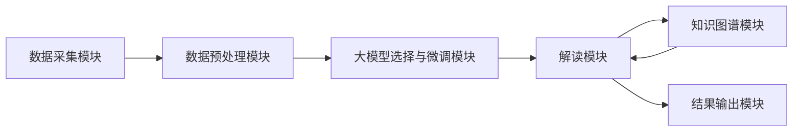

# 开发基于大模型的金融政策解读系统

> 关键词：大模型、金融政策解读系统、自然语言处理、深度学习、金融领域应用

> 摘要：本文旨在详细阐述开发基于大模型的金融政策解读系统的相关内容。首先介绍了开发该系统的背景，包括目的、预期读者、文档结构和相关术语。接着深入探讨了核心概念与联系，包括系统架构和工作流程。通过Python代码详细讲解了核心算法原理及具体操作步骤，同时给出了数学模型和公式，并进行举例说明。在项目实战部分，介绍了开发环境搭建、源代码实现和代码解读。还探讨了该系统的实际应用场景，推荐了学习资源、开发工具框架和相关论文著作。最后总结了未来发展趋势与挑战，并提供了常见问题解答和扩展阅读参考资料。

## 1. 背景介绍 
### 1.1 目的和范围
随着金融市场的不断发展和变化，金融政策的出台和调整日益频繁。准确、及时地解读金融政策对于金融机构、企业和投资者来说至关重要。基于大模型的金融政策解读系统旨在利用先进的自然语言处理技术和大模型的强大能力，自动对金融政策文本进行深入分析和解读，为用户提供准确、清晰的政策解读信息。本系统的范围涵盖了各类金融政策文本，包括货币政策、财政政策、监管政策等，旨在为金融领域的不同用户群体提供全面、专业的政策解读服务。

### 1.2 预期读者
本系统的预期读者主要包括以下几类人群：
1. **金融机构从业者**：如银行、证券、保险等金融机构的工作人员，他们需要及时了解和掌握金融政策的变化，以便调整业务策略和风险管理措施。
2. **企业财务人员**：企业财务人员需要根据金融政策的变化调整企业的财务策略和资金管理方案，以降低企业的财务风险。
3. **投资者**：投资者需要了解金融政策对市场的影响，以便做出合理的投资决策。
4. **研究人员**：金融领域的研究人员可以利用本系统对金融政策进行深入研究和分析，为学术研究提供支持。

### 1.3 文档结构概述
本文的文档结构如下：
1. **背景介绍**：介绍开发基于大模型的金融政策解读系统的目的、预期读者、文档结构和相关术语。
2. **核心概念与联系**：阐述系统的核心概念、架构和工作流程，包括大模型的选择、数据处理和解读模块的设计。
3. **核心算法原理 & 具体操作步骤**：详细讲解系统所采用的核心算法原理，并通过Python代码展示具体的操作步骤。
4. **数学模型和公式 & 详细讲解 & 举例说明**：给出系统所涉及的数学模型和公式，并进行详细讲解和举例说明。
5. **项目实战：代码实际案例和详细解释说明**：介绍系统的开发环境搭建、源代码实现和代码解读，帮助读者了解系统的实际开发过程。
6. **实际应用场景**：探讨系统在金融领域的实际应用场景，如政策分析、风险评估、投资决策等。
7. **工具和资源推荐**：推荐学习资源、开发工具框架和相关论文著作，帮助读者进一步深入学习和研究。
8. **总结：未来发展趋势与挑战**：总结系统的未来发展趋势和面临的挑战，并提出相应的应对策略。
9. **附录：常见问题与解答**：提供常见问题的解答，帮助读者解决在使用系统过程中遇到的问题。
10. **扩展阅读 & 参考资料**：提供扩展阅读的建议和参考资料，帮助读者进一步深入了解相关领域的知识。

### 1.4 术语表
#### 1.4.1 核心术语定义
1. **大模型**：指具有大量参数和强大计算能力的深度学习模型，如GPT、BERT等，能够处理自然语言处理任务。
2. **金融政策**：指政府或金融监管机构为了实现特定的经济和金融目标而制定的政策措施，包括货币政策、财政政策、监管政策等。
3. **政策解读**：指对金融政策文本进行分析和理解，提取政策的核心内容、目标和影响，并以清晰、易懂的方式向用户进行解释和说明。
4. **自然语言处理（NLP）**：指计算机对自然语言的处理和理解技术，包括文本分类、命名实体识别、情感分析等。

#### 1.4.2 相关概念解释
1. **预训练模型**：指在大规模文本数据上进行无监督学习训练得到的模型，具有较强的语言理解和表达能力，可以作为后续任务的基础模型。
2. **微调（Fine-tuning）**：指在预训练模型的基础上，针对特定的任务和数据集进行有监督学习训练，以提高模型在该任务上的性能。
3. **知识图谱**：指一种以图形结构表示知识的方法，将实体、概念和它们之间的关系以图形的形式进行存储和管理，有助于提高系统的知识推理和理解能力。

#### 1.4.3 缩略词列表
1. **NLP**：自然语言处理（Natural Language Processing）
2. **GPT**：生成式预训练变换器（Generative Pretrained Transformer）
3. **BERT**：双向编码器表示来自变换器（Bidirectional Encoder Representations from Transformers）

## 2. 核心概念与联系 

### 核心概念原理
基于大模型的金融政策解读系统主要基于自然语言处理技术和大模型的强大能力，实现对金融政策文本的自动解读。系统的核心原理包括以下几个方面：
1. **文本表示**：将金融政策文本转换为计算机能够处理的向量表示，以便后续的分析和处理。常用的文本表示方法包括词向量、句向量等。
2. **语义理解**：利用大模型对金融政策文本进行语义理解，提取文本的核心内容、主题和情感倾向等信息。
3. **知识推理**：结合金融领域的知识图谱和大模型的推理能力，对金融政策的影响和后果进行推理和预测。
4. **结果输出**：将解读结果以清晰、易懂的方式呈现给用户，如文本报告、可视化图表等。

### 架构的文本示意图
本系统的架构主要包括以下几个模块：
1. **数据采集模块**：负责收集各类金融政策文本数据，包括政府网站、金融媒体等渠道的政策文件和新闻报道。
2. **数据预处理模块**：对采集到的文本数据进行清洗、分词、标注等预处理操作，以便后续的分析和处理。
3. **大模型选择与微调模块**：选择合适的大模型，并在金融政策数据集上进行微调，以提高模型在金融政策解读任务上的性能。
4. **解读模块**：利用微调后的大模型对金融政策文本进行解读，提取政策的核心内容、目标和影响等信息。
5. **知识图谱模块**：构建金融领域的知识图谱，将金融政策与相关的实体、概念和关系进行关联，以提高系统的知识推理和理解能力。
6. **结果输出模块**：将解读结果以文本报告、可视化图表等形式呈现给用户。

### Mermaid 流程图


## 3. 核心算法原理 & 具体操作步骤 

### 核心算法原理
本系统主要采用大模型进行金融政策解读，常用的大模型包括GPT、BERT等。以BERT为例，其核心算法原理如下：
1. **Transformer架构**：BERT基于Transformer架构，Transformer是一种基于注意力机制的深度学习模型，能够处理序列数据。
2. **双向编码**：BERT采用双向编码的方式，能够同时考虑上下文信息，提高模型的语言理解能力。
3. **预训练和微调**：BERT在大规模文本数据上进行无监督学习预训练，然后在特定的任务和数据集上进行有监督学习微调，以提高模型在该任务上的性能。

### 具体操作步骤（Python代码实现）
以下是一个基于Hugging Face的Transformers库实现金融政策解读的示例代码：

```python
from transformers import AutoTokenizer, AutoModelForSequenceClassification
import torch

# 加载预训练模型和分词器
model_name = "bert-base-chinese"
tokenizer = AutoTokenizer.from_pretrained(model_name)
model = AutoModelForSequenceClassification.from_pretrained(model_name)

# 定义金融政策文本
policy_text = "为了促进金融市场的稳定发展，央行决定降低存款准备金率。"

# 对文本进行分词和编码
inputs = tokenizer(policy_text, return_tensors="pt")

# 进行预测
with torch.no_grad():
    outputs = model(**inputs)

# 获取预测结果
logits = outputs.logits
predicted_class_id = logits.argmax().item()
print(f"预测类别: {predicted_class_id}")
```

### 代码解释
1. **加载预训练模型和分词器**：使用`AutoTokenizer`和`AutoModelForSequenceClassification`从Hugging Face的模型库中加载预训练的BERT模型和分词器。
2. **定义金融政策文本**：定义需要解读的金融政策文本。
3. **对文本进行分词和编码**：使用分词器对文本进行分词和编码，将文本转换为模型能够处理的输入格式。
4. **进行预测**：使用加载的模型对输入进行预测，得到预测结果。
5. **获取预测结果**：从预测结果中获取预测类别，并打印输出。

## 4. 数学模型和公式 & 详细讲解 & 举例说明 

### 数学模型
本系统所涉及的数学模型主要包括词向量模型和Transformer模型。

#### 词向量模型
词向量模型用于将单词转换为向量表示，常用的词向量模型包括Word2Vec、GloVe等。以Word2Vec为例，其数学模型基于神经网络，通过最大化上下文单词的共现概率来学习单词的向量表示。

#### Transformer模型
Transformer模型是一种基于注意力机制的深度学习模型，其核心是多头注意力机制（Multi-Head Attention）。多头注意力机制的数学公式如下：

$$
\text{MultiHead}(Q, K, V) = \text{Concat}(\text{head}_1, \cdots, \text{head}_h)W^O
$$

其中，

$$
\text{head}_i = \text{Attention}(QW_i^Q, KW_i^K, VW_i^V)
$$

$$
\text{Attention}(Q, K, V) = \text{softmax}(\frac{QK^T}{\sqrt{d_k}})V
$$

### 详细讲解
1. **词向量模型**：词向量模型将单词映射到低维向量空间中，使得语义相近的单词在向量空间中距离较近。通过学习词向量，可以捕捉单词之间的语义关系，提高模型的语言理解能力。
2. **Transformer模型**：Transformer模型通过多头注意力机制，能够同时关注输入序列的不同部分，提高模型的并行计算能力和语言处理能力。多头注意力机制将输入序列的查询（Q）、键（K）和值（V）分别通过不同的线性变换得到多个头，然后对每个头进行注意力计算，最后将所有头的结果拼接起来并通过一个线性变换得到最终的输出。

### 举例说明
假设我们有一个输入序列`["央行", "降低", "存款准备金率"]`，我们可以使用词向量模型将每个单词转换为向量表示，然后使用Transformer模型对这些向量进行处理。在多头注意力机制中，查询（Q）、键（K）和值（V）分别是输入序列的不同线性变换，通过注意力计算可以得到每个单词对其他单词的关注程度，从而更好地理解输入序列的语义。

## 5. 项目实战：代码实际案例和详细解释说明 

### 5.1  开发环境搭建
#### 操作系统
本项目可以在Windows、Linux或macOS等操作系统上进行开发，建议使用Linux系统，如Ubuntu 18.04或更高版本。

#### 编程语言
本项目使用Python作为开发语言，建议使用Python 3.7或更高版本。

#### 依赖库安装
使用以下命令安装项目所需的依赖库：

```bash
pip install transformers torch pandas numpy
```

### 5.2  源代码详细实现和代码解读
以下是一个完整的基于大模型的金融政策解读系统的源代码示例：

```python
import pandas as pd
from transformers import AutoTokenizer, AutoModelForSequenceClassification
import torch

# 加载预训练模型和分词器
model_name = "bert-base-chinese"
tokenizer = AutoTokenizer.from_pretrained(model_name)
model = AutoModelForSequenceClassification.from_pretrained(model_name)

# 定义金融政策数据集
policy_data = {
    "policy_text": [
        "为了促进金融市场的稳定发展，央行决定降低存款准备金率。",
        "加强对金融机构的监管，防范金融风险。"
    ]
}
df = pd.DataFrame(policy_data)

# 定义解读函数
def interpret_policy(policy_text):
    # 对文本进行分词和编码
    inputs = tokenizer(policy_text, return_tensors="pt")
    
    # 进行预测
    with torch.no_grad():
        outputs = model(**inputs)
    
    # 获取预测结果
    logits = outputs.logits
    predicted_class_id = logits.argmax().item()
    return predicted_class_id

# 对每条金融政策进行解读
df["interpretation"] = df["policy_text"].apply(interpret_policy)

# 输出解读结果
print(df)
```

### 代码解读
1. **加载预训练模型和分词器**：使用`AutoTokenizer`和`AutoModelForSequenceClassification`从Hugging Face的模型库中加载预训练的BERT模型和分词器。
2. **定义金融政策数据集**：使用`pandas`库定义一个包含金融政策文本的数据集。
3. **定义解读函数**：定义一个`interpret_policy`函数，用于对单条金融政策文本进行解读。该函数首先对文本进行分词和编码，然后使用加载的模型进行预测，最后返回预测结果。
4. **对每条金融政策进行解读**：使用`apply`方法将`interpret_policy`函数应用到数据集中的每条金融政策文本上，得到每条政策的解读结果。
5. **输出解读结果**：将解读结果添加到数据集中，并打印输出。

### 5.3  代码解读与分析
本代码示例实现了一个简单的基于大模型的金融政策解读系统。通过使用预训练的BERT模型和分词器，对金融政策文本进行分词和编码，然后使用模型进行预测，得到每条政策的解读结果。该系统可以作为一个基础框架，进一步扩展和优化，例如添加知识图谱模块、进行模型微调等，以提高系统的性能和解读能力。

## 6. 实际应用场景 
基于大模型的金融政策解读系统在金融领域具有广泛的应用场景，以下是一些常见的应用场景：
1. **政策分析**：金融机构和企业可以使用本系统对金融政策进行深入分析，了解政策的核心内容、目标和影响，以便制定相应的业务策略和风险管理措施。
2. **风险评估**：投资者和金融机构可以使用本系统对金融政策的风险进行评估，预测政策对市场和投资组合的影响，从而做出合理的投资决策。
3. **投资决策**：投资者可以根据本系统提供的政策解读信息，调整投资组合，选择合适的投资标的，以实现投资目标。
4. **监管合规**：金融机构可以使用本系统确保自身业务符合金融政策和监管要求，避免违规风险。
5. **研究分析**：金融领域的研究人员可以使用本系统对金融政策进行研究和分析，为学术研究提供支持。

## 7. 工具和资源推荐
### 7.1 学习资源推荐
#### 7.1.1 书籍推荐
1. 《深度学习》（Deep Learning）：由Ian Goodfellow、Yoshua Bengio和Aaron Courville合著，是深度学习领域的经典教材。
2. 《自然语言处理入门》（Natural Language Processing with Python）：由Steven Bird、Ewan Klein和Edward Loper合著，介绍了自然语言处理的基本概念和方法。
3. 《动手学深度学习》（Dive into Deep Learning）：由阿斯顿·张、李沐等合著，提供了丰富的深度学习实践案例和代码。

#### 7.1.2 在线课程
1. Coursera上的“深度学习专项课程”（Deep Learning Specialization）：由Andrew Ng教授授课，是深度学习领域的经典在线课程。
2. edX上的“自然语言处理基础”（Foundations of Natural Language Processing）：介绍了自然语言处理的基本概念和方法。
3. 李沐的“动手学深度学习”在线课程：提供了丰富的深度学习实践案例和代码。

#### 7.1.3 技术博客和网站
1. Hugging Face官方博客：提供了关于大模型和自然语言处理的最新技术和应用案例。
2. arXiv.org：一个预印本平台，提供了大量的学术论文和研究成果。
3. Medium上的“Towards Data Science”：一个数据科学和机器学习领域的技术博客，提供了丰富的技术文章和案例分析。

### 7.2 开发工具框架推荐
#### 7.2.1 IDE和编辑器
1. PyCharm：一个专业的Python集成开发环境，提供了丰富的代码编辑、调试和版本控制功能。
2. Visual Studio Code：一个轻量级的代码编辑器，支持多种编程语言和插件扩展。
3. Jupyter Notebook：一个交互式的开发环境，适合进行数据分析和模型实验。

#### 7.2.2 调试和性能分析工具
1. TensorBoard：一个用于可视化深度学习模型训练过程和性能的工具。
2. Py-Spy：一个用于分析Python程序性能的工具。
3. cProfile：Python标准库中的一个性能分析工具。

#### 7.2.3 相关框架和库
1. Hugging Face Transformers：一个用于自然语言处理的开源库，提供了丰富的预训练模型和工具。
2. PyTorch：一个深度学习框架，具有动态图和易于使用的特点。
3. TensorFlow：一个广泛使用的深度学习框架，具有强大的分布式训练和部署能力。

### 7.3 相关论文著作推荐
#### 7.3.1 经典论文
1. “Attention Is All You Need”：提出了Transformer架构，是深度学习领域的经典论文。
2. “BERT: Pre-training of Deep Bidirectional Transformers for Language Understanding”：提出了BERT模型，在自然语言处理领域取得了显著的成果。
3. “Generative Pretrained Transformer 3 (GPT-3): Language Models are Few-Shot Learners”：介绍了GPT-3模型，展示了大模型在自然语言处理任务上的强大能力。

#### 7.3.2 最新研究成果
1. 关注arXiv.org上关于大模型和自然语言处理的最新研究论文，了解该领域的最新发展动态。
2. 参加相关的学术会议和研讨会，如ACL、EMNLP等，获取最新的研究成果和技术趋势。

#### 7.3.3 应用案例分析
1. 关注金融领域的研究报告和案例分析，了解基于大模型的金融政策解读系统在实际应用中的效果和经验。
2. 参考相关的行业白皮书和研究报告，了解金融政策解读系统的市场需求和发展趋势。

## 8. 总结：未来发展趋势与挑战
### 未来发展趋势
1. **模型能力不断提升**：随着大模型技术的不断发展，模型的能力将不断提升，能够处理更加复杂和多样化的金融政策解读任务。
2. **多模态融合**：未来的金融政策解读系统将不仅仅局限于文本处理，还将融合图像、语音等多模态信息，提供更加全面和准确的解读服务。
3. **知识图谱与大模型的深度融合**：知识图谱能够为大模型提供更加丰富的背景知识和语义信息，未来的系统将加强知识图谱与大模型的深度融合，提高系统的知识推理和理解能力。
4. **个性化服务**：根据用户的需求和偏好，提供个性化的金融政策解读服务，提高用户体验和满意度。

### 挑战
1. **数据质量和标注**：金融政策文本数据的质量和标注对于系统的性能至关重要。如何获取高质量的标注数据，以及如何处理数据中的噪声和歧义，是需要解决的挑战之一。
2. **模型可解释性**：大模型通常具有较高的复杂度和黑盒性，如何提高模型的可解释性，让用户能够理解模型的决策过程和依据，是一个重要的挑战。
3. **计算资源和成本**：大模型的训练和推理需要大量的计算资源和成本，如何优化模型结构和算法，降低计算资源和成本，是需要解决的问题之一。
4. **法律法规和伦理问题**：金融政策解读系统的应用涉及到法律法规和伦理问题，如数据隐私保护、信息安全等，需要遵守相关的法律法规和伦理准则。

## 9. 附录：常见问题与解答
### 问题1：如何选择合适的大模型？
答：选择合适的大模型需要考虑以下几个因素：
1. **任务需求**：根据具体的金融政策解读任务，选择适合的模型架构和预训练模型。
2. **数据规模**：如果数据规模较小，可以选择轻量级的模型；如果数据规模较大，可以选择大规模的预训练模型。
3. **计算资源**：考虑计算资源的限制，选择能够在现有计算资源上运行的模型。

### 问题2：如何进行模型微调？
答：进行模型微调的步骤如下：
1. **准备数据集**：收集和标注与金融政策解读任务相关的数据集。
2. **加载预训练模型**：从Hugging Face的模型库中加载合适的预训练模型。
3. **定义优化器和损失函数**：选择合适的优化器和损失函数，用于模型的训练。
4. **进行微调训练**：将数据集划分为训练集和验证集，使用训练集对模型进行微调训练，并使用验证集进行模型评估和调优。

### 问题3：如何提高系统的解读准确性？
答：可以从以下几个方面提高系统的解读准确性：
1. **数据质量**：确保数据集的质量和标注的准确性，避免数据中的噪声和歧义。
2. **模型选择和微调**：选择合适的大模型，并进行充分的微调训练，以提高模型在金融政策解读任务上的性能。
3. **知识图谱融合**：将金融领域的知识图谱与大模型进行融合，提供更加丰富的背景知识和语义信息。
4. **模型集成**：使用多个模型进行集成，综合多个模型的预测结果，提高解读准确性。

## 10. 扩展阅读 & 参考资料
### 扩展阅读
1. 《金融科技前沿技术》：介绍了金融科技领域的前沿技术和应用案例。
2. 《人工智能时代的金融风险管理》：探讨了人工智能技术在金融风险管理中的应用和挑战。
3. 《自然语言处理进阶》：深入介绍了自然语言处理的高级技术和方法。

### 参考资料
1. Hugging Face官方文档：https://huggingface.co/docs
2. PyTorch官方文档：https://pytorch.org/docs/stable/index.html
3. TensorFlow官方文档：https://www.tensorflow.org/api_docs

作者：AI天才研究院/AI Genius Institute & 禅与计算机程序设计艺术 /Zen And The Art of Computer Programming