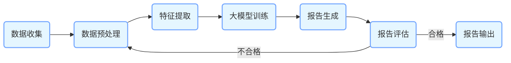

# 开发基于大模型的金融监管报告自动生成助手

> 关键词：大模型、金融监管报告、自动生成助手、自然语言处理、金融科技

> 摘要：本文聚焦于开发基于大模型的金融监管报告自动生成助手。首先介绍开发该助手的背景、目的、预期读者等内容。接着阐述相关核心概念与联系，包括大模型和金融监管报告的原理及架构，并以示意图和流程图展示。详细讲解核心算法原理，结合 Python 代码进行具体操作步骤的说明。引入数学模型和公式并举例。通过项目实战，展示开发环境搭建、源代码实现与解读。探讨其实际应用场景，推荐相关学习资源、开发工具框架和论文著作。最后总结未来发展趋势与挑战，解答常见问题并提供扩展阅读与参考资料，旨在为开发基于大模型的金融监管报告自动生成助手提供全面且深入的技术指导。

## 1. 背景介绍 
### 1.1 目的和范围
金融监管报告是金融机构与监管部门沟通的重要文件，其内容涵盖金融机构的业务状况、风险评估、合规情况等多方面信息。传统的金融监管报告生成方式依赖人工收集、整理和分析数据，过程繁琐且容易出错，耗费大量的时间和人力成本。开发基于大模型的金融监管报告自动生成助手的目的在于提高金融监管报告生成的效率和准确性，减少人工干预，降低人力成本。

本项目的范围包括研究适用于金融监管报告生成的大模型，设计自动生成助手的架构，实现数据的预处理、特征提取、报告生成等功能，以及对生成的报告进行评估和优化。

### 1.2 预期读者
本文的预期读者包括金融机构的合规人员、信息技术人员、金融监管部门的工作人员、对自然语言处理和金融科技感兴趣的研究人员和开发者等。

### 1.3 文档结构概述
本文首先介绍开发基于大模型的金融监管报告自动生成助手的背景信息，包括目的、预期读者和文档结构概述等。接着阐述相关的核心概念与联系，展示其原理和架构。然后详细讲解核心算法原理和具体操作步骤，通过 Python 代码进行说明。引入数学模型和公式并举例。进行项目实战，包括开发环境搭建、源代码实现与解读。探讨其实际应用场景，推荐相关的学习资源、开发工具框架和论文著作。最后总结未来发展趋势与挑战，解答常见问题并提供扩展阅读与参考资料。

### 1.4 术语表
#### 1.4.1 核心术语定义
- **大模型**：指具有大量参数和强大计算能力的深度学习模型，如 GPT 系列、BERT 等，能够处理复杂的自然语言处理任务。
- **金融监管报告**：金融机构向监管部门提交的反映其业务经营、风险状况、合规情况等信息的文件。
- **自动生成助手**：利用大模型技术，根据输入的数据自动生成金融监管报告的软件系统。

#### 1.4.2 相关概念解释
- **自然语言处理（NLP）**：计算机科学与人工智能领域的一个重要方向，旨在让计算机理解、处理和生成人类语言。
- **深度学习**：一种基于人工神经网络的机器学习方法，通过多层神经网络自动学习数据的特征和模式。
- **金融科技（FinTech）**：利用现代科技手段改造和创新金融业务模式、流程和产品的新兴领域。

#### 1.4.3 缩略词列表
- **NLP**：Natural Language Processing（自然语言处理）
- **GPT**：Generative Pretrained Transformer（生成式预训练 Transformer）
- **BERT**：Bidirectional Encoder Representations from Transformers（基于 Transformer 的双向编码器表示）

## 2. 核心概念与联系 

### 核心概念原理
#### 大模型原理
大模型通常基于 Transformer 架构，通过大规模无监督学习进行预训练。Transformer 架构采用自注意力机制（Self - Attention Mechanism），能够捕捉输入序列中不同位置之间的依赖关系。在预训练阶段，大模型学习到语言的通用特征和模式，例如词法、句法和语义信息。在微调阶段，根据具体的任务（如金融监管报告生成）对模型进行有监督学习，使其适应特定的任务需求。

#### 金融监管报告原理
金融监管报告是金融机构依据监管要求，对自身业务运营、风险管理、合规情况等进行全面、系统的总结和分析的文件。其内容包括财务报表分析、风险评估、合规检查结果等。金融监管报告的生成需要对大量的金融数据进行收集、整理、分析和解读，然后按照规定的格式和要求进行撰写。

### 架构的文本示意图
基于大模型的金融监管报告自动生成助手的架构主要包括数据层、模型层和应用层。

数据层：负责收集和存储与金融监管报告相关的数据，包括金融机构的业务数据、市场数据、监管政策文件等。

模型层：采用大模型作为核心，对数据层提供的数据进行处理和分析。在这个过程中，需要对数据进行预处理，如清洗、标注等，然后将处理后的数据输入到模型中进行训练和推理。

应用层：提供用户交互界面，用户可以通过该界面输入相关信息，系统根据用户需求生成金融监管报告，并提供报告的预览、下载等功能。

### Mermaid 流程图


## 3. 核心算法原理 & 具体操作步骤 

### 核心算法原理
本项目主要采用基于大模型的序列到序列（Sequence - to - Sequence）学习算法。序列到序列模型由编码器（Encoder）和解码器（Decoder）组成。编码器将输入的金融数据序列转换为一个固定长度的上下文向量，解码器根据这个上下文向量生成金融监管报告的文本序列。

### 具体操作步骤及 Python 源代码

#### 数据预处理
```python
import pandas as pd
import re

# 读取金融数据文件
def read_financial_data(file_path):
    data = pd.read_csv(file_path)
    return data

# 清洗数据
def clean_data(data):
    # 去除缺失值
    data = data.dropna()
    # 去除特殊字符
    for column in data.columns:
        if data[column].dtype == 'object':
            data[column] = data[column].apply(lambda x: re.sub(r'[^\w\s]', '', x))
    return data

# 示例调用
file_path = 'financial_data.csv'
data = read_financial_data(file_path)
cleaned_data = clean_data(data)
```

#### 特征提取
```python
from sklearn.feature_extraction.text import TfidfVectorizer

# 提取文本特征
def extract_text_features(text_data):
    vectorizer = TfidfVectorizer()
    features = vectorizer.fit_transform(text_data)
    return features

# 示例调用
text_data = cleaned_data['text_column']  # 假设文本数据在 'text_column' 列
text_features = extract_text_features(text_data)
```

#### 大模型训练
```python
from transformers import AutoTokenizer, AutoModelForSeq2SeqLM
import torch

# 加载预训练模型和分词器
tokenizer = AutoTokenizer.from_pretrained("t5-base")
model = AutoModelForSeq2SeqLM.from_pretrained("t5-base")

# 准备训练数据
input_texts = cleaned_data['input_text'].tolist()
target_texts = cleaned_data['target_text'].tolist()

input_encodings = tokenizer(input_texts, truncation=True, padding=True)
target_encodings = tokenizer(target_texts, truncation=True, padding=True)

class FinancialDataset(torch.utils.data.Dataset):
    def __init__(self, encodings):
        self.encodings = encodings

    def __getitem__(self, idx):
        item = {key: torch.tensor(val[idx]) for key, val in self.encodings.items()}
        return item

    def __len__(self):
        return len(self.encodings["input_ids"])

input_dataset = FinancialDataset(input_encodings)
target_dataset = FinancialDataset(target_encodings)

# 训练模型
train_loader = torch.utils.data.DataLoader(input_dataset, batch_size=4, shuffle=True)
optimizer = torch.optim.Adam(model.parameters(), lr=1e-4)

for epoch in range(3):
    for batch in train_loader:
        input_ids = batch['input_ids']
        attention_mask = batch['attention_mask']
        labels = target_dataset[batch.index]['input_ids']

        optimizer.zero_grad()
        outputs = model(input_ids=input_ids, attention_mask=attention_mask, labels=labels)
        loss = outputs.loss
        loss.backward()
        optimizer.step()
```

#### 报告生成
```python
# 生成报告
def generate_report(model, tokenizer, input_text):
    input_ids = tokenizer(input_text, return_tensors='pt').input_ids
    output = model.generate(input_ids)
    report_text = tokenizer.decode(output[0], skip_special_tokens=True)
    return report_text

# 示例调用
input_text = "金融机构业务数据示例"
report = generate_report(model, tokenizer, input_text)
print(report)
```

## 4. 数学模型和公式 & 详细讲解 & 举例说明 

### 自注意力机制公式
自注意力机制是 Transformer 架构的核心，其数学公式如下：

$$Attention(Q, K, V) = softmax(\frac{QK^T}{\sqrt{d_k}})V$$

其中：
- $Q$ 是查询矩阵（Query Matrix），维度为 $[n, d_k]$，$n$ 是序列长度，$d_k$ 是键向量的维度。
- $K$ 是键矩阵（Key Matrix），维度为 $[m, d_k]$，$m$ 通常等于 $n$。
- $V$ 是值矩阵（Value Matrix），维度为 $[m, d_v]$，$d_v$ 是值向量的维度。
- $\sqrt{d_k}$ 是缩放因子，用于防止点积结果过大。

### 详细讲解
自注意力机制的作用是计算输入序列中每个位置与其他位置的相关性。具体步骤如下：
1. 计算查询矩阵 $Q$、键矩阵 $K$ 和值矩阵 $V$。通常是将输入序列的嵌入向量分别与三个可学习的权重矩阵相乘得到。
2. 计算 $Q$ 和 $K$ 的点积，得到相似度分数。
3. 对相似度分数进行缩放，除以 $\sqrt{d_k}$，以防止梯度消失或爆炸。
4. 对缩放后的相似度分数应用 softmax 函数，得到注意力权重。
5. 将注意力权重与值矩阵 $V$ 相乘，得到加权和，即自注意力机制的输出。

### 举例说明
假设输入序列为 $x = [x_1, x_2, x_3]$，每个 $x_i$ 的维度为 $d$。我们将 $x$ 分别与三个权重矩阵 $W^Q$、$W^K$、$W^V$ 相乘，得到 $Q$、$K$、$V$。

设 $d_k = d_v = 2$，则 $Q = xW^Q$，$K = xW^K$，$V = xW^V$。

$Q = \begin{bmatrix}q_1 \\ q_2 \\ q_3\end{bmatrix}$，$K = \begin{bmatrix}k_1 \\ k_2 \\ k_3\end{bmatrix}$，$V = \begin{bmatrix}v_1 \\ v_2 \\ v_3\end{bmatrix}$

计算相似度分数：$S = QK^T=\begin{bmatrix}q_1 \cdot k_1 & q_1 \cdot k_2 & q_1 \cdot k_3 \\ q_2 \cdot k_1 & q_2 \cdot k_2 & q_2 \cdot k_3 \\ q_3 \cdot k_1 & q_3 \cdot k_2 & q_3 \cdot k_3\end{bmatrix}$

缩放相似度分数：$S'=\frac{S}{\sqrt{d_k}}$

计算注意力权重：$A = softmax(S')$

计算自注意力输出：$O = AV=\begin{bmatrix}a_{11}v_1 + a_{12}v_2 + a_{13}v_3 \\ a_{21}v_1 + a_{22}v_2 + a_{23}v_3 \\ a_{31}v_1 + a_{32}v_2 + a_{33}v_3\end{bmatrix}$

## 5. 项目实战：代码实际案例和详细解释说明 

### 5.1  开发环境搭建
#### 操作系统
建议使用 Linux 或 macOS 系统，因为这些系统对深度学习框架的支持更好。如果使用 Windows 系统，也可以进行开发，但可能会遇到一些兼容性问题。

#### 编程语言
使用 Python 3.7 及以上版本。Python 具有丰富的科学计算和深度学习库，非常适合本项目的开发。

#### 深度学习框架
使用 PyTorch 深度学习框架。PyTorch 提供了高效的张量计算和自动求导功能，支持 GPU 加速，并且有丰富的预训练模型可供使用。可以使用以下命令安装 PyTorch：
```sh
pip install torch torchvision torchaudio
```

#### 自然语言处理库
使用 Transformers 库，该库提供了多种预训练的大模型和相应的工具。可以使用以下命令安装：
```sh
pip install transformers
```

#### 数据处理库
使用 Pandas 和 NumPy 库进行数据处理和分析。可以使用以下命令安装：
```sh
pip install pandas numpy
```

### 5.2  源代码详细实现和代码解读
#### 数据加载和预处理
```python
import pandas as pd
import re

# 读取金融数据文件
def read_financial_data(file_path):
    data = pd.read_csv(file_path)
    return data

# 清洗数据
def clean_data(data):
    # 去除缺失值
    data = data.dropna()
    # 去除特殊字符
    for column in data.columns:
        if data[column].dtype == 'object':
            data[column] = data[column].apply(lambda x: re.sub(r'[^\w\s]', '', x))
    return data

# 示例调用
file_path = 'financial_data.csv'
data = read_financial_data(file_path)
cleaned_data = clean_data(data)
```
代码解读：
- `read_financial_data` 函数使用 Pandas 的 `read_csv` 函数读取 CSV 格式的金融数据文件。
- `clean_data` 函数首先使用 `dropna` 方法去除数据中的缺失值，然后使用正则表达式去除文本列中的特殊字符。

#### 特征提取
```python
from sklearn.feature_extraction.text import TfidfVectorizer

# 提取文本特征
def extract_text_features(text_data):
    vectorizer = TfidfVectorizer()
    features = vectorizer.fit_transform(text_data)
    return features

# 示例调用
text_data = cleaned_data['text_column']  # 假设文本数据在 'text_column' 列
text_features = extract_text_features(text_data)
```
代码解读：
- `extract_text_features` 函数使用 `TfidfVectorizer` 类将文本数据转换为 TF - IDF 特征矩阵。TF - IDF 是一种常用的文本特征提取方法，用于衡量一个词在文档中的重要性。

#### 大模型训练
```python
from transformers import AutoTokenizer, AutoModelForSeq2SeqLM
import torch

# 加载预训练模型和分词器
tokenizer = AutoTokenizer.from_pretrained("t5-base")
model = AutoModelForSeq2SeqLM.from_pretrained("t5-base")

# 准备训练数据
input_texts = cleaned_data['input_text'].tolist()
target_texts = cleaned_data['target_text'].tolist()

input_encodings = tokenizer(input_texts, truncation=True, padding=True)
target_encodings = tokenizer(target_texts, truncation=True, padding=True)

class FinancialDataset(torch.utils.data.Dataset):
    def __init__(self, encodings):
        self.encodings = encodings

    def __getitem__(self, idx):
        item = {key: torch.tensor(val[idx]) for key, val in self.encodings.items()}
        return item

    def __len__(self):
        return len(self.encodings["input_ids"])

input_dataset = FinancialDataset(input_encodings)
target_dataset = FinancialDataset(target_encodings)

# 训练模型
train_loader = torch.utils.data.DataLoader(input_dataset, batch_size=4, shuffle=True)
optimizer = torch.optim.Adam(model.parameters(), lr=1e-4)

for epoch in range(3):
    for batch in train_loader:
        input_ids = batch['input_ids']
        attention_mask = batch['attention_mask']
        labels = target_dataset[batch.index]['input_ids']

        optimizer.zero_grad()
        outputs = model(input_ids=input_ids, attention_mask=attention_mask, labels=labels)
        loss = outputs.loss
        loss.backward()
        optimizer.step()
```
代码解读：
- 首先使用 `AutoTokenizer` 和 `AutoModelForSeq2SeqLM` 从 Hugging Face 的模型库中加载预训练的 T5 模型和分词器。
- 准备训练数据，将输入文本