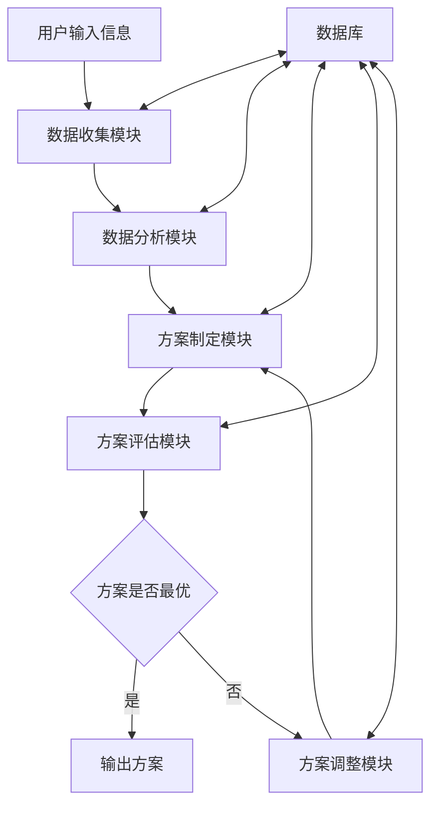

# 开发智能化的个人退休规划助手

> 关键词：智能化、个人退休规划助手、算法原理、数学模型、项目实战

> 摘要：本文旨在探讨开发智能化的个人退休规划助手这一重要课题。首先介绍了开发该助手的背景信息，包括目的、预期读者、文档结构和相关术语。接着阐述了核心概念及其联系，给出了原理和架构的示意图与流程图。详细讲解了核心算法原理并结合 Python 代码说明具体操作步骤，同时给出了相关的数学模型和公式以及举例。通过项目实战，展示了开发环境搭建、源代码实现与解读。分析了该助手的实际应用场景，推荐了学习资源、开发工具框架和相关论文著作。最后总结了未来发展趋势与挑战，提供了常见问题解答和扩展阅读参考资料，为开发智能化个人退休规划助手提供了全面且深入的指导。

## 1. 背景介绍 
### 1.1 目的和范围
随着社会经济的发展和人口老龄化的加剧，个人退休规划变得越来越重要。然而，许多人缺乏专业的金融知识和工具来制定合理的退休计划。开发智能化的个人退休规划助手的目的就是为了帮助个人更轻松、准确地制定退休规划。

本项目的范围涵盖了从收集个人财务信息、分析退休目标，到制定个性化的储蓄和投资计划等多个方面。助手将综合考虑个人的收入、支出、资产、负债、预期退休年龄、预期寿命等因素，为用户提供科学合理的退休规划建议。

### 1.2 预期读者
本文的预期读者主要包括以下几类人群：
- **软件开发人员**：对开发智能化金融应用感兴趣，希望了解如何构建一个完整的个人退休规划助手系统。
- **金融从业者**：想要借助技术手段提升服务效率和质量，为客户提供更精准的退休规划建议。
- **普通投资者**：希望通过使用智能化工具来更好地规划自己的退休生活，了解退休规划的基本原理和方法。

### 1.3 文档结构概述
本文将按照以下结构进行组织：
- **核心概念与联系**：介绍个人退休规划助手的核心概念，包括退休规划的基本要素、智能化算法的应用等，并给出相关的原理和架构示意图以及流程图。
- **核心算法原理 & 具体操作步骤**：详细讲解用于制定退休规划的核心算法，如储蓄计划算法、投资组合优化算法等，并使用 Python 代码进行实现和解释。
- **数学模型和公式 & 详细讲解 & 举例说明**：给出退休规划中涉及的数学模型和公式，如复利计算公式、养老金替代率计算公式等，并通过具体例子进行详细讲解。
- **项目实战：代码实际案例和详细解释说明**：展示一个完整的个人退休规划助手的开发过程，包括开发环境搭建、源代码实现和代码解读。
- **实际应用场景**：分析个人退休规划助手在不同场景下的应用，如不同年龄段、不同收入水平的人群如何使用该助手进行退休规划。
- **工具和资源推荐**：推荐学习个人退休规划和开发智能化助手所需的书籍、在线课程、技术博客和网站，以及开发工具框架和相关论文著作。
- **总结：未来发展趋势与挑战**：总结个人退休规划助手的发展趋势，分析面临的挑战和问题。
- **附录：常见问题与解答**：解答读者在开发和使用个人退休规划助手过程中可能遇到的常见问题。
- **扩展阅读 & 参考资料**：提供相关的扩展阅读材料和参考资料，方便读者进一步深入学习。

### 1.4 术语表
#### 1.4.1 核心术语定义
- **退休规划**：指个人在工作期间通过合理的储蓄、投资等方式，为退休后的生活积累足够的资金，以维持一定的生活水平。
- **养老金替代率**：指退休后的养老金收入与退休前工资收入的比率，反映了退休后生活水平与退休前的相对关系。
- **复利**：指在计算利息时，将上一期的利息加入本金再计算下一期的利息，俗称“利滚利”。
- **投资组合**：指投资者将资金分配到不同的资产类别（如股票、债券、基金等）中，以实现风险分散和收益最大化的投资策略。

#### 1.4.2 相关概念解释
- **生命周期理论**：该理论认为个人的消费和储蓄行为会随着生命周期的不同阶段而发生变化。在工作期间，个人会进行储蓄以应对退休后的生活；在退休后，个人则会逐渐消耗储蓄。
- **风险承受能力**：指个人在投资过程中能够承受的最大损失程度，与个人的年龄、收入、资产状况、投资经验等因素有关。

#### 1.4.3 缩略词列表
- **IRR**：内部收益率（Internal Rate of Return），是指使投资项目净现值为零的折现率。
- **ROI**：投资回报率（Return on Investment），是指投资收益与投资成本的比率。

## 2. 核心概念与联系 
### 核心概念原理
个人退休规划助手的核心原理是基于个人的财务信息和退休目标，运用数学模型和算法，为用户制定最优的退休规划方案。具体来说，助手需要完成以下几个主要任务：
- **数据收集**：收集用户的个人财务信息，包括收入、支出、资产、负债等，以及退休目标，如预期退休年龄、预期退休后生活水平等。
- **数据分析**：对收集到的数据进行分析，评估用户的财务状况和退休目标的可行性。
- **方案制定**：根据数据分析结果，运用储蓄计划算法、投资组合优化算法等，为用户制定个性化的退休规划方案，包括储蓄计划、投资计划等。
- **方案评估**：对制定的退休规划方案进行评估，计算方案的预期收益、风险等指标，评估方案是否能够满足用户的退休目标。
- **方案调整**：根据方案评估结果，对退休规划方案进行调整，直到方案达到最优。

### 架构的文本示意图
```plaintext
个人退休规划助手架构

|----------------------|
|      用户界面       |
|----------------------|
|    数据收集模块     |
|----------------------|
|    数据分析模块     |
|----------------------|
|    方案制定模块     |
|----------------------|
|    方案评估模块     |
|----------------------|
|    方案调整模块     |
|----------------------|
|      数据库        |
|----------------------|
```

### Mermaid 流程图


## 3. 核心算法原理 & 具体操作步骤 
### 储蓄计划算法原理
储蓄计划算法的目标是根据用户的退休目标和当前财务状况，计算出每月需要储蓄的金额。假设用户的预期退休年龄为 $T_{retire}$，当前年龄为 $T_{now}$，预期退休后生活年限为 $N_{retire}$，退休后每年需要的生活费用为 $C_{retire}$，当前资产为 $A_{now}$，预期投资收益率为 $r$。

首先，计算退休时需要的总资金 $F_{retire}$：
$$F_{retire}=\sum_{i = 1}^{N_{retire}}\frac{C_{retire}}{(1 + r)^{i - 1}}$$

然后，计算从现在到退休期间每月需要储蓄的金额 $P$。假设每月储蓄金额固定，采用复利计算，根据年金终值公式：
$$F_{retire}=A_{now}(1 + r)^{(T_{retire}-T_{now})\times12}+\sum_{i = 1}^{(T_{retire}-T_{now})\times12}P(1 + r)^{(T_{retire}-T_{now})\times12 - i}$$

### Python 代码实现
```python
import numpy as np

def calculate_retirement_funds(C_retire, N_retire, r):
    """
    计算退休时需要的总资金
    :param C_retire: 退休后每年需要的生活费用
    :param N_retire: 预期退休后生活年限
    :param r: 预期投资收益率
    :return: 退休时需要的总资金
    """
    years = np.arange(1, N_retire + 1)
    funds = np.sum(C_retire / (1 + r) ** (years - 1))
    return funds

def calculate_monthly_savings(A_now, T_now, T_retire, F_retire, r):
    """
    计算每月需要储蓄的金额
    :param A_now: 当前资产
    :param T_now: 当前年龄
    :param T_retire: 预期退休年龄
    :param F_retire: 退休时需要的总资金
    :param r: 预期投资收益率
    :return: 每月需要储蓄的金额
    """
    months = (T_retire - T_now) * 12
    future_value_assets = A_now * (1 + r) ** months
    remaining_funds = F_retire - future_value_assets
    if remaining_funds <= 0:
        return 0
    monthly_rate = r
    payments = np.pmt(monthly_rate, months, 0, -remaining_funds)
    return payments

# 示例参数
C_retire = 50000  # 退休后每年需要的生活费用
N_retire = 20  # 预期退休后生活年限
r = 0.05 / 12  # 预期月投资收益率
A_now = 100000  # 当前资产
T_now = 30  # 当前年龄
T_retire = 60  # 预期退休年龄

# 计算退休时需要的总资金
F_retire = calculate_retirement_funds(C_retire, N_retire, r)
print(f"退休时需要的总资金: {F_retire:.2f}")

# 计算每月需要储蓄的金额
monthly_savings = calculate_monthly_savings(A_now, T_now, T_retire, F_retire, r)
print(f"每月需要储蓄的金额: {monthly_savings:.2f}")
```

### 具体操作步骤
1. 用户输入退休后每年需要的生活费用 $C_{retire}$、预期退休后生活年限 $N_{retire}$、预期投资收益率 $r$、当前资产 $A_{now}$、当前年龄 $T_{now}$ 和预期退休年龄 $T_{retire}$。
2. 调用 `calculate_retirement_funds` 函数计算退休时需要的总资金 $F_{retire}$。
3. 调用 `calculate_monthly_savings` 函数计算每月需要储蓄的金额 $P$。
4. 输出计算结果。

## 4. 数学模型和公式 & 详细讲解 & 举例说明 
### 复利计算公式
复利计算公式为：
$$A = P(1 + r)^n$$
其中，$A$ 是最终的本利和，$P$ 是本金，$r$ 是利率，$n$ 是期数。

**详细讲解**：复利的核心思想是将上一期的利息加入本金再计算下一期的利息。例如，年初存入银行 $1000$ 元，年利率为 $5\%$，存期为 $3$ 年。按照复利计算，第一年的利息为 $1000\times5\% = 50$ 元，第一年结束后的本利和为 $1000 + 50 = 1050$ 元；第二年的利息为 $1050\times5\% = 52.5$ 元，第二年结束后的本利和为 $1050 + 52.5 = 1102.5$ 元；第三年的利息为 $1102.5\times5\% = 55.125$ 元，第三年结束后的本利和为 $1102.5 + 55.125 = 1157.625$ 元。使用复利公式计算，$A = 1000\times(1 + 0.05)^3 = 1157.625$ 元，结果相同。

### 养老金替代率计算公式
养老金替代率计算公式为：
$$R = \frac{P}{S}$$
其中，$R$ 是养老金替代率，$P$ 是退休后的养老金收入，$S$ 是退休前的工资收入。

**详细讲解**：养老金替代率反映了退休后生活水平与退休前的相对关系。例如，某人退休前的月工资收入为 $8000$ 元，退休后的月养老金收入为 $4000$ 元，则养老金替代率为 $R = \frac{4000}{8000} = 0.5$，即 $50\%$。一般来说，养老金替代率越高，退休后的生活水平越接近退休前。

### 年金终值公式
年金终值公式为：
$$F = A\frac{(1 + r)^n - 1}{r}$$
其中，$F$ 是年金终值，$A$ 是每期等额收付的金额（年金），$r$ 是利率，$n$ 是期数。

**详细讲解**：年金终值是指在一定时期内，每期期末等额收付的系列款项的终值之和。例如，每月末存入银行 $1000$ 元，月利率为 $0.5\%$，存期为 $12$ 个月。使用年金终值公式计算，$F = 1000\times\frac{(1 + 0.005)^{12} - 1}{0.005} \approx 12335.56$ 元。

### 举例说明
假设小张今年 $30$ 岁，计划 $60$ 岁退休，退休后每年需要 $60000$ 元的生活费用，预期退休后生活 $25$ 年，当前资产为 $150000$ 元，预期投资收益率为 $6\%$。

#### 计算退休时需要的总资金
使用复利现值公式计算每年生活费用的现值之和：
$$F_{retire}=\sum_{i = 1}^{25}\frac{60000}{(1 + 0.06)^{i - 1}}$$
可以使用 Python 代码计算：
```python
import numpy as np

C_retire = 60000
N_retire = 25
r = 0.06
years = np.arange(1, N_retire + 1)
F_retire = np.sum(C_retire / (1 + r) ** (years - 1))
print(f"退休时需要的总资金: {F_retire:.2f}")
```
计算结果约为 $772,577.54$ 元。

#### 计算每月需要储蓄的金额
从现在到退休还有 $30$ 年，即 $360$ 个月。当前资产 $150000$ 元在 $30$ 年后的终值为：
$$A_{future}=150000\times(1 + 0.06)^{30} \approx 881,522.23$$
还需要积累的资金为：
$$F_{remaining}=772,577.54 - 881,522.23 < 0$$
这说明小张当前的资产在预期投资收益率下，到退休时已经足够满足退休后的生活费用，不需要额外储蓄。

## 5. 项目实战：代码实际案例和详细解释说明 
### 5.1  开发环境搭建
#### 开发语言和框架
本项目使用 Python 作为开发语言，主要使用以下库和框架：
- **NumPy**：用于数值计算，如矩阵运算、数组操作等。
- **Pandas**：用于数据处理和分析，如数据读取、清洗、转换等。
- **Matplotlib**：用于数据可视化，如绘制折线图、柱状图等。

#### 安装步骤
1. 安装 Python：可以从 Python 官方网站（https://www.python.org/downloads/）下载并安装 Python 3.x 版本。
2. 安装所需库：打开命令行工具，使用以下命令安装所需库：
```sh
pip install numpy pandas matplotlib
```

### 5.2  源代码详细实现和代码解读
```python
import numpy as np
import pandas as pd
import matplotlib.pyplot as plt

class RetirementPlanner:
    def __init__(self, current_age, retirement_age, current_assets, annual_expenses, retirement_years, expected_return):
        """
        初始化退休规划器
        :param current_age: 当前年龄
        :param retirement_age: 预期退休年龄
        :param current_assets: 当前资产
        :param annual_expenses: 退休后每年需要的生活费用
        :param retirement_years: 预期退休后生活年限
        :param expected_return: 预期投资收益率
        """
        self.current_age = current_age
        self.retirement_age = retirement_age
        self.current_assets = current_assets
        self.annual_expenses = annual_expenses
        self.retirement_years = retirement_years
        self.expected_return = expected_return

    def calculate_retirement_funds(self):
        """
        计算退休时需要的总资金
        :return: 退休时需要的总资金
        """
        years = np.arange(1, self.retirement_years + 1)
        funds = np.sum(self.annual_expenses / (1 + self.expected_return) ** (years - 1))
        return funds

    def calculate_monthly_savings(self):
        """
        计算每月需要储蓄的金额
        :return: 每月需要储蓄的金额
        """
        months = (self.retirement_age - self.current_age) * 12
        future_value_assets = self.current_assets * (1 + self.expected_return) ** months
        F_retire = self.calculate_retirement_funds()
        remaining_funds = F_retire - future_value_assets
        if remaining_funds <= 0:
            return 0
        monthly_rate = self.expected_return
        payments = np.pmt(monthly_rate, months, 0, -remaining_funds)
        return payments

    def simulate_retirement_plan(self):
        """
        模拟退休规划过程
        :return: 模拟结果 DataFrame
        """
        months = (self.retirement_age - self.current_age) * 12
        data = []
        current_assets = self.current_assets
        monthly_savings = self.calculate_monthly_savings()
        for i in range(months):
            current_assets = current_assets * (1 + self.expected_return) + monthly_savings
            data.append([i + 1, current_assets])
        df = pd.DataFrame(data, columns=['Month', 'Assets'])
        return df

    def plot_retirement_plan(self, df):
        """
        绘制退休规划模拟结果图
        :param df: 模拟结果 DataFrame
        """
        plt.figure(figsize=(10, 6))
        plt.plot(df['Month'], df['Assets'])
        plt.xlabel('Month')
        plt.ylabel('Assets')
        plt.title('Retirement Plan Simulation')
        plt.grid(True)
        plt.show()

# 示例参数
current_age = 35
retirement_age = 65
current_assets = 200000
annual_expenses = 70000
retirement_years = 30
expected_return = 0.06 / 12

# 创建退休规划器对象
planner = RetirementPlanner(current_age, retirement_age, current_assets, annual_expenses, retirement_years, expected_return)

# 计算退休时需要的总资金
F_retire = planner.calculate_retirement_funds()
print(f"退休时需要的总资金: {F_retire:.2f}")

# 计算每月需要储蓄的金额
monthly_savings = planner.calculate_monthly_savings()
print(f"每月需要储蓄的金额: {monthly_savings:.2f}")

# 模拟退休规划过程
df = planner.simulate_retirement_plan()

# 绘制退休规划模拟结果图
planner.plot_retirement_plan(df)
```

### 5.3  代码解读与分析
#### 类的定义和初始化
`RetirementPlanner` 类用于封装退休规划的相关功能。在初始化方法 `__init__` 中，接收用户的基本信息，包括当前年龄、预期退休年龄、当前资产、退休后每年需要的生活费用、预期退休后生活年限和预期投资收益率。

#### 计算退休时需要的总资金
`calculate_retirement_funds` 方法使用复利现值公式计算退休时需要的总资金。通过循环计算每年生活费用的现值，并求和得到总资金。

#### 计算每月需要储蓄的金额
`calculate_monthly_savings` 方法首先计算当前资产在退休时的终值，然后计算还需要积累的资金。如果还需要积累的资金小于等于 0，则说明当前资产已经足够，不需要额外储蓄；否则，使用年金终值公式计算每月需要储蓄的金额。

#### 模拟退休规划过程
`simulate_retirement_plan` 方法模拟从现在到退休期间的资产变化情况。通过循环计算每月的资产增长，并记录下来，最后将结果存储在 DataFrame 中。

#### 绘制退休规划模拟结果图
`plot_retirement_plan` 方法使用 Matplotlib 库绘制退休规划模拟结果图，直观地展示资产随时间的变化情况。

## 6. 实际应用场景 
### 不同年龄段人群的应用
#### 年轻人（20 - 30 岁）
年轻人通常处于职业生涯的起步阶段，收入相对较低，但未来的收入增长潜力较大。对于这个年龄段的人群，个人退休规划助手可以帮助他们树立正确的退休规划意识，制定合理的储蓄计划。由于年轻，他们可以承受较高的投资风险，助手可以推荐一些股票型基金等风险较高但预期收益也较高的投资产品，帮助他们在长期投资中积累更多的财富。

#### 中年人（30 - 50 岁）
中年人通常已经有了一定的资产积累，但也面临着子女教育、赡养父母等经济压力。个人退休规划助手可以帮助他们评估当前的财务状况，调整储蓄和投资计划，确保在满足当前生活需求的同时，为退休做好充分的准备。对于这个年龄段的人群，投资组合可以适当降低风险，增加债券等稳健型投资产品的比例。

#### 接近退休人群（50 - 60 岁）
接近退休的人群需要更加关注退休后的生活保障。个人退休规划助手可以帮助他们精确计算退休时需要的资金，评估当前的资产是否足够。如果资产不足，助手可以提供一些短期的储蓄和投资建议，帮助他们在有限的时间内尽可能增加资产。同时，助手还可以提供一些退休后的理财规划建议，如如何合理安排养老金的使用等。

### 不同收入水平人群的应用
#### 低收入人群
低收入人群可能面临着较大的生活压力，储蓄能力有限。个人退休规划助手可以帮助他们制定节约型的退休规划方案，如合理控制生活支出、寻找一些低风险的小额投资渠道等。同时，助手还可以提醒他们关注政府的社会保障政策，如养老保险、低保等，以提高退休后的生活保障。

#### 中等收入人群
中等收入人群有一定的储蓄能力，但也需要合理规划资产。个人退休规划助手可以帮助他们制定个性化的储蓄和投资计划，根据他们的风险承受能力和退休目标，选择合适的投资产品。例如，推荐一些定期存款、债券基金等稳健型投资产品，同时也可以适当配置一些股票型基金，以提高投资收益。

#### 高收入人群
高收入人群通常有较多的资产积累，但也面临着更高的税收和资产保值增值的压力。个人退休规划助手可以帮助他们进行税务规划，合理避税。同时，为他们提供多元化的投资组合建议，如投资房地产、私募基金等，以实现资产的长期稳定增长。

## 7. 工具和资源推荐
### 7.1 学习资源推荐
#### 7.1.1 书籍推荐
- 《聪明的投资者》（The Intelligent Investor）：本杰明·格雷厄姆（Benjamin Graham）著，被誉为投资领域的圣经，介绍了价值投资的基本理念和方法，对于理解退休规划中的投资策略有很大帮助。
- 《穷查理宝典：查理·芒格的智慧箴言录》（Poor Charlie's Almanack: The Wit and Wisdom of Charles T. Munger）：彼得·考夫曼（Peter D. Kaufman）编著，收录了查理·芒格的演讲和文章，涵盖了投资、商业、人生等多个领域的智慧，对于培养投资思维和规划退休生活有很大启发。
- 《退休不退休》（Retire Inspired: It's Not an Age, It's a Financial Number）：Chris Hogan 著，提供了实用的退休规划建议和方法，帮助读者制定个性化的退休计划。

#### 7.1.2 在线课程
- Coursera 上的“Financial Markets”课程：由耶鲁大学的罗伯特·席勒（Robert Shiller）教授授课，介绍了金融市场的基本原理和投资策略，对于学习退休规划中的金融知识有很大帮助。
- edX 上的“Personal Finance”课程：由宾夕法尼亚大学的教授授课，涵盖了个人理财的各个方面，包括储蓄、投资、保险等，对于制定退休规划有很大指导意义。

#### 7.1.3 技术博客和网站
- 雪球（https://xueqiu.com/）：国内知名的投资社区，提供了丰富的金融资讯、投资分析和交流平台，对于了解市场动态和学习投资经验有很大帮助。
- 晨星网（https://www.morningstar.cn/）：专业的基金评级和分析网站，提供了基金的历史业绩、风险评估等信息，对于选择投资基金有很大参考价值。

### 7.2 开发工具框架推荐
#### 7.2.1 IDE和编辑器
- PyCharm：专业的 Python 集成开发环境，提供了丰富的代码编辑、调试、版本控制等功能，适合开发大型 Python 项目。
- Jupyter Notebook：交互式的开发环境，适合进行数据分析和模型验证，方便用户边写代码边查看结果。

#### 7.2.2 调试和性能分析工具
- PDB：Python 内置的调试器，可以帮助用户在代码中设置断点、单步执行等，方便排查代码中的错误。
- cProfile：Python 内置的性能分析工具，可以帮助用户分析代码的执行时间和函数调用情况，找出性能瓶颈。

#### 7.2.3 相关框架和库
- Scikit-learn：用于机器学习的 Python 库，提供了丰富的机器学习算法和工具，如分类、回归、聚类等，对于开发智能化的退休规划助手有很大帮助。
- TensorFlow：开源的机器学习框架，适合开发深度学习模型，如神经网络、卷积神经网络等，可以用于预测投资收益率等。

### 7.3 相关论文著作推荐
#### 7.3.1 经典论文
- Modigliani, F., & Brumberg, R. (1954). Utility analysis and the consumption function: An interpretation of cross-section data. In Post-Keynesian economics (pp. 388-436). Transaction Publishers. 该论文提出了生命周期理论，为个人退休规划提供了重要的理论基础。
- Markowitz, H. M. (1952). Portfolio selection. The journal of finance, 7(1), 77-91. 该论文提出了投资组合理论，为退休规划中的资产配置提供了重要的方法。

#### 7.3.2 最新研究成果
- Blanchett, D. M. (2013). Estimating the True Cost of Retirement. Journal of Financial Planning, 26(10), 42-50. 该论文研究了退休成本的估算方法，对于制定合理的退休规划有很大参考价值。
- Mitchell, O. S., & Utkus, S. P. (Eds.). (2012). Pension design and structure: New lessons from behavioral finance. Oxford University Press. 该著作探讨了行为金融学在养老金设计和结构中的应用，对于理解退休规划中的投资者行为有很大帮助。

#### 7.3.3 应用案例分析
- Ameriks, J., Caplin, A., & Leahy, J. (2003). Wealth accumulation and the propensity to plan. The quarterly journal of economics, 118(3), 1007-1047. 该论文分析了个人规划倾向对财富积累的影响，通过实际案例说明了合理规划退休的重要性。

## 8. 总结：未来发展趋势与挑战
### 未来发展趋势
#### 智能化程度不断提高
随着人工智能技术的不断发展，个人退休规划助手将越来越智能化。未来的助手将能够通过深度学习算法，对用户的财务数据和行为模式进行更深入的分析，提供更加个性化、精准的退休规划建议。例如，助手可以根据用户的消费习惯和投资偏好，实时调整储蓄和投资计划。

#### 与金融科技的融合更加紧密
金融科技的发展为个人退休规划助手带来了更多的机遇。未来的助手将能够与各种金融科技平台进行集成，如在线支付平台、投资交易平台等，实现资金的自动划转和投资操作。同时，助手还可以利用区块链技术，保证用户财务数据的安全和隐私。

#### 提供多元化的服务
未来的个人退休规划助手将不仅仅局限于提供退休规划建议，还将提供多元化的服务。例如，助手可以为用户提供税务规划、保险规划、遗产规划等一站式服务，满足用户在不同阶段的金融需求。

### 挑战
#### 数据安全和隐私保护
个人退休规划助手需要收集用户大量的财务信息，如收入、资产、负债等，这些信息涉及用户的隐私和财产安全。因此，如何保证数据的安全和隐私是开发助手面临的重要挑战。开发人员需要采用先进的加密技术和安全措施，防止数据泄露和滥用。

#### 模型的准确性和可靠性
退休规划涉及到众多不确定因素，如投资收益率、通货膨胀率、寿命等，这些因素的变化会对退休规划结果产生很大影响。因此，如何建立准确、可靠的数学模型和算法，是开发助手的关键。开发人员需要不断优化模型，考虑更多的因素和不确定性，提高模型的准确性和可靠性。

#### 用户教育和接受度
许多用户对退休规划的重要性认识不足，缺乏相关的金融知识和技能。因此，如何提高用户对退休规划的认识和接受度，是推广个人退休规划助手的难点。开发人员需要加强用户教育，通过宣传和培训，让用户了解退休规划的意义和方法，提高用户对助手的信任和使用意愿。

## 9. 附录：常见问题与解答
### 1. 退休规划助手的建议一定准确吗？
退休规划助手的建议是基于一定的数学模型和算法，以及用户提供的信息进行计算和分析得出的。然而，退休规划涉及到众多不确定因素，如投资收益率、通货膨胀率、寿命等，这些因素的变化会对规划结果产生影响。因此，助手的建议只是一种参考，不能保证完全准确。用户在制定退休规划时，还需要结合自己的实际情况和市场变化，进行适当的调整。

### 2. 退休规划助手会泄露我的个人信息吗？
正规的退休规划助手开发团队会采取严格的安全措施来保护用户的个人信息。例如，采用加密技术对数据进行加密存储和传输，设置严格的访问权限控制等。同时，开发团队也会遵守相关的法律法规，保护用户的隐私。但是，为了确保个人信息的安全，用户在选择退休规划助手时，应该选择信誉良好、有安全保障的产品。

### 3. 我可以根据退休规划助手的建议进行投资吗？
退休规划助手的建议可以作为投资参考，但不能作为投资决策的唯一依据。投资涉及到风险，不同的投资产品有不同的风险和收益特征。用户在进行投资时，应该充分了解投资产品的特点和风险，结合自己的风险承受能力和投资目标，做出合理的投资决策。如果用户对投资不太了解，建议咨询专业的金融顾问。

### 4. 退休规划助手适合所有人群吗？
退休规划助手适合大多数有退休规划需求的人群，但不同的人群可能有不同的需求和情况。例如，高净值人群可能需要更加个性化、复杂的退休规划服务，而低收入人群可能更关注基本的生活保障。因此，用户在使用退休规划助手时，应该根据自己的实际情况选择适合自己的产品和服务。

## 10. 扩展阅读 & 参考资料
### 扩展阅读
- 《财务自由之路》（Rich Dad Poor Dad）：罗伯特·清崎（Robert Kiyosaki）著，介绍了财务自由的理念和方法，对于理解退休规划中的财富积累有很大帮助。
- 《小狗钱钱》（The Little Dog That Could）：博多·舍费尔（Bodo Schäfer）著，以生动有趣的方式介绍了理财知识和方法，适合初学者阅读。

### 参考资料
- 中国证券监督管理委员会官方网站（https://www.csrc.gov.cn/）：提供了丰富的金融监管政策和市场信息，对于了解金融市场和投资产品有很大帮助。
- 中国保险监督管理委员会官方网站（https://www.cbirc.gov.cn/）：提供了保险行业的监管政策和市场信息，对于了解保险产品和规划保险方案有很大帮助。

作者：AI天才研究院/AI Genius Institute & 禅与计算机程序设计艺术 /Zen And The Art of Computer Programming