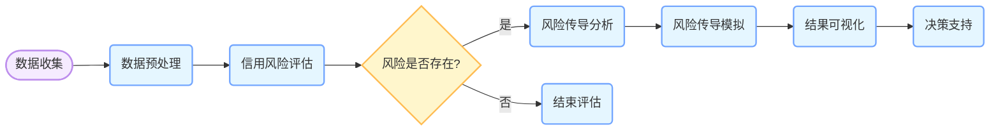

# 开发智能化的企业信用风险传导模拟系统

> 关键词：企业信用风险、风险传导模拟、智能化系统、数据驱动、风险评估

> 摘要：本文聚焦于开发智能化的企业信用风险传导模拟系统。首先介绍了开发该系统的背景、目的及适用读者群体等信息。详细阐述了核心概念，包括企业信用风险、风险传导的原理和架构，并通过文本示意图与 Mermaid 流程图进行展示。深入讲解了核心算法原理，运用 Python 代码实现具体操作步骤。对相关数学模型和公式进行了详细解读并举例说明。通过项目实战，从开发环境搭建、源代码实现与解读等方面进行了详细介绍。分析了该系统的实际应用场景，推荐了学习、开发所需的工具和资源，最后总结了系统未来的发展趋势与挑战，还提供了常见问题解答及扩展阅读参考资料，旨在为相关领域的开发者和研究者提供全面的指导。

## 1. 背景介绍 
### 1.1 目的和范围
在当今复杂多变的经济环境下，企业面临着各种各样的信用风险。企业信用风险不仅会影响单个企业的生存和发展，还可能通过供应链、金融市场等渠道在企业之间传导，引发系统性风险。开发智能化的企业信用风险传导模拟系统的主要目的是帮助金融机构、监管部门和企业自身更好地理解和管理企业信用风险传导过程。

本系统的范围涵盖了对企业信用风险的识别、量化、传导路径分析以及风险模拟等多个方面。系统将综合考虑企业的财务状况、市场环境、行业竞争等多种因素，通过建立科学合理的模型和算法，模拟企业信用风险在不同场景下的传导过程，为用户提供准确、可靠的风险评估和决策支持。

### 1.2 预期读者
本文的预期读者包括金融机构的风险管理专家、信贷审批人员、监管部门的工作人员、企业的财务管理人员以及对企业信用风险研究感兴趣的科研人员和学生。这些读者可能具有不同的专业背景和知识水平，但都希望通过本系统深入了解企业信用风险传导机制，提高风险防控能力。

### 1.3 文档结构概述
本文将按照以下结构进行组织：首先介绍系统开发的背景信息，包括目的、预期读者和文档结构概述等；接着阐述系统涉及的核心概念，如企业信用风险、风险传导等，并给出相应的原理和架构示意图；然后详细讲解核心算法原理和具体操作步骤，同时给出 Python 代码实现；对系统所使用的数学模型和公式进行详细讲解并举例说明；通过项目实战展示系统的开发过程，包括开发环境搭建、源代码实现和代码解读；分析系统的实际应用场景；推荐学习和开发所需的工具和资源；最后总结系统的未来发展趋势与挑战，提供常见问题解答和扩展阅读参考资料。

### 1.4 术语表
#### 1.4.1 核心术语定义
- **企业信用风险**：指企业在经营过程中，由于各种不确定因素导致其无法按时履行债务或其他经济承诺的可能性。
- **风险传导**：指企业信用风险通过一定的渠道和机制在企业之间、行业之间以及金融市场中传播和扩散的过程。
- **信用评级**：是对企业信用状况的综合评估，通常用等级来表示，如 AAA、AA、A 等，反映了企业的信用风险水平。
- **风险敞口**：指企业在特定风险因素下可能遭受的最大损失金额。

#### 1.4.2 相关概念解释
- **供应链金融**：是一种基于供应链核心企业与上下游企业之间的贸易关系，为供应链上的企业提供融资服务的金融模式。在供应链金融中，企业信用风险传导较为常见，核心企业的信用风险可能会影响到上下游企业的资金链。
- **系统性风险**：指由整体市场环境或宏观经济因素引起的，影响整个金融市场或多个行业的风险。企业信用风险传导可能会引发系统性风险，对经济稳定造成威胁。

#### 1.4.3 缩略词列表
- **VAR**：Value at Risk，风险价值，是一种常用的风险度量方法，用于衡量在一定置信水平下，企业在未来一段时间内可能遭受的最大损失。
- **CRISK**：Credit Risk，信用风险。
- **SME**：Small and Medium - sized Enterprises，中小企业，这类企业通常面临较高的信用风险，且在风险传导过程中较为敏感。

## 2. 核心概念与联系 

### 核心概念原理
企业信用风险传导模拟系统主要基于企业信用风险的评估和风险传导机制的分析。企业信用风险评估是通过对企业的财务数据、经营数据、市场环境等多方面信息进行综合分析，来确定企业的信用状况和违约概率。常用的评估方法包括财务比率分析、信用评级模型等。

风险传导机制则涉及到企业之间的各种经济联系，如供应链关系、股权关系、金融借贷关系等。当一个企业出现信用风险时，通过这些经济联系，风险可能会传导到与其相关的其他企业。例如，在供应链中，如果核心企业无法按时支付货款，其上游供应商可能会面临资金周转困难，进而影响到供应商的生产和信用状况。

### 架构的文本示意图
企业信用风险传导模拟系统的架构主要包括数据层、模型层、模拟层和应用层。
- **数据层**：负责收集和存储企业的各类数据，包括财务数据、市场数据、行业数据等。这些数据是系统进行风险评估和模拟的基础。
- **模型层**：包含各种信用风险评估模型和风险传导模型。信用风险评估模型用于对单个企业的信用状况进行评估，而风险传导模型则用于模拟风险在企业之间的传导过程。
- **模拟层**：根据设定的不同场景和参数，利用模型层的模型进行风险传导模拟，生成模拟结果。
- **应用层**：将模拟结果以可视化的方式呈现给用户，并提供风险评估报告、决策建议等功能，为用户的决策提供支持。

### Mermaid 流程图


## 3. 核心算法原理 & 具体操作步骤 

### 核心算法原理
本系统主要使用逻辑回归算法进行企业信用风险评估，使用蒙特卡罗模拟方法进行风险传导模拟。

#### 逻辑回归算法
逻辑回归是一种常用的分类算法，用于预测一个事件发生的概率。在企业信用风险评估中，我们可以将企业是否违约作为分类目标，通过对企业的多个特征变量进行分析，建立逻辑回归模型，预测企业违约的概率。

逻辑回归模型的基本形式为：
$$P(Y = 1|X) = \frac{1}{1 + e^{-(\beta_0+\beta_1X_1+\cdots+\beta_nX_n)}}$$
其中，$P(Y = 1|X)$ 表示在特征变量 $X=(X_1,X_2,\cdots,X_n)$ 的条件下，企业违约（$Y = 1$）的概率，$\beta_0,\beta_1,\cdots,\beta_n$ 是模型的参数。

#### 蒙特卡罗模拟方法
蒙特卡罗模拟是一种通过随机抽样来模拟复杂系统行为的方法。在企业信用风险传导模拟中，我们可以通过随机生成企业的违约概率和风险传导参数，模拟风险在企业之间的传导过程，多次重复模拟，得到风险传导的统计结果。

### 具体操作步骤及 Python 代码实现

#### 步骤 1：数据准备
首先，我们需要收集企业的相关数据，并进行数据清洗和预处理。以下是一个简单的数据准备示例：
```python
import pandas as pd
from sklearn.preprocessing import StandardScaler

# 读取数据
data = pd.read_csv('enterprise_data.csv')

# 分离特征变量和目标变量
X = data.drop('default', axis=1)
y = data['default']

# 数据标准化
scaler = StandardScaler()
X_scaled = scaler.fit_transform(X)
```

#### 步骤 2：逻辑回归模型训练
使用逻辑回归算法对企业信用风险进行评估：
```python
from sklearn.linear_model import LogisticRegression
from sklearn.model_selection import train_test_split

# 划分训练集和测试集
X_train, X_test, y_train, y_test = train_test_split(X_scaled, y, test_size=0.2, random_state=42)

# 训练逻辑回归模型
model = LogisticRegression()
model.fit(X_train, y_train)

# 预测违约概率
y_pred_proba = model.predict_proba(X_test)[:, 1]
```

#### 步骤 3：蒙特卡罗模拟风险传导
```python
import numpy as np

# 假设企业数量
num_enterprises = len(X_test)

# 模拟次数
num_simulations = 1000

# 初始化风险传导结果
risk_conduction_results = []

for _ in range(num_simulations):
    # 随机生成企业违约状态
    default_states = np.random.binomial(1, y_pred_proba)
    
    # 简单的风险传导规则（示例）：如果一个企业违约，其相邻企业违约概率增加 20%
    new_default_states = default_states.copy()
    for i in range(num_enterprises):
        if default_states[i] == 1:
            # 假设相邻企业索引为 i+1 和 i-1
            if i > 0:
                new_default_states[i - 1] = np.random.binomial(1, min(1, y_pred_proba[i - 1] + 0.2))
            if i < num_enterprises - 1:
                new_default_states[i + 1] = np.random.binomial(1, min(1, y_pred_proba[i + 1] + 0.2))
    
    # 记录风险传导后的违约企业数量
    risk_conduction_results.append(np.sum(new_default_states))

# 计算平均违约企业数量
average_default_num = np.mean(risk_conduction_results)
print(f"平均违约企业数量: {average_default_num}")
```

## 4. 数学模型和公式 & 详细讲解 & 举例说明 

### 逻辑回归模型公式详解
逻辑回归模型的核心公式为：
$$P(Y = 1|X) = \frac{1}{1 + e^{-(\beta_0+\beta_1X_1+\cdots+\beta_nX_n)}}$$

其中，$P(Y = 1|X)$ 是在给定特征向量 $X=(X_1,X_2,\cdots,X_n)$ 的情况下，事件 $Y = 1$ 发生的概率。$\beta_0$ 是截距项，$\beta_1,\cdots,\beta_n$ 是特征变量 $X_1,\cdots,X_n$ 的系数。

逻辑回归模型的目标是通过最大似然估计来确定参数 $\beta_0,\beta_1,\cdots,\beta_n$ 的值，使得模型对训练数据的拟合效果最好。最大似然估计的原理是找到一组参数，使得在这组参数下，观察到训练数据的概率最大。

假设我们有 $m$ 个样本，每个样本的特征向量为 $X^{(i)}=(X_1^{(i)},X_2^{(i)},\cdots,X_n^{(i)})$，对应的目标变量为 $Y^{(i)}$，则似然函数为：
$$L(\beta)=\prod_{i = 1}^{m}[P(Y^{(i)} = 1|X^{(i)})]^{Y^{(i)}}[1 - P(Y^{(i)} = 1|X^{(i)})]^{1 - Y^{(i)}}$$

为了方便计算，通常对似然函数取对数，得到对数似然函数：
$$\ell(\beta)=\sum_{i = 1}^{m}[Y^{(i)}\log(P(Y^{(i)} = 1|X^{(i)}))+(1 - Y^{(i)})\log(1 - P(Y^{(i)} = 1|X^{(i)}))]$$

通过最大化对数似然函数 $\ell(\beta)$，可以得到最优的参数 $\beta$。

### 举例说明
假设我们有一个简单的企业信用风险评估问题，使用两个特征变量：企业的资产负债率 $X_1$ 和利润率 $X_2$。逻辑回归模型的形式为：
$$P(Y = 1|X) = \frac{1}{1 + e^{-(\beta_0+\beta_1X_1+\beta_2X_2)}}$$

通过训练数据，我们得到参数估计值 $\beta_0=-1$，$\beta_1 = 0.5$，$\beta_2 = 0.3$。现在有一个企业，其资产负债率 $X_1 = 0.6$，利润率 $X_2 = 0.1$，则该企业违约的概率为：
$$P(Y = 1|X)=\frac{1}{1 + e^{-(-1 + 0.5\times0.6+0.3\times0.1)}}$$
$$=\frac{1}{1 + e^{-(-1 + 0.3 + 0.03)}}=\frac{1}{1 + e^{-(-0.67)}}=\frac{1}{1 + e^{0.67}}\approx0.34$$

### 蒙特卡罗模拟的数学原理
蒙特卡罗模拟基于大数定律，即当样本数量足够大时，随机变量的样本均值会趋近于其期望值。在企业信用风险传导模拟中，我们通过多次随机抽样，模拟不同的风险传导场景，得到风险传导结果的统计分布。

假设我们进行 $N$ 次模拟，每次模拟得到的违约企业数量为 $D_1,D_2,\cdots,D_N$，则平均违约企业数量为：
$$\bar{D}=\frac{1}{N}\sum_{i = 1}^{N}D_i$$

随着模拟次数 $N$ 的增加，$\bar{D}$ 会趋近于真实的平均违约企业数量。

## 5. 项目实战：代码实际案例和详细解释说明 

### 5.1  开发环境搭建
#### 操作系统
本项目可以在 Windows、Linux 或 macOS 操作系统上进行开发。建议使用 Linux 系统，因为它在数据处理和科学计算方面具有较好的性能和稳定性。

#### Python 环境
使用 Python 3.7 及以上版本。可以通过 Anaconda 或 Miniconda 来管理 Python 环境，这样可以方便地安装和管理各种 Python 库。

#### 安装必要的库
在命令行中执行以下命令安装必要的 Python 库：
```bash
pip install pandas numpy scikit-learn matplotlib
```

### 5.2  源代码详细实现和代码解读
以下是一个完整的项目实战代码示例：
```python
import pandas as pd
import numpy as np
from sklearn.preprocessing import StandardScaler
from sklearn.linear_model import LogisticRegression
from sklearn.model_selection import train_test_split
import matplotlib.pyplot as plt

# 步骤 1：数据准备
# 读取数据
data = pd.read_csv('enterprise_data.csv')

# 分离特征变量和目标变量
X = data.drop('default', axis=1)
y = data['default']

# 数据标准化
scaler = StandardScaler()
X_scaled = scaler.fit_transform(X)

# 步骤 2：逻辑回归模型训练
# 划分训练集和测试集
X_train, X_test, y_train, y_test = train_test_split(X_scaled, y, test_size=0.2, random_state=42)

# 训练逻辑回归模型
model = LogisticRegression()
model.fit(X_train, y_train)

# 预测违约概率
y_pred_proba = model.predict_proba(X_test)[:, 1]

# 步骤 3：蒙特卡罗模拟风险传导
# 假设企业数量
num_enterprises = len(X_test)

# 模拟次数
num_simulations = 1000

# 初始化风险传导结果
risk_conduction_results = []

for _ in range(num_simulations):
    # 随机生成企业违约状态
    default_states = np.random.binomial(1, y_pred_proba)
    
    # 简单的风险传导规则（示例）：如果一个企业违约，其相邻企业违约概率增加 20%
    new_default_states = default_states.copy()
    for i in range(num_enterprises):
        if default_states[i] == 1:
            # 假设相邻企业索引为 i+1 和 i-1
            if i > 0:
                new_default_states[i - 1] = np.random.binomial(1, min(1, y_pred_proba[i - 1] + 0.2))
            if i < num_enterprises - 1:
                new_default_states[i + 1] = np.random.binomial(1, min(1, y_pred_proba[i + 1] + 0.2))
    
    # 记录风险传导后的违约企业数量
    risk_conduction_results.append(np.sum(new_default_states))

# 步骤 4：结果可视化
plt.hist(risk_conduction_results, bins=20, edgecolor='black')
plt.xlabel('违约企业数量')
plt.ylabel('模拟次数')
plt.title('企业信用风险传导模拟结果')
plt.show()

# 计算平均违约企业数量
average_default_num = np.mean(risk_conduction_results)
print(f"平均违约企业数量: {average_default_num}")
```

### 5.3  代码解读与分析
#### 数据准备部分
- `pd.read_csv('enterprise_data.csv')`：读取存储企业数据的 CSV 文件。
- `X = data.drop('default', axis=1)` 和 `y = data['default']`：分离特征变量和目标变量，其中 `default` 表示企业是否违约。
- `StandardScaler().fit_transform(X)`：对特征变量进行标准化处理，使得不同特征变量具有相同的尺度，有助于提高模型的训练效果。

#### 逻辑回归模型训练部分
- `train_test_split(X_scaled, y, test_size=0.2, random_state=42)`：将数据划分为训练集和测试集，测试集占比为 20%。
- `LogisticRegression().fit(X_train, y_train)`：使用逻辑回归算法对训练数据进行训练。
- `model.predict_proba(X_test)[:, 1]`：预测测试集中每个企业的违约概率。

#### 蒙特卡罗模拟部分
- `np.random.binomial(1, y_pred_proba)`：根据预测的违约概率，随机生成企业的违约状态。
- 通过简单的风险传导规则，模拟风险在企业之间的传导过程。
- `risk_conduction_results.append(np.sum(new_default_states))`：记录每次模拟后违约企业的数量。

#### 结果可视化部分
- `plt.hist(risk_conduction_results, bins=20, edgecolor='black')`：绘制违约企业数量的直方图，直观展示风险传导模拟结果的分布情况。
- `plt.xlabel`、`plt.ylabel` 和 `plt.title`：设置图表的坐标轴标签和标题。

#### 平均违约企业数量计算部分
- `np.mean(risk_conduction_results)`：计算多次模拟后违约企业的平均数量，作为风险传导的一个量化指标。

## 6. 实际应用场景 
### 金融机构信贷决策
金融机构在进行信贷审批时，可以使用企业信用风险传导模拟系统来评估借款企业及其关联企业的信用风险。通过模拟风险传导过程，金融机构可以更全面地了解借款企业的风险状况，判断其违约可能对其他企业和金融市场的影响，从而做出更合理的信贷决策，降低信贷风险。

### 监管部门风险监测
监管部门可以利用该系统对金融市场和企业群体的信用风险进行实时监测。通过模拟不同情景下的风险传导过程，监管部门可以及时发现潜在的系统性风险，采取相应的监管措施，维护金融市场的稳定。

### 企业供应链管理
企业在供应链管理中，可以使用该系统评估供应商和客户的信用风险。当一个供应商或客户出现信用问题时，系统可以模拟风险在供应链中的传导路径和影响程度，帮助企业提前做好应对措施，保障供应链的稳定运行。

### 投资机构风险管理
投资机构在进行投资决策时，需要考虑投资对象及其相关企业的信用风险。企业信用风险传导模拟系统可以为投资机构提供风险评估和预测，帮助投资机构优化投资组合，降低投资风险。

## 7. 工具和资源推荐
### 7.1 学习资源推荐
#### 7.1.1 书籍推荐
- 《信用风险评估与管理》：本书系统地介绍了信用风险评估的理论和方法，包括财务分析、信用评级模型、风险度量等内容，是学习企业信用风险评估的经典教材。
- 《Python 数据分析实战》：详细介绍了如何使用 Python 进行数据分析和处理，包括数据清洗、可视化、建模等方面的知识，对于开发企业信用风险传导模拟系统非常有帮助。
- 《蒙特卡罗方法及其应用》：深入讲解了蒙特卡罗模拟的原理、算法和应用，为理解和实现风险传导模拟提供了理论支持。

#### 7.1.2 在线课程
- Coursera 上的“信用风险建模与分析”课程：由知名高校的教授授课，系统地介绍了信用风险建模的方法和技术，包括逻辑回归、决策树等模型的应用。
- edX 上的“Python 数据科学入门”课程：适合初学者学习 Python 数据分析和科学计算，课程内容包括 Python 基础、数据处理、可视化等方面的知识。

#### 7.1.3 技术博客和网站
- Towards Data Science：是一个专注于数据科学和机器学习的技术博客平台，上面有很多关于信用风险评估、数据分析和建模的优秀文章。
- Kaggle：是一个数据科学竞赛平台，上面有很多关于企业信用风险评估的数据集和优秀的解决方案，可以从中学习到很多实际应用的技巧和方法。

### 7.2 开发工具框架推荐
#### 7.2.1 IDE和编辑器
- PyCharm：是一款专业的 Python 集成开发环境，具有代码编辑、调试、自动补全、版本控制等功能，非常适合开发 Python 项目。
- Jupyter Notebook：是一个交互式的开发环境，支持代码、文本、图表等多种形式的展示，方便进行数据分析和模型开发。

#### 7.2.2 调试和性能分析工具
- pdb：是 Python 自带的调试工具，可以帮助开发者定位代码中的错误和问题。
- cProfile：是 Python 的性能分析工具，可以分析代码的运行时间和函数调用情况，帮助开发者优化代码性能。

#### 7.2.3 相关框架和库
- scikit - learn：是一个强大的机器学习库，提供了各种机器学习算法和工具，包括逻辑回归、决策树、支持向量机等，方便进行企业信用风险评估模型的开发。
- numpy 和 pandas：是 Python 中常用的数值计算和数据处理库，用于数据的存储、处理和分析。
- matplotlib 和 seaborn：是 Python 中常用的可视化库，可以将模拟结果以直观的图表形式展示出来。

### 7.3 相关论文著作推荐
#### 7.3.1 经典论文
- Altman, E. I. (1968). Financial ratios, discriminant analysis and the prediction of corporate bankruptcy. Journal of finance, 23(4), 589 - 609. 这篇论文提出了著名的 Z - score 模型，用于预测企业的破产风险，是企业信用风险评估领域的经典之作。
- Merton, R. C. (1974). On the pricing of corporate debt: The risk structure of interest rates. The Journal of finance, 29(2), 449 - 470. 该论文提出了基于期权定价理论的信用风险模型，为信用风险的量化分析提供了重要的理论基础。

#### 7.3.2 最新研究成果
- 近年来，随着人工智能和机器学习技术的发展，越来越多的研究将这些技术应用于企业信用风险评估和传导模拟中。例如，一些研究使用深度学习模型来提高信用风险评估的准确性，使用复杂网络理论来分析风险传导的路径和机制。

#### 7.3.3 应用案例分析
- 可以参考一些金融机构和企业的实际应用案例，了解企业信用风险传导模拟系统在实际中的应用效果和面临的挑战。例如，一些银行通过建立信用风险传导模型，优化了信贷审批流程，降低了不良贷款率。

## 8. 总结：未来发展趋势与挑战
### 未来发展趋势
#### 智能化和自动化
随着人工智能技术的不断发展，企业信用风险传导模拟系统将越来越智能化和自动化。系统将能够自动收集和处理大量的企业数据，自动调整模型参数，提高风险评估和模拟的准确性和效率。

#### 多源数据融合
未来的系统将不仅仅依赖于企业的财务数据，还将融合更多的多源数据，如社交媒体数据、物联网数据等。通过综合分析多源数据，可以更全面地了解企业的信用状况和风险传导机制。

#### 与区块链技术结合
区块链技术具有去中心化、不可篡改、可追溯等特点，可以为企业信用风险传导模拟系统提供更可靠的数据来源和更安全的信息共享平台。未来，系统可能会与区块链技术结合，提高数据的可信度和安全性。

### 挑战
#### 数据质量和隐私问题
企业信用风险传导模拟系统需要大量的高质量数据来支持模型的训练和模拟。然而，现实中数据质量参差不齐，存在数据缺失、错误等问题。此外，数据隐私也是一个重要的问题，如何在保护企业数据隐私的前提下，合理利用数据进行风险评估和模拟，是一个亟待解决的挑战。

#### 模型复杂度和可解释性
随着模型复杂度的增加，模型的可解释性会降低。在企业信用风险评估和传导模拟中，模型的可解释性非常重要，因为金融机构和监管部门需要了解模型的决策依据。如何在提高模型准确性的同时，保持模型的可解释性，是一个需要解决的问题。

#### 系统性风险的准确模拟
企业信用风险传导可能会引发系统性风险，而系统性风险的形成和演化机制非常复杂。如何准确地模拟系统性风险的传导过程，提前预警系统性风险的发生，是未来系统开发面临的一个重大挑战。

## 9. 附录：常见问题与解答
### 问题 1：数据准备阶段需要注意哪些问题？
在数据准备阶段，需要注意以下几个问题：
- 数据质量：确保数据的准确性、完整性和一致性，处理数据缺失值、异常值等问题。
- 数据标准化：对特征变量进行标准化处理，使得不同特征变量具有相同的尺度，有助于提高模型的训练效果。
- 数据划分：合理划分训练集和测试集，避免过拟合和欠拟合问题。

### 问题 2：逻辑回归模型的参数如何选择？
逻辑回归模型的参数可以通过交叉验证的方法进行选择。交叉验证是一种将数据集划分为多个子集，轮流使用不同的子集进行训练和测试的方法。通过交叉验证，可以找到最优的模型参数，提高模型的泛化能力。

### 问题 3：蒙特卡罗模拟的次数应该如何确定？
蒙特卡罗模拟的次数应该根据模拟的复杂度和所需的精度来确定。一般来说，模拟次数越多，模拟结果越接近真实值，但计算时间也会相应增加。在实际应用中，可以通过逐步增加模拟次数，观察模拟结果的稳定性，当模拟结果基本稳定时，确定合适的模拟次数。

### 问题 4：如何评估企业信用风险传导模拟系统的性能？
可以从以下几个方面评估系统的性能：
- 准确性：通过比较模拟结果与实际情况的差异，评估系统对企业信用风险传导的预测准确性。
- 稳定性：观察系统在不同数据集和不同参数设置下的模拟结果是否稳定。
- 效率：评估系统的计算时间和资源消耗，确保系统具有较高的运行效率。

## 10. 扩展阅读 & 参考资料
### 扩展阅读
- 《金融风险管理》：深入介绍了金融风险管理的理论和方法，包括市场风险、信用风险、操作风险等方面的内容，对于理解企业信用风险传导模拟系统的应用场景和意义有很大帮助。
- 《人工智能在金融领域的应用》：探讨了人工智能技术在金融领域的各种应用，包括信用风险评估、投资决策、风险管理等方面，为系统的智能化发展提供了思路。

### 参考资料
- 相关的学术论文和研究报告，如《Journal of Financial Economics》、《Review of Financial Studies》等学术期刊上发表的关于企业信用风险评估和传导的论文。
- 金融机构和监管部门发布的相关政策文件和研究报告，了解行业的最新动态和发展趋势。

作者：AI天才研究院/AI Genius Institute & 禅与计算机程序设计艺术 /Zen And The Art of Computer Programming