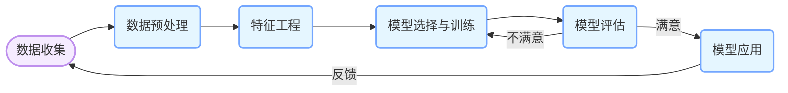

# 开发智能化的企业信用风险评估模型

> 关键词：企业信用风险评估、智能化模型、机器学习、数据分析、风险预警

> 摘要：本文围绕开发智能化的企业信用风险评估模型展开，深入探讨了其核心概念、算法原理、数学模型等关键内容。详细介绍了从背景知识到项目实战的各个环节，包括开发环境搭建、代码实现与解读。同时，阐述了该模型在实际应用场景中的作用，推荐了相关的学习资源、开发工具和论文著作。最后，总结了未来发展趋势与挑战，并对常见问题进行了解答，为开发智能化企业信用风险评估模型提供了全面而深入的指导。

## 1. 背景介绍 
### 1.1 目的和范围
在当今复杂多变的商业环境中，准确评估企业的信用风险对于金融机构、投资者以及合作伙伴至关重要。开发智能化的企业信用风险评估模型的目的在于利用先进的数据分析和机器学习技术，提高信用风险评估的准确性、效率和客观性。本模型的范围涵盖了从企业的财务数据、经营数据到市场环境等多维度信息的综合分析，旨在为各类决策提供可靠的信用风险参考。

### 1.2 预期读者
本文的预期读者包括金融行业从业者，如银行信贷分析师、投资经理等，他们可以利用该模型更好地评估企业信用风险，做出合理的信贷和投资决策；数据科学家和机器学习工程师，能够从模型的开发原理和技术实现中获取灵感和参考；企业管理人员也可以通过了解该模型，认识自身企业的信用状况，采取相应的措施来改善信用。

### 1.3 文档结构概述
本文将首先介绍企业信用风险评估的核心概念和相关联系，包括其原理和架构。接着详细阐述核心算法原理，并给出具体的操作步骤，同时使用 Python 源代码进行说明。然后介绍相关的数学模型和公式，并举例说明其应用。在项目实战部分，将介绍开发环境的搭建、源代码的详细实现和代码解读。之后探讨该模型的实际应用场景，推荐相关的工具和资源。最后总结未来发展趋势与挑战，解答常见问题，并提供扩展阅读和参考资料。

### 1.4 术语表
#### 1.4.1 核心术语定义
- **企业信用风险**：指企业在经营过程中，由于各种不确定因素导致其无法按时履行债务或其他契约义务的可能性。
- **信用风险评估模型**：用于评估企业信用风险程度的数学模型，通过对企业相关数据的分析和处理，给出信用风险的量化评估结果。
- **智能化模型**：利用人工智能技术，如机器学习、深度学习等，能够自动学习数据中的模式和规律，从而实现更准确、高效的信用风险评估的模型。

#### 1.4.2 相关概念解释
- **机器学习**：是一门多领域交叉学科，涉及概率论、统计学、逼近论、凸分析、算法复杂度理论等多门学科。它专门研究计算机怎样模拟或实现人类的学习行为，以获取新的知识或技能，重新组织已有的知识结构使之不断改善自身的性能。在企业信用风险评估中，机器学习算法可以自动从大量的企业数据中学习特征和规律，从而预测企业的信用风险。
- **特征工程**：是指对原始数据进行预处理、转换和选择，以提取出对模型预测有重要影响的特征的过程。在企业信用风险评估中，特征工程可以帮助我们从海量的企业数据中筛选出最能反映企业信用状况的特征，提高模型的性能。

#### 1.4.3 缩略词列表
- **PCA**：Principal Component Analysis，主成分分析，是一种常用的数据降维技术。
- **ROC**：Receiver Operating Characteristic，受试者工作特征曲线，用于评估分类模型的性能。
- **AUC**：Area Under the Curve，曲线下面积，是 ROC 曲线下的面积，用于衡量分类模型的性能。

## 2. 核心概念与联系 

### 核心概念原理
企业信用风险评估模型的核心原理是基于企业的各种数据，通过一定的算法和模型，对企业的信用风险进行量化评估。其基本思想是将企业的信用状况看作是一个多因素影响的结果，通过分析这些因素之间的关系和影响程度，建立一个能够准确预测企业信用风险的模型。

例如，企业的财务状况是影响其信用风险的重要因素之一。我们可以通过分析企业的资产负债表、利润表和现金流量表等财务数据，计算出一些财务指标，如资产负债率、利润率、现金流动比率等，来评估企业的财务健康状况。同时，企业的经营管理水平、市场竞争力、行业发展趋势等因素也会对其信用风险产生影响。因此，在构建信用风险评估模型时，需要综合考虑这些多维度的信息。

### 架构示意图
以下是一个简单的智能化企业信用风险评估模型的架构示意图：



### 架构解释
1. **数据收集**：收集企业的各种相关数据，包括财务数据、经营数据、市场数据等。这些数据可以来自企业的财务报表、税务记录、行业报告、市场调研等多个渠道。
2. **数据预处理**：对收集到的数据进行清洗、转换和归一化等处理，以消除数据中的噪声和异常值，使数据具有可比性和一致性。
3. **特征工程**：从预处理后的数据中提取出对企业信用风险评估有重要影响的特征。这可能包括对原始数据进行变换、组合和选择，以构建更具代表性和区分度的特征。
4. **模型选择与训练**：根据数据的特点和问题的需求，选择合适的机器学习模型，如逻辑回归、决策树、随机森林、支持向量机等，并使用训练数据对模型进行训练。
5. **模型评估**：使用测试数据对训练好的模型进行评估，计算模型的性能指标，如准确率、召回率、F1 值、ROC 曲线和 AUC 等。如果模型的性能不满意，则需要返回模型选择与训练步骤，调整模型参数或选择其他模型。
6. **模型应用**：将训练好的模型应用于实际的企业信用风险评估中，对新的企业数据进行预测，并给出信用风险评估结果。
7. **反馈**：将模型应用的结果反馈给数据收集阶段，以便不断更新和完善数据，提高模型的性能。

## 3. 核心算法原理 & 具体操作步骤 

### 逻辑回归算法原理
逻辑回归是一种常用的分类算法，在企业信用风险评估中可以用于预测企业是否会发生信用违约。其基本原理是通过对输入特征进行线性组合，然后通过逻辑函数将线性组合的结果映射到 0 到 1 之间的概率值。

逻辑函数的定义如下：
$$\sigma(z)=\frac{1}{1 + e^{-z}}$$
其中，$z$ 是输入特征的线性组合，即：
$$z = w_0 + w_1x_1 + w_2x_2 + \cdots + w_nx_n$$
这里，$w_0$ 是截距，$w_1, w_2, \cdots, w_n$ 是特征的权重，$x_1, x_2, \cdots, x_n$ 是输入特征。

逻辑回归的目标是找到一组最优的权重 $w_0, w_1, w_2, \cdots, w_n$，使得模型对训练数据的预测概率与实际标签之间的损失最小。常用的损失函数是对数损失函数，定义如下：
$$L(w)=-\frac{1}{m}\sum_{i=1}^{m}[y^{(i)}\log(\sigma(z^{(i)}))+(1 - y^{(i)})\log(1 - \sigma(z^{(i)}))]$$
其中，$m$ 是训练样本的数量，$y^{(i)}$ 是第 $i$ 个样本的实际标签（0 或 1），$z^{(i)}$ 是第 $i$ 个样本的线性组合结果。

### 具体操作步骤

#### 步骤 1：数据准备
首先，我们需要准备好企业信用风险评估的数据集。假设我们已经收集到了企业的财务数据和信用违约标签，我们可以使用 Python 的 Pandas 库来读取和处理数据。

```python
import pandas as pd

# 读取数据
data = pd.read_csv('credit_risk_data.csv')

# 分离特征和标签
X = data.drop('default', axis=1)
y = data['default']
```

#### 步骤 2：数据预处理
在进行模型训练之前，我们需要对数据进行预处理，包括数据清洗、缺失值处理和特征缩放等。

```python
from sklearn.preprocessing import StandardScaler
from sklearn.impute import SimpleImputer
from sklearn.model_selection import train_test_split

# 处理缺失值
imputer = SimpleImputer(strategy='mean')
X_imputed = imputer.fit_transform(X)

# 特征缩放
scaler = StandardScaler()
X_scaled = scaler.fit_transform(X_imputed)

# 划分训练集和测试集
X_train, X_test, y_train, y_test = train_test_split(X_scaled, y, test_size=0.2, random_state=42)
```

#### 步骤 3：模型训练
使用逻辑回归模型对训练数据进行训练。

```python
from sklearn.linear_model import LogisticRegression

# 创建逻辑回归模型
model = LogisticRegression()

# 训练模型
model.fit(X_train, y_train)
```

#### 步骤 4：模型预测
使用训练好的模型对测试数据进行预测。

```python
# 预测概率
y_pred_proba = model.predict_proba(X_test)[:, 1]

# 预测标签
y_pred = model.predict(X_test)
```

#### 步骤 5：模型评估
使用一些评估指标来评估模型的性能，如准确率、召回率、F1 值、ROC 曲线和 AUC 等。

```python
from sklearn.metrics import accuracy_score, recall_score, f1_score, roc_curve, auc
import matplotlib.pyplot as plt

# 计算准确率
accuracy = accuracy_score(y_test, y_pred)
print(f"Accuracy: {accuracy}")

# 计算召回率
recall = recall_score(y_test, y_pred)
print(f"Recall: {recall}")

# 计算 F1 值
f1 = f1_score(y_test, y_pred)
print(f"F1-score: {f1}")

# 计算 ROC 曲线和 AUC
fpr, tpr, thresholds = roc_curve(y_test, y_pred_proba)
roc_auc = auc(fpr, tpr)

# 绘制 ROC 曲线
plt.plot(fpr, tpr, label=f'ROC curve (area = {roc_auc:.2f})')
plt.plot([0, 1], [0, 1], 'k--')
plt.xlim([0.0, 1.0])
plt.ylim([0.0, 1.05])
plt.xlabel('False Positive Rate')
plt.ylabel('True Positive Rate')
plt.title('Receiver operating characteristic example')
plt.legend(loc="lower right")
plt.show()
```

## 4. 数学模型和公式 & 详细讲解 & 举例说明 

### 逻辑回归的数学模型和公式
逻辑回归的数学模型可以表示为：
$$P(y = 1|x)=\frac{1}{1 + e^{-(w_0 + w_1x_1 + w_2x_2 + \cdots + w_nx_n)}}$$
其中，$P(y = 1|x)$ 表示在给定特征 $x=(x_1, x_2, \cdots, x_n)$ 的情况下，企业发生信用违约（$y = 1$）的概率。

### 详细讲解
逻辑回归的核心是通过逻辑函数将线性组合的结果映射到概率值。线性组合 $z = w_0 + w_1x_1 + w_2x_2 + \cdots + w_nx_n$ 表示了特征对信用违约概率的影响程度。权重 $w_i$ 表示了第 $i$ 个特征的重要性，正的权重表示该特征增加会增加信用违约的概率，负的权重表示该特征增加会降低信用违约的概率。

逻辑函数 $\sigma(z)=\frac{1}{1 + e^{-z}}$ 的作用是将线性组合的结果 $z$ 映射到 0 到 1 之间的概率值。当 $z$ 趋近于正无穷时，$\sigma(z)$ 趋近于 1；当 $z$ 趋近于负无穷时，$\sigma(z)$ 趋近于 0。

### 举例说明
假设我们有一个简单的企业信用风险评估模型，只考虑两个特征：企业的资产负债率 $x_1$ 和利润率 $x_2$。逻辑回归模型的参数为 $w_0 = -1$，$w_1 = 0.5$，$w_2 = -0.3$。

对于一个企业，其资产负债率为 0.6，利润率为 0.1，我们可以计算其线性组合结果：
$$z = -1 + 0.5\times0.6 + (-0.3)\times0.1=-1 + 0.3 - 0.03=-0.73$$
然后，我们可以计算该企业发生信用违约的概率：
$$P(y = 1|x)=\frac{1}{1 + e^{-(-0.73)}}=\frac{1}{1 + e^{0.73}}\approx0.33$$
这意味着该企业发生信用违约的概率约为 0.33。

## 5. 项目实战：代码实际案例和详细解释说明 

### 5.1  开发环境搭建
#### 安装 Python
首先，需要安装 Python 环境。建议使用 Python 3.7 及以上版本。可以从 Python 官方网站（https://www.python.org/downloads/）下载并安装适合自己操作系统的 Python 版本。

#### 安装必要的库
使用 Python 的包管理工具 pip 安装必要的库，包括 Pandas、NumPy、Scikit-learn、Matplotlib 等。

```sh
pip install pandas numpy scikit-learn matplotlib
```

### 5.2  源代码详细实现和代码解读
以下是一个完整的企业信用风险评估模型的源代码示例：

```python
import pandas as pd
import numpy as np
from sklearn.preprocessing import StandardScaler
from sklearn.impute import SimpleImputer
from sklearn.model_selection import train_test_split
from sklearn.linear_model import LogisticRegression
from sklearn.metrics import accuracy_score, recall_score, f1_score, roc_curve, auc
import matplotlib.pyplot as plt

# 步骤 1：数据准备
# 读取数据
data = pd.read_csv('credit_risk_data.csv')

# 分离特征和标签
X = data.drop('default', axis=1)
y = data['default']

# 步骤 2：数据预处理
# 处理缺失值
imputer = SimpleImputer(strategy='mean')
X_imputed = imputer.fit_transform(X)

# 特征缩放
scaler = StandardScaler()
X_scaled = scaler.fit_transform(X_imputed)

# 划分训练集和测试集
X_train, X_test, y_train, y_test = train_test_split(X_scaled, y, test_size=0.2, random_state=42)

# 步骤 3：模型训练
# 创建逻辑回归模型
model = LogisticRegression()

# 训练模型
model.fit(X_train, y_train)

# 步骤 4：模型预测
# 预测概率
y_pred_proba = model.predict_proba(X_test)[:, 1]

# 预测标签
y_pred = model.predict(X_test)

# 步骤 5：模型评估
# 计算准确率
accuracy = accuracy_score(y_test, y_pred)
print(f"Accuracy: {accuracy}")

# 计算召回率
recall = recall_score(y_test, y_pred)
print(f"Recall: {recall}")

# 计算 F1 值
f1 = f1_score(y_test, y_pred)
print(f"F1-score: {f1}")

# 计算 ROC 曲线和 AUC
fpr, tpr, thresholds = roc_curve(y_test, y_pred_proba)
roc_auc = auc(fpr, tpr)

# 绘制 ROC 曲线
plt.plot(fpr, tpr, label=f'ROC curve (area = {roc_auc:.2f})')
plt.plot([0, 1], [0, 1], 'k--')
plt.xlim([0.0, 1.0])
plt.ylim([0.0, 1.05])
plt.xlabel('False Positive Rate')
plt.ylabel('True Positive Rate')
plt.title('Receiver operating characteristic example')
plt.legend(loc="lower right")
plt.show()
```

### 5.3  代码解读与分析
#### 数据准备
使用 Pandas 库的 `read_csv` 函数读取企业信用风险评估的数据集。然后，使用 `drop` 方法分离特征和标签。

#### 数据预处理
使用 `SimpleImputer` 类处理数据中的缺失值，这里采用均值填充的策略。使用 `StandardScaler` 类对特征进行缩放，使特征具有零均值和单位方差，有助于提高模型的训练效果。使用 `train_test_split` 函数将数据集划分为训练集和测试集，测试集占比为 20%。

#### 模型训练
使用 `LogisticRegression` 类创建逻辑回归模型，并使用 `fit` 方法对训练数据进行训练。

#### 模型预测
使用 `predict_proba` 方法预测测试数据的概率，使用 `predict` 方法预测测试数据的标签。

#### 模型评估
使用 `accuracy_score`、`recall_score` 和 `f1_score` 函数分别计算模型的准确率、召回率和 F1 值。使用 `roc_curve` 函数计算 ROC 曲线，使用 `auc` 函数计算 AUC 值。最后，使用 Matplotlib 库绘制 ROC 曲线。

## 6. 实际应用场景 
### 金融机构信贷审批
金融机构在进行信贷审批时，需要评估企业的信用风险，以决定是否给予贷款以及贷款的额度和利率。智能化的企业信用风险评估模型可以帮助金融机构更准确地评估企业的信用状况，降低信贷风险。例如，银行可以使用该模型对申请贷款的企业进行评估，根据评估结果决定是否批准贷款申请。

### 投资者决策
投资者在进行投资决策时，需要考虑企业的信用风险。智能化的企业信用风险评估模型可以为投资者提供参考，帮助他们评估投资的风险和收益。例如，投资者可以使用该模型对不同企业进行评估，选择信用风险较低的企业进行投资。

### 企业供应链管理
在企业的供应链管理中，供应商的信用风险会影响到企业的生产和运营。智能化的企业信用风险评估模型可以帮助企业评估供应商的信用状况，选择信用良好的供应商，降低供应链风险。例如，企业可以使用该模型对潜在的供应商进行评估，确保供应链的稳定。

### 信用评级机构
信用评级机构的主要职责是对企业的信用状况进行评级。智能化的企业信用风险评估模型可以为信用评级机构提供更客观、准确的评估方法，提高信用评级的质量。例如，信用评级机构可以使用该模型对企业进行评估，给出相应的信用评级。

## 7. 工具和资源推荐
### 7.1 学习资源推荐
#### 7.1.1 书籍推荐
- 《Python 机器学习》（Sebastian Raschka 著）：这本书详细介绍了使用 Python 进行机器学习的方法和技术，包括数据预处理、模型选择、模型评估等内容，非常适合初学者入门。
- 《统计学习方法》（李航 著）：这本书系统地介绍了统计学习的基本概念、方法和理论，是机器学习领域的经典教材之一，对于深入理解机器学习算法的原理有很大帮助。
- 《信用风险分析与管理》（John B. Caouette 等著）：这本书专门介绍了信用风险分析和管理的方法和技术，包括信用评分模型、违约概率估计、信用风险度量等内容，对于从事企业信用风险评估的人员非常有参考价值。

#### 7.1.2 在线课程
- Coursera 上的“机器学习”课程（Andrew Ng 教授）：这是一门非常经典的机器学习在线课程，涵盖了机器学习的基本概念、算法和应用，通过视频讲解、编程作业和测验等方式帮助学员掌握机器学习的知识和技能。
- edX 上的“数据科学与机器学习微硕士”课程：该课程由多个模块组成，包括数据科学基础、机器学习算法、深度学习等内容，适合有一定编程基础的学员深入学习数据科学和机器学习。
- 中国大学 MOOC 上的“Python 数据分析与挖掘实战”课程：该课程结合实际案例，介绍了使用 Python 进行数据分析和挖掘的方法和技术，包括数据预处理、特征工程、模型选择和评估等内容，对于初学者来说是一个很好的学习资源。

#### 7.1.3 技术博客和网站
- Kaggle（https://www.kaggle.com/）：这是一个数据科学和机器学习竞赛平台，上面有很多优秀的数据集和代码示例，同时还有很多数据科学家分享自己的经验和见解，可以帮助我们学习和提高。
- Medium（https://medium.com/）：这是一个技术博客平台，上面有很多关于机器学习、数据分析等领域的优秀文章，涵盖了从基础概念到前沿技术的各个方面。
- 机器之心（https://www.almosthuman.cn/）：这是一个专注于人工智能领域的媒体平台，提供了大量的人工智能技术文章、研究报告和行业动态，对于了解人工智能领域的最新发展非常有帮助。

### 7.2 开发工具框架推荐
#### 7.2.1 IDE和编辑器
- PyCharm：这是一款专门为 Python 开发设计的集成开发环境（IDE），具有代码自动补全、调试、版本控制等功能，非常适合开发 Python 项目。
- Jupyter Notebook：这是一个交互式的开发环境，支持多种编程语言，特别适合进行数据探索和分析。可以通过浏览器访问，方便地编写和运行代码，同时还可以添加文本说明和可视化图表。
- Visual Studio Code：这是一款轻量级的代码编辑器，支持多种编程语言和插件扩展。可以通过安装 Python 相关的插件，实现代码自动补全、调试等功能，是一个非常流行的开发工具。

#### 7.2.2 调试和性能分析工具
- Py-Spy：这是一个用于分析 Python 程序性能的工具，可以实时监测 Python 程序的 CPU 使用率、函数调用时间等信息，帮助我们找出程序中的性能瓶颈。
- cProfile：这是 Python 标准库中的一个性能分析模块，可以统计 Python 程序中各个函数的调用次数、执行时间等信息，帮助我们分析程序的性能。
- PDB：这是 Python 标准库中的一个调试模块，可以在程序运行过程中设置断点，单步执行代码，查看变量的值等，帮助我们调试程序中的错误。

#### 7.2.3 相关框架和库
- Scikit-learn：这是一个常用的机器学习库，提供了丰富的机器学习算法和工具，包括分类、回归、聚类、降维等算法，以及数据预处理、模型选择和评估等工具。
- TensorFlow：这是一个开源的深度学习框架，由 Google 开发。可以用于构建和训练各种深度学习模型，如神经网络、卷积神经网络、循环神经网络等。
- PyTorch：这是另一个开源的深度学习框架，由 Facebook 开发。具有动态计算图的特点，易于使用和调试，在学术界和工业界都有广泛的应用。

### 7.3 相关论文著作推荐
#### 7.3.1 经典论文
- “Credit Scoring Using Neural Networks”（West, D. 著）：这篇论文介绍了使用神经网络进行信用评分的方法和技术，探讨了神经网络在信用风险评估中的应用。
- “A Comparative Analysis of Credit Scoring Models”（Baesens, B. 等著）：这篇论文对不同的信用评分模型进行了比较分析，包括逻辑回归、决策树、支持向量机等模型，评估了它们在信用风险评估中的性能。
- “Machine Learning Techniques for Credit Risk Assessment”（Abdou, H. 等著）：这篇论文介绍了机器学习技术在信用风险评估中的应用，包括特征选择、模型选择和评估等方面的内容。

#### 7.3.2 最新研究成果
- 在顶级学术会议如 KDD（Knowledge Discovery and Data Mining）、ICML（International Conference on Machine Learning）等上发表的关于企业信用风险评估的研究论文，这些论文通常代表了该领域的最新研究成果和发展趋势。
- 在顶级学术期刊如 Journal of Financial Economics、Management Science 等上发表的关于信用风险评估的研究论文，这些论文具有较高的学术水平和影响力。

#### 7.3.3 应用案例分析
- 一些金融机构和企业发布的关于企业信用风险评估模型应用的案例分析报告，这些报告可以帮助我们了解实际应用中模型的效果和面临的挑战。
- 一些咨询公司发布的关于信用风险评估市场的研究报告，这些报告可以帮助我们了解行业的发展现状和趋势。

## 8. 总结：未来发展趋势与挑战
### 未来发展趋势
#### 多源数据融合
未来的企业信用风险评估模型将不仅仅依赖于传统的财务数据，还会融合更多的多源数据，如社交媒体数据、物联网数据、卫星图像数据等。这些多源数据可以提供更全面、更及时的企业信息，有助于提高信用风险评估的准确性。

#### 深度学习和强化学习的应用
深度学习和强化学习等人工智能技术将在企业信用风险评估中得到更广泛的应用。深度学习可以自动学习数据中的复杂模式和特征，强化学习可以根据环境的反馈不断优化模型的决策策略，从而提高信用风险评估的性能。

#### 可解释性模型的发展
随着人工智能技术在金融领域的广泛应用，模型的可解释性变得越来越重要。未来的企业信用风险评估模型将更加注重可解释性，以便金融机构和监管部门能够理解模型的决策过程和依据。

#### 实时监测和预警
未来的企业信用风险评估模型将具备实时监测和预警的能力，可以及时发现企业信用风险的变化，并发出预警信号。这有助于金融机构和投资者及时采取措施，降低信用风险。

### 挑战
#### 数据质量和隐私问题
多源数据的融合需要解决数据质量和隐私问题。不同来源的数据可能存在格式不一致、噪声和缺失值等问题，需要进行有效的数据清洗和预处理。同时，数据隐私保护也是一个重要的问题，需要遵守相关的法律法规和行业标准。

#### 模型复杂度和计算资源
深度学习和强化学习等模型通常具有较高的复杂度，需要大量的计算资源和时间进行训练。如何在保证模型性能的前提下，降低模型的复杂度和计算成本，是一个需要解决的问题。

#### 模型可解释性和透明度
虽然可解释性模型是未来的发展趋势，但目前大多数深度学习和强化学习模型的可解释性较差。如何提高模型的可解释性和透明度，让金融机构和监管部门能够理解模型的决策过程和依据，是一个挑战。

#### 监管和合规要求
金融领域的监管和合规要求非常严格，企业信用风险评估模型需要满足相关的监管和合规要求。如何确保模型的开发和应用符合监管和合规要求，是一个需要考虑的问题。

## 9. 附录：常见问题与解答
### 问题 1：如何选择合适的特征用于企业信用风险评估？
答：选择合适的特征需要考虑多个因素。首先，可以从企业的财务报表中提取一些关键的财务指标，如资产负债率、利润率、现金流动比率等，这些指标可以反映企业的财务健康状况。其次，可以考虑企业的经营数据，如销售额、市场份额、客户满意度等，这些指标可以反映企业的经营能力和市场竞争力。此外，还可以考虑行业数据、宏观经济数据等外部因素，这些因素可以反映企业所处的市场环境和宏观经济形势。在选择特征时，可以使用特征选择算法，如相关性分析、卡方检验、随机森林特征重要性等，来筛选出对模型预测有重要影响的特征。

### 问题 2：如何处理数据中的缺失值？
答：处理数据中的缺失值有多种方法。常见的方法包括删除含有缺失值的样本、使用均值、中位数或众数填充缺失值、使用插值法填充缺失值、使用机器学习算法预测缺失值等。选择哪种方法需要根据数据的特点和问题的需求来决定。例如，如果缺失值的比例较小，可以考虑删除含有缺失值的样本；如果缺失值的比例较大，可以考虑使用均值、中位数或众数填充缺失值；如果数据具有一定的时间序列特征，可以考虑使用插值法填充缺失值；如果数据的特征之间存在复杂的关系，可以考虑使用机器学习算法预测缺失值。

### 问题 3：如何评估企业信用风险评估模型的性能？
答：评估企业信用风险评估模型的性能可以使用多种指标。常见的指标包括准确率、召回率、F1 值、ROC 曲线和 AUC 等。准确率表示模型预测正确的样本占总样本的比例；召回率表示模型正确预测为正类的样本占实际正类样本的比例；F1 值是准确率和召回率的调和平均数，可以综合考虑模型的准确性和召回率；ROC 曲线是描述模型在不同阈值下的真阳性率和假阳性率之间的关系的曲线，AUC 是 ROC 曲线下的面积，可以衡量模型的整体性能。在评估模型性能时，需要根据问题的需求选择合适的指标，并结合实际情况进行分析。

### 问题 4：如何提高企业信用风险评估模型的性能？
答：提高企业信用风险评估模型的性能可以从多个方面入手。首先，可以优化数据质量，包括处理缺失值、异常值和噪声，进行特征工程，提取更有代表性和区分度的特征。其次，可以选择合适的模型，根据数据的特点和问题的需求，选择合适的机器学习算法，如逻辑回归、决策树、随机森林、支持向量机等，并进行模型调优，调整模型的参数以提高模型的性能。此外，还可以使用集成学习方法，将多个模型的预测结果进行组合，以提高模型的准确性和稳定性。最后，可以不断更新和完善数据集，随着时间的推移，企业的信用状况会发生变化，需要及时更新数据集，以保证模型的性能。

## 10. 扩展阅读 & 参考资料
### 扩展阅读
- 《人工智能时代的金融风险管理》：这本书探讨了人工智能技术在金融风险管理中的应用，包括信用风险评估、市场风险评估、操作风险评估等方面的内容，对于了解人工智能技术在金融领域的应用有很大帮助。
- 《大数据与金融》：这本书介绍了大数据技术在金融领域的应用，包括数据采集、数据存储、数据分析和数据应用等方面的内容，对于了解大数据技术在金融领域的应用有很大帮助。
- 《信用评级理论与实务》：这本书系统地介绍了信用评级的基本概念、方法和理论，包括信用评级的流程、信用评级模型的构建、信用评级的应用等方面的内容，对于从事信用评级工作的人员非常有参考价值。

### 参考资料
- 相关的学术论文和研究报告，如在顶级学术会议和期刊上发表的关于企业信用风险评估的论文和报告。
- 金融机构和企业发布的关于企业信用风险评估的案例分析报告和研究报告。
- 相关的行业标准和规范，如金融监管部门发布的关于信用风险评估的相关标准和规范。

作者：AI天才研究院/AI Genius Institute & 禅与计算机程序设计艺术 /Zen And The Art of Computer Programming