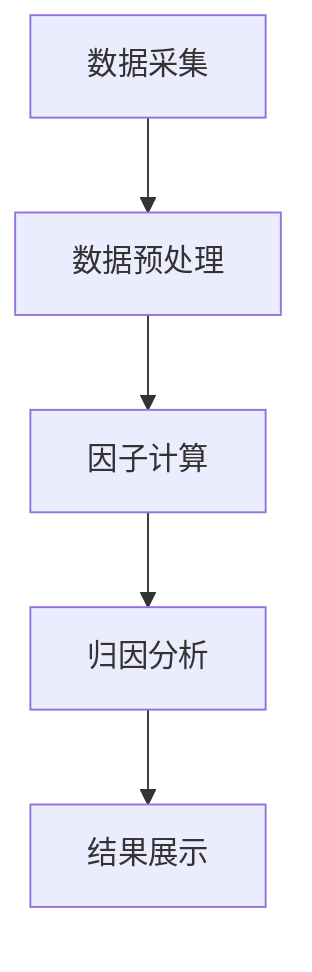

# 开发智能化的资产配置策略归因分析引擎

> 关键词：资产配置策略、归因分析引擎、智能化开发、投资绩效、数据分析

> 摘要：本文聚焦于智能化的资产配置策略归因分析引擎的开发。首先介绍了开发该引擎的背景、目的、预期读者和文档结构等内容。接着详细阐述了核心概念及其联系，包括相关原理和架构的示意图与流程图。深入讲解了核心算法原理，通过Python源代码进行了具体说明，并给出了数学模型和公式以及实际例子。在项目实战部分，从开发环境搭建、源代码实现与解读等方面进行了详细分析。同时探讨了该引擎的实际应用场景，推荐了学习资源、开发工具框架和相关论文著作。最后总结了未来发展趋势与挑战，提供了常见问题解答和扩展阅读参考资料，旨在为开发者和投资者提供全面且深入的技术指导。

## 1. 背景介绍 
### 1.1 目的和范围
资产配置在投资领域中起着至关重要的作用，合理的资产配置策略能够有效降低风险、提高收益。然而，要评估资产配置策略的有效性以及理解其收益来源并非易事。开发智能化的资产配置策略归因分析引擎的主要目的是为投资者、基金经理和金融分析师等提供一个强大的工具，用于深入分析资产配置策略的绩效，找出影响收益的关键因素，从而优化投资组合。

本引擎的范围涵盖了多种常见的资产类别，如股票、债券、基金等，支持对不同时间跨度和市场环境下的资产配置策略进行归因分析。它不仅能够分析传统的资产配置策略，还可以适应新兴的量化投资策略和智能投资组合。

### 1.2 预期读者
- **投资者**：包括个人投资者和机构投资者，他们可以利用该引擎了解自己的投资组合表现，找出优势和不足，以便调整投资策略。
- **基金经理**：帮助基金经理评估基金的业绩，分析不同投资决策对基金收益的影响，从而优化基金的资产配置。
- **金融分析师**：为金融分析师提供深入的数据分析工具，辅助他们进行市场研究和投资建议的制定。
- **技术开发者**：对于从事金融科技领域开发的技术人员，本文章可以作为开发类似归因分析引擎的参考。

### 1.3 文档结构概述
本文将按照以下结构进行组织：首先介绍核心概念与联系，让读者了解资产配置策略归因分析的基本原理和架构；接着详细阐述核心算法原理和具体操作步骤，通过Python代码进行说明；然后给出相关的数学模型和公式，并举例说明其应用；在项目实战部分，将介绍开发环境搭建、源代码实现和代码解读；之后探讨该引擎的实际应用场景；再推荐相关的学习资源、开发工具框架和论文著作；最后总结未来发展趋势与挑战，提供常见问题解答和扩展阅读参考资料。

### 1.4 术语表
#### 1.4.1 核心术语定义
- **资产配置策略**：是指投资者根据自身的投资目标、风险承受能力和市场情况，将资金分配到不同资产类别的计划和方法。
- **归因分析**：是一种分析方法，用于确定资产配置策略的收益来源，即找出哪些因素对投资组合的收益产生了影响以及影响的程度。
- **投资组合**：是由多种资产组成的集合，投资者通过持有不同的资产来分散风险和实现投资目标。
- **因子模型**：是一种用于描述资产收益与多个因子之间关系的数学模型，通过因子模型可以进行归因分析。

#### 1.4.2 相关概念解释
- **风格因子**：是指影响资产收益的特定特征，如市值大小、估值水平、动量等。不同的风格因子在不同的市场环境下对资产收益的影响不同。
- **行业因子**：反映了不同行业的表现对资产收益的影响。由于不同行业的发展前景、盈利能力和风险特征不同，行业因子在归因分析中具有重要作用。
- **择时能力**：是指投资者在市场时机把握方面的能力，即判断何时买入或卖出资产以获取更好的收益。

#### 1.4.3 缩略词列表
- **CAPM**：Capital Asset Pricing Model，资本资产定价模型。
- **Fama - French三因子模型**：一种经典的因子模型，包含市场因子、规模因子和价值因子。
- **Barra模型**：一种广泛应用的多因子风险模型，用于分析资产的风险和收益。

## 2. 核心概念与联系 

### 核心概念原理
资产配置策略归因分析的核心原理是通过建立合适的模型，将投资组合的收益分解为不同因素的贡献。常见的方法是使用因子模型，因子模型认为资产的收益可以由多个因子共同解释。例如，Fama - French三因子模型认为股票的收益可以由市场因子、规模因子和价值因子来解释，公式表示为：

$$R_{i,t}-R_{f,t}=\alpha_{i}+\beta_{i,MKT}(R_{MKT,t}-R_{f,t})+\beta_{i,SMB}SMB_{t}+\beta_{i,HML}HML_{t}+\epsilon_{i,t}$$

其中，$R_{i,t}$ 是股票 $i$ 在时间 $t$ 的收益率，$R_{f,t}$ 是无风险收益率，$R_{MKT,t}$ 是市场组合的收益率，$SMB_{t}$ 是规模因子，$HML_{t}$ 是价值因子，$\alpha_{i}$ 是股票 $i$ 的超额收益，$\beta_{i,MKT}$、$\beta_{i,SMB}$ 和 $\beta_{i,HML}$ 分别是股票 $i$ 对市场因子、规模因子和价值因子的敏感度，$\epsilon_{i,t}$ 是残差项。

通过对投资组合中每只资产的因子敏感度进行加权平均，可以得到投资组合的因子暴露。然后，根据因子的收益率和投资组合的因子暴露，就可以计算出每个因子对投资组合收益的贡献。

### 架构的文本示意图
以下是智能化的资产配置策略归因分析引擎的架构示意图：

| 模块 | 功能描述 |
| --- | --- |
| 数据采集模块 | 从各种数据源（如金融数据库、交易系统等）收集资产价格、基本面数据、市场指数等信息。 |
| 数据预处理模块 | 对采集到的数据进行清洗、转换和标准化处理，以提高数据质量。 |
| 因子计算模块 | 根据预处理后的数据计算各种因子，如风格因子、行业因子等。 |
| 归因分析模块 | 使用因子模型对投资组合的收益进行归因分析，计算每个因子的贡献。 |
| 结果展示模块 | 将归因分析的结果以可视化的方式展示给用户，如柱状图、折线图等。 |

### Mermaid 流程图


## 3. 核心算法原理 & 具体操作步骤 

### 核心算法原理
我们以Fama - French三因子模型为例，详细讲解归因分析的核心算法原理。

首先，需要收集市场数据，包括市场组合的收益率、无风险收益率、股票的收益率等。然后，根据股票的市值和账面市值比等指标计算规模因子 $SMB$ 和价值因子 $HML$。

接下来，使用线性回归方法估计每只股票对市场因子、规模因子和价值因子的敏感度 $\beta$。对于投资组合，通过对每只股票的 $\beta$ 进行加权平均，得到投资组合的因子暴露。

最后，根据因子的收益率和投资组合的因子暴露，计算每个因子对投资组合收益的贡献。具体计算公式如下：

因子贡献 $= $ 因子暴露 $\times$ 因子收益率

### 具体操作步骤
以下是使用Python实现Fama - French三因子模型归因分析的具体步骤和代码：

```python
import pandas as pd
import numpy as np
import statsmodels.api as sm

# 步骤1：数据准备
# 假设我们已经有了股票收益率、市场收益率、无风险收益率、SMB和HML因子数据
# 这里使用随机数据进行示例
np.random.seed(0)
n = 100
stock_returns = pd.Series(np.random.randn(n))
market_returns = pd.Series(np.random.randn(n))
risk_free_rate = pd.Series(np.zeros(n))
smb = pd.Series(np.random.randn(n))
hml = pd.Series(np.random.randn(n))

# 步骤2：计算超额收益率
excess_stock_returns = stock_returns - risk_free_rate
excess_market_returns = market_returns - risk_free_rate

# 步骤3：构建因子矩阵
X = pd.concat([excess_market_returns, smb, hml], axis=1)
X = sm.add_constant(X)

# 步骤4：进行线性回归
model = sm.OLS(excess_stock_returns, X)
results = model.fit()

# 步骤5：获取因子敏感度
beta_mkt = results.params[1]
beta_smb = results.params[2]
beta_hml = results.params[3]

# 步骤6：计算因子贡献
factor_contributions = {
    '市场因子贡献': beta_mkt * excess_market_returns.mean(),
    '规模因子贡献': beta_smb * smb.mean(),
    '价值因子贡献': beta_hml * hml.mean()
}

print("因子贡献：", factor_contributions)
```

## 4. 数学模型和公式 & 详细讲解 & 举例说明 

### 数学模型和公式
除了前面提到的Fama - French三因子模型，还有其他常见的因子模型，如Barra模型。Barra模型是一种多因子风险模型，其基本形式为：

$$R_{i}=\sum_{k = 1}^{K} \beta_{i,k} F_{k}+\epsilon_{i}$$

其中，$R_{i}$ 是资产 $i$ 的收益率，$\beta_{i,k}$ 是资产 $i$ 对因子 $k$ 的敏感度，$F_{k}$ 是因子 $k$ 的收益率，$\epsilon_{i}$ 是残差项。

在归因分析中，投资组合的收益可以表示为：

$$R_{p}=\sum_{i = 1}^{N} w_{i}R_{i}$$

其中，$R_{p}$ 是投资组合的收益率，$w_{i}$ 是资产 $i$ 在投资组合中的权重，$N$ 是投资组合中资产的数量。

将资产的收益公式代入投资组合的收益公式中，可以得到：

$$R_{p}=\sum_{i = 1}^{N} w_{i}\left(\sum_{k = 1}^{K} \beta_{i,k} F_{k}+\epsilon_{i}\right)=\sum_{k = 1}^{K}\left(\sum_{i = 1}^{N} w_{i}\beta_{i,k}\right)F_{k}+\sum_{i = 1}^{N} w_{i}\epsilon_{i}$$

其中，$\sum_{i = 1}^{N} w_{i}\beta_{i,k}$ 是投资组合对因子 $k$ 的暴露。

### 详细讲解
上述公式的含义是，投资组合的收益可以分解为多个因子的贡献和残差项的贡献。每个因子的贡献等于投资组合对该因子的暴露乘以该因子的收益率。通过这种方式，可以清晰地了解每个因子对投资组合收益的影响。

### 举例说明
假设我们有一个投资组合，包含两只股票A和B，权重分别为 $w_{A}=0.6$ 和 $w_{B}=0.4$。股票A对市场因子的敏感度 $\beta_{A,MKT}=1.2$，对规模因子的敏感度 $\beta_{A,SMB}=0.8$；股票B对市场因子的敏感度 $\beta_{B,MKT}=0.9$，对规模因子的敏感度 $\beta_{B,SMB}=0.6$。市场因子的收益率 $R_{MKT}=0.1$，规模因子的收益率 $R_{SMB}=0.05$。

首先，计算投资组合对市场因子的暴露：

$$\beta_{p,MKT}=w_{A}\beta_{A,MKT}+w_{B}\beta_{B,MKT}=0.6\times1.2 + 0.4\times0.9 = 1.08$$

投资组合对规模因子的暴露：

$$\beta_{p,SMB}=w_{A}\beta_{A,SMB}+w_{B}\beta_{B,SMB}=0.6\times0.8 + 0.4\times0.6 = 0.72$$

然后，计算市场因子的贡献：

$$贡献_{MKT}=\beta_{p,MKT}\times R_{MKT}=1.08\times0.1 = 0.108$$

规模因子的贡献：

$$贡献_{SMB}=\beta_{p,SMB}\times R_{SMB}=0.72\times0.05 = 0.036$$

通过这个例子可以看出，我们可以通过计算投资组合对不同因子的暴露和因子的收益率，来确定每个因子对投资组合收益的贡献。

## 5. 项目实战：代码实际案例和详细解释说明 

### 5.1  开发环境搭建
为了开发智能化的资产配置策略归因分析引擎，我们需要搭建相应的开发环境。以下是具体的步骤：

- **安装Python**：建议使用Python 3.7及以上版本，可以从Python官方网站（https://www.python.org/downloads/）下载并安装。
- **安装必要的库**：我们需要安装一些常用的Python库，如pandas、numpy、statsmodels、matplotlib等。可以使用pip命令进行安装：

```bash
pip install pandas numpy statsmodels matplotlib
```

- **数据获取**：可以使用金融数据接口，如Tushare、BaoStock等获取股票价格、基本面数据等信息。以Tushare为例，需要先在Tushare官网（https://tushare.pro/）注册并获取token，然后安装Tushare库：

```bash
pip install tushare
```

### 5.2  源代码详细实现和代码解读
以下是一个完整的资产配置策略归因分析引擎的Python代码示例：

```python
import tushare as ts
import pandas as pd
import numpy as np
import statsmodels.api as sm
import matplotlib.pyplot as plt

# 设置Tushare token
ts.set_token('your_token')
pro = ts.pro_api()

# 步骤1：获取数据
def get_data(codes, start_date, end_date):
    data = {}
    for code in codes:
        df = pro.daily(ts_code=code, start_date=start_date, end_date=end_date)
        df = df.sort_values('trade_date')
        df['return'] = df['close'].pct_change()
        data[code] = df
    return data

# 步骤2：计算因子
def calculate_factors(data):
    # 这里简单使用市场平均收益率作为市场因子
    all_returns = pd.concat([data[code]['return'] for code in data], axis=1)
    market_return = all_returns.mean(axis=1)
    return market_return

# 步骤3：归因分析
def attribution_analysis(data, market_return):
    factor_contributions = {}
    for code in data:
        stock_return = data[code]['return'].dropna()
        market_return = market_return.loc[stock_return.index]
        X = sm.add_constant(market_return)
        model = sm.OLS(stock_return, X)
        results = model.fit()
        beta = results.params[1]
        factor_contribution = beta * market_return.mean()
        factor_contributions[code] = factor_contribution
    return factor_contributions

# 步骤4：结果展示
def show_results(factor_contributions):
    plt.bar(factor_contributions.keys(), factor_contributions.values())
    plt.xlabel('股票代码')
    plt.ylabel('市场因子贡献')
    plt.title('资产配置策略归因分析')
    plt.show()

# 主函数
if __name__ == "__main__":
    codes = ['000001.SZ', '000002.SZ']
    start_date = '20200101'
    end_date = '20210101'
    data = get_data(codes, start_date, end_date)
    market_return = calculate_factors(data)
    factor_contributions = attribution_analysis(data, market_return)
    show_results(factor_contributions)
```

### 5.3  代码解读与分析
- **get_data函数**：该函数用于从Tushare获取指定股票在指定日期范围内的日线数据，并计算每日收益率。
- **calculate_factors函数**：这里简单地将所有股票的平均收益率作为市场因子。在实际应用中，可以使用更复杂的方法计算因子。
- **attribution_analysis函数**：对每只股票进行线性回归，估计其对市场因子的敏感度 $\beta$，并计算市场因子的贡献。
- **show_results函数**：使用matplotlib库将市场因子的贡献以柱状图的形式展示出来，方便用户直观地观察。

## 6. 实际应用场景 
### 投资者评估投资组合
个人投资者可以使用智能化的资产配置策略归因分析引擎来评估自己的投资组合。通过分析不同因子对投资组合收益的贡献，投资者可以了解自己的投资策略是否有效，哪些因子对收益的影响较大。例如，如果发现市场因子的贡献较大，说明投资组合的收益主要受市场整体走势的影响；如果规模因子的贡献较大，可能表示投资组合更倾向于投资小盘股。投资者可以根据归因分析的结果调整投资组合，以实现更好的风险 - 收益平衡。

### 基金经理业绩评估
基金经理可以利用该引擎对基金的业绩进行评估。通过归因分析，基金经理可以了解基金的收益来源，判断自己的投资决策是否正确。例如，如果基金在某个时间段内的业绩不佳，通过归因分析可以找出是哪些因子导致了业绩下滑，是市场环境不利，还是基金的行业配置或选股策略存在问题。基金经理可以根据分析结果调整投资策略，提高基金的业绩。

### 金融分析师市场研究
金融分析师可以使用归因分析引擎进行市场研究。通过对不同资产类别、行业和风格因子的分析，金融分析师可以了解市场的运行规律和趋势。例如，分析不同行业因子在不同市场环境下的表现，可以为投资者提供行业配置建议；研究风格因子的变化，可以帮助投资者把握市场的风格轮动机会。

## 7. 工具和资源推荐
### 7.1 学习资源推荐
#### 7.1.1 书籍推荐
- 《投资学》（原书第10版）：作者是滋维·博迪等，这本书是投资领域的经典教材，系统地介绍了投资学的基本概念、理论和方法，包括资产配置、投资组合理论、风险管理等内容，对于理解资产配置策略归因分析的基础原理非常有帮助。
- 《因子投资：方法与实践》：详细介绍了因子投资的理论和实践，包括因子的定义、构建、测试和应用等方面，是学习因子模型和归因分析的重要参考书籍。
- 《量化投资：策略与技术》：作者是丁鹏，这本书结合了量化投资的理论和实践，介绍了多种量化投资策略和技术，包括资产配置策略归因分析的方法和应用案例。

#### 7.1.2 在线课程
- Coursera上的“投资学原理”课程：由知名高校的教授授课，系统地讲解了投资学的基本原理和方法，包括资产定价、投资组合理论等内容，适合初学者学习。
- 中国大学MOOC上的“量化投资与金融科技”课程：该课程介绍了量化投资的基本概念、策略和技术，包括因子模型和归因分析的应用，对于有一定编程基础的学习者来说是一个很好的学习资源。

#### 7.1.3 技术博客和网站
- 优矿（https://uqer.datayes.com/）：是一个专业的量化投资平台，提供了丰富的金融数据、量化策略和研究报告，同时还有很多关于资产配置和归因分析的技术文章和案例分享。
- 聚宽（https://www.joinquant.com/）：也是一个知名的量化投资平台，有大量的量化投资教程和社区讨论，对于学习资产配置策略归因分析的技术实现有很大的帮助。

### 7.2 开发工具框架推荐
#### 7.2.1 IDE和编辑器
- PyCharm：是一款专业的Python集成开发环境，具有强大的代码编辑、调试和项目管理功能，适合开发复杂的Python程序，包括资产配置策略归因分析引擎。
- Jupyter Notebook：是一个交互式的开发环境，支持代码、文本、图表等多种形式的展示，非常适合进行数据分析和模型验证，在开发归因分析引擎的过程中可以方便地进行数据探索和模型调试。

#### 7.2.2 调试和性能分析工具
- pdb：是Python内置的调试工具，可以帮助开发者在代码运行过程中进行单步调试、查看变量值等操作，方便排查代码中的错误。
- cProfile：是Python的性能分析工具，可以分析代码的运行时间和函数调用次数，帮助开发者找出代码中的性能瓶颈，进行优化。

#### 7.2.3 相关框架和库
- pandas：是一个强大的数据处理和分析库，提供了丰富的数据结构和函数，方便进行数据清洗、转换和分析，在归因分析中可以用于处理金融数据。
- numpy：是Python的数值计算库，提供了高效的数组操作和数学函数，在计算因子和进行线性回归等操作中发挥重要作用。
- statsmodels：是一个用于统计建模和计量经济学分析的Python库，提供了多种统计模型和方法，如线性回归、时间序列分析等，在归因分析中可以用于估计因子敏感度。

### 7.3 相关论文著作推荐
#### 7.3.1 经典论文
- Fama, E. F., & French, K. R. (1993). Common risk factors in the returns on stocks and bonds. Journal of Financial Economics, 33(1), 3-56. 这篇论文提出了Fama - French三因子模型，是因子模型领域的经典之作，为资产配置策略归因分析提供了重要的理论基础。
- Sharpe, W. F. (1964). Capital asset prices: A theory of market equilibrium under conditions of risk. The Journal of Finance, 19(3), 425-442. 该论文提出了资本资产定价模型（CAPM），是现代金融理论的重要基石之一，对于理解资产的风险和收益关系具有重要意义。

#### 7.3.2 最新研究成果
- 关注顶级金融学术期刊，如The Journal of Finance、The Review of Financial Studies等，这些期刊会发表最新的关于资产配置、因子模型和归因分析的研究成果。
- 参加金融学术会议，如美国金融协会（AFA）年会、西部金融协会（WFA）年会等，在会议上可以了解到该领域的最新研究动态和前沿技术。

#### 7.3.3 应用案例分析
- 可以参考一些知名金融机构的研究报告和案例分析，如高盛、摩根大通等的研究报告，了解他们在资产配置策略归因分析方面的实践经验和应用案例。

## 8. 总结：未来发展趋势与挑战
### 未来发展趋势
- **智能化和自动化**：随着人工智能和机器学习技术的不断发展，资产配置策略归因分析引擎将越来越智能化和自动化。例如，利用深度学习算法可以自动识别和提取影响资产收益的关键因子，提高归因分析的准确性和效率。
- **多因子融合**：未来的归因分析将不仅仅局限于传统的因子模型，而是会融合更多的因子，如宏观经济因子、情绪因子、技术因子等，以更全面地解释资产的收益来源。
- **实时分析**：投资者对实时信息的需求越来越高，未来的归因分析引擎将具备实时分析的能力，能够及时反映市场的变化和投资组合的动态，为投资者提供更及时的决策支持。

### 挑战
- **数据质量和可用性**：归因分析需要大量的高质量金融数据，包括资产价格、基本面数据、宏观经济数据等。然而，数据的质量和可用性往往受到多种因素的影响，如数据缺失、数据错误、数据延迟等，这给归因分析带来了一定的挑战。
- **模型复杂性和解释性**：随着因子模型的不断发展和多因子的融合，模型的复杂性越来越高。这不仅增加了模型的训练和计算成本，还降低了模型的解释性，使得投资者难以理解归因分析的结果。
- **市场不确定性**：金融市场具有高度的不确定性，市场环境和投资者行为随时可能发生变化。这使得归因分析的结果在不同的市场环境下可能存在较大的差异，如何提高归因分析的稳定性和适应性是一个亟待解决的问题。

## 9. 附录：常见问题与解答
### 问题1：归因分析的结果是否准确可靠？
归因分析的结果受到多种因素的影响，如数据质量、模型选择、市场环境等。虽然归因分析可以提供有价值的信息，但不能保证结果的绝对准确可靠。在使用归因分析结果时，需要结合其他信息和分析方法进行综合判断。

### 问题2：如何选择合适的因子模型？
选择合适的因子模型需要考虑多个因素，如投资目标、资产类别、市场环境等。一般来说，可以根据研究目的和数据特点选择经典的因子模型，如Fama - French三因子模型、Barra模型等，也可以根据实际情况构建自定义的因子模型。

### 问题3：归因分析引擎的开发难度大吗？
归因分析引擎的开发难度取决于多个因素，如功能需求、数据来源、技术实现等。对于有一定编程基础和金融知识的开发者来说，开发一个基本的归因分析引擎并不难。但要开发一个功能强大、稳定可靠的归因分析引擎，则需要具备较高的技术水平和丰富的实践经验。

## 10. 扩展阅读 & 参考资料
- Ang, A. (2014). Asset management: A systematic approach to factor investing. Oxford University Press.
- Campbell, J. Y., Lo, A. W., & MacKinlay, A. C. (1997). The econometrics of financial markets. Princeton University Press.
- 丁鹏. 量化投资：策略与技术（修订版）. 电子工业出版社.

作者：AI天才研究院/AI Genius Institute & 禅与计算机程序设计艺术 /Zen And The Art of Computer Programming