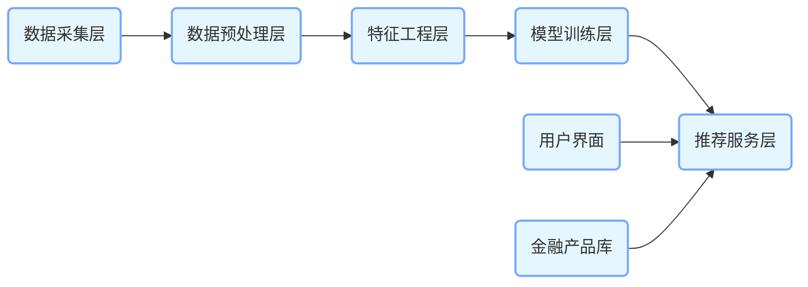

# 开发智能化的金融产品推荐个性化引擎

> 关键词：金融产品推荐、个性化引擎、智能化、用户画像、机器学习算法

> 摘要：本文围绕开发智能化的金融产品推荐个性化引擎展开。首先介绍了开发该引擎的背景信息，包括目的、预期读者、文档结构和相关术语。接着阐述了核心概念，如用户画像、金融产品特征等，并给出了相应的架构示意图和流程图。详细讲解了核心算法原理，使用 Python 代码进行说明，同时给出了相关的数学模型和公式，并举例说明。通过项目实战，展示了开发环境搭建、源代码实现和代码解读。分析了该引擎的实际应用场景，推荐了学习资源、开发工具框架和相关论文著作。最后总结了未来发展趋势与挑战，提供了常见问题解答和扩展阅读参考资料。

## 1. 背景介绍 
### 1.1 目的和范围
在当今金融市场中，产品种类繁多，客户需求各异。开发智能化的金融产品推荐个性化引擎的主要目的是为金融机构提供一种有效的工具，能够根据客户的个性化特征和需求，精准地推荐合适的金融产品，提高客户满意度和金融机构的业务转化率。

本引擎的范围涵盖了多种金融产品，如银行存款、理财产品、保险产品、信用卡等。同时，适用于各类金融机构，包括银行、保险公司、证券公司等。

### 1.2 预期读者
本文的预期读者包括金融机构的技术人员、产品经理、业务分析师，以及对金融科技领域感兴趣的研究人员和开发者。对于希望了解如何利用智能化技术实现金融产品个性化推荐的人员具有较高的参考价值。

### 1.3 文档结构概述
本文将按照以下结构进行详细阐述：首先介绍核心概念与联系，帮助读者理解相关原理和架构；接着讲解核心算法原理和具体操作步骤，使用 Python 代码进行说明；然后给出数学模型和公式，并举例说明；通过项目实战展示代码实际案例和详细解释；分析实际应用场景；推荐相关的工具和资源；最后总结未来发展趋势与挑战，提供常见问题解答和扩展阅读参考资料。

### 1.4 术语表
#### 1.4.1 核心术语定义
- **个性化推荐引擎**：一种基于用户特征和行为数据，为用户提供个性化产品或服务推荐的系统。
- **用户画像**：通过收集和分析用户的各种信息，构建出的关于用户特征和偏好的数字化模型。
- **金融产品特征**：描述金融产品的各种属性，如收益率、风险等级、期限等。
- **协同过滤**：一种基于用户行为数据的推荐算法，通过寻找与目标用户相似的其他用户，来推荐他们感兴趣的产品。
- **机器学习算法**：一类用于让计算机自动从数据中学习模式和规律的算法，如决策树、神经网络等。

#### 1.4.2 相关概念解释
- **数据挖掘**：从大量数据中发现有价值信息和知识的过程，是个性化推荐引擎的重要支撑技术。
- **特征工程**：对原始数据进行预处理和转换，提取出对模型有意义的特征的过程。
- **模型评估**：使用各种指标对推荐模型的性能进行评估，以确保模型的有效性和准确性。

#### 1.4.3 缩略词列表
- **AI**：Artificial Intelligence，人工智能
- **ML**：Machine Learning，机器学习
- **CF**：Collaborative Filtering，协同过滤
- **KNN**：K-Nearest Neighbors，K 近邻算法

## 2. 核心概念与联系 
### 核心概念原理
智能化的金融产品推荐个性化引擎主要基于以下几个核心概念：

#### 用户画像
用户画像是个性化推荐的基础。通过收集用户的基本信息（如年龄、性别、职业等）、金融行为数据（如存款金额、交易记录、投资偏好等），构建出每个用户的特征向量。这些特征向量可以全面地描述用户的需求和偏好，为后续的产品推荐提供依据。

#### 金融产品特征
金融产品具有各种不同的特征，如收益率、风险等级、期限、起购金额等。这些特征是区分不同金融产品的关键因素，也是推荐引擎进行匹配的重要依据。

#### 推荐算法
推荐算法是个性化引擎的核心。常见的推荐算法包括协同过滤、基于内容的推荐、混合推荐等。协同过滤算法通过分析用户之间的相似性，找到与目标用户兴趣相似的其他用户，然后推荐这些用户喜欢的金融产品。基于内容的推荐算法则是根据金融产品的特征和用户的偏好进行匹配，推荐与用户兴趣相关的产品。

### 架构示意图
以下是智能化的金融产品推荐个性化引擎的架构示意图：



#### 各层解释
- **数据采集层**：负责收集用户的各种数据，包括基本信息、金融行为数据等，以及金融产品的相关信息。
- **数据预处理层**：对采集到的数据进行清洗、去重、缺失值处理等操作，以提高数据质量。
- **特征工程层**：从预处理后的数据中提取出对推荐模型有意义的特征，如用户的风险偏好、产品的收益率等。
- **模型训练层**：使用机器学习算法对特征数据进行训练，构建推荐模型。
- **推荐服务层**：根据用户的请求，调用训练好的模型，为用户生成个性化的金融产品推荐列表。
- **用户界面**：提供用户与推荐引擎交互的界面，用户可以在界面上查看推荐结果。
- **金融产品库**：存储各种金融产品的详细信息，为推荐服务提供数据支持。

## 3. 核心算法原理 & 具体操作步骤 
### 协同过滤算法原理
协同过滤算法是一种基于用户行为数据的推荐算法，分为基于用户的协同过滤（User-based CF）和基于物品的协同过滤（Item-based CF）。这里以基于用户的协同过滤为例进行讲解。

#### 原理步骤
1. **计算用户之间的相似度**：通常使用余弦相似度来计算用户之间的相似度。假设有两个用户 $u$ 和 $v$，他们的特征向量分别为 $\mathbf{x}_u$ 和 $\mathbf{x}_v$，则他们之间的余弦相似度为：
   $$
   \text{sim}(u, v) = \frac{\mathbf{x}_u \cdot \mathbf{x}_v}{\|\mathbf{x}_u\| \|\mathbf{x}_v\|}
   $$
2. **找到与目标用户最相似的 $K$ 个用户**：根据计算得到的相似度，选择与目标用户相似度最高的 $K$ 个用户。
3. **生成推荐列表**：对于目标用户没有使用过的金融产品，根据相似用户对这些产品的评分，预测目标用户对这些产品的评分，选择评分较高的产品作为推荐结果。

### Python 代码实现
```python
import numpy as np

def cosine_similarity(x1, x2):
    """
    计算两个向量的余弦相似度
    """
    dot_product = np.dot(x1, x2)
    norm_x1 = np.linalg.norm(x1)
    norm_x2 = np.linalg.norm(x2)
    return dot_product / (norm_x1 * norm_x2)

def find_top_k_similar_users(user_id, user_features, k):
    """
    找到与目标用户最相似的 K 个用户
    """
    target_user_features = user_features[user_id]
    similarities = []
    for i in range(len(user_features)):
        if i!= user_id:
            similarity = cosine_similarity(target_user_features, user_features[i])
            similarities.append((i, similarity))
    similarities.sort(key=lambda x: x[1], reverse=True)
    return [user[0] for user in similarities[:k]]

def recommend_products(user_id, user_features, product_features, ratings, k):
    """
    为目标用户推荐金融产品
    """
    top_k_users = find_top_k_similar_users(user_id, user_features, k)
    unrated_products = [i for i in range(len(product_features)) if ratings[user_id][i] == 0]
    product_scores = []
    for product_id in unrated_products:
        score = 0
        similarity_sum = 0
        for similar_user_id in top_k_users:
            similarity = cosine_similarity(user_features[user_id], user_features[similar_user_id])
            score += similarity * ratings[similar_user_id][product_id]
            similarity_sum += similarity
        if similarity_sum!= 0:
            score /= similarity_sum
        product_scores.append((product_id, score))
    product_scores.sort(key=lambda x: x[1], reverse=True)
    recommended_products = [product[0] for product in product_scores]
    return recommended_products
```

### 具体操作步骤
1. **数据准备**：收集用户的特征数据、金融产品的特征数据和用户对产品的评分数据。
2. **特征处理**：对用户和产品的特征数据进行预处理，如标准化、归一化等。
3. **计算相似度**：使用 `cosine_similarity` 函数计算用户之间的相似度。
4. **找到相似用户**：使用 `find_top_k_similar_users` 函数找到与目标用户最相似的 $K$ 个用户。
5. **生成推荐列表**：使用 `recommend_products` 函数为目标用户生成个性化的金融产品推荐列表。

## 4. 数学模型和公式 & 详细讲解 & 举例说明 
### 余弦相似度公式
在协同过滤算法中，余弦相似度是计算用户之间相似度的常用方法。其公式为：
$$
\text{sim}(u, v) = \frac{\mathbf{x}_u \cdot \mathbf{x}_v}{\|\mathbf{x}_u\| \|\mathbf{x}_v\|}
$$
其中，$\mathbf{x}_u$ 和 $\mathbf{x}_v$ 分别是用户 $u$ 和 $v$ 的特征向量，$\cdot$ 表示向量的点积，$\|\cdot\|$ 表示向量的模。

#### 详细讲解
余弦相似度的取值范围在 $[-1, 1]$ 之间。当相似度为 1 时，表示两个用户的特征向量完全相同；当相似度为 -1 时，表示两个用户的特征向量完全相反；当相似度为 0 时，表示两个用户的特征向量相互垂直，即没有相关性。

### 预测评分公式
在基于用户的协同过滤算法中，预测目标用户 $u$ 对产品 $i$ 的评分 $\hat{r}_{ui}$ 的公式为：
$$
\hat{r}_{ui} = \frac{\sum_{v \in N(u)} \text{sim}(u, v) \cdot r_{vi}}{\sum_{v \in N(u)} \text{sim}(u, v)}
$$
其中，$N(u)$ 表示与目标用户 $u$ 最相似的 $K$ 个用户集合，$\text{sim}(u, v)$ 表示用户 $u$ 和 $v$ 之间的相似度，$r_{vi}$ 表示用户 $v$ 对产品 $i$ 的评分。

#### 详细讲解
该公式的原理是根据与目标用户相似的其他用户对产品的评分，加权平均得到目标用户对产品的预测评分。相似度越高的用户，其评分对预测结果的影响越大。

### 举例说明
假设有 3 个用户 $U_1$、$U_2$、$U_3$，他们对 3 个金融产品 $P_1$、$P_2$、$P_3$ 的评分矩阵如下：
$$
\begin{bmatrix}
5 & 3 & 0 \\
4 & 0 & 2 \\
0 & 1 & 3
\end{bmatrix}
$$
用户的特征向量分别为：
$$
\mathbf{x}_{U_1} = [1, 2, 3] \\
\mathbf{x}_{U_2} = [2, 3, 1] \\
\mathbf{x}_{U_3} = [3, 1, 2]
$$
我们要为用户 $U_1$ 推荐产品。

1. **计算用户之间的相似度**：
   - $\text{sim}(U_1, U_2) = \frac{\mathbf{x}_{U_1} \cdot \mathbf{x}_{U_2}}{\|\mathbf{x}_{U_1}\| \|\mathbf{x}_{U_2}\|} = \frac{1\times2 + 2\times3 + 3\times1}{\sqrt{1^2 + 2^2 + 3^2} \sqrt{2^2 + 3^2 + 1^2}} \approx 0.92$
   - $\text{sim}(U_1, U_3) = \frac{\mathbf{x}_{U_1} \cdot \mathbf{x}_{U_3}}{\|\mathbf{x}_{U_1}\| \|\mathbf{x}_{U_3}\|} = \frac{1\times3 + 2\times1 + 3\times2}{\sqrt{1^2 + 2^2 + 3^2} \sqrt{3^2 + 1^2 + 2^2}} \approx 0.92$

2. **找到与 $U_1$ 最相似的 2 个用户**：即 $U_2$ 和 $U_3$。

3. **预测 $U_1$ 对 $P_3$ 的评分**：
   - $\hat{r}_{U_1P_3} = \frac{\text{sim}(U_1, U_2) \cdot r_{U_2P_3} + \text{sim}(U_1, U_3) \cdot r_{U_3P_3}}{\text{sim}(U_1, U_2) + \text{sim}(U_1, U_3)} = \frac{0.92\times2 + 0.92\times3}{0.92 + 0.92} = 2.5$

根据预测评分，我们可以为 $U_1$ 推荐产品 $P_3$。

## 5. 项目实战：代码实际案例和详细解释说明 
### 5.1  开发环境搭建
#### 操作系统
建议使用 Linux 或 macOS 操作系统，因为它们对 Python 开发环境的支持较好。

#### Python 环境
安装 Python 3.7 及以上版本。可以使用 Anaconda 来管理 Python 环境，具体安装步骤如下：
1. 从 Anaconda 官网（https://www.anaconda.com/products/individual）下载适合你操作系统的 Anaconda 安装包。
2. 运行安装包，按照提示完成安装。
3. 打开终端或命令提示符，创建一个新的 Python 虚拟环境：
   ```sh
   conda create -n finance_recommendation python=3.8
   ```
4. 激活虚拟环境：
   ```sh
   conda activate finance_recommendation
   ```

#### 安装依赖库
在激活的虚拟环境中，安装以下必要的 Python 库：
```sh
pip install numpy pandas scikit-learn
```

### 5.2  源代码详细实现和代码解读
以下是一个完整的金融产品推荐个性化引擎的 Python 代码示例：

```python
import numpy as np
import pandas as pd
from sklearn.preprocessing import StandardScaler

# 生成模拟数据
def generate_data(num_users, num_products):
    user_features = np.random.rand(num_users, 5)  # 用户特征向量
    product_features = np.random.rand(num_products, 3)  # 产品特征向量
    ratings = np.random.randint(0, 6, size=(num_users, num_products))  # 用户对产品的评分
    return user_features, product_features, ratings

# 数据预处理
def preprocess_data(user_features, product_features):
    scaler = StandardScaler()
    user_features = scaler.fit_transform(user_features)
    product_features = scaler.fit_transform(product_features)
    return user_features, product_features

# 余弦相似度计算
def cosine_similarity(x1, x2):
    dot_product = np.dot(x1, x2)
    norm_x1 = np.linalg.norm(x1)
    norm_x2 = np.linalg.norm(x2)
    return dot_product / (norm_x1 * norm_x2)

# 找到与目标用户最相似的 K 个用户
def find_top_k_similar_users(user_id, user_features, k):
    target_user_features = user_features[user_id]
    similarities = []
    for i in range(len(user_features)):
        if i!= user_id:
            similarity = cosine_similarity(target_user_features, user_features[i])
            similarities.append((i, similarity))
    similarities.sort(key=lambda x: x[1], reverse=True)
    return [user[0] for user in similarities[:k]]

# 为目标用户推荐金融产品
def recommend_products(user_id, user_features, product_features, ratings, k):
    top_k_users = find_top_k_similar_users(user_id, user_features, k)
    unrated_products = [i for i in range(len(product_features)) if ratings[user_id][i] == 0]
    product_scores = []
    for product_id in unrated_products:
        score = 0
        similarity_sum = 0
        for similar_user_id in top_k_users:
            similarity = cosine_similarity(user_features[user_id], user_features[similar_user_id])
            score += similarity * ratings[similar_user_id][product_id]
            similarity_sum += similarity
        if similarity_sum!= 0:
            score /= similarity_sum
        product_scores.append((product_id, score))
    product_scores.sort(key=lambda x: x[1], reverse=True)
    recommended_products = [product[0] for product in product_scores]
    return recommended_products

# 主函数
def main():
    num_users = 100
    num_products = 50
    user_features, product_features, ratings = generate_data(num_users, num_products)
    user_features, product_features = preprocess_data(user_features, product_features)
    target_user_id = 0
    k = 5
    recommended_products = recommend_products(target_user_id, user_features, product_features, ratings, k)
    print(f"为用户 {target_user_id} 推荐的产品 ID 列表：{recommended_products}")

if __name__ == "__main__":
    main()
```

### 5.3  代码解读与分析
#### 代码功能概述
该代码实现了一个简单的金融产品推荐个性化引擎。主要步骤包括：
1. 生成模拟的用户特征数据、产品特征数据和用户对产品的评分数据。
2. 对用户和产品的特征数据进行标准化预处理。
3. 计算用户之间的余弦相似度，找到与目标用户最相似的 $K$ 个用户。
4. 根据相似用户的评分，为目标用户推荐未评分的金融产品。

#### 代码详细解读
1. **generate_data 函数**：生成模拟的用户特征数据、产品特征数据和用户对产品的评分数据。
2. **preprocess_data 函数**：使用 `StandardScaler` 对用户和产品的特征数据进行标准化处理，使得数据具有零均值和单位方差。
3. **cosine_similarity 函数**：计算两个向量的余弦相似度。
4. **find_top_k_similar_users 函数**：找到与目标用户最相似的 $K$ 个用户。
5. **recommend_products 函数**：为目标用户推荐未评分的金融产品。
6. **main 函数**：主函数，调用上述函数完成整个推荐流程，并输出推荐结果。

## 6. 实际应用场景 
### 银行领域
- **理财产品推荐**：银行可以根据客户的资产状况、风险偏好、投资目标等信息，为客户推荐适合的理财产品。例如，对于风险承受能力较低的客户，推荐稳健型的理财产品；对于风险承受能力较高的客户，推荐高收益但风险也相对较高的理财产品。
- **信用卡推荐**：根据客户的消费习惯、信用记录等信息，为客户推荐合适的信用卡。例如，对于经常在超市购物的客户，推荐具有超市消费返现功能的信用卡；对于经常出差的客户，推荐具有航空里程累积功能的信用卡。

### 保险领域
- **保险产品推荐**：保险公司可以根据客户的年龄、性别、职业、健康状况等信息，为客户推荐适合的保险产品。例如，对于年轻人，推荐重疾险、意外险等；对于中老年人，推荐养老保险、医疗险等。
- **保险套餐推荐**：根据客户的家庭状况、经济实力等信息，为客户推荐个性化的保险套餐。例如，对于有家庭的客户，推荐包含家庭财产险、人寿险等多种保险产品的套餐。

### 证券领域
- **股票推荐**：证券公司可以根据客户的投资经验、风险偏好、资金规模等信息，为客户推荐适合的股票。例如，对于新手投资者，推荐蓝筹股；对于有一定投资经验的投资者，推荐成长股。
- **基金推荐**：根据客户的投资目标、风险承受能力等信息，为客户推荐合适的基金产品。例如，对于长期投资目标的客户，推荐指数基金；对于短期投资目标的客户，推荐货币基金。

## 7. 工具和资源推荐
### 7.1 学习资源推荐
#### 7.1.1 书籍推荐
- 《Python 机器学习》：本书详细介绍了 Python 在机器学习领域的应用，包括各种机器学习算法的原理和实现。
- 《推荐系统实践》：全面介绍了推荐系统的基本原理、算法和应用，是学习推荐系统的经典书籍。
- 《金融科技概论》：涵盖了金融科技的各个方面，包括金融产品推荐、区块链、人工智能在金融领域的应用等。

#### 7.1.2 在线课程
- Coursera 上的“机器学习”课程：由斯坦福大学教授 Andrew Ng 授课，是学习机器学习的经典课程。
- edX 上的“数据科学与人工智能微硕士”课程：提供了全面的数据科学和人工智能知识体系，包括推荐系统的相关内容。
- 中国大学 MOOC 上的“金融科技前沿技术”课程：介绍了金融科技领域的最新技术和应用，对开发金融产品推荐引擎有很大的帮助。

#### 7.1.3 技术博客和网站
- Medium：上面有很多关于机器学习、推荐系统和金融科技的技术文章，作者来自世界各地的技术专家。
- 知乎：有很多关于金融科技和推荐系统的讨论和分享，可以从中获取最新的技术动态和实践经验。
- 开源中国：提供了大量的开源项目和技术文章，对于学习和实践金融产品推荐引擎有很大的帮助。

### 7.2 开发工具框架推荐
#### 7.2.1 IDE和编辑器
- PyCharm：是一款专门为 Python 开发设计的集成开发环境，具有强大的代码编辑、调试和项目管理功能。
- Jupyter Notebook：是一个交互式的开发环境，适合进行数据分析和模型实验，方便代码的编写和展示。
- Visual Studio Code：是一款轻量级的代码编辑器，支持多种编程语言和插件，对于 Python 开发也有很好的支持。

#### 7.2.2 调试和性能分析工具
- Py-Spy：可以对 Python 程序进行性能分析，找出程序中的性能瓶颈。
- PDB：Python 自带的调试工具，可以帮助开发者快速定位和解决代码中的问题。
- TensorBoard：是 TensorFlow 提供的可视化工具，可以用于可视化模型的训练过程和性能指标。

#### 7.2.3 相关框架和库
- Scikit-learn：是一个强大的机器学习库，提供了各种机器学习算法的实现，包括分类、回归、聚类等。
- TensorFlow：是一个开源的深度学习框架，广泛应用于图像识别、自然语言处理等领域，也可以用于构建复杂的推荐模型。
- Pandas：是一个数据处理和分析库，提供了高效的数据结构和数据操作方法，方便对金融数据进行处理和分析。

### 7.3 相关论文著作推荐
#### 7.3.1 经典论文
- “Item-based Collaborative Filtering Recommendation Algorithms”：介绍了基于物品的协同过滤算法，是协同过滤算法领域的经典论文。
- “Matrix Factorization Techniques for Recommender Systems”：提出了矩阵分解技术在推荐系统中的应用，为推荐系统的发展做出了重要贡献。
- “Deep Neural Networks for YouTube Recommendations”：介绍了 YouTube 推荐系统中使用的深度学习方法，对构建深度学习推荐模型有很大的参考价值。

#### 7.3.2 最新研究成果
- 在 ACM SIGKDD、IEEE ICDM 等顶级数据挖掘会议上发表的关于推荐系统的最新研究成果，涵盖了新的算法、模型和应用场景。
- 在《Journal of Financial Economics》、《Review of Financial Studies》等金融领域的顶级期刊上发表的关于金融科技和金融产品推荐的研究论文。

#### 7.3.3 应用案例分析
- 一些大型金融机构（如银行、保险公司）发布的关于金融产品推荐系统的应用案例分析报告，介绍了他们在实际应用中的经验和成果。
- 开源的金融产品推荐项目的文档和案例分析，如 Apache Mahout 中的推荐模块。

## 8. 总结：未来发展趋势与挑战
### 未来发展趋势
- **融合更多数据源**：未来的金融产品推荐个性化引擎将融合更多的数据源，如社交媒体数据、物联网数据等，以更全面地了解用户的需求和偏好。
- **采用深度学习技术**：深度学习技术在图像识别、自然语言处理等领域取得了巨大的成功，未来将在金融产品推荐中得到更广泛的应用，构建更复杂、更准确的推荐模型。
- **强化实时推荐能力**：随着金融市场的快速变化，用户对实时推荐的需求越来越高。未来的推荐引擎将具备更强的实时处理能力，能够及时根据用户的行为和市场变化调整推荐结果。
- **注重可解释性**：金融产品涉及用户的资金安全，用户对推荐结果的可解释性有较高的要求。未来的推荐引擎将更加注重模型的可解释性，让用户清楚地了解推荐结果的依据。

### 挑战
- **数据隐私和安全**：金融数据涉及用户的敏感信息，如何在保证数据隐私和安全的前提下，充分利用数据进行推荐是一个重要的挑战。
- **数据质量和一致性**：金融数据来源广泛，数据质量和一致性难以保证。如何对数据进行有效的清洗和整合，是提高推荐准确性的关键。
- **模型复杂度和计算资源**：采用深度学习等复杂模型会增加模型的复杂度和计算资源的需求，如何在保证模型性能的前提下，降低计算成本是一个挑战。
- **法律法规和监管要求**：金融行业受到严格的法律法规和监管要求的约束，如何确保推荐引擎的开发和应用符合相关规定是一个重要的问题。

## 9. 附录：常见问题与解答
### 1. 如何收集用户的金融行为数据？
可以通过以下几种方式收集用户的金融行为数据：
- 金融机构的内部系统：如银行的网上银行系统、交易系统等，可以记录用户的存款、取款、转账、投资等行为数据。
- 第三方数据提供商：一些专业的数据提供商可以提供用户的信用记录、消费数据等信息。
- 用户授权：通过用户授权，收集用户在社交媒体、电商平台等其他渠道的行为数据。

### 2. 如何评估推荐模型的性能？
常用的评估指标包括准确率、召回率、F1 值、均方误差（MSE）、平均绝对误差（MAE）等。可以将数据集分为训练集和测试集，使用测试集来评估模型的性能。

### 3. 如何处理数据中的缺失值？
可以采用以下几种方法处理数据中的缺失值：
- 删除包含缺失值的记录：如果缺失值的比例较小，可以直接删除包含缺失值的记录。
- 填充缺失值：可以使用均值、中位数、众数等统计量来填充缺失值，也可以使用机器学习算法进行预测填充。
- 多重插补：通过多次随机抽样和填充，生成多个完整的数据集，然后对这些数据集进行分析和汇总。

### 4. 如何提高推荐引擎的实时性？
可以采用以下几种方法提高推荐引擎的实时性：
- 实时数据处理框架：使用如 Apache Kafka、Flink 等实时数据处理框架，对用户的行为数据进行实时采集和处理。
- 缓存机制：使用缓存技术，如 Redis，缓存一些常用的推荐结果，减少计算时间。
- 增量学习：采用增量学习算法，对模型进行实时更新，而不需要重新训练整个模型。

## 10. 扩展阅读 & 参考资料
- 《人工智能时代的金融科技》
- 《大数据金融》
- https://www.kaggle.com/c/recsys-challenge-2015 （Kaggle 上的推荐系统竞赛）
- https://github.com/benfred/implicit （Python 实现的隐式推荐算法库）

作者：AI天才研究院/AI Genius Institute & 禅与计算机程序设计艺术 /Zen And The Art of Computer Programming