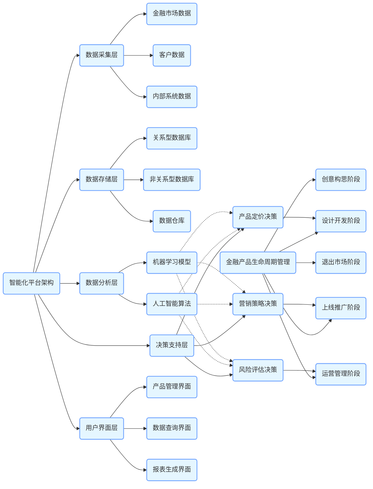

# 开发智能化的金融产品生命周期管理平台

> 关键词：金融产品生命周期管理、智能化平台、人工智能、大数据、金融科技

> 摘要：本文围绕开发智能化的金融产品生命周期管理平台展开，深入探讨了其背景、核心概念、算法原理、数学模型、项目实战、实际应用场景等方面。详细阐述了智能化平台在金融产品全生命周期管理中的重要性和优势，通过Python代码示例展示了核心算法的实现，同时提供了丰富的工具和资源推荐。最后对该领域的未来发展趋势与挑战进行了总结，并给出常见问题解答和扩展阅读参考资料，旨在为开发者和金融从业者提供全面且深入的技术指导。

## 1. 背景介绍 
### 1.1 目的和范围
随着金融市场的不断发展和创新，金融产品的种类日益繁多，其生命周期管理变得愈发复杂。传统的金融产品管理方式往往效率低下、缺乏灵活性，难以应对快速变化的市场环境和客户需求。开发智能化的金融产品生命周期管理平台的目的在于提高金融产品管理的效率和质量，降低成本，增强风险控制能力，为金融机构提供更精准、智能的决策支持。

本平台的范围涵盖金融产品从创意构思、设计开发、上线推广、运营管理到退出市场的整个生命周期。包括产品的市场调研、策略制定、定价分析、风险评估、营销推广、客户反馈收集与处理等各个环节。

### 1.2 预期读者
本文的预期读者主要包括金融机构的业务人员、技术开发人员、金融科技研究者以及对金融产品管理和智能化技术感兴趣的相关人士。对于金融业务人员，可帮助其了解智能化平台如何优化金融产品管理流程；对于技术开发人员，提供了开发智能化平台的详细技术指导；对于金融科技研究者，可作为研究金融产品管理智能化的参考资料。

### 1.3 文档结构概述
本文将按照以下结构进行详细阐述：首先介绍核心概念与联系，明确金融产品生命周期管理和智能化平台的相关原理和架构；接着讲解核心算法原理及具体操作步骤，通过Python代码进行详细说明；然后介绍数学模型和公式，并举例说明其在平台中的应用；再通过项目实战，展示开发环境搭建、源代码实现和代码解读；之后探讨实际应用场景；推荐相关的工具和资源；最后总结未来发展趋势与挑战，提供常见问题解答和扩展阅读参考资料。

### 1.4 术语表
#### 1.4.1 核心术语定义
- **金融产品生命周期管理（Financial Product Lifecycle Management, FPLM）**：指对金融产品从诞生到消亡的整个过程进行全面管理，包括产品规划、设计、开发、营销、运营和退出等阶段。
- **智能化平台（Intelligent Platform）**：利用人工智能、大数据、机器学习等技术，实现自动化、智能化决策和管理的软件平台。
- **人工智能（Artificial Intelligence, AI）**：研究如何使计算机系统能够模拟人类智能的技术，包括机器学习、深度学习、自然语言处理等。
- **大数据（Big Data）**：指海量、高增长率和多样化的信息资产，需要新处理模式才能具有更强的决策力、洞察发现力和流程优化能力。

#### 1.4.2 相关概念解释
- **机器学习（Machine Learning）**：人工智能的一个分支，通过让计算机从数据中学习模式和规律，从而实现预测和决策。常见的机器学习算法包括决策树、支持向量机、神经网络等。
- **深度学习（Deep Learning）**：一种基于人工神经网络的机器学习技术，通过构建多层神经网络来学习数据的深层次特征，在图像识别、语音识别等领域取得了显著成果。
- **自然语言处理（Natural Language Processing, NLP）**：研究如何使计算机能够理解和处理人类语言的技术，包括文本分类、情感分析、机器翻译等。

#### 1.4.3 缩略词列表
- FPLM：Financial Product Lifecycle Management
- AI：Artificial Intelligence
- ML：Machine Learning
- DL：Deep Learning
- NLP：Natural Language Processing

## 2. 核心概念与联系 
### 金融产品生命周期管理原理
金融产品生命周期管理可以分为以下几个主要阶段：
1. **创意构思阶段**：金融机构根据市场需求、客户反馈和行业趋势，提出新的金融产品创意。
2. **设计开发阶段**：对创意进行详细设计，确定产品的功能、特点、定价策略、风险控制措施等，并进行系统开发和测试。
3. **上线推广阶段**：将开发好的金融产品推向市场，进行营销宣传和客户拓展。
4. **运营管理阶段**：对上线后的金融产品进行日常运营管理，包括客户服务、风险管理、数据分析等。
5. **退出市场阶段**：当金融产品不再适应市场需求或达到预定的生命周期时，将其退出市场。

### 智能化平台架构
智能化的金融产品生命周期管理平台主要由以下几个部分组成：
1. **数据采集层**：负责收集来自金融市场、客户、内部系统等多源数据，包括市场行情、客户交易记录、风险评估数据等。
2. **数据存储层**：将采集到的数据进行存储和管理，可采用关系型数据库、非关系型数据库、数据仓库等技术。
3. **数据分析层**：利用人工智能、机器学习等技术对存储的数据进行分析和挖掘，提取有价值的信息和模式。
4. **决策支持层**：根据数据分析结果，为金融产品的各个生命周期阶段提供决策支持，如产品定价、风险评估、营销策略制定等。
5. **用户界面层**：为用户提供友好的操作界面，方便用户进行产品管理、数据查询、报表生成等操作。

### 核心概念联系
智能化平台通过对金融产品生命周期各阶段的数据进行采集、分析和处理，为每个阶段提供智能化的决策支持。例如，在创意构思阶段，通过对市场数据和客户反馈的分析，发现潜在的市场需求和产品机会；在设计开发阶段，利用数据分析优化产品的功能和定价策略；在上线推广阶段，通过精准营销和客户细分提高产品的市场占有率；在运营管理阶段，实时监测产品的风险和绩效，及时调整管理策略；在退出市场阶段，根据数据分析评估产品的退出时机和方式。

### 文本示意图
```plaintext
金融产品生命周期管理
|-- 创意构思阶段
|-- 设计开发阶段
|-- 上线推广阶段
|-- 运营管理阶段
|-- 退出市场阶段

智能化平台架构
|-- 数据采集层
|   |-- 金融市场数据
|   |-- 客户数据
|   |-- 内部系统数据
|-- 数据存储层
|   |-- 关系型数据库
|   |-- 非关系型数据库
|   |-- 数据仓库
|-- 数据分析层
|   |-- 人工智能算法
|   |-- 机器学习模型
|-- 决策支持层
|   |-- 产品定价决策
|   |-- 风险评估决策
|   |-- 营销策略决策
|-- 用户界面层
|   |-- 产品管理界面
|   |-- 数据查询界面
|   |-- 报表生成界面
```

### Mermaid 流程图


## 3. 核心算法原理 & 具体操作步骤 
### 核心算法原理
#### 机器学习算法在风险评估中的应用
在金融产品生命周期管理中，风险评估是一个重要环节。可以使用逻辑回归算法对金融产品的风险进行评估。逻辑回归是一种广义线性模型，用于处理二分类问题，其原理是通过对输入特征进行线性组合，然后通过逻辑函数将线性组合的结果映射到概率值，从而判断样本属于某个类别的概率。

逻辑函数的表达式为：
$$\sigma(z)=\frac{1}{1 + e^{-z}}$$
其中，$z$ 是输入特征的线性组合：
$$z = \theta_0 + \theta_1x_1 + \theta_2x_2 + \cdots + \theta_nx_n$$
$\theta_i$ 是模型的参数，$x_i$ 是输入特征。

#### 深度学习算法在客户细分中的应用
客户细分可以帮助金融机构更好地了解客户需求，制定个性化的营销策略。可以使用自编码器（Autoencoder）对客户数据进行降维和特征提取，然后使用聚类算法对客户进行细分。

自编码器是一种无监督学习模型，其目标是将输入数据重构为输出数据。它由编码器和解码器两部分组成，编码器将输入数据压缩为低维表示，解码器将低维表示重构为原始数据。

### 具体操作步骤
#### 逻辑回归算法实现步骤
1. **数据准备**：收集金融产品的风险相关数据，包括客户信用评分、收入水平、贷款金额等特征，以及产品是否违约的标签。
2. **数据预处理**：对数据进行清洗、归一化、缺失值处理等操作，以提高模型的性能。
3. **模型训练**：使用训练数据对逻辑回归模型进行训练，通过最小化损失函数来更新模型的参数。逻辑回归的损失函数通常使用对数损失函数：
$$J(\theta)=-\frac{1}{m}\sum_{i = 1}^{m}[y^{(i)}\log(\sigma(z^{(i)}))+(1 - y^{(i)})\log(1 - \sigma(z^{(i)}))]$$
其中，$m$ 是样本数量，$y^{(i)}$ 是第 $i$ 个样本的标签。
4. **模型评估**：使用测试数据对训练好的模型进行评估，常用的评估指标包括准确率、召回率、F1 值等。
5. **模型应用**：将训练好的模型应用到实际的风险评估中，对新的金融产品进行风险预测。

#### 自编码器和聚类算法实现步骤
1. **数据准备**：收集客户的交易记录、偏好信息等数据。
2. **数据预处理**：对数据进行清洗、归一化等操作。
3. **自编码器训练**：使用训练数据对自编码器进行训练，通过最小化重构误差来学习数据的低维表示。
4. **特征提取**：使用训练好的自编码器对数据进行编码，得到数据的低维特征表示。
5. **聚类分析**：使用聚类算法（如 K-Means 算法）对低维特征表示进行聚类，将客户分为不同的类别。
6. **结果分析**：对聚类结果进行分析，了解不同客户类别的特征和需求，为营销策略制定提供依据。

### Python 代码实现
#### 逻辑回归算法实现
```python
import numpy as np
from sklearn.linear_model import LogisticRegression
from sklearn.model_selection import train_test_split
from sklearn.metrics import accuracy_score

# 生成示例数据
np.random.seed(0)
X = np.random.randn(100, 2)
y = (X[:, 0] + X[:, 1] > 0).astype(int)

# 划分训练集和测试集
X_train, X_test, y_train, y_test = train_test_split(X, y, test_size=0.2, random_state=42)

# 创建逻辑回归模型
model = LogisticRegression()

# 训练模型
model.fit(X_train, y_train)

# 预测
y_pred = model.predict(X_test)

# 评估模型
accuracy = accuracy_score(y_test, y_pred)
print(f"Accuracy: {accuracy}")
```

#### 自编码器和 K-Means 算法实现
```python
import numpy as np
from tensorflow.keras.layers import Input, Dense
from tensorflow.keras.models import Model
from sklearn.cluster import KMeans
from sklearn.datasets import make_blobs

# 生成示例数据
X, _ = make_blobs(n_samples=100, centers=3, n_features=10, random_state=42)

# 自编码器模型定义
input_layer = Input(shape=(10,))
encoded = Dense(3, activation='relu')(input_layer)
decoded = Dense(10, activation='sigmoid')(encoded)
autoencoder = Model(input_layer, decoded)
encoder = Model(input_layer, encoded)

# 编译自编码器
autoencoder.compile(optimizer='adam', loss='binary_crossentropy')

# 训练自编码器
autoencoder.fit(X, X, epochs=50, batch_size=32, shuffle=True)

# 提取低维特征
encoded_X = encoder.predict(X)

# 使用 K-Means 进行聚类
kmeans = KMeans(n_clusters=3, random_state=42)
kmeans.fit(encoded_X)

# 打印聚类结果
labels = kmeans.labels_
print(f"Cluster labels: {labels}")
```

## 4. 数学模型和公式 & 详细讲解 & 举例说明 
### 逻辑回归数学模型
逻辑回归的数学模型可以表示为：
$$P(y = 1|x)=\sigma(\theta^Tx)=\frac{1}{1 + e^{-\theta^Tx}}$$
其中，$P(y = 1|x)$ 表示在输入特征 $x$ 下，样本属于正类（$y = 1$）的概率，$\theta$ 是模型的参数向量，$x$ 是输入特征向量。

### 详细讲解
逻辑回归通过对输入特征进行线性组合，然后使用逻辑函数将线性组合的结果映射到概率值。逻辑函数的取值范围是 $(0, 1)$，因此可以将其解释为概率。当 $\theta^Tx$ 趋近于正无穷时，$P(y = 1|x)$ 趋近于 1；当 $\theta^Tx$ 趋近于负无穷时，$P(y = 1|x)$ 趋近于 0。

### 举例说明
假设我们要预测一个客户是否会违约，输入特征包括客户的信用评分 $x_1$ 和收入水平 $x_2$，模型的参数为 $\theta_0 = -1$，$\theta_1 = 0.1$，$\theta_2 = 0.001$。如果一个客户的信用评分为 700，收入水平为 5000 元，则：
$$z = \theta_0 + \theta_1x_1 + \theta_2x_2=-1 + 0.1\times700 + 0.001\times5000=70 - 1+ 5 = 74$$
$$P(y = 1|x)=\frac{1}{1 + e^{-74}}\approx1$$
这意味着该客户违约的概率非常高。

### 自编码器数学模型
自编码器的目标是最小化重构误差，重构误差通常使用均方误差（Mean Squared Error, MSE）来衡量：
$$L(x, \hat{x})=\frac{1}{n}\sum_{i = 1}^{n}(x_i - \hat{x}_i)^2$$
其中，$x$ 是输入数据，$\hat{x}$ 是重构数据，$n$ 是数据的维度。

### 详细讲解
自编码器通过编码器将输入数据 $x$ 压缩为低维表示 $h$，然后通过解码器将低维表示 $h$ 重构为 $\hat{x}$。在训练过程中，通过最小化重构误差来学习编码器和解码器的参数，使得重构数据尽可能接近输入数据。

### 举例说明
假设输入数据是一个二维向量 $x = [1, 2]$，经过编码器得到低维表示 $h = [0.5]$，解码器将 $h$ 重构为 $\hat{x} = [0.8, 1.9]$。则重构误差为：
$$L(x, \hat{x})=\frac{(1 - 0.8)^2+(2 - 1.9)^2}{2}=\frac{0.04 + 0.01}{2}=0.025$$

## 5. 项目实战：代码实际案例和详细解释说明 
### 5.1  开发环境搭建
#### 操作系统
可以选择 Windows、Linux 或 macOS 操作系统，推荐使用 Linux 系统，因为其稳定性和开源性较好。

#### 编程语言和框架
- **Python**：作为主要的编程语言，Python 具有丰富的科学计算和机器学习库，如 NumPy、Pandas、Scikit-learn、TensorFlow 等。
- **Django**：用于开发 Web 应用程序，提供了快速开发和高效管理的功能。

#### 数据库
- **MySQL**：作为关系型数据库，用于存储金融产品的基本信息、客户信息等结构化数据。
- **MongoDB**：作为非关系型数据库，用于存储非结构化数据，如客户反馈、市场新闻等。

#### 开发工具
- **PyCharm**：专业的 Python 集成开发环境（IDE），提供代码编辑、调试、版本控制等功能。
- **Visual Studio Code**：轻量级的代码编辑器，支持多种编程语言和插件扩展。

### 5.2  源代码详细实现和代码解读
#### 数据采集模块
```python
import requests
import pandas as pd

def collect_market_data():
    # 模拟从金融市场 API 获取数据
    url = "https://api.example.com/market_data"
    response = requests.get(url)
    if response.status_code == 200:
        data = response.json()
        df = pd.DataFrame(data)
        return df
    else:
        return None

# 调用数据采集函数
market_data = collect_market_data()
if market_data is not None:
    print(market_data.head())
```
**代码解读**：该函数使用 `requests` 库从金融市场 API 获取数据，将返回的 JSON 数据转换为 Pandas DataFrame 格式。如果请求成功，返回 DataFrame；否则返回 `None`。

#### 风险评估模块
```python
import numpy as np
from sklearn.linear_model import LogisticRegression

def risk_assessment(X_train, y_train, X_test):
    # 创建逻辑回归模型
    model = LogisticRegression()
    # 训练模型
    model.fit(X_train, y_train)
    # 预测风险
    y_pred = model.predict(X_test)
    return y_pred

# 示例数据
X_train = np.array([[1, 2], [2, 3], [3, 4], [4, 5]])
y_train = np.array([0, 0, 1, 1])
X_test = np.array([[5, 6]])

# 调用风险评估函数
risk_prediction = risk_assessment(X_train, y_train, X_test)
print(f"Risk prediction: {risk_prediction}")
```
**代码解读**：该函数使用 `Scikit-learn` 库中的逻辑回归模型进行风险评估。首先创建模型，然后使用训练数据进行训练，最后对测试数据进行预测。

#### Web 应用程序模块（Django）
```python
# 项目目录结构
# myproject/
# ├── manage.py
# ├── myapp/
# │   ├── __init__.py
# │   ├── admin.py
# │   ├── apps.py
# │   ├── migrations/
# │   │   └── __init__.py
# │   ├── models.py
# │   ├── tests.py
# │   └── views.py
# └── myproject/
#     ├── __init__.py
#     ├── settings.py
#     ├── urls.py
#     └── wsgi.py

# myapp/views.py
from django.http import HttpResponse

def index(request):
    return HttpResponse("Welcome to the Financial Product Lifecycle Management Platform!")

# myproject/urls.py
from django.contrib import admin
from django.urls import path
from myapp.views import index

urlpatterns = [
    path('admin/', admin.site.urls),
    path('', index, name='index'),
]
```
**代码解读**：该代码使用 Django 框架创建了一个简单的 Web 应用程序。`views.py` 中定义了一个视图函数 `index`，用于返回一个欢迎消息。`urls.py` 中定义了 URL 路由，将根路径映射到 `index` 视图函数。

### 5.3  代码解读与分析
#### 数据采集模块
数据采集模块的主要功能是从金融市场获取数据，为后续的分析和决策提供支持。使用 `requests` 库可以方便地发送 HTTP 请求，获取远程服务器的数据。将数据转换为 Pandas DataFrame 格式可以方便地进行数据处理和分析。

#### 风险评估模块
风险评估模块使用逻辑回归算法对金融产品的风险进行评估。逻辑回归是一种简单而有效的分类算法，适用于二分类问题。通过训练模型并对新数据进行预测，可以得到金融产品的风险预测结果。

#### Web 应用程序模块
Web 应用程序模块使用 Django 框架创建了一个简单的 Web 界面，用户可以通过浏览器访问该界面。Django 框架提供了强大的路由系统和视图函数机制，方便开发者快速开发 Web 应用程序。

## 6. 实际应用场景 
### 产品设计与开发阶段
- **市场需求分析**：通过收集和分析市场数据、客户反馈等信息，了解市场需求和趋势，为金融产品的设计提供依据。例如，分析客户对不同类型理财产品的偏好，设计出更符合市场需求的产品。
- **产品定价策略**：利用数据分析和机器学习算法，评估金融产品的成本、风险和市场竞争力，制定合理的定价策略。例如，通过分析同类产品的价格和市场需求，确定新产品的最优价格。

### 上线推广阶段
- **精准营销**：通过对客户数据进行细分和分析，了解不同客户群体的需求和偏好，制定个性化的营销策略。例如，向高净值客户推荐高端理财产品，向年轻客户推荐互联网金融产品。
- **客户拓展**：利用社交媒体、搜索引擎等渠道进行营销推广，吸引新客户。通过数据分析评估营销效果，优化营销渠道和策略。

### 运营管理阶段
- **风险监测与控制**：实时监测金融产品的风险指标，如信用风险、市场风险等。当风险指标超过阈值时，及时采取措施进行风险控制。例如，当客户的信用评分下降时，减少其贷款额度或提高贷款利率。
- **客户服务优化**：通过分析客户反馈和投诉数据，了解客户的需求和问题，优化客户服务流程和质量。例如，根据客户反馈改进理财产品的界面设计和操作流程。

### 退出市场阶段
- **产品评估与决策**：对金融产品的绩效进行评估，分析产品的市场表现、盈利能力等指标。根据评估结果决定是否退出市场以及退出的时机和方式。例如，当产品的市场份额持续下降且盈利能力不佳时，考虑退出市场。
- **客户沟通与处理**：在产品退出市场时，及时与客户沟通，告知客户相关信息并提供解决方案。例如，为客户提供其他替代产品或办理退款手续。

## 7. 工具和资源推荐
### 7.1 学习资源推荐
#### 7.1.1 书籍推荐
- 《Python 数据分析实战》：介绍了使用 Python 进行数据分析的方法和技巧，包括数据采集、清洗、分析和可视化等方面。
- 《机器学习实战》：通过实际案例介绍了机器学习的基本算法和应用，适合初学者入门。
- 《深度学习》：由深度学习领域的三位顶尖专家编写，全面介绍了深度学习的理论和实践。

#### 7.1.2 在线课程
- Coursera 上的《机器学习》课程：由斯坦福大学教授 Andrew Ng 授课，是机器学习领域的经典课程。
- edX 上的《深度学习》课程：由微软、伯克利大学等机构联合推出，深入介绍了深度学习的原理和应用。
- 网易云课堂上的《Python 数据分析与挖掘实战》课程：结合实际案例，介绍了 Python 在数据分析和挖掘中的应用。

#### 7.1.3 技术博客和网站
- Medium：是一个技术博客平台，上面有很多关于金融科技、人工智能等领域的优秀文章。
- Towards Data Science：专注于数据科学和机器学习领域的技术博客，提供了很多实用的教程和案例。
- Kaggle：是一个数据科学竞赛平台，上面有很多公开的数据集和优秀的解决方案，可以学习到很多数据分析和机器学习的技巧。

### 7.2 开发工具框架推荐
#### 7.2.1 IDE和编辑器
- PyCharm：专业的 Python 集成开发环境，提供了丰富的代码编辑、调试和版本控制功能。
- Visual Studio Code：轻量级的代码编辑器，支持多种编程语言和插件扩展，适合快速开发。
- Jupyter Notebook：交互式的开发环境，适合进行数据分析和模型训练，方便代码的展示和分享。

#### 7.2.2 调试和性能分析工具
- PDB：Python 自带的调试工具，可以帮助开发者定位和解决代码中的问题。
- cProfile：Python 自带的性能分析工具，可以分析代码的运行时间和内存使用情况。
- TensorBoard：TensorFlow 提供的可视化工具，可以帮助开发者可视化模型的训练过程和性能指标。

#### 7.2.3 相关框架和库
- NumPy：Python 的科学计算库，提供了高效的数组操作和数学函数。
- Pandas：用于数据处理和分析的库，提供了 DataFrame 和 Series 等数据结构，方便数据的读取、清洗和分析。
- Scikit-learn：机器学习库，提供了丰富的机器学习算法和工具，如分类、回归、聚类等。
- TensorFlow：深度学习框架，支持多种深度学习模型的构建和训练，如神经网络、卷积神经网络等。

### 7.3 相关论文著作推荐
#### 7.3.1 经典论文
- “A Logical Calculus of the Ideas Immanent in Nervous Activity” by Warren S. McCulloch and Walter Pitts：提出了人工神经网络的基本概念，是神经网络领域的经典论文。
- “Pattern Recognition and Machine Learning” by Christopher M. Bishop：系统介绍了机器学习的基本理论和方法，是机器学习领域的经典著作。
- “Deep Learning” by Ian Goodfellow, Yoshua Bengio, and Aaron Courville：全面介绍了深度学习的理论和实践，是深度学习领域的权威著作。

#### 7.3.2 最新研究成果
- 可以关注顶级学术会议如 NeurIPS（神经信息处理系统大会）、ICML（国际机器学习会议）、KDD（知识发现与数据挖掘会议）等的论文，了解金融科技和人工智能领域的最新研究成果。
- 一些知名学术期刊如 Journal of Financial Economics、Journal of Machine Learning Research 等也会发表相关的研究论文。

#### 7.3.3 应用案例分析
- 《金融科技：应用与创新》：介绍了金融科技在各个领域的应用案例，包括金融产品生命周期管理、风险管理、支付结算等。
- 一些金融机构的官方网站和研究报告也会分享他们在金融产品管理方面的实践经验和应用案例。

## 8. 总结：未来发展趋势与挑战
### 未来发展趋势
#### 人工智能与金融科技深度融合
未来，人工智能技术将在金融产品生命周期管理中发挥更加重要的作用。例如，利用深度学习算法进行更精准的风险评估和预测，利用自然语言处理技术进行客户服务和市场舆情分析。

#### 区块链技术的应用
区块链技术具有去中心化、不可篡改、安全可靠等特点，可以应用于金融产品的交易记录、清算结算、客户身份验证等方面，提高金融产品管理的效率和安全性。

#### 数字化转型加速
金融机构将加快数字化转型的步伐，推动金融产品的线上化、智能化和个性化。通过数字化渠道提供更加便捷、高效的金融服务，满足客户日益多样化的需求。

### 挑战
#### 数据安全和隐私保护
随着金融产品管理的数字化和智能化，数据的安全和隐私保护面临着更大的挑战。金融机构需要加强数据安全管理，采取有效的技术和管理措施，防止数据泄露和滥用。

#### 技术人才短缺
人工智能、区块链等新兴技术的应用需要大量的专业技术人才。目前，金融行业在这些领域的技术人才相对短缺，需要加强人才培养和引进。

#### 监管合规要求
金融行业受到严格的监管，智能化的金融产品生命周期管理平台需要符合相关的监管要求。金融机构需要密切关注监管政策的变化，及时调整平台的功能和运营模式。

## 9. 附录：常见问题与解答
### 问题 1：智能化平台对金融产品管理有哪些具体的好处？
**解答**：智能化平台可以提高金融产品管理的效率和质量，降低成本，增强风险控制能力。通过数据分析和人工智能算法，为金融产品的各个生命周期阶段提供精准的决策支持，如产品定价、风险评估、营销策略制定等。同时，智能化平台可以实现自动化操作，减少人工干预，提高工作效率。

### 问题 2：开发智能化平台需要具备哪些技术能力？
**解答**：开发智能化平台需要具备以下技术能力：
- **编程语言**：如 Python、Java 等，用于实现平台的核心功能。
- **数据库技术**：如关系型数据库（MySQL、Oracle）、非关系型数据库（MongoDB、Redis）等，用于数据的存储和管理。
- **机器学习和深度学习**：掌握常见的机器学习算法（如逻辑回归、决策树、神经网络等）和深度学习框架（如 TensorFlow、PyTorch），用于数据分析和模型训练。
- **Web 开发**：了解 Web 开发技术（如 HTML、CSS、JavaScript、Django、Flask 等），用于开发平台的用户界面。

### 问题 3：如何保证智能化平台的数据安全？
**解答**：保证智能化平台的数据安全可以从以下几个方面入手：
- **数据加密**：对敏感数据进行加密处理，如使用对称加密算法（AES）和非对称加密算法（RSA）。
- **访问控制**：设置严格的用户权限管理，对不同用户分配不同的访问权限，防止非法访问。
- **网络安全**：采用防火墙、入侵检测系统等网络安全技术，防止网络攻击。
- **数据备份和恢复**：定期对数据进行备份，确保在数据丢失或损坏时能够及时恢复。

### 问题 4：智能化平台可以应用于哪些金融产品？
**解答**：智能化平台可以应用于各种金融产品，包括但不限于：
- **银行理财产品**：如活期存款、定期存款、基金、信托等。
- **保险产品**：如人寿保险、健康保险、财产保险等。
- **证券产品**：如股票、债券、基金等。
- **信贷产品**：如个人贷款、企业贷款等。

## 10. 扩展阅读 & 参考资料
### 扩展阅读
- 《金融科技前沿：技术趋势与应用实践》
- 《人工智能时代的金融风险管理》
- 《区块链技术在金融领域的应用研究》

### 参考资料
- 《Python 数据分析实战》，作者：徐子敬，人民邮电出版社
- 《机器学习实战》，作者：Peter Harrington，人民邮电出版社
- 《深度学习》，作者：Ian Goodfellow、Yoshua Bengio、Aaron Courville，人民邮电出版社
- Coursera 官方网站：https://www.coursera.org/
- edX 官方网站：https://www.edx.org/
- Kaggle 官方网站：https://www.kaggle.com/

作者：AI天才研究院/AI Genius Institute & 禅与计算机程序设计艺术 /Zen And The Art of Computer Programming