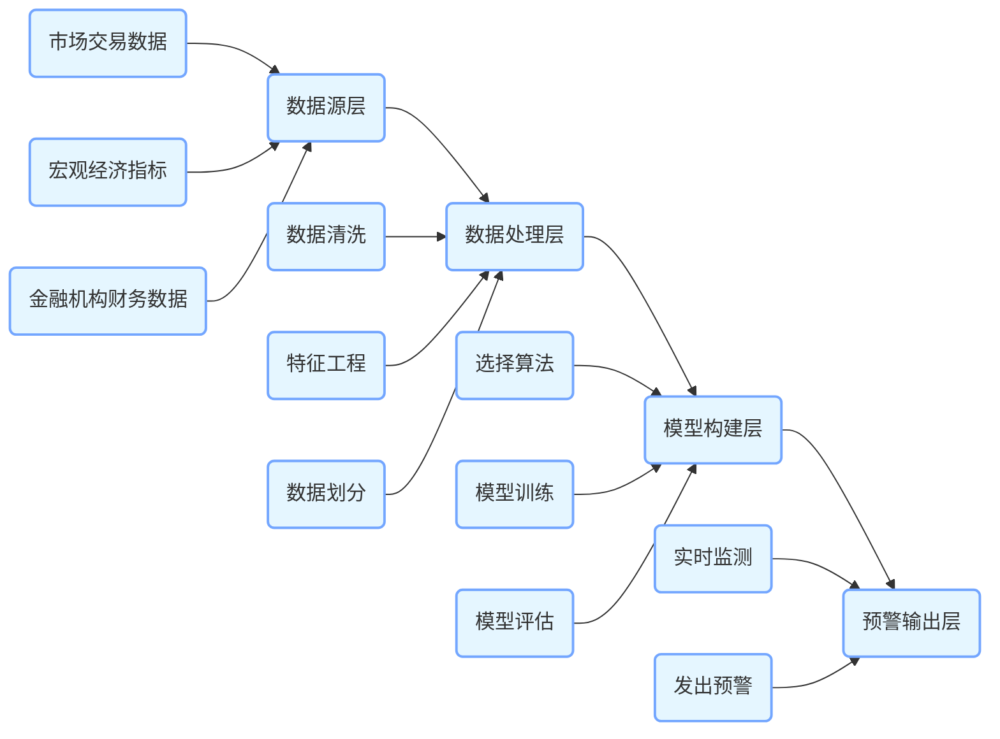

# 开发智能化的金融市场流动性风险传导预警模型

> 关键词：金融市场、流动性风险传导、预警模型、智能化、机器学习

> 摘要：本文聚焦于开发智能化的金融市场流动性风险传导预警模型。在金融市场日益复杂的背景下，流动性风险传导可能引发系统性金融风险，因此构建有效的预警模型至关重要。文章首先介绍了相关背景，包括目的范围、预期读者等内容。接着阐述核心概念与联系，分析流动性风险传导的原理和架构。详细讲解核心算法原理及具体操作步骤，并给出Python源代码示例。同时，引入数学模型和公式进行深入分析。通过项目实战，展示代码实际案例并进行详细解释。探讨实际应用场景，推荐相关工具和资源。最后总结未来发展趋势与挑战，解答常见问题并提供扩展阅读和参考资料，旨在为金融市场流动性风险的预警和管理提供全面且深入的技术方案。

## 1. 背景介绍 
### 1.1 目的和范围
金融市场的流动性风险传导是一个复杂且关键的问题，它可能导致局部风险迅速扩散，进而威胁整个金融体系的稳定。本项目的目的是开发一个智能化的预警模型，能够及时、准确地监测和预警金融市场中流动性风险的传导情况。

本项目的范围涵盖了多种金融市场，如股票市场、债券市场、外汇市场等。模型将综合考虑多个因素，包括市场交易数据、宏观经济指标、金融机构的财务状况等，以全面捕捉流动性风险传导的迹象。

### 1.2 预期读者
本文的预期读者包括金融行业的从业者，如银行家、投资经理、风险管理人员等，他们可以利用该预警模型更好地管理金融风险。同时，也适合计算机科学和金融工程领域的研究人员，为他们在相关领域的研究提供参考。此外，对金融市场和人工智能应用感兴趣的爱好者也可以从本文中获取有价值的信息。

### 1.3 文档结构概述
本文将按照以下结构进行组织：首先介绍核心概念与联系，包括流动性风险传导的原理和架构；然后详细讲解核心算法原理及具体操作步骤，并给出Python代码示例；接着引入数学模型和公式进行深入分析；通过项目实战展示代码实际案例并进行详细解释；探讨实际应用场景；推荐相关工具和资源；最后总结未来发展趋势与挑战，解答常见问题并提供扩展阅读和参考资料。

### 1.4 术语表
#### 1.4.1 核心术语定义
- **金融市场流动性风险**：指金融资产在市场中能够以合理价格迅速买卖的能力受到限制，导致市场参与者无法及时变现资产或承担过高交易成本的风险。
- **流动性风险传导**：指一个金融市场或金融机构的流动性风险通过各种渠道扩散到其他市场或机构的过程。
- **预警模型**：一种基于历史数据和统计分析，能够提前预测潜在风险事件发生可能性的模型。
- **智能化**：指模型具备自动学习、自适应和自我优化的能力，能够根据新的数据不断调整和改进预测结果。

#### 1.4.2 相关概念解释
- **系统性金融风险**：指由单个或多个金融机构或市场的风险事件引发的、可能对整个金融体系造成严重破坏的风险。流动性风险传导是系统性金融风险的重要来源之一。
- **机器学习**：是一门多领域交叉学科，涉及概率论、统计学、逼近论、凸分析、算法复杂度理论等多门学科。它专门研究计算机怎样模拟或实现人类的学习行为，以获取新的知识或技能，重新组织已有的知识结构使之不断改善自身的性能。在本项目中，机器学习算法将用于构建预警模型。

#### 1.4.3 缩略词列表
- **VAR**：Value at Risk，风险价值，是一种常用的风险度量指标，用于衡量在一定置信水平下和一定持有期内，某一投资组合可能遭受的最大损失。
- **LSTM**：Long Short-Term Memory，长短期记忆网络，是一种特殊的循环神经网络，能够有效处理序列数据中的长期依赖关系，在本项目中可用于处理金融时间序列数据。

## 2. 核心概念与联系 
### 核心概念原理
金融市场流动性风险传导的原理基于市场参与者的行为和市场之间的相互联系。当一个金融市场或金融机构出现流动性问题时，可能会引发以下几种传导机制：

- **资产抛售效应**：当某一金融机构面临流动性压力时，可能会被迫抛售资产以获取现金。大量的资产抛售会导致资产价格下跌，进而影响其他持有相同或相关资产的机构的资产价值，引发连锁反应。
- **信用风险传导**：流动性风险可能会导致金融机构的信用状况恶化，增加其违约的可能性。一旦某一机构违约，会影响与其有业务往来的其他机构的资产质量和流动性，从而将风险传导至整个金融体系。
- **市场信心崩溃**：流动性风险事件可能会引发市场参与者的恐慌情绪，导致市场信心崩溃。投资者会纷纷撤离市场，进一步加剧市场的流动性紧张局面，形成恶性循环。

### 架构的文本示意图
```plaintext
金融市场流动性风险传导预警模型架构

数据源层
|-- 市场交易数据（股票、债券、外汇等）
|-- 宏观经济指标（GDP、CPI、利率等）
|-- 金融机构财务数据（资产负债表、利润表等）

数据处理层
|-- 数据清洗（去除噪声、缺失值处理等）
|-- 特征工程（提取关键特征、特征变换等）
|-- 数据划分（训练集、测试集）

模型构建层
|-- 选择合适的机器学习算法（如LSTM、随机森林等）
|-- 模型训练
|-- 模型评估

预警输出层
|-- 实时监测金融市场数据
|-- 根据模型预测结果发出预警信号
```

### Mermaid流程图


## 3. 核心算法原理 & 具体操作步骤 
### 核心算法原理
在构建金融市场流动性风险传导预警模型时，我们可以选择多种机器学习算法。这里以长短期记忆网络（LSTM）为例进行介绍。

LSTM是一种特殊的循环神经网络（RNN），它能够有效处理序列数据中的长期依赖关系。传统的RNN在处理长序列数据时会遇到梯度消失或梯度爆炸的问题，而LSTM通过引入门控机制来解决这个问题。

LSTM单元包含三个门：输入门（$i_t$）、遗忘门（$f_t$）和输出门（$o_t$），以及一个细胞状态（$C_t$）。其核心公式如下：

- 遗忘门：
  $$f_t = \sigma(W_f[h_{t-1}, x_t] + b_f)$$
  其中，$\sigma$ 是sigmoid函数，$W_f$ 是遗忘门的权重矩阵，$h_{t-1}$ 是上一时刻的隐藏状态，$x_t$ 是当前时刻的输入，$b_f$ 是遗忘门的偏置。

- 输入门：
  $$i_t = \sigma(W_i[h_{t-1}, x_t] + b_i)$$
  $$\tilde{C}_t = \tanh(W_C[h_{t-1}, x_t] + b_C)$$
  其中，$W_i$ 和 $W_C$ 分别是输入门和候选细胞状态的权重矩阵，$b_i$ 和 $b_C$ 是相应的偏置。

- 细胞状态更新：
  $$C_t = f_t \odot C_{t-1} + i_t \odot \tilde{C}_t$$
  其中，$\odot$ 表示逐元素相乘。

- 输出门：
  $$o_t = \sigma(W_o[h_{t-1}, x_t] + b_o)$$
  $$h_t = o_t \odot \tanh(C_t)$$
  其中，$W_o$ 是输出门的权重矩阵，$b_o$ 是输出门的偏置。

### 具体操作步骤
#### 步骤1：数据准备
首先，我们需要收集金融市场的相关数据，包括市场交易数据、宏观经济指标和金融机构财务数据等。然后对数据进行清洗和预处理，去除噪声和缺失值，进行特征工程，提取关键特征。

#### 步骤2：数据划分
将预处理后的数据划分为训练集和测试集，一般可以按照80:20的比例进行划分。

#### 步骤3：模型构建
使用Python的深度学习框架（如Keras或PyTorch）构建LSTM模型。以下是一个使用Keras构建LSTM模型的示例代码：

```python
import numpy as np
from keras.models import Sequential
from keras.layers import LSTM, Dense

# 假设X_train和y_train是训练数据
# X_train的形状为 (样本数, 时间步长, 特征数)
# y_train的形状为 (样本数, 预测值)

# 构建LSTM模型
model = Sequential()
model.add(LSTM(units=50, return_sequences=True, input_shape=(X_train.shape[1], X_train.shape[2])))
model.add(LSTM(units=50, return_sequences=False))
model.add(Dense(units=1))

# 编译模型
model.compile(optimizer='adam', loss='mean_squared_error')

# 训练模型
model.fit(X_train, y_train, batch_size=32, epochs=100)
```

#### 步骤4：模型评估
使用测试集对训练好的模型进行评估，计算评估指标（如均方误差、平均绝对误差等），以评估模型的性能。

```python
from sklearn.metrics import mean_squared_error, mean_absolute_error

# 假设X_test和y_test是测试数据
y_pred = model.predict(X_test)

mse = mean_squared_error(y_test, y_pred)
mae = mean_absolute_error(y_test, y_pred)

print(f"均方误差: {mse}")
print(f"平均绝对误差: {mae}")
```

#### 步骤5：实时预警
将训练好的模型部署到实时监测系统中，实时获取金融市场数据，输入模型进行预测。当预测结果超过设定的阈值时，发出预警信号。

## 4. 数学模型和公式 & 详细讲解 & 举例说明 
### 数学模型和公式
#### 风险度量指标 - VAR
风险价值（VAR）是一种常用的风险度量指标，用于衡量在一定置信水平下和一定持有期内，某一投资组合可能遭受的最大损失。其计算公式如下：

设投资组合的初始价值为 $V_0$，收益率为 $R$，则在持有期 $T$ 内的投资组合价值为 $V = V_0(1 + R)$。

在置信水平为 $c$ 下，VAR的计算公式为：

$$VAR = V_0 - V_{min}$$

其中，$V_{min}$ 是在置信水平 $c$ 下投资组合的最小价值。

#### 流动性风险传导模型
我们可以使用格兰杰因果检验来分析金融市场之间的流动性风险传导关系。格兰杰因果检验的基本思想是，如果一个时间序列 $X_t$ 是另一个时间序列 $Y_t$ 的格兰杰原因，那么 $X_t$ 的过去值应该能够帮助预测 $Y_t$ 的未来值。

假设我们有两个时间序列 $X_t$ 和 $Y_t$，进行格兰杰因果检验的回归模型如下：

$$Y_t = \sum_{i=1}^{p} \alpha_i Y_{t-i} + \sum_{i=1}^{p} \beta_i X_{t-i} + \epsilon_t$$

其中，$p$ 是滞后阶数，$\alpha_i$ 和 $\beta_i$ 是回归系数，$\epsilon_t$ 是误差项。

原假设 $H_0$：$\beta_1 = \beta_2 = \cdots = \beta_p = 0$，即 $X_t$ 不是 $Y_t$ 的格兰杰原因。

通过F检验来判断是否拒绝原假设。如果拒绝原假设，则说明 $X_t$ 是 $Y_t$ 的格兰杰原因，存在流动性风险传导。

### 详细讲解
#### VAR的计算
计算VAR的方法有多种，常见的有历史模拟法、方差-协方差法和蒙特卡罗模拟法。这里以历史模拟法为例进行讲解。

历史模拟法的基本步骤如下：
1. 收集投资组合的历史收益率数据。
2. 按照一定的置信水平（如95%）确定分位数。
3. 根据分位数计算VAR。

例如，假设我们有1000个历史收益率数据，按照从小到大的顺序排列。在95%的置信水平下，我们取第50个数据（$1000 \times (1 - 0.95) = 50$）作为分位数。如果初始投资组合价值为 $V_0 = 100$ 万元，该分位数对应的收益率为 $r_{min}$，则VAR为：

$$VAR = V_0 \times |r_{min}|$$

#### 格兰杰因果检验
格兰杰因果检验的步骤如下：
1. 确定滞后阶数 $p$。可以使用信息准则（如AIC、BIC）来选择合适的滞后阶数。
2. 估计回归模型。使用最小二乘法估计回归系数 $\alpha_i$ 和 $\beta_i$。
3. 进行F检验。计算F统计量，根据F分布表判断是否拒绝原假设。

### 举例说明
#### VAR计算示例
假设我们有一个投资组合，初始价值为 $V_0 = 100$ 万元，收集了过去100个交易日的收益率数据。按照从小到大的顺序排列后，第5个数据（95%置信水平下）对应的收益率为 $-0.02$。则VAR为：

$$VAR = 100 \times |-0.02| = 2$$（万元）

这意味着在95%的置信水平下，该投资组合在一个交易日内可能遭受的最大损失为2万元。

#### 格兰杰因果检验示例
假设我们有两个金融市场的流动性指标时间序列 $X_t$ 和 $Y_t$，通过计算AIC准则确定滞后阶数 $p = 2$。估计回归模型后得到的F统计量为 $F = 3.5$，查F分布表可知，在给定的显著性水平下，临界值为 $F_{crit} = 2.5$。由于 $F > F_{crit}$，我们拒绝原假设，说明 $X_t$ 是 $Y_t$ 的格兰杰原因，存在流动性风险传导。

## 5. 项目实战：代码实际案例和详细解释说明 
### 5.1  开发环境搭建
#### 操作系统
本项目可以在Windows、Linux或macOS等操作系统上进行开发，建议使用Linux系统，因为它在数据处理和机器学习方面具有更好的性能和稳定性。

#### 编程语言和框架
- **Python**：作为主要的编程语言，Python具有丰富的科学计算和机器学习库，非常适合本项目的开发。
- **Keras**：一个高级神经网络API，简单易用，可用于构建LSTM模型。
- **Pandas**：用于数据处理和分析。
- **Numpy**：用于数值计算。
- **Scikit-learn**：用于模型评估和数据预处理。

#### 安装步骤
首先，确保已经安装了Python 3.x版本。然后使用以下命令安装所需的库：

```bash
pip install keras pandas numpy scikit-learn
```

### 5.2  源代码详细实现和代码解读
#### 数据准备
```python
import pandas as pd
import numpy as np

# 读取数据
data = pd.read_csv('financial_data.csv')

# 数据清洗
data = data.dropna()

# 特征工程
# 假设我们选择了一些关键特征
features = ['market_return', 'interest_rate', 'gdp_growth']
X = data[features].values
y = data['liquidity_risk'].values

# 数据划分
from sklearn.model_selection import train_test_split
X_train, X_test, y_train, y_test = train_test_split(X, y, test_size=0.2, random_state=42)

# 数据标准化
from sklearn.preprocessing import StandardScaler
scaler = StandardScaler()
X_train = scaler.fit_transform(X_train)
X_test = scaler.transform(X_test)

# 将数据转换为适合LSTM输入的形状
X_train = np.reshape(X_train, (X_train.shape[0], 1, X_train.shape[1]))
X_test = np.reshape(X_test, (X_test.shape[0], 1, X_test.shape[1]))
```

代码解读：
1. 首先使用Pandas读取金融数据文件 `financial_data.csv`。
2. 对数据进行清洗，去除包含缺失值的行。
3. 选择一些关键特征，并将其作为输入特征 $X$，将流动性风险指标作为目标变量 $y$。
4. 使用 `train_test_split` 函数将数据划分为训练集和测试集。
5. 使用 `StandardScaler` 对数据进行标准化处理，使数据具有零均值和单位方差。
6. 将数据转换为适合LSTM输入的形状，即 (样本数, 时间步长, 特征数)。

#### 模型构建和训练
```python
from keras.models import Sequential
from keras.layers import LSTM, Dense

# 构建LSTM模型
model = Sequential()
model.add(LSTM(units=50, return_sequences=True, input_shape=(X_train.shape[1], X_train.shape[2])))
model.add(LSTM(units=50, return_sequences=False))
model.add(Dense(units=1))

# 编译模型
model.compile(optimizer='adam', loss='mean_squared_error')

# 训练模型
model.fit(X_train, y_train, batch_size=32, epochs=100)
```

代码解读：
1. 使用Keras的 `Sequential` 模型构建一个LSTM模型。
2. 添加两个LSTM层，第一个LSTM层的 `return_sequences=True` 表示返回序列，第二个LSTM层的 `return_sequences=False` 表示只返回最后一个时间步的输出。
3. 添加一个全连接层，输出维度为1。
4. 使用 `adam` 优化器和均方误差损失函数编译模型。
5. 使用训练集对模型进行训练，设置批量大小为32，训练轮数为100。

#### 模型评估
```python
from sklearn.metrics import mean_squared_error, mean_absolute_error

# 预测
y_pred = model.predict(X_test)

# 计算评估指标
mse = mean_squared_error(y_test, y_pred)
mae = mean_absolute_error(y_test, y_pred)

print(f"均方误差: {mse}")
print(f"平均绝对误差: {mae}")
```

代码解读：
1. 使用训练好的模型对测试集进行预测。
2. 计算均方误差和平均绝对误差，用于评估模型的性能。

### 5.3  代码解读与分析
#### 数据处理
数据处理是构建机器学习模型的重要步骤。在本项目中，我们进行了数据清洗、特征工程和数据标准化处理。数据清洗可以去除噪声和缺失值，提高数据质量；特征工程可以提取关键特征，减少数据维度；数据标准化可以使数据具有相同的尺度，有助于模型的收敛和训练。

#### 模型构建
LSTM模型适合处理序列数据，能够捕捉金融市场数据中的长期依赖关系。通过添加多个LSTM层和全连接层，我们可以构建一个复杂的模型，提高模型的预测能力。

#### 模型评估
均方误差和平均绝对误差是常用的回归模型评估指标。均方误差对误差的平方进行平均，更注重较大误差的影响；平均绝对误差对误差的绝对值进行平均，更直观地反映了模型的预测误差。通过评估指标，我们可以判断模型的性能是否满足要求。

## 6. 实际应用场景 
### 金融机构风险管理
金融机构（如银行、证券公司、保险公司等）可以使用该预警模型来监测和管理流动性风险。通过实时监测金融市场数据，及时发现流动性风险传导的迹象，采取相应的风险管理措施，如调整资产配置、增加流动性储备等，以降低风险损失。

### 监管机构宏观审慎监管
监管机构可以利用该预警模型对整个金融体系的流动性风险进行宏观审慎监管。通过监测不同金融市场和金融机构之间的流动性风险传导情况，及时发现系统性金融风险的隐患，采取宏观调控措施，如调整货币政策、加强监管力度等，维护金融体系的稳定。

### 投资者决策参考
投资者可以将该预警模型作为投资决策的参考工具。在进行投资之前，了解金融市场的流动性风险状况，避免在流动性风险较高的时期进行大规模投资。同时，根据预警信号及时调整投资组合，降低投资风险。

## 7. 工具和资源推荐
### 7.1 学习资源推荐
#### 7.1.1 书籍推荐
- 《Python机器学习》：介绍了Python在机器学习领域的应用，包括数据处理、模型构建和评估等方面的内容。
- 《深度学习》：由深度学习领域的三位先驱Ian Goodfellow、Yoshua Bengio和Aaron Courville撰写，是深度学习领域的经典教材。
- 《金融风险管理》：全面介绍了金融风险管理的理论和方法，包括市场风险、信用风险和流动性风险等方面的内容。

#### 7.1.2 在线课程
- Coursera上的“机器学习”课程：由斯坦福大学教授Andrew Ng主讲，是机器学习领域的入门经典课程。
- edX上的“深度学习”课程：由MIT等高校的教授联合授课，深入介绍了深度学习的原理和应用。
- 中国大学MOOC上的“金融风险管理”课程：由国内高校的教授授课，结合中国金融市场的实际情况，介绍了金融风险管理的相关知识。

#### 7.1.3 技术博客和网站
- Medium：一个技术博客平台，有很多关于机器学习和金融科技的优质文章。
- Kaggle：一个数据科学竞赛平台，上面有很多金融数据和相关的数据分析项目，可以学习到实际的应用案例。
- 金融界网站：提供金融市场的实时数据和分析报告，有助于了解金融市场的动态。

### 7.2 开发工具框架推荐
#### 7.2.1 IDE和编辑器
- PyCharm：一款专业的Python集成开发环境，具有代码编辑、调试、版本控制等功能，适合大规模项目的开发。
- Jupyter Notebook：一个交互式的开发环境，支持Python、R等多种编程语言，方便进行数据探索和模型实验。
- Visual Studio Code：一款轻量级的代码编辑器，具有丰富的插件和扩展功能，可用于Python开发。

#### 7.2.2 调试和性能分析工具
- TensorBoard：一个可视化工具，可用于监控深度学习模型的训练过程，包括损失函数、准确率等指标的变化情况。
- Py-Spy：一个Python性能分析工具，可以分析Python程序的CPU使用情况和函数调用时间，帮助优化代码性能。
- Scikit-learn的 `GridSearchCV`：用于模型调优，通过网格搜索的方式寻找最优的模型参数。

#### 7.2.3 相关框架和库
- TensorFlow：一个开源的深度学习框架，具有强大的计算能力和广泛的应用场景。
- PyTorch：另一个流行的深度学习框架，以其简洁易用和动态图的特点受到广泛关注。
- Statsmodels：一个Python库，提供了各种统计模型和方法，可用于时间序列分析、回归分析等。

### 7.3 相关论文著作推荐
#### 7.3.1 经典论文
- “On the Pricing of Corporate Debt: The Risk Structure of Interest Rates”：由Merton提出的经典论文，介绍了基于期权定价理论的公司债务定价模型。
- “Capital Asset Prices: A Theory of Market Equilibrium under Conditions of Risk”：由Sharpe提出的资本资产定价模型（CAPM），是现代金融理论的重要基础。
- “The Cross-Section of Expected Stock Returns”：由Fama和French提出的三因子模型，对股票收益率的横截面进行了深入分析。

#### 7.3.2 最新研究成果
- “Liquidity Risk and Expected Stock Returns”：研究了流动性风险与股票预期收益率之间的关系。
- “Systemic Risk and Financial Contagion”：探讨了系统性金融风险和金融传染的机制和影响。
- “Machine Learning in Finance: Applications and Challenges”：介绍了机器学习在金融领域的应用和面临的挑战。

#### 7.3.3 应用案例分析
- 《金融科技前沿：应用与趋势》：介绍了金融科技在各个领域的应用案例，包括智能投顾、风险预警等方面。
- 《金融科技时代的风险管理》：结合实际案例，分析了金融科技对风险管理的影响和应对策略。

## 8. 总结：未来发展趋势与挑战
### 未来发展趋势
- **融合多源数据**：未来的预警模型将融合更多类型的数据，如社交媒体数据、新闻舆情数据等，以更全面地捕捉金融市场的动态和投资者情绪，提高预警的准确性。
- **人工智能技术的深度应用**：除了现有的机器学习算法，未来将更多地应用深度学习、强化学习等人工智能技术，进一步挖掘数据中的潜在信息，提高模型的智能化水平。
- **跨市场和跨境风险监测**：随着金融市场的全球化和互联互通，未来的预警模型将更加注重跨市场和跨境的流动性风险传导监测，以应对日益复杂的金融风险环境。

### 挑战
- **数据质量和隐私问题**：金融数据的质量和隐私是构建预警模型的关键挑战。数据中可能存在噪声、缺失值和错误，需要进行有效的清洗和预处理。同时，金融数据涉及大量的个人和企业隐私信息，需要采取严格的安全措施来保护数据隐私。
- **模型解释性**：深度学习等复杂模型虽然具有较高的预测性能，但往往缺乏良好的解释性。在金融领域，模型的解释性非常重要，监管机构和投资者需要了解模型的决策依据。因此，如何提高模型的解释性是未来需要解决的问题之一。
- **不确定性和黑天鹅事件**：金融市场充满了不确定性和黑天鹅事件，这些事件往往难以预测和建模。如何在预警模型中考虑不确定性和黑天鹅事件的影响，提高模型的鲁棒性和适应性，是未来面临的挑战之一。

## 9. 附录：常见问题与解答
### 问题1：如何选择合适的机器学习算法？
答：选择合适的机器学习算法需要考虑多个因素，包括数据的类型和特点、问题的复杂度、模型的可解释性等。对于金融市场流动性风险传导预警问题，由于数据具有时间序列的特点，LSTM等循环神经网络算法通常是比较合适的选择。同时，也可以尝试其他算法，如随机森林、支持向量机等，并通过模型评估来选择最优的算法。

### 问题2：如何处理金融数据中的缺失值？
答：处理金融数据中的缺失值可以采用多种方法，常见的有删除法、插补法和模型法。删除法是直接删除包含缺失值的样本或特征，但这种方法可能会导致数据丢失。插补法是用一个合适的值来填充缺失值，如均值、中位数、众数等。模型法是使用机器学习模型来预测缺失值。在实际应用中，需要根据数据的特点和问题的需求选择合适的方法。

### 问题3：如何评估预警模型的性能？
答：评估预警模型的性能可以使用多种指标，如准确率、召回率、F1值、均方误差、平均绝对误差等。对于分类问题，准确率、召回率和F1值可以反映模型的分类能力；对于回归问题，均方误差和平均绝对误差可以反映模型的预测精度。此外，还可以使用ROC曲线、AUC值等指标来评估模型的性能。

## 10. 扩展阅读 & 参考资料
### 扩展阅读
- 《人工智能时代的金融科技》：介绍了人工智能在金融科技领域的应用和发展趋势。
- 《量化投资：策略与技术》：详细介绍了量化投资的策略和技术，包括数据处理、模型构建和交易执行等方面的内容。
- 《金融市场学》：系统介绍了金融市场的基本理论和运行机制，有助于深入理解金融市场的流动性风险传导问题。

### 参考资料
- [1] Goodfellow, I., Bengio, Y., & Courville, A. (2016). Deep Learning. MIT Press.
- [2] Merton, R. C. (1974). On the Pricing of Corporate Debt: The Risk Structure of Interest Rates. The Journal of Finance, 29(2), 449-470.
- [3] Sharpe, W. F. (1964). Capital Asset Prices: A Theory of Market Equilibrium under Conditions of Risk. The Journal of Finance, 19(3), 425-442.
- [4] Fama, E. F., & French, K. R. (1992). The Cross-Section of Expected Stock Returns. The Journal of Finance, 47(2), 427-465.

作者：AI天才研究院/AI Genius Institute & 禅与计算机程序设计艺术 /Zen And The Art of Computer Programming