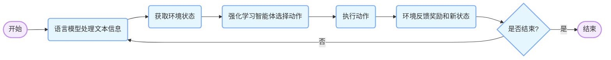

# 强化学习与语言模型结合的智能交通系统优化研究

> 关键词：强化学习、语言模型、智能交通系统、优化研究、交通控制

> 摘要：本文聚焦于强化学习与语言模型结合在智能交通系统优化中的应用。首先介绍了研究的背景、目的和范围等基础信息，阐述了强化学习和语言模型的核心概念及二者的联系。详细讲解了相关核心算法原理，并给出Python源代码示例。通过数学模型和公式对其进行理论支撑，同时辅以实际案例说明。接着进行项目实战，包括开发环境搭建、源代码实现与解读。探讨了该结合方式在智能交通系统中的实际应用场景，推荐了学习、开发相关的工具和资源。最后总结了未来发展趋势与挑战，解答常见问题，并提供扩展阅读和参考资料，旨在为智能交通系统的优化提供新的思路和方法。

## 1. 背景介绍 
### 1.1 目的和范围
随着城市化进程的加速，交通拥堵、交通事故等问题日益严重，智能交通系统（Intelligent Transportation System, ITS）应运而生，旨在通过先进的信息技术、通信技术等提高交通系统的效率、安全性和可持续性。本研究的目的是探索强化学习与语言模型结合在智能交通系统优化中的应用，以解决传统交通控制方法在复杂动态环境下的局限性。研究范围涵盖了交通信号控制、车辆路径规划、交通流量预测等多个智能交通系统的关键领域。

### 1.2 预期读者
本文预期读者包括交通工程领域的研究人员、智能交通系统的开发者、人工智能领域对强化学习和语言模型应用感兴趣的学者和工程师，以及相关专业的学生。他们希望通过本文了解如何将强化学习与语言模型结合应用于智能交通系统优化，获取相关的理论知识、算法实现和实践经验。

### 1.3 文档结构概述
本文将按照以下结构进行阐述：首先介绍核心概念与联系，包括强化学习和语言模型的原理以及二者结合的架构；接着讲解核心算法原理和具体操作步骤，并给出Python代码示例；然后通过数学模型和公式对相关理论进行深入分析，并举例说明；进行项目实战，包括开发环境搭建、源代码实现和代码解读；探讨实际应用场景；推荐相关的工具和资源；总结未来发展趋势与挑战；解答常见问题；最后提供扩展阅读和参考资料。

### 1.4 术语表
#### 1.4.1 核心术语定义
- **强化学习（Reinforcement Learning, RL）**：一种机器学习范式，智能体通过与环境进行交互，根据环境反馈的奖励信号来学习最优行为策略，以最大化长期累积奖励。
- **语言模型（Language Model, LM）**：一种对自然语言文本进行建模的模型，用于预测文本序列中下一个词的概率分布。常见的语言模型有基于统计的模型和基于神经网络的模型，如GPT系列。
- **智能交通系统（Intelligent Transportation System, ITS）**：将先进的信息技术、通信技术、控制技术、传感器技术等集成应用于交通运输领域，实现交通系统的智能化管理和控制。
- **交通信号控制（Traffic Signal Control）**：通过调整交通信号灯的时间配时，优化交叉口的车辆通行效率，减少交通拥堵。
- **车辆路径规划（Vehicle Routing Problem, VRP）**：为车辆规划最优的行驶路径，以满足特定的约束条件，如时间、成本等。

#### 1.4.2 相关概念解释
- **策略（Policy）**：在强化学习中，策略是智能体根据当前状态选择动作的规则。可以表示为一个函数 $\pi(s,a)$，表示在状态 $s$ 下选择动作 $a$ 的概率。
- **奖励（Reward）**：环境在智能体执行动作后反馈给智能体的数值信号，用于表示该动作的好坏程度。智能体的目标是最大化长期累积奖励。
- **状态（State）**：环境的当前特征描述，智能体根据状态来选择动作。在智能交通系统中，状态可以包括交通流量、车速、信号灯状态等。
- **动作（Action）**：智能体在某个状态下可以执行的操作。例如，在交通信号控制中，动作可以是改变信号灯的相位。

#### 1.4.3 缩略词列表
- RL：Reinforcement Learning（强化学习）
- LM：Language Model（语言模型）
- ITS：Intelligent Transportation System（智能交通系统）
- VRP：Vehicle Routing Problem（车辆路径规划）

## 2. 核心概念与联系 

### 2.1 强化学习原理
强化学习的核心是智能体（Agent）与环境（Environment）之间的交互过程。智能体在每个时间步 $t$ 观察环境的状态 $s_t$，根据当前策略 $\pi$ 选择一个动作 $a_t$ 执行，环境接收到动作后会转移到新的状态 $s_{t+1}$，并给予智能体一个奖励 $r_{t+1}$。智能体的目标是学习一个最优策略 $\pi^*$，使得长期累积奖励 $G_t=\sum_{k=0}^{\infty}\gamma^k r_{t+k+1}$ 最大化，其中 $\gamma \in [0,1]$ 是折扣因子，用于平衡即时奖励和未来奖励。

常见的强化学习算法包括Q学习（Q-Learning）、深度Q网络（Deep Q-Network, DQN）、策略梯度算法（Policy Gradient Algorithm）等。以Q学习为例，其核心是学习一个动作价值函数 $Q(s,a)$，表示在状态 $s$ 下执行动作 $a$ 所能获得的最大累积奖励。Q学习的更新公式为：
$$Q(s_t,a_t) \leftarrow Q(s_t,a_t) + \alpha [r_{t+1} + \gamma \max_{a} Q(s_{t+1},a) - Q(s_t,a_t)]$$
其中 $\alpha$ 是学习率。

### 2.2 语言模型原理
语言模型的主要任务是根据给定的文本序列预测下一个词的概率分布。基于神经网络的语言模型通常使用循环神经网络（Recurrent Neural Network, RNN）或其变体，如长短期记忆网络（Long Short-Term Memory, LSTM）、门控循环单元（Gated Recurrent Unit, GRU），以及Transformer架构。

以Transformer架构为例，它采用了多头自注意力机制（Multi-Head Self-Attention）来捕捉文本序列中的长距离依赖关系。Transformer由编码器（Encoder）和解码器（Decoder）组成，编码器将输入的文本序列转换为一系列的特征表示，解码器根据这些特征表示生成输出文本序列。

### 2.3 强化学习与语言模型的结合架构
将强化学习与语言模型结合应用于智能交通系统，可以采用以下架构：


图中展示了一个简化的结合架构。语言模型用于处理交通领域的文本信息，如交通规则、路况描述等，将其转换为特征向量。强化学习智能体根据这些特征向量以及环境的状态信息来选择动作。环境反馈的奖励信号用于更新强化学习智能体的策略，同时语言模型也可以根据新的文本数据进行微调。

### 2.4 Mermaid流程图


该流程图展示了强化学习与语言模型结合在智能交通系统中的工作流程。首先，语言模型处理交通领域的文本信息，然后强化学习智能体结合环境状态选择动作，执行动作后环境反馈奖励和新状态，根据是否结束的判断决定是否继续循环。

## 3. 核心算法原理 & 具体操作步骤 

### 3.1 基于DQN的强化学习算法原理
深度Q网络（DQN）是一种将深度学习与Q学习相结合的强化学习算法，用于处理高维状态空间的问题。DQN使用一个神经网络来近似动作价值函数 $Q(s,a)$，称为Q网络。

DQN的核心思想是通过经验回放（Experience Replay）和目标网络（Target Network）来提高学习的稳定性。经验回放是指将智能体与环境的交互经验 $(s_t,a_t,r_{t+1},s_{t+1})$ 存储在经验回放缓冲区中，然后随机从缓冲区中采样一批经验进行学习，这样可以打破数据之间的相关性。目标网络是一个与Q网络结构相同但参数更新较慢的网络，用于计算目标Q值，减少训练过程中的波动。

### 3.2 具体操作步骤
#### 3.2.1 初始化
- 初始化Q网络 $Q(s,a;\theta)$ 和目标网络 $Q(s,a;\theta^-)$，其中 $\theta$ 和 $\theta^-$ 分别是Q网络和目标网络的参数。
- 初始化经验回放缓冲区 $D$，设置最大容量 $N$。
- 设置学习率 $\alpha$、折扣因子 $\gamma$、目标网络更新频率 $C$ 等超参数。

#### 3.2.2 与环境交互
- 在每个时间步 $t$，观察环境的状态 $s_t$。
- 根据 $\epsilon$-贪心策略选择动作 $a_t$：
  - 以概率 $\epsilon$ 随机选择一个动作。
  - 以概率 $1 - \epsilon$ 选择 $Q(s_t,a;\theta)$ 最大的动作。
- 执行动作 $a_t$，环境转移到新的状态 $s_{t+1}$，并给予奖励 $r_{t+1}$。
- 将经验 $(s_t,a_t,r_{t+1},s_{t+1})$ 存储到经验回放缓冲区 $D$ 中。

#### 3.2.3 经验回放学习
- 从经验回放缓冲区 $D$ 中随机采样一批经验 $(s_i,a_i,r_i,s_{i+1})$。
- 计算目标Q值：
  - 对于每个经验 $(s_i,a_i,r_i,s_{i+1})$，目标Q值 $y_i = r_i + \gamma \max_{a} Q(s_{i+1},a;\theta^-)$。
- 计算损失函数：
  - 使用均方误差损失函数 $L(\theta) = \frac{1}{|B|} \sum_{i \in B} (y_i - Q(s_i,a_i;\theta))^2$，其中 $B$ 是采样的经验批次。
- 使用梯度下降法更新Q网络的参数 $\theta$：
  - $\theta \leftarrow \theta - \alpha \nabla_{\theta} L(\theta)$。

#### 3.2.4 更新目标网络
- 每隔 $C$ 个时间步，将目标网络的参数 $\theta^-$ 更新为Q网络的参数 $\theta$：
  - $\theta^- \leftarrow \theta$。

### 3.3 Python源代码示例
```python
import torch
import torch.nn as nn
import torch.optim as optim
import numpy as np
import random

# 定义Q网络
class QNetwork(nn.Module):
    def __init__(self, state_dim, action_dim):
        super(QNetwork, self).__init__()
        self.fc1 = nn.Linear(state_dim, 64)
        self.fc2 = nn.Linear(64, 64)
        self.fc3 = nn.Linear(64, action_dim)

    def forward(self, x):
        x = torch.relu(self.fc1(x))
        x = torch.relu(self.fc2(x))
        return self.fc3(x)

# 定义DQN智能体
class DQNAgent:
    def __init__(self, state_dim, action_dim, learning_rate=0.001, gamma=0.99, epsilon=1.0, epsilon_decay=0.995, epsilon_min=0.01, batch_size=64, memory_size=10000, target_update_freq=100):
        self.state_dim = state_dim
        self.action_dim = action_dim
        self.learning_rate = learning_rate
        self.gamma = gamma
        self.epsilon = epsilon
        self.epsilon_decay = epsilon_decay
        self.epsilon_min = epsilon_min
        self.batch_size = batch_size
        self.memory_size = memory_size
        self.target_update_freq = target_update_freq

        self.q_network = QNetwork(state_dim, action_dim)
        self.target_network = QNetwork(state_dim, action_dim)
        self.target_network.load_state_dict(self.q_network.state_dict())
        self.optimizer = optim.Adam(self.q_network.parameters(), lr=learning_rate)
        self.memory = []
        self.step_count = 0

    def remember(self, state, action, reward, next_state, done):
        if len(self.memory) > self.memory_size:
            self.memory.pop(0)
        self.memory.append((state, action, reward, next_state, done))

    def act(self, state):
        if np.random.rand() <= self.epsilon:
            return random.randrange(self.action_dim)
        state = torch.FloatTensor(state).unsqueeze(0)
        q_values = self.q_network(state)
        action = torch.argmax(q_values).item()
        return action

    def replay(self):
        if len(self.memory) < self.batch_size:
            return
        minibatch = random.sample(self.memory, self.batch_size)
        states, actions, rewards, next_states, dones = zip(*minibatch)

        states = torch.FloatTensor(states)
        actions = torch.LongTensor(actions)
        rewards = torch.FloatTensor(rewards)
        next_states = torch.FloatTensor(next_states)
        dones = torch.FloatTensor(dones)

        q_values = self.q_network(states)
        q_values = q_values.gather(1, actions.unsqueeze(1)).squeeze(1)

        next_q_values = self.target_network(next_states)
        next_q_values = next_q_values.max(1)[0]
        target_q_values = rewards + (1 - dones) * self.gamma * next_q_values

        loss = nn.MSELoss()(q_values, target_q_values)
        self.optimizer.zero_grad()
        loss.backward()
        self.optimizer.step()

        if self.epsilon > self.epsilon_min:
            self.epsilon *= self.epsilon_decay

        self.step_count += 1
        if self.step_count % self.target_update_freq == 0:
            self.target_network.load_state_dict(self.q_network.state_dict())

# 示例使用
state_dim = 4
action_dim = 2
agent = DQNAgent(state_dim, action_dim)

state = np.random.rand(state_dim)
action = agent.act(state)
next_state = np.random.rand(state_dim)
reward = 1
done = False
agent.remember(state, action, reward, next_state, done)
agent.replay()
```

## 4. 数学模型和公式 & 详细讲解 & 举例说明 

### 4.1 强化学习的数学模型
强化学习可以用马尔可夫决策过程（Markov Decision Process, MDP）来建模。一个MDP由一个四元组 $(S,A,P,R,\gamma)$ 表示，其中：
- $S$ 是状态空间，表示环境所有可能的状态。
- $A$ 是动作空间，表示智能体所有可能的动作。
- $P(s_{t+1}|s_t,a_t)$ 是状态转移概率，表示在状态 $s_t$ 下执行动作 $a_t$ 后转移到状态 $s_{t+1}$ 的概率。
- $R(s_t,a_t,s_{t+1})$ 是奖励函数，表示在状态 $s_t$ 下执行动作 $a_t$ 并转移到状态 $s_{t+1}$ 时获得的奖励。
- $\gamma \in [0,1]$ 是折扣因子，用于平衡即时奖励和未来奖励。

策略 $\pi$ 是一个从状态空间 $S$ 到动作空间 $A$ 的映射，表示在每个状态下选择动作的概率分布。动作价值函数 $Q^{\pi}(s,a)$ 表示在策略 $\pi$ 下，从状态 $s$ 执行动作 $a$ 所能获得的期望累积奖励：
$$Q^{\pi}(s,a) = \mathbb{E}_{\pi} \left[ \sum_{k=0}^{\infty} \gamma^k r_{t+k+1} \mid s_t = s, a_t = a \right]$$
最优动作价值函数 $Q^*(s,a)$ 是所有策略下动作价值函数的最大值：
$$Q^*(s,a) = \max_{\pi} Q^{\pi}(s,a)$$

### 4.2 深度Q网络的损失函数
在DQN中，使用均方误差损失函数来更新Q网络的参数。假设从经验回放缓冲区中采样得到一批经验 $(s_i,a_i,r_i,s_{i+1})$，目标Q值 $y_i$ 定义为：
$$y_i = r_i + \gamma \max_{a} Q(s_{i+1},a;\theta^-)$$
其中 $\theta^-$ 是目标网络的参数。损失函数 $L(\theta)$ 为：
$$L(\theta) = \frac{1}{|B|} \sum_{i \in B} (y_i - Q(s_i,a_i;\theta))^2$$
其中 $B$ 是采样的经验批次。通过最小化损失函数 $L(\theta)$，可以使Q网络的输出 $Q(s_i,a_i;\theta)$ 逼近目标Q值 $y_i$。

### 4.3 举例说明
考虑一个简单的智能交通信号控制问题，假设交叉口有两个相位，每个相位的时长可以在30秒到90秒之间调整，状态空间包括当前交通流量、车辆排队长度等信息，动作空间包括选择不同的相位时长。

设状态 $s$ 是一个四维向量，分别表示东西方向和南北方向的交通流量和车辆排队长度，动作 $a$ 是一个二维向量，分别表示两个相位的时长。奖励函数 $R(s,a)$ 可以定义为车辆平均延误时间的负值，即奖励越大表示车辆延误时间越小。

假设在某个时间步 $t$，状态 $s_t = [100, 80, 120, 90]$，智能体选择动作 $a_t = [60, 70]$，执行动作后环境转移到新的状态 $s_{t+1} = [110, 90, 130, 100]$，并给予奖励 $r_{t+1} = -5$。将经验 $(s_t,a_t,r_{t+1},s_{t+1})$ 存储到经验回放缓冲区中。

在经验回放学习时，从缓冲区中采样一批经验，计算目标Q值和损失函数，然后使用梯度下降法更新Q网络的参数。通过不断地与环境交互和学习，智能体可以逐渐找到最优的动作策略，以最小化车辆的平均延误时间。

## 5. 项目实战：代码实际案例和详细解释说明 

### 5.1  开发环境搭建
#### 5.1.1 操作系统
建议使用Linux系统，如Ubuntu 18.04或更高版本，因为Linux系统对深度学习开发有较好的支持。

#### 5.1.2 编程语言和库
- **Python**：建议使用Python 3.7或更高版本。
- **PyTorch**：深度学习框架，用于构建和训练神经网络。可以通过以下命令安装：
```bash
pip install torch torchvision
```
- **NumPy**：用于数值计算和数组操作。可以通过以下命令安装：
```bash
pip install numpy
```
- **Matplotlib**：用于数据可视化。可以通过以下命令安装：
```bash
pip install matplotlib
```

#### 5.1.3 交通仿真工具
可以使用SUMO（Simulation of Urban MObility）作为交通仿真工具，用于模拟智能交通系统的运行。SUMO是一个开源的交通仿真软件，支持多种交通场景的建模和仿真。可以从官方网站（https://sumo.dlr.de/docs/Downloads.php）下载并安装。

### 5.2  源代码详细实现和代码解读
#### 5.2.1 与SUMO集成
```python
import traci
import numpy as np
import torch

# 初始化SUMO连接
sumo_binary = "sumo-gui"  # 可以改为 "sumo" 以无界面模式运行
sumo_config = "path/to/your/sumo/config.sumocfg"
traci.start([sumo_binary, "-c", sumo_config])

# 定义状态和动作空间
state_dim = 4  # 例如，交通流量和排队长度
action_dim = 2  # 例如，两个相位的时长

# 初始化DQN智能体
from dqn_agent import DQNAgent
agent = DQNAgent(state_dim, action_dim)

# 训练循环
num_episodes = 100
for episode in range(num_episodes):
    traci.simulationStep()
    state = get_state()  # 自定义函数，获取当前状态
    done = False
    total_reward = 0
    while not done:
        action = agent.act(state)
        set_action(action)  # 自定义函数，设置动作
        traci.simulationStep()
        next_state = get_state()
        reward = get_reward()  # 自定义函数，计算奖励
        done = traci.simulation.getMinExpectedNumber() == 0
        agent.remember(state, action, reward, next_state, done)
        agent.replay()
        state = next_state
        total_reward += reward
    print(f"Episode {episode}: Total Reward = {total_reward}")

# 关闭SUMO连接
traci.close()
```

#### 5.2.2 自定义函数实现
```python
def get_state():
    # 获取交通流量和排队长度等信息
    east_west_flow = traci.edge.getLastStepVehicleNumber("east_west_edge")
    north_south_flow = traci.edge.getLastStepVehicleNumber("north_south_edge")
    east_west_queue = traci.edge.getLastStepHaltingNumber("east_west_edge")
    north_south_queue = traci.edge.getLastStepHaltingNumber("north_south_edge")
    state = np.array([east_west_flow, north_south_flow, east_west_queue, north_south_queue])
    return state

def set_action(action):
    # 设置交通信号灯的相位时长
    phase1_duration = action[0]
    phase2_duration = action[1]
    traci.trafficlight.setPhaseDuration("intersection_id", phase1_duration)
    traci.trafficlight.setPhase("intersection_id", 1)
    traci.simulationStep(phase1_duration)
    traci.trafficlight.setPhaseDuration("intersection_id", phase2_duration)
    traci.trafficlight.setPhase("intersection_id", 2)

def get_reward():
    # 计算奖励，例如车辆平均延误时间的负值
    total_delay = 0
    for edge in traci.edge.getIDList():
        total_delay += traci.edge.getWaitingTime(edge)
    num_vehicles = traci.vehicle.getIDCount()
    if num_vehicles > 0:
        average_delay = total_delay / num_vehicles
        reward = -average_delay
    else:
        reward = 0
    return reward
```

### 5.3  代码解读与分析
#### 5.3.1 初始化部分
- 使用 `traci.start` 函数启动SUMO仿真，并连接到SUMO服务器。
- 定义状态和动作空间的维度，根据实际问题进行调整。
- 初始化DQN智能体，设置相关的超参数。

#### 5.3.2 训练循环
- 在每个训练周期（episode）中，首先获取当前状态，然后智能体根据当前状态选择动作。
- 执行动作后，更新交通仿真状态，获取下一个状态和奖励。
- 将经验 $(s,a,r,s')$ 存储到经验回放缓冲区中，并进行经验回放学习。
- 重复上述步骤，直到仿真结束。

#### 5.3.3 自定义函数
- `get_state` 函数用于获取当前交通状态，包括交通流量和排队长度等信息。
- `set_action` 函数用于设置交通信号灯的相位时长，通过 `traci.trafficlight.setPhaseDuration` 和 `traci.trafficlight.setPhase` 函数实现。
- `get_reward` 函数用于计算奖励，这里使用车辆平均延误时间的负值作为奖励，奖励越大表示交通状况越好。

## 6. 实际应用场景 
### 6.1 交通信号控制
在城市交叉口，传统的交通信号控制方法通常采用固定配时或基于感应的配时策略，难以适应复杂多变的交通流量。将强化学习与语言模型结合可以根据实时交通状况和交通规则动态调整信号灯的时间配时。语言模型可以处理交通规则文本，如高峰时段的特殊信号控制规则，为强化学习智能体提供额外的信息。强化学习智能体则根据当前交通状态和规则信息选择最优的信号灯相位和时长，以提高交叉口的通行效率，减少车辆延误和排队长度。

### 6.2 车辆路径规划
在物流配送、出租车调度等领域，车辆路径规划是一个关键问题。传统的路径规划算法通常基于静态的地图信息和固定的成本函数，无法考虑实时的交通状况和动态的需求。强化学习与语言模型结合可以实时获取路况信息，如道路拥堵程度、交通事故等，语言模型可以对这些路况描述进行理解和分析，为强化学习智能体提供更准确的环境信息。强化学习智能体则根据这些信息为车辆规划最优的行驶路径，以减少行驶时间和成本。

### 6.3 交通流量预测
准确的交通流量预测对于交通管理和规划至关重要。传统的交通流量预测方法主要基于历史数据和统计模型，难以捕捉交通流量的动态变化和复杂的时空关系。强化学习与语言模型结合可以利用语言模型处理交通领域的文本数据，如交通新闻、社交媒体上的路况信息等，提取有用的特征。强化学习智能体则根据这些特征和历史交通流量数据进行学习和预测，提高交通流量预测的准确性和及时性。

### 6.4 自动驾驶
在自动驾驶领域，车辆需要实时感知周围环境，做出决策并执行动作。强化学习与语言模型结合可以为自动驾驶车辆提供更丰富的信息。语言模型可以处理交通标志、交通规则等文本信息，将其转化为可理解的指令。强化学习智能体则根据这些指令和传感器获取的环境状态信息，如车辆位置、速度、障碍物等，选择最优的驾驶动作，如加速、减速、转弯等，以确保自动驾驶的安全性和高效性。

## 7. 工具和资源推荐
### 7.1 学习资源推荐
#### 7.1.1 书籍推荐
- 《Reinforcement Learning: An Introduction》（第二版）：由Richard S. Sutton和Andrew G. Barto所著，是强化学习领域的经典教材，全面介绍了强化学习的基本概念、算法和应用。
- 《Attention Is All You Need》：Transformer架构的原始论文，详细介绍了Transformer的原理和实现。
- 《Artificial Intelligence: A Modern Approach》（第四版）：由Stuart Russell和Peter Norvig所著，是人工智能领域的权威教材，涵盖了强化学习、自然语言处理等多个方面的内容。

#### 7.1.2 在线课程
- Coursera上的“Reinforcement Learning Specialization”：由University of Alberta提供，包括四门课程，从基础的强化学习概念到高级的算法和应用，适合初学者和有一定基础的学习者。
- edX上的“Deep Learning Specialization”：由Andrew Ng教授讲授，其中包含了强化学习和自然语言处理的相关内容，对于理解深度学习在不同领域的应用有很大帮助。
- OpenAI Gym官方文档和教程：OpenAI Gym是一个用于开发和比较强化学习算法的工具包，其官方文档和教程提供了丰富的示例和代码，帮助学习者快速上手。

#### 7.1.3 技术博客和网站
- Towards Data Science：一个专注于数据科学和人工智能领域的技术博客平台，有许多关于强化学习、语言模型和智能交通系统的高质量文章。
- arXiv.org：一个预印本服务器，提供了大量最新的学术研究论文，包括强化学习、自然语言处理和智能交通领域的研究成果。
- Medium上的“AI in Transportation”：一个专门讨论人工智能在交通领域应用的博客，分享了许多实际案例和技术见解。

### 7.2 开发工具框架推荐
#### 7.2.1 IDE和编辑器
- PyCharm：一款专业的Python集成开发环境，提供了丰富的代码编辑、调试和项目管理功能，适合开发复杂的Python项目。
- Jupyter Notebook：一个交互式的开发环境，支持代码、文本、图表等多种形式的展示，非常适合进行数据探索、模型训练和结果可视化。
- Visual Studio Code：一款轻量级的代码编辑器，支持多种编程语言和插件扩展，具有良好的代码编辑和调试功能。

#### 7.2.2 调试和性能分析工具
- TensorBoard：一个可视化工具，用于监控深度学习模型的训练过程，如损失函数、准确率、梯度等，帮助开发者快速定位问题和优化模型。
- Py-Spy：一个性能分析工具，可以实时监测Python程序的CPU使用率和函数调用情况，帮助开发者找出性能瓶颈。
- cProfile：Python内置的性能分析模块，可以统计函数的调用次数、执行时间等信息，帮助开发者优化代码性能。

#### 7.2.3 相关框架和库
- PyTorch：一个开源的深度学习框架，提供了丰富的神经网络层和优化算法，易于使用和扩展，广泛应用于强化学习和自然语言处理领域。
- Hugging Face Transformers：一个用于自然语言处理的开源库，提供了预训练的语言模型，如GPT、BERT等，以及相应的训练和推理工具。
- Stable Baselines3：一个基于PyTorch的强化学习库，提供了多种经典的强化学习算法的实现，如DQN、A2C、PPO等，方便开发者快速搭建和训练强化学习模型。

### 7.3 相关论文著作推荐
#### 7.3.1 经典论文
- “Playing Atari with Deep Reinforcement Learning”：首次提出了深度Q网络（DQN）算法，开启了深度学习与强化学习相结合的时代。
- “Attention Is All You Need”：介绍了Transformer架构，为自然语言处理领域带来了革命性的变化。
- “A Survey of Urban Traffic State Prediction: From Traditional Methods to Deep Learning”：对城市交通状态预测的方法进行了全面的综述，包括传统方法和深度学习方法。

#### 7.3.2 最新研究成果
- 每年在国际会议如NeurIPS（Neural Information Processing Systems）、ICML（International Conference on Machine Learning）、AAAI（Association for the Advancement of Artificial Intelligence）上发表的关于强化学习、自然语言处理和智能交通系统的研究论文，反映了该领域的最新研究动态和技术趋势。
- 一些顶级学术期刊如Journal of Artificial Intelligence Research（JAIR）、Artificial Intelligence、Transportation Research Part C: Emerging Technologies等发表的相关研究成果。

#### 7.3.3 应用案例分析
- 一些实际应用案例的研究报告和论文，如某城市采用强化学习算法优化交通信号控制的案例分析、某物流公司使用智能路径规划系统提高配送效率的案例研究等，这些案例可以帮助读者了解强化学习与语言模型结合在实际应用中的具体实现和效果。

## 8. 总结：未来发展趋势与挑战
### 8.1 未来发展趋势
#### 8.1.1 多模态融合
未来，强化学习与语言模型的结合将不仅仅局限于文本信息的处理，还将融合图像、视频、传感器数据等多模态信息。例如，在智能交通系统中，结合摄像头采集的交通图像和传感器获取的车辆状态数据，语言模型可以对图像和数据进行语义理解和分析，为强化学习智能体提供更全面、准确的环境信息，从而实现更智能的交通决策和控制。

#### 8.1.2 迁移学习和元学习
随着智能交通系统的不断发展，不同地区、不同场景的交通数据和需求存在差异。迁移学习和元学习技术可以帮助强化学习智能体快速适应新的环境和任务。通过在已有数据集上进行预训练，然后将学到的知识迁移到新的场景中，或者利用元学习算法快速学习新的任务，提高模型的泛化能力和适应性。

#### 8.1.3 与其他技术的融合
强化学习与语言模型将与物联网、区块链、云计算等技术深度融合。物联网技术可以实现交通设备之间的互联互通，实时获取交通数据；区块链技术可以保证数据的安全性和可信度；云计算技术可以提供强大的计算资源，支持大规模的模型训练和推理。这些技术的融合将为智能交通系统的发展带来新的机遇和挑战。

### 8.2 挑战
#### 8.2.1 数据质量和隐私问题
智能交通系统中涉及大量的交通数据，如车辆位置、速度、行驶轨迹等，这些数据的质量和隐私保护是一个重要的挑战。数据质量不佳可能会影响模型的训练效果，而数据隐私问题则涉及到用户的个人信息安全。如何在保证数据质量的前提下，保护用户的隐私，是需要解决的关键问题。

#### 8.2.2 模型可解释性和可靠性
强化学习和语言模型通常是基于深度学习的黑盒模型，其决策过程难以解释。在智能交通系统中，模型的可解释性和可靠性至关重要，因为错误的决策可能会导致严重的后果。如何提高模型的可解释性和可靠性，让用户能够理解模型的决策过程，是当前研究的热点问题。

#### 8.2.3 计算资源和时间成本
强化学习和语言模型的训练通常需要大量的计算资源和时间，尤其是在处理大规模的交通数据时。如何优化模型的结构和算法，减少计算资源的消耗和训练时间，提高模型的训练效率，是需要解决的技术难题。

## 9. 附录：常见问题与解答
### 9.1 强化学习与监督学习有什么区别？
强化学习和监督学习是机器学习的两种不同范式。监督学习是基于有标签的数据进行训练，模型的目标是学习输入数据和标签之间的映射关系。而强化学习是通过智能体与环境进行交互，根据环境反馈的奖励信号来学习最优行为策略。在监督学习中，训练数据是事先给定的；而在强化学习中，数据是通过智能体的探索和交互逐步生成的。

### 9.2 语言模型在智能交通系统中能起到什么作用？
语言模型可以处理交通领域的文本信息，如交通规则、路况描述、交通新闻等。通过对这些文本信息的理解和分析，语言模型可以为强化学习智能体提供额外的知识和信息，帮助智能体做出更合理的决策。例如，在交通信号控制中，语言模型可以识别高峰时段的特殊信号控制规则，并将其转化为可操作的指令，供强化学习智能体参考。

### 9.3 如何选择合适的强化学习算法？
选择合适的强化学习算法需要考虑多个因素，如问题的复杂度、状态和动作空间的大小、是否需要处理连续动作等。对于简单的问题，可以选择传统的Q学习或策略梯度算法；对于高维状态空间和复杂的问题，可以考虑使用深度强化学习算法，如DQN、A2C、PPO等。此外，还可以根据算法的收敛速度、稳定性和可扩展性等方面进行综合考虑。

### 9.4 如何评估强化学习模型的性能？
评估强化学习模型的性能通常可以从多个方面进行，如累积奖励、平均奖励、任务完成率等。累积奖励表示智能体在一个训练周期内获得的总奖励，平均奖励表示每个时间步的平均奖励。任务完成率表示智能体在规定的时间内完成任务的比例。此外，还可以通过可视化的方式观察智能体的行为，如交通流量的变化、车辆的行驶轨迹等，直观地评估模型的性能。

## 10. 扩展阅读 & 参考资料
### 10.1 扩展阅读
- 《Deep Reinforcement Learning Hands-On》（第二版）：提供了更多关于深度强化学习的实践案例和代码实现，适合想要深入学习强化学习的读者。
- 《Natural Language Processing with Transformers》：详细介绍了Transformer架构在自然语言处理中的应用，包括文本分类、问答系统等。
- 《Intelligent Transportation Systems: A Review of Technologies and Applications》：对智能交通系统的各种技术和应用进行了全面的综述，为读者了解智能交通系统提供了更广阔的视野。

### 10.2 参考资料
- OpenAI官方文档：https://openai.com/docs/
- Hugging Face官方文档：https://huggingface.co/docs
- SUMO官方文档：https://sumo.dlr.de/docs/

作者：AI天才研究院/AI Genius Institute & 禅与计算机程序设计艺术 /Zen And The Art of Computer Programming