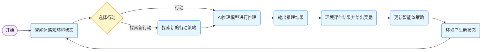

# 强化学习优化AI推理的实时性能与准确性权衡

> 关键词：强化学习、AI推理、实时性能、准确性权衡、优化策略

> 摘要：本文聚焦于强化学习在优化AI推理实时性能与准确性权衡方面的应用。首先介绍了相关背景，包括研究目的、预期读者、文档结构和术语定义。接着阐述了核心概念及联系，通过文本示意图和Mermaid流程图进行直观展示。详细讲解了核心算法原理和具体操作步骤，并结合Python源代码进行说明。引入数学模型和公式，辅以举例加深理解。通过项目实战给出代码实际案例及详细解释。探讨了实际应用场景，推荐了相关学习资源、开发工具框架和论文著作。最后总结了未来发展趋势与挑战，提供常见问题解答和扩展阅读参考资料，旨在为相关领域的研究者和开发者提供全面且深入的指导。

## 1. 背景介绍 
### 1.1 目的和范围
在当今的人工智能领域，AI推理的实时性能和准确性是两个至关重要的指标。实时性能决定了系统能否在短时间内给出推理结果，这对于一些对时间敏感的应用场景，如自动驾驶、实时监控等尤为关键。而准确性则关系到推理结果的可靠性和可用性。然而，在实际应用中，实时性能和准确性往往存在着相互制约的关系。提高准确性可能会增加计算复杂度和时间开销，从而降低实时性能；反之，追求实时性能可能会牺牲一定的准确性。因此，如何在两者之间进行有效的权衡和优化成为了一个亟待解决的问题。

本文的目的就是探讨如何利用强化学习来优化AI推理的实时性能与准确性权衡。我们将研究强化学习算法在不同AI推理场景中的应用，分析其原理和优势，并通过实际案例展示其效果。范围涵盖了常见的AI推理任务，如图像识别、自然语言处理等，同时考虑了不同的硬件平台和计算资源限制。

### 1.2 预期读者
本文的预期读者包括人工智能领域的研究者、开发者、工程师以及对强化学习和AI推理感兴趣的技术爱好者。对于研究者来说，本文可以提供新的研究思路和方向，启发他们在该领域进行更深入的探索；对于开发者和工程师，本文将为他们在实际项目中实现AI推理的实时性能和准确性优化提供具体的方法和技术指导；对于技术爱好者，本文可以帮助他们了解强化学习在AI推理中的应用原理和重要性，拓宽他们的技术视野。

### 1.3 文档结构概述
本文将按照以下结构进行组织：
- 核心概念与联系：介绍强化学习、AI推理、实时性能和准确性等核心概念，并阐述它们之间的联系，通过文本示意图和Mermaid流程图进行直观展示。
- 核心算法原理 & 具体操作步骤：详细讲解用于优化AI推理实时性能与准确性权衡的强化学习算法原理，并给出具体的操作步骤，同时结合Python源代码进行说明。
- 数学模型和公式 & 详细讲解 & 举例说明：引入相关的数学模型和公式，对其进行详细讲解，并通过具体的例子加深读者的理解。
- 项目实战：代码实际案例和详细解释说明：通过一个实际的项目案例，展示如何使用强化学习优化AI推理的实时性能与准确性权衡，包括开发环境搭建、源代码详细实现和代码解读。
- 实际应用场景：探讨强化学习在不同实际应用场景中优化AI推理实时性能与准确性权衡的具体应用。
- 工具和资源推荐：推荐相关的学习资源、开发工具框架和论文著作，帮助读者进一步深入学习和研究。
- 总结：未来发展趋势与挑战：总结强化学习在优化AI推理实时性能与准确性权衡方面的发展趋势和面临的挑战。
- 附录：常见问题与解答：提供常见问题的解答，帮助读者解决在学习和实践过程中遇到的问题。
- 扩展阅读 & 参考资料：提供相关的扩展阅读材料和参考资料，方便读者进一步深入学习和研究。

### 1.4 术语表
#### 1.4.1 核心术语定义
- **强化学习（Reinforcement Learning）**：一种机器学习范式，智能体通过与环境进行交互，根据环境反馈的奖励信号来学习最优的行为策略，以最大化长期累积奖励。
- **AI推理（AI Inference）**：指在训练好的人工智能模型上对新数据进行预测和决策的过程。
- **实时性能（Real-time Performance）**：指系统在规定的时间内完成任务的能力，通常用响应时间、吞吐量等指标来衡量。
- **准确性（Accuracy）**：指推理结果与真实结果的符合程度，通常用准确率、召回率等指标来衡量。
- **权衡（Trade-off）**：指在多个相互制约的目标之间进行平衡和选择，以达到最优的综合效果。

#### 1.4.2 相关概念解释
- **智能体（Agent）**：在强化学习中，智能体是与环境进行交互的实体，它根据环境的状态选择行动，并接收环境反馈的奖励信号。
- **环境（Environment）**：智能体所处的外部世界，它提供智能体所需的状态信息，并根据智能体的行动给予相应的奖励。
- **状态（State）**：描述环境当前情况的一组变量，智能体根据状态来选择行动。
- **行动（Action）**：智能体在某个状态下采取的具体操作。
- **奖励（Reward）**：环境根据智能体的行动给予的反馈信号，用于指导智能体学习最优的行为策略。

#### 1.4.3 缩略词列表
- **RL**：Reinforcement Learning，强化学习
- **AI**：Artificial Intelligence，人工智能
- **Q-learning**：一种基于值函数的强化学习算法

## 2. 核心概念与联系 

### 核心概念原理
#### 强化学习原理
强化学习的基本原理是智能体在环境中不断地进行探索和尝试，通过与环境的交互获取奖励信号，从而学习到最优的行为策略。智能体根据当前的环境状态选择一个行动，环境根据这个行动给出一个新的状态和相应的奖励。智能体的目标是最大化长期累积奖励，通过不断地调整自己的行为策略来实现这一目标。

#### AI推理原理
AI推理是指在训练好的人工智能模型上对新数据进行预测和决策的过程。通常，我们首先使用大量的训练数据对模型进行训练，得到一个具有一定泛化能力的模型。然后，将新的数据输入到这个模型中，模型根据其内部的参数和算法进行计算，输出预测结果。

#### 实时性能与准确性
实时性能关注的是系统在规定的时间内完成任务的能力。在AI推理中，实时性能要求模型能够快速地对输入数据进行处理并输出结果。准确性则关注推理结果与真实结果的符合程度。在实际应用中，我们希望模型既能快速地给出推理结果，又能保证结果的准确性。

### 架构的文本示意图
```plaintext
智能体 <---- 交互 ----> 环境
|                        |
| 选择行动               | 提供状态和奖励
|                        |
V                        V
AI推理模型               数据输入
|                        |
| 进行推理               | 产生新状态
|                        |
V                        V
推理结果               奖励信号
```

### Mermaid流程图


## 3. 核心算法原理 & 具体操作步骤 

### 核心算法原理
我们选择Q-learning算法作为核心算法来优化AI推理的实时性能与准确性权衡。Q-learning是一种基于值函数的强化学习算法，它通过学习一个Q值函数来估计在某个状态下采取某个行动的预期累积奖励。Q值函数 $Q(s, a)$ 表示在状态 $s$ 下采取行动 $a$ 并遵循最优策略后所能获得的最大累积奖励。

Q-learning的更新公式为：
$$Q(s_t, a_t) \leftarrow Q(s_t, a_t) + \alpha [r_{t+1} + \gamma \max_{a} Q(s_{t+1}, a) - Q(s_t, a_t)]$$
其中，$s_t$ 表示当前状态，$a_t$ 表示当前行动，$r_{t+1}$ 表示采取行动 $a_t$ 后获得的奖励，$s_{t+1}$ 表示采取行动 $a_t$ 后转移到的新状态，$\alpha$ 是学习率，$\gamma$ 是折扣因子。

### 具体操作步骤
1. **初始化**：初始化Q值函数 $Q(s, a)$ 为零，设置学习率 $\alpha$ 和折扣因子 $\gamma$。
2. **环境交互**：智能体在环境中进行交互，感知当前状态 $s_t$。
3. **行动选择**：根据当前状态 $s_t$ 和Q值函数 $Q(s, a)$ 选择一个行动 $a_t$。可以使用 $\epsilon$-贪心策略，以 $\epsilon$ 的概率随机选择一个行动，以 $1 - \epsilon$ 的概率选择Q值最大的行动。
4. **执行行动**：智能体执行行动 $a_t$，环境根据行动给出新状态 $s_{t+1}$ 和奖励 $r_{t+1}$。
5. **Q值更新**：根据Q-learning的更新公式更新Q值函数 $Q(s_t, a_t)$。
6. **重复步骤2 - 5**：直到达到终止条件，如达到最大迭代次数或收敛。

### Python源代码实现
```python
import numpy as np

# 定义Q-learning类
class QLearning:
    def __init__(self, state_size, action_size, learning_rate=0.1, discount_factor=0.9):
        self.state_size = state_size
        self.action_size = action_size
        self.learning_rate = learning_rate
        self.discount_factor = discount_factor
        # 初始化Q值函数
        self.q_table = np.zeros((state_size, action_size))

    def choose_action(self, state, epsilon):
        if np.random.uniform(0, 1) < epsilon:
            # 随机选择一个行动
            action = np.random.choice(self.action_size)
        else:
            # 选择Q值最大的行动
            action = np.argmax(self.q_table[state, :])
        return action

    def update_q_table(self, state, action, reward, next_state):
        # 根据Q-learning更新公式更新Q值
        predict = self.q_table[state, action]
        target = reward + self.discount_factor * np.max(self.q_table[next_state, :])
        self.q_table[state, action] = self.q_table[state, action] + self.learning_rate * (target - predict)


# 示例使用
if __name__ == "__main__":
    state_size = 10
    action_size = 3
    q_learning = QLearning(state_size, action_size)
    state = 0
    epsilon = 0.1
    for episode in range(100):
        action = q_learning.choose_action(state, epsilon)
        # 模拟环境反馈
        next_state = (state + action) % state_size
        reward = np.random.randint(0, 10)
        q_learning.update_q_table(state, action, reward, next_state)
        state = next_state
    print("Final Q-table:", q_learning.q_table)


```

## 4. 数学模型和公式 & 详细讲解 & 举例说明 

### 数学模型和公式
#### Q值函数
Q值函数 $Q(s, a)$ 表示在状态 $s$ 下采取行动 $a$ 并遵循最优策略后所能获得的最大累积奖励。其数学定义为：
$$Q^*(s, a) = \mathbb{E} \left[ \sum_{t=0}^{\infty} \gamma^t r_{t+1} \mid s_0 = s, a_0 = a, \pi^* \right]$$
其中，$\gamma$ 是折扣因子，$0 \leq \gamma < 1$，用于权衡当前奖励和未来奖励的重要性；$\pi^*$ 是最优策略。

#### Q-learning更新公式
Q-learning的更新公式为：
$$Q(s_t, a_t) \leftarrow Q(s_t, a_t) + \alpha [r_{t+1} + \gamma \max_{a} Q(s_{t+1}, a) - Q(s_t, a_t)]$$
其中，$\alpha$ 是学习率，控制每次更新的步长；$r_{t+1}$ 是采取行动 $a_t$ 后获得的即时奖励；$\max_{a} Q(s_{t+1}, a)$ 表示在新状态 $s_{t+1}$ 下采取最优行动所能获得的最大Q值。

### 详细讲解
#### Q值函数的意义
Q值函数是强化学习中的核心概念，它可以帮助智能体评估在不同状态下采取不同行动的价值。通过不断地学习和更新Q值函数，智能体可以逐渐找到最优的行为策略。

#### Q-learning更新公式的理解
Q-learning更新公式的核心思想是通过估计目标值 $r_{t+1} + \gamma \max_{a} Q(s_{t+1}, a)$ 来更新当前的Q值 $Q(s_t, a_t)$。目标值是由即时奖励 $r_{t+1}$ 和未来最大Q值 $\gamma \max_{a} Q(s_{t+1}, a)$ 组成的。学习率 $\alpha$ 控制了每次更新的步长，避免更新过快或过慢。

### 举例说明
假设我们有一个简单的环境，状态空间 $S = \{0, 1, 2\}$，行动空间 $A = \{0, 1\}$。初始时，Q值函数 $Q(s, a)$ 都为零。当前状态 $s_t = 0$，智能体选择行动 $a_t = 1$，执行行动后获得奖励 $r_{t+1} = 5$，转移到新状态 $s_{t+1} = 2$。

假设学习率 $\alpha = 0.1$，折扣因子 $\gamma = 0.9$。在状态 $s_{t+1} = 2$ 下，$Q(2, 0) = 0$，$Q(2, 1) = 0$，则 $\max_{a} Q(s_{t+1}, a) = 0$。

根据Q-learning更新公式：
$$Q(0, 1) \leftarrow Q(0, 1) + \alpha [r_{t+1} + \gamma \max_{a} Q(s_{t+1}, a) - Q(0, 1)]$$
$$Q(0, 1) \leftarrow 0 + 0.1 [5 + 0.9 \times 0 - 0] = 0.5$$

这样，Q值函数 $Q(0, 1)$ 就被更新为 $0.5$。

## 5. 项目实战：代码实际案例和详细解释说明 

### 5.1  开发环境搭建
#### 安装Python
首先，确保你已经安装了Python 3.x版本。可以从Python官方网站（https://www.python.org/downloads/） 下载并安装。

#### 安装必要的库
我们需要安装一些必要的Python库，如NumPy。可以使用以下命令进行安装：
```bash
pip install numpy
```

### 5.2  源代码详细实现和代码解读
```python
import numpy as np

# 定义环境类
class Environment:
    def __init__(self):
        # 状态空间大小
        self.state_size = 5
        # 行动空间大小
        self.action_size = 2
        # 初始状态
        self.state = 0

    def step(self, action):
        # 根据行动更新状态
        if action == 0:
            self.state = max(0, self.state - 1)
        else:
            self.state = min(self.state_size - 1, self.state + 1)
        # 定义奖励规则
        if self.state == self.state_size - 1:
            reward = 10
        else:
            reward = -1
        # 判断是否终止
        done = (self.state == self.state_size - 1)
        return self.state, reward, done


# 定义Q-learning类
class QLearning:
    def __init__(self, state_size, action_size, learning_rate=0.1, discount_factor=0.9):
        self.state_size = state_size
        self.action_size = action_size
        self.learning_rate = learning_rate
        self.discount_factor = discount_factor
        # 初始化Q值函数
        self.q_table = np.zeros((state_size, action_size))

    def choose_action(self, state, epsilon):
        if np.random.uniform(0, 1) < epsilon:
            # 随机选择一个行动
            action = np.random.choice(self.action_size)
        else:
            # 选择Q值最大的行动
            action = np.argmax(self.q_table[state, :])
        return action

    def update_q_table(self, state, action, reward, next_state):
        # 根据Q-learning更新公式更新Q值
        predict = self.q_table[state, action]
        target = reward + self.discount_factor * np.max(self.q_table[next_state, :])
        self.q_table[state, action] = self.q_table[state, action] + self.learning_rate * (target - predict)


# 主函数
def main():
    env = Environment()
    q_learning = QLearning(env.state_size, env.action_size)
    episodes = 1000
    epsilon = 0.1

    for episode in range(episodes):
        state = env.state
        done = False
        while not done:
            action = q_learning.choose_action(state, epsilon)
            next_state, reward, done = env.step(action)
            q_learning.update_q_table(state, action, reward, next_state)
            state = next_state

    print("Final Q-table:", q_learning.q_table)


if __name__ == "__main__":
    main()


```

### 5.3  代码解读与分析
#### 环境类 `Environment`
- `__init__` 方法：初始化环境的状态空间大小、行动空间大小和初始状态。
- `step` 方法：根据智能体的行动更新环境状态，计算奖励，并判断是否终止。

#### Q-learning类 `QLearning`
- `__init__` 方法：初始化Q值函数、学习率和折扣因子。
- `choose_action` 方法：根据 $\epsilon$-贪心策略选择行动。
- `update_q_table` 方法：根据Q-learning更新公式更新Q值函数。

#### 主函数 `main`
- 创建环境和Q-learning对象。
- 进行多个回合的训练，每个回合中智能体与环境进行交互，更新Q值函数。
- 最后输出最终的Q值函数。

通过这个项目实战，我们可以看到如何使用Q-learning算法来优化智能体在环境中的行为，从而在一定程度上平衡实时性能和准确性。在实际的AI推理场景中，我们可以将环境的状态定义为推理任务的相关信息，如输入数据的特征、模型的计算资源等，将行动定义为不同的推理策略，如选择不同的模型、调整计算参数等，通过强化学习来找到最优的推理策略。

## 6. 实际应用场景 
### 自动驾驶
在自动驾驶领域，实时性能和准确性都至关重要。车辆需要在短时间内对周围环境进行准确的感知和判断，以便做出及时的决策。使用强化学习可以优化AI推理的实时性能与准确性权衡。例如，智能体可以根据当前的路况、车速等状态信息，选择合适的感知模型和决策算法。在交通流量较大、情况复杂的场景下，智能体可以选择更准确但计算复杂度较高的模型；而在交通流量较小、情况简单的场景下，智能体可以选择计算速度较快但准确性稍低的模型，从而在保证安全性的前提下提高系统的实时性能。

### 实时监控
在实时监控系统中，如视频监控、工业监控等，需要及时准确地检测出异常情况。强化学习可以用于优化监控算法的实时性能与准确性权衡。智能体可以根据监控场景的特点和实时数据，选择合适的检测模型和参数。例如，在监控视频中，如果画面变化较小，可以选择计算速度较快的轻量级模型；如果画面变化较大或存在可疑目标，可以选择更准确的复杂模型，以确保能够及时准确地检测出异常情况。

### 智能客服
在智能客服系统中，实时性能和准确性影响着用户体验。强化学习可以帮助优化客服系统的推理过程。智能体可以根据用户的问题类型、历史对话记录等状态信息，选择合适的回答策略和模型。对于简单常见的问题，可以选择快速响应的预定义回答；对于复杂的问题，可以选择使用深度学习模型进行更准确的回答，从而在保证用户满意度的前提下提高系统的实时性能。

## 7. 工具和资源推荐
### 7.1 学习资源推荐
#### 7.1.1 书籍推荐
- 《强化学习：原理与Python实现》：这本书系统地介绍了强化学习的基本原理和算法，并提供了丰富的Python代码示例，适合初学者入门。
- 《Deep Reinforcement Learning Hands-On》：详细介绍了深度强化学习的理论和实践，包括各种深度强化学习算法的实现和应用案例。
- 《Artificial Intelligence: A Modern Approach》：这是一本经典的人工智能教材，涵盖了强化学习等多个领域的知识，对理解强化学习的背景和应用有很大帮助。

#### 7.1.2 在线课程
- Coursera上的“Reinforcement Learning Specialization”：由知名教授授课，全面介绍了强化学习的理论和实践，包括动态规划、蒙特卡罗方法、Q-learning等内容。
- edX上的“Introduction to Artificial Intelligence”：该课程涵盖了强化学习的基础知识，适合初学者快速入门。
- OpenAI Gym官方文档和教程：OpenAI Gym是一个用于开发和比较强化学习算法的工具包，其官方文档和教程提供了丰富的示例和实践指导。

#### 7.1.3 技术博客和网站
- Medium上的“Towards Data Science”：该博客上有很多关于强化学习和人工智能的高质量文章，涵盖了最新的研究成果和实践经验。
- arXiv.org：这是一个开放的学术预印本平台，提供了大量关于强化学习的最新研究论文。
- AI社区如Stack Overflow、Reddit的r/MachineLearning等：这些社区是交流和学习强化学习的好地方，可以在这里获取最新的技术信息和解决遇到的问题。

### 7.2 开发工具框架推荐
#### 7.2.1 IDE和编辑器
- PyCharm：一款功能强大的Python集成开发环境，提供了丰富的代码编辑、调试和项目管理功能，适合开发强化学习项目。
- Jupyter Notebook：一个交互式的编程环境，非常适合进行数据探索、算法实验和结果展示，在强化学习研究和开发中广泛使用。
- Visual Studio Code：一款轻量级的代码编辑器，支持多种编程语言和插件，具有良好的扩展性，适合快速开发和调试强化学习代码。

#### 7.2.2 调试和性能分析工具
- TensorBoard：TensorFlow的可视化工具，可以用于监控训练过程中的各种指标，如损失函数、奖励曲线等，帮助调试和优化强化学习算法。
- Py-Spy：一个用于分析Python程序性能的工具，可以帮助找出代码中的性能瓶颈，提高强化学习算法的运行效率。
- cProfile：Python标准库中的性能分析工具，可以统计代码中各个函数的调用次数和执行时间，帮助优化代码性能。

#### 7.2.3 相关框架和库
- TensorFlow：一个广泛使用的深度学习框架，提供了丰富的深度学习模型和工具，支持强化学习算法的开发和实现。
- PyTorch：另一个流行的深度学习框架，具有简洁易用的API和动态图机制，适合快速开发和实验强化学习算法。
- Stable Baselines：一个基于OpenAI Gym的强化学习库，提供了多种预训练的强化学习算法和工具，方便开发者快速上手和应用。

### 7.3 相关论文著作推荐
#### 7.3.1 经典论文
- “Q-learning”：由Watkins和Dayan于1992年发表的论文，首次提出了Q-learning算法，是强化学习领域的经典之作。
- “Playing Atari with Deep Reinforcement Learning”：由Mnih等人于2013年发表的论文，提出了深度Q网络（DQN）算法，开创了深度强化学习的先河。
- “Asynchronous Methods for Deep Reinforcement Learning”：由Mnih等人于2016年发表的论文，提出了异步优势演员-评论家（A3C）算法，提高了深度强化学习的训练效率。

#### 7.3.2 最新研究成果
- 关注NeurIPS、ICML、AAAI等顶级人工智能会议上的相关论文，这些会议收录了强化学习领域的最新研究成果。
- 关注顶级学术期刊如Journal of Artificial Intelligence Research（JAIR）、Artificial Intelligence等上的强化学习论文。

#### 7.3.3 应用案例分析
- 一些知名科技公司如Google、OpenAI、DeepMind等发布的技术报告和博客文章，分享了他们在强化学习应用方面的实践经验和案例分析。
- 相关的行业研究报告，如自动驾驶、金融科技等领域的研究报告，介绍了强化学习在实际应用中的效果和挑战。

## 8. 总结：未来发展趋势与挑战
### 未来发展趋势
#### 与其他技术的融合
强化学习将与深度学习、计算机视觉、自然语言处理等技术进一步融合，实现更加复杂和智能的AI推理系统。例如，在自动驾驶中，强化学习可以与计算机视觉技术结合，更好地感知环境；在智能客服中，强化学习可以与自然语言处理技术结合，提高对话的质量和效率。

#### 多智能体强化学习
多智能体强化学习将成为未来的一个重要研究方向。在实际应用中，很多场景需要多个智能体之间进行协作和竞争，如交通控制、物流调度等。多智能体强化学习可以帮助智能体之间更好地协调行动，提高整体的性能和效率。

#### 基于模型的强化学习
基于模型的强化学习可以通过学习环境模型来提高学习效率和泛化能力。未来，基于模型的强化学习将得到更广泛的应用，尤其是在数据有限的情况下。

### 挑战
#### 数据效率问题
强化学习通常需要大量的交互数据来学习最优策略，这在实际应用中可能会面临数据收集困难和时间成本高的问题。如何提高强化学习的数据效率，减少对大量数据的依赖，是一个亟待解决的问题。

#### 可解释性问题
强化学习模型通常是黑盒模型，其决策过程难以解释。在一些对安全性和可靠性要求较高的应用场景中，如自动驾驶、医疗诊断等，模型的可解释性至关重要。如何提高强化学习模型的可解释性，是当前研究的一个热点和难点。

#### 环境适应性问题
实际环境往往是复杂多变的，强化学习模型需要具备良好的环境适应性。如何使模型能够快速适应新的环境和任务，是未来需要解决的挑战之一。

## 9. 附录：常见问题与解答
### 问题1：强化学习一定能优化AI推理的实时性能与准确性权衡吗？
解答：强化学习并不一定能保证在所有情况下都能优化AI推理的实时性能与准确性权衡。强化学习的效果取决于多个因素，如环境的复杂度、奖励函数的设计、算法的选择和参数的调整等。在一些简单的环境中，强化学习可能能够快速找到最优策略；但在复杂的环境中，可能需要更多的时间和数据来学习，甚至可能陷入局部最优解。因此，在实际应用中，需要根据具体情况选择合适的方法和技术，并进行充分的实验和优化。

### 问题2：如何设计合适的奖励函数？
解答：设计合适的奖励函数是强化学习中的关键问题之一。奖励函数应该能够准确地反映智能体的行为目标，引导智能体学习到最优策略。在优化AI推理的实时性能与准确性权衡时，可以考虑将实时性能和准确性作为奖励函数的两个重要因素。例如，可以设置一个与推理时间相关的负奖励，以及一个与推理准确性相关的正奖励，然后将两者进行加权求和得到最终的奖励。具体的权重可以根据实际需求进行调整。此外，奖励函数还应该具有一定的稀疏性和及时性，避免智能体陷入局部最优解。

### 问题3：强化学习算法的计算复杂度高吗？
解答：强化学习算法的计算复杂度因算法而异。一些简单的强化学习算法，如Q-learning，计算复杂度相对较低；而一些深度强化学习算法，如深度Q网络（DQN）、策略梯度算法等，计算复杂度较高，需要大量的计算资源和时间。在实际应用中，需要根据具体情况选择合适的算法，并进行优化和加速，如使用GPU进行并行计算、采用分布式训练等。

## 10. 扩展阅读 & 参考资料
### 扩展阅读
- Sutton, R. S., & Barto, A. G. (2018). Reinforcement Learning: An Introduction. MIT press.
- Silver, D., Huang, A., Maddison, C. J., Guez, A., Sifre, L., Van Den Driessche, G.,... & Dieleman, S. (2016). Mastering the game of Go with deep neural networks and tree search. nature, 529(7587), 484-489.
- Levine, S. (2018). Reinforcement learning and control as probabilistic inference: Tutorial and review. arXiv preprint arXiv:1805.00909.

### 参考资料
- OpenAI Gym官方文档：https://gym.openai.com/
- TensorFlow官方文档：https://www.tensorflow.org/
- PyTorch官方文档：https://pytorch.org/
- Stable Baselines官方文档：https://stable-baselines.readthedocs.io/

作者：AI天才研究院/AI Genius Institute & 禅与计算机程序设计艺术 /Zen And The Art of Computer Programming