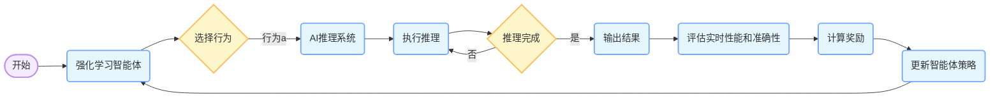

# 强化学习优化AI推理的实时性能与准确性权衡策略设计

> 关键词：强化学习、AI推理、实时性能、准确性权衡、策略设计

> 摘要：本文聚焦于利用强化学习优化AI推理的实时性能与准确性权衡策略设计。首先介绍了相关背景，包括目的范围、预期读者等内容。接着阐述了核心概念及其联系，通过文本示意图和Mermaid流程图进行直观展示。详细讲解了核心算法原理，使用Python代码进行说明，并给出数学模型和公式。通过项目实战，展示代码实际案例及解读。分析了实际应用场景，推荐了学习资源、开发工具框架和相关论文著作。最后总结未来发展趋势与挑战，提供常见问题解答和扩展阅读参考资料，旨在为相关领域的研究者和开发者提供全面且深入的技术指导。

## 1. 背景介绍 
### 1.1 目的和范围
在当今的人工智能应用中，AI推理的实时性能和准确性是两个至关重要的指标。实时性能关乎系统能否在短时间内给出推理结果，以满足诸如自动驾驶、实时监控等场景的需求；而准确性则决定了推理结果的可靠性。然而，这两个指标往往存在权衡关系，提高实时性能可能会牺牲一定的准确性，反之亦然。本研究的目的在于设计一种基于强化学习的策略，能够在AI推理过程中动态地平衡实时性能与准确性，以适应不同的应用场景和需求。

本研究的范围涵盖了强化学习的基本原理、AI推理的流程和特点、实时性能与准确性的评估方法，以及如何运用强化学习算法来设计权衡策略。同时，通过实际的项目案例验证策略的有效性，并探讨其在不同应用场景中的适用性。

### 1.2 预期读者
本文的预期读者包括人工智能领域的研究者、开发者、数据科学家，以及对强化学习和AI推理性能优化感兴趣的专业人士。对于正在从事相关项目开发的工程师，本文可以提供具体的技术实现思路和方法；对于研究人员，本文可以为其进一步的研究提供理论基础和实验参考。

### 1.3 文档结构概述
本文将按照以下结构进行组织：
1. **背景介绍**：阐述研究的目的和范围、预期读者、文档结构概述以及相关术语表。
2. **核心概念与联系**：介绍强化学习、AI推理、实时性能和准确性等核心概念，并通过文本示意图和Mermaid流程图展示它们之间的联系。
3. **核心算法原理 & 具体操作步骤**：详细讲解强化学习算法在优化AI推理性能中的应用原理，并给出具体的操作步骤和Python代码实现。
4. **数学模型和公式 & 详细讲解 & 举例说明**：建立数学模型来描述实时性能与准确性的权衡问题，并通过公式进行详细讲解，同时给出具体的举例说明。
5. **项目实战：代码实际案例和详细解释说明**：通过一个实际的项目案例，展示如何运用强化学习策略优化AI推理的实时性能与准确性，并对代码进行详细解释。
6. **实际应用场景**：分析强化学习优化AI推理性能策略在不同实际应用场景中的应用情况。
7. **工具和资源推荐**：推荐相关的学习资源、开发工具框架和论文著作，帮助读者进一步深入学习和研究。
8. **总结：未来发展趋势与挑战**：总结本文的研究成果，分析未来的发展趋势，并指出可能面临的挑战。
9. **附录：常见问题与解答**：解答读者在阅读和实践过程中可能遇到的常见问题。
10. **扩展阅读 & 参考资料**：提供相关的扩展阅读材料和参考资料，方便读者进一步拓展知识面。

### 1.4 术语表
#### 1.4.1 核心术语定义
- **强化学习（Reinforcement Learning）**：一种机器学习范式，智能体通过与环境进行交互，根据环境反馈的奖励信号来学习最优的行为策略，以最大化长期累积奖励。
- **AI推理（AI Inference）**：指在训练好的人工智能模型基础上，输入新的数据，模型对数据进行处理并输出预测结果的过程。
- **实时性能（Real-time Performance）**：指系统在规定的时间内完成任务的能力，在AI推理中通常用推理时间来衡量。
- **准确性（Accuracy）**：指模型预测结果与真实结果的符合程度，常用准确率、召回率等指标来衡量。
- **权衡策略（Trade-off Strategy）**：指在实时性能和准确性之间进行平衡和选择的策略，以满足不同应用场景的需求。

#### 1.4.2 相关概念解释
- **智能体（Agent）**：在强化学习中，智能体是与环境进行交互的主体，它根据环境的状态选择合适的行为，并根据环境反馈的奖励来调整自己的行为策略。
- **环境（Environment）**：智能体所处的外部世界，它为智能体提供状态信息，并根据智能体的行为给予相应的奖励。
- **状态（State）**：描述环境当前情况的信息，智能体根据状态来选择行为。
- **行为（Action）**：智能体在某个状态下采取的操作，不同的行为会导致环境状态的改变。
- **奖励（Reward）**：环境根据智能体的行为给予的反馈信号，用于指导智能体学习最优的行为策略。

#### 1.4.3 缩略词列表
- **RL**：Reinforcement Learning（强化学习）
- **AI**：Artificial Intelligence（人工智能）
- **Q-learning**：一种基于值函数的强化学习算法

## 2. 核心概念与联系 

### 核心概念原理
#### 强化学习原理
强化学习的核心思想是智能体通过与环境进行交互，不断尝试不同的行为，根据环境反馈的奖励信号来学习最优的行为策略。智能体在每个时间步观察环境的状态 $s_t$，并根据当前的策略 $\pi$ 选择一个行为 $a_t$。环境根据智能体的行为转移到下一个状态 $s_{t+1}$，并给予智能体一个奖励 $r_t$。智能体的目标是最大化长期累积奖励 $R = \sum_{t=0}^{T} \gamma^t r_t$，其中 $\gamma$ 是折扣因子，用于权衡近期奖励和远期奖励。

#### AI推理原理
AI推理是在训练好的模型基础上，输入新的数据，模型对数据进行处理并输出预测结果的过程。推理过程通常包括数据预处理、特征提取、模型计算和结果后处理等步骤。不同的模型和应用场景对推理的实时性能和准确性有不同的要求。

#### 实时性能与准确性
实时性能主要关注推理过程的时间开销，要求在尽可能短的时间内完成推理任务。准确性则关注推理结果与真实结果的符合程度，要求推理结果尽可能准确。在实际应用中，这两个指标往往相互制约，需要进行权衡。

### 架构的文本示意图
```plaintext
+-------------------+       +-------------------+
|     强化学习      |       |      AI推理       |
|                   |       |                   |
|  智能体 - 策略    | ----> |  输入数据 - 模型  |
|  环境 - 状态      | <---- |  输出结果 - 反馈  |
|  奖励 - 学习      |       |                   |
+-------------------+       +-------------------+
|      实时性能     |       |      准确性      |
|                   |       |                   |
|  推理时间衡量     |       |  准确率等指标    |
+-------------------+       +-------------------+
```

### Mermaid流程图


## 3. 核心算法原理 & 具体操作步骤 

### 核心算法原理
在本研究中，我们采用Q-learning算法作为强化学习的核心算法。Q-learning是一种基于值函数的强化学习算法，它通过学习一个Q值函数 $Q(s,a)$ 来表示在状态 $s$ 下采取行为 $a$ 的期望累积奖励。智能体根据Q值函数选择最优的行为，以最大化长期累积奖励。

Q值函数的更新公式为：
$$Q(s_t,a_t) \leftarrow Q(s_t,a_t) + \alpha [r_t + \gamma \max_{a} Q(s_{t+1},a) - Q(s_t,a_t)]$$
其中，$\alpha$ 是学习率，控制每次更新的步长；$\gamma$ 是折扣因子，权衡近期奖励和远期奖励；$r_t$ 是在状态 $s_t$ 下采取行为 $a_t$ 获得的即时奖励；$\max_{a} Q(s_{t+1},a)$ 是在下一个状态 $s_{t+1}$ 下所有可能行为的最大Q值。

### 具体操作步骤
1. **初始化**：初始化Q值函数 $Q(s,a)$ 为0，设置学习率 $\alpha$、折扣因子 $\gamma$ 和探索率 $\epsilon$。
2. **环境交互**：智能体观察当前环境状态 $s_t$，根据 $\epsilon$-贪心策略选择行为 $a_t$。$\epsilon$-贪心策略以 $\epsilon$ 的概率随机选择一个行为，以 $1 - \epsilon$ 的概率选择Q值最大的行为。
3. **执行行为**：智能体执行选择的行为 $a_t$，环境转移到下一个状态 $s_{t+1}$，并给予智能体一个奖励 $r_t$。
4. **更新Q值**：根据Q值更新公式更新 $Q(s_t,a_t)$。
5. **重复步骤2-4**：直到达到终止条件，如达到最大时间步数或任务完成。

### Python源代码实现
```python
import numpy as np

class QLearningAgent:
    def __init__(self, state_space_size, action_space_size, learning_rate=0.1, discount_factor=0.9, exploration_rate=0.1):
        self.state_space_size = state_space_size
        self.action_space_size = action_space_size
        self.learning_rate = learning_rate
        self.discount_factor = discount_factor
        self.exploration_rate = exploration_rate
        self.q_table = np.zeros((state_space_size, action_space_size))

    def choose_action(self, state):
        if np.random.uniform(0, 1) < self.exploration_rate:
            # 随机选择一个行为
            action = np.random.choice(self.action_space_size)
        else:
            # 选择Q值最大的行为
            action = np.argmax(self.q_table[state, :])
        return action

    def update_q_table(self, state, action, reward, next_state):
        # Q值更新公式
        max_q_next = np.max(self.q_table[next_state, :])
        self.q_table[state, action] += self.learning_rate * (reward + self.discount_factor * max_q_next - self.q_table[state, action])

# 示例使用
state_space_size = 10
action_space_size = 5
agent = QLearningAgent(state_space_size, action_space_size)

# 模拟环境交互
current_state = 0
for _ in range(100):
    action = agent.choose_action(current_state)
    # 模拟奖励和下一个状态
    reward = np.random.randint(0, 10)
    next_state = np.random.randint(0, state_space_size)
    agent.update_q_table(current_state, action, reward, next_state)
    current_state = next_state
```

## 4. 数学模型和公式 & 详细讲解 & 举例说明 

### 数学模型
为了描述AI推理的实时性能与准确性的权衡问题，我们建立如下数学模型。设 $x$ 表示推理过程中的一个决策变量，如模型的复杂度、推理的精度等。设 $T(x)$ 表示推理时间，反映实时性能；$A(x)$ 表示推理的准确性。我们的目标是在一定的约束条件下，找到一个最优的决策变量 $x^*$，使得实时性能和准确性达到一个合理的平衡。

可以定义一个目标函数 $J(x)$ 来综合考虑实时性能和准确性：
$$J(x) = w_1 \cdot f_1(T(x)) + w_2 \cdot f_2(A(x))$$
其中，$w_1$ 和 $w_2$ 是权重系数，满足 $w_1 + w_2 = 1$，用于权衡实时性能和准确性的重要性；$f_1(T(x))$ 和 $f_2(A(x))$ 是分别对推理时间和准确性进行映射的函数，通常可以选择线性函数、对数函数等。

### 公式详细讲解
- **推理时间函数 $T(x)$**：推理时间通常与模型的复杂度、数据量等因素有关。例如，对于一个简单的线性回归模型，推理时间可能与输入数据的维度成正比；对于一个深度学习模型，推理时间可能与模型的层数、神经元数量等因素有关。可以用一个经验公式来表示推理时间：
$$T(x) = a \cdot x + b$$
其中，$a$ 和 $b$ 是常数，根据具体的模型和硬件环境进行调整。

- **准确性函数 $A(x)$**：准确性通常与模型的复杂度、训练数据的质量等因素有关。一般来说，模型越复杂，准确性可能越高，但推理时间也会相应增加。可以用一个非线性函数来表示准确性：
$$A(x) = \frac{1}{1 + e^{-c(x - d)}}$$
其中，$c$ 和 $d$ 是常数，用于控制函数的形状和位置。

- **目标函数 $J(x)$**：目标函数 $J(x)$ 综合考虑了实时性能和准确性，通过调整权重系数 $w_1$ 和 $w_2$，可以根据不同的应用场景和需求来平衡两者的重要性。例如，在实时性要求较高的场景中，可以增大 $w_1$ 的值；在准确性要求较高的场景中，可以增大 $w_2$ 的值。

### 举例说明
假设我们有一个简单的AI推理任务，决策变量 $x$ 表示模型的复杂度。推理时间函数为 $T(x) = 2x + 5$，准确性函数为 $A(x) = \frac{1}{1 + e^{-(x - 3)}}$。设权重系数 $w_1 = 0.3$，$w_2 = 0.7$。

则目标函数为：
$$J(x) = 0.3 \cdot (2x + 5) + 0.7 \cdot \frac{1}{1 + e^{-(x - 3)}}$$

我们的目标是找到一个最优的 $x^*$，使得 $J(x)$ 最大。可以通过求导的方法来找到目标函数的极值点：
$$J'(x) = 0.3 \cdot 2 + 0.7 \cdot \frac{e^{-(x - 3)}}{(1 + e^{-(x - 3)})^2} = 0$$

通过数值计算的方法求解上述方程，得到最优的 $x^*$ 值，从而实现实时性能和准确性的权衡。

## 5. 项目实战：代码实际案例和详细解释说明 

### 5.1  开发环境搭建
本项目使用Python语言进行开发，需要安装以下必要的库：
- **NumPy**：用于数值计算和数组操作。
- **TensorFlow**：用于构建和训练AI模型。
- **Matplotlib**：用于可视化结果。

可以使用以下命令安装这些库：
```sh
pip install numpy tensorflow matplotlib
```

### 5.2  源代码详细实现和代码解读
```python
import numpy as np
import tensorflow as tf
import matplotlib.pyplot as plt

# 定义AI推理模型
def build_model():
    model = tf.keras.Sequential([
        tf.keras.layers.Dense(64, activation='relu', input_shape=(10,)),
        tf.keras.layers.Dense(1)
    ])
    model.compile(optimizer='adam', loss='mse')
    return model

# 模拟推理时间和准确性
def simulate_performance(model, input_data, complexity):
    # 模拟推理时间与复杂度成正比
    inference_time = 2 * complexity + 5
    # 模拟准确性与复杂度的关系
    accuracy = 1 / (1 + np.exp(-(complexity - 3)))
    return inference_time, accuracy

# 定义强化学习智能体
class QLearningAgent:
    def __init__(self, state_space_size, action_space_size, learning_rate=0.1, discount_factor=0.9, exploration_rate=0.1):
        self.state_space_size = state_space_size
        self.action_space_size = action_space_size
        self.learning_rate = learning_rate
        self.discount_factor = discount_factor
        self.exploration_rate = exploration_rate
        self.q_table = np.zeros((state_space_size, action_space_size))

    def choose_action(self, state):
        if np.random.uniform(0, 1) < self.exploration_rate:
            # 随机选择一个行为
            action = np.random.choice(self.action_space_size)
        else:
            # 选择Q值最大的行为
            action = np.argmax(self.q_table[state, :])
        return action

    def update_q_table(self, state, action, reward, next_state):
        # Q值更新公式
        max_q_next = np.max(self.q_table[next_state, :])
        self.q_table[state, action] += self.learning_rate * (reward + self.discount_factor * max_q_next - self.q_table[state, action])

# 训练过程
def train_agent(num_episodes=100):
    state_space_size = 10
    action_space_size = 5
    agent = QLearningAgent(state_space_size, action_space_size)
    model = build_model()
    input_data = np.random.randn(100, 10)

    rewards = []
    for episode in range(num_episodes):
        state = np.random.randint(0, state_space_size)
        total_reward = 0
        for _ in range(20):
            action = agent.choose_action(state)
            complexity = action + 1
            inference_time, accuracy = simulate_performance(model, input_data, complexity)
            # 定义奖励函数，综合考虑实时性能和准确性
            reward = 0.3 * (1 / inference_time) + 0.7 * accuracy
            next_state = np.random.randint(0, state_space_size)
            agent.update_q_table(state, action, reward, next_state)
            state = next_state
            total_reward += reward
        rewards.append(total_reward)
        if episode % 10 == 0:
            print(f"Episode {episode}: Total Reward = {total_reward}")

    # 可视化奖励曲线
    plt.plot(rewards)
    plt.xlabel('Episode')
    plt.ylabel('Total Reward')
    plt.show()

    return agent

# 运行训练过程
agent = train_agent()
```

### 5.3  代码解读与分析
- **模型构建**：`build_model` 函数使用TensorFlow构建了一个简单的全连接神经网络模型，用于模拟AI推理任务。
- **性能模拟**：`simulate_performance` 函数模拟了推理时间和准确性与模型复杂度的关系，推理时间与复杂度成正比，准确性与复杂度的关系使用Sigmoid函数进行模拟。
- **强化学习智能体**：`QLearningAgent` 类实现了Q-learning算法，包括行为选择和Q值更新的方法。
- **训练过程**：`train_agent` 函数实现了强化学习的训练过程，智能体与环境进行交互，根据奖励信号更新Q值函数。奖励函数综合考虑了实时性能和准确性，通过调整权重系数来权衡两者的重要性。
- **可视化结果**：使用Matplotlib绘制奖励曲线，展示智能体在训练过程中的学习效果。

## 6. 实际应用场景 
### 自动驾驶
在自动驾驶场景中，AI推理需要实时处理大量的传感器数据，如摄像头图像、雷达数据等，以做出决策，如车辆的加速、刹车、转向等。实时性能至关重要，因为决策必须在短时间内做出，以确保行车安全。然而，准确性也不能忽视，错误的决策可能导致严重的后果。强化学习优化的权衡策略可以根据不同的驾驶场景和路况，动态地调整推理模型的复杂度和精度，以平衡实时性能和准确性。例如，在高速公路上，实时性能要求较高，可以适当降低模型的复杂度；在复杂的城市道路中，准确性要求较高，可以增加模型的复杂度。

### 实时监控
在实时监控场景中，如视频监控、工业生产监控等，AI推理需要实时分析监控数据，及时发现异常情况。实时性能确保能够及时响应异常事件，而准确性则保证能够准确地识别异常。强化学习策略可以根据监控场景的特点和需求，动态地调整推理的精度和速度。例如，在监控视频中，可以根据场景的复杂度和目标的重要性，选择不同的检测模型和参数，以实现实时性能和准确性的最佳平衡。

### 智能客服
在智能客服场景中，AI推理用于理解用户的问题并提供准确的回答。实时性能影响用户体验，用户希望能够快速得到响应；准确性则决定了回答的质量。强化学习可以根据用户的历史问题和反馈，动态地调整推理模型的复杂度和精度，以提高实时性能和准确性。例如，对于常见问题，可以使用简单的模型快速给出答案；对于复杂问题，可以使用更复杂的模型进行深入分析。

## 7. 工具和资源推荐
### 7.1 学习资源推荐
#### 7.1.1 书籍推荐
- 《强化学习：原理与Python实现》：本书系统地介绍了强化学习的基本原理和算法，并通过Python代码进行实现，适合初学者入门。
- 《深度学习》：由深度学习领域的三位权威专家Ian Goodfellow、Yoshua Bengio和Aaron Courville合著，全面介绍了深度学习的理论和实践。
- 《人工智能：一种现代的方法》：涵盖了人工智能的各个方面，包括搜索、推理、学习、规划等，是人工智能领域的经典教材。

#### 7.1.2 在线课程
- Coursera上的“强化学习专项课程”：由DeepMind的研究人员授课，深入介绍了强化学习的理论和应用。
- edX上的“深度学习微硕士项目”：提供了深度学习的系统学习课程，包括神经网络、卷积神经网络、循环神经网络等。
- 哔哩哔哩上的“李宏毅机器学习课程”：课程内容生动有趣，易于理解，适合初学者学习机器学习和深度学习。

#### 7.1.3 技术博客和网站
- OpenAI Blog：OpenAI发布的最新研究成果和技术文章，涵盖了人工智能的各个领域。
- Medium上的Towards Data Science：提供了大量关于数据科学、机器学习和人工智能的技术文章和教程。
- 机器之心：专注于人工智能领域的科技媒体，报道最新的技术动态和研究成果。

### 7.2 开发工具框架推荐
#### 7.2.1 IDE和编辑器
- PyCharm：一款专业的Python集成开发环境，提供了丰富的代码编辑、调试和分析功能。
- Jupyter Notebook：一个交互式的开发环境，适合进行数据分析和模型实验，支持Python、R等多种编程语言。
- Visual Studio Code：一款轻量级的代码编辑器，支持多种编程语言和插件扩展，具有良好的开发体验。

#### 7.2.2 调试和性能分析工具
- TensorBoard：TensorFlow提供的可视化工具，可以用于监控模型的训练过程、分析模型的性能等。
- Py-Spy：一个用于Python代码性能分析的工具，可以实时监控代码的运行时间和内存使用情况。
- cProfile：Python标准库中的性能分析模块，可以用于分析代码的性能瓶颈。

#### 7.2.3 相关框架和库
- TensorFlow：一个开源的深度学习框架，提供了丰富的工具和接口，用于构建和训练各种深度学习模型。
- PyTorch：另一个流行的深度学习框架，具有动态图机制，易于使用和调试。
- Stable Baselines3：一个基于PyTorch的强化学习库，提供了多种强化学习算法的实现和预训练模型。

### 7.3 相关论文著作推荐
#### 7.3.1 经典论文
- “Reinforcement Learning: A Survey”：由Richard S. Sutton和Andrew G. Barto撰写的强化学习综述论文，系统地介绍了强化学习的发展历程和主要算法。
- “Playing Atari with Deep Reinforcement Learning”：首次提出了深度强化学习的概念，将深度学习与强化学习相结合，用于解决Atari游戏问题。
- “Human-level control through deep reinforcement learning”：DeepMind团队在Nature杂志上发表的论文，介绍了使用深度强化学习训练的智能体在Atari游戏中达到人类水平的成果。

#### 7.3.2 最新研究成果
- 关注NeurIPS、ICML、AAAI等顶级人工智能会议的最新论文，了解强化学习和AI推理领域的最新研究动态。
- 关注知名研究机构和学者的研究成果，如OpenAI、DeepMind、UC Berkeley等。

#### 7.3.3 应用案例分析
- 分析实际应用中的强化学习和AI推理案例，如自动驾驶、机器人控制、智能推荐等，了解如何将理论知识应用到实际场景中。
- 参考工业界的技术博客和案例分享，如Google、Facebook、Microsoft等公司的技术博客。

## 8. 总结：未来发展趋势与挑战
### 未来发展趋势
- **多模态融合**：未来的AI推理将融合多种模态的数据，如图像、语音、文本等，以提高推理的准确性和全面性。强化学习可以用于优化多模态数据的处理和融合过程，实现实时性能和准确性的平衡。
- **边缘计算与云计算协同**：随着物联网和5G技术的发展，边缘计算和云计算将更加紧密地结合。强化学习可以用于动态地分配推理任务，根据边缘设备和云端服务器的性能和负载情况，选择最优的推理方式，以提高实时性能和降低能耗。
- **自适应学习与进化**：智能体将具备自适应学习和进化的能力，能够根据环境的变化和任务的需求，自动调整推理策略和模型参数。强化学习可以为智能体的自适应学习提供有效的方法和机制。

### 挑战
- **数据隐私与安全**：在强化学习优化AI推理的过程中，需要大量的数据进行训练和决策。如何保护数据的隐私和安全，防止数据泄露和恶意攻击，是一个重要的挑战。
- **计算资源受限**：在一些实际应用场景中，如移动设备、物联网设备等，计算资源有限。如何在有限的计算资源下实现高效的强化学习和AI推理，是一个亟待解决的问题。
- **可解释性和可靠性**：强化学习模型通常是黑盒模型，难以解释其决策过程和结果。在一些对安全性和可靠性要求较高的应用场景中，如自动驾驶、医疗诊断等，需要提高模型的可解释性和可靠性。

## 9. 附录：常见问题与解答
### 问题1：强化学习算法在优化AI推理性能时，如何选择合适的奖励函数？
解答：选择合适的奖励函数需要综合考虑实时性能和准确性两个方面。可以根据具体的应用场景和需求，定义一个综合的奖励函数，如 $r = w_1 \cdot f_1(T) + w_2 \cdot f_2(A)$，其中 $T$ 表示推理时间，$A$ 表示准确性，$w_1$ 和 $w_2$ 是权重系数，$f_1$ 和 $f_2$ 是映射函数。例如，在实时性要求较高的场景中，可以增大 $w_1$ 的值；在准确性要求较高的场景中，可以增大 $w_2$ 的值。

### 问题2：如何评估强化学习策略在优化AI推理性能方面的效果？
解答：可以使用以下指标来评估强化学习策略的效果：
- **实时性能指标**：如推理时间、响应时间等，反映系统在规定时间内完成推理任务的能力。
- **准确性指标**：如准确率、召回率、F1值等，反映模型预测结果与真实结果的符合程度。
- **综合指标**：可以定义一个综合指标，如奖励函数的平均值、目标函数的最优值等，来综合评估实时性能和准确性的平衡效果。

### 问题3：在实际应用中，如何处理强化学习中的探索与利用问题？
解答：探索与利用问题是强化学习中的一个重要问题。在训练初期，可以采用较大的探索率，让智能体尝试不同的行为，以发现更多的环境信息；在训练后期，可以逐渐减小探索率，让智能体更多地利用已有的经验，选择最优的行为。常用的方法包括 $\epsilon$-贪心策略、退火策略等。

## 10. 扩展阅读 & 参考资料
### 扩展阅读
- 《深度强化学习实战》：进一步深入介绍深度强化学习的算法和应用，提供了更多的实战案例和代码实现。
- 《强化学习精要：核心算法与TensorFlow实现》：详细讲解了强化学习的核心算法，并使用TensorFlow进行实现，适合有一定基础的读者深入学习。
- 《人工智能：复杂问题求解的结构和策略》：介绍了人工智能领域的各种问题求解方法和策略，拓宽了读者的知识面。

### 参考资料
- Sutton, R. S., & Barto, A. G. (2018). Reinforcement learning: An introduction. MIT press.
- Mnih, V., Kavukcuoglu, K., Silver, D., Rusu, A. A., Veness, J., Bellemare, M. G.,... & Petersen, S. (2015). Human-level control through deep reinforcement learning. Nature, 518(7540), 529-533.
- OpenAI Gym官方文档：https://gym.openai.com/docs/
- TensorFlow官方文档：https://www.tensorflow.org/api_docs

作者：AI天才研究院/AI Genius Institute & 禅与计算机程序设计艺术 /Zen And The Art of Computer Programming