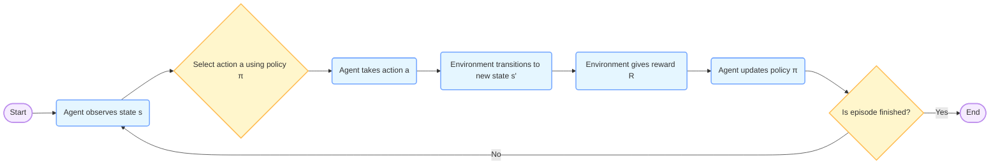

# 强化学习优化多目标推理的决策过程

> 关键词：强化学习、多目标推理、决策过程优化、马尔可夫决策过程、策略梯度算法

> 摘要：本文聚焦于强化学习在优化多目标推理决策过程中的应用。首先介绍了强化学习和多目标推理的背景知识，明确了文章的目的、范围和预期读者。接着阐述了核心概念及其联系，详细讲解了核心算法原理和具体操作步骤，同时给出了相关的数学模型和公式。通过项目实战案例，展示了如何使用强化学习优化多目标推理的决策过程。探讨了其实际应用场景，并推荐了相关的学习资源、开发工具框架和论文著作。最后总结了未来发展趋势与挑战，并对常见问题进行了解答。

## 1. 背景介绍 
### 1.1 目的和范围
在现实世界的众多场景中，决策过程往往需要同时考虑多个目标。例如，在自动驾驶中，不仅要考虑行驶速度，还要兼顾安全性和能源效率；在资源分配问题中，需要平衡成本、效益和公平性等多个方面。传统的决策方法在处理多目标问题时往往存在局限性，而强化学习作为一种强大的机器学习技术，为优化多目标推理的决策过程提供了新的思路和方法。

本文的目的是深入探讨强化学习如何用于优化多目标推理的决策过程，详细介绍相关的理论知识、算法原理和实际应用案例。范围涵盖了强化学习的基本概念、多目标推理的建模方法、核心算法的实现以及实际应用场景的分析。

### 1.2 预期读者
本文适合对强化学习、机器学习和决策理论感兴趣的研究人员、工程师和学生阅读。对于正在从事多目标优化问题研究的专业人士，本文可以提供新的技术思路和解决方案；对于初学者，本文可以帮助他们建立起对强化学习和多目标推理的基本认识。

### 1.3 文档结构概述
本文将按照以下结构进行组织：
1. **背景介绍**：介绍文章的目的、范围、预期读者和文档结构概述，并给出相关术语的定义。
2. **核心概念与联系**：阐述强化学习和多目标推理的核心概念，以及它们之间的联系。
3. **核心算法原理 & 具体操作步骤**：详细讲解用于优化多目标推理决策过程的核心算法，并给出具体的操作步骤。
4. **数学模型和公式 & 详细讲解 & 举例说明**：介绍相关的数学模型和公式，并通过具体的例子进行说明。
5. **项目实战：代码实际案例和详细解释说明**：通过一个实际的项目案例，展示如何使用强化学习优化多目标推理的决策过程。
6. **实际应用场景**：探讨强化学习优化多目标推理决策过程在不同领域的实际应用场景。
7. **工具和资源推荐**：推荐相关的学习资源、开发工具框架和论文著作。
8. **总结：未来发展趋势与挑战**：总结强化学习在优化多目标推理决策过程中的应用现状，分析未来的发展趋势和面临的挑战。
9. **附录：常见问题与解答**：对常见问题进行解答。
10. **扩展阅读 & 参考资料**：提供相关的扩展阅读材料和参考资料。

### 1.4 术语表
#### 1.4.1 核心术语定义
- **强化学习（Reinforcement Learning）**：一种机器学习范式，智能体通过与环境进行交互，根据环境反馈的奖励信号来学习最优的行为策略。
- **多目标推理（Multi - objective Reasoning）**：在决策过程中，需要同时考虑多个相互冲突或相互关联的目标。
- **决策过程（Decision - making Process）**：智能体在给定的环境中，根据自身的状态和目标，选择合适的行动的过程。
- **智能体（Agent）**：在强化学习中，能够感知环境状态并采取行动的实体。
- **环境（Environment）**：智能体所处的外部世界，智能体的行动会对环境产生影响，环境会反馈给智能体新的状态和奖励。
- **奖励（Reward）**：环境给予智能体的反馈信号，用于表示智能体的行动对实现目标的好坏程度。
- **策略（Policy）**：智能体根据当前状态选择行动的规则。

#### 1.4.2 相关概念解释
- **马尔可夫决策过程（Markov Decision Process，MDP）**：是强化学习中常用的数学模型，它描述了一个具有马尔可夫性质的决策过程。在MDP中，智能体的下一个状态只取决于当前状态和当前采取的行动，而与历史状态和行动无关。
- **策略梯度算法（Policy Gradient Algorithm）**：一类用于优化策略的强化学习算法，通过直接对策略进行梯度上升来最大化累积奖励。

#### 1.4.3 缩略词列表
- **MDP**：Markov Decision Process
- **DQN**：Deep Q - Network
- **A2C**：Advantage Actor - Critic
- **PPO**：Proximal Policy Optimization

## 2. 核心概念与联系 
### 2.1 强化学习核心概念
强化学习的核心概念可以用马尔可夫决策过程（MDP）来描述。一个MDP可以表示为一个五元组 $(S, A, P, R, \gamma)$，其中：
- $S$ 是状态空间，表示智能体可能处于的所有状态的集合。
- $A$ 是行动空间，表示智能体可以采取的所有行动的集合。
- $P(s'|s, a)$ 是状态转移概率，表示在状态 $s$ 下采取行动 $a$ 后转移到状态 $s'$ 的概率。
- $R(s, a, s')$ 是奖励函数，表示在状态 $s$ 下采取行动 $a$ 并转移到状态 $s'$ 时获得的奖励。
- $\gamma$ 是折扣因子，用于平衡即时奖励和未来奖励的重要性，取值范围为 $[0, 1]$。

智能体的目标是学习一个最优策略 $\pi^*(a|s)$，使得在每个状态 $s$ 下选择的行动 $a$ 能够最大化长期累积奖励：
$$G_t=\sum_{k = 0}^{\infty}\gamma^kR_{t + k + 1}$$

### 2.2 多目标推理核心概念
在多目标推理中，存在多个目标函数 $f_1(s, a), f_2(s, a), \cdots, f_n(s, a)$，每个目标函数表示一个不同的目标。例如，在自动驾驶中，$f_1$ 可以表示行驶速度，$f_2$ 可以表示安全性，$f_3$ 可以表示能源效率。

由于这些目标往往是相互冲突的，例如提高行驶速度可能会降低安全性，因此需要找到一个折中的解决方案。一种常见的方法是将多个目标函数组合成一个标量值，例如使用加权和的方法：
$$F(s, a)=\sum_{i = 1}^{n}w_if_i(s, a)$$
其中 $w_i$ 是每个目标函数的权重，满足 $\sum_{i = 1}^{n}w_i = 1$ 且 $w_i\geq0$。

### 2.3 强化学习与多目标推理的联系
强化学习可以用于优化多目标推理的决策过程。具体来说，可以将多目标推理问题转化为一个强化学习问题，将组合后的目标函数 $F(s, a)$ 作为强化学习中的奖励函数 $R(s, a, s')$。智能体通过与环境进行交互，不断调整自己的策略，以最大化累积奖励，从而实现多目标的优化。

### 2.4 核心概念原理和架构的文本示意图
```plaintext
+----------------+          +----------------+
|    Environment |          |     Agent      |
+----------------+          +----------------+
|  State (s)     | <------> |  Action (a)    |
|  Reward (R)    | <------> |  Policy (π)    |
|  State Trans.  |          |  Learning      |
+----------------+          +----------------+
```

### 2.5 Mermaid 流程图


## 3. 核心算法原理 & 具体操作步骤 
### 3.1 策略梯度算法原理
策略梯度算法是一类直接对策略进行优化的强化学习算法。策略通常用一个参数化的函数 $\pi_{\theta}(a|s)$ 表示，其中 $\theta$ 是策略的参数。策略梯度算法的目标是通过调整参数 $\theta$ 来最大化累积奖励的期望：
$$J(\theta)=\mathbb{E}_{\tau\sim\pi_{\theta}}[G(\tau)]$$
其中 $\tau=(s_0, a_0, r_0, s_1, a_1, r_1, \cdots)$ 是一个轨迹，$G(\tau)$ 是轨迹 $\tau$ 的累积奖励。

根据策略梯度定理，策略梯度可以表示为：
$$\nabla_{\theta}J(\theta)=\mathbb{E}_{\tau\sim\pi_{\theta}}\left[\sum_{t = 0}^{T}\nabla_{\theta}\log\pi_{\theta}(a_t|s_t)G_t\right]$$

### 3.2 基于策略梯度算法优化多目标推理决策过程的具体步骤
#### 步骤 1：初始化
- 初始化策略参数 $\theta$。
- 初始化环境和智能体。

#### 步骤 2：与环境交互
- 智能体观察当前状态 $s_t$。
- 根据当前策略 $\pi_{\theta}(a|s_t)$ 选择一个行动 $a_t$。
- 执行行动 $a_t$，环境转移到新状态 $s_{t + 1}$ 并给出奖励 $r_t$。

#### 步骤 3：计算累积奖励
- 计算从时间步 $t$ 开始的累积奖励 $G_t$。

#### 步骤 4：计算策略梯度
- 计算策略梯度 $\nabla_{\theta}\log\pi_{\theta}(a_t|s_t)G_t$。

#### 步骤 5：更新策略参数
- 使用梯度上升法更新策略参数 $\theta$：
$$\theta\leftarrow\theta+\alpha\nabla_{\theta}J(\theta)$$
其中 $\alpha$ 是学习率。

#### 步骤 6：重复步骤 2 - 5
- 重复上述步骤，直到达到终止条件（例如，达到最大训练步数或累积奖励收敛）。

### 3.3 Python 源代码实现
```python
import numpy as np
import torch
import torch.nn as nn
import torch.optim as optim

# 定义策略网络
class PolicyNetwork(nn.Module):
    def __init__(self, input_dim, output_dim):
        super(PolicyNetwork, self).__init__()
        self.fc1 = nn.Linear(input_dim, 64)
        self.fc2 = nn.Linear(64, output_dim)
        self.softmax = nn.Softmax(dim = 1)

    def forward(self, x):
        x = torch.relu(self.fc1(x))
        x = self.fc2(x)
        x = self.softmax(x)
        return x

# 定义强化学习智能体
class Agent:
    def __init__(self, input_dim, output_dim, learning_rate):
        self.policy_network = PolicyNetwork(input_dim, output_dim)
        self.optimizer = optim.Adam(self.policy_network.parameters(), lr = learning_rate)

    def get_action(self, state):
        state = torch.FloatTensor(state).unsqueeze(0)
        probs = self.policy_network(state)
        action = torch.multinomial(probs, 1).item()
        log_prob = torch.log(probs.squeeze(0)[action])
        return action, log_prob

    def update_policy(self, log_probs, rewards, gamma):
        discounted_rewards = []
        R = 0
        for r in reversed(rewards):
            R = r + gamma * R
            discounted_rewards.insert(0, R)
        discounted_rewards = torch.FloatTensor(discounted_rewards)
        policy_loss = []
        for log_prob, reward in zip(log_probs, discounted_rewards):
            policy_loss.append(-log_prob * reward)
        policy_loss = torch.stack(policy_loss).sum()
        self.optimizer.zero_grad()
        policy_loss.backward()
        self.optimizer.step()

# 主训练函数
def train(agent, env, num_episodes, gamma):
    for episode in range(num_episodes):
        state = env.reset()
        log_probs = []
        rewards = []
        done = False
        while not done:
            action, log_prob = agent.get_action(state)
            next_state, reward, done, _ = env.step(action)
            log_probs.append(log_prob)
            rewards.append(reward)
            state = next_state
        agent.update_policy(log_probs, rewards, gamma)
        if episode % 100 == 0:
            print(f"Episode {episode}: Total reward = {sum(rewards)}")

# 示例使用
if __name__ == "__main__":
    import gym
    env = gym.make('CartPole-v1')
    input_dim = env.observation_space.shape[0]
    output_dim = env.action_space.n
    learning_rate = 0.01
    agent = Agent(input_dim, output_dim, learning_rate)
    num_episodes = 1000
    gamma = 0.99
    train(agent, env, num_episodes, gamma)
    env.close()
```

## 4. 数学模型和公式 & 详细讲解 & 举例说明 
### 4.1 马尔可夫决策过程（MDP）公式
如前所述，一个MDP可以表示为一个五元组 $(S, A, P, R, \gamma)$。状态转移概率 $P(s'|s, a)$ 满足：
$$\sum_{s'\in S}P(s'|s, a)=1$$
即从状态 $s$ 采取行动 $a$ 后，一定会转移到某个状态 $s'$。

累积奖励 $G_t$ 可以递归地表示为：
$$G_t = R_{t+1}+\gamma G_{t + 1}$$
这个公式表明，从时间步 $t$ 开始的累积奖励等于即时奖励 $R_{t+1}$ 加上折扣后的未来累积奖励 $\gamma G_{t + 1}$。

### 4.2 策略梯度公式
策略梯度 $\nabla_{\theta}J(\theta)$ 的推导基于似然比技巧。设 $p_{\theta}(\tau)$ 是在策略 $\pi_{\theta}$ 下生成轨迹 $\tau$ 的概率，则：
$$J(\theta)=\sum_{\tau}p_{\theta}(\tau)G(\tau)$$
对 $J(\theta)$ 求关于 $\theta$ 的梯度：
$$\nabla_{\theta}J(\theta)=\sum_{\tau}\nabla_{\theta}p_{\theta}(\tau)G(\tau)$$
根据对数求导法则 $\nabla_{\theta}p_{\theta}(\tau)=p_{\theta}(\tau)\nabla_{\theta}\log p_{\theta}(\tau)$，可得：
$$\nabla_{\theta}J(\theta)=\sum_{\tau}p_{\theta}(\tau)\nabla_{\theta}\log p_{\theta}(\tau)G(\tau)=\mathbb{E}_{\tau\sim\pi_{\theta}}\left[\nabla_{\theta}\log p_{\theta}(\tau)G(\tau)\right]$$
由于 $p_{\theta}(\tau)=\prod_{t = 0}^{T}\pi_{\theta}(a_t|s_t)P(s_{t + 1}|s_t, a_t)$，则 $\nabla_{\theta}\log p_{\theta}(\tau)=\sum_{t = 0}^{T}\nabla_{\theta}\log\pi_{\theta}(a_t|s_t)$，因此：
$$\nabla_{\theta}J(\theta)=\mathbb{E}_{\tau\sim\pi_{\theta}}\left[\sum_{t = 0}^{T}\nabla_{\theta}\log\pi_{\theta}(a_t|s_t)G_t\right]$$

### 4.3 举例说明
考虑一个简单的网格世界问题，智能体在一个 $3\times3$ 的网格中移动，目标是从起点 $(0, 0)$ 到达终点 $(2, 2)$。状态 $s$ 表示智能体在网格中的位置，行动 $a$ 包括上、下、左、右四个方向。奖励函数 $R(s, a, s')$ 定义为：如果到达终点，奖励为 $+10$；如果撞到墙壁，奖励为 $-1$；否则奖励为 $-0.1$。

假设策略网络是一个简单的全连接神经网络，输入是状态的二维坐标，输出是四个行动的概率分布。在训练过程中，智能体根据当前策略选择行动，与环境交互并获得奖励，然后根据策略梯度算法更新策略参数。经过多次训练，智能体将学习到一个最优策略，能够以最快的速度从起点到达终点。

## 5. 项目实战：代码实际案例和详细解释说明 
### 5.1 开发环境搭建
#### 5.1.1 安装 Python
首先，确保你已经安装了 Python 3.6 或更高版本。可以从 [Python 官方网站](https://www.python.org/downloads/) 下载并安装。

#### 5.1.2 安装必要的库
在命令行中使用以下命令安装必要的库：
```sh
pip install numpy torch gym
```
- `numpy`：用于数值计算。
- `torch`：PyTorch 深度学习框架，用于构建和训练神经网络。
- `gym`：OpenAI Gym 是一个用于开发和比较强化学习算法的工具包，提供了许多标准的强化学习环境。

### 5.2 源代码详细实现和代码解读
#### 5.2.1 策略网络定义
```python
class PolicyNetwork(nn.Module):
    def __init__(self, input_dim, output_dim):
        super(PolicyNetwork, self).__init__()
        self.fc1 = nn.Linear(input_dim, 64)
        self.fc2 = nn.Linear(64, output_dim)
        self.softmax = nn.Softmax(dim = 1)

    def forward(self, x):
        x = torch.relu(self.fc1(x))
        x = self.fc2(x)
        x = self.softmax(x)
        return x
```
- `PolicyNetwork` 继承自 `nn.Module`，是一个简单的全连接神经网络。
- `fc1` 和 `fc2` 是两个全连接层，分别将输入维度映射到 64 维和输出维度。
- `softmax` 层将输出转换为概率分布。

#### 5.2.2 智能体定义
```python
class Agent:
    def __init__(self, input_dim, output_dim, learning_rate):
        self.policy_network = PolicyNetwork(input_dim, output_dim)
        self.optimizer = optim.Adam(self.policy_network.parameters(), lr = learning_rate)

    def get_action(self, state):
        state = torch.FloatTensor(state).unsqueeze(0)
        probs = self.policy_network(state)
        action = torch.multinomial(probs, 1).item()
        log_prob = torch.log(probs.squeeze(0)[action])
        return action, log_prob

    def update_policy(self, log_probs, rewards, gamma):
        discounted_rewards = []
        R = 0
        for r in reversed(rewards):
            R = r + gamma * R
            discounted_rewards.insert(0, R)
        discounted_rewards = torch.FloatTensor(discounted_rewards)
        policy_loss = []
        for log_prob, reward in zip(log_probs, discounted_rewards):
            policy_loss.append(-log_prob * reward)
        policy_loss = torch.stack(policy_loss).sum()
        self.optimizer.zero_grad()
        policy_loss.backward()
        self.optimizer.step()
```
- `Agent` 类封装了策略网络和优化器。
- `get_action` 方法根据当前状态选择一个行动，并返回行动和对应的对数概率。
- `update_policy` 方法根据收集到的对数概率和奖励更新策略网络的参数。

#### 5.2.3 主训练函数
```python
def train(agent, env, num_episodes, gamma):
    for episode in range(num_episodes):
        state = env.reset()
        log_probs = []
        rewards = []
        done = False
        while not done:
            action, log_prob = agent.get_action(state)
            next_state, reward, done, _ = env.step(action)
            log_probs.append(log_prob)
            rewards.append(reward)
            state = next_state
        agent.update_policy(log_probs, rewards, gamma)
        if episode % 100 == 0:
            print(f"Episode {episode}: Total reward = {sum(rewards)}")
```
- `train` 函数是主训练函数，它在指定的回合数内训练智能体。
- 在每个回合中，智能体与环境交互，收集对数概率和奖励，然后更新策略网络的参数。

### 5.3 代码解读与分析
#### 5.3.1 策略网络的作用
策略网络的作用是根据当前状态输出行动的概率分布。智能体根据这个概率分布随机选择一个行动，从而实现探索和利用的平衡。

#### 5.3.2 策略梯度更新的原理
策略梯度更新的原理是通过调整策略网络的参数，使得智能体采取能够获得更高累积奖励的行动的概率增加。具体来说，通过最大化策略梯度 $\nabla_{\theta}J(\theta)$，使得策略参数 $\theta$ 朝着增加累积奖励期望的方向更新。

#### 5.3.3 折扣因子的作用
折扣因子 $\gamma$ 的作用是平衡即时奖励和未来奖励的重要性。当 $\gamma$ 接近 1 时，智能体更注重未来的奖励；当 $\gamma$ 接近 0 时，智能体更注重即时奖励。

## 6. 实际应用场景 
### 6.1 自动驾驶
在自动驾驶中，需要同时考虑多个目标，如行驶速度、安全性、能源效率等。强化学习可以用于优化自动驾驶汽车的决策过程，根据实时的交通状况和环境信息，选择最优的行驶策略。例如，在遇到交通拥堵时，智能体可以选择合适的路线和速度，以平衡行驶时间和燃油消耗。

### 6.2 资源分配
在资源分配问题中，如云计算中的资源调度、供应链管理中的库存分配等，需要平衡成本、效益和公平性等多个目标。强化学习可以通过学习不同的资源分配策略，最大化整体的效益。例如，在云计算中，智能体可以根据用户的需求和服务器的负载情况，动态地分配计算资源，以提高资源利用率和用户满意度。

### 6.3 游戏
在游戏领域，强化学习可以用于优化玩家的决策过程，提高游戏的胜率。例如，在围棋、国际象棋等棋类游戏中，智能体可以通过与环境（对手）进行交互，学习最优的落子策略。在电子游戏中，强化学习可以用于优化角色的行动决策，提高游戏的表现。

### 6.4 金融投资
在金融投资中，需要考虑多个目标，如收益最大化、风险最小化等。强化学习可以用于优化投资组合的选择，根据市场的动态变化，调整投资策略。例如，智能体可以学习预测股票价格的走势，选择合适的买入和卖出时机，以实现投资收益的最大化。

## 7. 工具和资源推荐
### 7.1 学习资源推荐
#### 7.1.1 书籍推荐
- 《Reinforcement Learning: An Introduction》（Richard S. Sutton 和 Andrew G. Barto 著）：这是强化学习领域的经典教材，全面介绍了强化学习的基本概念、算法和应用。
- 《Deep Reinforcement Learning Hands-On》（Max Lapan 著）：本书通过实际的代码示例，详细介绍了深度强化学习的算法和应用，适合初学者和有一定编程基础的读者。

#### 7.1.2 在线课程
- 《Reinforcement Learning Specialization》（Coursera 平台）：由 University of Alberta 提供，包括四门课程，系统地介绍了强化学习的理论和实践。
- 《Deep Reinforcement Learning》（Udemy 平台）：该课程通过实际的项目案例，介绍了深度强化学习的算法和应用，适合想要快速上手的读者。

#### 7.1.3 技术博客和网站
- OpenAI Blog（https://openai.com/blog/）：OpenAI 官方博客，发布了许多关于强化学习和人工智能的最新研究成果和应用案例。
- DeepMind Blog（https://deepmind.com/blog/）：DeepMind 官方博客，分享了许多关于强化学习和人工智能的前沿研究和技术进展。

### 7.2 开发工具框架推荐
#### 7.2.1 IDE和编辑器
- PyCharm：一款功能强大的 Python 集成开发环境，提供了代码编辑、调试、版本控制等功能，适合开发强化学习项目。
- Jupyter Notebook：一种交互式的编程环境，适合进行数据分析和模型训练的实验和演示。

#### 7.2.2 调试和性能分析工具
- TensorBoard：TensorFlow 提供的可视化工具，可以用于监控模型的训练过程、可视化损失函数和指标等。
- PyTorch Profiler：PyTorch 提供的性能分析工具，可以帮助用户分析模型的性能瓶颈，优化代码。

#### 7.2.3 相关框架和库
- Stable Baselines3：一个基于 PyTorch 的强化学习库，提供了许多常用的强化学习算法的实现，方便用户进行快速开发和实验。
- RLlib：Ray 提供的分布式强化学习库，支持多种深度学习框架，适合大规模的强化学习实验和应用。

### 7.3 相关论文著作推荐
#### 7.3.1 经典论文
- “Policy Gradient Methods for Reinforcement Learning with Function Approximation”（Richard S. Sutton 等著）：该论文提出了策略梯度算法的基本理论，为后续的研究奠定了基础。
- “Human - Level Control through Deep Reinforcement Learning”（Volodymyr Mnih 等著）：该论文提出了深度 Q 网络（DQN）算法，首次将深度学习与强化学习相结合，在 Atari 游戏中取得了人类水平的表现。

#### 7.3.2 最新研究成果
- “Proximal Policy Optimization Algorithms”（John Schulman 等著）：该论文提出了近端策略优化（PPO）算法，是一种高效的策略梯度算法，在许多强化学习任务中取得了优异的性能。
- “Soft Actor - Critic: Off - Policy Maximum Entropy Deep Reinforcement Learning with a Stochastic Actor”（Tuomas Haarnoja 等著）：该论文提出了软演员 - 评论家（SAC）算法，结合了最大熵强化学习和策略梯度算法，具有良好的稳定性和样本效率。

#### 7.3.3 应用案例分析
- “Autonomous Vehicle Trajectory Planning with Model Predictive Control and Reinforcement Learning”（S. Karaman 等著）：该论文介绍了如何使用模型预测控制和强化学习相结合的方法进行自动驾驶汽车的轨迹规划。
- “Resource Allocation in Cloud Computing Using Reinforcement Learning”（M. A. Islam 等著）：该论文研究了如何使用强化学习优化云计算中的资源分配问题。

## 8. 总结：未来发展趋势与挑战
### 8.1 未来发展趋势
#### 8.1.1 多智能体强化学习
在许多实际应用场景中，存在多个智能体相互协作或竞争的情况。多智能体强化学习将成为未来的一个重要研究方向，用于解决多智能体系统中的决策和协作问题。例如，在自动驾驶中，多辆汽车之间需要相互协作，以实现高效的交通流控制。

#### 8.1.2 深度强化学习与其他技术的融合
深度强化学习将与其他技术，如计算机视觉、自然语言处理等进行更深入的融合。例如，在机器人领域，深度强化学习可以与计算机视觉相结合，使机器人能够更好地感知环境并做出决策；在智能客服领域，深度强化学习可以与自然语言处理相结合，提高客服的服务质量和效率。

#### 8.1.3 强化学习在复杂环境中的应用
随着技术的发展，强化学习将被应用于更加复杂的环境中，如太空探索、生物医疗等。在这些复杂环境中，需要解决更多的挑战，如环境建模、不确定性处理等。

### 8.2 挑战
#### 8.2.1 样本效率问题
强化学习通常需要大量的样本进行训练，样本效率较低。在实际应用中，获取大量的样本往往是困难和昂贵的。因此，提高强化学习的样本效率是一个亟待解决的问题。

#### 8.2.2 可解释性问题
深度强化学习模型通常是黑盒模型，难以解释其决策过程和结果。在一些对安全性和可靠性要求较高的应用场景中，如自动驾驶、医疗诊断等，模型的可解释性是至关重要的。

#### 8.2.3 环境建模问题
在实际应用中，环境往往是复杂和不确定的，难以进行准确的建模。不准确的环境建模会导致强化学习算法的性能下降，甚至无法收敛。因此，如何建立准确的环境模型是一个挑战。

## 9. 附录：常见问题与解答
### 9.1 什么是强化学习中的探索和利用权衡？
在强化学习中，探索是指智能体尝试不同的行动，以发现更好的策略；利用是指智能体根据已有的经验选择当前认为最优的行动。探索和利用权衡是指在训练过程中，智能体需要在探索新的行动和利用已有的经验之间找到一个平衡。如果智能体过于注重探索，可能会浪费大量的时间和资源；如果智能体过于注重利用，可能会陷入局部最优解。

### 9.2 策略梯度算法和基于价值的算法有什么区别？
策略梯度算法是直接对策略进行优化的算法，通过调整策略的参数来最大化累积奖励的期望。基于价值的算法则是通过学习状态 - 行动值函数（如 Q 函数）来间接优化策略，智能体根据值函数选择行动。策略梯度算法适用于连续行动空间和随机策略的学习，而基于价值的算法更适合离散行动空间和确定性策略的学习。

### 9.3 如何选择合适的折扣因子 $\gamma$？
折扣因子 $\gamma$ 的选择取决于具体的应用场景。当 $\gamma$ 接近 1 时，智能体更注重未来的奖励，适合于需要长期规划的任务；当 $\gamma$ 接近 0 时，智能体更注重即时奖励，适合于需要快速获得奖励的任务。一般来说，可以通过实验的方法选择合适的 $\gamma$ 值。

## 10. 扩展阅读 & 参考资料
### 10.1 扩展阅读
- 《Algorithms for Reinforcement Learning》（Csaba Szepesvári 著）：本书详细介绍了强化学习中的各种算法，包括策略迭代、值迭代、Q 学习等。
- 《Reinforcement Learning in Continuous Time and Space》（Héctor Geffner 等著）：本书探讨了在连续时间和空间中进行强化学习的方法和技术。

### 10.2 参考资料
- Sutton, R. S., & Barto, A. G. (2018). Reinforcement Learning: An Introduction. MIT Press.
- Mnih, V., Kavukcuoglu, K., Silver, D., Rusu, A. A., Veness, J., Bellemare, M. G.,... & Petersen, S. (2015). Human - level control through deep reinforcement learning. Nature, 518(7540), 529 - 533.
- Schulman, J., Wolski, F., Dhariwal, P., Radford, A., & Klimov, O. (2017). Proximal Policy Optimization Algorithms. arXiv preprint arXiv:1707.06347.

作者：AI天才研究院/AI Genius Institute & 禅与计算机程序设计艺术 /Zen And The Art of Computer Programming