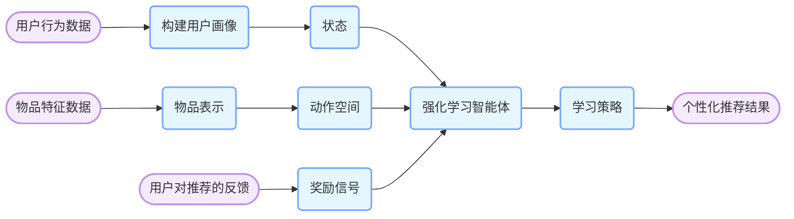

# 强化学习在AI Agent个性化推荐中的应用

> 关键词：强化学习、AI Agent、个性化推荐、马尔可夫决策过程、奖励机制

> 摘要：本文深入探讨了强化学习在AI Agent个性化推荐中的应用。首先介绍了相关背景知识，包括目的范围、预期读者等内容。接着阐述了强化学习与个性化推荐的核心概念及其联系，通过文本示意图和Mermaid流程图进行清晰展示。详细讲解了强化学习的核心算法原理和具体操作步骤，使用Python源代码进行说明。还介绍了相关的数学模型和公式，并举例阐释。通过项目实战，展示了如何搭建开发环境、实现源代码并进行解读分析。探讨了强化学习在个性化推荐中的实际应用场景，推荐了相关的工具和资源。最后总结了未来发展趋势与挑战，提供了常见问题解答和扩展阅读参考资料，旨在为读者全面呈现强化学习在AI Agent个性化推荐领域的应用全貌。

## 1. 背景介绍 
### 1.1 目的和范围
在当今信息爆炸的时代，用户面临着海量的信息和商品选择，如何从这些繁杂的内容中为用户提供个性化的推荐成为了一个关键问题。AI Agent（智能代理）作为一种能够自主执行任务、与环境交互的智能实体，在个性化推荐领域具有重要的应用价值。强化学习作为一种机器学习方法，通过智能体与环境的交互，以最大化累积奖励为目标进行学习，非常适合用于解决个性化推荐中的动态决策问题。

本文的范围涵盖了强化学习的基本概念、其在AI Agent个性化推荐中的应用原理、核心算法、数学模型，以及通过实际项目展示如何将强化学习应用于个性化推荐系统中。同时，还会探讨其实际应用场景、相关工具和资源，以及未来的发展趋势与挑战。

### 1.2 预期读者
本文预期读者包括对人工智能、机器学习、推荐系统感兴趣的研究人员、开发者，以及希望了解强化学习在个性化推荐领域应用的技术爱好者。对于有一定编程基础和机器学习知识的读者，能够更深入地理解文中的算法原理和代码实现；而对于初学者，也可以通过本文初步了解相关概念和应用场景。

### 1.3 文档结构概述
本文首先介绍相关背景知识，让读者对强化学习在AI Agent个性化推荐中的应用有一个初步的认识。接着详细阐述核心概念与联系，包括强化学习和个性化推荐的原理、架构等内容。然后讲解核心算法原理和具体操作步骤，通过Python代码进行详细说明。再介绍相关的数学模型和公式，并举例说明。通过项目实战，展示如何搭建开发环境、实现源代码并进行解读分析。探讨实际应用场景，推荐相关的工具和资源。最后总结未来发展趋势与挑战，提供常见问题解答和扩展阅读参考资料。

### 1.4 术语表
#### 1.4.1 核心术语定义
- **强化学习（Reinforcement Learning）**：是一种机器学习范式，智能体通过与环境进行交互，根据环境反馈的奖励信号来学习最优的行为策略，以最大化长期累积奖励。
- **AI Agent（智能代理）**：是一种能够感知环境、自主决策并采取行动的智能实体，在个性化推荐中可以根据用户的行为和环境信息进行推荐决策。
- **个性化推荐（Personalized Recommendation）**：根据用户的个人特征、行为历史等信息，为用户提供符合其兴趣和需求的推荐内容。
- **马尔可夫决策过程（Markov Decision Process，MDP）**：是强化学习中的一个数学模型，描述了智能体在环境中的决策过程，具有马尔可夫性，即当前状态只与上一状态和当前动作有关。
- **奖励机制（Reward Mechanism）**：在强化学习中，环境根据智能体的行为给予的反馈信号，用于指导智能体学习最优策略。

#### 1.4.2 相关概念解释
- **状态（State）**：在马尔可夫决策过程中，状态是对环境的一种描述，智能体根据当前状态来选择行动。在个性化推荐中，状态可以包括用户的历史行为、偏好特征、当前环境信息等。
- **动作（Action）**：智能体在某个状态下采取的行为。在个性化推荐中，动作可以是向用户推荐某个商品、内容等。
- **策略（Policy）**：是智能体在不同状态下选择动作的规则，通常用 $\pi$ 表示。一个好的策略能够使智能体获得最大的累积奖励。
- **价值函数（Value Function）**：用于评估某个状态或状态 - 动作对的价值，分为状态价值函数 $V(s)$ 和动作价值函数 $Q(s,a)$。状态价值函数表示从状态 $s$ 开始，遵循策略 $\pi$ 所能获得的期望累积奖励；动作价值函数表示在状态 $s$ 下采取动作 $a$，遵循策略 $\pi$ 所能获得的期望累积奖励。

#### 1.4.3 缩略词列表
- **MDP**：Markov Decision Process（马尔可夫决策过程）
- **Q - learning**：一种无模型的强化学习算法
- **SARSA**：State - Action - Reward - State - Action 的缩写，也是一种无模型的强化学习算法

## 2. 核心概念与联系 

### 强化学习原理
强化学习的核心思想是智能体通过与环境进行交互，不断尝试不同的动作，并根据环境给予的奖励信号来学习最优的行为策略。智能体在每个时间步 $t$ 处于某个状态 $s_t$，根据当前策略 $\pi$ 选择一个动作 $a_t$ 执行，环境接收到动作后会转移到下一个状态 $s_{t + 1}$，并给予智能体一个奖励 $r_{t+1}$。智能体的目标是学习一个策略 $\pi$，使得长期累积奖励最大化。

### 个性化推荐原理
个性化推荐系统的目标是根据用户的个人特征、行为历史等信息，为用户提供符合其兴趣和需求的推荐内容。通常需要对用户的行为数据进行收集和分析，构建用户画像，然后根据用户画像和物品特征进行匹配，为用户推荐合适的物品。

### 强化学习与个性化推荐的联系
强化学习可以很好地应用于个性化推荐中。在个性化推荐场景中，用户的行为和环境信息可以看作是强化学习中的状态，推荐的物品或内容可以看作是动作，用户对推荐的反馈（如点击、购买等）可以看作是奖励。通过强化学习算法，智能体可以不断学习用户的偏好和行为模式，调整推荐策略，以提高推荐的准确性和用户满意度。

### 文本示意图
```plaintext
用户行为数据 ----> 构建用户画像 ----> 状态（强化学习）
物品特征数据 ----> 物品表示 ----> 动作空间（强化学习）
用户对推荐的反馈 ----> 奖励信号（强化学习）
强化学习智能体 ----> 学习策略 ----> 个性化推荐结果
```

### Mermaid流程图


## 3. 核心算法原理 & 具体操作步骤 

### Q - learning算法原理
Q - learning是一种无模型的强化学习算法，通过学习动作价值函数 $Q(s,a)$ 来找到最优策略。动作价值函数 $Q(s,a)$ 表示在状态 $s$ 下采取动作 $a$ 所能获得的期望累积奖励。Q - learning的更新公式为：

$Q(s_t,a_t) \leftarrow Q(s_t,a_t) + \alpha [r_{t+1} + \gamma \max_{a} Q(s_{t + 1},a) - Q(s_t,a_t)]$

其中，$\alpha$ 是学习率，控制每次更新的步长；$\gamma$ 是折扣因子，用于权衡当前奖励和未来奖励的重要性。

### Q - learning算法的具体操作步骤
1. **初始化**：初始化动作价值函数 $Q(s,a)$ 为一个任意值（通常初始化为0）。
2. **循环进行**：
    - 观察当前状态 $s_t$。
    - 根据当前的 $Q$ 值和探索策略（如 $\epsilon$ - 贪心策略）选择一个动作 $a_t$。
    - 执行动作 $a_t$，得到下一个状态 $s_{t + 1}$ 和奖励 $r_{t+1}$。
    - 根据Q - learning更新公式更新 $Q(s_t,a_t)$。
    - 将状态 $s_{t + 1}$ 设置为当前状态，重复上述步骤，直到达到终止条件。

### Python源代码实现
```python
import numpy as np

# 定义环境
class Environment:
    def __init__(self, num_states, num_actions):
        self.num_states = num_states
        self.num_actions = num_actions
        self.current_state = np.random.randint(0, num_states)

    def step(self, action):
        # 简单示例：随机转移到下一个状态并返回奖励
        next_state = np.random.randint(0, self.num_states)
        reward = np.random.randn()  # 随机奖励
        return next_state, reward

# 定义Q - learning智能体
class QLearningAgent:
    def __init__(self, num_states, num_actions, learning_rate=0.1, discount_factor=0.9, epsilon=0.1):
        self.num_states = num_states
        self.num_actions = num_actions
        self.learning_rate = learning_rate
        self.discount_factor = discount_factor
        self.epsilon = epsilon
        self.q_table = np.zeros((num_states, num_actions))

    def choose_action(self, state):
        if np.random.uniform(0, 1) < self.epsilon:
            # 探索：随机选择一个动作
            action = np.random.randint(0, self.num_actions)
        else:
            # 利用：选择Q值最大的动作
            action = np.argmax(self.q_table[state])
        return action

    def update(self, state, action, reward, next_state):
        # Q - learning更新公式
        max_q_next = np.max(self.q_table[next_state])
        self.q_table[state, action] += self.learning_rate * (reward + self.discount_factor * max_q_next - self.q_table[state, action])

# 训练过程
num_states = 10
num_actions = 5
env = Environment(num_states, num_actions)
agent = QLearningAgent(num_states, num_actions)

num_episodes = 1000
for episode in range(num_episodes):
    state = env.current_state
    done = False
    while not done:
        action = agent.choose_action(state)
        next_state, reward = env.step(action)
        agent.update(state, action, reward, next_state)
        state = next_state
        # 简单终止条件：达到一定步数
        if episode > 100:
            done = True

print("训练完成后的Q表：")
print(agent.q_table)
```

### 代码解释
- `Environment` 类表示环境，包含状态数量和动作数量，`step` 方法用于执行动作并返回下一个状态和奖励。
- `QLearningAgent` 类表示Q - learning智能体，包含Q表、学习率、折扣因子和探索率等参数。`choose_action` 方法用于根据 $\epsilon$ - 贪心策略选择动作，`update` 方法用于更新Q表。
- 训练过程中，智能体不断与环境交互，根据Q - learning算法更新Q表，直到达到终止条件。

## 4. 数学模型和公式 & 详细讲解 & 举例说明 

### 马尔可夫决策过程（MDP）
马尔可夫决策过程是强化学习中的一个重要数学模型，由一个五元组 $(S,A,P,R,\gamma)$ 组成：
- $S$：状态空间，表示环境可能处于的所有状态的集合。
- $A$：动作空间，表示智能体可以采取的所有动作的集合。
- $P$：状态转移概率函数，$P(s_{t + 1}|s_t,a_t)$ 表示在状态 $s_t$ 下采取动作 $a_t$ 后转移到状态 $s_{t + 1}$ 的概率。
- $R$：奖励函数，$R(s_t,a_t,s_{t + 1})$ 表示在状态 $s_t$ 下采取动作 $a_t$ 转移到状态 $s_{t + 1}$ 时获得的奖励。
- $\gamma$：折扣因子，$0 \leq \gamma \leq 1$，用于权衡当前奖励和未来奖励的重要性。

### 价值函数
#### 状态价值函数
状态价值函数 $V^{\pi}(s)$ 表示从状态 $s$ 开始，遵循策略 $\pi$ 所能获得的期望累积奖励，定义为：

$V^{\pi}(s) = \mathbb{E}_{\pi} \left[ \sum_{k = 0}^{\infty} \gamma^k r_{t + k + 1} | s_t = s \right]$

#### 动作价值函数
动作价值函数 $Q^{\pi}(s,a)$ 表示在状态 $s$ 下采取动作 $a$，遵循策略 $\pi$ 所能获得的期望累积奖励，定义为：

$Q^{\pi}(s,a) = \mathbb{E}_{\pi} \left[ \sum_{k = 0}^{\infty} \gamma^k r_{t + k + 1} | s_t = s, a_t = a \right]$

### 贝尔曼方程
#### 状态价值函数的贝尔曼方程
$V^{\pi}(s) = \sum_{a \in A} \pi(a|s) \sum_{s' \in S} P(s'|s,a) [R(s,a,s') + \gamma V^{\pi}(s')]$

#### 动作价值函数的贝尔曼方程
$Q^{\pi}(s,a) = \sum_{s' \in S} P(s'|s,a) [R(s,a,s') + \gamma \sum_{a' \in A} \pi(a'|s') Q^{\pi}(s',a')]$

### 最优价值函数和最优策略
最优状态价值函数 $V^*(s)$ 和最优动作价值函数 $Q^*(s,a)$ 分别定义为：

$V^*(s) = \max_{\pi} V^{\pi}(s)$

$Q^*(s,a) = \max_{\pi} Q^{\pi}(s,a)$

最优策略 $\pi^*$ 满足：

$\pi^*(a|s) = \begin{cases} 1, & \text{if } a = \arg \max_{a'} Q^*(s,a') \\ 0, & \text{otherwise} \end{cases}$

### 举例说明
假设有一个简单的网格世界环境，智能体可以在一个 $3 \times 3$ 的网格中移动，目标是到达右上角的网格。智能体有四个动作：上、下、左、右。每个状态表示智能体在网格中的位置，奖励设置为：到达目标位置奖励为10，其他位置奖励为 - 1。

状态空间 $S$ 包含9个状态，动作空间 $A$ 包含4个动作。状态转移概率 $P$ 表示智能体采取某个动作后转移到下一个状态的概率（例如，在边界位置向边界外移动时，状态保持不变）。奖励函数 $R$ 根据智能体的位置和是否到达目标位置确定。

通过求解贝尔曼方程，可以得到最优价值函数和最优策略，智能体可以根据最优策略选择动作，以最快的速度到达目标位置。

## 5. 项目实战：代码实际案例和详细解释说明 

### 5.1  开发环境搭建
#### 安装Python
首先需要安装Python，建议使用Python 3.6及以上版本。可以从Python官方网站（https://www.python.org/downloads/） 下载并安装。

#### 安装必要的库
本项目需要使用 `numpy` 库进行数值计算，使用 `matplotlib` 库进行可视化（如果需要）。可以使用以下命令进行安装：
```sh
pip install numpy matplotlib
```

### 5.2  源代码详细实现和代码解读
#### 项目需求
实现一个简单的个性化推荐系统，使用强化学习算法为用户推荐电影。用户的状态由用户的历史观影记录和电影的特征表示，动作是推荐一部电影，奖励根据用户是否观看了推荐的电影来确定。

#### 代码实现
```python
import numpy as np

# 定义电影数据集
movies = [
    {"id": 0, "genre": "action", "rating": 8.0},
    {"id": 1, "genre": "comedy", "rating": 7.5},
    {"id": 2, "genre": "drama", "rating": 7.0},
    {"id": 3, "genre": "action", "rating": 8.5},
    {"id": 4, "genre": "comedy", "rating": 7.2}
]

# 定义用户状态
class UserState:
    def __init__(self, history):
        self.history = history

    def get_state_vector(self):
        # 简单示例：统计历史观影中每种类型电影的数量
        genre_counts = {
            "action": 0,
            "comedy": 0,
            "drama": 0
        }
        for movie_id in self.history:
            genre = movies[movie_id]["genre"]
            genre_counts[genre] += 1
        state_vector = [genre_counts["action"], genre_counts["comedy"], genre_counts["drama"]]
        return np.array(state_vector)

# 定义环境
class MovieRecommendationEnvironment:
    def __init__(self):
        self.num_movies = len(movies)
        self.current_user_state = UserState([])

    def step(self, movie_id):
        # 模拟用户是否观看推荐的电影
        rating = movies[movie_id]["rating"]
        if np.random.uniform(0, 1) < rating / 10:
            # 用户观看了电影
            self.current_user_state.history.append(movie_id)
            reward = 1
        else:
            # 用户没有观看电影
            reward = -1
        next_state = self.current_user_state.get_state_vector()
        return next_state, reward

# 定义Q - learning智能体
class QLearningMovieAgent:
    def __init__(self, num_states, num_actions, learning_rate=0.1, discount_factor=0.9, epsilon=0.1):
        self.num_states = num_states
        self.num_actions = num_actions
        self.learning_rate = learning_rate
        self.discount_factor = discount_factor
        self.epsilon = epsilon
        self.q_table = np.zeros((num_states, num_actions))

    def choose_action(self, state_index):
        if np.random.uniform(0, 1) < self.epsilon:
            # 探索：随机选择一个动作
            action = np.random.randint(0, self.num_actions)
        else:
            # 利用：选择Q值最大的动作
            action = np.argmax(self.q_table[state_index])
        return action

    def update(self, state_index, action, reward, next_state_index):
        # Q - learning更新公式
        max_q_next = np.max(self.q_table[next_state_index])
        self.q_table[state_index, action] += self.learning_rate * (reward + self.discount_factor * max_q_next - self.q_table[state_index, action])

# 训练过程
env = MovieRecommendationEnvironment()
num_states = 100  # 简单示例：状态数量
num_actions = env.num_movies
agent = QLearningMovieAgent(num_states, num_actions)

num_episodes = 1000
for episode in range(num_episodes):
    state = env.current_user_state.get_state_vector()
    state_index = hash(tuple(state)) % num_states
    done = False
    while not done:
        action = agent.choose_action(state_index)
        next_state, reward = env.step(action)
        next_state_index = hash(tuple(next_state)) % num_states
        agent.update(state_index, action, reward, next_state_index)
        state_index = next_state_index
        # 简单终止条件：达到一定步数
        if episode > 100:
            done = True

# 推荐电影
current_state = env.current_user_state.get_state_vector()
state_index = hash(tuple(current_state)) % num_states
recommended_movie_id = agent.choose_action(state_index)
print(f"推荐的电影ID: {recommended_movie_id}")
```

#### 代码解读
- `movies` 列表表示电影数据集，每个电影包含ID、类型和评分信息。
- `UserState` 类表示用户状态，通过 `get_state_vector` 方法将用户的历史观影记录转换为状态向量。
- `MovieRecommendationEnvironment` 类表示电影推荐环境，`step` 方法用于执行推荐动作并返回下一个状态和奖励。
- `QLearningMovieAgent` 类表示Q - learning智能体，包含Q表、学习率、折扣因子和探索率等参数，`choose_action` 方法用于选择动作，`update` 方法用于更新Q表。
- 训练过程中，智能体不断与环境交互，根据Q - learning算法更新Q表，直到达到终止条件。最后，根据当前用户状态选择推荐的电影。

### 5.3  代码解读与分析
#### 状态表示
在本项目中，用户状态由用户的历史观影记录表示，通过统计历史观影中每种类型电影的数量将其转换为状态向量。这种状态表示方法可以反映用户的观影偏好，但比较简单，实际应用中可以使用更复杂的特征工程方法。

#### 奖励机制
奖励机制根据用户是否观看了推荐的电影来确定，如果用户观看了电影，则奖励为1，否则奖励为 - 1。这种奖励机制可以激励智能体推荐用户感兴趣的电影，但实际应用中可以根据用户的其他反馈（如评分、评论等）来设计更复杂的奖励机制。

#### 探索与利用
智能体使用 $\epsilon$ - 贪心策略进行探索和利用。在训练初期，探索率 $\epsilon$ 较大，智能体更多地进行探索，尝试不同的动作；随着训练的进行，探索率逐渐减小，智能体更多地进行利用，选择Q值最大的动作。

## 6. 实际应用场景 
### 电商推荐
在电商平台中，强化学习可以用于为用户推荐商品。智能体可以根据用户的浏览历史、购买记录、搜索关键词等状态信息，选择合适的商品进行推荐。奖励可以根据用户是否点击、购买推荐的商品来确定。通过不断学习用户的偏好和行为模式，智能体可以提高推荐的准确性和用户的购买转化率。

### 新闻推荐
在新闻推荐系统中，强化学习可以根据用户的阅读历史、兴趣标签等状态信息，为用户推荐感兴趣的新闻文章。奖励可以根据用户是否阅读、分享、收藏推荐的新闻来确定。这样可以提高用户的阅读体验和对新闻平台的粘性。

### 音乐推荐
在音乐推荐应用中，强化学习可以根据用户的听歌历史、收藏列表、音乐类型偏好等状态信息，为用户推荐喜欢的音乐。奖励可以根据用户是否播放、收藏、点赞推荐的音乐来确定。从而为用户提供个性化的音乐推荐服务。

### 广告推荐
在广告推荐场景中，强化学习可以根据用户的特征、行为历史、上下文信息等状态信息，选择合适的广告进行展示。奖励可以根据用户是否点击、转化（如注册、购买等）广告来确定。通过优化广告推荐策略，可以提高广告的点击率和转化率，为广告主带来更多的收益。

## 7. 工具和资源推荐
### 7.1 学习资源推荐
#### 7.1.1 书籍推荐
- 《强化学习：原理与Python实现》：这本书系统地介绍了强化学习的基本概念、算法和应用，通过Python代码实现了各种强化学习算法，适合初学者入门。
- 《Reinforcement Learning: An Introduction》：这是强化学习领域的经典书籍，由Richard S. Sutton和Andrew G. Barto所著，全面介绍了强化学习的理论和方法。
- 《Deep Reinforcement Learning Hands-On》：这本书主要介绍了深度强化学习的相关知识，包括深度Q网络（DQN）、策略梯度算法等，适合有一定机器学习基础的读者深入学习。

#### 7.1.2 在线课程
- Coursera上的“Reinforcement Learning Specialization”：由University of Alberta提供，包括强化学习的基础、高级算法和应用等多个课程，内容丰富，讲解详细。
- edX上的“Introduction to Reinforcement Learning”：由UC Berkeley提供，介绍了强化学习的基本概念和算法，适合初学者学习。
- OpenAI Gym官方文档和教程：OpenAI Gym是一个用于开发和比较强化学习算法的工具包，其官方文档和教程提供了丰富的示例和代码，有助于学习者实践和理解强化学习算法。

#### 7.1.3 技术博客和网站
- OpenAI博客：OpenAI是人工智能领域的知名研究机构，其博客会发布关于强化学习、人工智能等领域的最新研究成果和技术进展。
- DeepMind博客：DeepMind在强化学习领域取得了很多重要的研究成果，其博客分享了很多关于强化学习的技术文章和应用案例。
- Medium上的“Towards Data Science”：这是一个数据科学和机器学习领域的技术博客平台，有很多关于强化学习的优质文章和教程。

### 7.2 开发工具框架推荐
#### 7.2.1 IDE和编辑器
- PyCharm：是一款专业的Python集成开发环境，提供了丰富的代码编辑、调试、自动补全、版本控制等功能，适合开发强化学习项目。
- Jupyter Notebook：是一个交互式的开发环境，支持Python、R等多种编程语言，可以方便地进行代码编写、数据可视化和实验记录，适合进行强化学习算法的实验和验证。
- Visual Studio Code：是一款轻量级的代码编辑器，支持多种编程语言和插件扩展，具有丰富的代码编辑和调试功能，适合快速开发和调试强化学习代码。

#### 7.2.2 调试和性能分析工具
- TensorBoard：是TensorFlow的可视化工具，可以用于可视化强化学习训练过程中的损失函数、奖励曲线、网络结构等信息，帮助开发者分析和调试模型。
- PyTorch Profiler：是PyTorch的性能分析工具，可以用于分析强化学习模型的计算效率、内存使用情况等，帮助开发者优化模型性能。
- cProfile：是Python的内置性能分析工具，可以用于分析Python代码的运行时间和函数调用情况，帮助开发者找出代码中的性能瓶颈。

#### 7.2.3 相关框架和库
- OpenAI Gym：是一个用于开发和比较强化学习算法的工具包，提供了多种环境和基准测试任务，方便开发者进行强化学习算法的实验和评估。
- Stable Baselines：是一个基于OpenAI Gym的强化学习库，提供了多种预训练的强化学习算法和模型，方便开发者快速实现和应用强化学习算法。
- PyTorch和TensorFlow：是深度学习领域的两个主流框架，提供了丰富的深度学习模型和工具，可用于实现深度强化学习算法。

### 7.3 相关论文著作推荐
#### 7.3.1 经典论文
- “Q - learning” by Christopher J. C. H. Watkins and Peter Dayan：这是Q - learning算法的经典论文，首次提出了Q - learning算法的原理和更新公式。
- “Playing Atari with Deep Reinforcement Learning” by Volodymyr Mnih et al.：这篇论文提出了深度Q网络（DQN）算法，将深度学习和强化学习相结合，在Atari游戏中取得了很好的效果。
- “Asynchronous Methods for Deep Reinforcement Learning” by Volodymyr Mnih et al.：这篇论文提出了异步优势演员 - 评论家（A3C）算法，提高了深度强化学习的训练效率。

#### 7.3.2 最新研究成果
- 关注NeurIPS、ICML、AAAI等人工智能领域的顶级学术会议，这些会议会发布关于强化学习的最新研究成果和技术进展。
- 关注arXiv预印本平台，很多研究人员会在该平台上发布最新的强化学习研究论文。

#### 7.3.3 应用案例分析
- 很多科技公司会在其技术博客或学术论文中分享强化学习在实际应用中的案例分析，如Google、Facebook、Amazon等公司的技术博客，可以从中了解到强化学习在不同领域的应用实践和经验。

## 8. 总结：未来发展趋势与挑战
### 未来发展趋势
#### 深度强化学习的融合
随着深度学习技术的不断发展，深度强化学习将在个性化推荐中发挥越来越重要的作用。通过将深度学习的强大表示能力与强化学习的决策能力相结合，可以处理更复杂的状态和动作空间，提高推荐的准确性和效果。

#### 多智能体强化学习
在实际应用中，可能存在多个智能体同时进行推荐的情况，多智能体强化学习可以用于解决多个智能体之间的协作和竞争问题，提高推荐系统的整体性能。

#### 结合其他技术
强化学习可以与其他技术（如知识图谱、迁移学习、元学习等）相结合，进一步提升个性化推荐的效果和效率。例如，知识图谱可以提供更多的领域知识和语义信息，帮助智能体更好地理解用户的需求和偏好；迁移学习和元学习可以加速智能体的学习过程，提高推荐系统的泛化能力。

#### 强化学习在新兴领域的应用
随着新兴技术的发展，如物联网、自动驾驶、智能家居等，强化学习在这些领域的个性化推荐中也将有广阔的应用前景。例如，在物联网中，强化学习可以用于智能设备的资源分配和任务调度，为用户提供个性化的服务；在自动驾驶中，强化学习可以用于决策和路径规划，提高驾驶的安全性和舒适性。

### 挑战
#### 数据收集和标注
强化学习需要大量的交互数据来进行训练，数据的收集和标注是一个挑战。在个性化推荐场景中，用户的行为数据往往是稀疏的、不完整的，如何有效地收集和利用这些数据是一个关键问题。

#### 奖励设计
奖励机制的设计直接影响强化学习的效果。在个性化推荐中，如何设计合理的奖励函数来准确反映用户的满意度和偏好是一个挑战。奖励函数可能需要考虑多个因素，如用户的点击、购买、评分、评论等，并且不同用户的偏好可能不同，需要进行个性化的奖励设计。

#### 计算资源和时间复杂度
深度强化学习算法通常需要大量的计算资源和时间来进行训练，如何优化算法的计算效率，降低时间复杂度是一个挑战。特别是在实际应用中，需要实时进行推荐决策，对算法的计算效率提出了更高的要求。

#### 可解释性和安全性
强化学习模型往往是黑盒模型，缺乏可解释性。在个性化推荐中，用户可能需要了解推荐的原因和依据，如何提高强化学习模型的可解释性是一个重要问题。此外，强化学习模型的安全性也是一个挑战，如对抗攻击、恶意操纵等问题需要得到解决。

## 9. 附录：常见问题与解答
### 1. 强化学习与监督学习、无监督学习有什么区别？
- **监督学习**：是一种有监督的机器学习方法，通过给定的输入 - 输出对进行学习，目标是学习一个映射函数，将输入映射到输出。例如，图像分类任务中，给定图像和对应的类别标签，学习一个分类器来预测新图像的类别。
- **无监督学习**：是一种无监督的机器学习方法，通过对输入数据的特征进行学习，发现数据中的模式和结构。例如，聚类算法将数据分为不同的簇，降维算法将高维数据映射到低维空间。
- **强化学习**：智能体通过与环境进行交互，根据环境反馈的奖励信号来学习最优的行为策略，以最大化长期累积奖励。强化学习没有明确的输入 - 输出对，而是通过不断尝试不同的动作来学习。

### 2. 如何选择合适的强化学习算法？
选择合适的强化学习算法需要考虑以下因素：
- **问题类型**：如果问题的状态和动作空间较小，可以选择传统的强化学习算法，如Q - learning、SARSA等；如果问题的状态和动作空间较大，需要使用深度强化学习算法，如DQN、A3C等。
- **是否有模型**：如果知道环境的状态转移概率和奖励函数，可以使用基于模型的强化学习算法；如果不知道环境的模型，需要使用无模型的强化学习算法。
- **探索与利用平衡**：不同的强化学习算法对探索与利用的平衡策略不同，需要根据具体问题选择合适的算法。例如，$\epsilon$ - 贪心策略在训练初期更多地进行探索，后期更多地进行利用。

### 3. 如何评估强化学习模型的性能？
评估强化学习模型的性能可以使用以下指标：
- **累积奖励**：在训练过程中，记录智能体获得的累积奖励，累积奖励越高，说明模型的性能越好。
- **成功率**：在一些任务中，如游戏、导航等，可以记录智能体完成任务的成功率，成功率越高，说明模型的性能越好。
- **平均奖励**：计算智能体在多个回合中的平均奖励，平均奖励越高，说明模型的性能越稳定。

### 4. 强化学习在个性化推荐中可能会遇到哪些问题？
强化学习在个性化推荐中可能会遇到以下问题：
- **数据稀疏性**：用户的行为数据往往是稀疏的、不完整的，导致智能体难以学习到有效的策略。
- **奖励延迟**：用户对推荐的反馈可能会有延迟，例如用户可能在一段时间后才会对推荐的商品进行购买，这会影响智能体的学习效果。
- **过拟合和欠拟合**：强化学习模型可能会出现过拟合或欠拟合的问题，过拟合会导致模型在训练数据上表现良好，但在测试数据上表现不佳；欠拟合会导致模型无法学习到有效的策略。

## 10. 扩展阅读 & 参考资料
- Sutton, Richard S., and Andrew G. Barto. Reinforcement Learning: An Introduction. MIT press, 2018.
- Mnih, Volodymyr, et al. "Playing Atari with Deep Reinforcement Learning." arXiv preprint arXiv:1312.5602 (2013).
- Watkins, Christopher JCH, and Peter Dayan. "Q - learning." Machine learning 8.3 - 4 (1992): 279 - 292.
- OpenAI Gym官方文档：https://gym.openai.com/
- Stable Baselines官方文档：https://stable - baselines.readthedocs.io/
- PyTorch官方文档：https://pytorch.org/docs/stable/index.html
- TensorFlow官方文档：https://www.tensorflow.org/api_docs

作者：AI天才研究院/AI Genius Institute & 禅与计算机程序设计艺术 /Zen And The Art of Computer Programming