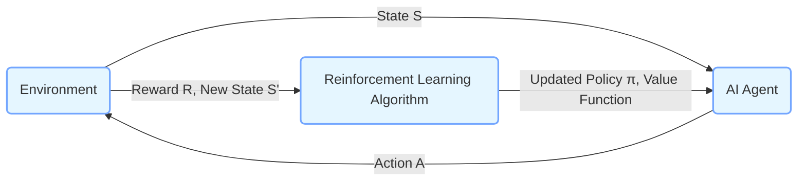

# 强化学习在AI Agent交互式学习中的应用

> 关键词：强化学习、AI Agent、交互式学习、马尔可夫决策过程、策略梯度算法

> 摘要：本文深入探讨了强化学习在AI Agent交互式学习中的应用。首先介绍了强化学习和AI Agent交互式学习的背景知识，包括其目的、预期读者和文档结构。接着详细阐述了核心概念，如马尔可夫决策过程、策略、价值函数等，并给出了相应的原理和架构示意图以及Mermaid流程图。核心算法原理部分使用Python源代码详细讲解了策略梯度算法等。同时介绍了相关的数学模型和公式，并通过举例进行说明。在项目实战中，展示了开发环境搭建、源代码实现及代码解读。还分析了强化学习在AI Agent交互式学习中的实际应用场景，推荐了学习资源、开发工具框架和相关论文著作。最后总结了未来发展趋势与挑战，并提供了常见问题解答和扩展阅读参考资料。

## 1. 背景介绍 
### 1.1 目的和范围
强化学习在AI Agent交互式学习中的应用是一个具有广泛前景的研究领域。其目的在于让AI Agent能够在与环境的交互过程中，通过不断地尝试和学习，自主地找到最优的行为策略，以实现特定的目标。本文章的范围涵盖了强化学习的基本概念、核心算法、数学模型，以及如何将其应用于AI Agent的交互式学习中，同时通过实际案例展示其应用效果。

### 1.2 预期读者
本文预期读者包括对人工智能、机器学习，特别是强化学习感兴趣的研究人员、工程师、学生等。无论是初学者希望了解强化学习的基本原理，还是有一定经验的开发者想要深入研究其在AI Agent交互式学习中的应用，都能从本文中获得有价值的信息。

### 1.3 文档结构概述
本文首先介绍强化学习和AI Agent交互式学习的背景知识，包括相关术语的定义。然后详细讲解核心概念及其联系，给出原理和架构示意图。接着阐述核心算法原理并使用Python代码进行说明，介绍相关的数学模型和公式。通过项目实战展示如何在实际中应用强化学习进行AI Agent的交互式学习。之后分析实际应用场景，推荐学习资源、开发工具框架和相关论文著作。最后总结未来发展趋势与挑战，提供常见问题解答和扩展阅读参考资料。

### 1.4 术语表
#### 1.4.1 核心术语定义
- **强化学习（Reinforcement Learning）**：一种机器学习范式，智能体通过与环境进行交互，根据环境反馈的奖励信号来学习最优的行为策略。
- **AI Agent**：能够感知环境、做出决策并执行动作的智能实体，在强化学习中，它通过不断地与环境交互来学习。
- **交互式学习（Interactive Learning）**：智能体在与环境的实时交互过程中进行学习，根据环境的反馈动态调整自己的行为。
- **马尔可夫决策过程（Markov Decision Process, MDP）**：一种用于描述强化学习问题的数学模型，由状态、动作、状态转移概率、奖励函数等要素组成。
- **策略（Policy）**：智能体在给定状态下选择动作的规则，通常表示为 $\pi(a|s)$，即在状态 $s$ 下选择动作 $a$ 的概率。
- **价值函数（Value Function）**：用于评估状态或状态 - 动作对的价值，常见的有状态价值函数 $V(s)$ 和动作价值函数 $Q(s,a)$。

#### 1.4.2 相关概念解释
- **奖励信号（Reward Signal）**：环境在智能体执行动作后给予的反馈，用于指导智能体的学习。正奖励表示该动作是有益的，负奖励表示该动作是不利的。
- **探索与利用（Exploration vs. Exploitation）**：在强化学习中，智能体需要在探索新的动作以发现更好的策略和利用已有的经验之间进行平衡。
- **折扣因子（Discount Factor）**：在计算累积奖励时，用于对未来奖励进行折扣的系数，通常用 $\gamma$ 表示，取值范围为 $[0,1]$。

#### 1.4.3 缩略词列表
- **MDP**：Markov Decision Process（马尔可夫决策过程）
- **Q - learning**：一种无模型的强化学习算法
- **PG**：Policy Gradient（策略梯度）
- **A2C**：Advantage Actor - Critic（优势演员 - 评论家）
- **PPO**：Proximal Policy Optimization（近端策略优化）

## 2. 核心概念与联系 

### 核心概念原理

#### 马尔可夫决策过程（MDP）
马尔可夫决策过程是强化学习中最基本的数学模型，它满足马尔可夫性质，即智能体在某一时刻的状态只与前一时刻的状态和动作有关，而与更早的历史无关。一个MDP可以用一个五元组 $\langle S, A, P, R, \gamma \rangle$ 来表示：
- $S$ 是状态空间，表示智能体可能处于的所有状态的集合。
- $A$ 是动作空间，表示智能体可以执行的所有动作的集合。
- $P(s'|s,a)$ 是状态转移概率，表示在状态 $s$ 下执行动作 $a$ 后转移到状态 $s'$ 的概率。
- $R(s,a,s')$ 是奖励函数，表示在状态 $s$ 下执行动作 $a$ 并转移到状态 $s'$ 时获得的即时奖励。
- $\gamma$ 是折扣因子，用于对未来奖励进行折扣，以反映智能体对即时奖励和未来奖励的偏好。

#### 策略（Policy）
策略 $\pi$ 定义了智能体在给定状态下选择动作的方式。它可以是确定性策略，即 $\pi(s)$ 直接给出在状态 $s$ 下应该执行的动作；也可以是随机性策略，即 $\pi(a|s)$ 表示在状态 $s$ 下选择动作 $a$ 的概率。智能体的目标是学习一个最优策略 $\pi^*$，使得在该策略下获得的累积奖励最大。

#### 价值函数（Value Function）
价值函数用于评估状态或状态 - 动作对的价值。状态价值函数 $V^{\pi}(s)$ 表示在策略 $\pi$ 下，从状态 $s$ 开始所能获得的期望累积折扣奖励：
$$V^{\pi}(s) = \mathbb{E}_{\pi}\left[\sum_{t=0}^{\infty} \gamma^t R_{t+1} | S_0 = s\right]$$
动作价值函数 $Q^{\pi}(s,a)$ 表示在策略 $\pi$ 下，从状态 $s$ 执行动作 $a$ 后所能获得的期望累积折扣奖励：
$$Q^{\pi}(s,a) = \mathbb{E}_{\pi}\left[\sum_{t=0}^{\infty} \gamma^t R_{t+1} | S_0 = s, A_0 = a\right]$$

### 架构的文本示意图
```plaintext
+-----------------+       +-----------------+       +-----------------+
|    Environment  | <---- |     AI Agent    | <---- |   Reinforcement |
|                 |       |                 |       |    Learning     |
|  State (S)      |       |  Policy (π)     |       |   Algorithm     |
|  Reward (R)     |       |  Action (A)     |       |                 |
|  State Transfer |       |  Value Function |       |                 |
+-----------------+       +-----------------+       +-----------------+
```
这个示意图展示了强化学习中环境、AI Agent和强化学习算法之间的交互关系。AI Agent根据当前环境的状态 $S$，通过策略 $\pi$ 选择动作 $A$ 并执行，环境根据动作给出新的状态 $S'$ 和奖励 $R$，强化学习算法根据这些信息更新策略 $\pi$ 和价值函数。

### Mermaid流程图

该流程图清晰地展示了强化学习的基本流程：环境向AI Agent提供状态，AI Agent根据策略选择动作并作用于环境，环境返回奖励和新的状态，强化学习算法根据这些信息更新策略和价值函数。

## 3. 核心算法原理 & 具体操作步骤 

### 策略梯度算法原理
策略梯度算法是一类直接对策略进行优化的强化学习算法。其核心思想是通过估计策略的梯度，然后沿着梯度上升的方向更新策略参数，以最大化累积奖励。

设策略 $\pi_{\theta}(a|s)$ 由参数 $\theta$ 表示，目标是最大化期望累积奖励 $J(\theta)$：
$$J(\theta) = \mathbb{E}_{\tau \sim \pi_{\theta}} \left[\sum_{t=0}^{T} r_t\right]$$
其中 $\tau = (s_0, a_0, r_0, s_1, a_1, r_1, \cdots, s_T, a_T, r_T)$ 是一个轨迹，$r_t$ 是时刻 $t$ 的奖励。

根据策略梯度定理，策略梯度可以表示为：
$$\nabla_{\theta} J(\theta) = \mathbb{E}_{\tau \sim \pi_{\theta}} \left[\sum_{t=0}^{T} \nabla_{\theta} \log \pi_{\theta}(a_t|s_t) \sum_{k=t}^{T} \gamma^{k-t} r_k\right]$$

### Python源代码实现
```python
import torch
import torch.nn as nn
import torch.optim as optim
import numpy as np

# 定义策略网络
class PolicyNetwork(nn.Module):
    def __init__(self, input_dim, output_dim):
        super(PolicyNetwork, self).__init__()
        self.fc1 = nn.Linear(input_dim, 128)
        self.fc2 = nn.Linear(128, output_dim)
        self.softmax = nn.Softmax(dim=-1)

    def forward(self, x):
        x = torch.relu(self.fc1(x))
        x = self.fc2(x)
        probs = self.softmax(x)
        return probs

# 定义策略梯度算法类
class PolicyGradient:
    def __init__(self, input_dim, output_dim, learning_rate=0.001, gamma=0.99):
        self.policy_network = PolicyNetwork(input_dim, output_dim)
        self.optimizer = optim.Adam(self.policy_network.parameters(), lr=learning_rate)
        self.gamma = gamma
        self.states = []
        self.actions = []
        self.rewards = []

    def select_action(self, state):
        state = torch.FloatTensor(state).unsqueeze(0)
        probs = self.policy_network(state)
        action = torch.multinomial(probs, 1).item()
        return action

    def store_transition(self, state, action, reward):
        self.states.append(state)
        self.actions.append(action)
        self.rewards.append(reward)

    def update(self):
        states = torch.FloatTensor(self.states)
        actions = torch.LongTensor(self.actions)
        rewards = np.array(self.rewards)

        # 计算累积折扣奖励
        discounted_rewards = []
        running_reward = 0
        for r in reversed(rewards):
            running_reward = r + self.gamma * running_reward
            discounted_rewards.insert(0, running_reward)
        discounted_rewards = torch.FloatTensor(discounted_rewards)

        # 归一化累积折扣奖励
        discounted_rewards = (discounted_rewards - discounted_rewards.mean()) / (discounted_rewards.std() + 1e-7)

        # 计算策略梯度
        probs = self.policy_network(states)
        log_probs = torch.log(probs.gather(1, actions.unsqueeze(1)).squeeze(1))
        loss = -(log_probs * discounted_rewards).mean()

        # 更新策略网络
        self.optimizer.zero_grad()
        loss.backward()
        self.optimizer.step()

        # 清空存储的转换
        self.states = []
        self.actions = []
        self.rewards = []
```

### 具体操作步骤
1. **初始化策略网络和优化器**：使用 `PolicyNetwork` 定义策略网络，使用 `Adam` 优化器进行参数更新。
2. **选择动作**：在每个时间步，智能体根据当前状态调用 `select_action` 方法选择动作。
3. **存储转换**：将当前状态、动作和奖励存储在 `states`、`actions` 和 `rewards` 列表中。
4. **更新策略**：当一个回合结束时，调用 `update` 方法计算累积折扣奖励，计算策略梯度并更新策略网络的参数。

## 4. 数学模型和公式 & 详细讲解 & 举例说明 

### 马尔可夫决策过程（MDP）公式
如前所述，一个MDP由五元组 $\langle S, A, P, R, \gamma \rangle$ 表示。状态转移概率 $P(s'|s,a)$ 满足以下性质：
$$\sum_{s' \in S} P(s'|s,a) = 1, \forall s \in S, a \in A$$
这意味着从任何状态 $s$ 执行动作 $a$ 后，转移到所有可能状态的概率之和为 1。

奖励函数 $R(s,a,s')$ 可以根据具体的问题进行定义。例如，在一个简单的迷宫问题中，如果智能体到达终点状态，奖励为 1；如果撞到墙壁，奖励为 -1；否则奖励为 0。

### 价值函数公式
状态价值函数 $V^{\pi}(s)$ 可以通过贝尔曼方程进行递归定义：
$$V^{\pi}(s) = \sum_{a \in A} \pi(a|s) \sum_{s' \in S} P(s'|s,a) [R(s,a,s') + \gamma V^{\pi}(s')]$$
这个方程表示，状态 $s$ 的价值等于在策略 $\pi$ 下选择所有可能动作的期望奖励，加上下一个状态的折扣价值。

动作价值函数 $Q^{\pi}(s,a)$ 的贝尔曼方程为：
$$Q^{\pi}(s,a) = \sum_{s' \in S} P(s'|s,a) [R(s,a,s') + \gamma \sum_{a' \in A} \pi(a'|s') Q^{\pi}(s',a')]$$

### 策略梯度公式
策略梯度 $\nabla_{\theta} J(\theta)$ 的公式为：
$$\nabla_{\theta} J(\theta) = \mathbb{E}_{\tau \sim \pi_{\theta}} \left[\sum_{t=0}^{T} \nabla_{\theta} \log \pi_{\theta}(a_t|s_t) \sum_{k=t}^{T} \gamma^{k-t} r_k\right]$$
其中 $\nabla_{\theta} \log \pi_{\theta}(a_t|s_t)$ 是策略的对数似然梯度，$\sum_{k=t}^{T} \gamma^{k-t} r_k$ 是从时刻 $t$ 开始的累积折扣奖励。

### 举例说明
考虑一个简单的二维网格世界问题，智能体可以在网格中上下左右移动。状态 $s$ 表示智能体在网格中的位置，动作 $a$ 表示上下左右四个方向。假设智能体的目标是从起点移动到终点，到达终点获得奖励 10，每移动一步消耗奖励 -1。

设策略网络是一个简单的神经网络，输入是智能体的位置，输出是四个动作的概率。在每个时间步，智能体根据策略网络输出的概率选择动作，并更新状态和奖励。当一个回合结束时，根据策略梯度算法更新策略网络的参数，使得智能体能够更快地找到到达终点的路径。

## 5. 项目实战：代码实际案例和详细解释说明 

### 5.1  开发环境搭建
#### 安装Python
首先需要安装Python，建议使用Python 3.7及以上版本。可以从Python官方网站（https://www.python.org/downloads/）下载安装包进行安装。

#### 安装依赖库
使用 `pip` 安装必要的依赖库，包括 `torch`、`numpy` 等：
```sh
pip install torch numpy
```

### 5.2  源代码详细实现和代码解读
```python
import torch
import torch.nn as nn
import torch.optim as optim
import numpy as np
import gym

# 定义策略网络
class PolicyNetwork(nn.Module):
    def __init__(self, input_dim, output_dim):
        super(PolicyNetwork, self).__init__()
        self.fc1 = nn.Linear(input_dim, 128)
        self.fc2 = nn.Linear(128, output_dim)
        self.softmax = nn.Softmax(dim=-1)

    def forward(self, x):
        x = torch.relu(self.fc1(x))
        x = self.fc2(x)
        probs = self.softmax(x)
        return probs

# 定义策略梯度算法类
class PolicyGradient:
    def __init__(self, input_dim, output_dim, learning_rate=0.001, gamma=0.99):
        self.policy_network = PolicyNetwork(input_dim, output_dim)
        self.optimizer = optim.Adam(self.policy_network.parameters(), lr=learning_rate)
        self.gamma = gamma
        self.states = []
        self.actions = []
        self.rewards = []

    def select_action(self, state):
        state = torch.FloatTensor(state).unsqueeze(0)
        probs = self.policy_network(state)
        action = torch.multinomial(probs, 1).item()
        return action

    def store_transition(self, state, action, reward):
        self.states.append(state)
        self.actions.append(action)
        self.rewards.append(reward)

    def update(self):
        states = torch.FloatTensor(self.states)
        actions = torch.LongTensor(self.actions)
        rewards = np.array(self.rewards)

        # 计算累积折扣奖励
        discounted_rewards = []
        running_reward = 0
        for r in reversed(rewards):
            running_reward = r + self.gamma * running_reward
            discounted_rewards.insert(0, running_reward)
        discounted_rewards = torch.FloatTensor(discounted_rewards)

        # 归一化累积折扣奖励
        discounted_rewards = (discounted_rewards - discounted_rewards.mean()) / (discounted_rewards.std() + 1e-7)

        # 计算策略梯度
        probs = self.policy_network(states)
        log_probs = torch.log(probs.gather(1, actions.unsqueeze(1)).squeeze(1))
        loss = -(log_probs * discounted_rewards).mean()

        # 更新策略网络
        self.optimizer.zero_grad()
        loss.backward()
        self.optimizer.step()

        # 清空存储的转换
        self.states = []
        self.actions = []
        self.rewards = []

# 主训练循环
def train():
    env = gym.make('CartPole-v1')
    input_dim = env.observation_space.shape[0]
    output_dim = env.action_space.n
    agent = PolicyGradient(input_dim, output_dim)

    num_episodes = 1000
    for episode in range(num_episodes):
        state = env.reset()
        total_reward = 0
        done = False

        while not done:
            action = agent.select_action(state)
            next_state, reward, done, _ = env.step(action)
            agent.store_transition(state, action, reward)
            state = next_state
            total_reward += reward

        agent.update()
        print(f'Episode {episode + 1}: Total Reward = {total_reward}')

    env.close()

if __name__ == "__main__":
    train()
```

### 5.3  代码解读与分析
#### 策略网络定义
`PolicyNetwork` 类定义了一个简单的两层神经网络，用于表示策略。输入层接收环境的状态，经过一个全连接层和ReLU激活函数，再经过另一个全连接层和Softmax激活函数，输出每个动作的概率。

#### 策略梯度算法类
`PolicyGradient` 类实现了策略梯度算法的核心逻辑。`select_action` 方法根据当前状态选择动作，`store_transition` 方法存储当前状态、动作和奖励，`update` 方法计算累积折扣奖励，计算策略梯度并更新策略网络的参数。

#### 主训练循环
`train` 函数是主训练循环，使用OpenAI Gym库中的 `CartPole-v1` 环境进行训练。在每个回合中，智能体与环境进行交互，存储转换信息，当回合结束时更新策略网络。

通过不断地训练，智能体能够学习到最优的策略，使得在 `CartPole-v1` 环境中保持杆子的平衡时间越来越长。

## 6. 实际应用场景 
### 游戏领域
在游戏中，强化学习可以用于训练AI Agent来玩各种游戏，如围棋、象棋、电子竞技游戏等。例如，AlphaGo通过强化学习在围棋领域取得了巨大的成功，击败了人类顶尖棋手。在电子竞技游戏中，AI Agent可以通过与环境的交互学习到最优的策略，提高游戏水平。

### 机器人控制
在机器人控制中，强化学习可以用于训练机器人完成各种任务，如导航、抓取物体、协作等。机器人通过与环境的交互，根据环境的反馈调整自己的动作，学习到最优的控制策略。例如，在机器人导航中，AI Agent可以学习到如何避开障碍物，快速到达目标位置。

### 自动驾驶
在自动驾驶领域，强化学习可以用于训练自动驾驶汽车的决策系统。自动驾驶汽车需要在复杂的交通环境中做出决策，如加速、减速、转弯等。通过强化学习，AI Agent可以学习到如何根据不同的交通状况做出最优的决策，提高自动驾驶的安全性和效率。

### 资源管理
在云计算、数据中心等领域，强化学习可以用于资源管理，如服务器的调度、能源的分配等。通过与环境的交互，AI Agent可以学习到如何根据不同的负载情况和资源需求，合理地分配资源，提高资源的利用率和系统的性能。

## 7. 工具和资源推荐
### 7.1 学习资源推荐
#### 7.1.1 书籍推荐
- 《Reinforcement Learning: An Introduction》（Richard S. Sutton和Andrew G. Barto著）：这是强化学习领域的经典教材，全面介绍了强化学习的基本概念、算法和应用。
- 《Deep Reinforcement Learning Hands-On》（Max Lapan著）：这本书结合了深度学习和强化学习的知识，通过实际案例介绍了如何使用深度学习框架实现强化学习算法。

#### 7.1.2 在线课程
- Coursera上的《Reinforcement Learning Specialization》：由Richard S. Sutton等教授授课，系统地介绍了强化学习的理论和实践。
- Udemy上的《Complete Reinforcement Learning Course with Python》：通过Python代码实现强化学习算法，适合初学者学习。

#### 7.1.3 技术博客和网站
- OpenAI博客（https://openai.com/blog/）：OpenAI团队发布的关于人工智能、强化学习等领域的最新研究成果和技术文章。
- DeepMind博客（https://deepmind.com/blog/）：DeepMind团队发布的关于人工智能、强化学习等领域的研究进展和应用案例。

### 7.2 开发工具框架推荐
#### 7.2.1 IDE和编辑器
- PyCharm：一款功能强大的Python集成开发环境，提供了代码编辑、调试、版本控制等功能，适合开发强化学习项目。
- Jupyter Notebook：一种交互式的开发环境，支持Python代码的编写和运行，方便进行数据分析和模型训练。

#### 7.2.2 调试和性能分析工具
- TensorBoard：TensorFlow提供的可视化工具，可以用于监控模型的训练过程，如损失函数、准确率等指标的变化。
- PyTorch Profiler：PyTorch提供的性能分析工具，可以用于分析模型的运行时间、内存使用等情况，帮助优化代码性能。

#### 7.2.3 相关框架和库
- OpenAI Gym：一个用于开发和比较强化学习算法的工具包，提供了各种不同类型的环境，方便进行算法的测试和验证。
- Stable Baselines3：一个基于PyTorch的强化学习库，提供了多种预训练的强化学习算法，方便快速实现和应用。

### 7.3 相关论文著作推荐
#### 7.3.1 经典论文
- “Policy Gradient Methods for Reinforcement Learning with Function Approximation”（Richard S. Sutton等著）：这篇论文提出了策略梯度算法，为直接优化策略提供了理论基础。
- “Playing Atari with Deep Reinforcement Learning”（Volodymyr Mnih等著）：这篇论文提出了深度Q网络（DQN）算法，将深度学习和强化学习相结合，在Atari游戏中取得了很好的效果。

#### 7.3.2 最新研究成果
- “Proximal Policy Optimization Algorithms”（John Schulman等著）：这篇论文提出了近端策略优化（PPO）算法，是一种高效的策略梯度算法，在很多领域得到了广泛应用。
- “Soft Actor-Critic: Off-Policy Maximum Entropy Deep Reinforcement Learning with a Stochastic Actor”（Tuomas Haarnoja等著）：这篇论文提出了软演员 - 评论家（SAC）算法，结合了最大熵原理和离线策略学习，提高了算法的稳定性和性能。

#### 7.3.3 应用案例分析
- “Mastering the Game of Go with Deep Neural Networks and Tree Search”（David Silver等著）：这篇论文介绍了AlphaGo的实现原理和方法，展示了强化学习在围棋领域的成功应用。
- “End-to-End Learning of Driving Models from Large-Scale Video Datasets”（Fisher Yu等著）：这篇论文介绍了如何使用强化学习实现端到端的自动驾驶模型，展示了强化学习在自动驾驶领域的应用潜力。

## 8. 总结：未来发展趋势与挑战
### 未来发展趋势
- **多智能体强化学习**：随着人工智能的发展，多个智能体之间的协作和竞争将成为一个重要的研究方向。多智能体强化学习可以用于解决复杂的任务，如团队协作游戏、交通流量控制等。
- **深度强化学习与其他技术的融合**：深度强化学习可以与计算机视觉、自然语言处理等技术相结合，实现更加复杂和智能的应用，如智能机器人、智能客服等。
- **强化学习在现实世界中的应用拓展**：强化学习将在更多的领域得到应用，如医疗保健、金融、教育等，为这些领域带来新的解决方案和发展机遇。

### 挑战
- **样本效率问题**：强化学习通常需要大量的样本进行训练，这在实际应用中可能会受到时间和资源的限制。提高样本效率是强化学习面临的一个重要挑战。
- **环境建模问题**：在复杂的现实环境中，准确地建模环境是非常困难的。环境的不确定性和动态性会影响强化学习算法的性能。
- **可解释性问题**：深度强化学习模型通常是黑盒模型，难以解释其决策过程和行为。提高模型的可解释性是强化学习在实际应用中需要解决的一个重要问题。

## 9. 附录：常见问题与解答
### 问题1：强化学习和监督学习有什么区别？
强化学习和监督学习是两种不同的机器学习范式。监督学习需要有标注好的训练数据，模型的目标是学习输入和输出之间的映射关系。而强化学习没有明确的标注数据，智能体通过与环境的交互，根据环境反馈的奖励信号来学习最优的行为策略。

### 问题2：策略梯度算法和Q - learning算法有什么区别？
策略梯度算法是直接对策略进行优化的算法，通过估计策略的梯度来更新策略参数。而Q - learning算法是一种基于值函数的算法，通过学习动作价值函数 $Q(s,a)$ 来选择最优动作。策略梯度算法更适合处理连续动作空间的问题，而Q - learning算法更适合处理离散动作空间的问题。

### 问题3：如何解决强化学习中的探索与利用问题？
可以采用多种方法来解决探索与利用问题，如 $\epsilon$ - 贪心策略、玻尔兹曼探索等。$\epsilon$ - 贪心策略在一定概率 $\epsilon$ 下随机选择动作进行探索，在 $1 - \epsilon$ 的概率下选择当前最优动作进行利用。玻尔兹曼探索根据动作的价值函数计算动作的选择概率，价值越高的动作被选择的概率越大。

## 10. 扩展阅读 & 参考资料
- Richard S. Sutton, Andrew G. Barto. Reinforcement Learning: An Introduction. The MIT Press, 2018.
- Max Lapan. Deep Reinforcement Learning Hands-On. Packt Publishing, 2018.
- OpenAI Gym官方文档（https://gym.openai.com/docs/）
- Stable Baselines3官方文档（https://stable-baselines3.readthedocs.io/en/master/）

作者：AI天才研究院/AI Genius Institute & 禅与计算机程序设计艺术 /Zen And The Art of Computer Programming