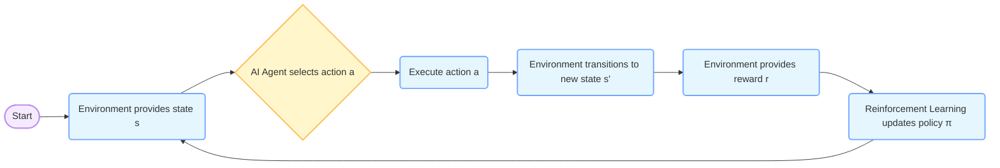

# 强化学习在AI Agent交互策略中的应用

> 关键词：强化学习、AI Agent、交互策略、马尔可夫决策过程、Q学习

> 摘要：本文深入探讨了强化学习在AI Agent交互策略中的应用。首先介绍了强化学习和AI Agent的背景知识，包括目的、预期读者、文档结构和相关术语。接着阐述了核心概念及其联系，通过文本示意图和Mermaid流程图进行清晰展示。详细讲解了核心算法原理，使用Python代码进行具体操作步骤的说明。引入数学模型和公式，并举例说明。通过项目实战，展示了开发环境搭建、源代码实现与解读。分析了实际应用场景，推荐了学习资源、开发工具框架和相关论文著作。最后总结了未来发展趋势与挑战，提供了常见问题解答和扩展阅读参考资料，旨在为读者全面呈现强化学习在AI Agent交互策略领域的应用全貌。

## 1. 背景介绍 
### 1.1 目的和范围
强化学习作为机器学习的一个重要分支，在AI Agent交互策略中有着广泛且关键的应用。本文章的目的在于全面深入地探讨强化学习如何应用于AI Agent的交互策略设计与优化。我们将详细介绍强化学习的基本概念、核心算法、数学模型，通过具体的Python代码示例展示其在实际项目中的应用，同时分析强化学习在不同实际场景下的应用方式。范围涵盖了从理论基础到实际应用的多个层面，旨在为读者提供一个系统、完整的知识体系，使其能够深入理解强化学习在AI Agent交互策略中的应用原理和方法。

### 1.2 预期读者
本文预期读者包括但不限于计算机科学、人工智能相关专业的学生，他们可以通过阅读本文深入学习强化学习和AI Agent的相关知识，为后续的研究和学习打下坚实的基础；对人工智能技术有深入研究需求的科研人员，能够从文中获取最新的研究思路和方法，为其科研工作提供参考；以及从事AI相关项目开发的工程师，他们可以借鉴文中的项目实战案例和代码实现，优化自己的项目开发。

### 1.3 文档结构概述
本文将按照以下结构进行组织：首先介绍背景知识，包括目的、预期读者、文档结构和术语表；接着阐述强化学习和AI Agent的核心概念及其联系，通过文本示意图和Mermaid流程图进行清晰展示；详细讲解核心算法原理，使用Python代码进行具体操作步骤的说明；引入数学模型和公式，并举例说明；通过项目实战，展示开发环境搭建、源代码实现与解读；分析实际应用场景；推荐学习资源、开发工具框架和相关论文著作；最后总结未来发展趋势与挑战，提供常见问题解答和扩展阅读参考资料。

### 1.4 术语表
#### 1.4.1 核心术语定义
- **强化学习（Reinforcement Learning）**：一种机器学习方法，智能体（Agent）通过与环境进行交互，根据环境反馈的奖励信号来学习最优的行为策略，以最大化长期累积奖励。
- **AI Agent（人工智能智能体）**：能够感知环境、进行决策并采取行动的人工智能实体，其目标是在特定环境中实现某种任务或达到某种目标。
- **策略（Policy）**：智能体在每个状态下选择动作的规则，通常用 $\pi(s)$ 表示，其中 $s$ 为状态。
- **奖励（Reward）**：环境在智能体执行某个动作后给予的反馈信号，用于衡量该动作的好坏，智能体的目标是最大化长期累积奖励。
- **状态（State）**：环境的一种表示，描述了智能体当前所处的情境，智能体根据状态来选择动作。

#### 1.4.2 相关概念解释
- **马尔可夫决策过程（Markov Decision Process, MDP）**：是强化学习的数学基础，由状态集合 $S$、动作集合 $A$、状态转移概率 $P(s'|s,a)$、奖励函数 $R(s,a)$ 和折扣因子 $\gamma$ 组成。马尔可夫性指的是未来状态只依赖于当前状态和当前动作，而与过去的状态和动作无关。
- **价值函数（Value Function）**：用于评估某个状态或状态 - 动作对的价值。状态价值函数 $V(s)$ 表示从状态 $s$ 开始，遵循某个策略 $\pi$ 所能获得的期望累积奖励；动作价值函数 $Q(s,a)$ 表示在状态 $s$ 下执行动作 $a$，并遵循策略 $\pi$ 所能获得的期望累积奖励。

#### 1.4.3 缩略词列表
- **MDP**：Markov Decision Process（马尔可夫决策过程）
- **Q - learning**：Q学习，一种无模型的强化学习算法
- **SARSA**：State - Action - Reward - State - Action，一种在线的强化学习算法

## 2. 核心概念与联系 

### 核心概念原理
#### 强化学习
强化学习的核心思想是智能体通过与环境进行交互，不断尝试不同的动作，并根据环境给予的奖励信号来学习最优的行为策略。智能体在每个时间步 $t$ 感知环境的状态 $s_t$，根据当前策略 $\pi$ 选择一个动作 $a_t$ 执行，环境在接收到动作后转移到新的状态 $s_{t + 1}$，并给予智能体一个奖励 $r_{t+1}$。智能体的目标是找到一个策略 $\pi$，使得长期累积奖励最大化。

#### AI Agent
AI Agent 是一个能够自主感知环境、进行决策并采取行动的实体。在强化学习的框架下，AI Agent 根据环境的状态信息，使用学习到的策略选择合适的动作，以实现特定的目标。例如，在游戏环境中，AI Agent 可以根据游戏画面的状态信息（如角色位置、敌人位置等）选择移动、攻击等动作。

### 架构的文本示意图
```plaintext
+-----------------+       +-----------------+       +-----------------+
|     Environment |       |      AI Agent   |       |   Reinforcement |
|                 | <---- |                 | ----> |     Learning    |
|                 |       |                 |       |                 |
|  State (s)      |       |  Select Action  |       |  Learn Policy   |
|  Reward (r)     |       |  (a) based on   |       |  (π) based on   |
|  State Transition |     |  Policy (π)     |       |  Rewards (r)    |
+-----------------+       +-----------------+       +-----------------+
```
这个示意图展示了环境、AI Agent 和强化学习之间的交互关系。环境提供状态和奖励信息给 AI Agent，AI Agent 根据当前策略选择动作并执行，强化学习模块根据奖励信号学习和更新策略。

### Mermaid 流程图

该流程图展示了强化学习的基本循环过程：环境提供状态，AI Agent 选择动作并执行，环境更新状态并给予奖励，强化学习模块根据奖励更新策略，然后循环继续。

## 3. 核心算法原理 & 具体操作步骤 

### Q - learning 算法原理
Q - learning 是一种无模型的强化学习算法，它通过学习动作价值函数 $Q(s,a)$ 来找到最优策略。动作价值函数 $Q(s,a)$ 表示在状态 $s$ 下执行动作 $a$ 所能获得的期望累积奖励。Q - learning 的更新公式如下：
$$Q(s,a) \leftarrow Q(s,a)+\alpha\left[r + \gamma\max_{a'}Q(s',a')-Q(s,a)\right]$$
其中，$\alpha$ 是学习率，控制每次更新的步长；$\gamma$ 是折扣因子，用于平衡即时奖励和未来奖励；$r$ 是执行动作 $a$ 后环境给予的即时奖励；$s'$ 是执行动作 $a$ 后环境转移到的新状态。

### 具体操作步骤
1. **初始化**：初始化动作价值函数 $Q(s,a)$ 为任意值，通常初始化为 0。设置学习率 $\alpha$、折扣因子 $\gamma$ 和探索率 $\epsilon$。
2. **循环执行以下步骤直到达到终止条件**：
    - **选择动作**：根据当前状态 $s$，使用 $\epsilon$ - 贪心策略选择动作 $a$。以概率 $\epsilon$ 随机选择一个动作，以概率 $1 - \epsilon$ 选择 $Q(s,a)$ 值最大的动作。
    - **执行动作**：执行选择的动作 $a$，环境转移到新的状态 $s'$，并给予奖励 $r$。
    - **更新 Q 值**：根据 Q - learning 更新公式更新 $Q(s,a)$。
    - **更新状态**：将当前状态 $s$ 更新为新状态 $s'$。

### Python 代码实现
```python
import numpy as np

# 定义环境参数
num_states = 5
num_actions = 2
alpha = 0.1
gamma = 0.9
epsilon = 0.1
num_episodes = 100

# 初始化 Q 表
Q = np.zeros((num_states, num_actions))

# 定义环境
def get_reward(state, action):
    # 简单示例，根据状态和动作返回奖励
    if state == 3 and action == 1:
        return 1
    return 0

def get_next_state(state, action):
    # 简单示例，根据状态和动作返回下一个状态
    if action == 0:
        return max(0, state - 1)
    else:
        return min(num_states - 1, state + 1)

# Q - learning 算法
for episode in range(num_episodes):
    state = 0
    done = False
    while not done:
        # epsilon - 贪心策略选择动作
        if np.random.uniform(0, 1) < epsilon:
            action = np.random.choice(num_actions)
        else:
            action = np.argmax(Q[state, :])
        
        # 执行动作
        reward = get_reward(state, action)
        next_state = get_next_state(state, action)
        
        # 更新 Q 值
        Q[state, action] = Q[state, action] + alpha * (reward + gamma * np.max(Q[next_state, :]) - Q[state, action])
        
        # 更新状态
        state = next_state
        
        # 判断是否终止
        if state == num_states - 1:
            done = True

print("Final Q table:")
print(Q)
```
### 代码解释
1. **初始化**：初始化状态数 `num_states`、动作数 `num_actions`、学习率 `alpha`、折扣因子 `gamma`、探索率 `epsilon` 和训练轮数 `num_episodes`。初始化 Q 表 `Q` 为全 0 矩阵。
2. **定义环境**：定义 `get_reward` 函数用于根据状态和动作返回奖励，定义 `get_next_state` 函数用于根据状态和动作返回下一个状态。
3. **Q - learning 训练**：在每个训练轮次中，初始化状态为 0，使用 $\epsilon$ - 贪心策略选择动作，执行动作并获取奖励和下一个状态，根据 Q - learning 更新公式更新 Q 表，更新状态，直到达到终止状态。
4. **输出结果**：训练结束后，输出最终的 Q 表。

## 4. 数学模型和公式 & 详细讲解 & 举例说明 

### 马尔可夫决策过程（MDP）
马尔可夫决策过程是强化学习的数学基础，它可以用一个五元组 $(S,A,P,R,\gamma)$ 来表示，其中：
- $S$ 是状态集合，表示环境的所有可能状态。
- $A$ 是动作集合，表示智能体可以执行的所有动作。
- $P(s'|s,a)$ 是状态转移概率，表示在状态 $s$ 下执行动作 $a$ 后转移到状态 $s'$ 的概率。
- $R(s,a)$ 是奖励函数，表示在状态 $s$ 下执行动作 $a$ 后获得的即时奖励。
- $\gamma$ 是折扣因子，取值范围为 $[0,1]$，用于平衡即时奖励和未来奖励。

### 价值函数
#### 状态价值函数
状态价值函数 $V^\pi(s)$ 表示从状态 $s$ 开始，遵循策略 $\pi$ 所能获得的期望累积奖励，定义如下：
$$V^\pi(s)=\mathbb{E}_\pi\left[\sum_{t = 0}^{\infty}\gamma^t r_{t+1}|s_0 = s\right]$$
其中，$\mathbb{E}_\pi$ 表示在策略 $\pi$ 下的期望，$r_{t+1}$ 是在时间步 $t$ 执行动作后获得的奖励。

#### 动作价值函数
动作价值函数 $Q^\pi(s,a)$ 表示在状态 $s$ 下执行动作 $a$，并遵循策略 $\pi$ 所能获得的期望累积奖励，定义如下：
$$Q^\pi(s,a)=\mathbb{E}_\pi\left[\sum_{t = 0}^{\infty}\gamma^t r_{t+1}|s_0 = s,a_0 = a\right]$$

### 贝尔曼方程
#### 状态价值函数的贝尔曼方程
状态价值函数 $V^\pi(s)$ 满足贝尔曼方程：
$$V^\pi(s)=\sum_{a\in A}\pi(a|s)\left[R(s,a)+\gamma\sum_{s'\in S}P(s'|s,a)V^\pi(s')\right]$$
该方程表示当前状态的价值等于在该状态下选择所有可能动作的期望价值之和，其中每个动作的期望价值由即时奖励和下一个状态的折扣价值组成。

#### 动作价值函数的贝尔曼方程
动作价值函数 $Q^\pi(s,a)$ 满足贝尔曼方程：
$$Q^\pi(s,a)=R(s,a)+\gamma\sum_{s'\in S}P(s'|s,a)\sum_{a'\in A}\pi(a'|s')Q^\pi(s',a')$$
该方程表示在状态 $s$ 下执行动作 $a$ 的价值等于即时奖励加上下一个状态下所有可能动作的期望价值之和。

### 举例说明
考虑一个简单的格子世界环境，如下图所示：
```plaintext
+---+---+---+
| S |   | G |
+---+---+---+
```
其中，$S$ 是起始状态，$G$ 是目标状态。智能体可以选择向上、向下、向左、向右四个动作。状态集合 $S=\{S,1,2,G\}$，动作集合 $A=\{\text{up},\text{down},\text{left},\text{right}\}$。状态转移概率 $P(s'|s,a)$ 表示在状态 $s$ 下执行动作 $a$ 后转移到状态 $s'$ 的概率，例如，如果智能体在状态 $S$ 选择向右动作，那么以概率 1 转移到状态 1。奖励函数 $R(s,a)$ 表示在状态 $s$ 下执行动作 $a$ 后获得的即时奖励，例如，如果智能体到达目标状态 $G$，则获得奖励 1，否则获得奖励 0。

假设折扣因子 $\gamma = 0.9$，策略 $\pi$ 是随机策略（即每个动作的选择概率都是 0.25）。我们可以使用贝尔曼方程来计算状态价值函数 $V^\pi(s)$ 和动作价值函数 $Q^\pi(s,a)$。

例如，计算状态 $S$ 的价值 $V^\pi(S)$：
$$V^\pi(S)=\sum_{a\in A}\pi(a|S)\left[R(S,a)+\gamma\sum_{s'\in S}P(s'|S,a)V^\pi(s')\right]$$
由于在状态 $S$ 选择向左动作会撞到墙壁，状态不变，选择其他动作会转移到相邻状态，我们可以得到：
$$V^\pi(S)=0.25\times\left[0 + 0.9\times(0\times V^\pi(S)+1\times V^\pi(1)+0\times V^\pi(2)+0\times V^\pi(G))\right]+0.25\times\left[0 + 0.9\times(0\times V^\pi(S)+1\times V^\pi(1)+0\times V^\pi(2)+0\times V^\pi(G))\right]+0.25\times\left[0 + 0.9\times(1\times V^\pi(S)+0\times V^\pi(1)+0\times V^\pi(2)+0\times V^\pi(G))\right]+0.25\times\left[0 + 0.9\times(0\times V^\pi(S)+1\times V^\pi(1)+0\times V^\pi(2)+0\times V^\pi(G))\right]$$
通过迭代计算，可以得到状态 $S$ 的价值。

## 5. 项目实战：代码实际案例和详细解释说明 

### 5.1  开发环境搭建
#### 安装 Python
首先，确保你已经安装了 Python 3.x 版本。你可以从 Python 官方网站（https://www.python.org/downloads/） 下载并安装适合你操作系统的 Python 版本。

#### 安装必要的库
在本项目中，我们将使用 `numpy` 库进行数值计算。可以使用以下命令安装 `numpy`：
```sh
pip install numpy
```

### 5.2  源代码详细实现和代码解读
```python
import numpy as np

# 定义环境参数
num_states = 10
num_actions = 2
alpha = 0.1
gamma = 0.9
epsilon = 0.1
num_episodes = 500

# 初始化 Q 表
Q = np.zeros((num_states, num_actions))

# 定义环境
def get_reward(state, action):
    if state == num_states - 1 and action == 1:
        return 1
    return 0

def get_next_state(state, action):
    if action == 0:
        return max(0, state - 1)
    else:
        return min(num_states - 1, state + 1)

# Q - learning 算法
for episode in range(num_episodes):
    state = 0
    done = False
    while not done:
        # epsilon - 贪心策略选择动作
        if np.random.uniform(0, 1) < epsilon:
            action = np.random.choice(num_actions)
        else:
            action = np.argmax(Q[state, :])
        
        # 执行动作
        reward = get_reward(state, action)
        next_state = get_next_state(state, action)
        
        # 更新 Q 值
        Q[state, action] = Q[state, action] + alpha * (reward + gamma * np.max(Q[next_state, :]) - Q[state, action])
        
        # 更新状态
        state = next_state
        
        # 判断是否终止
        if state == num_states - 1:
            done = True

# 测试策略
state = 0
total_reward = 0
done = False
while not done:
    action = np.argmax(Q[state, :])
    reward = get_reward(state, action)
    next_state = get_next_state(state, action)
    total_reward += reward
    state = next_state
    if state == num_states - 1:
        done = True

print("Final Q table:")
print(Q)
print("Total reward in test:")
print(total_reward)
```

### 5.3  代码解读与分析
#### 初始化部分
```python
import numpy as np

# 定义环境参数
num_states = 10
num_actions = 2
alpha = 0.1
gamma = 0.9
epsilon = 0.1
num_episodes = 500

# 初始化 Q 表
Q = np.zeros((num_states, num_actions))
```
这部分代码导入了 `numpy` 库，定义了环境的参数，包括状态数、动作数、学习率、折扣因子、探索率和训练轮数。然后初始化了 Q 表为全 0 矩阵。

#### 环境定义部分
```python
# 定义环境
def get_reward(state, action):
    if state == num_states - 1 and action == 1:
        return 1
    return 0

def get_next_state(state, action):
    if action == 0:
        return max(0, state - 1)
    else:
        return min(num_states - 1, state + 1)
```
这部分代码定义了环境的奖励函数和状态转移函数。`get_reward` 函数根据当前状态和动作返回奖励，如果到达最后一个状态且执行动作 1，则返回奖励 1，否则返回 0。`get_next_state` 函数根据当前状态和动作返回下一个状态，如果执行动作 0，则向左移动（但不能超出边界），如果执行动作 1，则向右移动（但不能超出边界）。

#### Q - learning 训练部分
```python
# Q - learning 算法
for episode in range(num_episodes):
    state = 0
    done = False
    while not done:
        # epsilon - 贪心策略选择动作
        if np.random.uniform(0, 1) < epsilon:
            action = np.random.choice(num_actions)
        else:
            action = np.argmax(Q[state, :])
        
        # 执行动作
        reward = get_reward(state, action)
        next_state = get_next_state(state, action)
        
        # 更新 Q 值
        Q[state, action] = Q[state, action] + alpha * (reward + gamma * np.max(Q[next_state, :]) - Q[state, action])
        
        # 更新状态
        state = next_state
        
        # 判断是否终止
        if state == num_states - 1:
            done = True
```
这部分代码实现了 Q - learning 算法的训练过程。在每个训练轮次中，初始化状态为 0，使用 $\epsilon$ - 贪心策略选择动作，执行动作并获取奖励和下一个状态，根据 Q - learning 更新公式更新 Q 表，更新状态，直到达到终止状态。

#### 测试部分
```python
# 测试策略
state = 0
total_reward = 0
done = False
while not done:
    action = np.argmax(Q[state, :])
    reward = get_reward(state, action)
    next_state = get_next_state(state, action)
    total_reward += reward
    state = next_state
    if state == num_states - 1:
        done = True

print("Final Q table:")
print(Q)
print("Total reward in test:")
print(total_reward)
```
这部分代码使用训练好的 Q 表进行测试。初始化状态为 0，根据 Q 表选择动作，执行动作并获取奖励，更新状态，直到达到终止状态。最后输出最终的 Q 表和测试过程中的总奖励。

## 6. 实际应用场景 
### 游戏领域
在游戏开发中，强化学习可以用于训练 AI Agent 来实现智能的游戏策略。例如，在围棋、象棋等棋类游戏中，AI Agent 可以通过与环境（对手）进行交互，不断学习和优化自己的策略，以提高游戏胜率。在电子竞技游戏中，如《星际争霸》《英雄联盟》等，AI Agent 可以学习如何控制游戏角色进行战斗、资源管理和团队协作，为玩家带来更具挑战性的游戏体验。

### 机器人控制
在机器人领域，强化学习可以用于机器人的运动控制和任务规划。例如，机器人可以通过强化学习学习如何在复杂环境中导航，避开障碍物，到达目标位置。在机器人抓取任务中，AI Agent 可以学习如何调整机器人手臂的姿态和力度，以准确地抓取物体。

### 自动驾驶
在自动驾驶领域，强化学习可以用于训练自动驾驶车辆的决策和控制策略。自动驾驶车辆可以将周围环境的信息（如道路状况、交通信号、其他车辆位置等）作为状态，将加速、减速、转向等操作作为动作，通过与环境进行交互，学习如何在不同的交通场景下做出最优的决策，以确保行车安全和高效。

### 金融领域
在金融领域，强化学习可以用于投资组合优化和交易策略制定。AI Agent 可以将市场行情、资产价格等信息作为状态，将买入、卖出、持有等操作作为动作，通过与金融市场进行交互，学习如何在不同的市场条件下选择最优的投资组合和交易策略，以实现收益最大化和风险最小化。

## 7. 工具和资源推荐
### 7.1 学习资源推荐
#### 7.1.1 书籍推荐
- 《Reinforcement Learning: An Introduction》（第二版）：由 Richard S. Sutton 和 Andrew G. Barto 所著，是强化学习领域的经典教材，全面介绍了强化学习的基本概念、算法和应用。
- 《Deep Reinforcement Learning Hands-On》：由 Maxim Lapan 所著，通过实际案例介绍了深度强化学习的应用，适合有一定编程基础的读者。

#### 7.1.2 在线课程
- Coursera 上的《Reinforcement Learning Specialization》：由阿尔伯塔大学的教授授课，提供了系统的强化学习课程，包括理论知识和实践项目。
- edX 上的《Introduction to Reinforcement Learning》：由加州大学伯克利分校的教授授课，介绍了强化学习的基本概念和算法。

#### 7.1.3 技术博客和网站
- OpenAI Blog（https://openai.com/blog/）：OpenAI 发布的最新研究成果和技术文章，涵盖了强化学习、人工智能等多个领域。
- DeepMind Blog（https://deepmind.com/blog/）：DeepMind 发布的研究成果和技术文章，在强化学习领域有很多重要的贡献。

### 7.2 开发工具框架推荐
#### 7.2.1 IDE和编辑器
- PyCharm：一款功能强大的 Python 集成开发环境，提供了代码编辑、调试、版本控制等功能，适合开发强化学习项目。
- Jupyter Notebook：一个交互式的开发环境，可以在浏览器中编写和运行 Python 代码，方便进行数据分析和模型训练。

#### 7.2.2 调试和性能分析工具
- TensorBoard：TensorFlow 提供的可视化工具，可以用于监控模型训练过程中的损失函数、准确率等指标，帮助调试和优化模型。
- Py-Spy：一个用于分析 Python 程序性能的工具，可以帮助找出程序中的性能瓶颈。

#### 7.2.3 相关框架和库
- OpenAI Gym：一个用于开发和比较强化学习算法的工具包，提供了各种环境和基准测试，方便快速测试和验证强化学习算法。
- Stable Baselines3：一个基于 PyTorch 的强化学习库，提供了多种预训练的强化学习算法和工具，方便用户快速开发和应用强化学习模型。

### 7.3 相关论文著作推荐
#### 7.3.1 经典论文
- “Q - learning”（1992）：由 Christopher J. C. H. Watkins 和 Peter Dayan 所著，提出了 Q - learning 算法，是强化学习领域的经典论文。
- “Human - Level Control through Deep Reinforcement Learning”（2015）：由 DeepMind 团队发表在《Nature》杂志上的论文，提出了深度 Q 网络（DQN）算法，实现了在多个 Atari 游戏上达到人类水平的控制。

#### 7.3.2 最新研究成果
- “Proximal Policy Optimization Algorithms”（2017）：由 OpenAI 团队提出的近端策略优化（PPO）算法，是一种高效的策略梯度算法，在很多强化学习任务中取得了很好的效果。
- “Soft Actor - Critic: Off - Policy Maximum Entropy Deep Reinforcement Learning with a Stochastic Actor”（2018）：提出了软演员 - 评论家（SAC）算法，结合了最大熵原理和深度强化学习，在连续动作空间任务中表现出色。

#### 7.3.3 应用案例分析
- “Mastering the Game of Go without Human Knowledge”（2017）：DeepMind 团队发表的论文，介绍了 AlphaGo Zero 如何通过自我对弈和强化学习，在没有人类先验知识的情况下掌握围棋游戏。
- “Learning Agile and Dynamic Motor Skills for Legged Robots”（2018）：介绍了如何使用强化学习训练四足机器人的运动技能，使其能够在复杂地形上灵活运动。

## 8. 总结：未来发展趋势与挑战
### 未来发展趋势
#### 深度强化学习与其他技术的融合
深度强化学习将与计算机视觉、自然语言处理等技术进一步融合，实现更复杂的任务。例如，在智能机器人领域，结合计算机视觉技术，机器人可以更好地感知环境，结合深度强化学习技术，机器人可以学习如何在复杂环境中完成任务。

#### 多智能体强化学习
多智能体强化学习将成为未来的研究热点，多个智能体之间可以通过协作或竞争的方式完成任务。例如，在自动驾驶领域，多辆自动驾驶车辆可以通过协作来优化交通流量；在游戏领域，多个 AI Agent 可以进行团队协作或对抗。

#### 强化学习在现实世界中的应用拓展
强化学习将在更多的现实世界场景中得到应用，如医疗保健、能源管理、工业自动化等。例如，在医疗保健领域，强化学习可以用于个性化治疗方案的制定；在能源管理领域，强化学习可以用于优化能源分配和消耗。

### 挑战
#### 样本效率问题
强化学习通常需要大量的样本进行训练，样本效率较低。在现实世界中，获取大量的样本可能非常困难或昂贵。因此，提高强化学习的样本效率是一个亟待解决的问题。

#### 可解释性问题
深度强化学习模型通常是黑盒模型，难以解释其决策过程和行为。在一些对安全性和可靠性要求较高的领域，如自动驾驶、医疗保健等，模型的可解释性至关重要。因此，提高强化学习模型的可解释性是一个重要的挑战。

#### 环境建模和泛化问题
在实际应用中，环境往往是复杂多变的，强化学习模型需要能够在不同的环境中进行泛化。如何准确地建模环境和提高模型的泛化能力是一个挑战。

## 9. 附录：常见问题与解答
### Q1：强化学习和监督学习有什么区别？
A1：监督学习是通过给定的输入 - 输出对进行学习，目标是学习一个从输入到输出的映射函数。而强化学习是通过智能体与环境进行交互，根据环境反馈的奖励信号来学习最优的行为策略，没有明确的输入 - 输出对。

### Q2：什么是探索与利用的平衡？
A2：在强化学习中，探索是指智能体尝试不同的动作，以发现新的、可能更好的策略；利用是指智能体选择当前已知的最优动作。探索与利用的平衡是指在训练过程中，智能体需要在探索新动作和利用已知的最优动作之间进行权衡，以在长期内获得最大的累积奖励。

### Q3：Q - learning 和 SARSA 算法有什么区别？
A3：Q - learning 是一种离线策略算法，它在更新 Q 值时使用的是下一个状态的最大 Q 值，不依赖于当前策略。而 SARSA 是一种在线策略算法，它在更新 Q 值时使用的是下一个状态和动作的 Q 值，依赖于当前策略。

### Q4：如何选择合适的学习率和折扣因子？
A4：学习率 $\alpha$ 控制每次更新的步长，通常取值范围为 $[0,1]$。较大的学习率可以使学习速度加快，但可能会导致不稳定；较小的学习率可以使学习更加稳定，但学习速度较慢。折扣因子 $\gamma$ 用于平衡即时奖励和未来奖励，通常取值范围为 $[0,1]$。较大的折扣因子更注重未来奖励，较小的折扣因子更注重即时奖励。选择合适的学习率和折扣因子通常需要通过实验进行调整。

## 10. 扩展阅读 & 参考资料
- Sutton, R. S., & Barto, A. G. (2018). Reinforcement Learning: An Introduction (2nd ed.). MIT Press.
- Lapan, M. (2018). Deep Reinforcement Learning Hands - On. Packt Publishing.
- Watkins, C. J. C. H., & Dayan, P. (1992). Q - learning. Machine Learning, 8(3 - 4), 279 - 292.
- Mnih, V., et al. (2015). Human - level control through deep reinforcement learning. Nature, 518(7540), 529 - 533.
- Schulman, J., et al. (2017). Proximal Policy Optimization Algorithms. arXiv preprint arXiv:1707.06347.
- Haarnoja, T., et al. (2018). Soft Actor - Critic: Off - Policy Maximum Entropy Deep Reinforcement Learning with a Stochastic Actor. arXiv preprint arXiv:1801.01290.
- Silver, D., et al. (2017). Mastering the Game of Go without Human Knowledge. Nature, 550(7676), 354 - 359.
- Hwangbo, J., et al. (2018). Learning Agile and Dynamic Motor Skills for Legged Robots. Science Robotics, 3(26), eaar6074.

作者：AI天才研究院/AI Genius Institute & 禅与计算机程序设计艺术 /Zen And The Art of Computer Programming