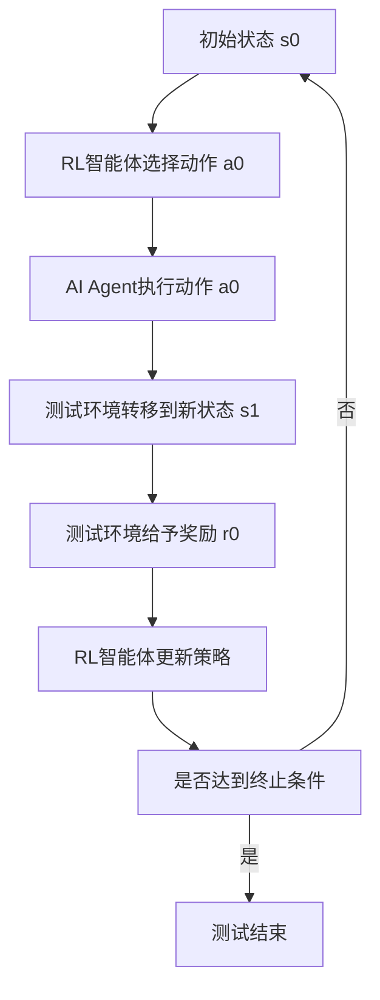

# 强化学习在AI Agent自动化测试中的应用

> 关键词：强化学习、AI Agent、自动化测试、智能决策、奖励机制

> 摘要：本文深入探讨了强化学习在AI Agent自动化测试中的应用。首先介绍了研究的背景、目的、预期读者以及文档结构，解释了相关术语。接着阐述了强化学习和AI Agent自动化测试的核心概念及其联系，给出了原理和架构的示意图与流程图。详细讲解了核心算法原理，通过Python代码进行了说明，并介绍了相关的数学模型和公式。通过项目实战，展示了开发环境搭建、源代码实现及代码解读。分析了强化学习在AI Agent自动化测试中的实际应用场景，推荐了学习资源、开发工具框架和相关论文著作。最后总结了未来发展趋势与挑战，提供了常见问题解答和扩展阅读参考资料。

## 1. 背景介绍 
### 1.1 目的和范围
随着人工智能技术的飞速发展，AI Agent在各个领域得到了广泛应用。然而，确保AI Agent的正确性、稳定性和鲁棒性是一个极具挑战性的问题。自动化测试是解决这一问题的重要手段，而强化学习作为一种强大的机器学习方法，能够让智能体在与环境的交互中不断学习最优策略，为AI Agent自动化测试提供了新的思路和方法。

本文的目的是深入探讨强化学习在AI Agent自动化测试中的应用，涵盖强化学习的基本原理、核心算法、数学模型，以及如何将其应用于实际的自动化测试项目中。通过理论分析和实际案例，为读者提供全面的技术指导，帮助读者理解和掌握这一前沿技术。

### 1.2 预期读者
本文主要面向对人工智能、机器学习和自动化测试领域感兴趣的专业人士，包括软件工程师、测试工程师、数据科学家、研究人员等。同时，也适合对前沿技术有一定了解，希望深入学习强化学习和AI Agent自动化测试的学生和爱好者。

### 1.3 文档结构概述
本文将按照以下结构进行组织：
1. **背景介绍**：介绍研究的目的、范围、预期读者和文档结构，解释相关术语。
2. **核心概念与联系**：阐述强化学习和AI Agent自动化测试的核心概念，展示它们之间的联系，并提供原理和架构的示意图与流程图。
3. **核心算法原理 & 具体操作步骤**：详细讲解强化学习的核心算法原理，通过Python代码进行说明。
4. **数学模型和公式 & 详细讲解 & 举例说明**：介绍强化学习的数学模型和公式，进行详细讲解并举例说明。
5. **项目实战：代码实际案例和详细解释说明**：通过实际项目案例，展示开发环境搭建、源代码实现及代码解读。
6. **实际应用场景**：分析强化学习在AI Agent自动化测试中的实际应用场景。
7. **工具和资源推荐**：推荐学习资源、开发工具框架和相关论文著作。
8. **总结：未来发展趋势与挑战**：总结强化学习在AI Agent自动化测试中的未来发展趋势和面临的挑战。
9. **附录：常见问题与解答**：提供常见问题的解答。
10. **扩展阅读 & 参考资料**：提供扩展阅读和参考资料。

### 1.4 术语表
#### 1.4.1 核心术语定义
- **强化学习（Reinforcement Learning）**：一种机器学习范式，智能体通过与环境进行交互，根据环境反馈的奖励信号来学习最优策略，以最大化长期累积奖励。
- **AI Agent**：人工智能智能体，是一种能够感知环境、做出决策并执行动作的实体。
- **自动化测试（Automated Testing）**：使用自动化工具和技术来执行测试用例，验证软件系统的功能、性能和可靠性。
- **策略（Policy）**：智能体在给定状态下选择动作的规则。
- **奖励（Reward）**：环境给予智能体的反馈信号，用于评价智能体的动作效果。
- **状态（State）**：环境的一种表示，描述了智能体所处的当前情况。

#### 1.4.2 相关概念解释
- **马尔可夫决策过程（Markov Decision Process, MDP）**：是强化学习的数学基础，描述了智能体与环境交互的动态过程。在MDP中，环境的状态转移具有马尔可夫性，即下一个状态只取决于当前状态和智能体的动作。
- **Q学习（Q-Learning）**：一种无模型的强化学习算法，通过学习动作价值函数Q(s, a)来找到最优策略。
- **深度Q网络（Deep Q-Network, DQN）**：将深度学习与Q学习相结合的算法，使用神经网络来近似动作价值函数。

#### 1.4.3 缩略词列表
- **RL**：Reinforcement Learning（强化学习）
- **MDP**：Markov Decision Process（马尔可夫决策过程）
- **Q-Learning**：Q学习
- **DQN**：Deep Q-Network（深度Q网络）
- **AI**：Artificial Intelligence（人工智能）

## 2. 核心概念与联系 

### 强化学习核心概念
强化学习是一种通过智能体与环境进行交互来学习最优策略的机器学习方法。智能体在每个时间步观察环境的状态 $s_t$，并根据当前策略 $\pi$ 选择一个动作 $a_t$ 执行。环境根据智能体的动作转移到下一个状态 $s_{t+1}$，并给予智能体一个奖励 $r_t$。智能体的目标是学习一个最优策略 $\pi^*$，使得长期累积奖励最大化。

强化学习的核心要素包括：
- **状态空间（State Space）**：所有可能的环境状态的集合，用 $\mathcal{S}$ 表示。
- **动作空间（Action Space）**：智能体可以执行的所有动作的集合，用 $\mathcal{A}$ 表示。
- **奖励函数（Reward Function）**：定义了环境给予智能体的奖励，用 $r(s, a)$ 表示，其中 $s \in \mathcal{S}$ 是当前状态，$a \in \mathcal{A}$ 是执行的动作。
- **策略（Policy）**：智能体在给定状态下选择动作的规则，用 $\pi(a|s)$ 表示，即状态 $s$ 下选择动作 $a$ 的概率。

### AI Agent自动化测试核心概念
AI Agent自动化测试是指使用自动化工具和技术来验证AI Agent的功能、性能和可靠性。测试过程通常包括以下步骤：
1. **测试用例生成**：根据AI Agent的需求和规格，生成一系列测试用例。
2. **测试执行**：将测试用例输入到AI Agent中，观察其输出和行为。
3. **结果评估**：根据预期结果和实际输出，评估AI Agent的性能和正确性。

### 核心概念联系
强化学习可以应用于AI Agent自动化测试的多个方面，例如：
- **测试用例生成**：使用强化学习智能体根据环境反馈生成最优的测试用例，以提高测试的覆盖率和效率。
- **智能决策**：在测试执行过程中，强化学习智能体可以根据AI Agent的实时状态和反馈，动态调整测试策略，以发现更多的潜在问题。
- **结果评估**：通过定义合适的奖励函数，强化学习智能体可以对AI Agent的输出和行为进行评估，为测试结果提供更客观的评价。

### 原理和架构的文本示意图
```plaintext
+----------------------+
|      AI Agent        |
+----------------------+
       |       ^
       |       |
       | 交互  |
       |       |
+----------------------+
|    测试环境 (Env)    |
+----------------------+
       |       ^
       |       |
       | 反馈  |
       |       |
+----------------------+
| 强化学习智能体 (RL) |
+----------------------+
```

### Mermaid流程图


## 3. 核心算法原理 & 具体操作步骤 

### Q学习算法原理
Q学习是一种无模型的强化学习算法，通过学习动作价值函数 $Q(s, a)$ 来找到最优策略。动作价值函数 $Q(s, a)$ 表示在状态 $s$ 下执行动作 $a$ 后，遵循最优策略所能获得的期望累积奖励。

Q学习的更新公式如下：
$$Q(s_t, a_t) \leftarrow Q(s_t, a_t) + \alpha [r_t + \gamma \max_{a} Q(s_{t+1}, a) - Q(s_t, a_t)]$$
其中：
- $\alpha$ 是学习率，控制每次更新的步长。
- $\gamma$ 是折扣因子，用于权衡即时奖励和未来奖励。
- $r_t$ 是在状态 $s_t$ 执行动作 $a_t$ 后获得的即时奖励。
- $\max_{a} Q(s_{t+1}, a)$ 是在下一个状态 $s_{t+1}$ 下所有动作的最大Q值。

### Q学习算法具体操作步骤
1. **初始化**：初始化动作价值函数 $Q(s, a)$ 为零，设置学习率 $\alpha$ 和折扣因子 $\gamma$。
2. **循环执行以下步骤直到达到终止条件**：
    - 观察当前状态 $s_t$。
    - 根据当前的Q值选择一个动作 $a_t$，可以使用 $\epsilon$-贪心策略。
    - 执行动作 $a_t$，观察环境的下一个状态 $s_{t+1}$ 和奖励 $r_t$。
    - 根据Q学习更新公式更新 $Q(s_t, a_t)$。
    - 更新当前状态 $s_t = s_{t+1}$。

### Python代码实现
```python
import numpy as np

class QLearningAgent:
    def __init__(self, state_space_size, action_space_size, alpha=0.1, gamma=0.9, epsilon=0.1):
        self.state_space_size = state_space_size
        self.action_space_size = action_space_size
        self.alpha = alpha
        self.gamma = gamma
        self.epsilon = epsilon
        self.Q = np.zeros((state_space_size, action_space_size))

    def choose_action(self, state):
        if np.random.uniform(0, 1) < self.epsilon:
            # 探索：随机选择一个动作
            action = np.random.choice(self.action_space_size)
        else:
            # 利用：选择Q值最大的动作
            action = np.argmax(self.Q[state, :])
        return action

    def update(self, state, action, reward, next_state):
        # Q学习更新公式
        max_q_next = np.max(self.Q[next_state, :])
        self.Q[state, action] += self.alpha * (reward + self.gamma * max_q_next - self.Q[state, action])


# 示例使用
state_space_size = 10
action_space_size = 4
agent = QLearningAgent(state_space_size, action_space_size)

# 模拟一次交互
state = 0
action = agent.choose_action(state)
next_state = 1
reward = 1
agent.update(state, action, reward, next_state)
```

### 代码解释
- `QLearningAgent` 类实现了Q学习智能体。
- `__init__` 方法初始化了状态空间大小、动作空间大小、学习率、折扣因子、探索率和Q表。
- `choose_action` 方法根据 $\epsilon$-贪心策略选择动作。
- `update` 方法根据Q学习更新公式更新Q表。

## 4. 数学模型和公式 & 详细讲解 & 举例说明 

### 马尔可夫决策过程（MDP）
马尔可夫决策过程是强化学习的数学基础，用一个五元组 $(\mathcal{S}, \mathcal{A}, \mathcal{P}, \mathcal{R}, \gamma)$ 表示：
- $\mathcal{S}$ 是状态空间，包含所有可能的环境状态。
- $\mathcal{A}$ 是动作空间，包含智能体可以执行的所有动作。
- $\mathcal{P}(s'|s, a)$ 是状态转移概率，表示在状态 $s$ 执行动作 $a$ 后转移到状态 $s'$ 的概率。
- $\mathcal{R}(s, a, s')$ 是奖励函数，表示在状态 $s$ 执行动作 $a$ 后转移到状态 $s'$ 所获得的奖励。
- $\gamma \in [0, 1]$ 是折扣因子，用于权衡即时奖励和未来奖励。

### 价值函数
在MDP中，有两种重要的价值函数：
- **状态价值函数（State Value Function）**：$V^{\pi}(s)$ 表示在策略 $\pi$ 下，从状态 $s$ 开始所能获得的期望累积奖励：
$$V^{\pi}(s) = \mathbb{E}_{\pi} \left[ \sum_{t=0}^{\infty} \gamma^t r_t | s_0 = s \right]$$
- **动作价值函数（Action Value Function）**：$Q^{\pi}(s, a)$ 表示在策略 $\pi$ 下，在状态 $s$ 执行动作 $a$ 后所能获得的期望累积奖励：
$$Q^{\pi}(s, a) = \mathbb{E}_{\pi} \left[ \sum_{t=0}^{\infty} \gamma^t r_t | s_0 = s, a_0 = a \right]$$

### 贝尔曼方程
贝尔曼方程描述了价值函数的递归关系：
- **状态价值函数的贝尔曼方程**：
$$V^{\pi}(s) = \sum_{a \in \mathcal{A}} \pi(a|s) \sum_{s' \in \mathcal{S}} \mathcal{P}(s'|s, a) [\mathcal{R}(s, a, s') + \gamma V^{\pi}(s')]$$
- **动作价值函数的贝尔曼方程**：
$$Q^{\pi}(s, a) = \sum_{s' \in \mathcal{S}} \mathcal{P}(s'|s, a) [\mathcal{R}(s, a, s') + \gamma \sum_{a' \in \mathcal{A}} \pi(a'|s') Q^{\pi}(s', a')]$$

### 最优价值函数和最优策略
最优状态价值函数 $V^*(s)$ 和最优动作价值函数 $Q^*(s, a)$ 分别定义为：
$$V^*(s) = \max_{\pi} V^{\pi}(s)$$
$$Q^*(s, a) = \max_{\pi} Q^{\pi}(s, a)$$
最优策略 $\pi^*$ 可以通过最优动作价值函数得到：
$$\pi^*(a|s) = \begin{cases} 1, & \text{if } a = \arg\max_{a'} Q^*(s, a') \\ 0, & \text{otherwise} \end{cases}$$

### 举例说明
考虑一个简单的网格世界环境，智能体可以在一个 $3 \times 3$ 的网格中移动，目标是到达右上角的网格。智能体有四个动作：上、下、左、右。如果智能体到达目标网格，获得奖励1，否则获得奖励0。

- **状态空间**：$\mathcal{S} = \{0, 1, \cdots, 8\}$，表示9个网格的编号。
- **动作空间**：$\mathcal{A} = \{0, 1, 2, 3\}$，分别表示上、下、左、右。
- **状态转移概率**：如果智能体的动作不会导致超出网格边界，则以概率1转移到相应的网格；否则，保持当前状态。
- **奖励函数**：到达目标网格时，$\mathcal{R}(s, a, s') = 1$；否则，$\mathcal{R}(s, a, s') = 0$。

假设折扣因子 $\gamma = 0.9$，我们可以使用Q学习算法来学习最优策略。初始时，Q表中的所有值都为零。随着智能体与环境的交互，Q表不断更新，最终收敛到最优动作价值函数。

## 5. 项目实战：代码实际案例和详细解释说明 

### 5.1  开发环境搭建
为了实现强化学习在AI Agent自动化测试中的应用，我们可以使用Python语言和一些常用的机器学习库。以下是开发环境搭建的步骤：

1. **安装Python**：建议使用Python 3.7及以上版本，可以从Python官方网站（https://www.python.org/downloads/）下载并安装。
2. **安装必要的库**：使用以下命令安装所需的库：
```sh
pip install numpy tensorflow gym
```
- `numpy`：用于数值计算。
- `tensorflow`：用于构建和训练深度学习模型。
- `gym`：OpenAI开发的强化学习环境库，提供了各种标准的强化学习环境。

### 5.2  源代码详细实现和代码解读
我们以OpenAI Gym中的CartPole环境为例，展示如何使用DQN算法进行AI Agent自动化测试。

```python
import gym
import numpy as np
import tensorflow as tf
from collections import deque
import random

# 定义DQN智能体类
class DQNAgent:
    def __init__(self, state_size, action_size):
        self.state_size = state_size
        self.action_size = action_size
        self.memory = deque(maxlen=2000)
        self.gamma = 0.95  # 折扣因子
        self.epsilon = 1.0  # 探索率
        self.epsilon_min = 0.01
        self.epsilon_decay = 0.995
        self.learning_rate = 0.001
        self.model = self._build_model()

    def _build_model(self):
        # 构建神经网络模型
        model = tf.keras.Sequential([
            tf.keras.layers.Dense(24, input_dim=self.state_size, activation='relu'),
            tf.keras.layers.Dense(24, activation='relu'),
            tf.keras.layers.Dense(self.action_size, activation='linear')
        ])
        model.compile(loss='mse', optimizer=tf.keras.optimizers.Adam(lr=self.learning_rate))
        return model

    def remember(self, state, action, reward, next_state, done):
        # 存储经验
        self.memory.append((state, action, reward, next_state, done))

    def act(self, state):
        # 根据当前状态选择动作
        if np.random.rand() <= self.epsilon:
            return random.randrange(self.action_size)
        act_values = self.model.predict(state)
        return np.argmax(act_values[0])

    def replay(self, batch_size):
        # 经验回放
        minibatch = random.sample(self.memory, batch_size)
        for state, action, reward, next_state, done in minibatch:
            target = reward
            if not done:
                target = (reward + self.gamma * np.amax(self.model.predict(next_state)[0]))
            target_f = self.model.predict(state)
            target_f[0][action] = target
            self.model.fit(state, target_f, epochs=1, verbose=0)
        if self.epsilon > self.epsilon_min:
            self.epsilon *= self.epsilon_decay

# 主函数
if __name__ == "__main__":
    env = gym.make('CartPole-v1')
    state_size = env.observation_space.shape[0]
    action_size = env.action_space.n
    agent = DQNAgent(state_size, action_size)
    batch_size = 32
    EPISODES = 1000

    for e in range(EPISODES):
        state = env.reset()
        state = np.reshape(state, [1, state_size])
        for time in range(500):
            # env.render()
            action = agent.act(state)
            next_state, reward, done, _ = env.step(action)
            reward = reward if not done else -10
            next_state = np.reshape(next_state, [1, state_size])
            agent.remember(state, action, reward, next_state, done)
            state = next_state
            if done:
                print("episode: {}/{}, score: {}, e: {:.2}"
                     .format(e, EPISODES, time, agent.epsilon))
                break
            if len(agent.memory) > batch_size:
                agent.replay(batch_size)
    env.close()
```

### 5.3  代码解读与分析
- **DQNAgent类**：
  - `__init__` 方法：初始化智能体的状态空间大小、动作空间大小、经验回放缓冲区、折扣因子、探索率等参数，并构建神经网络模型。
  - `_build_model` 方法：构建一个简单的全连接神经网络模型，用于近似动作价值函数。
  - `remember` 方法：将智能体的经验（状态、动作、奖励、下一个状态、是否终止）存储到经验回放缓冲区中。
  - `act` 方法：根据当前状态选择动作，使用 $\epsilon$-贪心策略进行探索和利用。
  - `replay` 方法：从经验回放缓冲区中随机采样一批经验，更新神经网络模型的参数。

- **主函数**：
  - 创建CartPole环境，初始化智能体和批量大小。
  - 进行多个回合的训练，每个回合中智能体与环境进行交互，存储经验并进行经验回放。
  - 打印每个回合的得分和探索率。

通过不断训练，智能体可以学习到在CartPole环境中保持杆子平衡的最优策略，从而实现AI Agent的自动化测试。

## 6. 实际应用场景 
强化学习在AI Agent自动化测试中有多种实际应用场景，以下是一些常见的例子：

### 游戏AI测试
在游戏开发中，AI Agent通常用于控制游戏角色的行为。使用强化学习进行自动化测试可以帮助开发者发现游戏AI的漏洞和优化策略。例如，在一个策略游戏中，强化学习智能体可以模拟不同的玩家策略，与游戏AI进行对战，评估游戏AI的性能和平衡性。

### 自动驾驶测试
自动驾驶汽车中的AI Agent需要在各种复杂的交通场景中做出决策。强化学习可以用于生成各种测试场景，让自动驾驶AI Agent在虚拟环境中进行大量的测试，以验证其安全性和可靠性。例如，通过设置不同的路况、天气条件和其他车辆的行为，强化学习智能体可以不断探索新的测试用例，发现自动驾驶AI Agent的潜在问题。

### 智能客服测试
智能客服系统中的AI Agent需要能够理解用户的问题并提供准确的回答。强化学习可以用于训练智能客服AI Agent，同时进行自动化测试。通过模拟不同类型的用户问题和对话场景，强化学习智能体可以评估智能客服的回答质量和交互效果，帮助优化智能客服系统。

### 工业自动化测试
在工业自动化领域，AI Agent可以用于控制机器人的操作。强化学习可以用于自动化测试机器人的控制策略，确保机器人在不同的工作环境中能够准确、高效地完成任务。例如，在一个物流仓库中，强化学习智能体可以测试机器人的路径规划和货物搬运策略，提高仓库的运营效率。

## 7. 工具和资源推荐
### 7.1 学习资源推荐
#### 7.1.1 书籍推荐
- 《强化学习：原理与Python实现》：详细介绍了强化学习的基本原理和算法，并提供了Python代码实现。
- 《Deep Reinforcement Learning Hands-On》：通过实际案例深入讲解深度强化学习的应用和实践。
- 《Reinforcement Learning: An Introduction》：强化学习领域的经典教材，全面介绍了强化学习的理论和方法。

#### 7.1.2 在线课程
- Coursera上的“Reinforcement Learning Specialization”：由知名教授授课，涵盖了强化学习的各个方面。
- edX上的“Introduction to Reinforcement Learning”：提供了强化学习的基础课程，适合初学者。

#### 7.1.3 技术博客和网站
- OpenAI官方博客：提供了强化学习领域的最新研究成果和应用案例。
- DeepMind官方博客：发布了许多关于深度强化学习的重要论文和技术文章。
- Medium上的“Towards Data Science”：有很多关于强化学习的优质博客文章。

### 7.2 开发工具框架推荐
#### 7.2.1 IDE和编辑器
- PyCharm：功能强大的Python集成开发环境，提供了代码编辑、调试、版本控制等功能。
- Jupyter Notebook：交互式的开发环境，适合进行数据探索和模型实验。

#### 7.2.2 调试和性能分析工具
- TensorBoard：TensorFlow提供的可视化工具，可以用于监控模型训练过程和分析模型性能。
- Py-Spy：用于分析Python代码的性能瓶颈，找出耗时较长的函数和代码段。

#### 7.2.3 相关框架和库
- TensorFlow：开源的深度学习框架，提供了丰富的工具和库，用于构建和训练强化学习模型。
- PyTorch：另一个流行的深度学习框架，具有简洁易用的API，适合快速开发和实验。
- Stable Baselines：基于OpenAI Gym的强化学习库，提供了多种预训练的强化学习算法和工具。

### 7.3 相关论文著作推荐
#### 7.3.1 经典论文
- “Playing Atari with Deep Reinforcement Learning”：首次提出了深度Q网络（DQN）算法，开启了深度强化学习的时代。
- “Asynchronous Methods for Deep Reinforcement Learning”：提出了异步优势演员-评论家（A3C）算法，提高了强化学习的训练效率。

#### 7.3.2 最新研究成果
- 关注顶级机器学习会议（如NeurIPS、ICML、AAAI等）上的相关论文，了解强化学习领域的最新研究进展。

#### 7.3.3 应用案例分析
- 阅读相关领域的研究论文和技术报告，了解强化学习在实际应用中的案例和经验。

## 8. 总结：未来发展趋势与挑战
### 未来发展趋势
- **多智能体强化学习**：在实际应用中，往往需要多个AI Agent协同工作。多智能体强化学习将成为未来的研究热点，用于解决多智能体之间的协作和竞争问题。
- **结合深度学习和符号推理**：将深度学习的感知能力和符号推理的逻辑能力相结合，提高AI Agent的决策能力和可解释性。
- **强化学习在更多领域的应用**：随着技术的不断发展，强化学习将在医疗、金融、教育等更多领域得到广泛应用。

### 挑战
- **样本效率问题**：强化学习通常需要大量的样本进行训练，样本效率较低。如何提高样本效率是当前研究的重要问题。
- **可解释性问题**：深度学习模型通常是黑盒模型，强化学习智能体的决策过程难以解释。提高强化学习模型的可解释性是实际应用中的关键挑战。
- **环境建模问题**：在复杂的现实环境中，准确建模环境的动态和不确定性是一个难题。如何构建有效的环境模型是强化学习应用的基础。

## 9. 附录：常见问题与解答
### Q1：强化学习和监督学习有什么区别？
A1：监督学习是通过给定输入和对应的标签来训练模型，模型的目标是学习输入和输出之间的映射关系。而强化学习是通过智能体与环境进行交互，根据环境反馈的奖励信号来学习最优策略，没有明确的标签。

### Q2：什么是经验回放？为什么要使用经验回放？
A2：经验回放是指将智能体的经验（状态、动作、奖励、下一个状态、是否终止）存储到一个缓冲区中，然后从缓冲区中随机采样一批经验进行训练。使用经验回放的主要原因是打破数据之间的相关性，提高训练的稳定性和效率。

### Q3：如何选择合适的奖励函数？
A3：选择合适的奖励函数是强化学习中的关键问题。奖励函数应该能够准确反映智能体的目标和行为的好坏。一般来说，奖励函数应该设计得简单明了，避免奖励稀疏和奖励延迟的问题。可以通过多次实验和调整来找到合适的奖励函数。

### Q4：强化学习在实际应用中有哪些限制？
A4：强化学习在实际应用中存在一些限制，例如样本效率低、可解释性差、环境建模困难等。此外，强化学习需要大量的计算资源和时间进行训练，对于一些实时性要求较高的应用场景可能不太适用。

## 10. 扩展阅读 & 参考资料
### 扩展阅读
- 阅读更多关于深度学习、机器学习和人工智能的相关书籍和论文，深入了解相关技术的原理和应用。
- 参与开源的强化学习项目，学习他人的代码和经验。

### 参考资料
- Sutton, R. S., & Barto, A. G. (2018). Reinforcement Learning: An Introduction. MIT press.
- Mnih, V., Kavukcuoglu, K., Silver, D., Rusu, A. A., Veness, J., Bellemare, M. G.,... & Petersen, S. (2015). Human-level control through deep reinforcement learning. Nature, 518(7540), 529-533.
- OpenAI Gym官方文档：https://gym.openai.com/docs/

作者：AI天才研究院/AI Genius Institute & 禅与计算机程序设计艺术 /Zen And The Art of Computer Programming