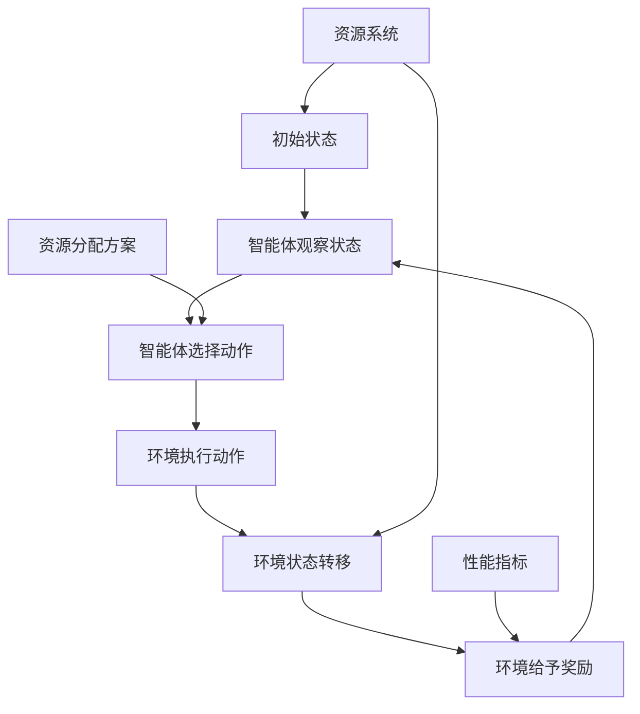

# 强化学习在AI Agent资源调度中的应用

> 关键词：强化学习、AI Agent、资源调度、马尔可夫决策过程、策略梯度算法

> 摘要：本文深入探讨了强化学习在AI Agent资源调度中的应用。首先介绍了相关背景知识，包括目的范围、预期读者等。接着阐述了强化学习和AI Agent资源调度的核心概念及联系，详细讲解了核心算法原理和具体操作步骤，并给出Python代码示例。还介绍了相关数学模型和公式，通过项目实战展示了代码的实际应用和详细解释。分析了强化学习在AI Agent资源调度中的实际应用场景，推荐了学习资源、开发工具框架和相关论文著作。最后总结了未来发展趋势与挑战，解答了常见问题，并提供了扩展阅读和参考资料，旨在为相关领域的研究和实践提供全面而深入的指导。

## 1. 背景介绍 
### 1.1 目的和范围
随着人工智能技术的飞速发展，AI Agent在各个领域的应用越来越广泛。AI Agent需要有效地利用有限的资源来完成各种任务，资源调度问题成为了关键。强化学习作为一种能够通过智能体与环境交互并不断学习优化策略的方法，为AI Agent资源调度提供了新的解决方案。本文的目的是深入探讨强化学习在AI Agent资源调度中的应用，包括核心概念、算法原理、实际应用场景等方面，旨在为研究人员和开发者提供全面的理论和实践指导。范围涵盖了强化学习的基本原理、常见算法，AI Agent资源调度的问题描述和建模，以及如何将强化学习应用于资源调度问题的具体实现和案例分析。

### 1.2 预期读者
本文预期读者包括人工智能领域的研究人员、研究生，对强化学习和资源调度感兴趣的开发者，以及相关领域的工程师。希望通过本文的介绍，读者能够深入理解强化学习在AI Agent资源调度中的应用原理和方法，掌握相关的技术和工具，为实际项目的开发和研究提供帮助。

### 1.3 文档结构概述
本文共分为十个部分。第一部分为背景介绍，包括目的和范围、预期读者、文档结构概述和术语表。第二部分阐述核心概念与联系，介绍强化学习和AI Agent资源调度的基本概念和它们之间的关系，并给出相应的文本示意图和Mermaid流程图。第三部分详细讲解核心算法原理和具体操作步骤，使用Python源代码进行说明。第四部分介绍相关的数学模型和公式，并进行详细讲解和举例说明。第五部分通过项目实战展示代码的实际案例和详细解释。第六部分分析强化学习在AI Agent资源调度中的实际应用场景。第七部分推荐学习资源、开发工具框架和相关论文著作。第八部分总结未来发展趋势与挑战。第九部分为附录，解答常见问题。第十部分提供扩展阅读和参考资料。

### 1.4 术语表
#### 1.4.1 核心术语定义
- **强化学习（Reinforcement Learning）**：一种机器学习范式，智能体通过与环境进行交互，根据环境反馈的奖励信号来学习最优策略，以最大化长期累积奖励。
- **AI Agent**：具有自主决策能力的人工智能实体，能够感知环境并采取行动以实现特定目标。
- **资源调度**：合理分配和管理有限的资源，以满足不同任务的需求，提高资源利用效率和系统性能。
- **马尔可夫决策过程（Markov Decision Process, MDP）**：一种用于描述强化学习问题的数学模型，由状态、动作、转移概率和奖励函数组成。
- **策略（Policy）**：智能体在每个状态下选择动作的规则，通常表示为从状态到动作的映射。

#### 1.4.2 相关概念解释
- **状态（State）**：环境的一种表示，反映了智能体当前所处的情况，是智能体做出决策的依据。
- **动作（Action）**：智能体在某个状态下可以采取的行为，不同的动作会导致环境状态的改变。
- **奖励（Reward）**：环境对智能体采取的动作给予的即时反馈，用于评估动作的好坏，智能体的目标是最大化长期累积奖励。
- **价值函数（Value Function）**：用于评估状态或状态 - 动作对的好坏，通常分为状态价值函数和动作价值函数。
- **策略梯度（Policy Gradient）**：一类直接优化策略的强化学习算法，通过计算策略的梯度来更新策略参数，以提高策略的性能。

#### 1.4.3 缩略词列表
- **MDP**：Markov Decision Process（马尔可夫决策过程）
- **DQN**：Deep Q - Network（深度Q网络）
- **A2C**：Advantage Actor - Critic（优势演员 - 评论家算法）
- **PPO**：Proximal Policy Optimization（近端策略优化算法）

## 2. 核心概念与联系 

### 强化学习基本概念
强化学习是一种通过智能体与环境交互来学习最优策略的机器学习方法。智能体在每个时间步观察环境的状态 $s_t$，并根据当前策略 $\pi$ 选择一个动作 $a_t$ 执行。环境根据智能体的动作转移到新的状态 $s_{t + 1}$，并给予智能体一个奖励 $r_t$。智能体的目标是学习一个策略 $\pi$，使得长期累积奖励 $R = \sum_{t = 0}^{T}\gamma^t r_t$ 最大化，其中 $\gamma$ 是折扣因子，用于权衡即时奖励和未来奖励。

### AI Agent资源调度概念
AI Agent资源调度是指在有限的资源（如计算资源、存储资源、带宽等）约束下，为AI Agent分配资源，以满足不同任务的需求，提高系统的整体性能。资源调度问题通常可以描述为一个优化问题，目标是在满足资源约束的前提下，最大化某个性能指标，如任务完成时间、资源利用率等。

### 两者联系
强化学习可以很好地应用于AI Agent资源调度问题。将资源调度问题建模为一个马尔可夫决策过程，状态可以表示为当前的资源状态和任务状态，动作可以表示为资源分配方案，奖励可以根据任务完成情况和资源利用效率来设计。智能体通过与环境（资源系统）交互，不断学习最优的资源分配策略，以最大化长期累积奖励，从而实现高效的资源调度。

### 文本示意图
```plaintext
强化学习与AI Agent资源调度的联系

强化学习
|
|-- 智能体
|   |-- 观察状态
|   |-- 选择动作
|   |-- 接收奖励
|
|-- 环境
|   |-- 状态转移
|   |-- 奖励反馈

AI Agent资源调度
|
|-- 资源系统
|   |-- 资源状态
|   |-- 任务状态
|
|-- 资源分配方案
|
|-- 性能指标

联系：
强化学习的智能体将资源系统作为环境，通过观察资源和任务状态选择资源分配方案，根据性能指标获得奖励，学习最优资源分配策略。
```

### Mermaid流程图


## 3. 核心算法原理 & 具体操作步骤 

### 马尔可夫决策过程（MDP）
马尔可夫决策过程是强化学习的基础模型，由一个四元组 $(S, A, P, R)$ 表示，其中：
- $S$ 是状态空间，包含所有可能的状态。
- $A$ 是动作空间，包含所有可能的动作。
- $P(s_{t + 1}|s_t, a_t)$ 是状态转移概率，表示在状态 $s_t$ 执行动作 $a_t$ 后转移到状态 $s_{t + 1}$ 的概率。
- $R(s_t, a_t, s_{t + 1})$ 是奖励函数，表示在状态 $s_t$ 执行动作 $a_t$ 并转移到状态 $s_{t + 1}$ 时获得的奖励。

### 策略梯度算法原理
策略梯度算法直接对策略进行优化，通过计算策略的梯度来更新策略参数。策略通常表示为一个参数化的函数 $\pi_{\theta}(a|s)$，其中 $\theta$ 是策略的参数。策略梯度算法的目标是最大化期望累积奖励 $J(\theta) = \mathbb{E}_{\tau \sim \pi_{\theta}}[R(\tau)]$，其中 $\tau$ 是一个轨迹，包含一系列的状态 - 动作对 $(s_0, a_0, s_1, a_1, \cdots)$，$R(\tau)$ 是轨迹 $\tau$ 的累积奖励。

根据策略梯度定理，策略的梯度可以表示为：
$$\nabla_{\theta} J(\theta) = \mathbb{E}_{\tau \sim \pi_{\theta}}\left[\sum_{t = 0}^{T} \nabla_{\theta} \log \pi_{\theta}(a_t|s_t) R(\tau)\right]$$

### 具体操作步骤
1. **初始化策略参数 $\theta$**：随机初始化策略的参数。
2. **收集轨迹数据**：使用当前策略 $\pi_{\theta}$ 与环境交互，收集一系列的轨迹数据 $\{(s_0, a_0, r_0), (s_1, a_1, r_1), \cdots\}$。
3. **计算策略梯度**：根据策略梯度定理，计算策略的梯度 $\nabla_{\theta} J(\theta)$。
4. **更新策略参数**：使用梯度上升法更新策略参数 $\theta \leftarrow \theta + \alpha \nabla_{\theta} J(\theta)$，其中 $\alpha$ 是学习率。
5. **重复步骤2 - 4**：直到策略收敛或达到最大迭代次数。

### Python代码示例
```python
import numpy as np
import torch
import torch.nn as nn
import torch.optim as optim

# 定义策略网络
class PolicyNetwork(nn.Module):
    def __init__(self, input_dim, output_dim):
        super(PolicyNetwork, self).__init__()
        self.fc1 = nn.Linear(input_dim, 64)
        self.fc2 = nn.Linear(64, output_dim)
        self.softmax = nn.Softmax(dim = 1)

    def forward(self, x):
        x = torch.relu(self.fc1(x))
        x = self.fc2(x)
        x = self.softmax(x)
        return x

# 策略梯度算法实现
class PolicyGradient:
    def __init__(self, input_dim, output_dim, learning_rate):
        self.policy_network = PolicyNetwork(input_dim, output_dim)
        self.optimizer = optim.Adam(self.policy_network.parameters(), lr = learning_rate)

    def select_action(self, state):
        state = torch.FloatTensor(state).unsqueeze(0)
        probs = self.policy_network(state)
        action = torch.multinomial(probs, 1).item()
        log_prob = torch.log(probs.squeeze(0)[action])
        return action, log_prob

    def update_policy(self, log_probs, rewards):
        discounted_rewards = []
        R = 0
        for r in reversed(rewards):
            R = r + 0.9 * R
            discounted_rewards.insert(0, R)
        discounted_rewards = torch.FloatTensor(discounted_rewards)
        discounted_rewards = (discounted_rewards - discounted_rewards.mean()) / (discounted_rewards.std() + 1e-9)

        policy_loss = []
        for log_prob, reward in zip(log_probs, discounted_rewards):
            policy_loss.append(-log_prob * reward)
        policy_loss = torch.stack(policy_loss).sum()

        self.optimizer.zero_grad()
        policy_loss.backward()
        self.optimizer.step()
```

## 4. 数学模型和公式 & 详细讲解 & 举例说明 

### 马尔可夫决策过程（MDP）公式
马尔可夫决策过程由四元组 $(S, A, P, R)$ 定义，其中：
- 状态转移概率 $P(s_{t + 1}|s_t, a_t)$ 满足马尔可夫性质，即未来状态只依赖于当前状态和动作，与历史状态和动作无关。
- 奖励函数 $R(s_t, a_t, s_{t + 1})$ 表示在状态 $s_t$ 执行动作 $a_t$ 并转移到状态 $s_{t + 1}$ 时获得的奖励。

价值函数是强化学习中的重要概念，用于评估状态或状态 - 动作对的好坏。状态价值函数 $V^{\pi}(s)$ 表示在策略 $\pi$ 下从状态 $s$ 开始的期望累积奖励：
$$V^{\pi}(s) = \mathbb{E}_{\tau \sim \pi}\left[\sum_{t = 0}^{\infty} \gamma^t r_t | s_0 = s\right]$$

动作价值函数 $Q^{\pi}(s, a)$ 表示在策略 $\pi$ 下从状态 $s$ 执行动作 $a$ 开始的期望累积奖励：
$$Q^{\pi}(s, a) = \mathbb{E}_{\tau \sim \pi}\left[\sum_{t = 0}^{\infty} \gamma^t r_t | s_0 = s, a_0 = a\right]$$

### 贝尔曼方程
贝尔曼方程是强化学习中的核心方程，用于描述价值函数的递归关系。状态价值函数的贝尔曼方程为：
$$V^{\pi}(s) = \sum_{a \in A} \pi(a|s) \sum_{s' \in S} P(s'|s, a) \left[R(s, a, s') + \gamma V^{\pi}(s')\right]$$

动作价值函数的贝尔曼方程为：
$$Q^{\pi}(s, a) = \sum_{s' \in S} P(s'|s, a) \left[R(s, a, s') + \gamma \sum_{a' \in A} \pi(a'|s') Q^{\pi}(s', a')\right]$$

### 策略梯度公式
策略梯度算法的目标是最大化期望累积奖励 $J(\theta) = \mathbb{E}_{\tau \sim \pi_{\theta}}[R(\tau)]$，其梯度为：
$$\nabla_{\theta} J(\theta) = \mathbb{E}_{\tau \sim \pi_{\theta}}\left[\sum_{t = 0}^{T} \nabla_{\theta} \log \pi_{\theta}(a_t|s_t) R(\tau)\right]$$

### 举例说明
假设有一个简单的资源调度问题，状态空间 $S = \{s_1, s_2\}$，动作空间 $A = \{a_1, a_2\}$，状态转移概率和奖励函数如下：

| $s_t$ | $a_t$ | $s_{t + 1}$ | $P(s_{t + 1}|s_t, a_t)$ | $R(s_t, a_t, s_{t + 1})$ |
| --- | --- | --- | --- | --- |
| $s_1$ | $a_1$ | $s_1$ | 0.8 | 1 |
| $s_1$ | $a_1$ | $s_2$ | 0.2 | -1 |
| $s_1$ | $a_2$ | $s_1$ | 0.3 | 2 |
| $s_1$ | $a_2$ | $s_2$ | 0.7 | -2 |
| $s_2$ | $a_1$ | $s_1$ | 0.6 | 3 |
| $s_2$ | $a_1$ | $s_2$ | 0.4 | -3 |
| $s_2$ | $a_2$ | $s_1$ | 0.1 | 4 |
| $s_2$ | $a_2$ | $s_2$ | 0.9 | -4 |

假设策略 $\pi$ 为 $\pi(a_1|s_1) = 0.6$，$\pi(a_2|s_1) = 0.4$，$\pi(a_1|s_2) = 0.3$，$\pi(a_2|s_2) = 0.7$，折扣因子 $\gamma = 0.9$。

计算状态 $s_1$ 的状态价值函数 $V^{\pi}(s_1)$：
$$
\begin{align*}
V^{\pi}(s_1) &= \sum_{a \in A} \pi(a|s_1) \sum_{s' \in S} P(s'|s_1, a) \left[R(s_1, a, s') + \gamma V^{\pi}(s')\right]\\
&= 0.6\times(0.8\times(1 + 0.9V^{\pi}(s_1)) + 0.2\times(-1 + 0.9V^{\pi}(s_2))) + 0.4\times(0.3\times(2 + 0.9V^{\pi}(s_1)) + 0.7\times(-2 + 0.9V^{\pi}(s_2)))
\end{align*}
$$

同理可计算 $V^{\pi}(s_2)$，通过迭代求解上述方程可以得到状态价值函数的值。

## 5. 项目实战：代码实际案例和详细解释说明 

### 5.1  开发环境搭建
本项目使用Python进行开发，需要安装以下库：
- **PyTorch**：用于构建和训练深度学习模型。
- **NumPy**：用于数值计算。

可以使用以下命令安装所需库：
```sh
pip install torch numpy
```

### 5.2  源代码详细实现和代码解读
以下是一个完整的资源调度项目实战代码示例：
```python
import numpy as np
import torch
import torch.nn as nn
import torch.optim as optim

# 定义策略网络
class PolicyNetwork(nn.Module):
    def __init__(self, input_dim, output_dim):
        super(PolicyNetwork, self).__init__()
        self.fc1 = nn.Linear(input_dim, 64)
        self.fc2 = nn.Linear(64, output_dim)
        self.softmax = nn.Softmax(dim = 1)

    def forward(self, x):
        x = torch.relu(self.fc1(x))
        x = self.fc2(x)
        x = self.softmax(x)
        return x

# 策略梯度算法实现
class PolicyGradient:
    def __init__(self, input_dim, output_dim, learning_rate):
        self.policy_network = PolicyNetwork(input_dim, output_dim)
        self.optimizer = optim.Adam(self.policy_network.parameters(), lr = learning_rate)

    def select_action(self, state):
        state = torch.FloatTensor(state).unsqueeze(0)
        probs = self.policy_network(state)
        action = torch.multinomial(probs, 1).item()
        log_prob = torch.log(probs.squeeze(0)[action])
        return action, log_prob

    def update_policy(self, log_probs, rewards):
        discounted_rewards = []
        R = 0
        for r in reversed(rewards):
            R = r + 0.9 * R
            discounted_rewards.insert(0, R)
        discounted_rewards = torch.FloatTensor(discounted_rewards)
        discounted_rewards = (discounted_rewards - discounted_rewards.mean()) / (discounted_rewards.std() + 1e-9)

        policy_loss = []
        for log_prob, reward in zip(log_probs, discounted_rewards):
            policy_loss.append(-log_prob * reward)
        policy_loss = torch.stack(policy_loss).sum()

        self.optimizer.zero_grad()
        policy_loss.backward()
        self.optimizer.step()

# 模拟资源调度环境
class ResourceSchedulingEnv:
    def __init__(self):
        self.state = np.array([10, 20])  # 初始资源状态
        self.task_demands = [3, 5, 2, 4]  # 任务资源需求
        self.task_index = 0

    def reset(self):
        self.state = np.array([10, 20])
        self.task_index = 0
        return self.state

    def step(self, action):
        if action == 0:  # 分配资源到第一个任务
            if self.state[0] >= self.task_demands[self.task_index]:
                self.state[0] -= self.task_demands[self.task_index]
                reward = 1
            else:
                reward = -1
        else:  # 分配资源到第二个任务
            if self.state[1] >= self.task_demands[self.task_index]:
                self.state[1] -= self.task_demands[self.task_index]
                reward = 1
            else:
                reward = -1

        self.task_index += 1
        done = self.task_index == len(self.task_demands)
        return self.state, reward, done

# 主训练循环
if __name__ == "__main__":
    env = ResourceSchedulingEnv()
    input_dim = len(env.reset())
    output_dim = 2  # 两个动作：分配到第一个任务或第二个任务
    learning_rate = 0.01
    agent = PolicyGradient(input_dim, output_dim, learning_rate)

    num_episodes = 1000
    for episode in range(num_episodes):
        state = env.reset()
        log_probs = []
        rewards = []
        done = False

        while not done:
            action, log_prob = agent.select_action(state)
            next_state, reward, done = env.step(action)
            log_probs.append(log_prob)
            rewards.append(reward)
            state = next_state

        agent.update_policy(log_probs, rewards)

        if episode % 100 == 0:
            print(f"Episode {episode}: Total reward = {sum(rewards)}")
```

### 5.3  代码解读与分析
- **策略网络（PolicyNetwork）**：定义了一个简单的两层全连接神经网络，用于输出每个动作的概率分布。输入层的维度为 `input_dim`，输出层的维度为 `output_dim`。
- **策略梯度算法（PolicyGradient）**：
  - `select_action` 方法：根据当前状态选择一个动作，并返回动作和对应的对数概率。
  - `update_policy` 方法：根据收集到的对数概率和奖励更新策略网络的参数。
- **资源调度环境（ResourceSchedulingEnv）**：模拟了一个简单的资源调度环境，包括初始资源状态和任务资源需求。`reset` 方法用于重置环境，`step` 方法用于执行动作并返回下一个状态、奖励和是否完成的标志。
- **主训练循环**：在每个episode中，智能体与环境交互，收集轨迹数据，并使用策略梯度算法更新策略网络的参数。每100个episode打印一次总奖励，用于监控训练过程。

## 6. 实际应用场景 
### 云计算资源调度
在云计算环境中，有大量的虚拟机和用户任务需要调度。强化学习可以用于根据任务的特性（如计算复杂度、内存需求等）和当前的资源状态，动态地分配虚拟机资源，以提高资源利用率和任务执行效率。例如，通过强化学习智能体可以实时调整虚拟机的分配策略，优先满足高优先级任务的需求，同时避免资源的浪费。

### 数据中心网络资源调度
数据中心网络中，流量的动态变化和不同应用的带宽需求差异很大。强化学习可以用于优化网络资源的分配，如带宽分配、路由选择等。智能体可以根据网络的实时状态（如链路利用率、延迟等）和流量需求，选择最优的网络资源分配方案，以提高网络的性能和可靠性。

### 机器人任务调度
在机器人应用中，机器人需要完成多个任务，如搬运、巡逻等。强化学习可以用于调度机器人的任务，根据任务的优先级、机器人的当前状态（如电量、位置等）和环境信息，合理分配任务，以提高机器人的工作效率和任务完成质量。例如，智能体可以根据机器人的电量和任务的距离，选择最优的任务执行顺序，避免机器人因电量不足而无法完成任务。

### 边缘计算资源调度
边缘计算环境中，边缘设备的资源有限，需要高效地调度资源以支持各种应用。强化学习可以用于根据应用的需求（如计算能力、存储需求等）和边缘设备的状态，动态地分配边缘设备的资源，以提高边缘计算的性能和响应速度。例如，智能体可以根据应用的实时负载情况，将任务分配到最合适的边缘设备上，减少数据传输延迟。

## 7. 工具和资源推荐
### 7.1 学习资源推荐
#### 7.1.1 书籍推荐
- 《Reinforcement Learning: An Introduction》（第二版）：由Richard S. Sutton和Andrew G. Barto所著，是强化学习领域的经典教材，全面介绍了强化学习的基本概念、算法和应用。
- 《Deep Reinforcement Learning Hands-On》：由Max Lapan所著，通过实际案例和代码示例，详细介绍了深度强化学习的实现方法和应用场景。
- 《Artificial Intelligence: A Modern Approach》（第三版）：由Stuart Russell和Peter Norvig所著，是人工智能领域的权威教材，其中包含了强化学习的相关内容。

#### 7.1.2 在线课程
- **Coursera上的“Reinforcement Learning Specialization”**：由University of Alberta提供，包括四门课程，从基础的强化学习概念到高级的深度强化学习算法，适合初学者和有一定基础的学习者。
- **Udemy上的“Complete Reinforcement Learning Course with Python”**：通过实际项目和代码示例，全面介绍了强化学习的理论和实践。
- **edX上的“Introduction to Artificial Intelligence”**：由UC Berkeley提供，其中包含了强化学习的相关内容，适合对人工智能感兴趣的学习者。

#### 7.1.3 技术博客和网站
- **OpenAI Blog**：OpenAI发布的关于人工智能和强化学习的最新研究成果和应用案例。
- **DeepMind Blog**：DeepMind发布的关于人工智能和强化学习的前沿研究和技术进展。
- **Medium上的“Towards Data Science”**：包含了大量关于强化学习的技术文章和实践经验分享。

### 7.2 开发工具框架推荐
#### 7.2.1 IDE和编辑器
- **PyCharm**：一款专业的Python集成开发环境，提供了丰富的代码编辑、调试和项目管理功能，适合开发强化学习项目。
- **Jupyter Notebook**：一种交互式的开发环境，支持Python代码的编写、运行和可视化，非常适合进行强化学习算法的实验和验证。
- **VS Code**：一款轻量级的代码编辑器，支持多种编程语言和插件，可通过安装Python扩展来进行强化学习项目的开发。

#### 7.2.2 调试和性能分析工具
- **TensorBoard**：TensorFlow提供的可视化工具，可以用于监控强化学习训练过程中的损失函数、奖励曲线等指标，帮助调试和优化模型。
- **PyTorch Profiler**：PyTorch提供的性能分析工具，可以用于分析模型的计算时间、内存使用等情况，帮助优化代码性能。
- **cProfile**：Python标准库中的性能分析工具，可以用于分析Python代码的运行时间和函数调用情况，帮助找出代码中的性能瓶颈。

#### 7.2.3 相关框架和库
- **OpenAI Gym**：一个用于开发和比较强化学习算法的工具包，提供了大量的标准环境，方便进行算法的测试和验证。
- **Stable Baselines3**：基于PyTorch的强化学习库，提供了多种经典的强化学习算法的实现，易于使用和扩展。
- **Ray RLlib**：一个可扩展的强化学习库，支持分布式训练和多种深度学习框架，适合大规模的强化学习应用。

### 7.3 相关论文著作推荐
#### 7.3.1 经典论文
- **“Policy Gradient Methods for Reinforcement Learning with Function Approximation”**：由Richard S. Sutton等人发表，提出了策略梯度算法的基本思想，是策略梯度算法的经典论文。
- **“Human-level control through deep reinforcement learning”**：由DeepMind团队发表，介绍了深度Q网络（DQN）算法，并在Atari游戏中取得了人类水平的表现，开创了深度强化学习的先河。
- **“Proximal Policy Optimization Algorithms”**：由OpenAI团队发表，提出了近端策略优化（PPO）算法，是一种高效的策略梯度算法，在多个领域取得了很好的应用效果。

#### 7.3.2 最新研究成果
- **“Mastering Atari, Go, Chess and Shogi by Planning with a Learned Model”**：由DeepMind团队发表，提出了基于模型的强化学习方法，通过学习环境模型来进行规划，在多个复杂游戏中取得了优异的成绩。
- **“Off-Policy Deep Reinforcement Learning without Exploration”**：提出了一种无需探索的离线强化学习方法，解决了传统强化学习方法在数据收集方面的难题。
- **“Reinforcement Learning for Resource Allocation in Edge Computing: A Survey”**：对强化学习在边缘计算资源调度中的应用进行了全面的综述，介绍了相关的研究成果和未来的研究方向。

#### 7.3.3 应用案例分析
- **“Deep Reinforcement Learning for Cloud Computing Resource Allocation: A Survey”**：对深度强化学习在云计算资源调度中的应用进行了综述，分析了不同的应用场景和算法，并对未来的发展趋势进行了展望。
- **“Reinforcement Learning for Network Resource Allocation: A Comprehensive Survey”**：对强化学习在网络资源调度中的应用进行了全面的调查，包括无线通信网络、数据中心网络等领域的应用案例和算法分析。
- **“Robotic Task Scheduling using Reinforcement Learning: A Review”**：对强化学习在机器人任务调度中的应用进行了综述，介绍了不同的机器人应用场景和任务调度算法，并对未来的研究方向进行了探讨。

## 8. 总结：未来发展趋势与挑战
### 未来发展趋势
- **与其他技术的融合**：强化学习将与深度学习、计算机视觉、自然语言处理等技术进一步融合，以解决更加复杂的实际问题。例如，在智能机器人领域，强化学习可以与计算机视觉技术结合，使机器人能够更好地感知环境并做出决策。
- **大规模分布式训练**：随着强化学习应用场景的不断扩大，对算法的训练效率和可扩展性提出了更高的要求。未来，大规模分布式训练技术将得到更广泛的应用，以加速强化学习模型的训练过程。
- **多智能体强化学习**：在许多实际场景中，需要多个智能体协同工作来完成任务。多智能体强化学习将成为未来的研究热点，用于解决多智能体之间的协作和竞争问题。
- **应用领域的拓展**：强化学习将在更多的领域得到应用，如医疗保健、金融、交通等。例如，在医疗保健领域，强化学习可以用于优化治疗方案和资源分配，提高医疗服务的质量和效率。

### 挑战
- **数据收集和标注**：强化学习需要大量的交互数据来进行训练，数据收集和标注的成本较高。特别是在一些实际应用场景中，如机器人操作、自动驾驶等，数据收集的难度更大。
- **算法的稳定性和可解释性**：强化学习算法的稳定性和可解释性仍然是一个挑战。在一些复杂的环境中，算法可能会出现不稳定的情况，导致性能下降。同时，由于强化学习模型通常是基于深度学习的黑盒模型，其决策过程难以解释，这在一些对安全性和可靠性要求较高的应用场景中是一个问题。
- **环境建模和泛化能力**：准确地建模环境是强化学习的关键，但在实际应用中，环境往往是复杂多变的，难以精确建模。此外，强化学习算法的泛化能力也是一个挑战，模型在训练环境中表现良好，但在新的环境中可能无法正常工作。
- **计算资源需求**：强化学习算法通常需要大量的计算资源来进行训练，特别是深度强化学习算法。在一些资源受限的环境中，如边缘设备、移动设备等，算法的运行效率会受到很大的影响。

## 9. 附录：常见问题与解答
### 1. 强化学习和监督学习有什么区别？
强化学习和监督学习是两种不同的机器学习范式。监督学习是基于有标签的数据进行学习，目标是学习输入和输出之间的映射关系。而强化学习是通过智能体与环境交互，根据环境反馈的奖励信号来学习最优策略，没有明确的标签数据。监督学习更侧重于预测，而强化学习更侧重于决策。

### 2. 如何选择合适的强化学习算法？
选择合适的强化学习算法需要考虑多个因素，如问题的复杂度、环境的特性、数据的可用性等。对于简单的离散动作空间问题，可以选择基于值函数的算法，如Q - learning、DQN等。对于连续动作空间问题，通常选择策略梯度算法，如A2C、PPO等。如果问题具有复杂的环境动态和不确定性，可以考虑使用基于模型的强化学习算法。

### 3. 强化学习在实际应用中可能会遇到哪些问题？
强化学习在实际应用中可能会遇到以下问题：
- 数据收集困难：需要大量的交互数据来进行训练，数据收集成本较高。
- 算法不稳定：在复杂环境中，算法可能会出现不稳定的情况，导致性能下降。
- 可解释性差：强化学习模型通常是黑盒模型，决策过程难以解释。
- 泛化能力不足：模型在训练环境中表现良好，但在新的环境中可能无法正常工作。

### 4. 如何评估强化学习算法的性能？
评估强化学习算法的性能通常使用累积奖励、平均奖励、成功率等指标。累积奖励表示智能体在一个episode中获得的总奖励，平均奖励表示多个episode的平均奖励。成功率表示智能体在多个episode中成功完成任务的比例。此外，还可以使用学习曲线来观察算法的收敛速度和稳定性。

## 10. 扩展阅读 & 参考资料
### 扩展阅读
- 《Advanced Deep Learning with Keras: Applied Deep Learning, Neural Networks, and Artificial Intelligence》：深入介绍了深度学习的高级技术和应用，包括强化学习的相关内容。
- 《Reinforcement Learning in Robotics: Applications and Challenges》：专门讨论了强化学习在机器人领域的应用和挑战，提供了许多实际案例和研究成果。
- 《Machine Learning Yearning》：由Andrew Ng所著，介绍了机器学习的实践经验和技巧，对强化学习的应用也有一定的指导作用。

### 参考资料
- Sutton, R. S., & Barto, A. G. (2018). Reinforcement Learning: An Introduction (Second Edition). The MIT Press.
- Lapan, M. (2018). Deep Reinforcement Learning Hands-On. Packt Publishing.
- Russell, S. J., & Norvig, P. (2010). Artificial Intelligence: A Modern Approach (Third Edition). Pearson.
- Mnih, V., et al. (2015). Human-level control through deep reinforcement learning. Nature, 518(7540), 529 - 533.
- Schulman, J., et al. (2017). Proximal Policy Optimization Algorithms. arXiv preprint arXiv:1707.06347.

作者：AI天才研究院/AI Genius Institute & 禅与计算机程序设计艺术 /Zen And The Art of Computer Programming