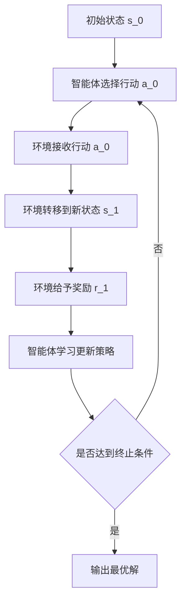

# 强化学习在组合优化问题中的应用前景

> 关键词：强化学习、组合优化问题、应用前景、算法原理、实际案例

> 摘要：本文深入探讨了强化学习在组合优化问题中的应用前景。首先介绍了相关背景知识，包括目的范围、预期读者等内容。接着详细阐述了强化学习与组合优化问题的核心概念及联系，给出了原理和架构的示意图与流程图。通过Python代码讲解了核心算法原理和具体操作步骤，同时运用数学模型和公式进行详细说明并举例。在项目实战部分，展示了开发环境搭建、源代码实现与解读。分析了强化学习在组合优化问题中的实际应用场景，推荐了学习资源、开发工具框架以及相关论文著作。最后总结了未来发展趋势与挑战，解答了常见问题并提供扩展阅读和参考资料，旨在为读者全面呈现强化学习在组合优化领域的应用现状和发展潜力。

## 1. 背景介绍 
### 1.1 目的和范围
组合优化问题在众多领域中广泛存在，如物流配送、资源分配、电路设计等。这些问题通常具有大规模、高复杂度的特点，传统的优化算法在处理时可能面临计算效率低、难以找到全局最优解等问题。强化学习作为一种机器学习方法，通过智能体与环境进行交互，不断学习最优策略，为解决组合优化问题提供了新的思路和方法。本文的目的是深入研究强化学习在组合优化问题中的应用，探讨其原理、算法、实际案例以及未来的发展前景，为相关领域的研究和实践提供参考。

本文的范围涵盖了强化学习和组合优化问题的基本概念、核心算法原理、数学模型、项目实战案例、实际应用场景以及相关的工具和资源推荐等方面。

### 1.2 预期读者
本文的预期读者包括计算机科学、运筹学、控制科学等领域的研究人员、学生，以及对强化学习和组合优化问题感兴趣的技术爱好者和工程师。对于希望了解强化学习在组合优化领域应用的专业人士，本文提供了系统的知识和实践指导；对于初学者，本文也会从基础概念入手，逐步引导读者理解相关的技术和方法。

### 1.3 文档结构概述
本文共分为十个部分。第一部分为背景介绍，阐述了研究的目的和范围、预期读者以及文档的结构概述，并给出了相关的术语表。第二部分介绍了强化学习和组合优化问题的核心概念与联系，包括原理和架构的文本示意图和Mermaid流程图。第三部分通过Python源代码详细讲解了核心算法原理和具体操作步骤。第四部分运用数学模型和公式对相关内容进行了详细讲解，并举例说明。第五部分为项目实战，包括开发环境搭建、源代码详细实现和代码解读。第六部分分析了强化学习在组合优化问题中的实际应用场景。第七部分推荐了学习资源、开发工具框架以及相关论文著作。第八部分总结了未来发展趋势与挑战。第九部分为附录，解答了常见问题。第十部分提供了扩展阅读和参考资料。

### 1.4 术语表
#### 1.4.1 核心术语定义
- **强化学习（Reinforcement Learning）**：一种机器学习范式，智能体通过与环境进行交互，根据环境反馈的奖励信号来学习最优策略，以最大化长期累积奖励。
- **组合优化问题（Combinatorial Optimization Problem）**：在一个有限的离散解空间中，寻找满足某些约束条件并使目标函数达到最优值的解的问题。例如，旅行商问题（TSP）、背包问题等。
- **智能体（Agent）**：在强化学习中，能够感知环境状态、采取行动并从环境中获得奖励的实体。
- **环境（Environment）**：智能体所处的外部世界，它接收智能体的行动并返回新的状态和奖励信号。
- **策略（Policy）**：智能体根据当前状态选择行动的规则，通常表示为一个函数 $\pi(s)$，其中 $s$ 为状态。
- **奖励（Reward）**：环境给予智能体的反馈信号，用于衡量智能体采取的行动的好坏，智能体的目标是最大化长期累积奖励。

#### 1.4.2 相关概念解释
- **马尔可夫决策过程（Markov Decision Process，MDP）**：是强化学习的理论基础，它描述了一个具有马尔可夫性质的决策过程，包括状态集合 $S$、行动集合 $A$、状态转移概率 $P(s'|s,a)$、奖励函数 $R(s,a,s')$ 和折扣因子 $\gamma$。
- **价值函数（Value Function）**：用于评估在某个状态下采取某个行动或遵循某个策略的长期价值。常见的价值函数包括状态价值函数 $V(s)$ 和动作价值函数 $Q(s,a)$。
- **探索与利用（Exploration vs. Exploitation）**：在强化学习中，智能体需要在探索新的行动以发现更好的策略和利用已有的经验之间进行平衡。

#### 1.4.3 缩略词列表
- **RL**：Reinforcement Learning，强化学习
- **MDP**：Markov Decision Process，马尔可夫决策过程
- **TSP**：Traveling Salesman Problem，旅行商问题
- **DQN**：Deep Q-Network，深度Q网络

## 2. 核心概念与联系 

### 2.1 强化学习核心概念
强化学习的核心思想是智能体通过与环境进行交互，不断学习最优策略以最大化长期累积奖励。智能体在每个时间步 $t$ 观察环境的状态 $s_t$，根据当前策略 $\pi$ 选择一个行动 $a_t$ 执行，环境根据智能体的行动转移到新的状态 $s_{t+1}$，并给予智能体一个奖励 $r_{t+1}$。智能体的目标是学习一个策略 $\pi$，使得长期累积奖励 $G_t = \sum_{k=0}^{\infty} \gamma^k r_{t+k+1}$ 最大化，其中 $\gamma \in [0,1]$ 是折扣因子，用于衡量未来奖励的重要性。

### 2.2 组合优化问题核心概念
组合优化问题通常可以描述为在一个有限的离散解空间 $\Omega$ 中，寻找一个解 $x \in \Omega$，使得目标函数 $f(x)$ 达到最优值（最大值或最小值），同时满足一些约束条件 $g_i(x) \leq 0$，$i = 1,2,\cdots,m$。例如，旅行商问题（TSP）的目标是找到一条遍历所有城市且每个城市仅访问一次的最短路径。

### 2.3 强化学习与组合优化问题的联系
强化学习可以用于解决组合优化问题，将组合优化问题转化为一个强化学习问题。具体来说，可以将组合优化问题的解空间看作是强化学习中的状态空间，每个解看作是一个状态；将选择解的过程看作是智能体采取行动的过程；将目标函数的值或约束条件的满足情况看作是奖励信号。通过强化学习算法，智能体可以学习到如何在解空间中搜索最优解。

### 2.4 原理和架构的文本示意图
```plaintext
+-------------------+
|    环境 (组合优化问题)   |
|                   |
|  状态 s_t          |
|  奖励 r_{t+1}      |
|  状态转移 P(s'|s,a) |
+-------------------+
         ^  |
         |  v
+-------------------+
|    智能体 (强化学习算法) |
|                   |
|  策略 π(s)         |
|  行动 a_t          |
|  学习过程          |
+-------------------+
```

### 2.5 Mermaid流程图


## 3. 核心算法原理 & 具体操作步骤 

### 3.1 Q学习算法原理
Q学习是一种无模型的强化学习算法，用于学习最优动作价值函数 $Q(s,a)$。动作价值函数 $Q(s,a)$ 表示在状态 $s$ 下采取行动 $a$ 并遵循最优策略后的长期累积奖励。Q学习的核心思想是通过不断更新 $Q$ 值来逼近最优动作价值函数。

Q学习的更新公式为：
$$Q(s_t,a_t) \leftarrow Q(s_t,a_t) + \alpha [r_{t+1} + \gamma \max_{a} Q(s_{t+1},a) - Q(s_t,a_t)]$$
其中，$\alpha$ 是学习率，控制每次更新的步长；$\gamma$ 是折扣因子，用于衡量未来奖励的重要性。

### 3.2 Q学习算法的Python实现
```python
import numpy as np

# 定义Q学习类
class QLearning:
    def __init__(self, state_size, action_size, learning_rate=0.1, discount_factor=0.9):
        self.state_size = state_size
        self.action_size = action_size
        self.learning_rate = learning_rate
        self.discount_factor = discount_factor
        # 初始化Q表
        self.q_table = np.zeros((state_size, action_size))

    def choose_action(self, state, epsilon=0.1):
        # epsilon-greedy策略选择行动
        if np.random.uniform(0, 1) < epsilon:
            # 随机选择行动
            action = np.random.choice(self.action_size)
        else:
            # 选择Q值最大的行动
            action = np.argmax(self.q_table[state, :])
        return action

    def update_q_table(self, state, action, reward, next_state):
        # 根据Q学习更新公式更新Q表
        predict = self.q_table[state, action]
        target = reward + self.discount_factor * np.max(self.q_table[next_state, :])
        self.q_table[state, action] += self.learning_rate * (target - predict)

# 示例使用
if __name__ == "__main__":
    state_size = 10
    action_size = 4
    q_learning = QLearning(state_size, action_size)

    # 模拟一个状态转移
    state = 0
    action = q_learning.choose_action(state)
    next_state = 1
    reward = 1

    # 更新Q表
    q_learning.update_q_table(state, action, reward, next_state)
    print("更新后的Q表:", q_learning.q_table)
```

### 3.3 具体操作步骤
1. **初始化**：初始化状态空间 $S$、行动空间 $A$、Q表 $Q(s,a)$、学习率 $\alpha$ 和折扣因子 $\gamma$。
2. **循环训练**：
    - 初始化环境状态 $s_0$。
    - 对于每个时间步 $t$：
        - 根据当前状态 $s_t$ 和策略 $\pi$ 选择一个行动 $a_t$。
        - 执行行动 $a_t$，环境转移到新状态 $s_{t+1}$ 并给予奖励 $r_{t+1}$。
        - 根据Q学习更新公式更新Q表 $Q(s_t,a_t)$。
        - 如果达到终止条件（如最大时间步数或找到最优解），则结束循环。
3. **输出结果**：训练结束后，根据Q表选择最优策略。

## 4. 数学模型和公式 & 详细讲解 & 举例说明 

### 4.1 马尔可夫决策过程（MDP）数学模型
马尔可夫决策过程可以用一个五元组 $(S,A,P,R,\gamma)$ 来表示，其中：
- $S$ 是有限的状态集合。
- $A$ 是有限的行动集合。
- $P(s'|s,a)$ 是状态转移概率，表示在状态 $s$ 下采取行动 $a$ 后转移到状态 $s'$ 的概率。
- $R(s,a,s')$ 是奖励函数，表示在状态 $s$ 下采取行动 $a$ 转移到状态 $s'$ 时获得的奖励。
- $\gamma \in [0,1]$ 是折扣因子，用于衡量未来奖励的重要性。

### 4.2 价值函数数学模型
- **状态价值函数**：$V^{\pi}(s) = \mathbb{E}_{\pi} [G_t | s_t = s]$，表示在策略 $\pi$ 下从状态 $s$ 开始的长期累积奖励的期望值。
- **动作价值函数**：$Q^{\pi}(s,a) = \mathbb{E}_{\pi} [G_t | s_t = s, a_t = a]$，表示在策略 $\pi$ 下从状态 $s$ 采取行动 $a$ 后的长期累积奖励的期望值。

### 4.3 贝尔曼方程
- **状态价值函数的贝尔曼方程**：
$$V^{\pi}(s) = \sum_{a \in A} \pi(a|s) \sum_{s' \in S} P(s'|s,a) [R(s,a,s') + \gamma V^{\pi}(s')]$$
- **动作价值函数的贝尔曼方程**：
$$Q^{\pi}(s,a) = \sum_{s' \in S} P(s'|s,a) [R(s,a,s') + \gamma \sum_{a' \in A} \pi(a'|s') Q^{\pi}(s',a')]$$

### 4.4 最优价值函数和最优策略
- **最优状态价值函数**：$V^*(s) = \max_{\pi} V^{\pi}(s)$
- **最优动作价值函数**：$Q^*(s,a) = \max_{\pi} Q^{\pi}(s,a)$

最优策略 $\pi^*$ 可以通过最优动作价值函数得到：
$$\pi^*(a|s) = \begin{cases} 1, & \text{if } a = \arg \max_{a'} Q^*(s,a') \\ 0, & \text{otherwise} \end{cases}$$

### 4.5 举例说明
考虑一个简单的网格世界问题，智能体在一个 $3 \times 3$ 的网格中移动，目标是从起点 $(0,0)$ 到达终点 $(2,2)$。状态空间 $S$ 是网格中的所有位置，行动空间 $A = \{ \text{上}, \text{下}, \text{左}, \text{右} \}$。当智能体到达终点时获得奖励 $+1$，否则获得奖励 $0$。

假设智能体当前处于状态 $s = (1,1)$，采取行动 $a = \text{右}$ 转移到状态 $s' = (1,2)$，奖励 $r = 0$。折扣因子 $\gamma = 0.9$。

根据Q学习更新公式：
$$Q(s,a) \leftarrow Q(s,a) + \alpha [r + \gamma \max_{a'} Q(s',a') - Q(s,a)]$$

假设 $\alpha = 0.1$，$Q(s,a) = 0$，$Q(s', \text{上}) = 0.2$，$Q(s', \text{下}) = 0.1$，$Q(s', \text{左}) = 0$，$Q(s', \text{右}) = 0.3$。

则 $\max_{a'} Q(s',a') = 0.3$，更新后的 $Q(s,a)$ 为：
$$Q(s,a) = 0 + 0.1 [0 + 0.9 \times 0.3 - 0] = 0.027$$

## 5. 项目实战：代码实际案例和详细解释说明 

### 5.1  开发环境搭建
#### 5.1.1 安装Python
首先需要安装Python，建议使用Python 3.7及以上版本。可以从Python官方网站（https://www.python.org/downloads/）下载并安装。

#### 5.1.2 安装必要的库
使用强化学习解决组合优化问题通常需要使用一些Python库，如NumPy、Matplotlib等。可以使用以下命令进行安装：
```sh
pip install numpy matplotlib
```

### 5.2  源代码详细实现和代码解读
#### 5.2.1 旅行商问题（TSP）的强化学习实现
```python
import numpy as np
import matplotlib.pyplot as plt

# 定义城市数量
num_cities = 5

# 随机生成城市坐标
cities = np.random.rand(num_cities, 2)

# 计算城市之间的距离矩阵
distance_matrix = np.zeros((num_cities, num_cities))
for i in range(num_cities):
    for j in range(num_cities):
        distance_matrix[i, j] = np.linalg.norm(cities[i] - cities[j])

# 定义Q学习类
class QLearningTSP:
    def __init__(self, num_cities, learning_rate=0.1, discount_factor=0.9, epsilon=0.1):
        self.num_cities = num_cities
        self.learning_rate = learning_rate
        self.discount_factor = discount_factor
        self.epsilon = epsilon
        # 初始化Q表
        self.q_table = np.zeros((2**num_cities, num_cities))

    def choose_action(self, state, visited_cities):
        # epsilon-greedy策略选择行动
        if np.random.uniform(0, 1) < self.epsilon:
            # 随机选择一个未访问的城市
            unvisited_cities = [i for i in range(self.num_cities) if (visited_cities & (1 << i)) == 0]
            action = np.random.choice(unvisited_cities)
        else:
            # 选择Q值最大的未访问城市
            q_values = self.q_table[state, :]
            unvisited_cities = [i for i in range(self.num_cities) if (visited_cities & (1 << i)) == 0]
            valid_q_values = [q_values[i] for i in unvisited_cities]
            action = unvisited_cities[np.argmax(valid_q_values)]
        return action

    def update_q_table(self, state, action, reward, next_state):
        # 根据Q学习更新公式更新Q表
        predict = self.q_table[state, action]
        target = reward + self.discount_factor * np.max(self.q_table[next_state, :])
        self.q_table[state, action] += self.learning_rate * (target - predict)

# 初始化Q学习智能体
q_learning = QLearningTSP(num_cities)

# 训练参数
num_episodes = 1000
best_distance = float('inf')
best_path = []

for episode in range(num_episodes):
    # 初始化状态
    visited_cities = 0
    current_city = 0
    state = 0
    path = [current_city]
    total_distance = 0

    while visited_cities!= (1 << num_cities) - 1:
        # 选择行动
        action = q_learning.choose_action(state, visited_cities)
        # 计算奖励
        reward = -distance_matrix[current_city, action]
        # 更新状态
        next_visited_cities = visited_cities | (1 << action)
        next_state = next_visited_cities
        # 更新Q表
        q_learning.update_q_table(state, action, reward, next_state)
        # 更新当前城市和路径
        current_city = action
        path.append(current_city)
        total_distance += -reward
        state = next_state
        visited_cities = next_visited_cities

    # 回到起点
    total_distance += distance_matrix[current_city, 0]
    path.append(0)

    # 更新最优路径
    if total_distance < best_distance:
        best_distance = total_distance
        best_path = path

    if episode % 100 == 0:
        print(f"Episode {episode}: Best distance = {best_distance}")

# 绘制最优路径
plt.figure()
plt.scatter(cities[:, 0], cities[:, 1], c='b')
for i in range(len(best_path) - 1):
    start_city = best_path[i]
    end_city = best_path[i + 1]
    plt.plot([cities[start_city, 0], cities[end_city, 0]], [cities[start_city, 1], cities[end_city, 1]], 'r-')
plt.title(f"Best path distance: {best_distance}")
plt.show()
```

#### 5.2.2 代码解读
1. **城市坐标和距离矩阵**：随机生成城市的坐标，并计算城市之间的距离矩阵。
2. **Q学习类**：定义了一个 `QLearningTSP` 类，用于实现Q学习算法。包括选择行动和更新Q表的方法。
3. **训练过程**：在每个训练回合中，智能体从起点开始，根据Q表选择行动，更新Q表，直到访问完所有城市并回到起点。记录最优路径和最小距离。
4. **绘图**：使用Matplotlib库绘制最优路径。

### 5.3  代码解读与分析
#### 5.3.1 状态表示
在TSP问题中，状态可以用一个二进制数表示，其中每一位表示一个城市是否被访问过。例如，对于5个城市的问题，状态 `00000` 表示所有城市都未被访问，状态 `11111` 表示所有城市都已被访问。

#### 5.3.2 奖励设计
奖励设计为负的距离，即智能体每移动到一个新的城市，获得的奖励为当前城市到下一个城市的距离的负值。这样设计的目的是鼓励智能体选择最短的路径。

#### 5.3.3 收敛性分析
Q学习算法在一定条件下可以收敛到最优策略。在TSP问题中，随着训练回合的增加，智能体逐渐学习到最优路径，最小距离也会逐渐减小。

## 6. 实际应用场景 
### 6.1 物流配送
在物流配送中，需要合理规划车辆的行驶路线，以最小化运输成本和时间。强化学习可以用于解决车辆路径规划问题（VRP），通过将每个客户的位置看作是一个城市，车辆的行驶路线看作是旅行商问题的解，使用强化学习算法找到最优的配送路线。

### 6.2 资源分配
在云计算、数据中心等领域，需要对资源进行合理分配，以提高资源利用率和系统性能。例如，将服务器资源分配给不同的任务，强化学习可以根据任务的需求和服务器的状态，学习到最优的资源分配策略。

### 6.3 电路设计
在电路设计中，需要对电路布局进行优化，以减小电路的面积和功耗。强化学习可以将电路中的元件看作是城市，元件之间的连接看作是路径，通过学习最优的布局策略来提高电路的性能。

### 6.4 生产调度
在制造业中，需要对生产任务进行调度，以提高生产效率和降低成本。强化学习可以根据生产任务的优先级、机器的状态等因素，学习到最优的生产调度策略。

## 7. 工具和资源推荐
### 7.1 学习资源推荐
#### 7.1.1 书籍推荐
- 《Reinforcement Learning: An Introduction》（Richard S. Sutton和Andrew G. Barto著）：这是强化学习领域的经典教材，全面介绍了强化学习的基本概念、算法和应用。
- 《Deep Reinforcement Learning Hands-On》（Max Lapan著）：该书结合实际案例，详细介绍了深度强化学习的原理和实现方法。

#### 7.1.2 在线课程
- Coursera上的“Reinforcement Learning Specialization”：由University of Alberta的教授授课，系统介绍了强化学习的理论和实践。
- edX上的“Introduction to Reinforcement Learning”：提供了强化学习的入门知识和算法实现。

#### 7.1.3 技术博客和网站
- OpenAI Blog（https://openai.com/blog/）：OpenAI发布的最新研究成果和技术文章。
- DeepMind Blog（https://deepmind.com/blog/）：DeepMind发布的关于人工智能和强化学习的研究进展。

### 7.2 开发工具框架推荐
#### 7.2.1 IDE和编辑器
- PyCharm：功能强大的Python集成开发环境，提供了代码编辑、调试、版本控制等功能。
- Jupyter Notebook：交互式的开发环境，适合进行数据探索和算法实验。

#### 7.2.2 调试和性能分析工具
- TensorBoard：用于可视化深度学习模型的训练过程和性能指标。
- cProfile：Python内置的性能分析工具，用于分析代码的运行时间和内存使用情况。

#### 7.2.3 相关框架和库
- OpenAI Gym：提供了一系列标准化的强化学习环境，方便进行算法测试和比较。
- Stable Baselines：基于TensorFlow和PyTorch实现的强化学习算法库，提供了易于使用的接口。

### 7.3 相关论文著作推荐
#### 7.3.1 经典论文
- “Q-Learning”（Watkins和Dayan著）：提出了Q学习算法，是强化学习领域的经典论文。
- “Playing Atari with Deep Reinforcement Learning”（Mnih等人著）：首次将深度神经网络应用于强化学习，提出了深度Q网络（DQN）算法。

#### 7.3.2 最新研究成果
- “Attention, Learn to Solve Routing Problems!”（Kool等人著）：提出了基于注意力机制的强化学习方法，用于解决组合优化问题。
- “Learning to Dispatch for Job Shop Scheduling via Deep Reinforcement Learning”（Chen等人著）：将强化学习应用于车间调度问题，取得了较好的效果。

#### 7.3.3 应用案例分析
- “Deep Reinforcement Learning for Autonomous Driving: A Survey”（Pan等人著）：对强化学习在自动驾驶领域的应用进行了综述和分析。
- “Reinforcement Learning in Portfolio Optimization”（Liu等人著）：介绍了强化学习在投资组合优化中的应用案例。

## 8. 总结：未来发展趋势与挑战
### 8.1 未来发展趋势
#### 8.1.1 结合深度学习
随着深度学习的发展，将深度神经网络与强化学习相结合，可以处理更复杂的组合优化问题。例如，使用卷积神经网络（CNN）处理图像数据，使用循环神经网络（RNN）处理序列数据。

#### 8.1.2 多智能体强化学习
在一些组合优化问题中，可能需要多个智能体协同工作。多智能体强化学习可以用于解决这些问题，例如，在物流配送中，多个车辆可以作为多个智能体，通过协作找到最优的配送方案。

#### 8.1.3 应用领域拓展
强化学习在组合优化问题中的应用将不断拓展到更多领域，如医疗保健、金融、能源等。例如，在医疗保健中，强化学习可以用于优化医疗资源分配和治疗方案选择。

### 8.2 挑战
#### 8.2.1 计算复杂度
组合优化问题通常具有很高的计算复杂度，强化学习算法在处理大规模问题时可能面临计算资源不足和训练时间过长的问题。

#### 8.2.2 奖励设计
奖励设计是强化学习中的一个关键问题，合理的奖励设计可以引导智能体学习到最优策略。在组合优化问题中，如何设计有效的奖励函数是一个挑战。

#### 8.2.3 可解释性
深度强化学习模型通常是黑盒模型，难以解释其决策过程。在一些对可解释性要求较高的领域，如医疗和金融，这可能会限制强化学习的应用。

## 9. 附录：常见问题与解答
### 9.1 强化学习和传统优化算法有什么区别？
传统优化算法通常基于数学模型和规则，通过求解优化问题的解析解或近似解来找到最优解。而强化学习是一种基于试错的学习方法，智能体通过与环境进行交互，不断学习最优策略。强化学习在处理复杂的、动态的问题时具有优势，但计算复杂度较高。

### 9.2 如何选择合适的强化学习算法解决组合优化问题？
选择合适的强化学习算法需要考虑问题的特点，如状态空间和行动空间的大小、问题的复杂度、是否有模型信息等。对于小规模问题，可以使用Q学习等经典算法；对于大规模问题，可以考虑使用深度强化学习算法，如DQN、A3C等。

### 9.3 强化学习在组合优化问题中的收敛性如何保证？
强化学习算法的收敛性与算法的设计、学习率、折扣因子等参数有关。在一定条件下，如使用合适的学习率和折扣因子，Q学习等算法可以收敛到最优策略。对于深度强化学习算法，收敛性的保证更加复杂，需要进行理论分析和实验验证。

## 10. 扩展阅读 & 参考资料
### 10.1 扩展阅读
- “Algorithms for Reinforcement Learning”（Csaba Szepesvári著）：深入介绍了强化学习的算法原理和理论分析。
- “Combinatorial Optimization: Algorithms and Complexity”（Christos H. Papadimitriou和Kenneth Steiglitz著）：全面介绍了组合优化问题的算法和复杂度分析。

### 10.2 参考资料
- Sutton, R. S., & Barto, A. G. (2018). Reinforcement Learning: An Introduction. MIT press.
- Mnih, V., Kavukcuoglu, K., Silver, D., Rusu, A. A., Veness, J., Bellemare, M. G.,... & Petersen, S. (2015). Human-level control through deep reinforcement learning. Nature, 518(7540), 529-533.
- Kool, W., van Hoof, H., & Welling, M. (2018). Attention, Learn to Solve Routing Problems! arXiv preprint arXiv:1803.08475.

作者：AI天才研究院/AI Genius Institute & 禅与计算机程序设计艺术 /Zen And The Art of Computer Programming