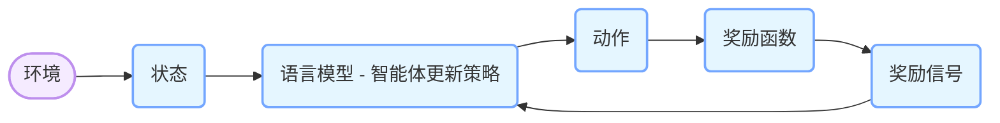

# 强化学习在语言模型训练中的角色

> 关键词：强化学习、语言模型训练、策略梯度、奖励函数、智能交互

> 摘要：本文深入探讨了强化学习在语言模型训练中的角色。首先介绍了相关背景，包括目的、预期读者等内容。接着阐述了强化学习和语言模型的核心概念及它们之间的联系，给出了相应的原理和架构示意图。详细讲解了核心算法原理，并用Python代码进行了阐述，同时给出了数学模型和公式。通过项目实战展示了如何在实际中运用强化学习进行语言模型训练，分析了实际应用场景。还推荐了学习资源、开发工具框架和相关论文著作。最后总结了未来发展趋势与挑战，解答了常见问题并提供了扩展阅读和参考资料，旨在为读者全面呈现强化学习在语言模型训练中的重要作用和应用方式。

## 1. 背景介绍 
### 1.1 目的和范围
随着人工智能技术的不断发展，语言模型在自然语言处理领域发挥着越来越重要的作用。传统的语言模型训练方法主要基于监督学习，通过大量的标注数据来学习语言的模式和规律。然而，这种方法存在一定的局限性，例如需要大量的标注数据、难以处理复杂的任务和环境等。强化学习作为一种机器学习范式，通过智能体与环境进行交互，根据环境反馈的奖励信号来学习最优策略，为语言模型的训练提供了新的思路和方法。

本文的目的是深入探讨强化学习在语言模型训练中的角色，分析其原理、算法和应用场景。具体范围包括强化学习和语言模型的核心概念，强化学习在语言模型训练中的核心算法原理和操作步骤，相关的数学模型和公式，以及实际项目中的应用案例。同时，还会介绍学习强化学习和语言模型训练的相关工具和资源，以及探讨未来的发展趋势和挑战。

### 1.2 预期读者
本文的预期读者包括人工智能、机器学习和自然语言处理领域的研究人员、工程师和开发者，以及对强化学习和语言模型训练感兴趣的学生和爱好者。读者需要具备一定的机器学习和概率论基础知识，了解Python编程语言。

### 1.3 文档结构概述
本文将按照以下结构进行组织：
1. **背景介绍**：介绍本文的目的、范围、预期读者和文档结构，以及相关的术语和概念。
2. **核心概念与联系**：阐述强化学习和语言模型的核心概念，以及它们之间的联系，给出原理和架构的文本示意图和Mermaid流程图。
3. **核心算法原理 & 具体操作步骤**：详细讲解强化学习在语言模型训练中的核心算法原理，并用Python源代码进行阐述。
4. **数学模型和公式 & 详细讲解 & 举例说明**：给出强化学习在语言模型训练中的数学模型和公式，并进行详细讲解和举例说明。
5. **项目实战：代码实际案例和详细解释说明**：通过实际项目案例，展示强化学习在语言模型训练中的应用，包括开发环境搭建、源代码实现和代码解读。
6. **实际应用场景**：分析强化学习在语言模型训练中的实际应用场景。
7. **工具和资源推荐**：推荐学习强化学习和语言模型训练的相关工具和资源，包括书籍、在线课程、技术博客、开发工具框架和相关论文著作。
8. **总结：未来发展趋势与挑战**：总结强化学习在语言模型训练中的未来发展趋势和面临的挑战。
9. **附录：常见问题与解答**：解答读者在学习和应用强化学习进行语言模型训练过程中常见的问题。
10. **扩展阅读 & 参考资料**：提供扩展阅读的建议和相关参考资料。

### 1.4 术语表
#### 1.4.1 核心术语定义
- **强化学习（Reinforcement Learning）**：一种机器学习范式，智能体通过与环境进行交互，根据环境反馈的奖励信号来学习最优策略。
- **语言模型（Language Model）**：一种概率模型，用于计算自然语言文本的概率分布，预测下一个可能出现的单词或字符。
- **策略（Policy）**：强化学习中智能体的行为规则，决定了智能体在每个状态下采取的动作。
- **奖励函数（Reward Function）**：强化学习中用于评估智能体动作好坏的函数，智能体的目标是最大化长期累积奖励。
- **状态（State）**：环境在某个时刻的特征表示，智能体根据状态来选择动作。
- **动作（Action）**：智能体在某个状态下采取的行为。

#### 1.4.2 相关概念解释
- **策略梯度（Policy Gradient）**：一种基于梯度的强化学习算法，通过直接优化策略函数来最大化累积奖励。
- **Actor-Critic算法**：一种结合了策略梯度和值函数的强化学习算法，由Actor和Critic两个部分组成。Actor负责生成动作，Critic负责评估动作的价值。
- **预训练语言模型（Pretrained Language Model）**：在大规模文本数据上进行无监督学习得到的语言模型，通常可以作为后续任务的基础模型。

#### 1.4.3 缩略词列表
- **RL**：Reinforcement Learning（强化学习）
- **LM**：Language Model（语言模型）
- **PG**：Policy Gradient（策略梯度）
- **AC**：Actor-Critic（Actor-Critic算法）
- **PLM**：Pretrained Language Model（预训练语言模型）

## 2. 核心概念与联系 

### 强化学习核心概念
强化学习的基本元素包括智能体（Agent）、环境（Environment）、状态（State）、动作（Action）和奖励（Reward）。智能体在环境中不断地进行交互，根据当前状态选择一个动作执行，环境接收到动作后会转移到下一个状态，并返回一个奖励信号给智能体。智能体的目标是学习一个最优策略，使得长期累积奖励最大化。

### 语言模型核心概念
语言模型的目标是计算自然语言文本的概率分布。给定一个文本序列 $w_1, w_2, \cdots, w_n$，语言模型可以计算出 $P(w_1, w_2, \cdots, w_n)$ 或者 $P(w_t|w_1, w_2, \cdots, w_{t - 1})$，即下一个单词 $w_t$ 在前面 $t - 1$ 个单词条件下的概率。常见的语言模型有基于统计的模型和基于神经网络的模型，如循环神经网络（RNN）、长短时记忆网络（LSTM）和Transformer等。

### 强化学习与语言模型的联系
在语言模型训练中引入强化学习，可以让语言模型不仅仅基于固定的标注数据进行学习，而是通过与环境的交互来动态调整自己的行为。例如，在对话系统中，语言模型可以作为智能体，根据用户的输入（状态）生成回复（动作），对话的流畅性、准确性等可以作为奖励信号。通过强化学习，语言模型可以学习到更符合用户需求和实际场景的回复策略。

### 原理和架构的文本示意图
```plaintext
强化学习与语言模型结合架构

环境（如对话场景）
|
| 状态（用户输入）
|
V
语言模型（智能体）
|
| 动作（生成回复）
|
V
奖励函数（评估回复质量）
|
| 奖励信号
|
V
语言模型（更新策略）
```

### Mermaid流程图


## 3. 核心算法原理 & 具体操作步骤 

### 策略梯度算法原理
策略梯度算法的核心思想是直接优化策略函数 $\pi_{\theta}(a|s)$，其中 $\theta$ 是策略函数的参数，$a$ 是动作，$s$ 是状态。策略梯度算法通过计算策略函数的梯度，沿着梯度方向更新参数，使得策略函数在长期累积奖励上取得最大值。

策略梯度的计算公式为：
$$\nabla_{\theta} J(\theta) = \mathbb{E}_{\tau \sim \pi_{\theta}} \left[ \sum_{t = 0}^{T} \nabla_{\theta} \log \pi_{\theta}(a_t|s_t) R(\tau) \right]$$
其中，$J(\theta)$ 是策略的性能指标，$\tau$ 是一个轨迹，包含了从初始状态到终止状态的一系列状态、动作和奖励，$R(\tau)$ 是轨迹 $\tau$ 的累积奖励。

### Python代码实现策略梯度算法
```python
import torch
import torch.nn as nn
import torch.optim as optim
import numpy as np

# 定义策略网络
class PolicyNetwork(nn.Module):
    def __init__(self, input_dim, output_dim):
        super(PolicyNetwork, self).__init__()
        self.fc1 = nn.Linear(input_dim, 128)
        self.fc2 = nn.Linear(128, output_dim)
        self.softmax = nn.Softmax(dim=-1)

    def forward(self, x):
        x = torch.relu(self.fc1(x))
        x = self.fc2(x)
        x = self.softmax(x)
        return x

# 定义强化学习智能体
class Agent:
    def __init__(self, input_dim, output_dim, lr=0.001):
        self.policy_network = PolicyNetwork(input_dim, output_dim)
        self.optimizer = optim.Adam(self.policy_network.parameters(), lr=lr)
        self.states = []
        self.actions = []
        self.rewards = []

    def choose_action(self, state):
        state = torch.FloatTensor(state).unsqueeze(0)
        probs = self.policy_network(state)
        action = torch.multinomial(probs, 1).item()
        return action

    def store_transition(self, state, action, reward):
        self.states.append(state)
        self.actions.append(action)
        self.rewards.append(reward)

    def learn(self):
        states = torch.FloatTensor(self.states)
        actions = torch.LongTensor(self.actions)
        rewards = torch.FloatTensor(self.rewards)

        # 计算累积奖励
        discounted_rewards = []
        cumulative_reward = 0
        for reward in reversed(rewards):
            cumulative_reward = reward + 0.9 * cumulative_reward
            discounted_rewards.insert(0, cumulative_reward)
        discounted_rewards = torch.FloatTensor(discounted_rewards)

        # 计算策略梯度
        probs = self.policy_network(states)
        log_probs = torch.log(probs.gather(1, actions.unsqueeze(1)))
        loss = -(log_probs.squeeze() * discounted_rewards).mean()

        # 更新策略网络
        self.optimizer.zero_grad()
        loss.backward()
        self.optimizer.step()

        # 清空存储的转换
        self.states = []
        self.actions = []
        self.rewards = []

# 示例使用
input_dim = 4
output_dim = 2
agent = Agent(input_dim, output_dim)

# 模拟环境交互
for episode in range(100):
    state = np.random.randn(input_dim)
    for step in range(20):
        action = agent.choose_action(state)
        # 模拟奖励
        reward = np.random.randn()
        next_state = np.random.randn(input_dim)
        agent.store_transition(state, action, reward)
        state = next_state
    agent.learn()
```

### 具体操作步骤
1. **初始化策略网络**：定义一个神经网络作为策略网络，初始化其参数。
2. **与环境交互**：在每个时间步，智能体根据当前状态从策略网络中采样一个动作，执行该动作并从环境中获取奖励和下一个状态。
3. **存储转换**：将当前状态、动作和奖励存储起来，用于后续的学习。
4. **计算累积奖励**：在一个轨迹结束后，计算每个时间步的累积奖励。
5. **计算策略梯度**：根据累积奖励和策略网络的输出，计算策略梯度。
6. **更新策略网络**：使用优化器（如Adam）沿着策略梯度的方向更新策略网络的参数。
7. **清空存储的转换**：为下一个轨迹的学习做好准备。

## 4. 数学模型和公式 & 详细讲解 & 举例说明 

### 策略梯度公式详细讲解
在强化学习中，策略 $\pi_{\theta}(a|s)$ 表示在状态 $s$ 下采取动作 $a$ 的概率，其中 $\theta$ 是策略的参数。策略的性能指标 $J(\theta)$ 通常定义为期望累积奖励：
$$J(\theta) = \mathbb{E}_{\tau \sim \pi_{\theta}} \left[ \sum_{t = 0}^{T} r_t \right]$$
其中，$\tau = (s_0, a_0, r_0, s_1, a_1, r_1, \cdots, s_T, a_T, r_T)$ 是一个轨迹，$r_t$ 是在时间步 $t$ 获得的奖励。

为了最大化 $J(\theta)$，我们可以使用梯度上升法，即沿着 $\nabla_{\theta} J(\theta)$ 的方向更新 $\theta$。通过一系列的推导（基于对数求导和重要性采样等方法），可以得到策略梯度的计算公式：
$$\nabla_{\theta} J(\theta) = \mathbb{E}_{\tau \sim \pi_{\theta}} \left[ \sum_{t = 0}^{T} \nabla_{\theta} \log \pi_{\theta}(a_t|s_t) R(\tau) \right]$$

### 举例说明
假设我们有一个简单的强化学习环境，状态空间 $S = \{s_1, s_2\}$，动作空间 $A = \{a_1, a_2\}$。策略网络的输出是一个概率分布，例如在状态 $s_1$ 下，策略网络输出 $\pi_{\theta}(a_1|s_1) = 0.6$，$\pi_{\theta}(a_2|s_1) = 0.4$。

智能体在状态 $s_1$ 下采样得到动作 $a_1$，并获得奖励 $r_1 = 1$。在状态 $s_2$ 下采样得到动作 $a_2$，并获得奖励 $r_2 = 2$。则轨迹 $\tau = (s_1, a_1, r_1, s_2, a_2, r_2)$ 的累积奖励 $R(\tau) = r_1 + r_2 = 3$。

假设策略网络是一个简单的线性模型，$\pi_{\theta}(a|s) = \text{softmax}(W s)$，其中 $W$ 是参数矩阵。我们可以计算 $\nabla_{\theta} \log \pi_{\theta}(a_1|s_1)$ 和 $\nabla_{\theta} \log \pi_{\theta}(a_2|s_2)$，然后根据策略梯度公式更新 $W$。

### Actor-Critic算法的数学模型
Actor-Critic算法结合了策略梯度和值函数。Actor负责生成动作，Critic负责评估动作的价值。Critic通常使用一个值函数 $V_{\phi}(s)$ 来估计状态 $s$ 的价值，或者使用一个动作价值函数 $Q_{\phi}(s, a)$ 来估计在状态 $s$ 下采取动作 $a$ 的价值。

Actor的目标是最大化累积奖励，其策略梯度的计算公式为：
$$\nabla_{\theta} J(\theta) = \mathbb{E}_{\tau \sim \pi_{\theta}} \left[ \sum_{t = 0}^{T} \nabla_{\theta} \log \pi_{\theta}(a_t|s_t) A(s_t, a_t) \right]$$
其中，$A(s_t, a_t) = Q_{\phi}(s_t, a_t) - V_{\phi}(s_t)$ 是优势函数，表示在状态 $s_t$ 下采取动作 $a_t$ 相对于平均价值的优势。

Critic的目标是最小化值函数的估计误差，通常使用均方误差损失：
$$L(\phi) = \mathbb{E}_{\tau \sim \pi_{\theta}} \left[ \left( r_t + \gamma V_{\phi}(s_{t + 1}) - V_{\phi}(s_t) \right)^2 \right]$$
其中，$\gamma$ 是折扣因子。

## 5. 项目实战：代码实际案例和详细解释说明 

### 5.1  开发环境搭建
#### 安装Python
首先，确保你已经安装了Python 3.6或更高版本。你可以从Python官方网站（https://www.python.org/downloads/）下载并安装Python。

#### 安装必要的库
使用以下命令安装必要的Python库：
```bash
pip install torch numpy
```
`torch` 是PyTorch深度学习框架，用于构建和训练神经网络。`numpy` 是Python的数值计算库，用于处理数组和矩阵运算。

### 5.2  源代码详细实现和代码解读
以下是一个使用强化学习训练语言模型生成文本的示例代码：
```python
import torch
import torch.nn as nn
import torch.optim as optim
import numpy as np

# 定义简单的语言模型
class LanguageModel(nn.Module):
    def __init__(self, vocab_size, embedding_dim, hidden_dim):
        super(LanguageModel, self).__init__()
        self.embedding = nn.Embedding(vocab_size, embedding_dim)
        self.rnn = nn.GRU(embedding_dim, hidden_dim, batch_first=True)
        self.fc = nn.Linear(hidden_dim, vocab_size)

    def forward(self, x):
        embedded = self.embedding(x)
        output, _ = self.rnn(embedded)
        logits = self.fc(output)
        return logits

# 定义强化学习智能体
class Agent:
    def __init__(self, vocab_size, embedding_dim, hidden_dim, lr=0.001):
        self.language_model = LanguageModel(vocab_size, embedding_dim, hidden_dim)
        self.optimizer = optim.Adam(self.language_model.parameters(), lr=lr)
        self.states = []
        self.actions = []
        self.rewards = []

    def choose_action(self, state):
        state = torch.LongTensor(state).unsqueeze(0)
        logits = self.language_model(state)
        probs = torch.softmax(logits, dim=-1)
        action = torch.multinomial(probs.squeeze(), 1).item()
        return action

    def store_transition(self, state, action, reward):
        self.states.append(state)
        self.actions.append(action)
        self.rewards.append(reward)

    def learn(self):
        states = torch.LongTensor(self.states)
        actions = torch.LongTensor(self.actions)
        rewards = torch.FloatTensor(self.rewards)

        # 计算累积奖励
        discounted_rewards = []
        cumulative_reward = 0
        for reward in reversed(rewards):
            cumulative_reward = reward + 0.9 * cumulative_reward
            discounted_rewards.insert(0, cumulative_reward)
        discounted_rewards = torch.FloatTensor(discounted_rewards)

        # 计算策略梯度
        logits = self.language_model(states)
        probs = torch.softmax(logits, dim=-1)
        log_probs = torch.log(probs.gather(1, actions.unsqueeze(1)))
        loss = -(log_probs.squeeze() * discounted_rewards).mean()

        # 更新语言模型
        self.optimizer.zero_grad()
        loss.backward()
        self.optimizer.step()

        # 清空存储的转换
        self.states = []
        self.actions = []
        self.rewards = []

# 示例使用
vocab_size = 100
embedding_dim = 128
hidden_dim = 256
agent = Agent(vocab_size, embedding_dim, hidden_dim)

# 模拟文本生成环境
for episode in range(100):
    state = [np.random.randint(0, vocab_size)]
    for step in range(20):
        action = agent.choose_action(state)
        # 模拟奖励（这里简单使用随机奖励）
        reward = np.random.randn()
        next_state = state + [action]
        agent.store_transition(state, action, reward)
        state = next_state
    agent.learn()
```

### 5.3  代码解读与分析
#### 语言模型定义
`LanguageModel` 类定义了一个简单的基于GRU的语言模型。它包含一个嵌入层、一个GRU层和一个全连接层。嵌入层将输入的单词索引转换为向量表示，GRU层处理序列数据，全连接层将GRU的输出映射到词汇表大小的维度，输出每个单词的得分。

#### 强化学习智能体定义
`Agent` 类包含了语言模型和优化器，以及存储状态、动作和奖励的列表。`choose_action` 方法根据当前状态从语言模型的输出中采样一个动作（即下一个单词的索引）。`store_transition` 方法将当前状态、动作和奖励存储起来。`learn` 方法在一个轨迹结束后，计算累积奖励和策略梯度，更新语言模型的参数。

#### 训练过程
在训练过程中，我们模拟了一个文本生成环境。在每个episode中，随机选择一个初始单词作为状态，然后智能体根据当前状态选择下一个单词，获得奖励并更新状态。在一个episode结束后，调用 `learn` 方法更新语言模型。

## 6. 实际应用场景 
### 对话系统
在对话系统中，强化学习可以帮助语言模型学习更自然、更符合用户需求的回复策略。传统的对话系统通常基于规则或监督学习，难以处理复杂的上下文和用户意图。通过强化学习，语言模型可以与用户进行交互，根据用户的反馈（如满意度评分）来调整自己的回复策略。例如，在智能客服系统中，语言模型可以学习如何更好地解答用户的问题，提高用户满意度。

### 文本摘要
文本摘要的目标是从长文本中提取关键信息，生成简洁的摘要。强化学习可以用于优化摘要的质量。可以定义一个奖励函数，评估摘要的准确性、完整性和可读性等指标。语言模型作为智能体，通过与环境（文本数据）进行交互，学习如何生成更优质的摘要。例如，在新闻摘要系统中，强化学习可以帮助语言模型生成更吸引读者的摘要。

### 机器翻译
在机器翻译中，强化学习可以用于优化翻译的质量。传统的机器翻译方法主要基于统计模型或神经网络模型，生成的翻译结果可能存在语义不准确、语法错误等问题。通过强化学习，可以定义一个奖励函数，评估翻译结果的质量，如翻译的准确性、流畅性等。语言模型可以根据奖励信号不断调整翻译策略，提高翻译质量。例如，在跨语言交流系统中，强化学习可以帮助语言模型生成更准确、更自然的翻译结果。

### 智能写作
在智能写作领域，强化学习可以帮助语言模型生成更有创意、更符合主题的文本。可以定义一个奖励函数，评估生成文本的质量，如文本的逻辑性、连贯性、情感表达等。语言模型通过与环境（写作任务）进行交互，学习如何生成更优质的文本。例如，在自动新闻写作系统中，强化学习可以帮助语言模型生成更生动、更有深度的新闻报道。

## 7. 工具和资源推荐
### 7.1 学习资源推荐
#### 7.1.1 书籍推荐
- 《Reinforcement Learning: An Introduction》（第二版）：由Richard S. Sutton和Andrew G. Barto所著，是强化学习领域的经典教材，系统地介绍了强化学习的基本概念、算法和应用。
- 《Natural Language Processing with Python》：由Steven Bird、Ewan Klein和Edward Loper所著，介绍了使用Python进行自然语言处理的基本方法和技术，包括语言模型的构建和训练。
- 《Deep Learning》：由Ian Goodfellow、Yoshua Bengio和Aaron Courville所著，是深度学习领域的经典教材，涵盖了神经网络、深度学习算法和应用等方面的内容。

#### 7.1.2 在线课程
- Coursera上的“Reinforcement Learning Specialization”：由Alberta大学的教授授课，系统地介绍了强化学习的理论和实践，包括策略梯度、Actor-Critic算法等。
- edX上的“Natural Language Processing”：由哥伦比亚大学的教授授课，介绍了自然语言处理的基本概念、算法和应用，包括语言模型、机器翻译等。
- Udemy上的“Deep Learning A-Z™: Hands-On Artificial Neural Networks”：介绍了深度学习的基本概念和算法，包括神经网络的构建和训练，适合初学者。

#### 7.1.3 技术博客和网站
- OpenAI博客（https://openai.com/blog/）：OpenAI团队发布的最新研究成果和技术文章，涵盖了强化学习、自然语言处理等领域。
- DeepMind博客（https://deepmind.com/blog/）：DeepMind团队发布的最新研究成果和技术文章，在强化学习和人工智能领域具有很高的影响力。
- Towards Data Science（https://towardsdatascience.com/）：一个数据科学和人工智能领域的技术博客平台，有很多关于强化学习和语言模型的文章。

### 7.2 开发工具框架推荐
#### 7.2.1 IDE和编辑器
- PyCharm：一个专业的Python集成开发环境，提供了代码编辑、调试、版本控制等功能，适合Python开发。
- Jupyter Notebook：一个交互式的开发环境，支持Python、R等多种编程语言，适合数据分析和模型实验。
- Visual Studio Code：一个轻量级的代码编辑器，支持多种编程语言和插件，具有丰富的扩展功能。

#### 7.2.2 调试和性能分析工具
- TensorBoard：TensorFlow的可视化工具，可以用于可视化训练过程中的损失函数、准确率等指标，帮助调试和优化模型。
- PyTorch Profiler：PyTorch的性能分析工具，可以用于分析模型的运行时间、内存使用等情况，帮助优化模型性能。
- cProfile：Python的内置性能分析工具，可以用于分析Python代码的运行时间和函数调用情况。

#### 7.2.3 相关框架和库
- PyTorch：一个开源的深度学习框架，提供了丰富的神经网络模块和优化算法，支持GPU加速，适合构建和训练语言模型。
- TensorFlow：一个开源的深度学习框架，提供了高级的API和分布式训练功能，广泛应用于工业界和学术界。
- Gym：OpenAI开发的一个强化学习环境库，提供了多种经典的强化学习环境，方便进行强化学习算法的实验和评估。

### 7.3 相关论文著作推荐
#### 7.3.1 经典论文
- “Policy Gradient Methods for Reinforcement Learning with Function Approximation”：由Richard S. Sutton等人发表，提出了策略梯度算法，是强化学习领域的经典论文。
- “Attention Is All You Need”：由Google Brain团队发表，提出了Transformer架构，在自然语言处理领域取得了巨大的成功。
- “Deep Reinforcement Learning from Human Preferences”：由OpenAI团队发表，介绍了如何使用人类偏好来训练强化学习智能体，提高智能体的性能。

#### 7.3.2 最新研究成果
- 关注NeurIPS、ICML、ACL等顶级学术会议的最新论文，了解强化学习和语言模型领域的最新研究成果。
- 在arXiv预印本平台上搜索相关的研究论文，获取最新的研究动态。

#### 7.3.3 应用案例分析
- 阅读相关的技术博客和报告，了解强化学习在语言模型训练中的实际应用案例，学习如何解决实际问题。
- 参考工业界的开源项目，了解如何将强化学习和语言模型应用于实际产品中。

## 8. 总结：未来发展趋势与挑战
### 未来发展趋势
#### 多模态融合
未来的语言模型训练可能会结合多模态信息，如图像、音频等。强化学习可以用于优化多模态信息的融合策略，提高语言模型在多模态场景下的理解和生成能力。例如，在智能视频问答系统中，语言模型可以结合视频内容和用户的问题，生成更准确的回答。

#### 大规模预训练与强化学习结合
大规模预训练语言模型已经取得了显著的成果，但在特定任务上的性能仍有待提高。强化学习可以用于对预训练语言模型进行微调，使其更好地适应特定任务的需求。通过强化学习，可以在少量标注数据的情况下，快速提升语言模型在特定任务上的性能。

#### 强化学习与人类反馈的深度融合
人类反馈可以为强化学习提供更有价值的信息，帮助语言模型学习到更符合人类需求的策略。未来的研究可能会探索如何更有效地收集和利用人类反馈，提高强化学习的效率和性能。例如，通过交互式学习的方式，让人类与语言模型进行实时交互，提供反馈和指导。

### 面临的挑战
#### 奖励函数设计
奖励函数的设计是强化学习中的一个关键问题。在语言模型训练中，如何设计合理的奖励函数来评估语言生成的质量是一个挑战。奖励函数需要考虑多个因素，如语义准确性、语法正确性、流畅性等，而且不同的应用场景可能需要不同的奖励函数。

#### 计算资源需求
强化学习通常需要大量的计算资源来进行训练，尤其是在处理大规模语言模型时。训练过程中需要进行大量的环境交互和梯度计算，对硬件设备的性能要求较高。如何在有限的计算资源下提高强化学习的训练效率是一个亟待解决的问题。

#### 可解释性和安全性
强化学习训练的语言模型可能存在可解释性和安全性问题。由于强化学习的决策过程通常是基于复杂的策略网络，很难解释模型为什么做出某个决策。此外，模型可能会学习到一些不安全或不道德的策略，需要采取措施来确保模型的安全性和可靠性。

## 9. 附录：常见问题与解答
### 问题1：强化学习在语言模型训练中的优势是什么？
答：强化学习可以让语言模型通过与环境的交互来动态调整自己的行为，不仅仅依赖于固定的标注数据。它可以学习到更符合实际场景和用户需求的策略，提高语言模型在复杂任务和环境下的性能。例如，在对话系统中，强化学习可以帮助语言模型根据用户的反馈不断优化回复策略，提高用户满意度。

### 问题2：如何设计合适的奖励函数？
答：设计合适的奖励函数需要考虑具体的应用场景和任务目标。一般来说，奖励函数应该能够反映语言生成的质量，如语义准确性、语法正确性、流畅性等。可以使用人工标注数据来评估生成结果，并根据评估结果设计奖励函数。此外，还可以结合一些自动评估指标，如BLEU、ROUGE等，来设计奖励函数。

### 问题3：强化学习训练语言模型需要多少计算资源？
答：强化学习训练语言模型的计算资源需求取决于多个因素，如模型的规模、训练数据的大小、训练算法的复杂度等。一般来说，训练大规模语言模型需要大量的计算资源，可能需要使用GPU集群或云计算平台来进行训练。可以通过优化算法、使用分布式训练等方法来减少计算资源的需求。

### 问题4：强化学习训练的语言模型是否具有可解释性？
答：强化学习训练的语言模型通常缺乏可解释性。由于策略网络的决策过程通常是基于复杂的神经网络，很难解释模型为什么做出某个决策。为了提高模型的可解释性，可以采用一些方法，如可视化策略网络的中间层输出、分析策略网络的权重等。

## 10. 扩展阅读 & 参考资料
### 扩展阅读
- 《Hierarchical Reinforcement Learning: Foundation, Algorithms, and Applications》：深入介绍了分层强化学习的理论和算法，对于理解复杂环境下的强化学习有很大帮助。
- 《Neural Network Methods in Natural Language Processing》：详细介绍了神经网络在自然语言处理中的应用，包括语言模型、机器翻译等方面的内容。
- 《The Hundred-Page Machine Learning Book》：一本简洁易懂的机器学习入门书籍，适合快速了解机器学习的基本概念和算法。

### 参考资料
- Sutton, R. S., & Barto, A. G. (2018). Reinforcement Learning: An Introduction. MIT press.
- Bird, S., Klein, E., & Loper, E. (2009). Natural Language Processing with Python. O'Reilly Media.
- Goodfellow, I., Bengio, Y., & Courville, A. (2016). Deep Learning. MIT press.

作者：AI天才研究院/AI Genius Institute & 禅与计算机程序设计艺术 /Zen And The Art of Computer Programming