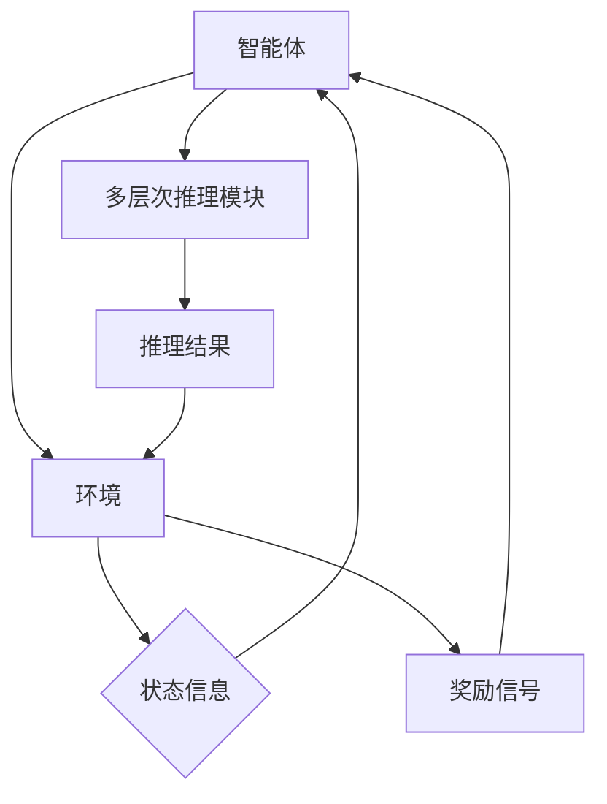

# 强化学习驱动的自适应多层次推理策略

> 关键词：强化学习、自适应多层次推理、策略优化、智能决策、推理效率

> 摘要：本文聚焦于强化学习驱动的自适应多层次推理策略，深入探讨了该策略的核心概念、算法原理、数学模型等内容。通过详细的Python代码示例展示了如何实现这一策略，并结合实际应用场景阐述了其优势和价值。同时，推荐了相关的学习资源、开发工具和论文著作，最后对该策略的未来发展趋势与挑战进行了总结，旨在为相关领域的研究者和开发者提供全面而深入的参考。

## 1. 背景介绍 
### 1.1 目的和范围
在当今复杂的信息环境中，高效准确的推理决策变得至关重要。强化学习驱动的自适应多层次推理策略旨在利用强化学习的优势，实现更加智能、灵活和高效的推理过程。本文章的范围涵盖了该策略的核心原理、算法实现、实际应用等多个方面，旨在为读者全面介绍这一前沿技术。

### 1.2 预期读者
本文预期读者包括计算机科学、人工智能、机器学习等领域的研究者、开发者，以及对智能推理和决策感兴趣的技术爱好者。

### 1.3 文档结构概述
本文首先介绍强化学习驱动的自适应多层次推理策略的背景知识，包括目的、预期读者和文档结构。接着阐述核心概念与联系，通过文本示意图和Mermaid流程图进行说明。然后详细讲解核心算法原理和具体操作步骤，使用Python源代码进行阐述。之后介绍数学模型和公式，并举例说明。再通过项目实战展示代码实际案例和详细解释。随后探讨实际应用场景，推荐相关的工具和资源。最后总结未来发展趋势与挑战，提供常见问题与解答和扩展阅读及参考资料。

### 1.4 术语表
#### 1.4.1 核心术语定义
- **强化学习**：一种机器学习方法，智能体通过与环境进行交互，根据环境反馈的奖励信号来学习最优策略。
- **自适应多层次推理**：推理过程具有多个层次，并且能够根据不同的情况自动调整推理策略。
- **策略**：智能体在不同状态下选择动作的规则。

#### 1.4.2 相关概念解释
- **状态**：环境的一种表示，描述了当前的情况。
- **动作**：智能体在某个状态下可以采取的操作。
- **奖励**：环境对智能体采取的动作的反馈，用于评估动作的好坏。

#### 1.4.3 缩略词列表
- **RL**：强化学习（Reinforcement Learning）
- **Q - learning**：一种基于值函数的强化学习算法（Q - learning Algorithm）

## 2. 核心概念与联系 

### 核心概念原理
强化学习驱动的自适应多层次推理策略的核心思想是将强化学习与多层次推理相结合。在传统的推理过程中，往往采用固定的推理规则，缺乏灵活性和适应性。而强化学习可以通过智能体与环境的交互，不断学习最优的推理策略。

多层次推理则是将推理过程分为多个层次，每个层次处理不同的信息和任务。较低层次的推理可以提供更具体的细节信息，而较高层次的推理则可以进行更宏观的决策。智能体根据环境的状态，在不同层次之间进行切换和选择，以实现高效的推理。

### 架构的文本示意图
该策略的架构主要包括智能体、环境和多层次推理模块。智能体通过与环境进行交互，获取环境的状态信息，并根据当前状态选择合适的动作。多层次推理模块根据智能体的动作，在不同层次的推理规则之间进行切换，完成推理任务。环境根据推理结果给予智能体相应的奖励，智能体根据奖励信号更新自己的策略。

### Mermaid流程图


## 3. 核心算法原理 & 具体操作步骤 

### 算法原理
我们以Q - learning算法为例来阐述强化学习驱动的自适应多层次推理策略的核心算法原理。Q - learning是一种基于值函数的强化学习算法，其目标是学习一个最优的动作价值函数 $Q(s, a)$，表示在状态 $s$ 下采取动作 $a$ 的期望累计奖励。

Q - learning的更新公式为：
$$Q(s_t, a_t) \leftarrow Q(s_t, a_t) + \alpha [r_{t+1} + \gamma \max_{a} Q(s_{t+1}, a) - Q(s_t, a_t)]$$
其中，$s_t$ 是当前状态，$a_t$ 是当前动作，$r_{t+1}$ 是采取动作 $a_t$ 后获得的奖励，$s_{t+1}$ 是下一个状态，$\alpha$ 是学习率，$\gamma$ 是折扣因子。

### 具体操作步骤
#### 步骤1：初始化
初始化动作价值函数 $Q(s, a)$ 为零，设置学习率 $\alpha$、折扣因子 $\gamma$ 和探索率 $\epsilon$。

#### 步骤2：智能体与环境交互
- 观察当前状态 $s_t$。
- 根据 $\epsilon$ - 贪心策略选择动作 $a_t$：以概率 $\epsilon$ 随机选择一个动作，以概率 $1 - \epsilon$ 选择使 $Q(s_t, a)$ 最大的动作。
- 执行动作 $a_t$，观察环境反馈的奖励 $r_{t+1}$ 和下一个状态 $s_{t+1}$。

#### 步骤3：更新Q值
根据Q - learning的更新公式更新 $Q(s_t, a_t)$。

#### 步骤4：判断是否结束
如果达到最大步数或者满足终止条件，则结束训练；否则，返回步骤2。

### Python源代码实现
```python
import numpy as np

# 初始化参数
alpha = 0.1  # 学习率
gamma = 0.9  # 折扣因子
epsilon = 0.1  # 探索率
num_states = 10  # 状态数量
num_actions = 4  # 动作数量
max_steps = 100  # 最大步数

# 初始化Q表
Q = np.zeros((num_states, num_actions))

# 定义环境交互函数
def interact(state, action):
    # 这里简单模拟环境反馈，实际应用中需要根据具体情况实现
    next_state = (state + action) % num_states
    reward = 1 if next_state == 0 else 0
    return next_state, reward

# 训练过程
for episode in range(100):
    state = np.random.randint(0, num_states)
    for step in range(max_steps):
        if np.random.uniform(0, 1) < epsilon:
            action = np.random.randint(0, num_actions)
        else:
            action = np.argmax(Q[state, :])
        next_state, reward = interact(state, action)
        # 更新Q值
        Q[state, action] = Q[state, action] + alpha * (reward + gamma * np.max(Q[next_state, :]) - Q[state, action])
        state = next_state
        if next_state == 0:
            break

print("训练完成后的Q表：")
print(Q)
```

## 4. 数学模型和公式 & 详细讲解 & 举例说明 

### 数学模型和公式
#### 动作价值函数
动作价值函数 $Q(s, a)$ 表示在状态 $s$ 下采取动作 $a$ 后，按照当前策略继续执行所能获得的期望累计奖励。其定义为：
$$Q^{\pi}(s, a) = \mathbb{E}_{\pi} \left[ \sum_{k = 0}^{\infty} \gamma^k r_{t + k + 1} \mid s_t = s, a_t = a \right]$$
其中，$\pi$ 是策略，$\gamma$ 是折扣因子，$r_{t + k + 1}$ 是在时间步 $t + k + 1$ 获得的奖励。

#### 最优动作价值函数
最优动作价值函数 $Q^*(s, a)$ 是所有策略下的最大动作价值函数，即：
$$Q^*(s, a) = \max_{\pi} Q^{\pi}(s, a)$$

#### Bellman方程
Bellman方程描述了动作价值函数的递归关系：
$$Q^{\pi}(s, a) = \mathbb{E} \left[ r_{t+1} + \gamma Q^{\pi}(s_{t+1}, a_{t+1}) \mid s_t = s, a_t = a \right]$$
对于最优动作价值函数，有Bellman最优方程：
$$Q^*(s, a) = \mathbb{E} \left[ r_{t+1} + \gamma \max_{a'} Q^*(s_{t+1}, a') \mid s_t = s, a_t = a \right]$$

### 详细讲解
动作价值函数是强化学习中的核心概念，它用于评估在某个状态下采取某个动作的好坏。通过不断更新动作价值函数，智能体可以学习到最优的策略。

Bellman方程将当前状态的动作价值函数与下一个状态的动作价值函数联系起来，为我们提供了一种迭代求解动作价值函数的方法。Q - learning算法就是基于Bellman最优方程来更新动作价值函数的。

### 举例说明
假设我们有一个简单的网格世界环境，智能体在网格中移动，目标是到达网格的右下角。状态 $s$ 表示智能体在网格中的位置，动作 $a$ 表示智能体的移动方向（上、下、左、右）。

当智能体处于状态 $s$ 并采取动作 $a$ 后，会获得一个奖励 $r$。例如，如果智能体移动到了目标位置，奖励 $r = 1$；否则，奖励 $r = 0$。

根据Bellman方程，我们可以不断更新动作价值函数 $Q(s, a)$，直到收敛到最优动作价值函数 $Q^*(s, a)$。这样，智能体就可以根据 $Q^*(s, a)$ 选择最优的动作，从而高效地到达目标位置。

## 5. 项目实战：代码实际案例和详细解释说明 

### 5.1  开发环境搭建
#### 安装Python
首先，确保你已经安装了Python 3.x版本。可以从Python官方网站（https://www.python.org/downloads/）下载并安装。

#### 安装必要的库
我们需要安装NumPy库来进行数值计算。可以使用以下命令进行安装：
```sh
pip install numpy
```

### 5.2  源代码详细实现和代码解读
```python
import numpy as np

# 初始化参数
alpha = 0.1  # 学习率
gamma = 0.9  # 折扣因子
epsilon = 0.1  # 探索率
num_states = 10  # 状态数量
num_actions = 4  # 动作数量
max_steps = 100  # 最大步数

# 初始化Q表
Q = np.zeros((num_states, num_actions))

# 定义环境交互函数
def interact(state, action):
    # 这里简单模拟环境反馈，实际应用中需要根据具体情况实现
    next_state = (state + action) % num_states
    reward = 1 if next_state == 0 else 0
    return next_state, reward

# 训练过程
for episode in range(100):
    state = np.random.randint(0, num_states)
    for step in range(max_steps):
        if np.random.uniform(0, 1) < epsilon:
            action = np.random.randint(0, num_actions)
        else:
            action = np.argmax(Q[state, :])
        next_state, reward = interact(state, action)
        # 更新Q值
        Q[state, action] = Q[state, action] + alpha * (reward + gamma * np.max(Q[next_state, :]) - Q[state, action])
        state = next_state
        if next_state == 0:
            break

print("训练完成后的Q表：")
print(Q)
```
#### 代码解读
- **参数初始化**：设置学习率 $\alpha$、折扣因子 $\gamma$、探索率 $\epsilon$ 等参数，并初始化Q表为零。
- **环境交互函数**：`interact` 函数模拟了智能体与环境的交互过程，根据当前状态和动作返回下一个状态和奖励。
- **训练过程**：使用嵌套循环进行训练，外层循环控制训练的轮数，内层循环控制每一轮的步数。在每一步中，根据 $\epsilon$ - 贪心策略选择动作，执行动作后更新Q值。如果到达目标状态，则结束当前轮的训练。

### 5.3  代码解读与分析
通过上述代码，我们实现了一个简单的Q - learning算法来训练智能体。在训练过程中，智能体不断与环境进行交互，根据环境反馈的奖励信号更新Q表。随着训练的进行，Q表逐渐收敛到最优动作价值函数，智能体可以根据Q表选择最优的动作。

需要注意的是，在实际应用中，环境交互函数需要根据具体的问题进行实现，并且可能需要调整参数以获得更好的训练效果。

## 6. 实际应用场景 
### 智能游戏
在智能游戏中，强化学习驱动的自适应多层次推理策略可以用于训练游戏智能体。例如，在围棋、象棋等棋类游戏中，智能体可以通过与对手的交互，不断学习最优的落子策略。多层次推理可以帮助智能体在不同的局面下选择合适的推理层次，提高决策效率。

### 机器人导航
在机器人导航领域，该策略可以帮助机器人根据环境的实时信息，自适应地选择不同的导航策略。例如，在复杂的室内环境中，机器人可以根据障碍物的分布和目标位置，在全局导航和局部避障两个层次之间进行切换，实现高效的导航。

### 金融投资决策
在金融投资领域，强化学习驱动的自适应多层次推理策略可以用于构建投资决策模型。智能体可以根据市场的历史数据和实时信息，在宏观经济分析、行业分析和个股分析等多个层次进行推理，选择最优的投资组合。

## 7. 工具和资源推荐
### 7.1 学习资源推荐
#### 7.1.1 书籍推荐
- 《强化学习：原理与Python实现》：本书系统地介绍了强化学习的基本原理和算法，并通过Python代码示例进行了详细的讲解。
- 《深度学习》：虽然主要介绍深度学习，但其中也包含了强化学习的相关内容，对于理解强化学习的背景和应用有很大的帮助。

#### 7.1.2 在线课程
- Coursera上的“Reinforcement Learning Specialization”：由知名教授授课，涵盖了强化学习的各个方面，包括算法原理、应用案例等。
- edX上的“Introduction to Reinforcement Learning”：提供了丰富的教学资源和实践项目，适合初学者学习。

#### 7.1.3 技术博客和网站
- OpenAI博客：发布了许多关于强化学习的最新研究成果和应用案例。
- Towards Data Science：有大量关于机器学习和强化学习的技术文章，涵盖了从基础概念到高级算法的各个方面。

### 7.2 开发工具框架推荐
#### 7.2.1 IDE和编辑器
- PyCharm：功能强大的Python集成开发环境，提供了代码编辑、调试、版本控制等一系列功能。
- Jupyter Notebook：交互式的开发环境，适合进行数据分析和算法实验。

#### 7.2.2 调试和性能分析工具
- TensorBoard：用于可视化深度学习模型的训练过程和性能指标。
- cProfile：Python自带的性能分析工具，可以帮助我们找出代码中的性能瓶颈。

#### 7.2.3 相关框架和库
- OpenAI Gym：一个用于开发和比较强化学习算法的工具包，提供了丰富的环境和接口。
- Stable Baselines3：基于PyTorch的强化学习库，提供了多种预训练的强化学习算法。

### 7.3 相关论文著作推荐
#### 7.3.1 经典论文
- “Q - learning”：Watkins和Dayan在1992年发表的论文，首次提出了Q - learning算法。
- “Playing Atari with Deep Reinforcement Learning”：Mnih等人在2013年发表的论文，开创了深度强化学习在游戏领域的应用。

#### 7.3.2 最新研究成果
- 可以关注NeurIPS、ICML等顶级机器学习会议上发表的关于强化学习的最新研究成果。

#### 7.3.3 应用案例分析
- 许多科技公司的官方博客会分享强化学习在实际应用中的案例，例如Google、Facebook等。

## 8. 总结：未来发展趋势与挑战
### 未来发展趋势
- **与深度学习的深度融合**：强化学习与深度学习的结合将进一步推动智能推理和决策的发展。例如，深度强化学习可以处理更复杂的环境和任务，提高推理的准确性和效率。
- **多智能体强化学习**：在实际应用中，往往需要多个智能体进行协作和竞争。多智能体强化学习将成为未来的研究热点，用于解决复杂的多智能体系统问题。
- **可解释性强化学习**：随着强化学习在关键领域的应用越来越广泛，对其可解释性的要求也越来越高。未来的研究将致力于提高强化学习模型的可解释性，使其决策过程更加透明和可信。

### 挑战
- **样本效率问题**：强化学习通常需要大量的样本进行训练，样本效率较低。如何提高样本效率，减少训练时间和成本，是当前面临的一个重要挑战。
- **环境建模问题**：在实际应用中，环境往往是复杂和不确定的。如何准确地建模环境，是强化学习面临的另一个挑战。
- **安全性问题**：在一些关键领域，如自动驾驶、医疗等，强化学习系统的安全性至关重要。如何确保强化学习系统的安全性，避免出现意外情况，是需要解决的问题。

## 9. 附录：常见问题与解答
### 问题1：强化学习和监督学习有什么区别？
强化学习是通过智能体与环境的交互，根据环境反馈的奖励信号来学习最优策略；而监督学习是基于有标签的数据进行学习，目标是最小化预测值与真实值之间的误差。

### 问题2：如何选择合适的学习率和折扣因子？
学习率和折扣因子的选择通常需要通过实验来确定。一般来说，学习率不宜过大，否则会导致算法不稳定；折扣因子通常取值在0.9 - 0.99之间，用于平衡短期奖励和长期奖励。

### 问题3：Q - learning算法一定能收敛到最优策略吗？
在满足一定条件下，Q - learning算法可以收敛到最优策略。这些条件包括环境是静态的、动作空间和状态空间是有限的等。

## 10. 扩展阅读 & 参考资料
- Sutton, R. S., & Barto, A. G. (2018). Reinforcement learning: An introduction. MIT press.
- Mnih, V., Kavukcuoglu, K., Silver, D., Graves, A., Antonoglou, I., Wierstra, D., & Riedmiller, M. (2013). Playing atari with deep reinforcement learning. arXiv preprint arXiv:1312.5602.
- OpenAI官方文档：https://openai.com/
- Stable Baselines3官方文档：https://stable-baselines3.readthedocs.io/

作者：AI天才研究院/AI Genius Institute & 禅与计算机程序设计艺术 /Zen And The Art of Computer Programming