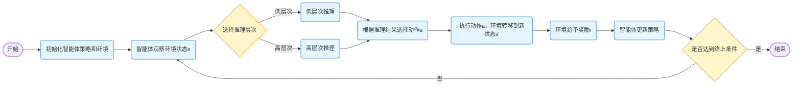

# 强化学习驱动的自适应多层次推理策略优化

> 关键词：强化学习、自适应多层次推理、策略优化、马尔可夫决策过程、深度强化学习

> 摘要：本文聚焦于强化学习驱动的自适应多层次推理策略优化这一前沿课题。首先介绍了该研究的背景、目的和适用范围，明确预期读者群体。详细阐述了核心概念及其联系，包括强化学习、多层次推理等概念的原理与架构，并通过文本示意图和Mermaid流程图进行直观展示。深入探讨了核心算法原理，结合Python源代码详细讲解操作步骤。运用数学模型和公式对算法进行了理论分析，并举例说明。通过项目实战，从开发环境搭建到源代码实现与解读，展示了该策略在实际中的应用。分析了实际应用场景，推荐了相关的学习资源、开发工具框架以及论文著作。最后总结了未来发展趋势与挑战，解答常见问题，并提供扩展阅读和参考资料，旨在为相关领域的研究和实践提供全面且深入的指导。

## 1. 背景介绍 
### 1.1 目的和范围
在当今复杂多变的环境中，智能系统需要具备高效、灵活的推理能力，以应对各种不确定性和动态变化。传统的推理策略往往缺乏自适应能力，难以在不同场景下达到最优性能。强化学习驱动的自适应多层次推理策略优化旨在利用强化学习的强大能力，使智能系统能够根据环境反馈动态调整推理策略，实现多层次的高效推理。本研究的范围涵盖了从理论原理到实际应用的多个方面，包括核心概念的理解、算法的设计与实现、数学模型的建立、项目实战以及实际应用场景的探索等。

### 1.2 预期读者
本文预期读者包括计算机科学、人工智能、自动化控制等领域的研究人员、工程师和学生。对于对强化学习和推理策略优化感兴趣的初学者，本文可以作为入门指南，帮助他们了解相关概念和技术；对于有一定经验的专业人士，本文提供了深入的理论分析和实际应用案例，可供他们进一步研究和实践参考。

### 1.3 文档结构概述
本文将按照以下结构进行组织：首先介绍核心概念与联系，通过文本示意图和Mermaid流程图清晰展示强化学习与自适应多层次推理之间的关系；接着详细讲解核心算法原理，并给出具体操作步骤的Python源代码；然后运用数学模型和公式对算法进行理论分析，并举例说明；通过项目实战，展示开发环境搭建、源代码实现和代码解读过程；分析实际应用场景，为读者提供该策略的实际应用方向；推荐相关的学习资源、开发工具框架和论文著作；最后总结未来发展趋势与挑战，解答常见问题，并提供扩展阅读和参考资料。

### 1.4 术语表
#### 1.4.1 核心术语定义
- **强化学习（Reinforcement Learning）**：一种机器学习范式，智能体通过与环境进行交互，根据环境反馈的奖励信号来学习最优行为策略。
- **自适应多层次推理（Adaptive Multi - level Reasoning）**：智能系统能够根据不同的环境状态和任务需求，动态调整推理的层次和方式，以实现高效推理。
- **策略优化（Policy Optimization）**：通过优化智能体的行为策略，使其在与环境交互过程中获得最大的累积奖励。
- **马尔可夫决策过程（Markov Decision Process，MDP）**：一种用于描述强化学习问题的数学模型，由状态、动作、转移概率和奖励函数组成。
- **深度强化学习（Deep Reinforcement Learning）**：结合深度学习和强化学习的方法，使用深度神经网络来近似值函数或策略函数。

#### 1.4.2 相关概念解释
- **智能体（Agent）**：在强化学习中，智能体是与环境进行交互的实体，它根据当前状态选择动作，并根据环境反馈的奖励来学习和改进自己的行为。
- **环境（Environment）**：智能体所处的外部世界，它接收智能体的动作，并返回下一个状态和奖励信号。
- **状态（State）**：描述环境在某一时刻的特征信息，智能体根据当前状态来选择动作。
- **动作（Action）**：智能体在某一状态下可以采取的行为，不同的动作会导致环境状态的不同变化。
- **奖励（Reward）**：环境根据智能体的动作给予的反馈信号，用于衡量智能体行为的好坏，智能体的目标是最大化累积奖励。

#### 1.4.3 缩略词列表
- **MDP**：Markov Decision Process（马尔可夫决策过程）
- **DQN**：Deep Q - Network（深度Q网络）
- **A2C**：Advantage Actor - Critic（优势演员 - 评论家算法）
- **PPO**：Proximal Policy Optimization（近端策略优化算法）

## 2. 核心概念与联系 

### 核心概念原理
#### 强化学习原理
强化学习基于智能体与环境的交互过程。智能体在每个时间步 $t$ 观察环境的状态 $s_t$，根据当前策略 $\pi$ 选择一个动作 $a_t$ 执行。环境接收到动作后，会转移到下一个状态 $s_{t + 1}$，并给予智能体一个奖励 $r_{t+1}$。智能体的目标是学习一个最优策略 $\pi^*$，使得在与环境的长期交互中获得最大的累积奖励。

累积奖励通常定义为折扣累积奖励 $G_t=\sum_{k = 0}^{\infty}\gamma^k r_{t + k+1}$，其中 $\gamma\in[0, 1]$ 是折扣因子，用于平衡即时奖励和未来奖励的重要性。

#### 自适应多层次推理原理
自适应多层次推理允许智能体根据不同的情况选择不同的推理层次。在简单场景下，智能体可以使用低层次的快速推理方法，以提高效率；在复杂场景下，智能体则可以切换到高层次的精确推理方法，以保证推理的准确性。这种自适应的能力使得智能体能够在效率和准确性之间取得平衡。

#### 策略优化原理
策略优化的目标是找到一个最优策略 $\pi^*$，使得智能体在与环境交互过程中获得最大的期望累积奖励。常用的策略优化方法包括基于值函数的方法（如Q - learning、DQN）和基于策略梯度的方法（如A2C、PPO）。

### 架构的文本示意图
强化学习驱动的自适应多层次推理策略优化系统主要由智能体、环境和推理模块组成。智能体通过与环境交互获取状态和奖励信息，根据当前状态选择合适的推理层次和动作。推理模块根据智能体的选择进行相应层次的推理，并将推理结果反馈给智能体，智能体再根据反馈调整自己的策略。

```plaintext
+----------------+       +----------------+       +----------------+
|    智能体       | <---> |    环境         | <---> |    推理模块     |
| (选择动作和     |       | (提供状态和     |       | (多层次推理    |
| 推理层次)       |       | 奖励)           |       | 并反馈结果)    |
+----------------+       +----------------+       +----------------+
```

### Mermaid流程图


## 3. 核心算法原理 & 具体操作步骤 

### 基于DQN的自适应多层次推理策略优化算法原理
DQN（Deep Q - Network）是一种基于值函数的深度强化学习算法，它使用深度神经网络来近似Q值函数 $Q(s, a)$，表示在状态 $s$ 下执行动作 $a$ 的期望累积奖励。

在自适应多层次推理中，我们可以将推理层次的选择也作为动作的一部分。假设推理层次有 $m$ 种，动作空间为 $A = \{a_1, a_2, \cdots, a_n\}$，则扩展后的动作空间为 $A'=\{(l_1, a_1), (l_1, a_2), \cdots, (l_m, a_n)\}$，其中 $l_i$ 表示第 $i$ 种推理层次。

DQN的目标是学习一个Q值网络 $Q(s, (l, a); \theta)$，使得 $Q(s, (l, a); \theta)$ 尽可能接近真实的Q值 $Q^*(s, (l, a))$。通过最小化损失函数来更新网络参数 $\theta$，损失函数通常定义为：

$L(\theta)=\mathbb{E}_{(s, (l, a), r, s')\sim D}[(r+\gamma\max_{(l', a')}Q(s', (l', a'); \theta^-)-Q(s, (l, a); \theta))^2]$

其中 $D$ 是经验回放缓冲区，$\theta^-$ 是目标网络的参数，目标网络定期从主网络复制参数。

### 具体操作步骤及Python源代码

```python
import torch
import torch.nn as nn
import torch.optim as optim
import numpy as np
import random

# 定义DQN网络
class DQN(nn.Module):
    def __init__(self, state_dim, action_dim):
        super(DQN, self).__init__()
        self.fc1 = nn.Linear(state_dim, 64)
        self.fc2 = nn.Linear(64, 64)
        self.fc3 = nn.Linear(64, action_dim)

    def forward(self, x):
        x = torch.relu(self.fc1(x))
        x = torch.relu(self.fc2(x))
        return self.fc3(x)

# 定义经验回放缓冲区
class ReplayBuffer:
    def __init__(self, capacity):
        self.capacity = capacity
        self.buffer = []
        self.position = 0

    def push(self, state, action, reward, next_state, done):
        if len(self.buffer) < self.capacity:
            self.buffer.append(None)
        self.buffer[self.position] = (state, action, reward, next_state, done)
        self.position = (self.position + 1) % self.capacity

    def sample(self, batch_size):
        batch = random.sample(self.buffer, batch_size)
        state, action, reward, next_state, done = map(np.stack, zip(*batch))
        return state, action, reward, next_state, done

    def __len__(self):
        return len(self.buffer)

# 定义DQN算法
class DQNAgent:
    def __init__(self, state_dim, action_dim, lr=0.001, gamma=0.99, batch_size=64, buffer_capacity=10000):
        self.state_dim = state_dim
        self.action_dim = action_dim
        self.lr = lr
        self.gamma = gamma
        self.batch_size = batch_size

        self.policy_net = DQN(state_dim, action_dim)
        self.target_net = DQN(state_dim, action_dim)
        self.target_net.load_state_dict(self.policy_net.state_dict())
        self.target_net.eval()

        self.optimizer = optim.Adam(self.policy_net.parameters(), lr=lr)
        self.replay_buffer = ReplayBuffer(buffer_capacity)

    def select_action(self, state, epsilon):
        if random.random() < epsilon:
            action = random.randrange(self.action_dim)
        else:
            state = torch.FloatTensor(state).unsqueeze(0)
            q_values = self.policy_net(state)
            action = q_values.argmax().item()
        return action

    def update(self):
        if len(self.replay_buffer) < self.batch_size:
            return
        state, action, reward, next_state, done = self.replay_buffer.sample(self.batch_size)

        state = torch.FloatTensor(state)
        action = torch.LongTensor(action)
        reward = torch.FloatTensor(reward)
        next_state = torch.FloatTensor(next_state)
        done = torch.FloatTensor(done)

        q_values = self.policy_net(state)
        q_value = q_values.gather(1, action.unsqueeze(1)).squeeze(1)

        next_q_values = self.target_net(next_state)
        next_q_value = next_q_values.max(1)[0]
        expected_q_value = reward + self.gamma * next_q_value * (1 - done)

        loss = nn.MSELoss()(q_value, expected_q_value)

        self.optimizer.zero_grad()
        loss.backward()
        self.optimizer.step()

        # 软更新目标网络
        for target_param, param in zip(self.target_net.parameters(), self.policy_net.parameters()):
            target_param.data.copy_(0.005 * param.data + (1 - 0.005) * target_param.data)

# 示例使用
if __name__ == "__main__":
    state_dim = 4
    action_dim = 8  # 假设扩展后的动作空间大小为8
    agent = DQNAgent(state_dim, action_dim)
    state = np.random.rand(state_dim)
    action = agent.select_action(state, 0.1)
    next_state = np.random.rand(state_dim)
    reward = 1.0
    done = False
    agent.replay_buffer.push(state, action, reward, next_state, done)
    agent.update()
```

### 代码解释
1. **DQN网络定义**：`DQN` 类定义了一个简单的三层全连接神经网络，用于近似Q值函数。
2. **经验回放缓冲区**：`ReplayBuffer` 类用于存储智能体与环境交互的经验数据，通过随机采样的方式提高训练的稳定性。
3. **DQN算法实现**：`DQNAgent` 类实现了DQN算法的核心逻辑，包括动作选择、经验回放和网络更新等功能。
4. **示例使用**：在 `if __name__ == "__main__"` 部分，我们创建了一个 `DQNAgent` 实例，进行了一次动作选择、经验存储和网络更新操作。

## 4. 数学模型和公式 & 详细讲解 & 举例说明 

### 马尔可夫决策过程（MDP）模型
马尔可夫决策过程是强化学习中常用的数学模型，它可以用一个五元组 $(S, A, P, R, \gamma)$ 来表示：
- $S$ 是有限的状态集合，$s\in S$ 表示环境的一个状态。
- $A$ 是有限的动作集合，$a\in A$ 表示智能体可以采取的一个动作。
- $P(s'|s, a)$ 是状态转移概率，表示在状态 $s$ 下执行动作 $a$ 后转移到状态 $s'$ 的概率。
- $R(s, a, s')$ 是奖励函数，表示在状态 $s$ 下执行动作 $a$ 并转移到状态 $s'$ 时获得的奖励。
- $\gamma\in[0, 1]$ 是折扣因子，用于平衡即时奖励和未来奖励的重要性。

### 值函数和策略
#### 状态值函数
状态值函数 $V^{\pi}(s)$ 表示在策略 $\pi$ 下，从状态 $s$ 开始的期望累积奖励：

$V^{\pi}(s)=\mathbb{E}_{\pi}[G_t|S_t = s]=\mathbb{E}_{\pi}\left[\sum_{k = 0}^{\infty}\gamma^k R_{t + k+1}|S_t = s\right]$

#### 动作值函数
动作值函数 $Q^{\pi}(s, a)$ 表示在策略 $\pi$ 下，从状态 $s$ 执行动作 $a$ 后开始的期望累积奖励：

$Q^{\pi}(s, a)=\mathbb{E}_{\pi}[G_t|S_t = s, A_t = a]=\mathbb{E}_{\pi}\left[\sum_{k = 0}^{\infty}\gamma^k R_{t + k+1}|S_t = s, A_t = a\right]$

#### 最优值函数和最优策略
最优状态值函数 $V^*(s)=\max_{\pi}V^{\pi}(s)$，最优动作值函数 $Q^*(s, a)=\max_{\pi}Q^{\pi}(s, a)$。最优策略 $\pi^*$ 满足 $V^{\pi^*}(s)=V^*(s)$ 和 $Q^{\pi^*}(s, a)=Q^*(s, a)$ 对于所有的 $s\in S$ 和 $a\in A$。

### 贝尔曼方程
#### 状态值函数的贝尔曼方程
$V^{\pi}(s)=\sum_{a\in A}\pi(a|s)\sum_{s'\in S}P(s'|s, a)[R(s, a, s')+\gamma V^{\pi}(s')]$

#### 动作值函数的贝尔曼方程
$Q^{\pi}(s, a)=\sum_{s'\in S}P(s'|s, a)[R(s, a, s')+\gamma\sum_{a'\in A}\pi(a'|s')Q^{\pi}(s', a')]$

#### 最优动作值函数的贝尔曼方程
$Q^*(s, a)=\sum_{s'\in S}P(s'|s, a)[R(s, a, s')+\gamma\max_{a'}Q^*(s', a')]$

### 举例说明
考虑一个简单的网格世界问题，智能体在一个 $3\times3$ 的网格中移动，目标是到达右上角的格子。智能体可以选择上、下、左、右四个动作。状态 $s$ 可以用智能体在网格中的位置 $(x, y)$ 表示，动作 $A=\{\text{上}, \text{下}, \text{左}, \text{右}\}$。

假设智能体到达目标格子获得奖励 $+1$，其他情况获得奖励 $0$。折扣因子 $\gamma = 0.9$。初始时，智能体位于左下角 $(1, 1)$ 格子。

我们可以使用贝尔曼方程来计算状态值函数和动作值函数。例如，对于状态 $(1, 1)$，如果智能体选择向右移动，转移到状态 $(2, 1)$，则根据贝尔曼方程：

$Q^{\pi}((1, 1), \text{右})=P((2, 1)|(1, 1), \text{右})[R((1, 1), \text{右}, (2, 1))+\gamma V^{\pi}((2, 1))]$

假设转移概率 $P((2, 1)|(1, 1), \text{右}) = 1$，$R((1, 1), \text{右}, (2, 1)) = 0$，则 $Q^{\pi}((1, 1), \text{右})=\gamma V^{\pi}((2, 1))$。

通过不断迭代贝尔曼方程，我们可以逐步计算出所有状态的最优值函数和最优策略。

## 5. 项目实战：代码实际案例和详细解释说明 

### 5.1  开发环境搭建
#### 操作系统
建议使用Linux系统，如Ubuntu 18.04或更高版本，因为Linux系统在机器学习和深度学习开发中具有良好的兼容性和性能。

#### 编程语言和库
- **Python**：使用Python 3.7或更高版本，Python是机器学习和深度学习领域最常用的编程语言，具有丰富的库和工具。
- **PyTorch**：一个开源的深度学习框架，用于构建和训练深度神经网络。可以使用以下命令安装：
```bash
pip install torch torchvision
```
- **NumPy**：用于数值计算和数组操作，安装命令：
```bash
pip install numpy
```
- **Matplotlib**：用于数据可视化，安装命令：
```bash
pip install matplotlib
```

### 5.2  源代码详细实现和代码解读
我们将实现一个简单的迷宫导航问题，智能体需要在迷宫中找到出口。迷宫用二维数组表示，0表示通路，1表示墙壁，2表示出口。

```python
import numpy as np
import torch
import torch.nn as nn
import torch.optim as optim
import random
import matplotlib.pyplot as plt

# 定义迷宫环境
class MazeEnv:
    def __init__(self):
        self.maze = np.array([
            [0, 1, 0, 0],
            [0, 1, 1, 0],
            [0, 0, 0, 1],
            [0, 1, 0, 2]
        ])
        self.height, self.width = self.maze.shape
        self.start_state = (0, 0)
        self.current_state = self.start_state
        self.actions = [(0, 1), (0, -1), (1, 0), (-1, 0)]  # 右，左，下，上

    def reset(self):
        self.current_state = self.start_state
        return self.current_state

    def step(self, action):
        x, y = self.current_state
        dx, dy = self.actions[action]
        new_x = x + dx
        new_y = y + dy

        if 0 <= new_x < self.height and 0 <= new_y < self.width and self.maze[new_x, new_y]!= 1:
            self.current_state = (new_x, new_y)
        else:
            pass

        if self.maze[self.current_state] == 2:
            reward = 1
            done = True
        else:
            reward = -0.1
            done = False

        return self.current_state, reward, done

# 定义DQN网络
class DQN(nn.Module):
    def __init__(self, state_dim, action_dim):
        super(DQN, self).__init__()
        self.fc1 = nn.Linear(state_dim, 64)
        self.fc2 = nn.Linear(64, 64)
        self.fc3 = nn.Linear(64, action_dim)

    def forward(self, x):
        x = torch.relu(self.fc1(x))
        x = torch.relu(self.fc2(x))
        return self.fc3(x)

# 定义经验回放缓冲区
class ReplayBuffer:
    def __init__(self, capacity):
        self.capacity = capacity
        self.buffer = []
        self.position = 0

    def push(self, state, action, reward, next_state, done):
        if len(self.buffer) < self.capacity:
            self.buffer.append(None)
        self.buffer[self.position] = (state, action, reward, next_state, done)
        self.position = (self.position + 1) % self.capacity

    def sample(self, batch_size):
        batch = random.sample(self.buffer, batch_size)
        state, action, reward, next_state, done = map(np.stack, zip(*batch))
        return state, action, reward, next_state, done

    def __len__(self):
        return len(self.buffer)

# 定义DQN算法
class DQNAgent:
    def __init__(self, state_dim, action_dim, lr=0.001, gamma=0.99, batch_size=64, buffer_capacity=10000):
        self.state_dim = state_dim
        self.action_dim = action_dim
        self.lr = lr
        self.gamma = gamma
        self.batch_size = batch_size

        self.policy_net = DQN(state_dim, action_dim)
        self.target_net = DQN(state_dim, action_dim)
        self.target_net.load_state_dict(self.policy_net.state_dict())
        self.target_net.eval()

        self.optimizer = optim.Adam(self.policy_net.parameters(), lr=lr)
        self.replay_buffer = ReplayBuffer(buffer_capacity)

    def select_action(self, state, epsilon):
        if random.random() < epsilon:
            action = random.randrange(self.action_dim)
        else:
            state = torch.FloatTensor(state).unsqueeze(0)
            q_values = self.policy_net(state)
            action = q_values.argmax().item()
        return action

    def update(self):
        if len(self.replay_buffer) < self.batch_size:
            return
        state, action, reward, next_state, done = self.replay_buffer.sample(self.batch_size)

        state = torch.FloatTensor(state)
        action = torch.LongTensor(action)
        reward = torch.FloatTensor(reward)
        next_state = torch.FloatTensor(next_state)
        done = torch.FloatTensor(done)

        q_values = self.policy_net(state)
        q_value = q_values.gather(1, action.unsqueeze(1)).squeeze(1)

        next_q_values = self.target_net(next_state)
        next_q_value = next_q_values.max(1)[0]
        expected_q_value = reward + self.gamma * next_q_value * (1 - done)

        loss = nn.MSELoss()(q_value, expected_q_value)

        self.optimizer.zero_grad()
        loss.backward()
        self.optimizer.step()

        # 软更新目标网络
        for target_param, param in zip(self.target_net.parameters(), self.policy_net.parameters()):
            target_param.data.copy_(0.005 * param.data + (1 - 0.005) * target_param.data)

# 训练函数
def train(agent, env, episodes=1000, epsilon_start=1.0, epsilon_end=0.01, epsilon_decay=0.995):
    rewards = []
    epsilon = epsilon_start
    for episode in range(episodes):
        state = env.reset()
        state = np.array(state).flatten()
        episode_reward = 0
        done = False
        while not done:
            action = agent.select_action(state, epsilon)
            next_state, reward, done = env.step(action)
            next_state = np.array(next_state).flatten()
            agent.replay_buffer.push(state, action, reward, next_state, done)
            agent.update()
            state = next_state
            episode_reward += reward
        epsilon = max(epsilon_end, epsilon * epsilon_decay)
        rewards.append(episode_reward)
        if episode % 100 == 0:
            print(f"Episode {episode}: Reward = {episode_reward}, Epsilon = {epsilon}")
    return rewards

# 主函数
if __name__ == "__main__":
    env = MazeEnv()
    state_dim = 2
    action_dim = 4
    agent = DQNAgent(state_dim, action_dim)
    rewards = train(agent, env)

    plt.plot(rewards)
    plt.xlabel('Episode')
    plt.ylabel('Reward')
    plt.title('Training Rewards')
    plt.show()
```

### 5.3  代码解读与分析
#### 迷宫环境类 `MazeEnv`
- `__init__` 方法：初始化迷宫的布局、起始状态和动作空间。
- `reset` 方法：将智能体的状态重置为起始状态，并返回该状态。
- `step` 方法：根据智能体选择的动作更新状态，计算奖励，并判断是否到达终止状态。

#### DQN网络类 `DQN`
- 定义了一个简单的三层全连接神经网络，用于近似Q值函数。

#### 经验回放缓冲区类 `ReplayBuffer`
- 用于存储智能体与环境交互的经验数据，通过随机采样的方式提高训练的稳定性。

#### DQN算法类 `DQNAgent`
- `select_action` 方法：根据当前状态和探索率 $\epsilon$ 选择动作。
- `update` 方法：从经验回放缓冲区中采样数据，计算损失并更新网络参数。

#### 训练函数 `train`
- 训练智能体的主循环，通过不断与环境交互，更新智能体的策略。

#### 主函数
- 创建迷宫环境和DQN智能体，调用训练函数进行训练，并绘制训练过程中的奖励曲线。

通过这个项目实战，我们可以看到如何使用强化学习驱动的自适应多层次推理策略优化方法来解决实际问题。在这个迷宫导航问题中，智能体通过不断学习，逐渐找到最优的路径到达出口。

## 6. 实际应用场景 
### 机器人导航
在机器人导航领域，强化学习驱动的自适应多层次推理策略优化可以帮助机器人在复杂环境中高效地规划路径。例如，在室内环境中，机器人可以根据当前的障碍物分布和目标位置，选择不同层次的推理方法。在空旷区域，使用低层次的快速路径规划算法，提高导航效率；在复杂区域，如狭窄通道或人群密集区域，切换到高层次的精确推理算法，确保安全和准确到达目标。

### 游戏AI
在游戏开发中，这种策略优化方法可以使游戏AI更加智能和灵活。例如，在策略游戏中，AI可以根据游戏的不同阶段和对手的策略，自适应地调整推理层次和决策策略。在游戏初期，使用低层次的快速评估算法，快速做出决策；在游戏后期，使用高层次的深度搜索算法，制定更优的战略。

### 资源管理
在云计算和数据中心等领域，强化学习驱动的自适应多层次推理策略优化可以用于资源管理。例如，根据不同的任务需求和系统状态，动态调整资源分配策略。在低负载情况下，使用低层次的简单资源分配算法，减少计算开销；在高负载情况下，使用高层次的复杂优化算法，提高资源利用率和系统性能。

### 金融投资
在金融投资领域，这种策略优化方法可以帮助投资者制定更合理的投资策略。例如，根据市场的不同行情和风险偏好，自适应地调整投资组合和交易决策。在市场稳定时期，使用低层次的趋势分析算法，进行短期投资；在市场波动较大时期，使用高层次的风险评估和优化算法，进行长期投资。

## 7. 工具和资源推荐
### 7.1 学习资源推荐
#### 7.1.1 书籍推荐
- 《Reinforcement Learning: An Introduction》（《强化学习：原理与Python实现》）：这是强化学习领域的经典教材，全面介绍了强化学习的基本概念、算法和应用。
- 《Deep Reinforcement Learning Hands-On》（《深度强化学习实战》）：通过实际案例详细介绍了深度强化学习的应用，包括使用PyTorch和TensorFlow等框架进行开发。
- 《Artificial Intelligence: A Modern Approach》（《人工智能：一种现代的方法》）：涵盖了人工智能的各个领域，包括强化学习，对相关概念和算法进行了深入的讲解。

#### 7.1.2 在线课程
- Coursera上的“Reinforcement Learning Specialization”：由DeepMind的专家授课，系统地介绍了强化学习的理论和实践。
- edX上的“Introduction to Artificial Intelligence”：包含了强化学习的相关内容，适合初学者入门。
- Udemy上的“Deep Reinforcement Learning: Build Intelligent AI Agents”：通过实际项目帮助学习者掌握深度强化学习的应用。

#### 7.1.3 技术博客和网站
- OpenAI Blog：OpenAI发布的最新研究成果和技术文章，涵盖了强化学习的多个领域。
- DeepMind Blog：DeepMind公司的官方博客，分享了许多关于强化学习的前沿研究和应用案例。
- Towards Data Science：一个数据科学和机器学习领域的博客平台，有很多关于强化学习的优秀文章。

### 7.2 开发工具框架推荐
#### 7.2.1 IDE和编辑器
- PyCharm：一款专业的Python集成开发环境，提供了丰富的代码编辑、调试和版本控制功能。
- Jupyter Notebook：一个交互式的开发环境，适合进行数据分析和模型训练，支持代码、文本和可视化的混合展示。
- Visual Studio Code：一款轻量级的代码编辑器，支持多种编程语言和插件扩展，适合快速开发和调试。

#### 7.2.2 调试和性能分析工具
- TensorBoard：TensorFlow提供的可视化工具，可用于监控模型训练过程中的各种指标，如损失函数、准确率等。
- PyTorch Profiler：PyTorch提供的性能分析工具，可帮助开发者找出代码中的性能瓶颈。
- cProfile：Python标准库中的性能分析工具，可用于分析Python代码的执行时间和函数调用次数。

#### 7.2.3 相关框架和库
- PyTorch：一个开源的深度学习框架，具有动态图计算和易于使用的特点，广泛应用于强化学习领域。
- TensorFlow：另一个流行的深度学习框架，提供了丰富的工具和库，支持分布式训练和模型部署。
- Stable Baselines3：一个基于PyTorch的强化学习库，提供了多种预实现的强化学习算法，方便开发者快速上手。

### 7.3 相关论文著作推荐
#### 7.3.1 经典论文
- “Playing Atari with Deep Reinforcement Learning”：介绍了深度Q网络（DQN）算法，开启了深度强化学习的时代。
- “Asynchronous Methods for Deep Reinforcement Learning”：提出了异步优势演员 - 评论家（A3C）算法，提高了深度强化学习的训练效率。
- “Proximal Policy Optimization Algorithms”：介绍了近端策略优化（PPO）算法，是目前最常用的策略优化算法之一。

#### 7.3.2 最新研究成果
- 关注NeurIPS、ICML、AAAI等顶级人工智能会议的论文，了解强化学习领域的最新研究动态。
- arXiv上的预印本论文，及时获取最新的研究成果。

#### 7.3.3 应用案例分析
- 一些知名科技公司的技术报告和博客文章，分享了强化学习在实际应用中的经验和案例。
- 行业期刊和会议论文，如ACM Transactions on Intelligent Systems and Technology、IEEE Transactions on Neural Networks and Learning Systems等，包含了许多强化学习的应用案例分析。

## 8. 总结：未来发展趋势与挑战
### 未来发展趋势
#### 多智能体强化学习
随着实际应用场景的复杂性不断增加，多智能体强化学习将成为未来的一个重要发展方向。多个智能体之间需要进行协作和竞争，共同完成复杂的任务。例如，在自动驾驶领域，多辆自动驾驶汽车需要相互协作，以实现高效、安全的交通流。

#### 结合其他机器学习技术
强化学习与其他机器学习技术（如深度学习、迁移学习、元学习等）的结合将更加紧密。通过结合这些技术，可以提高强化学习的学习效率和泛化能力。例如，迁移学习可以将在一个任务上学习到的知识迁移到另一个相关任务上，加快学习速度。

#### 强化学习在更多领域的应用
强化学习将在更多领域得到应用，如医疗保健、能源管理、教育等。在医疗保健领域，强化学习可以用于个性化治疗方案的制定；在能源管理领域，强化学习可以用于优化能源分配和消耗。

### 挑战
#### 样本效率问题
强化学习通常需要大量的样本进行训练，样本效率较低。这在实际应用中可能会导致训练时间过长、资源消耗过大等问题。如何提高强化学习的样本效率是一个亟待解决的问题。

#### 可解释性问题
强化学习模型通常是黑盒模型，其决策过程难以解释。在一些对安全性和可靠性要求较高的领域，如医疗和金融，模型的可解释性至关重要。如何提高强化学习模型的可解释性是一个重要的挑战。

#### 环境建模问题
在实际应用中，准确地建模环境是一个困难的问题。环境的不确定性和动态性可能会导致模型的性能下降。如何建立准确、可靠的环境模型是强化学习面临的一个挑战。

## 9. 附录：常见问题与解答
### 问题1：强化学习和监督学习有什么区别？
解答：监督学习是基于有标签的数据进行学习，模型的目标是学习输入和输出之间的映射关系。而强化学习是基于智能体与环境的交互进行学习，智能体通过不断尝试不同的动作，根据环境反馈的奖励信号来学习最优策略。监督学习更侧重于预测，而强化学习更侧重于决策。

### 问题2：什么是探索 - 利用困境？
解答：在强化学习中，探索 - 利用困境是指智能体在选择动作时需要在探索新的动作和利用已知的最优动作之间进行权衡。如果智能体只注重利用已知的最优动作，可能会错过一些更好的动作；如果智能体只注重探索新的动作，可能会浪费大量的时间和资源。因此，如何在探索和利用之间找到一个合适的平衡点是强化学习中的一个重要问题。

### 问题3：如何选择合适的强化学习算法？
解答：选择合适的强化学习算法需要考虑多个因素，如问题的类型（离散动作空间还是连续动作空间）、环境的复杂度、样本效率要求等。对于离散动作空间的问题，可以考虑使用DQN、A2C、PPO等算法；对于连续动作空间的问题，可以考虑使用DDPG、TD3等算法。此外，还可以根据实际情况进行实验和比较，选择性能最优的算法。

### 问题4：强化学习中的折扣因子 $\gamma$ 有什么作用？
解答：折扣因子 $\gamma$ 用于平衡即时奖励和未来奖励的重要性。当 $\gamma$ 接近1时，智能体更注重未来的奖励，会考虑长期的利益；当 $\gamma$ 接近0时，智能体更注重即时奖励，会更关注短期的利益。选择合适的折扣因子需要根据具体问题进行调整。

## 10. 扩展阅读 & 参考资料
### 扩展阅读
- 《Hierarchical Reinforcement Learning: Foundations and Algorithms》：深入介绍了分层强化学习的理论和算法。
- 《Safe Reinforcement Learning》：探讨了强化学习中的安全性问题，以及如何设计安全的强化学习算法。
- 《Meta-Reinforcement Learning》：介绍了元强化学习的概念和方法，如何让智能体快速适应新的任务。

### 参考资料
- Sutton, R. S., & Barto, A. G. (2018). Reinforcement Learning: An Introduction. MIT Press.
- Mnih, V., et al. (2013). Playing Atari with Deep Reinforcement Learning. arXiv preprint arXiv:1312.5602.
- Schulman, J., et al. (2017). Proximal Policy Optimization Algorithms. arXiv preprint arXiv:1707.06347.

作者：AI天才研究院/AI Genius Institute & 禅与计算机程序设计艺术 /Zen And The Art of Computer Programming