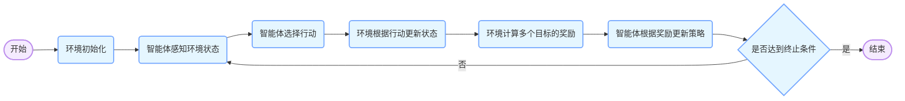

# 强化学习驱动的自适应多目标推理优化策略

> 关键词：强化学习、自适应策略、多目标推理、优化算法、决策过程

> 摘要：本文聚焦于强化学习驱动的自适应多目标推理优化策略，深入探讨了该策略在复杂决策场景中的应用。首先介绍了相关背景知识，包括目的范围、预期读者、文档结构和术语表。接着阐述了核心概念与联系，给出了原理和架构的文本示意图以及 Mermaid 流程图。详细讲解了核心算法原理，并使用 Python 源代码进行说明，同时介绍了相关的数学模型和公式。通过项目实战，展示了代码的实际案例和详细解释。分析了该策略的实际应用场景，推荐了学习资源、开发工具框架和相关论文著作。最后总结了未来发展趋势与挑战，提供了常见问题与解答以及扩展阅读和参考资料，旨在为相关领域的研究和实践提供全面且深入的指导。

## 1. 背景介绍 
### 1.1 目的和范围
在当今复杂的决策环境中，如智能交通、资源分配、机器人控制等领域，往往需要同时考虑多个目标进行推理和决策。传统的推理方法在处理多目标问题时，可能无法有效地平衡各个目标之间的关系，难以适应动态变化的环境。强化学习驱动的自适应多目标推理优化策略旨在利用强化学习的优势，通过智能体与环境的交互学习，自动调整推理策略，以实现多个目标的最优平衡。本文的范围涵盖了该策略的核心概念、算法原理、数学模型、项目实战、应用场景以及相关的工具和资源推荐等方面。

### 1.2 预期读者
本文预期读者包括人工智能、机器学习、控制理论等领域的研究人员和学生，以及从事智能系统开发、优化决策等相关工作的工程师。对于对强化学习和多目标推理感兴趣的初学者，也可以通过本文了解该领域的基本概念和方法。

### 1.3 文档结构概述
本文将按照以下结构进行组织：首先介绍背景知识，为后续内容奠定基础；接着阐述核心概念与联系，帮助读者理解该策略的基本原理；详细讲解核心算法原理和具体操作步骤，并结合 Python 代码进行说明；介绍相关的数学模型和公式，为算法提供理论支持；通过项目实战展示代码的实际应用和详细解释；分析该策略的实际应用场景；推荐学习资源、开发工具框架和相关论文著作；最后总结未来发展趋势与挑战，提供常见问题与解答以及扩展阅读和参考资料。

### 1.4 术语表
#### 1.4.1 核心术语定义
- **强化学习（Reinforcement Learning）**：一种机器学习范式，智能体通过与环境进行交互，根据环境反馈的奖励信号来学习最优的行为策略。
- **多目标推理（Multi - Objective Reasoning）**：在决策过程中，需要同时考虑多个相互关联或冲突的目标，并根据这些目标进行推理和决策。
- **自适应策略（Adaptive Strategy）**：能够根据环境的变化自动调整自身行为的策略。
- **智能体（Agent）**：在强化学习中，能够感知环境状态、采取行动并从环境中获得奖励的实体。
- **状态（State）**：环境在某一时刻的描述，智能体根据状态来选择行动。
- **行动（Action）**：智能体在某一状态下采取的具体操作。
- **奖励（Reward）**：环境对智能体采取的行动给予的反馈信号，用于指导智能体的学习。

#### 1.4.2 相关概念解释
- **策略梯度（Policy Gradient）**：强化学习中的一种算法，通过直接优化策略函数来最大化累积奖励。
- **Q - 学习（Q - Learning）**：一种无模型的强化学习算法，通过学习状态 - 行动对的价值函数（Q 函数）来确定最优策略。
- **帕累托最优（Pareto Optimality）**：在多目标优化问题中，一种解决方案被称为帕累托最优，如果不存在其他解决方案可以在不降低其他目标值的情况下提高至少一个目标的值。

#### 1.4.3 缩略词列表
- **RL**：Reinforcement Learning（强化学习）
- **MOR**：Multi - Objective Reasoning（多目标推理）
- **PG**：Policy Gradient（策略梯度）
- **QL**：Q - Learning（Q - 学习）

## 2. 核心概念与联系 
### 核心概念原理
强化学习驱动的自适应多目标推理优化策略的核心思想是将多目标推理问题转化为强化学习问题。智能体在环境中不断探索和学习，根据环境的状态选择行动，并从环境中获得与多个目标相关的奖励信号。通过不断地迭代学习，智能体逐渐调整自己的策略，以实现多个目标的最优平衡。

在传统的单目标强化学习中，智能体的目标是最大化单一的累积奖励。而在多目标强化学习中，智能体需要同时考虑多个奖励信号，每个奖励信号对应一个目标。这些目标可能是相互冲突的，例如在资源分配问题中，一个目标可能是最大化资源利用率，另一个目标可能是最小化成本。因此，智能体需要在这些目标之间进行权衡和协调。

### 架构的文本示意图
```plaintext
+-------------------+
|     环境（Environment）    |
| 包含多个目标和状态信息  |
+-------------------+
       |
       | 状态信息
       v
+-------------------+
|     智能体（Agent）    |
| 感知状态，选择行动    |
| 基于强化学习算法学习  |
+-------------------+
       |
       | 行动
       v
+-------------------+
|     环境（Environment）    |
| 根据行动更新状态和奖励  |
+-------------------+
       |
       | 奖励信号（多个）
       v
+-------------------+
|     智能体（Agent）    |
| 根据奖励更新策略    |
+-------------------+
```

### Mermaid 流程图


## 3. 核心算法原理 & 具体操作步骤 
### 核心算法原理
本文主要介绍基于策略梯度的强化学习算法在多目标推理优化中的应用。策略梯度算法通过直接优化策略函数 $\pi_{\theta}(a|s)$ 来最大化累积奖励，其中 $\theta$ 是策略函数的参数，$a$ 是行动，$s$ 是状态。

在多目标强化学习中，我们可以将多个目标的奖励组合成一个标量奖励 $r$，例如通过加权求和的方式：

$$r = \sum_{i = 1}^{n} w_i r_i$$

其中 $r_i$ 是第 $i$ 个目标的奖励，$w_i$ 是第 $i$ 个目标的权重，$n$ 是目标的数量。

策略梯度算法的目标是最大化期望累积奖励：

$$J(\theta) = \mathbb{E}_{\tau \sim \pi_{\theta}} \left[ \sum_{t = 0}^{T} r_t \right]$$

其中 $\tau$ 是一个轨迹，包含一系列的状态、行动和奖励，$T$ 是轨迹的长度。

根据策略梯度定理，策略梯度可以表示为：

$$\nabla_{\theta} J(\theta) = \mathbb{E}_{\tau \sim \pi_{\theta}} \left[ \sum_{t = 0}^{T} \nabla_{\theta} \log \pi_{\theta}(a_t|s_t) r_t \right]$$

### 具体操作步骤
1. **初始化**：初始化策略函数 $\pi_{\theta}(a|s)$ 的参数 $\theta$，设置学习率 $\alpha$ 和目标权重 $w_i$。
2. **环境交互**：
    - 智能体感知当前环境状态 $s_t$。
    - 根据策略函数 $\pi_{\theta}(a|s_t)$ 选择行动 $a_t$。
    - 环境根据行动 $a_t$ 更新状态 $s_{t + 1}$，并计算多个目标的奖励 $r_{i,t}$。
    - 计算标量奖励 $r_t = \sum_{i = 1}^{n} w_i r_{i,t}$。
3. **策略更新**：
    - 计算策略梯度 $\nabla_{\theta} J(\theta)$。
    - 使用梯度上升法更新策略参数：$\theta \leftarrow \theta + \alpha \nabla_{\theta} J(\theta)$。
4. **终止条件判断**：判断是否达到终止条件（如达到最大迭代次数、累积奖励收敛等），如果未达到则返回步骤 2，否则结束算法。

### Python 源代码实现
```python
import numpy as np

# 定义策略函数（简单示例，假设是一个离散行动空间）
def policy(state, theta):
    action_probs = np.exp(np.dot(state, theta))
    action_probs /= np.sum(action_probs)
    action = np.random.choice(len(action_probs), p = action_probs)
    return action

# 定义环境（简单示例，模拟多目标奖励）
def environment(state, action):
    # 假设有两个目标
    r1 = np.random.rand()  # 第一个目标的奖励
    r2 = np.random.rand()  # 第二个目标的奖励
    new_state = state + action  # 简单更新状态
    return new_state, [r1, r2]

# 定义策略梯度算法
def policy_gradient(theta, state, action, rewards, weights):
    r = np.dot(weights, rewards)
    log_prob = np.log(policy(state, theta)[action])
    grad_log_prob = np.gradient(log_prob)
    grad = grad_log_prob * r
    return grad

# 主循环
def main():
    # 初始化参数
    theta = np.random.rand(3, 2)  # 假设状态维度为 3，行动维度为 2
    weights = [0.6, 0.4]  # 目标权重
    alpha = 0.01  # 学习率
    max_iterations = 1000

    for i in range(max_iterations):
        state = np.random.rand(3)  # 初始化状态
        action = policy(state, theta)
        new_state, rewards = environment(state, action)
        grad = policy_gradient(theta, state, action, rewards, weights)
        theta += alpha * grad

    return theta

if __name__ == "__main__":
    final_theta = main()
    print("Final theta:", final_theta)
```

## 4. 数学模型和公式 & 详细讲解 & 举例说明 
### 数学模型和公式
#### 策略函数
策略函数 $\pi_{\theta}(a|s)$ 表示在状态 $s$ 下选择行动 $a$ 的概率，通常使用参数化的形式，例如神经网络。在离散行动空间中，策略函数可以表示为一个概率分布：

$$\pi_{\theta}(a|s) = \frac{\exp(\phi(s, a)^T \theta)}{\sum_{a' \in \mathcal{A}} \exp(\phi(s, a')^T \theta)}$$

其中 $\phi(s, a)$ 是状态 - 行动特征向量，$\mathcal{A}$ 是行动空间。

#### 期望累积奖励
期望累积奖励 $J(\theta)$ 定义为：

$$J(\theta) = \mathbb{E}_{\tau \sim \pi_{\theta}} \left[ \sum_{t = 0}^{T} \gamma^t r_t \right]$$

其中 $\gamma$ 是折扣因子，用于平衡近期奖励和远期奖励的重要性。

#### 策略梯度定理
策略梯度定理表明，策略梯度可以表示为：

$$\nabla_{\theta} J(\theta) = \mathbb{E}_{\tau \sim \pi_{\theta}} \left[ \sum_{t = 0}^{T} \gamma^t \nabla_{\theta} \log \pi_{\theta}(a_t|s_t) Q^{\pi_{\theta}}(s_t, a_t) \right]$$

其中 $Q^{\pi_{\theta}}(s_t, a_t)$ 是状态 - 行动价值函数，表示在策略 $\pi_{\theta}$ 下，从状态 $s_t$ 采取行动 $a_t$ 后获得的期望累积奖励。

### 详细讲解
策略函数 $\pi_{\theta}(a|s)$ 是强化学习中的核心，它决定了智能体在不同状态下的行为。通过优化策略函数的参数 $\theta$，我们可以使智能体的行为逐渐趋向于最优。

期望累积奖励 $J(\theta)$ 是我们要最大化的目标，它考虑了整个轨迹上的奖励，并通过折扣因子 $\gamma$ 来平衡不同时间步的奖励重要性。

策略梯度定理为我们提供了一种计算策略梯度的方法，通过对策略函数的对数求导，并乘以状态 - 行动价值函数，我们可以得到策略梯度的表达式。在实际应用中，我们通常使用蒙特卡罗方法来估计策略梯度，即通过采样多个轨迹来近似期望。

### 举例说明
假设我们有一个简单的资源分配问题，有两个目标：最大化资源利用率和最小化成本。状态 $s$ 表示当前的资源状态，行动 $a$ 表示资源分配方案。我们可以定义两个奖励函数 $r_1(s, a)$ 和 $r_2(s, a)$ 分别表示资源利用率和成本的奖励。

假设目标权重 $w_1 = 0.7$ 和 $w_2 = 0.3$，则标量奖励 $r(s, a) = 0.7 r_1(s, a) + 0.3 r_2(s, a)$。

策略函数 $\pi_{\theta}(a|s)$ 可以使用一个简单的神经网络来表示，输入为状态 $s$，输出为每个行动的概率。通过不断地与环境交互，计算策略梯度并更新参数 $\theta$，智能体可以学习到最优的资源分配策略。

## 5. 项目实战：代码实际案例和详细解释说明 
### 5.1  开发环境搭建
为了实现强化学习驱动的自适应多目标推理优化策略，我们可以使用 Python 作为开发语言，并结合一些常用的机器学习库。以下是具体的开发环境搭建步骤：

1. **安装 Python**：建议使用 Python 3.7 及以上版本，可以从官方网站（https://www.python.org/downloads/）下载并安装。
2. **安装必要的库**：使用以下命令安装所需的库：
```bash
pip install numpy torch gym
```
- `numpy`：用于数值计算。
- `torch`：一个深度学习框架，用于实现神经网络和优化算法。
- `gym`：一个开源的强化学习环境库，提供了多种标准的强化学习环境。

### 5.2  源代码详细实现和代码解读
以下是一个使用 PyTorch 和 Gym 库实现的简单多目标强化学习示例：

```python
import torch
import torch.nn as nn
import torch.optim as optim
import numpy as np
import gym

# 定义策略网络
class PolicyNetwork(nn.Module):
    def __init__(self, input_dim, output_dim):
        super(PolicyNetwork, self).__init__()
        self.fc1 = nn.Linear(input_dim, 128)
        self.fc2 = nn.Linear(128, output_dim)
        self.softmax = nn.Softmax(dim = 1)

    def forward(self, x):
        x = torch.relu(self.fc1(x))
        x = self.fc2(x)
        x = self.softmax(x)
        return x

# 定义训练函数
def train(env, policy_network, optimizer, num_episodes, gamma, weights):
    for episode in range(num_episodes):
        state = env.reset()
        states, actions, rewards = [], [], []
        done = False

        while not done:
            state = torch.FloatTensor(state).unsqueeze(0)
            action_probs = policy_network(state)
            action = torch.multinomial(action_probs, 1).item()

            next_state, reward_list, done, _ = env.step(action)
            reward = np.dot(weights, reward_list)

            states.append(state)
            actions.append(action)
            rewards.append(reward)

            state = next_state

        # 计算折扣累积奖励
        discounted_rewards = []
        cumulative_reward = 0
        for r in reversed(rewards):
            cumulative_reward = r + gamma * cumulative_reward
            discounted_rewards.insert(0, cumulative_reward)
        discounted_rewards = torch.FloatTensor(discounted_rewards)

        # 计算策略梯度
        log_probs = []
        for state, action in zip(states, actions):
            action_probs = policy_network(state)
            log_prob = torch.log(action_probs.squeeze(0)[action])
            log_probs.append(log_prob)
        log_probs = torch.stack(log_probs)

        loss = -torch.mean(log_probs * discounted_rewards)

        # 更新策略网络
        optimizer.zero_grad()
        loss.backward()
        optimizer.step()

        if episode % 10 == 0:
            print(f"Episode {episode}: Loss = {loss.item()}")

    return policy_network

# 主函数
def main():
    env = gym.make('CartPole-v1')  # 使用 CartPole 环境作为示例
    input_dim = env.observation_space.shape[0]
    output_dim = env.action_space.n
    policy_network = PolicyNetwork(input_dim, output_dim)
    optimizer = optim.Adam(policy_network.parameters(), lr = 0.001)
    num_episodes = 1000
    gamma = 0.99
    weights = [0.5, 0.5]  # 假设两个目标的权重相等

    trained_policy = train(env, policy_network, optimizer, num_episodes, gamma, weights)
    env.close()

    return trained_policy

if __name__ == "__main__":
    trained_policy = main()
```

### 5.3  代码解读与分析
#### 策略网络定义
`PolicyNetwork` 类定义了一个简单的神经网络，用于表示策略函数。它包含两个全连接层和一个 Softmax 层，输入为环境状态，输出为每个行动的概率。

#### 训练函数
`train` 函数实现了策略梯度算法的训练过程。在每个 episode 中，智能体与环境进行交互，记录状态、行动和奖励。然后计算折扣累积奖励和策略梯度，并使用梯度上升法更新策略网络的参数。

#### 主函数
`main` 函数初始化环境、策略网络和优化器，调用 `train` 函数进行训练，并最终关闭环境。

通过这个示例，我们可以看到如何使用 PyTorch 和 Gym 库实现一个简单的多目标强化学习系统。在实际应用中，我们可以根据具体的问题调整策略网络的结构、训练参数和目标权重。

## 6. 实际应用场景 
### 智能交通系统
在智能交通系统中，需要同时考虑多个目标，如交通流量最大化、交通事故率最小化和能源消耗最小化。强化学习驱动的自适应多目标推理优化策略可以用于交通信号控制、路径规划等任务。通过智能体与交通环境的交互学习，根据实时的交通状态调整信号配时和车辆路径，以实现多个目标的最优平衡。

### 资源分配问题
在云计算、数据中心等领域，资源分配需要考虑多个目标，如资源利用率最大化、服务延迟最小化和成本最小化。该策略可以用于动态分配计算资源、存储资源和网络带宽，根据用户需求和系统状态自动调整资源分配策略，提高系统的整体性能和效率。

### 机器人控制
在机器人控制中，机器人需要同时完成多个任务，如导航、避障、目标识别等。强化学习驱动的自适应多目标推理优化策略可以用于机器人的决策和行动规划。机器人通过与环境的交互学习，根据当前的任务需求和环境状态选择最优的行动，以实现多个任务的高效完成。

### 金融投资决策
在金融投资领域，投资者需要同时考虑多个目标，如投资回报率最大化、风险最小化和流动性最大化。该策略可以用于投资组合优化，根据市场行情和投资者的风险偏好，自动调整投资组合的配置，以实现多个投资目标的平衡。

## 7. 工具和资源推荐
### 7.1 学习资源推荐
#### 7.1.1 书籍推荐
- 《Reinforcement Learning: An Introduction》（Richard S. Sutton 和 Andrew G. Barto 著）：这是强化学习领域的经典教材，全面介绍了强化学习的基本概念、算法和应用。
- 《Multi - Objective Optimization Using Evolutionary Algorithms》（Kalyanmoy Deb 著）：该书详细介绍了多目标优化的理论和方法，包括进化算法在多目标优化中的应用。

#### 7.1.2 在线课程
- Coursera 上的 “Reinforcement Learning Specialization”：由 University of Alberta 提供，涵盖了强化学习的基础知识、算法和应用。
- edX 上的 “Introduction to Artificial Intelligence”：该课程包含了强化学习的相关内容，适合初学者入门。

#### 7.1.3 技术博客和网站
- OpenAI Blog（https://openai.com/blog/）：OpenAI 发布的最新研究成果和技术文章，涵盖了强化学习、人工智能等多个领域。
- Towards Data Science（https://towardsdatascience.com/）：一个数据科学和机器学习的技术博客平台，有很多关于强化学习和多目标优化的优秀文章。

### 7.2 开发工具框架推荐
#### 7.2.1 IDE和编辑器
- PyCharm：一个专业的 Python 集成开发环境，提供了丰富的代码编辑、调试和分析功能。
- Jupyter Notebook：一个交互式的编程环境，适合进行数据分析、模型训练和实验验证。

#### 7.2.2 调试和性能分析工具
- TensorBoard：一个可视化工具，用于监控和分析深度学习模型的训练过程，包括损失函数、梯度等指标。
- Py-Spy：一个轻量级的 Python 性能分析工具，可以帮助我们找出代码中的性能瓶颈。

#### 7.2.3 相关框架和库
- PyTorch：一个开源的深度学习框架，提供了丰富的神经网络模块和优化算法，方便我们实现强化学习算法。
- Stable Baselines3：一个基于 PyTorch 的强化学习库，提供了多种预实现的强化学习算法和工具，方便我们进行快速实验和开发。

### 7.3 相关论文著作推荐
#### 7.3.1 经典论文
- “Policy Gradient Methods for Reinforcement Learning with Function Approximation”（Richard S. Sutton 等著）：该论文提出了策略梯度算法，为强化学习的发展奠定了基础。
- “Multi - Objective Reinforcement Learning: A Comprehensive Overview”（Emilie Kaufmann 等著）：对多目标强化学习的理论和方法进行了全面的综述。

#### 7.3.2 最新研究成果
- 可以关注 NeurIPS、ICML、AAAI 等顶级人工智能会议的论文，了解强化学习和多目标优化领域的最新研究进展。

#### 7.3.3 应用案例分析
- 可以参考一些实际应用案例的论文，如智能交通、资源分配等领域的应用，学习如何将强化学习驱动的自适应多目标推理优化策略应用到实际问题中。

## 8. 总结：未来发展趋势与挑战
### 未来发展趋势
- **与深度学习的深度融合**：随着深度学习技术的不断发展，强化学习与深度学习的结合将更加紧密。深度强化学习可以处理更加复杂的环境和任务，提高智能体的学习能力和决策能力。
- **多智能体强化学习**：在实际应用中，往往需要多个智能体协同工作，以实现共同的目标。多智能体强化学习将成为未来的一个重要研究方向，研究如何设计有效的多智能体策略和协作机制。
- **自适应和鲁棒性增强**：未来的强化学习算法将更加注重自适应和鲁棒性，能够在动态变化的环境中快速调整策略，应对各种不确定性和干扰。
- **跨领域应用拓展**：强化学习驱动的自适应多目标推理优化策略将在更多的领域得到应用，如医疗保健、教育、农业等，为解决复杂的实际问题提供有效的方法。

### 挑战
- **计算资源需求**：深度强化学习算法通常需要大量的计算资源，训练时间较长。如何提高算法的计算效率，减少计算资源的需求，是一个亟待解决的问题。
- **奖励设计困难**：在多目标强化学习中，奖励的设计是一个关键问题。如何合理地定义多个目标的奖励函数，以及如何平衡不同目标之间的权重，是一个具有挑战性的任务。
- **环境建模复杂**：实际应用中的环境往往非常复杂，难以进行准确的建模。如何处理复杂环境中的不确定性和动态变化，提高智能体的适应性和泛化能力，是一个重要的挑战。
- **可解释性问题**：强化学习算法通常是黑盒模型，难以解释其决策过程和行为。如何提高强化学习算法的可解释性，让用户更好地理解和信任智能体的决策，是一个需要解决的问题。

## 9. 附录：常见问题与解答
### 问题 1：如何选择合适的目标权重？
解答：目标权重的选择通常需要根据具体的问题和需求来确定。一种常见的方法是通过实验和试错，尝试不同的权重组合，观察智能体的学习效果和性能表现。另外，也可以根据领域知识和专家经验来确定权重。

### 问题 2：强化学习算法在多目标推理中的收敛速度如何？
解答：强化学习算法的收敛速度受到多种因素的影响，如环境的复杂度、策略网络的结构、学习率等。在多目标推理中，由于需要同时考虑多个目标，收敛速度可能会相对较慢。可以通过调整算法参数、使用合适的优化算法等方法来提高收敛速度。

### 问题 3：如何处理多目标之间的冲突？
解答：处理多目标之间的冲突是多目标推理中的一个关键问题。一种方法是通过定义合适的奖励函数和目标权重，在不同目标之间进行权衡和协调。另外，也可以使用帕累托最优的概念，寻找一组非支配解，让决策者根据具体情况进行选择。

### 问题 4：强化学习算法对数据的需求量大吗？
解答：一般来说，强化学习算法需要大量的数据来进行学习。尤其是深度强化学习算法，需要更多的数据来训练神经网络。可以通过增加训练时间、使用经验回放等方法来提高数据的利用率。

## 10. 扩展阅读 & 参考资料
### 扩展阅读
- “Deep Reinforcement Learning Hands-On”（Max Lapan 著）：该书详细介绍了深度强化学习的实践方法和技巧，适合有一定基础的读者深入学习。
- “Multi - Criteria Decision Analysis: Methods and Software”（Jacek Malczewski 著）：对多目标决策分析的方法和软件进行了全面的介绍，为多目标推理提供了理论和实践指导。

### 参考资料
- Richard S. Sutton 和 Andrew G. Barto. 《Reinforcement Learning: An Introduction》. The MIT Press, 2018.
- Kalyanmoy Deb. 《Multi - Objective Optimization Using Evolutionary Algorithms》. John Wiley & Sons, 2001.
- Emilie Kaufmann, Olivier Cappé, Aurélien Garivier. “Multi - Objective Reinforcement Learning: A Comprehensive Overview”. arXiv preprint arXiv:1911.10623, 2019.

作者：AI天才研究院/AI Genius Institute & 禅与计算机程序设计艺术 /Zen And The Art of Computer Programming