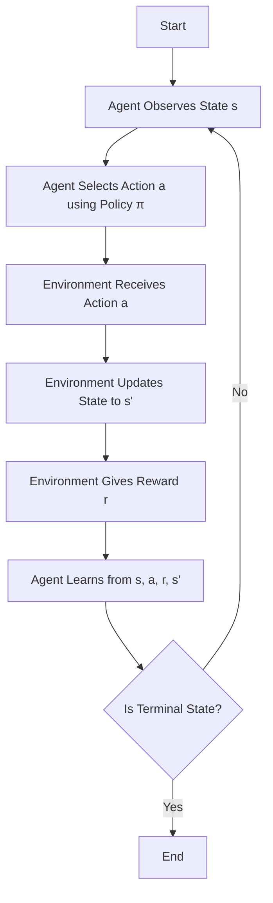

# 强化学习驱动的自适应多目标推理优化策略设计

> 关键词：强化学习、自适应多目标推理、优化策略、智能决策、算法设计

> 摘要：本文聚焦于强化学习驱动的自适应多目标推理优化策略设计。首先介绍了该研究的背景、目的、预期读者等内容，阐述了核心概念及其联系，并给出相应的示意图和流程图。详细讲解了核心算法原理，结合Python代码进行说明，同时给出数学模型和公式，并举例阐释。通过项目实战展示了代码实现和解读过程，探讨了实际应用场景。推荐了学习资源、开发工具框架以及相关论文著作。最后总结了未来发展趋势与挑战，还提供了常见问题解答和扩展阅读参考资料，旨在为相关领域的研究者和开发者提供全面而深入的技术指导。

## 1. 背景介绍 
### 1.1 目的和范围
在当今复杂的计算和决策环境中，多目标推理问题广泛存在。传统的推理方法往往难以同时兼顾多个目标，并且缺乏自适应调整的能力。强化学习作为一种强大的机器学习范式，能够通过智能体与环境的交互来学习最优策略。本研究的目的是设计一种基于强化学习的自适应多目标推理优化策略，使得智能体能够在动态环境中根据不同的目标需求，自动调整推理过程，以达到多个目标的综合优化。

本研究的范围涵盖了强化学习的基本理论、多目标推理的建模方法、优化策略的设计与实现，以及在实际应用场景中的验证和评估。

### 1.2 预期读者
本文预期读者包括人工智能、机器学习、计算机科学等领域的研究人员和学生，对强化学习和多目标推理感兴趣的开发者，以及希望将智能优化策略应用于实际系统的工程师。

### 1.3 文档结构概述
本文将按照以下结构进行组织：首先介绍相关的核心概念及其联系，通过示意图和流程图直观展示；接着详细阐述核心算法原理，并使用Python代码进行具体说明；给出数学模型和公式，并举例加深理解；通过项目实战展示代码的实际实现和解读；探讨该策略在实际中的应用场景；推荐学习资源、开发工具框架和相关论文著作；总结未来发展趋势与挑战；提供常见问题解答和扩展阅读参考资料。

### 1.4 术语表
#### 1.4.1 核心术语定义
- **强化学习（Reinforcement Learning）**：一种机器学习范式，智能体通过与环境进行交互，根据环境反馈的奖励信号来学习最优策略，以最大化长期累积奖励。
- **多目标推理（Multi - objective Reasoning）**：在推理过程中需要同时考虑多个相互关联或冲突的目标，以找到满足多个目标要求的最优解。
- **自适应策略（Adaptive Strategy）**：能够根据环境的变化和目标的动态调整，自动改变自身行为和决策的策略。
- **智能体（Agent）**：在强化学习中，与环境进行交互的实体，通过感知环境状态并采取行动来实现目标。

#### 1.4.2 相关概念解释
- **奖励函数（Reward Function）**：强化学习中用于评估智能体行为好坏的函数，智能体的目标是最大化长期累积奖励。在多目标推理中，奖励函数需要综合考虑多个目标的达成情况。
- **状态空间（State Space）**：环境所有可能状态的集合，智能体通过感知状态来做出决策。
- **动作空间（Action Space）**：智能体可以采取的所有可能动作的集合。

#### 1.4.3 缩略词列表
- **RL**：Reinforcement Learning（强化学习）
- **MDP**：Markov Decision Process（马尔可夫决策过程）

## 2. 核心概念与联系 
### 核心概念原理
#### 强化学习原理
强化学习基于马尔可夫决策过程（MDP），其核心要素包括智能体、环境、状态、动作和奖励。智能体在每个时间步 $t$ 感知环境的状态 $s_t$，并从动作空间 $A$ 中选择一个动作 $a_t$ 执行。环境根据智能体的动作转移到新的状态 $s_{t + 1}$，并给予智能体一个奖励 $r_{t+1}$。智能体的目标是学习一个策略 $\pi$，使得长期累积奖励最大化，通常使用折扣累积奖励 $G_t=\sum_{k = 0}^{\infty}\gamma^{k}r_{t + k+1}$ 来衡量，其中 $\gamma\in[0,1]$ 是折扣因子。

#### 多目标推理原理
多目标推理需要同时考虑多个目标 $O=\{o_1,o_2,\cdots,o_n\}$。每个目标可能有不同的权重和优先级，并且可能相互冲突。在推理过程中，需要综合评估每个动作对各个目标的影响，以找到一个折中的最优解。例如，在资源分配问题中，可能需要同时考虑资源利用率、成本和响应时间等多个目标。

#### 自适应策略原理
自适应策略能够根据环境的变化和目标的动态调整，自动改变智能体的行为。在强化学习中，可以通过动态调整奖励函数、策略更新机制等来实现自适应。例如，当环境发生变化时，奖励函数可以根据新的目标重新设计，智能体通过与新环境的交互学习新的最优策略。

### 架构的文本示意图
```plaintext
+-------------------+       +-------------------+
|    Environment    | <---- |      Agent        |
+-------------------+       +-------------------+
          ^                         |
          |                         |
          | Reward                  | Action
          |                         |
          +-------------------------+

Agent:
- Policy π(s) -> a
- Learning Algorithm
- State Representation

Environment:
- State Transition Function
- Reward Function
- Multiple Objectives
```

### Mermaid 流程图


## 3. 核心算法原理 & 具体操作步骤 
### 核心算法原理
我们采用深度Q网络（Deep Q - Network，DQN）作为强化学习的基础算法，并对其进行扩展以适应多目标推理。DQN使用深度神经网络来近似Q值函数 $Q(s,a)$，表示在状态 $s$ 下采取动作 $a$ 的预期累积奖励。

在多目标推理中，我们将多个目标的奖励进行整合，定义一个综合奖励函数 $R(s,a)$。智能体的目标是最大化综合奖励的累积值。

### 具体操作步骤
1. **初始化**：初始化深度Q网络的参数 $\theta$，经验回放缓冲区 $D$，折扣因子 $\gamma$，探索率 $\epsilon$ 等。
2. **环境交互**：
    - 智能体观察当前环境状态 $s$。
    - 根据 $\epsilon$-贪心策略选择动作 $a$：以概率 $\epsilon$ 随机选择动作，以概率 $1 - \epsilon$ 选择使 $Q(s,a)$ 最大的动作。
    - 执行动作 $a$，环境返回新的状态 $s'$ 和奖励 $r$。
    - 将 $(s,a,r,s')$ 存储到经验回放缓冲区 $D$ 中。
3. **经验回放**：
    - 从经验回放缓冲区 $D$ 中随机采样一批数据 $(s_i,a_i,r_i,s_i')$。
    - 计算目标Q值 $y_i = r_i+\gamma\max_{a'}Q(s_i',a';\theta^-)$，其中 $\theta^-$ 是目标网络的参数。
    - 使用均方误差损失函数 $L(\theta)=\frac{1}{N}\sum_{i = 1}^{N}(y_i - Q(s_i,a_i;\theta))^2$ 来更新深度Q网络的参数 $\theta$。
4. **目标网络更新**：定期将主网络的参数 $\theta$ 复制到目标网络的参数 $\theta^-$ 中。
5. **重复步骤2 - 4**：直到达到终止条件。

### Python源代码详细阐述
```python
import torch
import torch.nn as nn
import torch.optim as optim
import numpy as np
import random

# 定义深度Q网络
class DQN(nn.Module):
    def __init__(self, input_dim, output_dim):
        super(DQN, self).__init__()
        self.fc1 = nn.Linear(input_dim, 64)
        self.fc2 = nn.Linear(64, 64)
        self.fc3 = nn.Linear(64, output_dim)

    def forward(self, x):
        x = torch.relu(self.fc1(x))
        x = torch.relu(self.fc2(x))
        return self.fc3(x)

# 定义智能体类
class Agent:
    def __init__(self, input_dim, output_dim, lr=0.001, gamma=0.99, epsilon=1.0, epsilon_decay=0.995, epsilon_min=0.01):
        self.input_dim = input_dim
        self.output_dim = output_dim
        self.lr = lr
        self.gamma = gamma
        self.epsilon = epsilon
        self.epsilon_decay = epsilon_decay
        self.epsilon_min = epsilon_min

        self.model = DQN(input_dim, output_dim)
        self.target_model = DQN(input_dim, output_dim)
        self.target_model.load_state_dict(self.model.state_dict())
        self.optimizer = optim.Adam(self.model.parameters(), lr=lr)
        self.criterion = nn.MSELoss()
        self.replay_buffer = []
        self.batch_size = 32

    def remember(self, state, action, reward, next_state):
        self.replay_buffer.append((state, action, reward, next_state))

    def act(self, state):
        if np.random.rand() <= self.epsilon:
            return random.randrange(self.output_dim)
        state = torch.FloatTensor(state).unsqueeze(0)
        q_values = self.model(state)
        action = torch.argmax(q_values).item()
        return action

    def replay(self):
        if len(self.replay_buffer) < self.batch_size:
            return
        minibatch = random.sample(self.replay_buffer, self.batch_size)
        states, actions, rewards, next_states = zip(*minibatch)
        states = torch.FloatTensor(states)
        actions = torch.LongTensor(actions)
        rewards = torch.FloatTensor(rewards)
        next_states = torch.FloatTensor(next_states)

        q_values = self.model(states)
        next_q_values = self.target_model(next_states)
        max_next_q_values = torch.max(next_q_values, dim=1)[0]
        target_q_values = q_values.clone()
        for i in range(self.batch_size):
            target_q_values[i][actions[i]] = rewards[i] + self.gamma * max_next_q_values[i]

        self.optimizer.zero_grad()
        loss = self.criterion(q_values, target_q_values)
        loss.backward()
        self.optimizer.step()

        if self.epsilon > self.epsilon_min:
            self.epsilon *= self.epsilon_decay

    def update_target_model(self):
        self.target_model.load_state_dict(self.model.state_dict())


# 示例使用
input_dim = 4
output_dim = 2
agent = Agent(input_dim, output_dim)
state = np.random.rand(input_dim)
action = agent.act(state)
next_state = np.random.rand(input_dim)
reward = 1.0
agent.remember(state, action, reward, next_state)
agent.replay()
agent.update_target_model()
```

## 4. 数学模型和公式 & 详细讲解 & 举例说明 
### 数学模型
#### 马尔可夫决策过程（MDP）
一个马尔可夫决策过程可以用一个五元组 $(S,A,P,R,\gamma)$ 表示，其中：
- $S$ 是状态空间，包含所有可能的环境状态。
- $A$ 是动作空间，包含智能体可以采取的所有可能动作。
- $P(s'|s,a)$ 是状态转移概率，表示在状态 $s$ 下采取动作 $a$ 后转移到状态 $s'$ 的概率。
- $R(s,a)$ 是奖励函数，给出在状态 $s$ 下采取动作 $a$ 所获得的即时奖励。
- $\gamma\in[0,1]$ 是折扣因子，用于衡量未来奖励的重要性。

#### Q值函数
Q值函数 $Q(s,a)$ 表示在状态 $s$ 下采取动作 $a$ 并遵循最优策略 $\pi^*$ 后的预期累积奖励，定义为：
$$Q^*(s,a)=\mathbb{E}\left[G_t|s_t = s,a_t = a,\pi^*\right]$$
其中 $G_t=\sum_{k = 0}^{\infty}\gamma^{k}r_{t + k+1}$ 是折扣累积奖励。

#### 贝尔曼方程
Q值函数满足贝尔曼方程：
$$Q^*(s,a)=R(s,a)+\gamma\sum_{s'\in S}P(s'|s,a)\max_{a'}Q^*(s',a')$$

### 详细讲解
- **马尔可夫决策过程**：MDP 是强化学习的基础模型，其核心假设是状态转移具有马尔可夫性，即下一个状态只取决于当前状态和动作，而与历史状态和动作无关。这一假设使得问题的建模和求解更加简化。
- **Q值函数**：Q值函数是强化学习中非常重要的概念，它为智能体提供了在不同状态下选择动作的依据。智能体的目标是找到一个策略，使得在每个状态下选择的动作能够最大化Q值。
- **贝尔曼方程**：贝尔曼方程是求解Q值函数的关键，它将当前状态的Q值与下一个状态的Q值联系起来。通过迭代求解贝尔曼方程，可以得到最优Q值函数。

### 举例说明
假设一个简单的网格世界环境，智能体的目标是从起点移动到终点。状态 $s$ 表示智能体在网格中的位置，动作 $a$ 包括上下左右四个方向的移动。奖励函数 $R(s,a)$ 可以定义为：如果智能体移动到终点，奖励为10；如果撞到障碍物，奖励为 - 5；其他情况奖励为 - 1。

折扣因子 $\gamma = 0.9$。初始时，Q值函数 $Q(s,a)$ 可以随机初始化。通过与环境的交互，智能体不断更新Q值函数，最终找到从起点到终点的最优路径。

## 5. 项目实战：代码实际案例和详细解释说明 
### 5.1  开发环境搭建
#### 操作系统
本项目可以在多种操作系统上运行，如Windows、Linux和macOS。建议使用Linux系统，因为它在开发和部署机器学习项目方面具有更好的稳定性和兼容性。

#### Python环境
使用Python 3.7及以上版本。可以使用Anaconda来管理Python环境，以下是创建和激活虚拟环境的步骤：
```bash
conda create -n rl_multi_objective python=3.8
conda activate rl_multi_objective
```

#### 安装依赖库
安装必要的Python库，包括PyTorch、NumPy、Matplotlib等：
```bash
pip install torch numpy matplotlib
```

### 5.2  源代码详细实现和代码解读
```python
import torch
import torch.nn as nn
import torch.optim as optim
import numpy as np
import random
import matplotlib.pyplot as plt

# 定义深度Q网络
class DQN(nn.Module):
    def __init__(self, input_dim, output_dim):
        super(DQN, self).__init__()
        self.fc1 = nn.Linear(input_dim, 64)
        self.fc2 = nn.Linear(64, 64)
        self.fc3 = nn.Linear(64, output_dim)

    def forward(self, x):
        x = torch.relu(self.fc1(x))
        x = torch.relu(self.fc2(x))
        return self.fc3(x)

# 定义智能体类
class Agent:
    def __init__(self, input_dim, output_dim, lr=0.001, gamma=0.99, epsilon=1.0, epsilon_decay=0.995, epsilon_min=0.01):
        self.input_dim = input_dim
        self.output_dim = output_dim
        self.lr = lr
        self.gamma = gamma
        self.epsilon = epsilon
        self.epsilon_decay = epsilon_decay
        self.epsilon_min = epsilon_min

        self.model = DQN(input_dim, output_dim)
        self.target_model = DQN(input_dim, output_dim)
        self.target_model.load_state_dict(self.model.state_dict())
        self.optimizer = optim.Adam(self.model.parameters(), lr=lr)
        self.criterion = nn.MSELoss()
        self.replay_buffer = []
        self.batch_size = 32

    def remember(self, state, action, reward, next_state):
        self.replay_buffer.append((state, action, reward, next_state))

    def act(self, state):
        if np.random.rand() <= self.epsilon:
            return random.randrange(self.output_dim)
        state = torch.FloatTensor(state).unsqueeze(0)
        q_values = self.model(state)
        action = torch.argmax(q_values).item()
        return action

    def replay(self):
        if len(self.replay_buffer) < self.batch_size:
            return
        minibatch = random.sample(self.replay_buffer, self.batch_size)
        states, actions, rewards, next_states = zip(*minibatch)
        states = torch.FloatTensor(states)
        actions = torch.LongTensor(actions)
        rewards = torch.FloatTensor(rewards)
        next_states = torch.FloatTensor(next_states)

        q_values = self.model(states)
        next_q_values = self.target_model(next_states)
        max_next_q_values = torch.max(next_q_values, dim=1)[0]
        target_q_values = q_values.clone()
        for i in range(self.batch_size):
            target_q_values[i][actions[i]] = rewards[i] + self.gamma * max_next_q_values[i]

        self.optimizer.zero_grad()
        loss = self.criterion(q_values, target_q_values)
        loss.backward()
        self.optimizer.step()

        if self.epsilon > self.epsilon_min:
            self.epsilon *= self.epsilon_decay

    def update_target_model(self):
        self.target_model.load_state_dict(self.model.state_dict())

# 定义简单的环境
class SimpleEnvironment:
    def __init__(self):
        self.state_dim = 2
        self.action_dim = 2
        self.state = np.random.rand(self.state_dim)

    def step(self, action):
        next_state = self.state + np.random.rand(self.state_dim) * (action - 0.5)
        reward = np.sum(next_state)
        done = np.sum(next_state) > 2.0
        self.state = next_state
        return next_state, reward, done

# 训练智能体
def train_agent():
    env = SimpleEnvironment()
    input_dim = env.state_dim
    output_dim = env.action_dim
    agent = Agent(input_dim, output_dim)

    num_episodes = 1000
    rewards = []

    for episode in range(num_episodes):
        state = env.state
        total_reward = 0
        done = False

        while not done:
            action = agent.act(state)
            next_state, reward, done = env.step(action)
            agent.remember(state, action, reward, next_state)
            agent.replay()
            state = next_state
            total_reward += reward

        agent.update_target_model()
        rewards.append(total_reward)
        if episode % 100 == 0:
            print(f"Episode {episode}: Total Reward = {total_reward}")

    # 绘制奖励曲线
    plt.plot(rewards)
    plt.xlabel('Episode')
    plt.ylabel('Total Reward')
    plt.title('Training Rewards')
    plt.show()

if __name__ == "__main__":
    train_agent()
```

### 代码解读与分析
#### DQN类
- `__init__` 方法：初始化深度Q网络的结构，包括三个全连接层。
- `forward` 方法：定义网络的前向传播过程，使用ReLU激活函数。

#### Agent类
- `__init__` 方法：初始化智能体的参数，包括学习率、折扣因子、探索率等，同时初始化主网络和目标网络。
- `remember` 方法：将智能体与环境的交互经验 $(s,a,r,s')$ 存储到经验回放缓冲区中。
- `act` 方法：根据 $\epsilon$-贪心策略选择动作。
- `replay` 方法：从经验回放缓冲区中采样数据，计算目标Q值，更新主网络的参数，并更新探索率。
- `update_target_model` 方法：将主网络的参数复制到目标网络中。

#### SimpleEnvironment类
- `__init__` 方法：初始化环境的状态维度、动作维度和初始状态。
- `step` 方法：根据智能体的动作更新环境状态，计算奖励，并判断是否终止。

#### train_agent函数
- 初始化环境和智能体。
- 进行多个回合的训练，每个回合中智能体与环境交互，更新经验回放缓冲区和网络参数。
- 绘制训练过程中的奖励曲线，用于评估智能体的学习效果。

## 6. 实际应用场景 
### 机器人导航
在机器人导航中，需要同时考虑多个目标，如最短路径、避免碰撞、最小化能量消耗等。强化学习驱动的自适应多目标推理优化策略可以使机器人在不同的环境中自动调整导航策略，以达到多个目标的综合优化。例如，在一个动态的室内环境中，机器人可以根据实时的障碍物分布和能量状态，选择最优的路径。

### 资源分配
在云计算、数据中心等领域，资源分配需要考虑多个目标，如资源利用率、服务质量、成本等。通过强化学习，可以设计自适应的资源分配策略，根据不同的工作负载和用户需求，动态调整资源分配方案，以提高系统的整体性能。

### 金融投资
在金融投资中，投资者需要同时考虑多个目标，如最大化收益、最小化风险、保持流动性等。强化学习驱动的自适应多目标推理优化策略可以帮助投资者根据市场的变化和自身的投资目标，自动调整投资组合，以实现多个目标的平衡。

### 游戏开发
在游戏开发中，智能NPC（非玩家角色）的行为决策需要考虑多个目标，如攻击敌人、保护队友、收集资源等。通过强化学习，可以使NPC在不同的游戏场景中自动调整行为策略，提高游戏的趣味性和挑战性。

## 7. 工具和资源推荐
### 7.1 学习资源推荐
#### 7.1.1 书籍推荐
- 《Reinforcement Learning: An Introduction》：这是强化学习领域的经典教材，由Richard S. Sutton和Andrew G. Barto所著，全面介绍了强化学习的基本理论、算法和应用。
- 《Deep Reinforcement Learning Hands-On》：由Max Lapan所著，通过大量的代码示例和实际项目，详细讲解了深度强化学习的实现方法。

#### 7.1.2 在线课程
- Coursera上的“Reinforcement Learning Specialization”：由阿尔伯塔大学的教授授课，系统地介绍了强化学习的理论和实践。
- edX上的“Introduction to Artificial Intelligence”：包含了强化学习的相关内容，适合初学者入门。

#### 7.1.3 技术博客和网站
- OpenAI Blog：OpenAI官方博客，提供了最新的强化学习研究成果和应用案例。
- Medium上的“Towards Data Science”：有很多关于强化学习的技术文章和教程。

### 7.2 开发工具框架推荐
#### 7.2.1 IDE和编辑器
- PyCharm：一款专业的Python集成开发环境，提供了丰富的代码编辑、调试和分析功能。
- Jupyter Notebook：交互式的开发环境，适合进行数据探索和模型调试。

#### 7.2.2 调试和性能分析工具
- TensorBoard：用于可视化深度学习模型的训练过程和性能指标。
- Py-Spy：用于分析Python代码的性能瓶颈。

#### 7.2.3 相关框架和库
- PyTorch：一个开源的深度学习框架，提供了丰富的神经网络层和优化算法，方便实现强化学习算法。
- Stable Baselines3：一个基于PyTorch的强化学习库，提供了多种预训练的强化学习算法和环境。

### 7.3 相关论文著作推荐
#### 7.3.1 经典论文
- “Human-level control through deep reinforcement learning”：发表于《Nature》杂志，介绍了深度Q网络（DQN）在Atari游戏中的应用，开创了深度强化学习的先河。
- “Proximal Policy Optimization Algorithms”：提出了近端策略优化算法（PPO），是一种高效的策略梯度算法。

#### 7.3.2 最新研究成果
- 关注顶级学术会议，如NeurIPS、ICML、AAAI等，这些会议上会发表最新的强化学习研究成果。

#### 7.3.3 应用案例分析
- 《AI for Games》：介绍了强化学习在游戏开发中的应用案例和技术细节。

## 8. 总结：未来发展趋势与挑战
### 未来发展趋势
#### 多智能体强化学习
随着实际应用场景的复杂化，多智能体强化学习将成为未来的研究热点。多个智能体之间的协作和竞争关系可以进一步提高系统的性能和适应性。例如，在自动驾驶领域，多辆自动驾驶汽车之间的协作可以提高交通效率和安全性。

#### 结合其他机器学习技术
强化学习可以与深度学习、迁移学习、元学习等其他机器学习技术相结合，以提高学习效率和泛化能力。例如，迁移学习可以将在一个任务中学习到的知识迁移到另一个相关任务中，减少训练时间和数据需求。

#### 应用领域拓展
强化学习将在更多的领域得到应用，如医疗保健、教育、农业等。在医疗保健领域，强化学习可以用于个性化医疗方案的制定；在教育领域，可以用于智能教学系统的开发。

### 挑战
#### 样本效率问题
强化学习通常需要大量的样本进行训练，样本效率较低。如何提高强化学习的样本效率，减少训练时间和数据需求，是当前面临的一个重要挑战。

#### 可解释性问题
强化学习模型通常是黑盒模型，缺乏可解释性。在一些对安全性和可靠性要求较高的应用场景中，如自动驾驶、医疗诊断等，模型的可解释性至关重要。

#### 环境建模问题
准确地对环境进行建模是强化学习的关键。然而，在实际应用中，环境往往是复杂和动态的，如何建立准确的环境模型是一个挑战。

## 9. 附录：常见问题与解答
### 1. 强化学习和监督学习有什么区别？
监督学习是基于给定的输入 - 输出对进行学习，目标是拟合输入和输出之间的映射关系。而强化学习是通过智能体与环境的交互，根据环境反馈的奖励信号来学习最优策略，没有明确的输入 - 输出对。

### 2. 为什么要使用经验回放缓冲区？
经验回放缓冲区可以打破数据之间的相关性，使得训练数据更加独立同分布。这样可以提高训练的稳定性和效率，避免智能体对近期的经验过于依赖。

### 3. 如何选择合适的奖励函数？
选择合适的奖励函数需要考虑具体的应用场景和目标。奖励函数应该能够准确地反映智能体的行为对目标的影响。在多目标推理中，需要综合考虑多个目标的达成情况，设计一个综合的奖励函数。

### 4. 深度Q网络和传统Q学习有什么区别？
传统Q学习使用表格来存储Q值，适用于状态和动作空间较小的情况。而深度Q网络使用深度神经网络来近似Q值函数，适用于状态和动作空间较大的情况。深度Q网络可以处理连续状态和动作，具有更强的泛化能力。

## 10. 扩展阅读 & 参考资料
- Sutton, R. S., & Barto, A. G. (2018). Reinforcement Learning: An Introduction. MIT press.
- Lapan, M. (2018). Deep Reinforcement Learning Hands-On. Packt Publishing.
- Mnih, V., Kavukcuoglu, K., Silver, D., Rusu, A. A., Veness, J., Bellemare, M. G.,... & Petersen, S. (2015). Human-level control through deep reinforcement learning. Nature, 518(7540), 529-533.
- Schulman, J., Wolski, F., Dhariwal, P., Radford, A., & Klimov, O. (2017). Proximal policy optimization algorithms. arXiv preprint arXiv:1707.06347.

作者：AI天才研究院/AI Genius Institute & 禅与计算机程序设计艺术 /Zen And The Art of Computer Programming