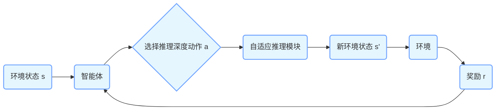

# 强化学习驱动的自适应推理深度控制

> 关键词：强化学习、自适应推理、深度控制、智能决策、模型优化

> 摘要：本文围绕强化学习驱动的自适应推理深度控制展开深入探讨。首先介绍了该领域的研究背景、目的和范围，明确预期读者和文档结构。详细阐述了核心概念及其联系，通过文本示意图和Mermaid流程图进行清晰展示。深入剖析核心算法原理，结合Python源代码进行具体操作步骤的说明。给出相关数学模型和公式，并举例说明其应用。通过项目实战，展示了开发环境搭建、源代码实现与解读。探讨了该技术在不同实际场景中的应用，推荐了学习资源、开发工具框架和相关论文著作。最后总结了未来发展趋势与挑战，并提供常见问题解答和扩展阅读参考资料，旨在为相关领域的研究和实践提供全面而深入的指导。

## 1. 背景介绍 
### 1.1 目的和范围
随着人工智能技术的不断发展，强化学习在众多领域展现出强大的应用潜力。自适应推理深度控制作为一个新兴的研究方向，旨在通过强化学习算法实现对推理过程的动态调整和优化，以提高系统的性能和效率。本文的目的在于深入研究强化学习驱动的自适应推理深度控制的原理、算法和应用，探讨其在不同场景下的有效性和可行性。范围涵盖核心概念的介绍、算法原理的分析、实际案例的实现以及未来发展趋势的展望。

### 1.2 预期读者
本文预期读者包括人工智能、机器学习、控制理论等相关领域的研究人员、工程师和学生。对于希望深入了解强化学习在自适应推理深度控制方面应用的专业人士，以及对该领域感兴趣并希望进行实践探索的初学者，本文都具有一定的参考价值。

### 1.3 文档结构概述
本文将按照以下结构进行组织：首先介绍核心概念与联系，通过文本示意图和Mermaid流程图清晰展示相关概念的架构；接着详细阐述核心算法原理，并给出具体操作步骤的Python源代码；然后介绍数学模型和公式，通过举例说明其实际应用；进行项目实战，包括开发环境搭建、源代码实现和解读；探讨该技术在实际场景中的应用；推荐学习资源、开发工具框架和相关论文著作；最后总结未来发展趋势与挑战，提供常见问题解答和扩展阅读参考资料。

### 1.4 术语表
#### 1.4.1 核心术语定义
- **强化学习（Reinforcement Learning）**：一种机器学习范式，智能体通过与环境进行交互，根据环境反馈的奖励信号来学习最优行为策略。
- **自适应推理（Adaptive Inference）**：在推理过程中，根据实时信息动态调整推理策略和参数，以适应不同的任务和环境。
- **深度控制（Deep Control）**：利用深度神经网络实现对系统的控制，通过学习复杂的非线性映射关系来优化控制策略。
- **智能体（Agent）**：在强化学习中，与环境进行交互并执行动作的实体。
- **环境（Environment）**：智能体所处的外部世界，智能体的动作会影响环境状态，并从环境中获得奖励反馈。

#### 1.4.2 相关概念解释
- **策略（Policy）**：智能体在不同状态下选择动作的规则，通常表示为一个函数 $\pi(s)$，其中 $s$ 是环境状态。
- **价值函数（Value Function）**：评估在某个状态下采取特定动作或遵循特定策略的长期价值，常用的有状态价值函数 $V(s)$ 和动作价值函数 $Q(s,a)$。
- **奖励（Reward）**：环境给予智能体的即时反馈信号，用于衡量智能体动作的好坏，智能体的目标是最大化累积奖励。

#### 1.4.3 缩略词列表
- **RL**：Reinforcement Learning（强化学习）
- **DNN**：Deep Neural Network（深度神经网络）
- **MDP**：Markov Decision Process（马尔可夫决策过程）

## 2. 核心概念与联系 

### 核心概念原理
强化学习驱动的自适应推理深度控制的核心在于将强化学习算法应用于自适应推理过程中，通过智能体与环境的交互来动态调整推理深度。在这个过程中，智能体根据当前的环境状态选择合适的推理深度，环境则根据智能体的选择给予相应的奖励反馈。智能体的目标是通过不断学习，找到能够最大化累积奖励的推理深度选择策略。

其基本原理可以基于马尔可夫决策过程（MDP）来理解。MDP 是一个五元组 $(S, A, P, R, \gamma)$，其中：
- $S$ 是环境状态的集合，在自适应推理中，状态可以包括输入数据的特征、当前推理的中间结果等。
- $A$ 是智能体可以采取的动作集合，这里的动作通常是选择不同的推理深度。
- $P$ 是状态转移概率函数，表示在当前状态 $s$ 下采取动作 $a$ 后转移到下一个状态 $s'$ 的概率 $P(s'|s,a)$。
- $R$ 是奖励函数，$R(s,a,s')$ 表示在状态 $s$ 下采取动作 $a$ 并转移到状态 $s'$ 时获得的奖励。
- $\gamma$ 是折扣因子，用于衡量未来奖励的重要性，取值范围为 $[0, 1]$。

智能体的策略 $\pi$ 定义了在每个状态 $s$ 下选择动作 $a$ 的概率 $\pi(a|s)$。智能体通过与环境交互，不断更新策略以最大化累积折扣奖励 $G_t = \sum_{k=0}^{\infty} \gamma^k R_{t+k+1}$。

### 架构的文本示意图
```plaintext
+----------------------+
|      环境 (Environment)    |
| 包含状态、状态转移和奖励机制 |
+----------------------+
           ^
           | 状态反馈
           |
+----------------------+
|      智能体 (Agent)        |
|  基于策略选择推理深度动作  |
+----------------------+
           |
           | 动作执行
           v
+----------------------+
|    自适应推理模块      |
| 根据推理深度进行推理   |
+----------------------+
```

### Mermaid 流程图


该流程图展示了智能体与环境的交互过程。智能体根据当前环境状态 $s$ 选择推理深度动作 $a$，自适应推理模块根据选择的推理深度进行推理，得到新的环境状态 $s'$。环境根据状态变化给予智能体奖励 $r$，智能体利用奖励信号更新策略，继续下一轮交互。

## 3. 核心算法原理 & 具体操作步骤 

### 算法原理
在强化学习驱动的自适应推理深度控制中，常用的算法之一是深度 Q 网络（Deep Q-Network，DQN）。DQN 结合了深度神经网络和 Q 学习算法，通过神经网络来近似动作价值函数 $Q(s,a)$。

Q 学习的目标是学习一个最优动作价值函数 $Q^*(s,a)$，使得在每个状态 $s$ 下选择的动作 $a$ 能够最大化长期累积奖励。Q 学习的更新公式为：
$$Q(s,a) \leftarrow Q(s,a) + \alpha [r + \gamma \max_{a'} Q(s',a') - Q(s,a)]$$
其中，$\alpha$ 是学习率，$r$ 是即时奖励，$\gamma$ 是折扣因子，$s'$ 是下一个状态。

DQN 使用一个深度神经网络 $Q(s,a;\theta)$ 来近似 $Q(s,a)$，其中 $\theta$ 是神经网络的参数。通过最小化损失函数来更新网络参数：
$$L(\theta) = \mathbb{E}[(r + \gamma \max_{a'} Q(s',a';\theta^-) - Q(s,a;\theta))^2]$$
其中，$\theta^-$ 是目标网络的参数，目标网络的参数定期从主网络复制得到，以提高训练的稳定性。

### 具体操作步骤及 Python 源代码
以下是一个简单的 DQN 实现示例，用于强化学习驱动的自适应推理深度控制：

```python
import numpy as np
import torch
import torch.nn as nn
import torch.optim as optim
import random
from collections import deque

# 定义深度 Q 网络
class DQN(nn.Module):
    def __init__(self, input_dim, output_dim):
        super(DQN, self).__init__()
        self.fc1 = nn.Linear(input_dim, 64)
        self.fc2 = nn.Linear(64, 64)
        self.fc3 = nn.Linear(64, output_dim)

    def forward(self, x):
        x = torch.relu(self.fc1(x))
        x = torch.relu(self.fc2(x))
        return self.fc3(x)

# 定义智能体类
class Agent:
    def __init__(self, input_dim, output_dim, learning_rate=0.001, gamma=0.99, epsilon=1.0, epsilon_decay=0.995, epsilon_min=0.01, batch_size=64, memory_size=10000):
        self.input_dim = input_dim
        self.output_dim = output_dim
        self.learning_rate = learning_rate
        self.gamma = gamma
        self.epsilon = epsilon
        self.epsilon_decay = epsilon_decay
        self.epsilon_min = epsilon_min
        self.batch_size = batch_size
        self.memory = deque(maxlen=memory_size)

        self.model = DQN(input_dim, output_dim)
        self.target_model = DQN(input_dim, output_dim)
        self.target_model.load_state_dict(self.model.state_dict())
        self.optimizer = optim.Adam(self.model.parameters(), lr=learning_rate)
        self.criterion = nn.MSELoss()

    def remember(self, state, action, reward, next_state, done):
        self.memory.append((state, action, reward, next_state, done))

    def act(self, state):
        if np.random.rand() <= self.epsilon:
            return random.randrange(self.output_dim)
        state = torch.FloatTensor(state).unsqueeze(0)
        q_values = self.model(state)
        action = torch.argmax(q_values).item()
        return action

    def replay(self):
        if len(self.memory) < self.batch_size:
            return
        minibatch = random.sample(self.memory, self.batch_size)
        states, actions, rewards, next_states, dones = zip(*minibatch)

        states = torch.FloatTensor(states)
        actions = torch.LongTensor(actions)
        rewards = torch.FloatTensor(rewards)
        next_states = torch.FloatTensor(next_states)
        dones = torch.FloatTensor(dones)

        q_values = self.model(states)
        next_q_values = self.target_model(next_states)
        next_q_values_max = torch.max(next_q_values, dim=1)[0]

        targets = q_values.clone()
        for i in range(self.batch_size):
            if dones[i]:
                targets[i][actions[i]] = rewards[i]
            else:
                targets[i][actions[i]] = rewards[i] + self.gamma * next_q_values_max[i]

        self.optimizer.zero_grad()
        loss = self.criterion(q_values, targets)
        loss.backward()
        self.optimizer.step()

        if self.epsilon > self.epsilon_min:
            self.epsilon *= self.epsilon_decay

    def update_target_model(self):
        self.target_model.load_state_dict(self.model.state_dict())

# 示例使用
input_dim = 10
output_dim = 5
agent = Agent(input_dim, output_dim)

# 模拟训练过程
for episode in range(100):
    state = np.random.rand(input_dim)
    done = False
    while not done:
        action = agent.act(state)
        # 模拟环境交互，得到奖励和下一个状态
        next_state = np.random.rand(input_dim)
        reward = np.random.rand()
        done = np.random.choice([True, False], p=[0.1, 0.9])

        agent.remember(state, action, reward, next_state, done)
        agent.replay()

        state = next_state

    if episode % 10 == 0:
        agent.update_target_model()
```

### 代码解释
1. **DQN 类**：定义了一个简单的三层全连接神经网络，用于近似动作价值函数。
2. **Agent 类**：
    - `__init__` 方法：初始化智能体的参数，包括学习率、折扣因子、探索率等，同时创建主网络和目标网络，并初始化优化器和损失函数。
    - `remember` 方法：将智能体与环境的交互经验存储到经验回放缓冲区中。
    - `act` 方法：根据当前状态选择动作，采用 $\epsilon$-贪心策略，以一定概率随机选择动作，以一定概率选择 Q 值最大的动作。
    - `replay` 方法：从经验回放缓冲区中随机采样一批经验，计算目标 Q 值，更新主网络的参数，并逐渐降低探索率。
    - `update_target_model` 方法：定期将主网络的参数复制到目标网络中，以提高训练的稳定性。
3. **示例使用部分**：模拟了一个简单的训练过程，智能体与环境进行交互，不断学习和更新策略。

## 4. 数学模型和公式 & 详细讲解 & 举例说明 

### 马尔可夫决策过程（MDP）
如前文所述，MDP 是一个五元组 $(S, A, P, R, \gamma)$。下面详细解释各元素的含义和作用：
- **状态集合 $S$**：表示环境可能处于的所有状态的集合。例如，在图像分类的自适应推理中，状态可以包括图像的特征向量、当前已经进行的推理步骤等。
- **动作集合 $A$**：智能体可以采取的所有动作的集合。在自适应推理深度控制中，动作通常是选择不同的推理深度，例如选择推理网络的不同层数。
- **状态转移概率函数 $P$**：描述了在当前状态 $s$ 下采取动作 $a$ 后转移到下一个状态 $s'$ 的概率。例如，在一个动态系统中，状态的转移可能受到噪声的影响，因此状态转移是一个概率过程。
- **奖励函数 $R$**：用于衡量智能体动作的好坏。奖励函数的设计需要根据具体的任务来确定。例如，在自适应推理中，如果选择的推理深度能够在保证推理精度的前提下减少计算量，则可以给予正奖励；反之，如果推理深度过大导致计算资源浪费，或者推理深度过小导致推理精度过低，则可以给予负奖励。
- **折扣因子 $\gamma$**：用于衡量未来奖励的重要性。$\gamma$ 越接近 1，表示智能体更看重未来的奖励；$\gamma$ 越接近 0，表示智能体更关注即时奖励。

### Q 学习公式
Q 学习的更新公式为：
$$Q(s,a) \leftarrow Q(s,a) + \alpha [r + \gamma \max_{a'} Q(s',a') - Q(s,a)]$$
- **详细讲解**：
    - $Q(s,a)$ 是当前状态 $s$ 下采取动作 $a$ 的估计 Q 值。
    - $r$ 是即时奖励，即智能体在状态 $s$ 下采取动作 $a$ 后立即获得的奖励。
    - $\gamma \max_{a'} Q(s',a')$ 是下一个状态 $s'$ 下所有可能动作的最大 Q 值的折扣值，表示未来的期望奖励。
    - $\alpha$ 是学习率，控制了每次更新时对新信息的重视程度。学习率过大，可能导致算法不稳定；学习率过小，算法收敛速度会变慢。

- **举例说明**：
假设在一个简单的迷宫游戏中，智能体处于状态 $s$（迷宫中的某个位置），选择动作 $a$（向上移动），获得即时奖励 $r = -1$（表示移动消耗了一步）。移动后到达新状态 $s'$，通过查询 Q 表得到下一个状态 $s'$ 下所有可能动作的最大 Q 值 $\max_{a'} Q(s',a') = 5$。当前状态 $s$ 下采取动作 $a$ 的 Q 值 $Q(s,a) = 2$，学习率 $\alpha = 0.1$，折扣因子 $\gamma = 0.9$。

根据 Q 学习更新公式，更新后的 Q 值为：
$$
\begin{align*}
Q(s,a) &\leftarrow Q(s,a) + \alpha [r + \gamma \max_{a'} Q(s',a') - Q(s,a)]\\
&= 2 + 0.1 \times [-1 + 0.9 \times 5 - 2]\\
&= 2 + 0.1 \times [-1 + 4.5 - 2]\\
&= 2 + 0.1 \times 1.5\\
&= 2 + 0.15\\
&= 2.15
\end{align*}
$$

### DQN 损失函数
DQN 的损失函数为：
$$L(\theta) = \mathbb{E}[(r + \gamma \max_{a'} Q(s',a';\theta^-) - Q(s,a;\theta))^2]$$
- **详细讲解**：
    - $Q(s,a;\theta)$ 是主网络在状态 $s$ 下对动作 $a$ 的 Q 值估计，由神经网络参数 $\theta$ 决定。
    - $Q(s',a';\theta^-)$ 是目标网络在状态 $s'$ 下对动作 $a'$ 的 Q 值估计，由目标网络参数 $\theta^-$ 决定。
    - 损失函数的目标是最小化主网络的 Q 值估计与目标 Q 值（$r + \gamma \max_{a'} Q(s',a';\theta^-)$）之间的均方误差。

- **举例说明**：
假设在一次训练中，从经验回放缓冲区中采样得到一个样本 $(s, a, r, s')$，主网络对状态 $s$ 下动作 $a$ 的 Q 值估计 $Q(s,a;\theta) = 3$，目标网络在状态 $s'$ 下所有可能动作的最大 Q 值 $\max_{a'} Q(s',a';\theta^-) = 4$，即时奖励 $r = 1$，折扣因子 $\gamma = 0.9$。

则目标 Q 值为 $r + \gamma \max_{a'} Q(s',a';\theta^-) = 1 + 0.9 \times 4 = 4.6$，损失值为 $(4.6 - 3)^2 = 2.56$。通过反向传播算法，根据损失值更新主网络的参数 $\theta$。

## 5. 项目实战：代码实际案例和详细解释说明 

### 5.1  开发环境搭建
#### 操作系统
推荐使用 Linux 系统（如 Ubuntu 18.04 及以上版本）或 macOS，因为这些系统对深度学习框架的支持较好。如果使用 Windows 系统，也可以进行开发，但可能会遇到一些兼容性问题。

#### 编程语言和版本
使用 Python 3.7 及以上版本，Python 是深度学习领域最常用的编程语言，具有丰富的库和工具。

#### 深度学习框架
使用 PyTorch 深度学习框架，PyTorch 提供了动态图机制，方便进行模型的构建和训练。可以通过以下命令安装 PyTorch：
```bash
pip install torch torchvision
```

#### 其他依赖库
还需要安装一些其他的依赖库，如 NumPy、Matplotlib 等，可以使用以下命令进行安装：
```bash
pip install numpy matplotlib
```

### 5.2  源代码详细实现和代码解读
以下是一个更完整的项目实战代码示例，用于强化学习驱动的自适应推理深度控制，以图像分类任务为例：

```python
import numpy as np
import torch
import torch.nn as nn
import torch.optim as optim
import random
from collections import deque
import torchvision
import torchvision.transforms as transforms
from torch.utils.data import DataLoader

# 定义深度 Q 网络
class DQN(nn.Module):
    def __init__(self, input_dim, output_dim):
        super(DQN, self).__init__()
        self.fc1 = nn.Linear(input_dim, 128)
        self.fc2 = nn.Linear(128, 128)
        self.fc3 = nn.Linear(128, output_dim)

    def forward(self, x):
        x = torch.relu(self.fc1(x))
        x = torch.relu(self.fc2(x))
        return self.fc3(x)

# 定义智能体类
class Agent:
    def __init__(self, input_dim, output_dim, learning_rate=0.001, gamma=0.99, epsilon=1.0, epsilon_decay=0.995, epsilon_min=0.01, batch_size=64, memory_size=10000):
        self.input_dim = input_dim
        self.output_dim = output_dim
        self.learning_rate = learning_rate
        self.gamma = gamma
        self.epsilon = epsilon
        self.epsilon_decay = epsilon_decay
        self.epsilon_min = epsilon_min
        self.batch_size = batch_size
        self.memory = deque(maxlen=memory_size)

        self.model = DQN(input_dim, output_dim)
        self.target_model = DQN(input_dim, output_dim)
        self.target_model.load_state_dict(self.model.state_dict())
        self.optimizer = optim.Adam(self.model.parameters(), lr=learning_rate)
        self.criterion = nn.MSELoss()

    def remember(self, state, action, reward, next_state, done):
        self.memory.append((state, action, reward, next_state, done))

    def act(self, state):
        if np.random.rand() <= self.epsilon:
            return random.randrange(self.output_dim)
        state = torch.FloatTensor(state).unsqueeze(0)
        q_values = self.model(state)
        action = torch.argmax(q_values).item()
        return action

    def replay(self):
        if len(self.memory) < self.batch_size:
            return
        minibatch = random.sample(self.memory, self.batch_size)
        states, actions, rewards, next_states, dones = zip(*minibatch)

        states = torch.FloatTensor(states)
        actions = torch.LongTensor(actions)
        rewards = torch.FloatTensor(rewards)
        next_states = torch.FloatTensor(next_states)
        dones = torch.FloatTensor(dones)

        q_values = self.model(states)
        next_q_values = self.target_model(next_states)
        next_q_values_max = torch.max(next_q_values, dim=1)[0]

        targets = q_values.clone()
        for i in range(self.batch_size):
            if dones[i]:
                targets[i][actions[i]] = rewards[i]
            else:
                targets[i][actions[i]] = rewards[i] + self.gamma * next_q_values_max[i]

        self.optimizer.zero_grad()
        loss = self.criterion(q_values, targets)
        loss.backward()
        self.optimizer.step()

        if self.epsilon > self.epsilon_min:
            self.epsilon *= self.epsilon_decay

    def update_target_model(self):
        self.target_model.load_state_dict(self.model.state_dict())

# 定义简单的图像分类模型
class SimpleClassifier(nn.Module):
    def __init__(self):
        super(SimpleClassifier, self).__init__()
        self.conv1 = nn.Conv2d(3, 16, kernel_size=3, padding=1)
        self.pool = nn.MaxPool2d(2, 2)
        self.fc1 = nn.Linear(16 * 16 * 16, 128)
        self.fc2 = nn.Linear(128, 10)

    def forward(self, x, depth):
        if depth >= 1:
            x = self.pool(torch.relu(self.conv1(x)))
        if depth >= 2:
            x = x.view(-1, 16 * 16 * 16)
            x = torch.relu(self.fc1(x))
        if depth >= 3:
            x = self.fc2(x)
        return x

# 数据加载
transform = transforms.Compose(
    [transforms.ToTensor(),
     transforms.Normalize((0.5, 0.5, 0.5), (0.5, 0.5, 0.5))])

trainset = torchvision.datasets.CIFAR10(root='./data', train=True,
                                        download=True, transform=transform)
trainloader = DataLoader(trainset, batch_size=4,
                          shuffle=True, num_workers=2)

testset = torchvision.datasets.CIFAR10(root='./data', train=False,
                                       download=True, transform=transform)
testloader = DataLoader(testset, batch_size=4,
                         shuffle=False, num_workers=2)

# 初始化智能体和分类器
input_dim = 3 * 32 * 32
output_dim = 3  # 推理深度选择：1, 2, 3
agent = Agent(input_dim, output_dim)
classifier = SimpleClassifier()

# 训练过程
num_episodes = 10
for episode in range(num_episodes):
    running_loss = 0.0
    for i, data in enumerate(trainloader, 0):
        inputs, labels = data
        inputs = inputs.view(-1, input_dim)
        state = inputs[0].numpy()

        action = agent.act(state)
        outputs = classifier(inputs.view(-1, 3, 32, 32), action + 1)
        _, predicted = torch.max(outputs.data, 1)
        correct = (predicted == labels).sum().item()
        accuracy = correct / labels.size(0)

        # 奖励函数设计
        if accuracy > 0.8:
            reward = 1
        elif accuracy > 0.5:
            reward = 0
        else:
            reward = -1

        next_state = state  # 简单假设下一个状态与当前状态相同
        done = False

        agent.remember(state, action, reward, next_state, done)
        agent.replay()

        running_loss += reward
        if i % 2000 == 1999:
            print(f'[{episode + 1}, {i + 1:5d}] reward: {running_loss / 2000:.3f}')
            running_loss = 0.0

    if episode % 10 == 0:
        agent.update_target_model()

# 测试过程
correct = 0
total = 0
with torch.no_grad():
    for data in testloader:
        images, labels = data
        images = images.view(-1, input_dim)
        for i in range(images.size(0)):
            state = images[i].numpy()
            action = agent.act(state)
            outputs = classifier(images.view(-1, 3, 32, 32)[i].unsqueeze(0), action + 1)
            _, predicted = torch.max(outputs.data, 1)
            total += 1
            correct += (predicted == labels[i]).sum().item()

print(f'Accuracy of the network on the 10000 test images: {100 * correct / total}%')
```

### 5.3  代码解读与分析
#### 整体流程
代码的整体流程包括数据加载、智能体和分类器的初始化、训练过程和测试过程。在训练过程中，智能体根据当前状态选择推理深度，分类器根据选择的推理深度进行推理，环境根据推理结果给予奖励，智能体利用奖励信号更新策略。

#### 代码模块分析
1. **DQN 类**：定义了一个简单的三层全连接神经网络，用于近似动作价值函数。输入维度为图像的特征维度，输出维度为可选择的推理深度数量。
2. **Agent 类**：智能体类，包含了经验回放、动作选择、策略更新等功能。具体方法的功能与前文介绍的示例代码类似。
3. **SimpleClassifier 类**：定义了一个简单的图像分类模型，根据不同的推理深度进行不同程度的前向传播。
4. **数据加载部分**：使用 `torchvision` 库加载 CIFAR-10 数据集，并进行预处理。
5. **训练过程**：
    - 遍历训练数据集，对于每个样本，智能体根据当前状态选择推理深度。
    - 分类器根据选择的推理深度进行推理，计算推理准确率。
    - 根据准确率设计奖励函数，智能体将交互经验存储到经验回放缓冲区中，并进行策略更新。
    - 定期更新目标网络的参数。
6. **测试过程**：在测试数据集上评估模型的性能，智能体根据学习到的策略选择推理深度，分类器进行推理，计算整体准确率。

#### 奖励函数设计
奖励函数的设计对于强化学习的效果至关重要。在本示例中，根据推理准确率来设计奖励函数：
- 当准确率大于 0.8 时，给予正奖励 1。
- 当准确率大于 0.5 时，给予奖励 0。
- 当准确率小于等于 0.5 时，给予负奖励 -1。

通过这种奖励机制，智能体可以学习到在保证一定准确率的前提下，选择合适的推理深度，以提高效率。

## 6. 实际应用场景 
### 图像分类
在图像分类任务中，不同的图像可能具有不同的复杂度。对于简单的图像，可能只需要进行浅层的推理就可以得到准确的分类结果；而对于复杂的图像，则需要进行更深层次的推理。强化学习驱动的自适应推理深度控制可以根据图像的特征动态选择推理深度，在保证分类准确率的前提下，减少计算量和推理时间。例如，在安防监控系统中，对于大量的监控图像进行实时分类时，使用自适应推理深度控制可以提高系统的处理效率。

### 自然语言处理
在自然语言处理任务中，如文本分类、情感分析等，不同的文本长度和语义复杂度也需要不同的推理深度。通过强化学习，智能体可以根据文本的特征选择合适的推理深度，例如在循环神经网络（RNN）或变换器（Transformer）模型中，动态决定处理的步数或层数。这样可以在提高处理效率的同时，保证任务的准确性。

### 机器人控制
在机器人控制领域，机器人需要根据不同的环境和任务需求做出决策。强化学习驱动的自适应推理深度控制可以帮助机器人在不同的场景下选择合适的决策深度。例如，在机器人导航任务中，对于简单的环境，机器人可以采用浅层的推理策略快速做出决策；而对于复杂的环境，如存在障碍物或动态变化的场景，则需要进行更深层次的推理和规划。

### 推荐系统
在推荐系统中，用户的兴趣和偏好是动态变化的。通过强化学习驱动的自适应推理深度控制，可以根据用户的历史行为和当前状态，动态调整推荐算法的推理深度。对于熟悉的用户，可能只需要进行简单的推理就可以给出准确的推荐；而对于新用户或兴趣变化较大的用户，则需要进行更深入的推理和分析，以提供更个性化的推荐。

## 7. 工具和资源推荐
### 7.1 学习资源推荐
#### 7.1.1 书籍推荐
- 《强化学习：原理与Python实现》：这本书系统地介绍了强化学习的基本原理和算法，通过大量的Python代码示例帮助读者理解和实践强化学习。
- 《深度学习》：由Ian Goodfellow、Yoshua Bengio和Aaron Courville撰写，是深度学习领域的经典教材，涵盖了深度学习的各个方面，包括神经网络、卷积神经网络、循环神经网络等，对于理解强化学习中的深度模型有很大帮助。
- 《动手学深度学习》：基于MXNet深度学习框架，通过大量的代码示例和详细的讲解，帮助读者快速上手深度学习和强化学习。

#### 7.1.2 在线课程
- Coursera上的“强化学习专项课程”：由DeepMind的研究人员授课，涵盖了强化学习的基础理论、算法和应用，通过编程作业和实践项目帮助学生掌握强化学习的核心知识。
- edX上的“深度学习基础”：介绍了深度学习的基本概念和算法，包括神经网络、卷积神经网络、循环神经网络等，为学习强化学习提供了必要的基础。
- 哔哩哔哩上的一些优质的强化学习教学视频：有很多博主分享了自己的学习经验和代码实现，适合初学者快速入门。

#### 7.1.3 技术博客和网站
- OpenAI博客：OpenAI是人工智能领域的领先研究机构，其博客上经常发布关于强化学习和人工智能的最新研究成果和技术文章。
- Medium上的人工智能相关博客：有很多专业的人工智能博主分享自己的研究和实践经验，涵盖了强化学习的各个方面。
- arXiv：是一个预印本数据库，包含了大量的人工智能和强化学习领域的最新研究论文，可以及时了解该领域的前沿动态。

### 7.2 开发工具框架推荐
#### 7.2.1 IDE和编辑器
- PyCharm：是一款专业的Python集成开发环境，提供了丰富的代码编辑、调试和项目管理功能，对于开发强化学习项目非常方便。
- Jupyter Notebook：是一个交互式的开发环境，可以将代码、文本和可视化结果整合在一起，适合进行实验和快速验证想法。
- Visual Studio Code：是一款轻量级的代码编辑器，支持多种编程语言和插件扩展，具有良好的代码编辑和调试功能。

#### 7.2.2 调试和性能分析工具
- TensorBoard：是TensorFlow提供的可视化工具，也可以与PyTorch结合使用。它可以帮助用户可视化训练过程中的损失函数、准确率、模型结构等信息，方便调试和分析模型性能。
- PyTorch Profiler：是PyTorch提供的性能分析工具，可以帮助用户分析模型的计算时间、内存使用情况等，找出性能瓶颈并进行优化。
- cProfile：是Python标准库中的性能分析工具，可以分析Python代码的执行时间和函数调用情况，帮助用户优化代码性能。

#### 7.2.3 相关框架和库
- PyTorch：是一个开源的深度学习框架，具有动态图机制和丰富的深度学习模型库，广泛应用于强化学习领域。
- TensorFlow：是另一个流行的深度学习框架，提供了强大的分布式训练和部署功能，也有很多强化学习的实现和工具。
- Stable Baselines3：是一个基于PyTorch的强化学习库，提供了多种经典的强化学习算法的实现，如DQN、A2C、PPO等，方便用户快速上手和进行实验。

### 7.3 相关论文著作推荐
#### 7.3.1 经典论文
- “Human-level control through deep reinforcement learning”：发表于Nature杂志，介绍了DeepMind团队使用深度Q网络（DQN）在Atari游戏上取得了超越人类水平的成绩，开创了深度强化学习的先河。
- “Asynchronous Methods for Deep Reinforcement Learning”：提出了异步优势行动者-评论家（A3C）算法，通过异步训练提高了强化学习的训练效率。
- “Proximal Policy Optimization Algorithms”：提出了近端策略优化（PPO）算法，是一种高效的策略梯度算法，在很多强化学习任务中取得了很好的效果。

#### 7.3.2 最新研究成果
- 关注NeurIPS、ICML、AAAI等人工智能顶级会议上的最新论文，这些会议上会发表很多关于强化学习和自适应推理深度控制的最新研究成果。
- 可以通过Google Scholar等学术搜索引擎，设置关键词“Reinforcement Learning for Adaptive Inference Depth Control”等，获取最新的研究论文。

#### 7.3.3 应用案例分析
- 一些工业界的应用案例分析可以在相关的技术博客和会议报告中找到。例如，Google、Microsoft等公司会分享他们在强化学习在实际业务中的应用经验，包括图像识别、自然语言处理、机器人控制等领域。

## 8. 总结：未来发展趋势与挑战
### 未来发展趋势
#### 多模态融合
未来强化学习驱动的自适应推理深度控制将与多模态数据（如图像、文本、语音等）融合，以处理更加复杂和多样化的任务。例如，在智能机器人中，结合视觉、听觉和触觉等多模态信息，智能体可以更准确地感知环境，选择更合适的推理深度和决策策略。

#### 与其他技术的结合
强化学习将与其他人工智能技术，如迁移学习、元学习等相结合。迁移学习可以帮助智能体将在一个任务中学习到的知识迁移到其他相关任务中，加快学习速度；元学习则可以让智能体学会如何学习，提高学习的灵活性和适应性。

#### 大规模应用
随着计算能力的不断提升和算法的不断优化，强化学习驱动的自适应推理深度控制将在更多的领域得到大规模应用，如自动驾驶、医疗诊断、金融投资等。在这些领域中，自适应推理深度控制可以提高系统的效率和准确性，带来巨大的经济效益和社会效益。

### 挑战
#### 数据效率问题
强化学习通常需要大量的交互数据来学习有效的策略，这在实际应用中可能会受到数据收集成本和时间的限制。如何提高数据效率，减少对大量数据的依赖，是未来需要解决的一个重要问题。

#### 环境建模和奖励设计
准确地建模环境和设计合理的奖励函数是强化学习中的关键挑战。在复杂的实际环境中，环境的动态变化和不确定性很难准确建模；奖励函数的设计也需要考虑多个因素的平衡，如短期奖励和长期奖励、局部最优和全局最优等。

#### 可解释性和安全性
强化学习模型通常是黑盒模型，其决策过程难以解释。在一些关键应用领域，如医疗和自动驾驶，模型的可解释性和安全性至关重要。如何提高强化学习模型的可解释性，确保其决策的安全性和可靠性，是未来需要研究的重要方向。

## 9. 附录：常见问题与解答
### 问题1：强化学习中的探索与利用平衡是什么意思？
答：探索与利用平衡是强化学习中的一个重要概念。探索是指智能体尝试不同的动作，以发现新的、可能更好的策略；利用是指智能体根据已有的经验选择当前认为最优的动作。在强化学习的初期，需要更多地进行探索，以获取更多的环境信息；随着学习的进行，逐渐增加利用的比例，以最大化累积奖励。常用的方法如 $\epsilon$-贪心策略，就是通过设置一个探索率 $\epsilon$ 来控制探索和利用的比例。

### 问题2：为什么DQN需要使用目标网络？
答：DQN使用目标网络是为了提高训练的稳定性。在DQN中，主网络用于估计当前状态下的Q值，目标网络用于估计下一个状态的最大Q值。如果不使用目标网络，主网络的参数在每次更新时都会发生变化，导致目标Q值也随之变化，这样会使训练过程变得不稳定。通过使用目标网络，目标Q值的更新相对较慢，减少了训练过程中的波动，提高了训练的稳定性。

### 问题3：如何设计合适的奖励函数？
答：设计合适的奖励函数需要考虑以下几个方面：
- **任务目标**：奖励函数应该与任务的最终目标相一致。例如，在图像分类任务中，奖励可以与分类准确率相关；在机器人导航任务中，奖励可以与到达目标的距离和时间相关。
- **短期和长期奖励**：需要平衡短期奖励和长期奖励。有时候，为了获得长期的最优结果，可能需要在短期内接受一些负奖励。例如，在游戏中，为了获得更高的最终得分，可能需要在前期牺牲一些分数来探索新的区域。
- **稀疏奖励问题**：如果奖励过于稀疏，智能体可能很难学习到有效的策略。可以通过设计一些中间奖励来缓解稀疏奖励问题，帮助智能体更快地学习。

### 问题4：强化学习和监督学习有什么区别？
答：强化学习和监督学习是两种不同的机器学习范式，它们的主要区别如下：
- **数据标签**：监督学习需要有明确的输入-输出标签对，模型的目标是学习输入和输出之间的映射关系；而强化学习没有明确的标签，智能体通过与环境交互获得奖励信号，目标是最大化累积奖励。
- **学习方式**：监督学习是通过对已有数据的学习来进行预测；而强化学习是通过不断地尝试和错误，在环境中进行实时学习和决策。
- **应用场景**：监督学习适用于分类、回归等任务；而强化学习适用于需要进行序列决策的任务，如游戏、机器人控制等。

## 10. 扩展阅读 & 参考资料
### 扩展阅读
- Sutton, Richard S., and Andrew G. Barto. Reinforcement Learning: An Introduction. MIT press, 2018.
- Silver, David, et al. "Mastering the game of Go with deep neural networks and tree search." nature 529.7587 (2016): 484-489.
- Lillicrap, Timothy P., et al. "Continuous control with deep reinforcement learning." arXiv preprint arXiv:1509.02971 (2015).

### 参考资料
- OpenAI Gym官方文档：https://gym.openai.com/docs/
- PyTorch官方文档：https://pytorch.org/docs/stable/index.html
- Stable Baselines3官方文档：https://stable-baselines3.readthedocs.io/en/master/

作者：AI天才研究院/AI Genius Institute & 禅与计算机程序设计艺术 /Zen And The Art of Computer Programming