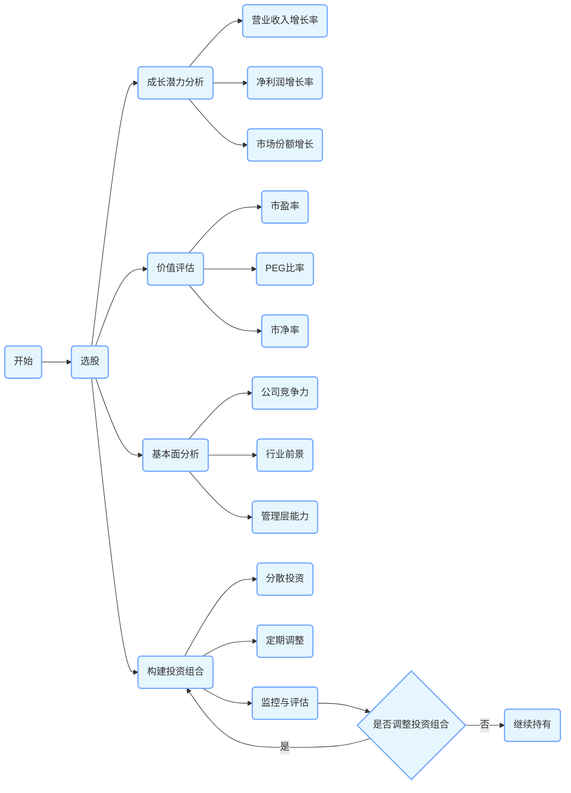

# 彼得·林奇的成长型价值投资方法论

> 关键词：彼得·林奇、成长型价值投资、选股策略、财务分析、投资组合管理

> 摘要：本文深入探讨了彼得·林奇的成长型价值投资方法论。首先介绍了该方法论产生的背景、适用的读者群体以及文档的整体结构。接着详细阐述了核心概念，包括成长型价值投资的原理和架构，并给出了相应的示意图和流程图。通过Python代码对核心算法原理和具体操作步骤进行了说明，同时给出了相关的数学模型和公式并举例解释。在项目实战部分，提供了开发环境搭建的指导、源代码实现及详细解读。还探讨了该方法论的实际应用场景，推荐了学习资源、开发工具框架和相关论文著作。最后总结了其未来发展趋势与挑战，并提供了常见问题解答和扩展阅读参考资料，旨在帮助投资者全面理解和运用彼得·林奇的投资方法。

## 1. 背景介绍 
### 1.1 目的和范围
彼得·林奇是投资界的传奇人物，他所倡导的成长型价值投资方法论影响深远。本文的目的在于深入剖析这一方法论，让投资者能够全面理解其核心思想、操作步骤和应用场景。我们将探讨从选股到投资组合管理的整个过程，涵盖基本面分析、财务指标评估等多个方面。同时，我们会结合实际案例和Python代码，帮助读者更好地掌握这一投资方法。本文的范围不仅局限于理论讲解，还注重实际应用和可操作性，旨在为不同水平的投资者提供有价值的参考。

### 1.2 预期读者
本文预期读者包括对投资领域感兴趣的初学者、有一定投资经验但希望进一步提升投资能力的投资者、金融专业的学生以及从事投资研究的专业人士。无论您是刚刚踏入投资领域，还是已经在市场中摸爬滚打多年，都能从本文中获取关于彼得·林奇成长型价值投资方法论的深入知识和实用技巧。

### 1.3 文档结构概述
本文将按照以下结构展开：首先介绍核心概念与联系，让读者对成长型价值投资有一个清晰的认识；接着详细讲解核心算法原理和具体操作步骤，并通过Python代码进行演示；然后给出相关的数学模型和公式，并举例说明；在项目实战部分，我们将介绍开发环境搭建、源代码实现和代码解读；之后探讨该方法论的实际应用场景；再推荐一些学习资源、开发工具框架和相关论文著作；最后总结未来发展趋势与挑战，提供常见问题解答和扩展阅读参考资料。

### 1.4 术语表
#### 1.4.1 核心术语定义
- **成长型价值投资**：一种投资策略，注重寻找那些具有高成长潜力且价值被低估的公司进行投资，通过长期持有来获取资本增值。
- **PEG比率**：市盈率相对盈利增长比率，用于衡量股票的估值是否合理，计算公式为市盈率除以盈利增长率。
- **每股收益（EPS）**：公司净利润与发行在外普通股股数的比率，反映了每股股票的盈利水平。
- **净资产收益率（ROE）**：净利润与平均股东权益的百分比，衡量公司运用自有资本的效率。

#### 1.4.2 相关概念解释
- **价值被低估**：指股票的市场价格低于其内在价值，可能是由于市场情绪、短期业绩波动等因素导致。
- **成长潜力**：公司在未来一段时间内实现盈利增长、市场份额扩大等方面的可能性。
- **投资组合管理**：通过合理配置不同的资产，以达到降低风险、提高收益的目的。

#### 1.4.3 缩略词列表
- **PEG**：Price/Earnings to Growth Ratio（市盈率相对盈利增长比率）
- **EPS**：Earnings Per Share（每股收益）
- **ROE**：Return on Equity（净资产收益率）

## 2. 核心概念与联系 
### 核心概念原理
彼得·林奇的成长型价值投资方法论核心在于寻找那些具有高成长潜力且价值被低估的公司。成长型投资强调公司的未来发展前景，关注公司的营业收入、净利润等指标的增长情况。而价值投资则注重股票的内在价值，通过分析公司的财务报表、行业地位等因素，判断股票的价格是否合理。

成长型价值投资并不是简单地追求高成长或低估值，而是要找到两者的平衡点。一家公司即使有很高的成长潜力，但如果其股票价格已经被过度炒作，估值过高，那么投资风险也会相应增加。相反，一家价值被低估的公司，如果其成长前景不佳，也可能无法为投资者带来理想的回报。

### 架构的文本示意图
```plaintext
成长型价值投资方法论
|-- 选股标准
|   |-- 成长潜力指标
|   |   |-- 营业收入增长率
|   |   |-- 净利润增长率
|   |   |-- 市场份额增长
|   |-- 价值评估指标
|   |   |-- 市盈率
|   |   |-- PEG比率
|   |   |-- 市净率
|-- 投资组合管理
|   |-- 分散投资
|   |-- 定期调整
|-- 基本面分析
|   |-- 公司竞争力
|   |-- 行业前景
|   |-- 管理层能力
```

### Mermaid流程图


## 3. 核心算法原理 & 具体操作步骤 
### 核心算法原理
彼得·林奇的成长型价值投资方法论的核心算法主要围绕选股和投资组合管理展开。在选股方面，我们可以使用PEG比率来评估股票的估值是否合理。PEG比率的计算公式为：

$$PEG = \frac{PE}{g}$$

其中，$PE$ 是市盈率，$g$ 是盈利增长率。一般来说，PEG比率小于1表示股票可能被低估，具有投资价值。

在投资组合管理方面，我们可以使用分散投资的方法来降低风险。分散投资是指将资金投资于不同行业、不同规模的公司股票，以避免因个别公司或行业的波动而导致整个投资组合的大幅波动。

### 具体操作步骤
1. **数据收集**：收集公司的财务报表、行业数据等信息，包括营业收入、净利润、市盈率、盈利增长率等指标。
2. **成长潜力分析**：计算公司的营业收入增长率、净利润增长率等指标，评估公司的成长潜力。
3. **价值评估**：计算公司的PEG比率、市盈率、市净率等指标，评估公司的价值是否被低估。
4. **基本面分析**：分析公司的竞争力、行业前景、管理层能力等因素，判断公司的长期发展前景。
5. **选股**：根据成长潜力分析、价值评估和基本面分析的结果，筛选出具有投资价值的股票。
6. **构建投资组合**：将选出的股票按照一定的比例构建投资组合，进行分散投资。
7. **监控与评估**：定期监控投资组合的表现，根据市场情况和公司基本面的变化，调整投资组合。

### Python源代码实现
```python
import pandas as pd

# 定义计算PEG比率的函数
def calculate_peg(pe, growth_rate):
    """
    计算PEG比率
    :param pe: 市盈率
    :param growth_rate: 盈利增长率
    :return: PEG比率
    """
    if growth_rate == 0:
        return float('inf')
    return pe / growth_rate

# 示例数据
data = {
    '公司名称': ['公司A', '公司B', '公司C'],
    '市盈率': [20, 15, 25],
    '盈利增长率': [0.2, 0.15, 0.3]
}

df = pd.DataFrame(data)

# 计算PEG比率
df['PEG比率'] = df.apply(lambda row: calculate_peg(row['市盈率'], row['盈利增长率']), axis=1)

# 筛选出PEG比率小于1的公司
selected_stocks = df[df['PEG比率'] < 1]

print("筛选出的具有投资价值的公司：")
print(selected_stocks)
```

### 代码解释
上述代码实现了计算PEG比率并筛选出具有投资价值的公司的功能。首先，定义了一个 `calculate_peg` 函数，用于计算PEG比率。然后，创建了一个包含公司名称、市盈率和盈利增长率的示例数据框。接着，使用 `apply` 方法计算每个公司的PEG比率，并将结果添加到数据框中。最后，筛选出PEG比率小于1的公司并打印输出。

## 4. 数学模型和公式 & 详细讲解 & 举例说明 
### 数学模型和公式
#### PEG比率
$$PEG = \frac{PE}{g}$$

其中，$PE$ 是市盈率，计算公式为：

$$PE = \frac{P}{EPS}$$

$P$ 是股票价格，$EPS$ 是每股收益。$g$ 是盈利增长率，通常使用过去几年的平均盈利增长率来估计。

#### 市净率（PB）
$$PB = \frac{P}{BVPS}$$

其中，$P$ 是股票价格，$BVPS$ 是每股净资产。

#### 净资产收益率（ROE）
$$ROE = \frac{净利润}{平均股东权益} \times 100\%$$

### 详细讲解
- **PEG比率**：PEG比率综合考虑了股票的市盈率和盈利增长率，是衡量股票估值是否合理的重要指标。一般来说，PEG比率小于1表示股票可能被低估，具有投资价值；PEG比率大于1表示股票可能被高估，投资风险较大。
- **市净率**：市净率反映了股票价格与每股净资产的关系。市净率较低的股票可能被低估，但也可能意味着公司的盈利能力较弱。
- **净资产收益率**：净资产收益率衡量了公司运用自有资本的效率。较高的净资产收益率表示公司能够有效地利用股东的资金创造利润。

### 举例说明
假设公司A的股票价格为50元，每股收益为2元，过去几年的平均盈利增长率为30%，每股净资产为10元。则：

- 市盈率 $PE = \frac{50}{2} = 25$
- 盈利增长率 $g = 0.3$
- PEG比率 $PEG = \frac{25}{0.3} \approx 83.33$
- 市净率 $PB = \frac{50}{10} = 5$
- 假设公司A的净利润为1000万元，平均股东权益为5000万元，则净资产收益率 $ROE = \frac{1000}{5000} \times 100\% = 20\%$

从PEG比率来看，公司A的股票可能被高估；从市净率来看，市净率为5，处于中等水平；从净资产收益率来看，20%的ROE表明公司的盈利能力较强。综合考虑，投资者需要进一步分析公司的基本面和行业前景，以做出投资决策。

## 5. 项目实战：代码实际案例和详细解释说明 
### 5.1  开发环境搭建
#### 安装Python
首先，需要安装Python环境。可以从Python官方网站（https://www.python.org/downloads/）下载适合您操作系统的Python安装包，并按照安装向导进行安装。

#### 安装必要的库
在安装好Python后，需要安装一些必要的库，如 `pandas`、`numpy` 等。可以使用以下命令进行安装：
```sh
pip install pandas numpy
```

### 5.2  源代码详细实现和代码解读
```python
import pandas as pd
import numpy as np

# 模拟收集公司数据
data = {
    '公司名称': ['公司A', '公司B', '公司C', '公司D', '公司E'],
    '市盈率': [20, 15, 25, 18, 30],
    '盈利增长率': [0.2, 0.15, 0.3, 0.25, 0.1],
    '市净率': [2, 1.5, 2.5, 1.8, 3],
    '净资产收益率': [0.15, 0.12, 0.2, 0.18, 0.1]
}

df = pd.DataFrame(data)

# 计算PEG比率
def calculate_peg(row):
    if row['盈利增长率'] == 0:
        return float('inf')
    return row['市盈率'] / row['盈利增长率']

df['PEG比率'] = df.apply(calculate_peg, axis=1)

# 筛选出符合条件的公司
selected_stocks = df[(df['PEG比率'] < 1) & (df['市净率'] < 2) & (df['净资产收益率'] > 0.15)]

# 构建投资组合
portfolio = selected_stocks[['公司名称']]
portfolio['权重'] = 1 / len(portfolio)

print("筛选出的具有投资价值的公司：")
print(selected_stocks)
print("投资组合：")
print(portfolio)
```

### 代码解读与分析
1. **数据模拟**：使用字典 `data` 模拟收集了5家公司的市盈率、盈利增长率、市净率和净资产收益率等数据，并将其转换为 `pandas` 数据框 `df`。
2. **计算PEG比率**：定义了一个 `calculate_peg` 函数，用于计算每家公司的PEG比率，并将结果添加到数据框中。
3. **筛选公司**：使用条件筛选出PEG比率小于1、市净率小于2且净资产收益率大于0.15的公司。
4. **构建投资组合**：从筛选出的公司中提取公司名称，并为每家公司分配相同的权重，构建投资组合。
5. **输出结果**：打印筛选出的具有投资价值的公司和投资组合。

通过这个案例，我们可以看到如何使用Python代码实现彼得·林奇的成长型价值投资方法论的选股和投资组合构建过程。

## 6. 实际应用场景 
### 个人投资者
对于个人投资者来说，彼得·林奇的成长型价值投资方法论可以帮助他们在众多的股票中筛选出具有投资价值的公司。个人投资者可以通过分析公司的财务报表、行业数据等信息，使用PEG比率、市净率等指标评估股票的估值，选择那些成长潜力大且价值被低估的股票进行投资。同时，通过分散投资构建投资组合，可以降低投资风险。

### 基金经理
基金经理可以运用这一方法论来管理基金资产。他们可以通过深入研究公司的基本面和行业前景，筛选出符合投资标准的股票，并根据市场情况和基金的投资目标，调整投资组合。例如，在市场行情较好时，可以适当增加成长型股票的比例；在市场行情不稳定时，可以增加价值型股票的比例，以保证基金的稳健收益。

### 金融机构研究人员
金融机构的研究人员可以使用彼得·林奇的方法论进行市场研究和投资策略分析。他们可以通过对大量公司数据的分析，总结出不同行业的投资机会和风险，为金融机构的投资决策提供参考。同时，研究人员还可以对这一方法论进行改进和创新，以适应不断变化的市场环境。

## 7. 工具和资源推荐
### 7.1 学习资源推荐
#### 7.1.1 书籍推荐
- 《彼得·林奇的成功投资》：彼得·林奇亲自撰写的投资经典著作，详细介绍了他的投资理念、选股方法和投资组合管理技巧。
- 《战胜华尔街》：进一步阐述了彼得·林奇的投资策略，通过大量的案例分析，帮助读者更好地理解和应用他的方法。
- 《聪明的投资者》：本杰明·格雷厄姆的经典著作，价值投资的奠基之作，对彼得·林奇的投资理念产生了重要影响。

#### 7.1.2 在线课程
- Coursera上的“投资学原理”课程：系统介绍了投资学的基本原理和方法，包括价值投资、成长投资等内容。
- edX上的“金融市场”课程：由耶鲁大学教授罗伯特·席勒主讲，涵盖了金融市场的各个方面，对投资决策有很大的帮助。

#### 7.1.3 技术博客和网站
- 雪球网：国内知名的投资社区，汇聚了众多投资者的经验和观点，可以学习到不同的投资策略和方法。
- Seeking Alpha：国外的投资研究网站，提供大量的股票分析报告和投资建议。

### 7.2 开发工具框架推荐
#### 7.2.1 IDE和编辑器
- PyCharm：专业的Python集成开发环境，具有强大的代码编辑、调试和分析功能。
- Jupyter Notebook：交互式的开发环境，适合进行数据分析和代码演示。

#### 7.2.2 调试和性能分析工具
- pdb：Python自带的调试工具，可以帮助开发者定位和解决代码中的问题。
- cProfile：Python的性能分析工具，可以分析代码的运行时间和性能瓶颈。

#### 7.2.3 相关框架和库
- pandas：强大的数据处理和分析库，在金融数据分析中应用广泛。
- numpy：用于科学计算和数值处理的库，提供了高效的数组操作功能。

### 7.3 相关论文著作推荐
#### 7.3.1 经典论文
- 《证券分析》：本杰明·格雷厄姆和大卫·多德的经典论文，奠定了价值投资的理论基础。
- 《有效市场假说》：尤金·法玛提出的理论，对金融市场的有效性进行了深入探讨。

#### 7.3.2 最新研究成果
- 可以关注《金融研究》、《经济研究》等学术期刊，了解投资领域的最新研究动态。
- 参加国际金融学术会议，如美国金融协会年会（AFA），获取最新的研究成果。

#### 7.3.3 应用案例分析
- 可以通过研究一些知名基金公司的投资报告和案例，了解他们如何应用成长型价值投资方法论进行投资决策。
- 分析一些成功投资者的投资案例，学习他们的选股思路和投资策略。

## 8. 总结：未来发展趋势与挑战
### 未来发展趋势
- **数据驱动的投资决策**：随着信息技术的不断发展，投资者可以获取更多的公司数据和市场信息。未来，成长型价值投资方法论将更加依赖于数据分析和量化模型，以提高投资决策的准确性和效率。
- **跨领域融合**：投资领域将与人工智能、机器学习等技术进行更深入的融合。通过运用人工智能算法，可以对大量的数据进行分析和挖掘，发现潜在的投资机会。同时，投资决策也将考虑更多的因素，如环境、社会和治理（ESG）因素等。
- **全球化投资**：随着全球经济的一体化，投资者将有更多的机会进行全球化投资。成长型价值投资方法论将适用于不同国家和地区的市场，投资者需要了解不同市场的特点和规则，进行更加多元化的投资组合管理。

### 挑战
- **市场不确定性增加**：全球政治经济环境的不确定性增加，如贸易摩擦、地缘政治冲突等，将对市场产生较大的影响。投资者需要更加敏锐地捕捉市场变化，及时调整投资策略。
- **数据质量和隐私问题**：在数据驱动的投资决策中，数据的质量和隐私问题至关重要。不准确或不完整的数据可能导致错误的投资决策，而数据隐私问题也可能引发法律风险。
- **竞争加剧**：随着投资市场的不断发展，越来越多的投资者和机构采用成长型价值投资方法论，市场竞争将更加激烈。投资者需要不断提升自己的投资能力和研究水平，才能在市场中获得超额收益。

## 9. 附录：常见问题与解答
### 问题1：PEG比率小于1一定意味着股票具有投资价值吗？
答：PEG比率小于1只是一个参考指标，并不一定意味着股票具有投资价值。PEG比率的计算依赖于盈利增长率的估计，而盈利增长率是一个预测值，存在一定的不确定性。此外，还需要考虑公司的基本面、行业前景等因素。例如，一家公司的盈利增长率可能是由于一次性事件导致的，不具有可持续性，即使PEG比率小于1，也不一定值得投资。

### 问题2：如何准确估计公司的盈利增长率？
答：可以通过分析公司过去几年的财务报表，计算其营业收入和净利润的增长率，并结合行业的发展趋势和公司的战略规划，对未来的盈利增长率进行合理估计。同时，还可以参考分析师的预测，但需要注意分析师的预测也存在一定的误差。

### 问题3：投资组合中的股票数量多少合适？
答：投资组合中的股票数量没有一个固定的标准，一般来说，建议投资组合中包含10 - 20只不同行业、不同规模的股票，以达到分散风险的目的。但具体的股票数量还需要根据投资者的资金规模、风险承受能力和投资目标等因素来确定。

### 问题4：成长型价值投资方法论适用于所有市场吗？
答：成长型价值投资方法论适用于大多数市场，但不同市场的特点和规则可能会有所不同。在新兴市场，由于市场的有效性相对较低，可能存在更多的价值被低估的股票，但同时也伴随着更高的风险。在成熟市场，市场的有效性较高，寻找价值被低估的股票相对较难，但市场的稳定性也较高。投资者需要根据不同市场的特点，灵活运用这一方法论。

## 10. 扩展阅读 & 参考资料
### 扩展阅读
- 《漫步华尔街》：介绍了各种投资理论和策略，对成长型价值投资方法论有一定的补充和拓展。
- 《财务报表分析》：深入讲解了如何分析公司的财务报表，对于运用成长型价值投资方法论进行选股有很大的帮助。

### 参考资料
- Lynch, Peter. One Up on Wall Street. Simon & Schuster, 1989.
- Graham, Benjamin. The Intelligent Investor. HarperBusiness, 2003.
- Fama, Eugene F. "Efficient Capital Markets: A Review of Theory and Empirical Work." The Journal of Finance, vol. 25, no. 2, 1970, pp. 383-417.

作者：AI天才研究院/AI Genius Institute & 禅与计算机程序设计艺术 /Zen And The Art of Computer Programming